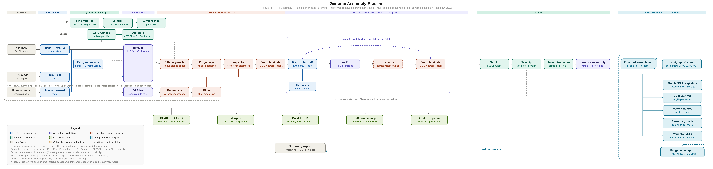

# gcl_genome_assembly

**Nextflow DSL2 pipeline for reference-quality eukaryotic genome assembly**

**Author:** Jason Selwyn · **Group:** TAMUCC CORE / birdlab (GCL) · **Executor:** SLURM (Crest HPC) · **Package manager:** conda + Singularity

A modular, multi-input Nextflow pipeline that takes raw reads to chromosome-level assemblies with
extensive QC, taxonomy-aware defaults, and an optional per-species pangenome graph. Inputs are
declared per sample in a wide, header-driven sample sheet; the pipeline routes each sample to the
appropriate assembler and finishing chain based on which read types it has.

Supported today:

| Input | Contig assembly | Dedup / conditioning | Scaffolding | Finishing | Organelle |
|---|---|---|---|---|---|
| HiFi + Hi-C | hifiasm (phased, `--h1/--h2`) | purge_dups (opt) | YaHS ×1–2 | TGSGapCloser → teloclip | MitoHiFi |
| HiFi only | hifiasm | purge_dups (opt) | — | teloclip | MitoHiFi |
| Short read (PE) | SPAdes | redundans → Pilon (opt) | — | — | GetOrganelle → MITOS2 |

`tellseq_r1/r2` columns are parsed and validated but no linked-read scaffolder is wired yet;
short-read + Hi-C scaffolding is likewise not yet routed (short-read assemblies finalize after
decontamination). See [Known gaps](#known-gaps--roadmap).

---



## Contents

1. [Requirements](#requirements)
2. [Quick start](#quick-start)
3. [Input: the sample sheet](#input-the-sample-sheet)
4. [Databases](#databases)
5. [Pipeline flow](#pipeline-flow)
6. [Stage-by-stage detail](#stage-by-stage-detail)
7. [Assembly QC checkpoints](#assembly-qc-checkpoints)
8. [Pangenome](#pangenome)
9. [Parameter reference](#parameter-reference)
10. [Outputs](#outputs)
11. [Reports](#reports)
12. [Execution profiles and resources](#execution-profiles-and-resources)
13. [Caching and resume](#caching-and-resume)
14. [Developer notes](#developer-notes)
15. [Known gaps / roadmap](#known-gaps--roadmap)
16. [Citations](#citations)

---

## Requirements

**Infrastructure**

- Nextflow ≥ 23.10 (developed and run against 23.10.1; the caching notes below assume that hashing behaviour)
- SLURM (the `slurm` profile is the production path) or local execution
- conda (env cache at `/work/birdlab/.conda_builds`) **and** Singularity (cache at `/work/birdlab/singularity_cache`)
- Scratch space at `/scratch` (most heavy processes use `scratch = '/scratch'`, several with `stageInMode = 'copy'`)
- Database storage: FCS-GX alone is ~500 GB

**Software** — all resolved automatically per process, either from conda specs in `nextflow.config`,
a YAML in `environments/`, or a container:

| Role | Tools |
|---|---|
| Long-read assembly | hifiasm, gfatools |
| Short-read assembly | SPAdes, redundans, Pilon, rasusa (subsampling), seqkit |
| Genome profiling | jellyfish, GenomeScope2 |
| Organelles | MitoHiFi (container), GetOrganelle, MITOS2, pyCirclize |
| Misassembly correction | Inspector |
| Duplicate purging | purge_dups, minimap2 |
| Hi-C | bwa-mem2, pairtools, cooler, HiCExplorer, YaHS |
| Gap filling / telomeres | TGSGapCloser, teloclip, tidk |
| Decontamination | NCBI FCS-GX (Singularity), FCS-adaptor, DIAMOND, BlobToolKit (branch disabled) |
| Assembly QC | QUAST, Merqury (meryl), BUSCO, samtools/minimap2 mapping stats, MultiQC |
| Taxonomy | taxonkit, csvtk, NCBI taxdump |
| Pangenome | Minigraph-Cactus v3.1.4 (container), vg, odgi, minigraph, panacus, vcfbub, bcftools |
| Visualization / reporting | R (tidyverse, ggplot2, ape, ggrepel, rmarkdown), pafr, BlobToolKit snail plots, Python |

Container images pinned in config: `cactus:v3.1.4` (± `-gpu`), `ghcr.io/marcelauliano/mitohifi:master`,
NCBI `fcs-gx.sif`.

---

## Quick start

```bash
# Minimal run (HiFi + Hi-C diploid)
nextflow run main.nf \
  --sample_sheet samples.csv \
  --outdir ./results \
  -profile slurm \
  -resume
```

```bash
# Typical production run: taxonomy-driven defaults, QC only on the final assembly,
# pangenome enabled
nextflow run main.nf \
  --sample_sheet samples.csv \
  --outdir /work/birdlab/jselwyn/results \
  --taxid 373251 \
  --qc_mode final_only \
  --run_pangenome true \
  -profile slurm \
  -resume
```

```bash
# Short-read-only run
nextflow run main.nf \
  --sample_sheet sr_samples.csv \
  --outdir ./results \
  --taxid 8010 \
  --run_pilon true \
  -profile slurm -resume
```

Nothing about organism identity needs to be hard-coded: give a `taxid` (globally or per row) and the
pipeline derives the BUSCO lineage, telomere motif, mitochondrial genetic code, and GetOrganelle
target set from the NCBI taxonomy. Every derived value remains overridable by parameter.

---

## Input: the sample sheet

`--sample_sheet` takes a **wide, header-driven CSV**. Column order is irrelevant, unrecognized
columns are ignored, and a read type counts as present for a sample only if its column exists *and*
the cell is non-empty. Relative paths resolve against the sample sheet's own directory.

### Read columns

| Column | Meaning |
|---|---|
| `sample_id` | **Required.** Unique identifier; used in all output naming |
| `hifi_bam` | PacBio HiFi reads (unaligned BAM) |
| `hic_r1`, `hic_r2` | Hi-C paired FASTQ (both required if either is given) |
| `sr_r1`, `sr_r2` | Illumina PE shotgun FASTQ (both required if either is given) |
| `tellseq_r1`, `tellseq_r2` | TellSeq linked reads — parsed and validated, not yet consumed |

Every sample needs at least one **contig-capable** read type (`hifi_bam` or `sr_r1`/`sr_r2`). Hi-C
and TellSeq are scaffolding-only and cannot assemble on their own.

### Optional strategy columns

Each of these can be set globally as a parameter *or* per row; **the row wins**, and if neither is
given a data-driven default applies.

| Column / param | Values | Default |
|---|---|---|
| `taxid` | NCBI taxonomy ID | none (BUSCO falls back to `busco_lineage`) |
| `species` | scientific name; used for naming and the MitoHiFi reference search | derived from `taxid` |
| `assembler` | `hifiasm` \| `spades` | `hifiasm` if HiFi present, else `spades` |
| `ploidy` | positive integer, or `haploid` / `diploid` — **organism** ploidy (GenomeScope `-p`, hifiasm `--n-hap`) | `diploid` |
| `n_hap` | `1` \| `2` — **output** haplotype count | SPAdes → 1; hifiasm → 1 if `ploidy==1` else 2 |
| `dedup` | `purge_dups` \| `redundans` \| `none` | hifiasm → `purge_dups` if `run_purge_dups` else `none`; SPAdes → `redundans` |
| `mito_tool` | `mitohifi` \| `mitofinder` \| `none` | `mitohifi` with HiFi, else `mitofinder` |
| `haploid_genome_size` | bp value, `auto`, or blank | `auto` (see below) |

**`ploidy` vs `n_hap` is the distinction to internalize.** `ploidy` describes the organism;
`n_hap` describes how many assemblies come out. A collapsed diploid assembly is
`ploidy=2, n_hap=1` (hifiasm `--primary`) — *not* `ploidy=1`, which would mislabel the organism for
GenomeScope and hifiasm. `n_hap=2` forks the sample into `<sample>_hap1` / `<sample>_hap2`;
`n_hap=1` produces a single `<sample>_primary`.

`haploid_genome_size` has three modes: a bp value pins the size; `auto` (the default) hands the
decision to hifiasm's own estimate; `null` uses the GenomeScope2 estimate computed by
`ESTIMATE_GENOME_SIZE`.

### Error policy

Per-row problems — bad enum value, half a read pair, a missing file, no contig-capable reads —
**log a warning and skip that row.** The run only hard-fails if the header lacks `sample_id` or no
valid rows remain. This is deliberate (it lets a batch proceed when one library is unavailable) but
it means a silently dropped sample looks identical to a sample you never added. After launching,
confirm the parse:

```bash
grep -E "parsed '|Skipping row|Successfully parsed" .nextflow.log
```

### Examples

Legacy 4-column sheet (still valid, resolves to diploid hifiasm + Hi-C):

```csv
sample_id,hifi_bam,hic_r1,hic_r2
Sde-CBau_104,bam/m84066_251218_031205_s4.hifi_reads.bc2064.bam,fastq/hic/Sde_CBau_104_R1.fq.gz,fastq/hic/Sde_CBau_104_R2.fq.gz
Sde-CPla_115,bam/m84066_260114_212201_s2.hifi_reads.bc2086.bam,fastq/hic/Sde_CPla_115_R1.fq.gz,fastq/hic/Sde_CPla_115_R2.fq.gz
```

Mixed batch with per-row strategy:

```csv
sample_id,taxid,hifi_bam,hic_r1,hic_r2,sr_r1,sr_r2,ploidy,n_hap,assembler,dedup
Sde-CBau_104,373251,bam/Sde_CBau_104.hifi.bam,fastq/hic/Sde_CBau_104_R1.fq.gz,fastq/hic/Sde_CBau_104_R2.fq.gz,,,diploid,2,hifiasm,purge_dups
Sde-CTlk_101,373251,,,,,,diploid,,,
Gob-COPE_0922,8010,,,,fastq/sr/COPE_0922_R1.fq.gz,fastq/sr/COPE_0922_R2.fq.gz,diploid,1,spades,redundans
Sde-CMat_203,373251,bam/Sde_CMat_203.hifi.bam,,,,,diploid,1,hifiasm,none
```

Row 2 (`Sde-CTlk_101`) has no contig-capable reads and **will be skipped with a warning**. Row 4 is
HiFi-only with a collapsed output: it assembles and finishes but skips the whole Hi-C chain and
gap filling.

---

## Databases

Downloaded and cached on first use under `--db_base` (default `/work/birdlab/databases`).

| Database | Parameter | Size | Notes |
|---|---|---|---|
| NCBI taxdump | `--diamond_taxdump_dir` | ~500 MB | Required for taxonomy resolution (`taxonkit`) whenever `taxid` is used |
| BUSCO lineages | `--busco_downloads`, `--busco_lineage` | 1–10 GB each | One download per **distinct** lineage across the run; lineage is derived per taxid |
| FCS-GX | `--gxdb_dir`, `--gxdb_profile` | ~500 GB | Needed when `run_decon_contigs` / `run_decon_scaffolds` |
| MITOS2 refseq sets | `--mitos_downloads`, `--mitos_refseq_sets` | ~1 GB | Short-read organelle annotation (metazoan / fungal) |
| GetOrganelle seeds | `--getorganelle_downloads` | ~1 GB | Short-read organelle assembly |
| DIAMOND protein DB | `--diamond_dir`, `--diamond_fasta_url` | 200+ GB | Only for the BlobToolKit evidence branch (off by default) |

---

## Pipeline flow

```
sample sheet (wide, header-driven)
   │
   ├─ taxid ─► DOWNLOAD_TAXDUMP ─► RESOLVE_TAXONOMY ─┬─► BUSCO lineage
   │                                                 ├─► telomere motif
   │                                                 ├─► mito genetic code
   │                                                 └─► GetOrganelle targets
   ├─ hifi_bam ──► BAM_TO_FASTQ ──────┐
   ├─ hic_r1/r2 ─► TRIM_HIC (fastp) ──┤
   └─ sr_r1/r2 ──► TRIM_SHORTREAD ────┤   (+ rasusa subsample to --shortread_target_depth)
                                      │
              ESTIMATE_GENOME_SIZE (jellyfish → GenomeScope2), in parallel
                                      │
              ORGANELLE   HiFi → MitoHiFi (+ circular map)
                          PE   → GetOrganelle → MITOS2 → GenBank + circular map
                                      │
              CONTIG_ASSEMBLY   hifiasm (HiFi ± Hi-C phasing) | SPAdes (PE)
                                      │  fork → hap1 + hap2, or primary
              FILTER_ORGANELLE  (drop mito/plastid contigs from the nuclear assembly)
                    ├── long-read path : purge_dups (opt) → Inspector (opt)
                    └── short-read path: redundans (reduce/scaffold/gapclose) → Pilon (opt)
                                      │
              FCS-GX decontamination (opt; screens both paths, per-sample taxid)
                    ├── short-read  ─────────────────────────────► FINALIZE
                    ├── HiFi-only   ─────────────────────► GAP-FILL bypass
                    └── HiFi + Hi-C : bwa-mem2 → pairtools filter → YaHS round 1
                                        → Inspector (opt) → FCS-GX (opt)
                                        → [re-map + YaHS round 2, conditional]
                                      │
              GAP_FILLING (TGSGapCloser, long-read only)
              TELOCLIP_EXTEND (opt, long-read only)
                                      │
              HARMONIZE_SCAFFOLDS  (≥2 long-read assemblies of one taxid → shared chr names)
              FINALIZE_ASSEMBLY    (rename, sort, index)
                    ├──► PANGENOME (opt): Minigraph-Cactus graph per taxid + graph QC
                    ├──► FINAL_HIC_MAPS: contact maps (+ compartments, TADs)
                    ├──► FINAL_VIZ: dotplots, riparian plots, tidk, QUAST_FINAL
                    ├──► QC_PHASE: QUAST / Merqury / BUSCO / mapping per stage
                    ├──► snail plots, coverage books
                    └──► REPORTING: assembly_report.md + software versions
```

---

## Stage-by-stage detail

### Identity and taxonomy (runs first, cheap)

`DOWNLOAD_TAXDUMP` → `RESOLVE_TAXONOMY` runs once per **distinct** taxid and emits ranks plus the
full lineage string. `functions/taxonomy.nf` then derives, by matching on the full lineage (robust
to NCBI's inconsistent rank assignment):

- **BUSCO lineage** — most-specific match wins, e.g. Actinopteri → `actinopterygii_odb10`,
  Coleoptera → `endopterygota_odb10`, monocots → `liliopsida_odb10`, fallback `eukaryota_odb10`.
- **Telomere motif** — vertebrates `CCCTAA`, plants `CCCTAAA`, Insecta `CCTAA`, Nematoda `GCCTAA`.
- **Mitochondrial genetic code** — from kingdom.
- **GetOrganelle targets** — plants get `embplant_pt` + `embplant_mt`, fungi `fungus_mt`,
  everything else `animal_mt`, with per-organelle recursion/k-mer/coverage defaults.

These live in a per-sample **side-channel, not in `meta`**, so editing the taxonomy map re-runs
BUSCO and the organelle steps but never re-runs assembly.

### Read preparation

`BAM_TO_FASTQ` (samtools) for HiFi; `TRIM_HIC` (fastp) for Hi-C; `TRIM_SHORTREAD` (fastp, gated by
`run_shortread_trim`) plus optional rasusa subsampling to `shortread_target_depth` for PE shotgun.
FastQC + MultiQC run on raw and trimmed reads for each modality.

### Genome profiling

`ESTIMATE_GENOME_SIZE` runs jellyfish → GenomeScope2 with `-p` set to the organism ploidy, in
parallel with assembly. It supplies the haploid size estimate, heterozygosity, and repeat content
that appear in the summary report, and (when `haploid_genome_size` is `null`) the size handed to
hifiasm. The SPAdes memory model also reads the estimate — see
[resources](#execution-profiles-and-resources).

### Organelles

One entry point (`workflows/organelle.nf`) branching on read type. HiFi → MitoHiFi (assemble +
annotate) plus a pyCirclize circular map. PE → GetOrganelle for each taxonomy-derived organelle
type, with an optional from-assembly retry when the reads run yields no circle, then MITOS2
annotation → GenBank + circular map for animal/fungal mito. Plant organelles get a GeSeq note
rather than an automated annotation.

Assembled organelles then become **bait**: `FILTER_ORGANELLE` removes matching contigs from the
nuclear assembly before conditioning, so mitochondrial and plastid sequence doesn't propagate into
scaffolding or QC.

### Contig assembly

`CONTIG_ASSEMBLY` routes by `meta.assembler` and reconverges on one channel:

- **hifiasm** — HiFi ± Hi-C phasing. Diploid emits `[hap1, hap2]`; haploid or `n_hap=1` emits one
  primary. All of hifiasm's overlap, cleaning, purge, Hi-C partition, dual-scaffolding, and
  telomere flags are exposed as `hifiasm_*` params.
- **SPAdes** — PE shotgun, single collapsed assembly (`n_hap` must be 1).

### Conditioning

Long-read: optional `purge_dups`, then optional Inspector misassembly correction on contigs.
Short-read: `redundans` (reduction always; scaffolding and gap-closing individually toggleable),
then optional Pilon polishing.

### Decontamination

FCS-GX screens both paths (it is genome-based, so short-read assemblies are screened too), using
the per-sample taxid as the source organism. Optional FCS-adaptor adds adapter/vector screening.
A second, off-by-default pass can run on scaffolds (`run_decon_scaffolds`), which auto-enables
scaffolding round 2.

The BlobToolKit evidence branch (`run_blobtools_evidence`, DIAMOND vs. NCBI nr → BlobDir → plots)
is currently **disabled**; see [Known gaps](#known-gaps--roadmap).

### Hi-C scaffolding

bwa-mem2 → pairtools (parse/sort/dedup/filter) → YaHS. Round 1 always runs for Hi-C samples.
Round 2 runs when scaffold-level correction or decontamination happened (`run_scaffold_round2`
derives from `run_inspector_scaffolds || run_decon_scaffolds`, and can be forced either way), and
re-maps Hi-C to the corrected scaffolds first. Rounds have fully independent parameter sets, with
round 2 defaulting to stricter contig length and MAPQ.

### Finishing

`GAP_FILLING` (TGSGapCloser, HiFi reads) runs on the most downstream scaffold product. HiFi-only
samples skip it — no Hi-C scaffolding means no scaffold gaps — and rejoin afterward. Optional
`TELOCLIP_EXTEND` then extends scaffold ends using soft-clipped HiFi overhangs containing the
telomeric motif. Teloclip's defaults are permissive: it fires on any motif-containing soft clip,
including small repeat-rich unplaced scaffolds, so its "contigs extended" count is an *attempt*
count, not confirmed telomeres. Compare against tidk in §6 of the report.

### Harmonization and finalization

`HARMONIZE_SCAFFOLDS` groups by `meta.taxid`. Where a species has ≥2 long-read assemblies, one
in-batch reference is chosen and the others are aligned to it (minimap2 `asm5`) so homologous
chromosomes get the same name and orientation. Chromosome classification is by length drop-off
(default) or a fixed threshold, with contained-haplotig demotion and an optional batch-wide
consensus. Short-read and single-assembly species pass through untouched.

`FINALIZE_ASSEMBLY` then writes the sorted, renamed FASTA plus a name map and `.fai`:

- harmonized → `chrN_p` / `chrA_i+chrB_j` (composites) / `unplaced_n`; rename-and-reorient only,
  scaffold count and gaps invariant
- unharmonized → size-rank `scaffold_N` (≥ `finalize_min_scaffold_bp`) then `contig_N`

`COLLECT_NAME_MAPS` aggregates the pre/post name maps so the report can remap tool output that was
generated under earlier names (e.g. teloclip's `scaffold_N`).

### Final visualization

`FINAL_HIC_MAPS` — Hi-C re-mapped to the final assembly, cooler/mcool contact maps at
`hic_plot_resolutions`, and — **gated on `run_hic_balance`** — A/B compartments and TAD insulation
books. `FINAL_VIZ` — pairwise dotplots (within-sample hap1 vs hap2 by default, or all-vs-all),
riparian synteny plots, tidk telomere explore/search/plot, and a cross-sample `QUAST_FINAL`.
Plus snail plots (BUSCO + assembly stats) and HiFi coverage books per haplotype.

---

## Assembly QC checkpoints

`QC_PHASE` takes one labeled channel of `(meta, stage, fasta)` and routes each element to a
per-stage `ASSEMBLY_QC` alias, so per-stage task caching is preserved. Each run produces QUAST
contiguity stats, Merqury k-mer QV and completeness (from a per-sample meryl DB built once),
BUSCO completeness, and read-mapping statistics.

| Stage key | Point in the pipeline |
|---|---|
| `initial` | Raw assembler output |
| `organelle_filtered` | After organelle-contig removal |
| `purged` | After purge_dups |
| `redundans` | After redundans (short-read path) |
| `contig_corrected` | After Inspector on contigs |
| `contig_decontam` | After FCS-GX on contigs |
| `scaffold` | After YaHS round 1 |
| `scaffold_corrected` | After Inspector on scaffolds |
| `scaffold_decontam` | After FCS-GX on scaffolds |
| `scaffold_round2` | After YaHS round 2 |
| `gap_filled` | After TGSGapCloser |
| `teloclip` | After telomere extension |
| `final` | Post-harmonization / finalization (**always run**) |

`--qc_mode final_only` (the current default) runs only the `final` stage; `all_stages` runs every
checkpoint above that is actually enabled. A stage that isn't mixed in arrives as an empty branch
and runs zero tasks, so the two modes differ only in cost.

---

## Pangenome

Builds one Minigraph-Cactus graph per species from the finalized, harmonized assemblies and
produces a descriptive + QC report. Opt-in via `run_pangenome = true`; runs downstream of
finalization.

### Gating

Within the subworkflow each analysis has its own toggle (all default on except the two noted
below). A species is only built if, after gating, at least `pangenome_min_haplotypes` assemblies
remain. The gate:

- long-read only (short-read assemblies excluded; nuclear-only is guaranteed upstream)
- **optional** contiguity gate, **off by default** (`pangenome_max_chrom_scaffold_mult =
  null`). When set to a value > 0, drop assemblies whose chromosome-scale scaffold count
  (≥ `finalize_min_scaffold_bp`) exceeds that multiple of the reference chromosome count.
  Off because Minigraph-Cactus only requires the *reference* to be chromosome-scale — every
  other sample's contigs are assigned to a reference chromosome component by minigraph
  alignment, and contigs that map nowhere confidently are dropped *per contig* as ambiguous
  by `cactus-graphmap-split`. A sub-chromosome-scale but otherwise sound long-read assembly
  is a real individual and belongs in the graph.
- **comparability** gate, **on by default** (`pangenome_allow_collapsed = false`): drop a
  collapsed (`n_hap == 1`) assembly when the same species also has phased (`n_hap == 2`)
  assemblies. A collapsed assembly is a *phase mosaic*, not a haplotype — it switches
  parental haplotype along the genome and drops one allele at every heterozygous site — so
  it is not a comparable unit for the graph, for panacus `--groupby-haplotype`, or for the
  ordination, where it lands at an artificial intermediate position. When *every* assembly of a
  species is collapsed the species is haploid (or uniformly collapsed) and all are kept. Ploidy
  is inferred at the group level because `main.nf` keeps `meta.ploidy` on a side-channel.
- the kept/dropped set is logged with a per-assembly reason
  (`[PANGENOME] taxid <n>: ... DROPPED id[collapsed(n_hap=1)]`) so an exclusion is never silent
- the harmonization reference is always kept

The report (`pangenome_report`) is robust to any sub-analysis being off: absent inputs arrive as
`NO_*` sentinels and are simply omitted from the section. Any diagnostic can be disabled without
breaking the run.

### PanSN naming

Cactus forbids a sample sharing a name prefix with the reference, so the reference individual's
haplotypes get distinct flat sample names and are written **without** a haplotype suffix (becoming
haplotype 0 in the graph). Every other individual's haplotypes group as `<individual>.<hap>`.
The similarity/popstruct step derives haplotype vs. individual identity from these names.

### Compute labels

| Label | Env / container | Resources | Used by |
|---|---|---|---|
| `cactus_pangenome` | cactus v3.1.4 (GPU variant if `pangenome_use_gpu`) | 32 cpu / 300 GB / 48 h (24 h on `gpu`) | graph construction |
| `cactus_tools` | cactus v3.1.4 (CPU) | 4 cpu / 32 GB / 4 h | odgi/vg/minigraph: stats, QC, 2D viz, MultiQC YAMLs, similarity, progressive |
| `pangenome_variants` | `bcftools vcfbub htslib` | 2 cpu / 16 GB / 4 h | variant catalog + `bcftools stats` |
| `panacus` | `bioconda::panacus` | 8 cpu / 64 GB / 4 h | openness / growth |
| `pangenome_popstruct` | R + ggplot2/ape/ggrepel | 2 cpu / 8 GB / 1 h | PCoA + NJ plots |
| `multiqc` | `bioconda::multiqc` | shared | pangenome MultiQC |
| `pairwise_alignment` | R + ggplot2 (+ minimap2) | shared | growth/SV figures, progressive plot |
| `summarize_assembly` | R report stack | shared | report fragment |

`cactus_tools` and `cactus_pangenome` share one image, so odgi/vg/minigraph need no separate
install. **For an n=10 production run, raise `cactus_pangenome` memory** — Toil under-estimates
minigraph; bump `--consMemory`/`--indexMemory` via `pangenome_cactus_extra`, or the label's
`memory`.

### Cost

Everything except construction is cheap relative to `cactus-pangenome`. The one to watch is
`pangenome_2d_viz` on large graphs (~25 min per chromosome, run in parallel); disable it for very
large production runs if it dominates wall clock. `pangenome_progressive` adds ~N minigraph passes
(cheap, but off by default since it only validates the analytic panacus growth).

### Outputs

Published under `<outdir>/pangenome/<taxid>/`, with files named `<taxid>.*`. (Note: keyed by
**taxid**, not species name — the resolved species name is carried into the report text only.)

| Path | Contents |
|---|---|
| `<taxid>.gbz` / `.og` / `.gfa.gz` / `.hapl` / `.snarls` | graph bundle |
| `<taxid>.chroms/`, `<taxid>.viz/` | per-chromosome graphs, cactus viz |
| `<taxid>.gaf.gz`, `<taxid>.raw.vcf.gz` | cactus re-alignment + raw deconstruct VCF |
| `reference.fa` (+ `.fai`) | reference-path FASTA |
| `<taxid>.variants.vcf.gz` (+ `.tbi`) | filtered variant catalog |
| `<taxid>.variant_summary.tsv`, `.sv_sizes.tsv`, `.variants.bcftools_stats.txt` | catalog summaries |
| `pangenome_manifest.tsv` | role → file map |
| `<taxid>.histgrowth.tsv`, `.hist.tsv`, `.growth_fit.tsv` | panacus growth + Heaps fit |
| `<taxid>.growth_curves.png`, `.coverage_histogram.png`, `.sv_size_histogram.png` | growth / SV figures |
| `<taxid>.pca_haplotype.png`, `.njtree_haplotype.png`, `.pca_individual.png`, `.njtree_individual.png` | population structure |
| `layout2d/*.2D.png` | per-chromosome 2D layouts |
| `<taxid>.qc_metrics.tsv`, `.qc_raw.txt` | graph-intrinsic QC |
| `multiqc_stats/*.og.stats.yaml`, `<taxid>_pangenome_multiqc.html` | MultiQC |
| `popstruct/<taxid>.similarity.tsv` | odgi haplotype similarity matrix |
| `progressive/<taxid>.progressive_growth.tsv`, `<taxid>.progressive_growth.png` | progressive growth (opt-in) |
| `pangenome_report.md`, `pangenome_stats.json` | report fragment + machine-readable summary |

The fragment is appended as **§8 Pangenome** in the top-level `assembly_report.md`, gated on its
presence.

### Operational notes

- **Caching.** `cactus-pangenome` is the expensive task — batch changes and avoid touching its
  script body. Cactus input is sorted deterministically (reference-first) so it caches across runs.
- **Progressive growth is minigraph-level.** It measures SV-graph growth as assemblies are added —
  the tractable analogue of a full-cactus rebuild loop. Use it to sanity-check the analytic panacus
  growth; a base-level rebuild per step is possible in principle but prohibitively expensive.
- **Diversity metric.** `odgi similarity` is the right per-haplotype diversity measure here. At
  small n the VCF contains only the non-reference diploid samples (the reference is not a VCF
  sample), so VCF-based PCA under-counts units.
- **Not yet built:** inversion cross-check + orthogonal SV validation, and BUSCO-on-graph.

---

## Parameter reference

All parameters live in `nextflow.config`'s `params {}` block and can be overridden on the command
line (`--param value`). Defaults shown are the current config values.

### Run / core

| Parameter | Default | Description |
|---|---|---|
| `--sample_sheet` | *required* | Input CSV |
| `--outdir` | `./results` | Output directory |
| `--publish_dir_mode` | `link` | `link` \| `copy` \| `symlink` |
| `--qc_mode` | `final_only` | `all_stages` \| `final_only` |
| `--max_cpus` / `--max_memory` / `--max_time` | `64` / `700 GB` / `240.h` | Global ceilings |
| `--report_stage` | `final` | Stage the summary report describes |

### Organism identity

| Parameter | Default | Description |
|---|---|---|
| `--taxid` | `null` | NCBI taxid; the `taxid` column overrides per sample |
| `--species` | `null` | Name override; otherwise derived from taxid |
| `--mitochondria_genetic_code` | `null` (derived) | Integer override |
| `--telomere_motif` | `null` (derived) | Motif string override |

### Assembly strategy

| Parameter | Default | Description |
|---|---|---|
| `--assembler` | `null` (derived) | `hifiasm` \| `spades` |
| `--ploidy` | `null` → `diploid` | Organism ploidy |
| `--n_hap` | `null` (derived) | Output haplotype count, 1 or 2 |
| `--haploid_genome_size` | `auto` | bp value \| `auto` (hifiasm's estimate) \| `null` (GenomeScope) |
| `--dedup` | `null` (derived) | `purge_dups` \| `redundans` \| `none` |
| `--mito_tool` | `null` (derived) | `mitohifi` \| `mitofinder` \| `none` |
| `--kmer_size` | `21` | Shared analysis k (GenomeScope + Merqury) |
| `--jellyfish_hash_size` | `5G` | jellyfish `-s` |

### QC verdict thresholds (report status column)

| Parameter | Default |
|---|---|
| `--qc_flag_busco` | `90` |
| `--qc_flag_qv` | `40` |
| `--qc_flag_kmer` | `90` |
| `--qc_flag_size_pct` | `0` |

### hifiasm

Overlap / error correction: `--hifiasm_kmer_length` `51`, `--hifiasm_minimizer_window` `51`,
`--hifiasm_bloom_filter_bits` `37`, `--hifiasm_kmer_drop_factor` `5.0`,
`--hifiasm_max_overlaps` `100`, `--hifiasm_correction_rounds` `3`,
`--hifiasm_adapter_trim_bp` `0`, `--hifiasm_max_kmer_occurrence` `2000`.

Assembly: `--hifiasm_cleaning_rounds` `4`, `--hifiasm_contig_bubble_bp` `10000000`,
`--hifiasm_unitig_bubble_bp` `0`, `--hifiasm_tip_unitig_reads` `3`,
`--hifiasm_max_overlap_drop_ratio` `0.8`, `--hifiasm_min_overlap_drop_ratio` `0.2`,
`--hifiasm_post_join` `1`, `--hifiasm_homozygous_coverage` `auto`,
`--hifiasm_low_quality_percent` `70`, `--hifiasm_break_low_coverage` `0`,
`--hifiasm_break_high_coverage` `-1`, `--hifiasm_break_mismatch_rate` `0.75`,
`--hifiasm_primary` `false`, `--hifiasm_tip_contig_reads` `3`.

Purging: `--hifiasm_purge_level` `3`, `--hifiasm_purge_similarity` `0.55`,
`--hifiasm_purge_min_overlap` `1`, `--hifiasm_purge_max_coverage` `auto`,

Hi-C partition: `--hifiasm_use_hic` `true`, `--hifiasm_hic_base_similarity` `0.5`,
`--hifiasm_hic_reweight_rounds` `3`, `--hifiasm_hic_perturb_rounds` `10000`,
`--hifiasm_hic_perturb_fraction` `0.1`, `--hifiasm_misjoin_detect_bp` `500000`.

Dual scaffolding: `--hifiasm_dual_scaffolding` `false`, `--hifiasm_scaffold_max_gap_bp` `3000000`.

Telomere: `--hifiasm_telo_penalty` `1`, `--hifiasm_telo_max_drop` `2000`,
`--hifiasm_telo_min_score` `500`.

### Short-read path

| Parameter | Default | Description |
|---|---|---|
| `--run_shortread_trim` | `true` | fastp on PE shotgun |
| `--shortread_fastp_cut_tail_quality` | `20` | fastp `--cut_tail_mean_quality` |
| `--shortread_fastp_cut_tail_window` | `4` | fastp cut-tail window |
| `--shortread_fastp_length_required` | `30` | Min read length after trimming |
| `--shortread_fastp_extra` | `''` | Extra fastp args |
| `--shortread_target_depth` | `60` | rasusa target coverage; `0`/`null` disables. No-op if depth is already below target |
| `--shortread_subsample_seed` | `42` | Deterministic subsampling |
| `--spades_kmer_list` | `21,33,55,77` | SPAdes `-k` |
| `--spades_cov_cutoff` | `auto` | SPAdes `--cov-cutoff` |
| `--spades_mode` | `--isolate` | Mode flag — see the caveat in [Known gaps](#known-gaps--roadmap) |
| `--spades_output_level` | `scaffolds` | Which SPAdes product to carry forward |
| `--spades_extra` | `''` | Extra SPAdes args |

SPAdes memory model (see [resources](#execution-profiles-and-resources)):
`--spades_mem_base_gb` `30`, `--spades_mem_per_gbp` `1.0`, `--spades_mem_per_geno2` `340`,
`--spades_mem_safety` `1.3`, `--spades_mem_unknown_gb` `500`, and the partition ceilings
`--spades_normal_max_gb` `320`, `--spades_bigmem_max_gb` `680`, `--spades_ultra_max_gb` `1380`.

### redundans / Pilon / purge_dups

| Parameter | Default | Description |
|---|---|---|
| `--run_redundans_reduction` | `true` | Heterozygous-contig reduction |
| `--run_redundans_scaffolding` | `true` | redundans scaffolding stage |
| `--run_redundans_gapclosing` | `true` | redundans gap closing |
| `--redundans_identity` | `0.51` | Min identity for reduction |
| `--redundans_overlap` | `0.80` | Min overlap for reduction |
| `--redundans_min_contig_bp` | `200` | Min contig length |
| `--redundans_joins` | `5` | Min links per join |
| `--redundans_linkratio` | `0.7` | Max link ratio between alt joins |
| `--redundans_limit` | `0.2` | Fraction of reads used |
| `--redundans_mapq` | `10` | Min MAPQ |
| `--redundans_iters` | `2` | Scaffolding iterations |
| `--redundans_preset` | `asm5` | minimap2 preset |
| `--redundans_index` | `4G` | minimap2 index batch size |
| `--redundans_minimap2reduce` / `--redundans_minimap2scaffold` / `--redundans_usebwa` | `false` | Aligner selection |
| `--redundans_populate_scaffolds` / `--redundans_norearrangements` | `false` | Behaviour flags |
| `--redundans_extra` | `''` | Extra args |
| `--run_pilon` | `false` | Short-read polishing |
| `--pilon_fix` | `all` | Pilon `--fix` |
| `--pilon_rounds` | `1` | Polishing iterations |
| `--pilon_extra` | `''` | Extra args |
| `--run_purge_dups` | `false` | purge_dups on hifiasm output (also sets the hifiasm `dedup` default) |

### Organelles

MitoHiFi: `--mitohifi_ref_min_bp` `14000`, `--mitohifi_perc_identity` `50`,
`--mitohifi_cov_cutoff` `auto`, `--mitohifi_bloom_filter` `false`,
`--mitohifi_circular_map_dpi` `300`, `--mitohifi_filter_min_identity` `90`,
`--mitohifi_filter_min_coverage` `50`.

GetOrganelle: `--getorganelle_downloads`, `--getorganelle_force_download` `false`,
`--getorganelle_organelle_types` `null` (derived), `--getorganelle_coverage` `null`,
`--getorganelle_recursion` `null`, `--getorganelle_kmers` `null`,
`--getorganelle_word_size` `null`, `--getorganelle_from_assembly` `true`,
`--getorganelle_min_depth` `10`, `--getorganelle_extra_args` `''`.

MITOS2: `--mitos_downloads`, `--mitos_refseq_sets` `refseq89m,refseq89f`,
`--mitos_force_download` `false`, `--mitos_refseq` `null` (derived from clade).

### Misassembly correction (Inspector)

| Parameter | Contigs / Scaffolds | Description |
|---|---|---|
| `--run_inspector_{contigs,scaffolds}` | `true` / `true` | Enable per stage |
| `--inspector_{contig,scaffold}_base_error_check` | `false` / `false` | Base-level error correction |
| `--inspector_{contig,scaffold}_min_depth` | `null` (auto) | Min read depth |
| `--inspector_{contig,scaffold}_min_contig_bp` | `10000` / `10000` | Min sequence length to evaluate |
| `--inspector_{contig,scaffold}_assemblyerror_min_bp` | `1000000` / `10000000` | Min length for structural error detection |
| `--inspector_{contig,scaffold}_min_assembly_error_bp` | `50` / `50` | Min error size |
| `--inspector_{contig,scaffold}_max_assembly_error_bp` | `4000000` / `10000000` | Max error size |

### Hi-C mapping and contact maps

| Parameter | Default | Description |
|---|---|---|
| `--bwa_mem2_hic_args` | `''` | Extra bwa-mem2 args |
| `--hic_min_mapq` | `30` | Min MAPQ for the filtered BAM |
| `--hic_min_mapq_raw` / `--hic_min_mapq_filtered` | `30` / `1` | MAPQ floors for the raw / filtered QC passes |
| `--hic_coverage_window` | `100000` | Hi-C coverage window |
| `--hic_resolutions` | `2500000…10000` | cooler resolution ladder |
| `--hic_base_bin` | `10000` | Base bin size |
| `--hic_plot_resolutions` | `1000000,500000,250000,100000` | Resolutions plotted |
| `--run_hic_balance` | `true` | ICE balancing — **also gates compartments and TADs** |
| `--scaffold_min_bp` | `0` | Min scaffold size for contact maps (0 = all) |

### Hi-C scaffolding (YaHS)

Rounds 1 and 2 are fully independent.

| Parameter (R1 / R2) | Default R1 / R2 | Description |
|---|---|---|
| `--yahs_round{1,2}_min_contig_bp` | `20000` / `100000` | Min contig length |
| `--yahs_round{1,2}_min_mapq` | `10` / `20` | Min MAPQ |
| `--yahs_round{1,2}_resolutions` | *(ladders differ; see config)* | Resolution ladder |
| `--yahs_round{1,2}_rounds_per_resolution` | `null` | `null` = YaHS default |
| `--yahs_round{1,2}_enzyme` | `null` | `null` = enzyme-free |
| `--yahs_round{1,2}_contig_ec` | `true` / `true` | Contig error correction |
| `--yahs_round{1,2}_scaffold_ec` | `true` / `false` | Scaffold error correction |
| `--run_scaffold_round2` | *derived* | Auto-true when scaffold correction or decontamination is on |

### Gap filling, telomeres, harmonization, finalization

| Parameter | Default | Description |
|---|---|---|
| `--run_teloclip_extend` | `true` | Telomere extension from HiFi soft clips |
| `--teloclip_min_clip` | `1` | Min soft-clip length |
| `--teloclip_max_break` | `50` | Max break allowance |
| `--teloclip_min_anchor` | `100` | Min anchored alignment |
| `--teloclip_min_mapq` | `20` | Min MAPQ |
| `--teloclip_min_overhangs` | `1` | Min supporting overhangs |
| `--teloclip_max_homopolymer` | `500` | Homopolymer filter |
| `--telomere_window` | `10000` | Window at each sequence end for the motif scan |
| `--telomere_min_repeats` | `10` | Min consecutive motif repeats |
| `--tidk_explore_minimum` / `--tidk_explore_maximum` | `5` / `12` | tidk explore motif length range |
| `--tidk_search_window` | `10000` | tidk search window |
| `--tidk_plot_height` / `--tidk_plot_width` | `200` / `1000` | tidk plot size |
| `--harmonize_scaffold_names` | `true` | Off → size-rank naming for everything |
| `--harmonize_minimap2_preset` | `asm5` | Intraspecific asm-to-asm preset |
| `--harmonize_min_scaffold_bp` | `null` → `finalize_min_scaffold_bp` | Min scaffold considered |
| `--harmonize_min_aligned_frac` | `0.5` | Min aligned fraction to place a scaffold |
| `--harmonize_secondary_frac` | `0.2` | 2nd-chromosome share → composite/fusion |
| `--harmonize_reference_ids` | `''` | Pin the reference (comma-separated ids) |
| `--harmonize_chromosome_method` | `dropoff` | `dropoff` \| `threshold` |
| `--harmonize_dropoff_ratio` | `2.0` | Min adjacent length ratio to accept a cut |
| `--harmonize_dropoff_min_frac` | `0.5` | Genome fraction reached before a cut is allowed |
| `--harmonize_contained_frac` | `0.9` | Coverage by a larger same-chromosome piece → contained haplotig |
| `--harmonize_demote_contained` | `true` | Move contained haplotigs to unplaced |
| `--harmonize_min_chrom_frac` | `0.1` | Chromosome piece below this fraction of the median → unplaced |
| `--harmonize_batch_consensus` | `true` | Batch-wide consensus classification vs. per-sample |
| `--finalize_min_scaffold_bp` | `1000000` | Chromosome-scale threshold for size-rank naming |
| `--run_final_contact_maps` | `true` | Final Hi-C maps |

### Visualization

| Parameter | Default | Description |
|---|---|---|
| `--run_pairwise_alignments` | `true` | Dotplots + riparian plots |
| `--pairwise_alignment_mode` | `within_sample` | `within_sample` (hap1 vs hap2) \| `all` |
| `--pairwise_alignment_preset` | `asm5` | minimap2 preset |
| `--pairwise_alignment_min_mapq` | `5` | Min MAPQ |
| `--pairwise_alignment_min_aln_bp` | `150000` | Min alignment length |
| `--pairwise_dotplot_width` / `_height` | `10` / `10` | Dotplot size (inches) |
| `--riparian_min_aln_bp` | `150000` | Min alignment length for riparian plots |
| `--riparian_min_seq_bp` | `1000000` | Min sequence length shown |
| `--riparian_alpha` | `0.45` | Ribbon alpha |
| `--riparian_width` / `--riparian_height` | `14` / `6` | Riparian plot size |
| `--compartment_resolution` | `250000` | A/B compartment resolution |
| `--compartment_min_contig_bp` | `5000000` | Min contig size |
| `--compartment_max_contigs` | `30` | Max contigs included |
| `--tad_resolution` | `50000` | TAD calling resolution |
| `--tad_window_bp` | `500000` | Insulation score window |
| `--tad_min_contig_bp` | `5000000` | Min contig size |
| `--tad_max_contigs` | `0` | Max contigs (0 = no limit) |
| `--coverage_bin_bp` | `1000` | Coverage bin size |
| `--coverage_min_bp` | `1000000` | Min scaffold length plotted |
| `--coverage_min_mapq` | `5` | Min MAPQ for coverage |

### Decontamination

| Parameter | Default | Description |
|---|---|---|
| `--run_decon_contigs` | `true` | FCS-GX on contigs |
| `--run_decon_scaffolds` | `false` | FCS-GX on scaffolds (auto-enables round 2) |
| `--run_fcs_adaptor` | `false` | FCS-adaptor adapter/vector screen |
| `--decon_fcsadaptor_mode` | `euk` | `euk` \| `prok` |
| `--decon_container_engine` | `singularity` | Container engine for FCS tools |
| `--run_blobtools_evidence` | `false` | BlobToolKit evidence branch (currently disabled) |
| `--evidence_map_preset` | `map-hifi` | minimap2 preset for coverage evidence |
| `--evidence_diamond_max_target_seqs` | `1` | DIAMOND hits per query |
| `--evidence_diamond_evalue` | `1e-25` | DIAMOND e-value |
| `--evidence_blob_min_contig_bp` | `1000` | Min contig in the BlobDir |

Source organism comes from `taxid` (the old `decon_source_taxid` is retired).

### Databases

| Parameter | Default |
|---|---|
| `--db_base` | `/work/birdlab/databases` |
| `--gxdb_dir` | `${db_base}/fcs-gx` |
| `--gxdb_profile` | `all` (`test-only` for a smoke test) |
| `--gxdb_manifest` / `--gxdb_force` | `null` / `false` |
| `--busco_lineage` | `eukaryota_odb10` (fallback; taxonomy-derived per sample takes precedence) |
| `--busco_downloads` | `/work/birdlab/databases/busco` |
| `--diamond_dmnd` / `--diamond_dir` / `--diamond_name` | `null` / `${db_base}/diamond` / `proteins` |
| `--diamond_taxdump_dir` | `${db_base}/ncbi_taxonomy` |
| `--diamond_profile` | `custom` |
| `--diamond_fasta_url` | NCBI `nr.gz` |
| `--diamond_taxonmap_url` | `prot.accession2taxid.FULL.gz` |
| `--diamond_force` | `false` |

### Pangenome

See [Pangenome](#pangenome) for behaviour. Parameters:

| Parameter | Default | Effect |
|---|---|---|
| `--run_pangenome` | `false` | Master gate |
| `--pangenome_use_gpu` | `false` | GPU cactus image + `gpu` queue (24 h cap) instead of CPU (48 h) |
| `--pangenome_min_haplotypes` | `2` | Min kept assemblies per species |
| `--pangenome_max_chrom_scaffold_mult` | `null` | Optional contiguity gate, **off**. If > 0, drop assemblies above this × reference chromosome count |
| `--pangenome_allow_collapsed` | `false` | Keep collapsed (`n_hap=1`) assemblies alongside phased ones. Off = comparability gate on |
| `--pangenome_cactus_extra` | `''` | Extra `cactus-pangenome` args |
| `--pangenome_sv_min_bp` | `50` | Indel/SV threshold in the catalog |
| `--pangenome_vcfbub_max_ref` | `100000` | `vcfbub`: drop bubbles with REF above this |
| `--pangenome_growth` | `true` | panacus openness/growth (histgrowth + hist) |
| `--pangenome_growth_count` | `bp` | `bp` \| `node` \| `edge` |
| `--pangenome_growth_coverage` | `1,1,1` | panacus `-l` (paired with quorum) |
| `--pangenome_growth_quorum` | `0,1,0.9` | panacus `-q` → pangenome / core / soft-core |
| `--pangenome_2d_viz` | `true` | Per-chromosome 2D layout PNGs (odgi) |
| `--pangenome_qc` | `true` | Graph-intrinsic QC (acyclicity, degree, linearity, edit rate) |
| `--pangenome_multiqc` | `true` | Pangenome MultiQC (odgi stats YAMLs + `bcftools stats`) |
| `--pangenome_popstruct` | `true` | Per-haplotype + per-individual PCoA + NJ tree |
| `--pangenome_progressive` | `false` | **Opt-in.** Empirical incremental-construction growth (minigraph) |
| `--pangenome_report` | `true` | Report fragment + stats JSON → §8 of the main report |

---

## Outputs

```
results/
├── assembly_report.md                  # top-level summary report (see below)
│
├── assembly/
│   ├── contig/
│   │   ├── hifiasm/                    # FASTA, GFA, logs
│   │   ├── spades/                     # short-read contigs/scaffolds
│   │   ├── organelle_filtered/         # nuclear assembly after organelle removal
│   │   ├── mito_filtered/
│   │   ├── purge_dups/
│   │   ├── redundans/
│   │   ├── pilon/
│   │   ├── misassembly_correction/     # Inspector on contigs
│   │   └── decontam/                   # FCS-GX on contigs
│   ├── scaffold/
│   │   ├── yahs/                       # round 1 scaffolds + AGP
│   │   ├── yahs_round2/
│   │   ├── misassembly_correction/
│   │   ├── decontam/
│   │   ├── gap_filling/                # TGSGapCloser output + reports
│   │   └── teloclip/                   # extended FASTA, stats, overhang BAM
│   ├── harmonization/                  # name maps, reference selection, harmonization report
│   └── final/                          # <hap_id>.fasta + .fasta.fai + .name_map.tsv
│
├── fastq/
│   ├── hifi/                           # BAM → FASTQ
│   ├── hic/trimmed/
│   └── shortread/{trimmed,subsample}/
│
├── bam/
│   ├── hic/{contig,scaffold}/{raw,filtered}/
│   └── hifi/final/                     # coverage-book BAM, bigWig, coverage_book.pdf
│
├── est_genome_size/                    # GenomeScope2 summary, model, linear/log plots
├── organelle/                          # mitogenome/plastid FASTA, GenBank, stats, circular + gene maps
│
├── pangenome/<taxid>/                  # see the Pangenome section
│
├── qc/
│   ├── hifi/                           # FastQC + MultiQC
│   ├── hic/{raw,trimmed}/              # FastQC + fastp + MultiQC
│   ├── shortread/{raw,trimmed}/
│   ├── hic_mapping/<label>/            # summary, pair_stats, coverage, contact_maps, liftover
│   └── assembly/
│       ├── intermediate/               # per-stage QC TSVs
│       ├── assembly_qc_metrics.csv     # all metrics, all stages, all haplotypes
│       └── *.png                       # cross-stage QC trend plots
│
├── contact_maps/                       # final .cool/.mcool + PNGs per resolution
├── compartments_plot/                  # A/B compartment PC1 tracks + genome-wide PNGs
├── snail_plots/                        # BUSCO + assembly-stat snail SVGs
├── pairwise_alignments/                # PAF, dotplot PNGs, riparian PNGs, summary TSV
├── telomeres/                          # tidk explore/search/plots + all_telomere_summaries.tsv
│
├── reports/
│   ├── assembly_qc_report.html         # interactive QC viewer
│   └── software_versions.tsv
│
└── pipeline/
    ├── pipeline_timeline.html
    ├── pipeline_report.html
    ├── pipeline_trace.txt
    └── pipeline_dag.png
```

### Key files

| File | Contents |
|---|---|
| `assembly/final/<sample>_hap{1,2}.fasta` (or `_primary`) | Final assemblies, renamed and sorted |
| `assembly/final/<sample>_hap1.name_map.tsv` | old → new scaffold names with length and class |
| `assembly/harmonization/*.harmonized_name_map.tsv` | Cross-sample chromosome name assignment |
| `assembly_report.md` | Full narrative report (see next section) |
| `qc/assembly/assembly_qc_metrics.csv` | Machine-readable QC across every stage |
| `reports/assembly_qc_report.html` | Interactive per-stage QC explorer |
| `reports/software_versions.tsv` | Every tool version actually used in the run |
| `pangenome/<taxid>/pangenome_stats.json` | Machine-readable pangenome summary |

---

## Reports

`assembly_report.md` (repo root of `--outdir`) is the deliverable. Sections:

| § | Contents |
|---|---|
| Run Summary | Provenance, inputs, which stages ran |
| 1 | Final genome assemblies, key resource links, file list, sample taxonomy + genome profile (size, heterozygosity, repeat content) |
| 2 | Assembly QC summary — per-haplotype (`hap1 / hap2` slash notation), never averaged |
| 3 | Visual summary — snail plots, contact maps, dotplots, riparian plots, GenomeScope profiles |
| 4 | Assembly QC across pipeline stages + trend plots |
| 5 | Mitochondrial genome |
| 6 | Telomere detection — teloclip *extension attempts* and tidk *confirmed arrays* are distinct metrics |
| 7 | Pairwise alignment summary |
| 8 | Pangenome (present only when `run_pangenome`) |
| 9 | Methods, tool references, and software versions |

`assembly_qc_report.html` in `reports/` is the interactive counterpart for the per-stage metrics.
MultiQC reports live under `qc/<modality>/`.

---

## Execution profiles and resources

```bash
nextflow run main.nf -profile slurm ...   # production
nextflow run main.nf -profile local ...   # 4 CPUs/process, conda + singularity
nextflow run main.nf -profile docker ...  # container-only, largely untested
```

The SLURM profile targets Crest:

| Partition | Nodes | CPUs | RAM | QoS |
|---|---|---|---|---|
| `normal` | 26 (max 8 concurrent) | 64 | 343 GB | `normal` |
| `bigmem` | 2 | 64 | 700 GB | `highmem` |
| `ultramem` | 2 | 64 | 1416 GB | `highmem` |

Design rules baked into `nextflow.config`: attempt 1 always fits in 343 GB; variable processes
escalate to `bigmem` on retry (`errorStrategy = 'retry'`, `maxRetries = 1`); `stageInMode = 'copy'`
where random-access scratch I/O pays for itself; CPU counts sized to observed utilization rather
than the node width, since only 8 `normal` nodes can run at once.

Representative allocations (attempt 1 → retry), calibrated on 5 fish and 3 beetle samples:

| Label / process | CPUs | Memory | Queue |
|---|---|---|---|
| `hifiasm` | 48 | 100 → 300 GB | normal → bigmem |
| `misassembly_correction` (Inspector) | 48 | 110 → 300 GB | normal → bigmem |
| `map_hic` (bwa-mem2) | 48 | 240 GB | normal |
| `mapping_qc` (minimap2) | 48 | 100 GB | normal |
| `purge_dups` | 48 | 110 → 300 GB | normal → bigmem |
| `busco` | 48 | 55 → 100 GB | normal → bigmem |
| `BUILD_MERYL_DB` | 16 | 100 → 200 GB | normal → bigmem |
| `merqury` | 8 | 20 GB | normal |
| `filter_hic_bam` (pairtools) | 32 | 50 GB | normal |
| `gap_filling` | 12 | 150 → 343 GB | normal → bigmem |
| `pairwise_alignment` | 16 | 150 → 343 GB | normal → bigmem |
| `coverage_book` | 12 | 32 GB | normal |
| `genomescope` | 16 | 100 → 200 GB | normal |
| `redundans` | 24 | 120 → 240 GB | normal |
| `teloclip` | 16 | 32 GB | normal |
| `scaffold_hic` (YaHS) | 1 | 8 GB | normal |
| `fcs` (FCS-GX) | 32 | 500 GB | ultramem,bigmem |
| `DIAMOND_BLASTX` | 64 | 700 GB | bigmem |
| `pilon` | 64 | 1000 GB | ultramem,bigmem |
| `spades` | 64 | *see model below* | tier-routed |
| `cactus_pangenome` | 32 | 300 GB | normal (or `gpu`) |

### SPAdes memory tiering

SPAdes peak RAM scales **super-linearly with genome complexity** (the distance-estimation stage),
not linearly with read depth — so subsampling buys little on large genomes. `spadesTier()` in
`nextflow.config` predicts peak as the max of two regimes:

```
est = (spades_mem_base_gb + max(spades_mem_per_gbp × input_Gbp,
                                spades_mem_per_geno2 × genome_Gbp²)) × spades_mem_safety
```

then routes to the **smallest** partition whose usable ceiling holds it and requests that whole
ceiling. Two reasons for requesting the ceiling rather than the estimate: distance estimation
ignores SPAdes' own `--memory` cap, and SPAdes' logged peak understates real OS commit by ~1.5×
(one observed case: 221 GB logged, 325 GB committed). Retry doubles the requirement, which
escalates the tier. With no genome estimate available it falls back to `spades_mem_unknown_gb`
(500 GB → bigmem). Recalibrate the coefficients as more samples accrue.

---

## Caching and resume

Nextflow 23.10 hashes each task from the **literal text of its `script:` block**, plus its inputs
and `meta`. The practical rules:

- **Editing a script block busts that process's cache** even when every runtime value is identical.
  Adding an `emit:` is safe; reformatting a script body is not. Batch script edits so the
  re-run happens once.
- **Non-deterministic channel order busts caching.** Watch `groupTuple` without a size,
  `.reduce` over `.combine`, `collectFile(sort: false)`, and unsorted `LinkedHashMap` keys inside
  `meta`-derived values. Sort deterministically (`.map { m -> m.sort { a, b -> a.key <=> b.key } }`)
  before hashing.
- **Run-specific values in published artifacts are cache poison.** Anything embedding
  `workflow.runName` or `workflow.start` re-hashes every run by construction.
- **Scripts are staged as `input: path(...)`**, so editing an R/Python helper re-hashes exactly the
  processes that use it. Contents of a project `bin/` directory are *not* hashed — that asymmetry
  is why the staging pattern exists.
- **Per-sample independence.** `parseSampleSheet` uses `Channel.fromList`, so each sample gets its
  own cache entries and adding a sample doesn't invalidate existing ones.
- **`meta` holds only stable identity/strategy fields.** Volatile knobs (scaffolding round count,
  scaffolder ordering) are deliberately excluded and read at point of use, so tuning them doesn't
  re-hash upstream assembly.
- Shared work is done once: one meryl DB per sample, one BUSCO download per distinct lineage, one
  taxonomy resolution per distinct taxid, one FCS-GX database for the whole run.

```bash
# Resume after a failure, or after adding samples to the sheet
nextflow run main.nf --sample_sheet updated_samples.csv --outdir ./results -profile slurm -resume
```

---

## Developer notes

### Layout

```
main.nf                  entry workflow: sample parsing, taxonomy, top-level wiring
nextflow.config          all params, process labels/resources, profiles, reporting
functions/
  parse_sample_sheet.nf  header-driven CSV → tuple(meta, reads)
  meta.nf                buildMeta / forkHaplotypeMeta — the meta schema
  taxonomy.nf            lineage → BUSCO lineage, telomere motif, genetic code, organelle targets
workflows/               subworkflows (assembly, QC, decontam, Hi-C, organelle, pangenome, reporting)
modules/                 one process each
r_scripts/               report + plotting R
py_scripts/              harmonization, circular maps, coverage/TAD books
environments/            conda YAMLs for the heavier stacks
```

### The `meta` model

`meta` is the per-sample (later per-haplotype) carrier threaded as the first element of every
`tuple(meta, ...)`. Built once in `functions/meta.nf`. Sample-level fields: `id`, `sample`,
`haplotype`, `ploidy`, `n_hap`, `haploid_genome_size`, `species`, `taxid`,
`hifi`/`hic`/`tellseq`/`shortread`, `long_reads`, `assembler`, `dedup`, `mito_tool`.
`forkHaplotypeMeta` turns one sample-level meta into `_hap1`/`_hap2` or a single `_primary`.

Because `meta` is hashed, **only stable fields belong in it.** Anything tunable that shouldn't
re-run assembly goes in a per-sample side-channel keyed on `meta.sample` (this is how the
taxonomy-derived values are threaded).

### Adding a tool

1. Write the process in `modules/`, with `path "versions.tsv", emit: versions` written **at the
   task work-dir root** (modules that `cd` into a subdirectory need explicit path handling).
2. Add a `withLabel:` block in `nextflow.config` with the conda spec or container plus resources.
3. Wire it into the relevant subworkflow, not into `main.nf`, if at all avoidable — `main.nf` is
   close to Groovy's 65,535-character compiled-unit limit (Nextflow stores each workflow body's
   source as a String constant), which is why terminal phases like `REPORTING` and `FINAL_VIZ`
   were extracted. Keep shrinking it.
4. Mix its `versions` into `ch_versions`, and if it produces a report artifact, add it to the
   `REPORTING` take-list in call order.

### Script-block escaping

Inside `"""..."""`: bash command substitution must be `\$(…)`; sed BRE groups and backreferences
need doubled backslashes (`\\(`, `\\)`, `\\1`). Wrap version captures in `$()` rather than piping
into `head` bare, to avoid SIGPIPE.

---

## Known gaps / roadmap

- **TellSeq** columns validate but no linked-read scaffolder (ARCS/LINKS) is wired.
- **Short-read + Hi-C** is not routed: short-read assemblies finalize after decontamination
  rather than entering the YaHS chain. Same for short-read gap closing (Sealer).
- **BlobToolKit evidence branch is disabled.** Resurrection is planned in five stages: swap
  NCBI nr → UniProt Reference Proteomes; scatter-gather DIAMOND chunking; modernize the BlobDir
  workflow to `create`/`add` + `blobtk plot`; consider adopting the sanger-tol/blobtoolkit
  subworkflow if Singularity is viable; wire the evidence to an auditable filter action.
- **teloclip over-extends.** On the *S. delicatulus* test, 126 contigs / 172 extensions / 1.71 Mb
  added, while tidk confirmed telomere arrays on only 22 scaffolds. Options under consideration:
  require a minimum motif run length in the soft clip, restrict extension to chromosome-scale
  scaffolds, or cross-gate on tidk (propose-then-validate).
- **TAD outputs are not published** to a top-level directory (they reach the report via channels
  only), and both TADs and compartments are silently gated on `run_hic_balance`.
- **Pangenome:** inversion cross-check + orthogonal SV validation, and BUSCO-on-graph, are not
  built.
- **Pilon scatter-gather** is architecturally scoped but unimplemented; measure the QV delta before
  investing in the complexity.

---

## Citations

Please cite the tools you actually used; `reports/software_versions.tsv` records exact versions per
run, and §9 of `assembly_report.md` lists the references for every tool that ran.

Core: **Nextflow** (Di Tommaso et al. 2017) · **hifiasm** (Cheng et al. 2021) · **SPAdes**
(Prjibelski et al. 2020) · **redundans** (Pryszcz & Gabaldón 2016) · **Pilon** (Walker et al. 2014)
· **purge_dups** (Guan et al. 2020) · **Inspector** (Chen et al. 2021) · **YaHS** (Zhou et al.
2023) · **bwa-mem2** (Vasimuddin et al. 2019) · **pairtools / cooler** (Abdennur & Mirny 2020) ·
**HiCExplorer** (Ramírez et al. 2018) · **TGSGapCloser** (Xu et al. 2020) · **teloclip** (Michael
2020) · **tidk** (Brown et al.) · **minimap2** (Li 2018) · **samtools/htslib** (Danecek et al.
2021) · **QUAST** (Gurevich et al. 2013) · **Merqury** (Rhie et al. 2020) · **BUSCO** (Manni et al.
2021) · **GenomeScope2** (Ranallo-Benavidez et al. 2020) · **jellyfish** (Marçais & Kingsford 2011)
· **fastp** (Chen et al. 2018) · **FastQC** · **MultiQC** (Ewels et al. 2016) · **NCBI FCS-GX**
(Astashyn et al. 2024) · **MitoHiFi** (Uliano-Silva et al. 2023) · **GetOrganelle** (Jin et al.
2020) · **MITOS2** (Donath et al. 2019) · **taxonkit** (Shen & Ren 2021) · **rasusa** (Hall 2022).

Pangenome: **Minigraph-Cactus** (Hickey et al. 2024) · **minigraph** (Li et al. 2020) · **vg**
(Garrison et al. 2018) · **odgi** (Guarracino et al. 2022) · **panacus** (Parmigiani et al.) ·
**vcfbub** · **bcftools** (Danecek et al. 2021).
