# Sde-CTlk_104_hap1 — chimera evidence

[Cohort report](../README.md) · [Cut instructions](../cut-interface.md)

## Assessment summary

6 candidate boundaries. All selections start at NO. Evidence generation applies no cuts.

Locations use the original pre-finishing FASTA. A proposed gap cut is a verified position for review, not approval to break.

## Candidate boundaries

IDs are scoped to this assembly; use assembly plus ID when referring to a decision. Review priorities organize measured evidence and do not approve cuts.

| Candidate | Scaffold | Chromosomes left → right | Region to review, bp | Exact cut, bp | Review priority | Evidence for cutting | Evidence against cutting |
| --- | --- | --- | --- | --- | --- | --- | --- |
| [C01](#candidate-c01) | scaffold_1 | chr9 → chr7 | 62618168–62941917 | Not assigned | Investigate chromosome transition; exact cut not localized | Separate chromosomes: Sde-CMat_203: chr9 → chr7 | No opposing chromosome evidence observed |
| [C02](#candidate-c02) | scaffold_1 | chr9 → chr7 | 63051225–63051325 | 63051325 | Prioritize gap-cut review | Separate chromosomes: Sde-CBau_104: chr9 → chr7; Sde-CMat_203: chr9 → chr7 | No opposing chromosome evidence observed |
| [C03](#candidate-c03) | scaffold_1 | Unresolved from qualified local alignments | 95877814–96047526 | Not assigned | Insufficient evidence to propose a break | No informative independent chromosome evidence supporting a break | No opposing chromosome evidence observed |
| [C04](#candidate-c04) | scaffold_1 | chr12 → chr12 | 116057447–116057547 | 116057547 | Evidence favors retaining this sampled boundary | No informative independent chromosome evidence supporting a break | Same chromosome: Sde-CBau_104: chr12 → chr12; Sde-CMat_203: chr12 → chr12 |
| [C05](#candidate-c05) | scaffold_1 | chr12 → chr12 | 116171488–116171588 | 116171588 | Evidence favors retaining this sampled boundary | No informative independent chromosome evidence supporting a break | Same chromosome: Sde-CBau_104: chr12 → chr12; Sde-CLim_110: chr12 → chr12; Sde-CMat_203: chr12 → chr12 |
| [C06](#candidate-c06) | scaffold_5 | chr4 → chr14 | 35443804–35581476 | Not assigned | Investigate chromosome transition; exact cut not localized | Separate chromosomes: Sde-CLim_110: chr4 → chr14; Sde-CMat_203: chr4 → chr14 | No opposing chromosome evidence observed |

## Candidate C01

**Scaffold:** scaffold_1. **Region to review:** 62618168–62941917 bp. **Exact cut:** Not assigned. **Selected:** NO.

**Why this location is a range:** Chromosome-transition interval is measured, but no unique failed seam or verified gap has been established inside it.

**Gap interval:** Unavailable–Unavailable. **Proposed action:** UNRESOLVED.

**Chromosomes left → right:** chr9 → chr7.

**Review priority:** Investigate chromosome transition; exact cut not localized.

**For cutting:** Separate chromosomes: Sde-CMat_203: chr9 → chr7.

**Against cutting:** No opposing chromosome evidence observed.

**Limits on the decision:** No informative two-sided chromosome assignment: Sde-CBau_104, Sde-CLim_110; Immediate HiFi assay not informative; zero spanning reads is inconclusive; Hi-C assay not calibrated/informative for a cut decision.

### Across-assembly chromosome evidence

| Peer assembly | Individual | Role | Left chromosome | Right chromosome | Aligned kb left/right | Assigned coverage left/right | Relationship | Measurement adequacy / limitation |
| --- | --- | --- | --- | --- | --- | --- | --- | --- |
| Sde-CBau_104_hap1 | Sde-CBau_104 | Independent comparison eligible | chr9 | chr7 | 93.0 / 501.1 | 10.9% / 59.0% | uninformative | left: assignment to chr9 has insufficient qualifying bases, dominance or informative bins; right: assignment to chr7 has insufficient qualifying bases, dominance or informative bins |
| Sde-CBau_104_hap2 | Sde-CBau_104 | Independent comparison eligible | chr9 | chr7 | 0.0 / 230.0 | 0.0% / 27.1% | uninformative | left: no qualifying aligned bases after filtering; raw matches may exist; right: assignment to chr7 has insufficient qualifying bases, dominance or informative bins |
| Sde-CLim_110_hap1 | Sde-CLim_110 | Independent comparison eligible | chr9 | chr3 | 772.0 / 58.3 | 90.8% / 6.9% | uninformative | left: assignment to chr9 has insufficient qualifying bases, dominance or informative bins; right: assignment to chr3 has insufficient qualifying bases, dominance or informative bins |
| Sde-CLim_110_hap2 | Sde-CLim_110 | Independent comparison eligible | chr9 | chr7 | 24.9 / 6.7 | 2.9% / 0.8% | uninformative | left: assignment to chr9 has insufficient qualifying bases, dominance or informative bins; right: assignment to chr7 has insufficient qualifying bases, dominance or informative bins |
| Sde-CMat_203_hap1 | Sde-CMat_203 | Independent comparison eligible | chr9 | chr7 | 57.0 / 148.8 | 6.7% / 17.5% | uninformative | left: assignment to chr9 has insufficient qualifying bases, dominance or informative bins; right: assignment to chr7 has insufficient qualifying bases, dominance or informative bins |
| Sde-CMat_203_hap2 | Sde-CMat_203 | Independent comparison eligible | chr9 | chr7 | 176.7 / 736.8 | 20.8% / 86.7% | different_chromosomes | Both sides meet chromosome-assignment requirements |
| Sde-CPla_115_hap1 | Sde-CPla_115 | Context only | Unresolved | Unresolved | 0.0 / 0.0 | 0.0% / 0.0% | uninformative | left: no qualifying aligned bases after filtering; raw matches may exist; right: no qualifying aligned bases after filtering; raw matches may exist |
| Sde-CPla_115_hap2 | Sde-CPla_115 | Context only | Unresolved | Unresolved | 0.0 / 0.0 | 0.0% / 0.0% | uninformative | left: no qualifying aligned bases after filtering; raw matches may exist; right: no qualifying aligned bases after filtering; raw matches may exist |
| Sde-CTlk_104_hap2 | Sde-CTlk_104 | Same individual | chr9 | chr9 | 118.7 / 5.0 | 14.0% / 0.6% | uninformative | left: assignment to chr9 has insufficient qualifying bases, dominance or informative bins; right: assignment to chr9 has insufficient qualifying bases, dominance or informative bins |

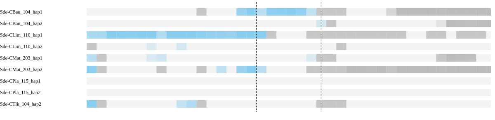

Different chromosomes means the assessed sides map to separate chromosomes in the peer, not that the peer has a fusion. Haplotypes are grouped by individual in the summary. Absence of an expected homologous match can be evidence when sequence availability and assay sensitivity are established. Failure of a qualifying alignment filter alone does not establish biological absence; the coverage and limitation columns show what was measured.

### Local sequence and contact support

| Assay | Measurement |
| --- | --- |
| Qualified immediate HiFi spanning molecules | 0 |
| Qualified HiFi flank molecules left/right | 31 / 8 |
| HiFi informative | False |
| Graph context | screened_primary_contig_paths |

Zero spanning reads must be interpreted with flank coverage, ambiguity and interval width. Graph connectivity alone does not establish a correct join.

| HiFi offset kb | Left molecules | Right molecules | Spanning molecules | Median depth left/right | Flanks observable |
| --- | --- | --- | --- | --- | --- |
| 100 | 13 | 13 | 0 | 25.0 / 19.0 | True |
| 250 | 12 | 17 | 0 | 24.0 / 28.0 | True |
| 500 | 10 | 22 | 0 | 18.0 / 36.0 | True |

Observable distant flanks show reads are available on each side; no spanning reads across a long interval do not by themselves test the exact seam.

| Library | Offset kb | Cross pairs | Within left/right | Sequence/gap controls | Informative |
| --- | --- | --- | --- | --- | --- |
| Ex2 | 100 | 9 | 7120 / 4533 | 5 / 0 | False |
| Ex3 | 100 | 5 | 7991 / 5187 | 5 / 0 | False |
| Ex2 | 250 | 8 | 6621 / 5571 | 3 / 0 | False |
| Ex3 | 250 | 4 | 7693 / 6410 | 3 / 0 | False |
| Ex2 | 500 | 5 | 6702 / 7261 | 3 / 0 | False |
| Ex3 | 500 | 4 | 7867 / 7933 | 3 / 0 | False |

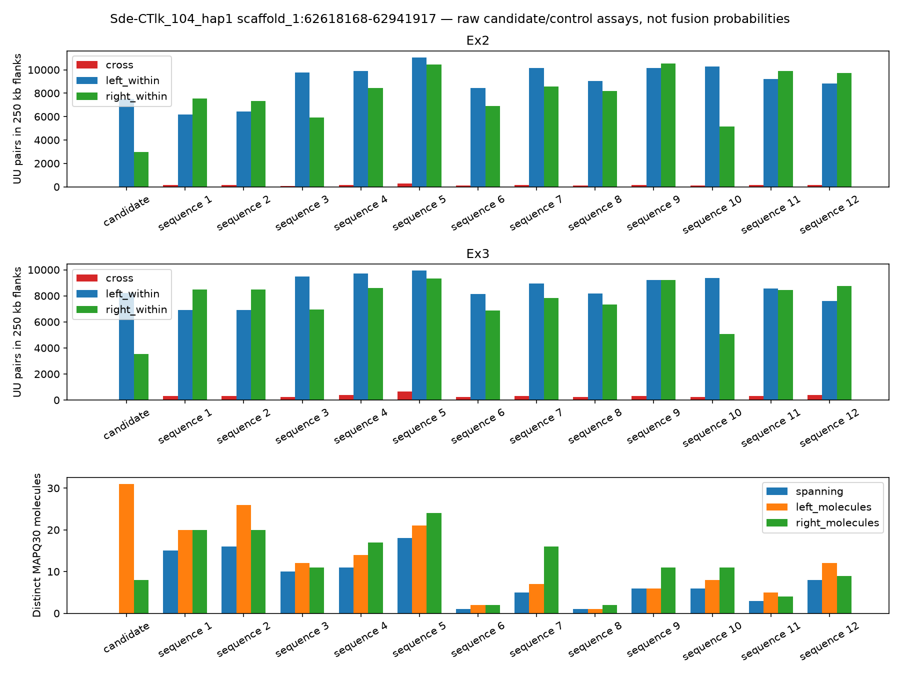

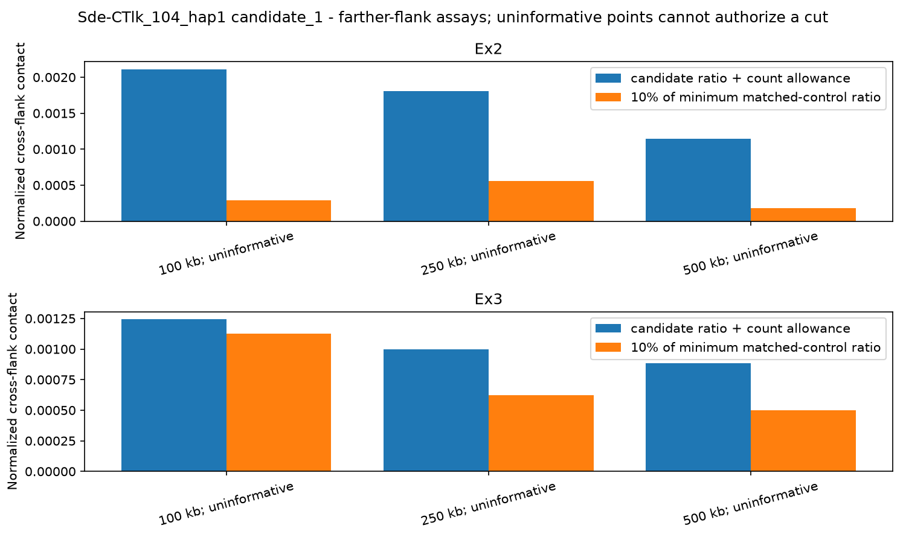

[IGV session: original coordinates](sequence-context/Sde-CTlk_104_hap1.sequence_context/candidate_1.igv.xml)

Scaffolding Hi-C is corroboration, not independent validation. Small control populations and poor observability limit conclusions from weak support.

**Decision needed:** review supporting, opposing and missing evidence before selecting an exact cut. Leave retained or unresolved rows at NO and record reviewer and rationale.

<details><summary>Full candidate measurements</summary>

```json
{
  "assessment_sha256": "1fd4707ae4958ce31f7e95b5732e01d70686755c6a62a414b080fac24e4fd96a",
  "coordinate_stage": "pre_finishing",
  "packet_interval_id": "candidate_1",
  "verified_gap": false,
  "assessment_scaffold_length": 138446979,
  "hifi_spanning_molecules": 0,
  "local_path_support": "unresolved",
  "continuity_grid": {
    "step_bp": 1000,
    "anchor_bp": 1000,
    "minimum_molecules": 0,
    "supported_fraction": 0.9415384615384615,
    "probes": [
      {
        "cut_bp": 62618168,
        "molecules": 5
      },
      {
        "cut_bp": 62619168,
        "molecules": 4
      },
      {
        "cut_bp": 62620168,
        "molecules": 3
      },
      {
        "cut_bp": 62621168,
        "molecules": 6
      },
      {
        "cut_bp": 62622168,
        "molecules": 11
      },
      {
        "cut_bp": 62623168,
        "molecules": 9
      },
      {
        "cut_bp": 62624168,
        "molecules": 14
      },
      {
        "cut_bp": 62625168,
        "molecules": 14
      },
      {
        "cut_bp": 62626168,
        "molecules": 13
      },
      {
        "cut_bp": 62627168,
        "molecules": 5
      },
      {
        "cut_bp": 62628168,
        "molecules": 1
      },
      {
        "cut_bp": 62629168,
        "molecules": 6
      },
      {
        "cut_bp": 62630168,
        "molecules": 7
      },
      {
        "cut_bp": 62631168,
        "molecules": 2
      },
      {
        "cut_bp": 62632168,
        "molecules": 2
      },
      {
        "cut_bp": 62633168,
        "molecules": 11
      },
      {
        "cut_bp": 62634168,
        "molecules": 7
      },
      {
        "cut_bp": 62635168,
        "molecules": 7
      },
      {
        "cut_bp": 62636168,
        "molecules": 11
      },
      {
        "cut_bp": 62637168,
        "molecules": 14
      },
      {
        "cut_bp": 62638168,
        "molecules": 14
      },
      {
        "cut_bp": 62639168,
        "molecules": 11
      },
      {
        "cut_bp": 62640168,
        "molecules": 15
      },
      {
        "cut_bp": 62641168,
        "molecules": 15
      },
      {
        "cut_bp": 62642168,
        "molecules": 14
      },
      {
        "cut_bp": 62643168,
        "molecules": 7
      },
      {
        "cut_bp": 62644168,
        "molecules": 4
      },
      {
        "cut_bp": 62645168,
        "molecules": 11
      },
      {
        "cut_bp": 62646168,
        "molecules": 12
      },
      {
        "cut_bp": 62647168,
        "molecules": 3
      },
      {
        "cut_bp": 62648168,
        "molecules": 4
      },
      {
        "cut_bp": 62649168,
        "molecules": 7
      },
      {
        "cut_bp": 62650168,
        "molecules": 3
      },
      {
        "cut_bp": 62651168,
        "molecules": 2
      },
      {
        "cut_bp": 62652168,
        "molecules": 3
      },
      {
        "cut_bp": 62653168,
        "molecules": 9
      },
      {
        "cut_bp": 62654168,
        "molecules": 6
      },
      {
        "cut_bp": 62655168,
        "molecules": 8
      },
      {
        "cut_bp": 62656168,
        "molecules": 7
      },
      {
        "cut_bp": 62657168,
        "molecules": 2
      },
      {
        "cut_bp": 62658168,
        "molecules": 4
      },
      {
        "cut_bp": 62659168,
        "molecules": 4
      },
      {
        "cut_bp": 62660168,
        "molecules": 4
      },
      {
        "cut_bp": 62661168,
        "molecules": 4
      },
      {
        "cut_bp": 62662168,
        "molecules": 3
      },
      {
        "cut_bp": 62663168,
        "molecules": 3
      },
      {
        "cut_bp": 62664168,
        "molecules": 2
      },
      {
        "cut_bp": 62665168,
        "molecules": 2
      },
      {
        "cut_bp": 62666168,
        "molecules": 3
      },
      {
        "cut_bp": 62667168,
        "molecules": 5
      },
      {
        "cut_bp": 62668168,
        "molecules": 8
      },
      {
        "cut_bp": 62669168,
        "molecules": 0
      },
      {
        "cut_bp": 62670168,
        "molecules": 0
      },
      {
        "cut_bp": 62671168,
        "molecules": 3
      },
      {
        "cut_bp": 62672168,
        "molecules": 6
      },
      {
        "cut_bp": 62673168,
        "molecules": 3
      },
      {
        "cut_bp": 62674168,
        "molecules": 10
      },
      {
        "cut_bp": 62675168,
        "molecules": 11
      },
      {
        "cut_bp": 62676168,
        "molecules": 12
      },
      {
        "cut_bp": 62677168,
        "molecules": 29
      },
      {
        "cut_bp": 62678168,
        "molecules": 16
      },
      {
        "cut_bp": 62679168,
        "molecules": 9
      },
      {
        "cut_bp": 62680168,
        "molecules": 12
      },
      {
        "cut_bp": 62681168,
        "molecules": 29
      },
      {
        "cut_bp": 62682168,
        "molecules": 30
      },
      {
        "cut_bp": 62683168,
        "molecules": 29
      },
      {
        "cut_bp": 62684168,
        "molecules": 11
      },
      {
        "cut_bp": 62685168,
        "molecules": 9
      },
      {
        "cut_bp": 62686168,
        "molecules": 23
      },
      {
        "cut_bp": 62687168,
        "molecules": 31
      },
      {
        "cut_bp": 62688168,
        "molecules": 19
      },
      {
        "cut_bp": 62689168,
        "molecules": 17
      },
      {
        "cut_bp": 62690168,
        "molecules": 27
      },
      {
        "cut_bp": 62691168,
        "molecules": 20
      },
      {
        "cut_bp": 62692168,
        "molecules": 23
      },
      {
        "cut_bp": 62693168,
        "molecules": 21
      },
      {
        "cut_bp": 62694168,
        "molecules": 8
      },
      {
        "cut_bp": 62695168,
        "molecules": 5
      },
      {
        "cut_bp": 62696168,
        "molecules": 14
      },
      {
        "cut_bp": 62697168,
        "molecules": 25
      },
      {
        "cut_bp": 62698168,
        "molecules": 12
      },
      {
        "cut_bp": 62699168,
        "molecules": 14
      },
      {
        "cut_bp": 62700168,
        "molecules": 16
      },
      {
        "cut_bp": 62701168,
        "molecules": 12
      },
      {
        "cut_bp": 62702168,
        "molecules": 27
      },
      {
        "cut_bp": 62703168,
        "molecules": 15
      },
      {
        "cut_bp": 62704168,
        "molecules": 12
      },
      {
        "cut_bp": 62705168,
        "molecules": 11
      },
      {
        "cut_bp": 62706168,
        "molecules": 9
      },
      {
        "cut_bp": 62707168,
        "molecules": 1
      },
      {
        "cut_bp": 62708168,
        "molecules": 2
      },
      {
        "cut_bp": 62709168,
        "molecules": 2
      },
      {
        "cut_bp": 62710168,
        "molecules": 2
      },
      {
        "cut_bp": 62711168,
        "molecules": 3
      },
      {
        "cut_bp": 62712168,
        "molecules": 2
      },
      {
        "cut_bp": 62713168,
        "molecules": 2
      },
      {
        "cut_bp": 62714168,
        "molecules": 2
      },
      {
        "cut_bp": 62715168,
        "molecules": 5
      },
      {
        "cut_bp": 62716168,
        "molecules": 2
      },
      {
        "cut_bp": 62717168,
        "molecules": 3
      },
      {
        "cut_bp": 62718168,
        "molecules": 5
      },
      {
        "cut_bp": 62719168,
        "molecules": 5
      },
      {
        "cut_bp": 62720168,
        "molecules": 4
      },
      {
        "cut_bp": 62721168,
        "molecules": 8
      },
      {
        "cut_bp": 62722168,
        "molecules": 4
      },
      {
        "cut_bp": 62723168,
        "molecules": 14
      },
      {
        "cut_bp": 62724168,
        "molecules": 2
      },
      {
        "cut_bp": 62725168,
        "molecules": 2
      },
      {
        "cut_bp": 62726168,
        "molecules": 6
      },
      {
        "cut_bp": 62727168,
        "molecules": 16
      },
      {
        "cut_bp": 62728168,
        "molecules": 17
      },
      {
        "cut_bp": 62729168,
        "molecules": 24
      },
      {
        "cut_bp": 62730168,
        "molecules": 28
      },
      {
        "cut_bp": 62731168,
        "molecules": 6
      },
      {
        "cut_bp": 62732168,
        "molecules": 6
      },
      {
        "cut_bp": 62733168,
        "molecules": 25
      },
      {
        "cut_bp": 62734168,
        "molecules": 25
      },
      {
        "cut_bp": 62735168,
        "molecules": 23
      },
      {
        "cut_bp": 62736168,
        "molecules": 16
      },
      {
        "cut_bp": 62737168,
        "molecules": 6
      },
      {
        "cut_bp": 62738168,
        "molecules": 5
      },
      {
        "cut_bp": 62739168,
        "molecules": 7
      },
      {
        "cut_bp": 62740168,
        "molecules": 19
      },
      {
        "cut_bp": 62741168,
        "molecules": 20
      },
      {
        "cut_bp": 62742168,
        "molecules": 8
      },
      {
        "cut_bp": 62743168,
        "molecules": 7
      },
      {
        "cut_bp": 62744168,
        "molecules": 9
      },
      {
        "cut_bp": 62745168,
        "molecules": 6
      },
      {
        "cut_bp": 62746168,
        "molecules": 7
      },
      {
        "cut_bp": 62747168,
        "molecules": 13
      },
      {
        "cut_bp": 62748168,
        "molecules": 12
      },
      {
        "cut_bp": 62749168,
        "molecules": 12
      },
      {
        "cut_bp": 62750168,
        "molecules": 8
      },
      {
        "cut_bp": 62751168,
        "molecules": 10
      },
      {
        "cut_bp": 62752168,
        "molecules": 14
      },
      {
        "cut_bp": 62753168,
        "molecules": 14
      },
      {
        "cut_bp": 62754168,
        "molecules": 11
      },
      {
        "cut_bp": 62755168,
        "molecules": 19
      },
      {
        "cut_bp": 62756168,
        "molecules": 21
      },
      {
        "cut_bp": 62757168,
        "molecules": 13
      },
      {
        "cut_bp": 62758168,
        "molecules": 13
      },
      {
        "cut_bp": 62759168,
        "molecules": 18
      },
      {
        "cut_bp": 62760168,
        "molecules": 15
      },
      {
        "cut_bp": 62761168,
        "molecules": 6
      },
      {
        "cut_bp": 62762168,
        "molecules": 5
      },
      {
        "cut_bp": 62763168,
        "molecules": 15
      },
      {
        "cut_bp": 62764168,
        "molecules": 13
      },
      {
        "cut_bp": 62765168,
        "molecules": 14
      },
      {
        "cut_bp": 62766168,
        "molecules": 13
      },
      {
        "cut_bp": 62767168,
        "molecules": 7
      },
      {
        "cut_bp": 62768168,
        "molecules": 7
      },
      {
        "cut_bp": 62769168,
        "molecules": 2
      },
      {
        "cut_bp": 62770168,
        "molecules": 2
      },
      {
        "cut_bp": 62771168,
        "molecules": 5
      },
      {
        "cut_bp": 62772168,
        "molecules": 5
      },
      {
        "cut_bp": 62773168,
        "molecules": 12
      },
      {
        "cut_bp": 62774168,
        "molecules": 8
      },
      {
        "cut_bp": 62775168,
        "molecules": 10
      },
      {
        "cut_bp": 62776168,
        "molecules": 9
      },
      {
        "cut_bp": 62777168,
        "molecules": 3
      },
      {
        "cut_bp": 62778168,
        "molecules": 2
      },
      {
        "cut_bp": 62779168,
        "molecules": 6
      },
      {
        "cut_bp": 62780168,
        "molecules": 9
      },
      {
        "cut_bp": 62781168,
        "molecules": 13
      },
      {
        "cut_bp": 62782168,
        "molecules": 9
      },
      {
        "cut_bp": 62783168,
        "molecules": 10
      },
      {
        "cut_bp": 62784168,
        "molecules": 10
      },
      {
        "cut_bp": 62785168,
        "molecules": 8
      },
      {
        "cut_bp": 62786168,
        "molecules": 6
      },
      {
        "cut_bp": 62787168,
        "molecules": 10
      },
      {
        "cut_bp": 62788168,
        "molecules": 11
      },
      {
        "cut_bp": 62789168,
        "molecules": 14
      },
      {
        "cut_bp": 62790168,
        "molecules": 12
      },
      {
        "cut_bp": 62791168,
        "molecules": 8
      },
      {
        "cut_bp": 62792168,
        "molecules": 7
      },
      {
        "cut_bp": 62793168,
        "molecules": 8
      },
      {
        "cut_bp": 62794168,
        "molecules": 4
      },
      {
        "cut_bp": 62795168,
        "molecules": 5
      },
      {
        "cut_bp": 62796168,
        "molecules": 6
      },
      {
        "cut_bp": 62797168,
        "molecules": 6
      },
      {
        "cut_bp": 62798168,
        "molecules": 7
      },
      {
        "cut_bp": 62799168,
        "molecules": 8
      },
      {
        "cut_bp": 62800168,
        "molecules": 5
      },
      {
        "cut_bp": 62801168,
        "molecules": 0
      },
      {
        "cut_bp": 62802168,
        "molecules": 2
      },
      {
        "cut_bp": 62803168,
        "molecules": 9
      },
      {
        "cut_bp": 62804168,
        "molecules": 8
      },
      {
        "cut_bp": 62805168,
        "molecules": 9
      },
      {
        "cut_bp": 62806168,
        "molecules": 13
      },
      {
        "cut_bp": 62807168,
        "molecules": 11
      },
      {
        "cut_bp": 62808168,
        "molecules": 8
      },
      {
        "cut_bp": 62809168,
        "molecules": 8
      },
      {
        "cut_bp": 62810168,
        "molecules": 5
      },
      {
        "cut_bp": 62811168,
        "molecules": 10
      },
      {
        "cut_bp": 62812168,
        "molecules": 7
      },
      {
        "cut_bp": 62813168,
        "molecules": 7
      },
      {
        "cut_bp": 62814168,
        "molecules": 5
      },
      {
        "cut_bp": 62815168,
        "molecules": 5
      },
      {
        "cut_bp": 62816168,
        "molecules": 10
      },
      {
        "cut_bp": 62817168,
        "molecules": 8
      },
      {
        "cut_bp": 62818168,
        "molecules": 10
      },
      {
        "cut_bp": 62819168,
        "molecules": 9
      },
      {
        "cut_bp": 62820168,
        "molecules": 4
      },
      {
        "cut_bp": 62821168,
        "molecules": 7
      },
      {
        "cut_bp": 62822168,
        "molecules": 10
      },
      {
        "cut_bp": 62823168,
        "molecules": 4
      },
      {
        "cut_bp": 62824168,
        "molecules": 9
      },
      {
        "cut_bp": 62825168,
        "molecules": 7
      },
      {
        "cut_bp": 62826168,
        "molecules": 6
      },
      {
        "cut_bp": 62827168,
        "molecules": 7
      },
      {
        "cut_bp": 62828168,
        "molecules": 8
      },
      {
        "cut_bp": 62829168,
        "molecules": 15
      },
      {
        "cut_bp": 62830168,
        "molecules": 21
      },
      {
        "cut_bp": 62831168,
        "molecules": 8
      },
      {
        "cut_bp": 62832168,
        "molecules": 3
      },
      {
        "cut_bp": 62833168,
        "molecules": 2
      },
      {
        "cut_bp": 62834168,
        "molecules": 14
      },
      {
        "cut_bp": 62835168,
        "molecules": 10
      },
      {
        "cut_bp": 62836168,
        "molecules": 6
      },
      {
        "cut_bp": 62837168,
        "molecules": 6
      },
      {
        "cut_bp": 62838168,
        "molecules": 5
      },
      {
        "cut_bp": 62839168,
        "molecules": 5
      },
      {
        "cut_bp": 62840168,
        "molecules": 6
      },
      {
        "cut_bp": 62841168,
        "molecules": 6
      },
      {
        "cut_bp": 62842168,
        "molecules": 7
      },
      {
        "cut_bp": 62843168,
        "molecules": 9
      },
      {
        "cut_bp": 62844168,
        "molecules": 9
      },
      {
        "cut_bp": 62845168,
        "molecules": 8
      },
      {
        "cut_bp": 62846168,
        "molecules": 3
      },
      {
        "cut_bp": 62847168,
        "molecules": 3
      },
      {
        "cut_bp": 62848168,
        "molecules": 6
      },
      {
        "cut_bp": 62849168,
        "molecules": 9
      },
      {
        "cut_bp": 62850168,
        "molecules": 8
      },
      {
        "cut_bp": 62851168,
        "molecules": 6
      },
      {
        "cut_bp": 62852168,
        "molecules": 7
      },
      {
        "cut_bp": 62853168,
        "molecules": 10
      },
      {
        "cut_bp": 62854168,
        "molecules": 10
      },
      {
        "cut_bp": 62855168,
        "molecules": 8
      },
      {
        "cut_bp": 62856168,
        "molecules": 7
      },
      {
        "cut_bp": 62857168,
        "molecules": 7
      },
      {
        "cut_bp": 62858168,
        "molecules": 7
      },
      {
        "cut_bp": 62859168,
        "molecules": 7
      },
      {
        "cut_bp": 62860168,
        "molecules": 6
      },
      {
        "cut_bp": 62861168,
        "molecules": 6
      },
      {
        "cut_bp": 62862168,
        "molecules": 8
      },
      {
        "cut_bp": 62863168,
        "molecules": 12
      },
      {
        "cut_bp": 62864168,
        "molecules": 10
      },
      {
        "cut_bp": 62865168,
        "molecules": 4
      },
      {
        "cut_bp": 62866168,
        "molecules": 5
      },
      {
        "cut_bp": 62867168,
        "molecules": 7
      },
      {
        "cut_bp": 62868168,
        "molecules": 7
      },
      {
        "cut_bp": 62869168,
        "molecules": 8
      },
      {
        "cut_bp": 62870168,
        "molecules": 8
      },
      {
        "cut_bp": 62871168,
        "molecules": 4
      },
      {
        "cut_bp": 62872168,
        "molecules": 2
      },
      {
        "cut_bp": 62873168,
        "molecules": 2
      },
      {
        "cut_bp": 62874168,
        "molecules": 0
      },
      {
        "cut_bp": 62875168,
        "molecules": 1
      },
      {
        "cut_bp": 62876168,
        "molecules": 1
      },
      {
        "cut_bp": 62877168,
        "molecules": 1
      },
      {
        "cut_bp": 62878168,
        "molecules": 2
      },
      {
        "cut_bp": 62879168,
        "molecules": 2
      },
      {
        "cut_bp": 62880168,
        "molecules": 1
      },
      {
        "cut_bp": 62881168,
        "molecules": 3
      },
      {
        "cut_bp": 62882168,
        "molecules": 1
      },
      {
        "cut_bp": 62883168,
        "molecules": 1
      },
      {
        "cut_bp": 62884168,
        "molecules": 6
      },
      {
        "cut_bp": 62885168,
        "molecules": 5
      },
      {
        "cut_bp": 62886168,
        "molecules": 4
      },
      {
        "cut_bp": 62887168,
        "molecules": 6
      },
      {
        "cut_bp": 62888168,
        "molecules": 5
      },
      {
        "cut_bp": 62889168,
        "molecules": 4
      },
      {
        "cut_bp": 62890168,
        "molecules": 6
      },
      {
        "cut_bp": 62891168,
        "molecules": 3
      },
      {
        "cut_bp": 62892168,
        "molecules": 5
      },
      {
        "cut_bp": 62893168,
        "molecules": 8
      },
      {
        "cut_bp": 62894168,
        "molecules": 10
      },
      {
        "cut_bp": 62895168,
        "molecules": 8
      },
      {
        "cut_bp": 62896168,
        "molecules": 6
      },
      {
        "cut_bp": 62897168,
        "molecules": 7
      },
      {
        "cut_bp": 62898168,
        "molecules": 6
      },
      {
        "cut_bp": 62899168,
        "molecules": 5
      },
      {
        "cut_bp": 62900168,
        "molecules": 5
      },
      {
        "cut_bp": 62901168,
        "molecules": 7
      },
      {
        "cut_bp": 62902168,
        "molecules": 7
      },
      {
        "cut_bp": 62903168,
        "molecules": 7
      },
      {
        "cut_bp": 62904168,
        "molecules": 5
      },
      {
        "cut_bp": 62905168,
        "molecules": 5
      },
      {
        "cut_bp": 62906168,
        "molecules": 7
      },
      {
        "cut_bp": 62907168,
        "molecules": 4
      },
      {
        "cut_bp": 62908168,
        "molecules": 2
      },
      {
        "cut_bp": 62909168,
        "molecules": 2
      },
      {
        "cut_bp": 62910168,
        "molecules": 3
      },
      {
        "cut_bp": 62911168,
        "molecules": 6
      },
      {
        "cut_bp": 62912168,
        "molecules": 4
      },
      {
        "cut_bp": 62913168,
        "molecules": 6
      },
      {
        "cut_bp": 62914168,
        "molecules": 6
      },
      {
        "cut_bp": 62915168,
        "molecules": 6
      },
      {
        "cut_bp": 62916168,
        "molecules": 4
      },
      {
        "cut_bp": 62917168,
        "molecules": 5
      },
      {
        "cut_bp": 62918168,
        "molecules": 4
      },
      {
        "cut_bp": 62919168,
        "molecules": 3
      },
      {
        "cut_bp": 62920168,
        "molecules": 2
      },
      {
        "cut_bp": 62921168,
        "molecules": 1
      },
      {
        "cut_bp": 62922168,
        "molecules": 1
      },
      {
        "cut_bp": 62923168,
        "molecules": 2
      },
      {
        "cut_bp": 62924168,
        "molecules": 1
      },
      {
        "cut_bp": 62925168,
        "molecules": 1
      },
      {
        "cut_bp": 62926168,
        "molecules": 1
      },
      {
        "cut_bp": 62927168,
        "molecules": 2
      },
      {
        "cut_bp": 62928168,
        "molecules": 3
      },
      {
        "cut_bp": 62929168,
        "molecules": 4
      },
      {
        "cut_bp": 62930168,
        "molecules": 2
      },
      {
        "cut_bp": 62931168,
        "molecules": 2
      },
      {
        "cut_bp": 62932168,
        "molecules": 2
      },
      {
        "cut_bp": 62933168,
        "molecules": 3
      },
      {
        "cut_bp": 62934168,
        "molecules": 4
      },
      {
        "cut_bp": 62935168,
        "molecules": 4
      },
      {
        "cut_bp": 62936168,
        "molecules": 4
      },
      {
        "cut_bp": 62937168,
        "molecules": 1
      },
      {
        "cut_bp": 62938168,
        "molecules": 1
      },
      {
        "cut_bp": 62939168,
        "molecules": 3
      },
      {
        "cut_bp": 62940168,
        "molecules": 3
      },
      {
        "cut_bp": 62941168,
        "molecules": 4
      },
      {
        "cut_bp": 62941917,
        "molecules": 4
      }
    ]
  },
  "graph_status": "screened_primary_contig_paths",
  "graph_contradiction": null,
  "native_continuity": true,
  "direct_native_link": false,
  "native_left": "h1tg000004l",
  "native_right": "h1tg000004l",
  "native_graph_sha256": "9b5ccab05303dc95c5d525f6ae565d219b4417d92b8046f0ecc6e5fb203ce355",
  "interpretation": "Primary path continuity alone is not read support or biological fusion confirmation; unmeasured unitig paths remain a limitation.",
  "chromosome_blocks": {
    "localized": false,
    "independent_individuals": [],
    "chromosome_pair": null,
    "contradictory_pairs": false,
    "peer_assays": [
      {
        "peer": "Sde-CBau_104_hap1",
        "sample": "Sde-CBau_104",
        "auto_evidence": true,
        "chromosome_pair": null,
        "qualified": false,
        "unique_gap_localization": false,
        "trials": [
          {
            "offset_bp": 100000,
            "left_chrom": null,
            "right_chrom": null,
            "left_target": null,
            "right_target": null,
            "usable": false,
            "left_edge": 62518168,
            "right_edge": 63041917
          },
          {
            "offset_bp": 250000,
            "left_chrom": null,
            "right_chrom": null,
            "left_target": null,
            "right_target": null,
            "usable": false,
            "left_edge": 62368168,
            "right_edge": 63191917
          },
          {
            "offset_bp": 500000,
            "left_chrom": null,
            "right_chrom": "chr7",
            "left_target": null,
            "right_target": "scaffold_16",
            "usable": false,
            "left_edge": 62118168,
            "right_edge": 63441917
          }
        ]
      },
      {
        "peer": "Sde-CBau_104_hap2",
        "sample": "Sde-CBau_104",
        "auto_evidence": true,
        "chromosome_pair": null,
        "qualified": false,
        "unique_gap_localization": false,
        "trials": [
          {
            "offset_bp": 100000,
            "left_chrom": null,
            "right_chrom": null,
            "left_target": null,
            "right_target": null,
            "usable": false,
            "left_edge": 62518168,
            "right_edge": 63041917
          },
          {
            "offset_bp": 250000,
            "left_chrom": null,
            "right_chrom": null,
            "left_target": null,
            "right_target": null,
            "usable": false,
            "left_edge": 62368168,
            "right_edge": 63191917
          },
          {
            "offset_bp": 500000,
            "left_chrom": null,
            "right_chrom": null,
            "left_target": null,
            "right_target": null,
            "usable": false,
            "left_edge": 62118168,
            "right_edge": 63441917
          }
        ]
      },
      {
        "peer": "Sde-CLim_110_hap1",
        "sample": "Sde-CLim_110",
        "auto_evidence": true,
        "chromosome_pair": null,
        "qualified": false,
        "unique_gap_localization": false,
        "trials": [
          {
            "offset_bp": 100000,
            "left_chrom": null,
            "right_chrom": null,
            "left_target": null,
            "right_target": null,
            "usable": false,
            "left_edge": 62518168,
            "right_edge": 63041917
          },
          {
            "offset_bp": 250000,
            "left_chrom": null,
            "right_chrom": null,
            "left_target": null,
            "right_target": null,
            "usable": false,
            "left_edge": 62368168,
            "right_edge": 63191917
          },
          {
            "offset_bp": 500000,
            "left_chrom": "chr9",
            "right_chrom": null,
            "left_target": "scaffold_6",
            "right_target": null,
            "usable": false,
            "left_edge": 62118168,
            "right_edge": 63441917
          }
        ]
      },
      {
        "peer": "Sde-CLim_110_hap2",
        "sample": "Sde-CLim_110",
        "auto_evidence": true,
        "chromosome_pair": null,
        "qualified": false,
        "unique_gap_localization": false,
        "trials": [
          {
            "offset_bp": 100000,
            "left_chrom": null,
            "right_chrom": null,
            "left_target": null,
            "right_target": null,
            "usable": false,
            "left_edge": 62518168,
            "right_edge": 63041917
          },
          {
            "offset_bp": 250000,
            "left_chrom": null,
            "right_chrom": null,
            "left_target": null,
            "right_target": null,
            "usable": false,
            "left_edge": 62368168,
            "right_edge": 63191917
          },
          {
            "offset_bp": 500000,
            "left_chrom": null,
            "right_chrom": null,
            "left_target": null,
            "right_target": null,
            "usable": false,
            "left_edge": 62118168,
            "right_edge": 63441917
          }
        ]
      },
      {
        "peer": "Sde-CMat_203_hap1",
        "sample": "Sde-CMat_203",
        "auto_evidence": true,
        "chromosome_pair": null,
        "qualified": false,
        "unique_gap_localization": false,
        "trials": [
          {
            "offset_bp": 100000,
            "left_chrom": null,
            "right_chrom": null,
            "left_target": null,
            "right_target": null,
            "usable": false,
            "left_edge": 62518168,
            "right_edge": 63041917
          },
          {
            "offset_bp": 250000,
            "left_chrom": null,
            "right_chrom": null,
            "left_target": null,
            "right_target": null,
            "usable": false,
            "left_edge": 62368168,
            "right_edge": 63191917
          },
          {
            "offset_bp": 500000,
            "left_chrom": null,
            "right_chrom": null,
            "left_target": null,
            "right_target": null,
            "usable": false,
            "left_edge": 62118168,
            "right_edge": 63441917
          }
        ]
      },
      {
        "peer": "Sde-CMat_203_hap2",
        "sample": "Sde-CMat_203",
        "auto_evidence": true,
        "chromosome_pair": null,
        "qualified": false,
        "unique_gap_localization": false,
        "trials": [
          {
            "offset_bp": 100000,
            "left_chrom": null,
            "right_chrom": null,
            "left_target": null,
            "right_target": null,
            "usable": false,
            "left_edge": 62518168,
            "right_edge": 63041917
          },
          {
            "offset_bp": 250000,
            "left_chrom": null,
            "right_chrom": "chr7",
            "left_target": null,
            "right_target": "scaffold_6",
            "usable": false,
            "left_edge": 62368168,
            "right_edge": 63191917
          },
          {
            "offset_bp": 500000,
            "left_chrom": null,
            "right_chrom": "chr7",
            "left_target": null,
            "right_target": "scaffold_6",
            "usable": false,
            "left_edge": 62118168,
            "right_edge": 63441917
          }
        ]
      },
      {
        "peer": "Sde-CPla_115_hap1",
        "sample": "Sde-CPla_115",
        "auto_evidence": false,
        "chromosome_pair": null,
        "qualified": false,
        "unique_gap_localization": false,
        "trials": [
          {
            "offset_bp": 100000,
            "left_chrom": null,
            "right_chrom": null,
            "left_target": null,
            "right_target": null,
            "usable": false,
            "left_edge": 62518168,
            "right_edge": 63041917
          },
          {
            "offset_bp": 250000,
            "left_chrom": null,
            "right_chrom": null,
            "left_target": null,
            "right_target": null,
            "usable": false,
            "left_edge": 62368168,
            "right_edge": 63191917
          },
          {
            "offset_bp": 500000,
            "left_chrom": null,
            "right_chrom": null,
            "left_target": null,
            "right_target": null,
            "usable": false,
            "left_edge": 62118168,
            "right_edge": 63441917
          }
        ]
      },
      {
        "peer": "Sde-CPla_115_hap2",
        "sample": "Sde-CPla_115",
        "auto_evidence": false,
        "chromosome_pair": null,
        "qualified": false,
        "unique_gap_localization": false,
        "trials": [
          {
            "offset_bp": 100000,
            "left_chrom": null,
            "right_chrom": null,
            "left_target": null,
            "right_target": null,
            "usable": false,
            "left_edge": 62518168,
            "right_edge": 63041917
          },
          {
            "offset_bp": 250000,
            "left_chrom": null,
            "right_chrom": null,
            "left_target": null,
            "right_target": "scaffold_20",
            "usable": false,
            "left_edge": 62368168,
            "right_edge": 63191917
          },
          {
            "offset_bp": 500000,
            "left_chrom": null,
            "right_chrom": null,
            "left_target": null,
            "right_target": "scaffold_20",
            "usable": false,
            "left_edge": 62118168,
            "right_edge": 63441917
          }
        ]
      },
      {
        "peer": "Sde-CTlk_104_hap2",
        "sample": "Sde-CTlk_104",
        "auto_evidence": true,
        "chromosome_pair": null,
        "qualified": false,
        "unique_gap_localization": false,
        "trials": [
          {
            "offset_bp": 100000,
            "left_chrom": null,
            "right_chrom": null,
            "left_target": null,
            "right_target": null,
            "usable": false,
            "left_edge": 62518168,
            "right_edge": 63041917
          },
          {
            "offset_bp": 250000,
            "left_chrom": null,
            "right_chrom": null,
            "left_target": null,
            "right_target": "scaffold_5",
            "usable": false,
            "left_edge": 62368168,
            "right_edge": 63191917
          },
          {
            "offset_bp": 500000,
            "left_chrom": null,
            "right_chrom": null,
            "left_target": null,
            "right_target": "scaffold_5",
            "usable": false,
            "left_edge": 62118168,
            "right_edge": 63441917
          }
        ]
      }
    ]
  },
  "farther_contact_evidence": {
    "supported_offsets": [],
    "pass_all": false,
    "contradictory_informative_trial": false,
    "trials": [
      {
        "offset_bp": 100000,
        "library": "Ex2",
        "informative": false,
        "control_populations": {
          "continuous_control": 5,
          "gap_control": 0
        },
        "matched_control_ids": [
          "continuous_32df9ccb6605fae7239b",
          "continuous_b7ba229530814a11184a",
          "continuous_c01f21a9e778cdc867d4",
          "continuous_0685b7402bc86455adde",
          "continuous_89c1e3a1b1e257c8c728"
        ],
        "minimum_control_ratio": 0.002921867978358784,
        "upper_count_allowance_ratio": 0.0021122649358694765,
        "support_loss": false,
        "raw_counts": {
          "right_ends": 27206,
          "left_ends": 39656,
          "left_within": 7120,
          "cross": 9,
          "right_within": 4533
        }
      },
      {
        "offset_bp": 100000,
        "library": "Ex3",
        "informative": false,
        "control_populations": {
          "continuous_control": 5,
          "gap_control": 0
        },
        "matched_control_ids": [
          "continuous_32df9ccb6605fae7239b",
          "continuous_b7ba229530814a11184a",
          "continuous_c01f21a9e778cdc867d4",
          "continuous_0685b7402bc86455adde",
          "continuous_89c1e3a1b1e257c8c728"
        ],
        "minimum_control_ratio": 0.011242268237651523,
        "upper_count_allowance_ratio": 0.0012425998523189683,
        "support_loss": false,
        "raw_counts": {
          "left_ends": 29447,
          "right_ends": 19680,
          "left_within": 7991,
          "cross": 5,
          "right_within": 5187
        }
      },
      {
        "offset_bp": 250000,
        "library": "Ex2",
        "informative": false,
        "control_populations": {
          "continuous_control": 3,
          "gap_control": 0
        },
        "matched_control_ids": [
          "continuous_32df9ccb6605fae7239b",
          "continuous_b7ba229530814a11184a",
          "continuous_003987e8c2843b5c7d43"
        ],
        "minimum_control_ratio": 0.00557621475193961,
        "upper_count_allowance_ratio": 0.001811191252433981,
        "support_loss": false,
        "raw_counts": {
          "right_ends": 33060,
          "left_ends": 36926,
          "left_within": 6621,
          "cross": 8,
          "right_within": 5571
        }
      },
      {
        "offset_bp": 250000,
        "library": "Ex3",
        "informative": false,
        "control_populations": {
          "continuous_control": 3,
          "gap_control": 0
        },
        "matched_control_ids": [
          "continuous_32df9ccb6605fae7239b",
          "continuous_b7ba229530814a11184a",
          "continuous_003987e8c2843b5c7d43"
        ],
        "minimum_control_ratio": 0.006249849697024545,
        "upper_count_allowance_ratio": 0.000996830136011753,
        "support_loss": false,
        "raw_counts": {
          "left_ends": 28369,
          "right_ends": 23556,
          "left_within": 7693,
          "cross": 4,
          "right_within": 6410
        }
      },
      {
        "offset_bp": 500000,
        "library": "Ex2",
        "informative": false,
        "control_populations": {
          "continuous_control": 3,
          "gap_control": 0
        },
        "matched_control_ids": [
          "continuous_16eabe0065c1a1be81b7",
          "continuous_c01f21a9e778cdc867d4",
          "continuous_8f446c91fd482a80e8ea"
        ],
        "minimum_control_ratio": 0.0017785716810041366,
        "upper_count_allowance_ratio": 0.0011468049447784783,
        "support_loss": false,
        "raw_counts": {
          "right_ends": 41701,
          "left_ends": 38118,
          "left_within": 6702,
          "cross": 5,
          "right_within": 7261
        }
      },
      {
        "offset_bp": 500000,
        "library": "Ex3",
        "informative": false,
        "control_populations": {
          "continuous_control": 3,
          "gap_control": 0
        },
        "matched_control_ids": [
          "continuous_16eabe0065c1a1be81b7",
          "continuous_c01f21a9e778cdc867d4",
          "continuous_8f446c91fd482a80e8ea"
        ],
        "minimum_control_ratio": 0.005000275937474913,
        "upper_count_allowance_ratio": 0.0008860836800940316,
        "support_loss": false,
        "raw_counts": {
          "left_ends": 29800,
          "right_ends": 29786,
          "left_within": 7867,
          "cross": 4,
          "right_within": 7933
        }
      }
    ]
  },
  "farther_hifi": {
    "100000": {
      "informative": true,
      "raw": {
        "left_molecules": 13,
        "right_molecules": 13,
        "spanning": 0,
        "left_median_depth": 25.0,
        "right_median_depth": 19.0,
        "left_covered_fraction": 1.0,
        "right_covered_fraction": 1.0
      }
    },
    "250000": {
      "informative": true,
      "raw": {
        "left_molecules": 12,
        "right_molecules": 17,
        "spanning": 0,
        "left_median_depth": 24.0,
        "right_median_depth": 28.0,
        "left_covered_fraction": 1.0,
        "right_covered_fraction": 1.0
      }
    },
    "500000": {
      "informative": true,
      "raw": {
        "left_molecules": 10,
        "right_molecules": 22,
        "spanning": 0,
        "left_median_depth": 18.0,
        "right_median_depth": 36.0,
        "left_covered_fraction": 1.0,
        "right_covered_fraction": 1.0
      }
    }
  },
  "haplotype_block_conflict": false,
  "repeat_obscured_localization": false,
  "control_qualification": [
    {
      "id": "continuous_32df9ccb6605fae7239b",
      "population": "continuous_control",
      "qualified": true,
      "reasons": []
    },
    {
      "id": "continuous_b7ba229530814a11184a",
      "population": "continuous_control",
      "qualified": true,
      "reasons": []
    },
    {
      "id": "continuous_16eabe0065c1a1be81b7",
      "population": "continuous_control",
      "qualified": true,
      "reasons": []
    },
    {
      "id": "continuous_c01f21a9e778cdc867d4",
      "population": "continuous_control",
      "qualified": true,
      "reasons": []
    },
    {
      "id": "continuous_003987e8c2843b5c7d43",
      "population": "continuous_control",
      "qualified": true,
      "reasons": []
    },
    {
      "id": "continuous_6cf47791891437ab2de9",
      "population": "continuous_control",
      "qualified": false,
      "reasons": [
        "uninformative_hifi_flanks",
        "fewer_than_two_hifi_bridges"
      ]
    },
    {
      "id": "continuous_0685b7402bc86455adde",
      "population": "continuous_control",
      "qualified": false,
      "reasons": [
        "uninformative_hifi_flanks"
      ]
    },
    {
      "id": "continuous_a6adce48ab01be725bef",
      "population": "continuous_control",
      "qualified": false,
      "reasons": [
        "uninformative_hifi_flanks",
        "fewer_than_two_hifi_bridges"
      ]
    },
    {
      "id": "continuous_f1855e0c810c0742d9c9",
      "population": "continuous_control",
      "qualified": false,
      "reasons": [
        "uninformative_hifi_flanks"
      ]
    },
    {
      "id": "continuous_89c1e3a1b1e257c8c728",
      "population": "continuous_control",
      "qualified": false,
      "reasons": [
        "uninformative_hifi_flanks"
      ]
    },
    {
      "id": "continuous_10002583619de4e8c9f6",
      "population": "continuous_control",
      "qualified": false,
      "reasons": [
        "uninformative_hifi_flanks"
      ]
    },
    {
      "id": "continuous_8f446c91fd482a80e8ea",
      "population": "continuous_control",
      "qualified": false,
      "reasons": [
        "uninformative_hifi_flanks"
      ]
    }
  ],
  "hifi_informative": false,
  "matched_controls_pass": false,
  "hic_informative": false,
  "hic_support_loss": false,
  "libraries": [
    {
      "library": "Ex2",
      "matched_controls": 1,
      "control_populations": {
        "continuous_control": 1,
        "gap_control": 0
      },
      "informative": false,
      "ratio": 0.0010566284994475304,
      "upper_count_allowance_ratio": 0.0016906055991160486,
      "minimum_control_ratio": 0.010626007894423762,
      "support_loss": false,
      "raw_counts": {
        "left_ends": 41975,
        "right_ends": 18089,
        "left_within": 7484,
        "cross": 5,
        "right_within": 2992
      }
    },
    {
      "library": "Ex3",
      "matched_controls": 1,
      "control_populations": {
        "continuous_control": 1,
        "gap_control": 0
      },
      "informative": false,
      "ratio": 0.0009285535398755458,
      "upper_count_allowance_ratio": 0.0014856856638008733,
      "minimum_control_ratio": 0.031202746482796584,
      "support_loss": false,
      "raw_counts": {
        "left_ends": 29699,
        "right_ends": 13466,
        "left_within": 8200,
        "cross": 5,
        "right_within": 3536
      }
    }
  ],
  "independent_discordant_individuals": 0,
  "alternative_placements_checked": true,
  "control_ids": [
    "continuous_32df9ccb6605fae7239b",
    "continuous_b7ba229530814a11184a",
    "continuous_16eabe0065c1a1be81b7",
    "continuous_c01f21a9e778cdc867d4",
    "continuous_003987e8c2843b5c7d43",
    "continuous_6cf47791891437ab2de9",
    "continuous_0685b7402bc86455adde",
    "continuous_a6adce48ab01be725bef",
    "continuous_f1855e0c810c0742d9c9",
    "continuous_89c1e3a1b1e257c8c728",
    "continuous_10002583619de4e8c9f6",
    "continuous_8f446c91fd482a80e8ea"
  ],
  "hifi_raw": {
    "left_molecules": 31,
    "right_molecules": 8,
    "spanning": 0,
    "left_median_depth": 46.0,
    "right_median_depth": 13.0,
    "left_covered_fraction": 1.0,
    "right_covered_fraction": 1.0
  },
  "alternative_placement_scope": "Assessment BAM MAPQ and competing peer anchors; bounded emitted alternatives, no proof of haplotype-specific uniqueness",
  "chromosome_tracks": [
    {
      "peer": "Sde-CBau_104_hap1",
      "sample": "Sde-CBau_104",
      "auto_evidence": true,
      "relationship": "uninformative",
      "bins": [
        {
          "lo": 0,
          "hi": 50000,
          "aligned_bp": 0,
          "ambiguous_bp": 0,
          "dominance": 0.0,
          "chrom": null,
          "counts": {
            "chr9": 0,
            "chr7": 0
          }
        },
        {
          "lo": 50000,
          "hi": 100000,
          "aligned_bp": 0,
          "ambiguous_bp": 0,
          "dominance": 0.0,
          "chrom": null,
          "counts": {
            "chr9": 0,
            "chr7": 0
          }
        },
        {
          "lo": 100000,
          "hi": 150000,
          "aligned_bp": 0,
          "ambiguous_bp": 0,
          "dominance": 0.0,
          "chrom": null,
          "counts": {
            "chr9": 0,
            "chr7": 0
          }
        },
        {
          "lo": 150000,
          "hi": 200000,
          "aligned_bp": 0,
          "ambiguous_bp": 0,
          "dominance": 0.0,
          "chrom": null,
          "counts": {
            "chr9": 0,
            "chr7": 0
          }
        },
        {
          "lo": 200000,
          "hi": 250000,
          "aligned_bp": 0,
          "ambiguous_bp": 0,
          "dominance": 0.0,
          "chrom": null,
          "counts": {
            "chr9": 0,
            "chr7": 0
          }
        },
        {
          "lo": 250000,
          "hi": 300000,
          "aligned_bp": 0,
          "ambiguous_bp": 0,
          "dominance": 0.0,
          "chrom": null,
          "counts": {
            "chr9": 0,
            "chr7": 0
          }
        },
        {
          "lo": 300000,
          "hi": 350000,
          "aligned_bp": 0,
          "ambiguous_bp": 0,
          "dominance": 0.0,
          "chrom": null,
          "counts": {
            "chr9": 0,
            "chr7": 0
          }
        },
        {
          "lo": 350000,
          "hi": 400000,
          "aligned_bp": 0,
          "ambiguous_bp": 0,
          "dominance": 0.0,
          "chrom": null,
          "counts": {
            "chr9": 0,
            "chr7": 0
          }
        },
        {
          "lo": 400000,
          "hi": 450000,
          "aligned_bp": 0,
          "ambiguous_bp": 0,
          "dominance": 0.0,
          "chrom": null,
          "counts": {
            "chr9": 0,
            "chr7": 0
          }
        },
        {
          "lo": 450000,
          "hi": 500000,
          "aligned_bp": 0,
          "ambiguous_bp": 0,
          "dominance": 0.0,
          "chrom": null,
          "counts": {
            "chr9": 0,
            "chr7": 0
          }
        },
        {
          "lo": 500000,
          "hi": 550000,
          "aligned_bp": 0,
          "ambiguous_bp": 0,
          "dominance": 0.0,
          "chrom": null,
          "counts": {
            "chr9": 0,
            "chr7": 0
          }
        },
        {
          "lo": 550000,
          "hi": 600000,
          "aligned_bp": 2244,
          "ambiguous_bp": 0,
          "dominance": 1.0,
          "chrom": null,
          "counts": {
            "chr9": 2244,
            "chr7": 0
          }
        },
        {
          "lo": 600000,
          "hi": 650000,
          "aligned_bp": 0,
          "ambiguous_bp": 0,
          "dominance": 0.0,
          "chrom": null,
          "counts": {
            "chr9": 0,
            "chr7": 0
          }
        },
        {
          "lo": 650000,
          "hi": 700000,
          "aligned_bp": 0,
          "ambiguous_bp": 0,
          "dominance": 0.0,
          "chrom": null,
          "counts": {
            "chr9": 0,
            "chr7": 0
          }
        },
        {
          "lo": 700000,
          "hi": 750000,
          "aligned_bp": 0,
          "ambiguous_bp": 0,
          "dominance": 0.0,
          "chrom": null,
          "counts": {
            "chr9": 0,
            "chr7": 0
          }
        },
        {
          "lo": 750000,
          "hi": 800000,
          "aligned_bp": 40796,
          "ambiguous_bp": 0,
          "dominance": 1.0,
          "chrom": "chr9",
          "counts": {
            "chr9": 40796,
            "chr7": 0
          }
        },
        {
          "lo": 800000,
          "hi": 850000,
          "aligned_bp": 49992,
          "ambiguous_bp": 0,
          "dominance": 1.0,
          "chrom": "chr9",
          "counts": {
            "chr9": 49992,
            "chr7": 0
          }
        },
        {
          "lo": 850000,
          "hi": 900000,
          "aligned_bp": 26090,
          "ambiguous_bp": 0,
          "dominance": 1.0,
          "chrom": "chr9",
          "counts": {
            "chr9": 26090,
            "chr7": 0
          }
        },
        {
          "lo": 900000,
          "hi": 950000,
          "aligned_bp": 46568,
          "ambiguous_bp": 0,
          "dominance": 1.0,
          "chrom": "chr9",
          "counts": {
            "chr9": 46568,
            "chr7": 0
          }
        },
        {
          "lo": 950000,
          "hi": 1000000,
          "aligned_bp": 48214,
          "ambiguous_bp": 0,
          "dominance": 1.0,
          "chrom": "chr9",
          "counts": {
            "chr9": 48214,
            "chr7": 0
          }
        },
        {
          "lo": 1000000,
          "hi": 1050000,
          "aligned_bp": 49503,
          "ambiguous_bp": 0,
          "dominance": 1.0,
          "chrom": "chr9",
          "counts": {
            "chr9": 49503,
            "chr7": 0
          }
        },
        {
          "lo": 1050000,
          "hi": 1100000,
          "aligned_bp": 45381,
          "ambiguous_bp": 0,
          "dominance": 1.0,
          "chrom": "chr9",
          "counts": {
            "chr9": 45381,
            "chr7": 0
          }
        },
        {
          "lo": 1100000,
          "hi": 1150000,
          "aligned_bp": 23873,
          "ambiguous_bp": 0,
          "dominance": 1.0,
          "chrom": "chr9",
          "counts": {
            "chr9": 23873,
            "chr7": 0
          }
        },
        {
          "lo": 1150000,
          "hi": 1200000,
          "aligned_bp": 5306,
          "ambiguous_bp": 0,
          "dominance": 1.0,
          "chrom": null,
          "counts": {
            "chr9": 5306,
            "chr7": 0
          }
        },
        {
          "lo": 1200000,
          "hi": 1250000,
          "aligned_bp": 2558,
          "ambiguous_bp": 0,
          "dominance": 1.0,
          "chrom": null,
          "counts": {
            "chr9": 2558,
            "chr7": 0
          }
        },
        {
          "lo": 1250000,
          "hi": 1300000,
          "aligned_bp": 1128,
          "ambiguous_bp": 0,
          "dominance": 1.0,
          "chrom": null,
          "counts": {
            "chr9": 0,
            "chr7": 1128
          }
        },
        {
          "lo": 1300000,
          "hi": 1350000,
          "aligned_bp": 0,
          "ambiguous_bp": 0,
          "dominance": 0.0,
          "chrom": null,
          "counts": {
            "chr9": 0,
            "chr7": 0
          }
        },
        {
          "lo": 1350000,
          "hi": 1400000,
          "aligned_bp": 0,
          "ambiguous_bp": 0,
          "dominance": 0.0,
          "chrom": null,
          "counts": {
            "chr9": 0,
            "chr7": 0
          }
        },
        {
          "lo": 1400000,
          "hi": 1450000,
          "aligned_bp": 0,
          "ambiguous_bp": 0,
          "dominance": 0.0,
          "chrom": null,
          "counts": {
            "chr9": 0,
            "chr7": 0
          }
        },
        {
          "lo": 1450000,
          "hi": 1500000,
          "aligned_bp": 0,
          "ambiguous_bp": 0,
          "dominance": 0.0,
          "chrom": null,
          "counts": {
            "chr9": 0,
            "chr7": 0
          }
        },
        {
          "lo": 1500000,
          "hi": 1550000,
          "aligned_bp": 25938,
          "ambiguous_bp": 0,
          "dominance": 1.0,
          "chrom": "chr7",
          "counts": {
            "chr9": 0,
            "chr7": 25938
          }
        },
        {
          "lo": 1550000,
          "hi": 1600000,
          "aligned_bp": 49984,
          "ambiguous_bp": 0,
          "dominance": 1.0,
          "chrom": "chr7",
          "counts": {
            "chr9": 0,
            "chr7": 49984
          }
        },
        {
          "lo": 1600000,
          "hi": 1650000,
          "aligned_bp": 49991,
          "ambiguous_bp": 0,
          "dominance": 1.0,
          "chrom": "chr7",
          "counts": {
            "chr9": 0,
            "chr7": 49991
          }
        },
        {
          "lo": 1650000,
          "hi": 1700000,
          "aligned_bp": 49981,
          "ambiguous_bp": 0,
          "dominance": 1.0,
          "chrom": "chr7",
          "counts": {
            "chr9": 0,
            "chr7": 49981
          }
        },
        {
          "lo": 1700000,
          "hi": 1750000,
          "aligned_bp": 49963,
          "ambiguous_bp": 0,
          "dominance": 1.0,
          "chrom": "chr7",
          "counts": {
            "chr9": 0,
            "chr7": 49963
          }
        },
        {
          "lo": 1750000,
          "hi": 1800000,
          "aligned_bp": 47277,
          "ambiguous_bp": 0,
          "dominance": 1.0,
          "chrom": "chr7",
          "counts": {
            "chr9": 0,
            "chr7": 47277
          }
        },
        {
          "lo": 1800000,
          "hi": 1850000,
          "aligned_bp": 49376,
          "ambiguous_bp": 0,
          "dominance": 1.0,
          "chrom": "chr7",
          "counts": {
            "chr9": 0,
            "chr7": 49376
          }
        },
        {
          "lo": 1850000,
          "hi": 1900000,
          "aligned_bp": 49706,
          "ambiguous_bp": 0,
          "dominance": 1.0,
          "chrom": "chr7",
          "counts": {
            "chr9": 0,
            "chr7": 49706
          }
        },
        {
          "lo": 1900000,
          "hi": 1950000,
          "aligned_bp": 48781,
          "ambiguous_bp": 0,
          "dominance": 1.0,
          "chrom": "chr7",
          "counts": {
            "chr9": 0,
            "chr7": 48781
          }
        },
        {
          "lo": 1950000,
          "hi": 2000000,
          "aligned_bp": 49970,
          "ambiguous_bp": 0,
          "dominance": 1.0,
          "chrom": "chr7",
          "counts": {
            "chr9": 0,
            "chr7": 49970
          }
        },
        {
          "lo": 2000000,
          "hi": 2023749,
          "aligned_bp": 23732,
          "ambiguous_bp": 0,
          "dominance": 1.0,
          "chrom": "chr7",
          "counts": {
            "chr9": 0,
            "chr7": 23732
          }
        }
      ],
      "left": {
        "chrom": "chr9",
        "aligned_bp": 93032,
        "coverage": 0.10944941176470588,
        "dominance": 1.0,
        "informative_bins": 2,
        "qualified": false
      },
      "right": {
        "chrom": "chr7",
        "aligned_bp": 501136,
        "coverage": 0.5895717647058824,
        "dominance": 0.9894060694102998,
        "informative_bins": 11,
        "qualified": false
      }
    },
    {
      "peer": "Sde-CBau_104_hap2",
      "sample": "Sde-CBau_104",
      "auto_evidence": true,
      "relationship": "uninformative",
      "bins": [
        {
          "lo": 0,
          "hi": 50000,
          "aligned_bp": 0,
          "ambiguous_bp": 0,
          "dominance": 0.0,
          "chrom": null,
          "counts": {
            "chr9": 0,
            "chr7": 0
          }
        },
        {
          "lo": 50000,
          "hi": 100000,
          "aligned_bp": 0,
          "ambiguous_bp": 0,
          "dominance": 0.0,
          "chrom": null,
          "counts": {
            "chr9": 0,
            "chr7": 0
          }
        },
        {
          "lo": 100000,
          "hi": 150000,
          "aligned_bp": 0,
          "ambiguous_bp": 0,
          "dominance": 0.0,
          "chrom": null,
          "counts": {
            "chr9": 0,
            "chr7": 0
          }
        },
        {
          "lo": 150000,
          "hi": 200000,
          "aligned_bp": 0,
          "ambiguous_bp": 0,
          "dominance": 0.0,
          "chrom": null,
          "counts": {
            "chr9": 0,
            "chr7": 0
          }
        },
        {
          "lo": 200000,
          "hi": 250000,
          "aligned_bp": 0,
          "ambiguous_bp": 0,
          "dominance": 0.0,
          "chrom": null,
          "counts": {
            "chr9": 0,
            "chr7": 0
          }
        },
        {
          "lo": 250000,
          "hi": 300000,
          "aligned_bp": 0,
          "ambiguous_bp": 0,
          "dominance": 0.0,
          "chrom": null,
          "counts": {
            "chr9": 0,
            "chr7": 0
          }
        },
        {
          "lo": 300000,
          "hi": 350000,
          "aligned_bp": 0,
          "ambiguous_bp": 0,
          "dominance": 0.0,
          "chrom": null,
          "counts": {
            "chr9": 0,
            "chr7": 0
          }
        },
        {
          "lo": 350000,
          "hi": 400000,
          "aligned_bp": 0,
          "ambiguous_bp": 0,
          "dominance": 0.0,
          "chrom": null,
          "counts": {
            "chr9": 0,
            "chr7": 0
          }
        },
        {
          "lo": 400000,
          "hi": 450000,
          "aligned_bp": 0,
          "ambiguous_bp": 0,
          "dominance": 0.0,
          "chrom": null,
          "counts": {
            "chr9": 0,
            "chr7": 0
          }
        },
        {
          "lo": 450000,
          "hi": 500000,
          "aligned_bp": 0,
          "ambiguous_bp": 0,
          "dominance": 0.0,
          "chrom": null,
          "counts": {
            "chr9": 0,
            "chr7": 0
          }
        },
        {
          "lo": 500000,
          "hi": 550000,
          "aligned_bp": 0,
          "ambiguous_bp": 0,
          "dominance": 0.0,
          "chrom": null,
          "counts": {
            "chr9": 0,
            "chr7": 0
          }
        },
        {
          "lo": 550000,
          "hi": 600000,
          "aligned_bp": 0,
          "ambiguous_bp": 0,
          "dominance": 0.0,
          "chrom": null,
          "counts": {
            "chr9": 0,
            "chr7": 0
          }
        },
        {
          "lo": 600000,
          "hi": 650000,
          "aligned_bp": 0,
          "ambiguous_bp": 0,
          "dominance": 0.0,
          "chrom": null,
          "counts": {
            "chr9": 0,
            "chr7": 0
          }
        },
        {
          "lo": 650000,
          "hi": 700000,
          "aligned_bp": 0,
          "ambiguous_bp": 0,
          "dominance": 0.0,
          "chrom": null,
          "counts": {
            "chr9": 0,
            "chr7": 0
          }
        },
        {
          "lo": 700000,
          "hi": 750000,
          "aligned_bp": 0,
          "ambiguous_bp": 0,
          "dominance": 0.0,
          "chrom": null,
          "counts": {
            "chr9": 0,
            "chr7": 0
          }
        },
        {
          "lo": 750000,
          "hi": 800000,
          "aligned_bp": 0,
          "ambiguous_bp": 0,
          "dominance": 0.0,
          "chrom": null,
          "counts": {
            "chr9": 0,
            "chr7": 0
          }
        },
        {
          "lo": 800000,
          "hi": 850000,
          "aligned_bp": 0,
          "ambiguous_bp": 0,
          "dominance": 0.0,
          "chrom": null,
          "counts": {
            "chr9": 0,
            "chr7": 0
          }
        },
        {
          "lo": 850000,
          "hi": 900000,
          "aligned_bp": 0,
          "ambiguous_bp": 0,
          "dominance": 0.0,
          "chrom": null,
          "counts": {
            "chr9": 0,
            "chr7": 0
          }
        },
        {
          "lo": 900000,
          "hi": 950000,
          "aligned_bp": 0,
          "ambiguous_bp": 0,
          "dominance": 0.0,
          "chrom": null,
          "counts": {
            "chr9": 0,
            "chr7": 0
          }
        },
        {
          "lo": 950000,
          "hi": 1000000,
          "aligned_bp": 0,
          "ambiguous_bp": 0,
          "dominance": 0.0,
          "chrom": null,
          "counts": {
            "chr9": 0,
            "chr7": 0
          }
        },
        {
          "lo": 1000000,
          "hi": 1050000,
          "aligned_bp": 0,
          "ambiguous_bp": 0,
          "dominance": 0.0,
          "chrom": null,
          "counts": {
            "chr9": 0,
            "chr7": 0
          }
        },
        {
          "lo": 1050000,
          "hi": 1100000,
          "aligned_bp": 0,
          "ambiguous_bp": 0,
          "dominance": 0.0,
          "chrom": null,
          "counts": {
            "chr9": 0,
            "chr7": 0
          }
        },
        {
          "lo": 1100000,
          "hi": 1150000,
          "aligned_bp": 0,
          "ambiguous_bp": 0,
          "dominance": 0.0,
          "chrom": null,
          "counts": {
            "chr9": 0,
            "chr7": 0
          }
        },
        {
          "lo": 1150000,
          "hi": 1200000,
          "aligned_bp": 14278,
          "ambiguous_bp": 0,
          "dominance": 1.0,
          "chrom": "chr9",
          "counts": {
            "chr9": 14278,
            "chr7": 0
          }
        },
        {
          "lo": 1200000,
          "hi": 1250000,
          "aligned_bp": 444,
          "ambiguous_bp": 0,
          "dominance": 1.0,
          "chrom": null,
          "counts": {
            "chr9": 444,
            "chr7": 0
          }
        },
        {
          "lo": 1250000,
          "hi": 1300000,
          "aligned_bp": 0,
          "ambiguous_bp": 0,
          "dominance": 0.0,
          "chrom": null,
          "counts": {
            "chr9": 0,
            "chr7": 0
          }
        },
        {
          "lo": 1300000,
          "hi": 1350000,
          "aligned_bp": 0,
          "ambiguous_bp": 0,
          "dominance": 0.0,
          "chrom": null,
          "counts": {
            "chr9": 0,
            "chr7": 0
          }
        },
        {
          "lo": 1350000,
          "hi": 1400000,
          "aligned_bp": 0,
          "ambiguous_bp": 0,
          "dominance": 0.0,
          "chrom": null,
          "counts": {
            "chr9": 0,
            "chr7": 0
          }
        },
        {
          "lo": 1400000,
          "hi": 1450000,
          "aligned_bp": 0,
          "ambiguous_bp": 0,
          "dominance": 0.0,
          "chrom": null,
          "counts": {
            "chr9": 0,
            "chr7": 0
          }
        },
        {
          "lo": 1450000,
          "hi": 1500000,
          "aligned_bp": 0,
          "ambiguous_bp": 0,
          "dominance": 0.0,
          "chrom": null,
          "counts": {
            "chr9": 0,
            "chr7": 0
          }
        },
        {
          "lo": 1500000,
          "hi": 1550000,
          "aligned_bp": 0,
          "ambiguous_bp": 0,
          "dominance": 0.0,
          "chrom": null,
          "counts": {
            "chr9": 0,
            "chr7": 0
          }
        },
        {
          "lo": 1550000,
          "hi": 1600000,
          "aligned_bp": 0,
          "ambiguous_bp": 0,
          "dominance": 0.0,
          "chrom": null,
          "counts": {
            "chr9": 0,
            "chr7": 0
          }
        },
        {
          "lo": 1600000,
          "hi": 1650000,
          "aligned_bp": 0,
          "ambiguous_bp": 0,
          "dominance": 0.0,
          "chrom": null,
          "counts": {
            "chr9": 0,
            "chr7": 0
          }
        },
        {
          "lo": 1650000,
          "hi": 1700000,
          "aligned_bp": 0,
          "ambiguous_bp": 0,
          "dominance": 0.0,
          "chrom": null,
          "counts": {
            "chr9": 0,
            "chr7": 0
          }
        },
        {
          "lo": 1700000,
          "hi": 1750000,
          "aligned_bp": 0,
          "ambiguous_bp": 0,
          "dominance": 0.0,
          "chrom": null,
          "counts": {
            "chr9": 0,
            "chr7": 0
          }
        },
        {
          "lo": 1750000,
          "hi": 1800000,
          "aligned_bp": 12801,
          "ambiguous_bp": 0,
          "dominance": 1.0,
          "chrom": "chr7",
          "counts": {
            "chr9": 0,
            "chr7": 12801
          }
        },
        {
          "lo": 1800000,
          "hi": 1850000,
          "aligned_bp": 49952,
          "ambiguous_bp": 0,
          "dominance": 1.0,
          "chrom": "chr7",
          "counts": {
            "chr9": 0,
            "chr7": 49952
          }
        },
        {
          "lo": 1850000,
          "hi": 1900000,
          "aligned_bp": 47040,
          "ambiguous_bp": 0,
          "dominance": 1.0,
          "chrom": "chr7",
          "counts": {
            "chr9": 0,
            "chr7": 47040
          }
        },
        {
          "lo": 1900000,
          "hi": 1950000,
          "aligned_bp": 45642,
          "ambiguous_bp": 0,
          "dominance": 1.0,
          "chrom": "chr7",
          "counts": {
            "chr9": 0,
            "chr7": 45642
          }
        },
        {
          "lo": 1950000,
          "hi": 2000000,
          "aligned_bp": 47253,
          "ambiguous_bp": 0,
          "dominance": 1.0,
          "chrom": "chr7",
          "counts": {
            "chr9": 0,
            "chr7": 47253
          }
        },
        {
          "lo": 2000000,
          "hi": 2023749,
          "aligned_bp": 23728,
          "ambiguous_bp": 0,
          "dominance": 1.0,
          "chrom": "chr7",
          "counts": {
            "chr9": 0,
            "chr7": 23728
          }
        }
      ],
      "left": {
        "chrom": "chr9",
        "aligned_bp": 0,
        "coverage": 0.0,
        "dominance": 0.0,
        "informative_bins": 0,
        "qualified": false
      },
      "right": {
        "chrom": "chr7",
        "aligned_bp": 229964,
        "coverage": 0.2705458823529412,
        "dominance": 0.9845714981475361,
        "informative_bins": 6,
        "qualified": false
      }
    },
    {
      "peer": "Sde-CLim_110_hap1",
      "sample": "Sde-CLim_110",
      "auto_evidence": true,
      "relationship": "uninformative",
      "bins": [
        {
          "lo": 0,
          "hi": 50000,
          "aligned_bp": 33981,
          "ambiguous_bp": 0,
          "dominance": 0.9433801241870458,
          "chrom": "chr9",
          "counts": {
            "chr15": 425,
            "chr9": 32057,
            "chr5": 1499,
            "chr3": 0,
            "chr10": 0,
            "chr4": 0,
            "chr2": 0,
            "chr8": 0,
            "chr12": 0,
            "chr1": 0,
            "chr7": 0,
            "chr11": 0,
            "chr14": 0
          }
        },
        {
          "lo": 50000,
          "hi": 100000,
          "aligned_bp": 35571,
          "ambiguous_bp": 0,
          "dominance": 1.0,
          "chrom": "chr9",
          "counts": {
            "chr15": 0,
            "chr9": 35571,
            "chr5": 0,
            "chr3": 0,
            "chr10": 0,
            "chr4": 0,
            "chr2": 0,
            "chr8": 0,
            "chr12": 0,
            "chr1": 0,
            "chr7": 0,
            "chr11": 0,
            "chr14": 0
          }
        },
        {
          "lo": 100000,
          "hi": 150000,
          "aligned_bp": 49955,
          "ambiguous_bp": 0,
          "dominance": 1.0,
          "chrom": "chr9",
          "counts": {
            "chr15": 0,
            "chr9": 49955,
            "chr5": 0,
            "chr3": 0,
            "chr10": 0,
            "chr4": 0,
            "chr2": 0,
            "chr8": 0,
            "chr12": 0,
            "chr1": 0,
            "chr7": 0,
            "chr11": 0,
            "chr14": 0
          }
        },
        {
          "lo": 150000,
          "hi": 200000,
          "aligned_bp": 48778,
          "ambiguous_bp": 0,
          "dominance": 1.0,
          "chrom": "chr9",
          "counts": {
            "chr15": 0,
            "chr9": 48778,
            "chr5": 0,
            "chr3": 0,
            "chr10": 0,
            "chr4": 0,
            "chr2": 0,
            "chr8": 0,
            "chr12": 0,
            "chr1": 0,
            "chr7": 0,
            "chr11": 0,
            "chr14": 0
          }
        },
        {
          "lo": 200000,
          "hi": 250000,
          "aligned_bp": 47851,
          "ambiguous_bp": 0,
          "dominance": 1.0,
          "chrom": "chr9",
          "counts": {
            "chr15": 0,
            "chr9": 47851,
            "chr5": 0,
            "chr3": 0,
            "chr10": 0,
            "chr4": 0,
            "chr2": 0,
            "chr8": 0,
            "chr12": 0,
            "chr1": 0,
            "chr7": 0,
            "chr11": 0,
            "chr14": 0
          }
        },
        {
          "lo": 250000,
          "hi": 300000,
          "aligned_bp": 49970,
          "ambiguous_bp": 0,
          "dominance": 1.0,
          "chrom": "chr9",
          "counts": {
            "chr15": 0,
            "chr9": 49970,
            "chr5": 0,
            "chr3": 0,
            "chr10": 0,
            "chr4": 0,
            "chr2": 0,
            "chr8": 0,
            "chr12": 0,
            "chr1": 0,
            "chr7": 0,
            "chr11": 0,
            "chr14": 0
          }
        },
        {
          "lo": 300000,
          "hi": 350000,
          "aligned_bp": 49978,
          "ambiguous_bp": 0,
          "dominance": 1.0,
          "chrom": "chr9",
          "counts": {
            "chr15": 0,
            "chr9": 49978,
            "chr5": 0,
            "chr3": 0,
            "chr10": 0,
            "chr4": 0,
            "chr2": 0,
            "chr8": 0,
            "chr12": 0,
            "chr1": 0,
            "chr7": 0,
            "chr11": 0,
            "chr14": 0
          }
        },
        {
          "lo": 350000,
          "hi": 400000,
          "aligned_bp": 30442,
          "ambiguous_bp": 0,
          "dominance": 1.0,
          "chrom": "chr9",
          "counts": {
            "chr15": 0,
            "chr9": 30442,
            "chr5": 0,
            "chr3": 0,
            "chr10": 0,
            "chr4": 0,
            "chr2": 0,
            "chr8": 0,
            "chr12": 0,
            "chr1": 0,
            "chr7": 0,
            "chr11": 0,
            "chr14": 0
          }
        },
        {
          "lo": 400000,
          "hi": 450000,
          "aligned_bp": 49982,
          "ambiguous_bp": 0,
          "dominance": 1.0,
          "chrom": "chr9",
          "counts": {
            "chr15": 0,
            "chr9": 49982,
            "chr5": 0,
            "chr3": 0,
            "chr10": 0,
            "chr4": 0,
            "chr2": 0,
            "chr8": 0,
            "chr12": 0,
            "chr1": 0,
            "chr7": 0,
            "chr11": 0,
            "chr14": 0
          }
        },
        {
          "lo": 450000,
          "hi": 500000,
          "aligned_bp": 49941,
          "ambiguous_bp": 0,
          "dominance": 1.0,
          "chrom": "chr9",
          "counts": {
            "chr15": 0,
            "chr9": 49941,
            "chr5": 0,
            "chr3": 0,
            "chr10": 0,
            "chr4": 0,
            "chr2": 0,
            "chr8": 0,
            "chr12": 0,
            "chr1": 0,
            "chr7": 0,
            "chr11": 0,
            "chr14": 0
          }
        },
        {
          "lo": 500000,
          "hi": 550000,
          "aligned_bp": 49414,
          "ambiguous_bp": 0,
          "dominance": 1.0,
          "chrom": "chr9",
          "counts": {
            "chr15": 0,
            "chr9": 49414,
            "chr5": 0,
            "chr3": 0,
            "chr10": 0,
            "chr4": 0,
            "chr2": 0,
            "chr8": 0,
            "chr12": 0,
            "chr1": 0,
            "chr7": 0,
            "chr11": 0,
            "chr14": 0
          }
        },
        {
          "lo": 550000,
          "hi": 600000,
          "aligned_bp": 46891,
          "ambiguous_bp": 0,
          "dominance": 1.0,
          "chrom": "chr9",
          "counts": {
            "chr15": 0,
            "chr9": 46891,
            "chr5": 0,
            "chr3": 0,
            "chr10": 0,
            "chr4": 0,
            "chr2": 0,
            "chr8": 0,
            "chr12": 0,
            "chr1": 0,
            "chr7": 0,
            "chr11": 0,
            "chr14": 0
          }
        },
        {
          "lo": 600000,
          "hi": 650000,
          "aligned_bp": 43917,
          "ambiguous_bp": 0,
          "dominance": 1.0,
          "chrom": "chr9",
          "counts": {
            "chr15": 0,
            "chr9": 43917,
            "chr5": 0,
            "chr3": 0,
            "chr10": 0,
            "chr4": 0,
            "chr2": 0,
            "chr8": 0,
            "chr12": 0,
            "chr1": 0,
            "chr7": 0,
            "chr11": 0,
            "chr14": 0
          }
        },
        {
          "lo": 650000,
          "hi": 700000,
          "aligned_bp": 43391,
          "ambiguous_bp": 0,
          "dominance": 1.0,
          "chrom": "chr9",
          "counts": {
            "chr15": 0,
            "chr9": 43391,
            "chr5": 0,
            "chr3": 0,
            "chr10": 0,
            "chr4": 0,
            "chr2": 0,
            "chr8": 0,
            "chr12": 0,
            "chr1": 0,
            "chr7": 0,
            "chr11": 0,
            "chr14": 0
          }
        },
        {
          "lo": 700000,
          "hi": 750000,
          "aligned_bp": 41968,
          "ambiguous_bp": 0,
          "dominance": 1.0,
          "chrom": "chr9",
          "counts": {
            "chr15": 0,
            "chr9": 41968,
            "chr5": 0,
            "chr3": 0,
            "chr10": 0,
            "chr4": 0,
            "chr2": 0,
            "chr8": 0,
            "chr12": 0,
            "chr1": 0,
            "chr7": 0,
            "chr11": 0,
            "chr14": 0
          }
        },
        {
          "lo": 750000,
          "hi": 800000,
          "aligned_bp": 49972,
          "ambiguous_bp": 0,
          "dominance": 1.0,
          "chrom": "chr9",
          "counts": {
            "chr15": 0,
            "chr9": 49972,
            "chr5": 0,
            "chr3": 0,
            "chr10": 0,
            "chr4": 0,
            "chr2": 0,
            "chr8": 0,
            "chr12": 0,
            "chr1": 0,
            "chr7": 0,
            "chr11": 0,
            "chr14": 0
          }
        },
        {
          "lo": 800000,
          "hi": 850000,
          "aligned_bp": 49972,
          "ambiguous_bp": 0,
          "dominance": 1.0,
          "chrom": "chr9",
          "counts": {
            "chr15": 0,
            "chr9": 49972,
            "chr5": 0,
            "chr3": 0,
            "chr10": 0,
            "chr4": 0,
            "chr2": 0,
            "chr8": 0,
            "chr12": 0,
            "chr1": 0,
            "chr7": 0,
            "chr11": 0,
            "chr14": 0
          }
        },
        {
          "lo": 850000,
          "hi": 900000,
          "aligned_bp": 48902,
          "ambiguous_bp": 0,
          "dominance": 1.0,
          "chrom": "chr9",
          "counts": {
            "chr15": 0,
            "chr9": 48902,
            "chr5": 0,
            "chr3": 0,
            "chr10": 0,
            "chr4": 0,
            "chr2": 0,
            "chr8": 0,
            "chr12": 0,
            "chr1": 0,
            "chr7": 0,
            "chr11": 0,
            "chr14": 0
          }
        },
        {
          "lo": 900000,
          "hi": 950000,
          "aligned_bp": 1265,
          "ambiguous_bp": 0,
          "dominance": 1.0,
          "chrom": null,
          "counts": {
            "chr15": 0,
            "chr9": 1265,
            "chr5": 0,
            "chr3": 0,
            "chr10": 0,
            "chr4": 0,
            "chr2": 0,
            "chr8": 0,
            "chr12": 0,
            "chr1": 0,
            "chr7": 0,
            "chr11": 0,
            "chr14": 0
          }
        },
        {
          "lo": 950000,
          "hi": 1000000,
          "aligned_bp": 0,
          "ambiguous_bp": 0,
          "dominance": 0.0,
          "chrom": null,
          "counts": {
            "chr15": 0,
            "chr9": 0,
            "chr5": 0,
            "chr3": 0,
            "chr10": 0,
            "chr4": 0,
            "chr2": 0,
            "chr8": 0,
            "chr12": 0,
            "chr1": 0,
            "chr7": 0,
            "chr11": 0,
            "chr14": 0
          }
        },
        {
          "lo": 1000000,
          "hi": 1050000,
          "aligned_bp": 0,
          "ambiguous_bp": 0,
          "dominance": 0.0,
          "chrom": null,
          "counts": {
            "chr15": 0,
            "chr9": 0,
            "chr5": 0,
            "chr3": 0,
            "chr10": 0,
            "chr4": 0,
            "chr2": 0,
            "chr8": 0,
            "chr12": 0,
            "chr1": 0,
            "chr7": 0,
            "chr11": 0,
            "chr14": 0
          }
        },
        {
          "lo": 1050000,
          "hi": 1100000,
          "aligned_bp": 0,
          "ambiguous_bp": 0,
          "dominance": 0.0,
          "chrom": null,
          "counts": {
            "chr15": 0,
            "chr9": 0,
            "chr5": 0,
            "chr3": 0,
            "chr10": 0,
            "chr4": 0,
            "chr2": 0,
            "chr8": 0,
            "chr12": 0,
            "chr1": 0,
            "chr7": 0,
            "chr11": 0,
            "chr14": 0
          }
        },
        {
          "lo": 1100000,
          "hi": 1150000,
          "aligned_bp": 8311,
          "ambiguous_bp": 0,
          "dominance": 1.0,
          "chrom": null,
          "counts": {
            "chr15": 0,
            "chr9": 8311,
            "chr5": 0,
            "chr3": 0,
            "chr10": 0,
            "chr4": 0,
            "chr2": 0,
            "chr8": 0,
            "chr12": 0,
            "chr1": 0,
            "chr7": 0,
            "chr11": 0,
            "chr14": 0
          }
        },
        {
          "lo": 1150000,
          "hi": 1200000,
          "aligned_bp": 2247,
          "ambiguous_bp": 0,
          "dominance": 1.0,
          "chrom": null,
          "counts": {
            "chr15": 0,
            "chr9": 2247,
            "chr5": 0,
            "chr3": 0,
            "chr10": 0,
            "chr4": 0,
            "chr2": 0,
            "chr8": 0,
            "chr12": 0,
            "chr1": 0,
            "chr7": 0,
            "chr11": 0,
            "chr14": 0
          }
        },
        {
          "lo": 1200000,
          "hi": 1250000,
          "aligned_bp": 4154,
          "ambiguous_bp": 0,
          "dominance": 1.0,
          "chrom": null,
          "counts": {
            "chr15": 0,
            "chr9": 4154,
            "chr5": 0,
            "chr3": 0,
            "chr10": 0,
            "chr4": 0,
            "chr2": 0,
            "chr8": 0,
            "chr12": 0,
            "chr1": 0,
            "chr7": 0,
            "chr11": 0,
            "chr14": 0
          }
        },
        {
          "lo": 1250000,
          "hi": 1300000,
          "aligned_bp": 11518,
          "ambiguous_bp": 0,
          "dominance": 0.7990102448341726,
          "chrom": null,
          "counts": {
            "chr15": 0,
            "chr9": 0,
            "chr5": 0,
            "chr3": 9203,
            "chr10": 2315,
            "chr4": 0,
            "chr2": 0,
            "chr8": 0,
            "chr12": 0,
            "chr1": 0,
            "chr7": 0,
            "chr11": 0,
            "chr14": 0
          }
        },
        {
          "lo": 1300000,
          "hi": 1350000,
          "aligned_bp": 824,
          "ambiguous_bp": 0,
          "dominance": 1.0,
          "chrom": null,
          "counts": {
            "chr15": 0,
            "chr9": 0,
            "chr5": 0,
            "chr3": 0,
            "chr10": 0,
            "chr4": 824,
            "chr2": 0,
            "chr8": 0,
            "chr12": 0,
            "chr1": 0,
            "chr7": 0,
            "chr11": 0,
            "chr14": 0
          }
        },
        {
          "lo": 1350000,
          "hi": 1400000,
          "aligned_bp": 1617,
          "ambiguous_bp": 0,
          "dominance": 1.0,
          "chrom": null,
          "counts": {
            "chr15": 0,
            "chr9": 1617,
            "chr5": 0,
            "chr3": 0,
            "chr10": 0,
            "chr4": 0,
            "chr2": 0,
            "chr8": 0,
            "chr12": 0,
            "chr1": 0,
            "chr7": 0,
            "chr11": 0,
            "chr14": 0
          }
        },
        {
          "lo": 1400000,
          "hi": 1450000,
          "aligned_bp": 7327,
          "ambiguous_bp": 0,
          "dominance": 0.5423775078476867,
          "chrom": null,
          "counts": {
            "chr15": 0,
            "chr9": 0,
            "chr5": 1188,
            "chr3": 0,
            "chr10": 2165,
            "chr4": 0,
            "chr2": 3974,
            "chr8": 0,
            "chr12": 0,
            "chr1": 0,
            "chr7": 0,
            "chr11": 0,
            "chr14": 0
          }
        },
        {
          "lo": 1450000,
          "hi": 1500000,
          "aligned_bp": 6630,
          "ambiguous_bp": 0,
          "dominance": 0.7285067873303167,
          "chrom": null,
          "counts": {
            "chr15": 0,
            "chr9": 4830,
            "chr5": 0,
            "chr3": 0,
            "chr10": 0,
            "chr4": 0,
            "chr2": 1800,
            "chr8": 0,
            "chr12": 0,
            "chr1": 0,
            "chr7": 0,
            "chr11": 0,
            "chr14": 0
          }
        },
        {
          "lo": 1500000,
          "hi": 1550000,
          "aligned_bp": 1589,
          "ambiguous_bp": 0,
          "dominance": 1.0,
          "chrom": null,
          "counts": {
            "chr15": 1589,
            "chr9": 0,
            "chr5": 0,
            "chr3": 0,
            "chr10": 0,
            "chr4": 0,
            "chr2": 0,
            "chr8": 0,
            "chr12": 0,
            "chr1": 0,
            "chr7": 0,
            "chr11": 0,
            "chr14": 0
          }
        },
        {
          "lo": 1550000,
          "hi": 1600000,
          "aligned_bp": 5684,
          "ambiguous_bp": 0,
          "dominance": 1.0,
          "chrom": null,
          "counts": {
            "chr15": 0,
            "chr9": 0,
            "chr5": 0,
            "chr3": 5684,
            "chr10": 0,
            "chr4": 0,
            "chr2": 0,
            "chr8": 0,
            "chr12": 0,
            "chr1": 0,
            "chr7": 0,
            "chr11": 0,
            "chr14": 0
          }
        },
        {
          "lo": 1600000,
          "hi": 1650000,
          "aligned_bp": 0,
          "ambiguous_bp": 0,
          "dominance": 0.0,
          "chrom": null,
          "counts": {
            "chr15": 0,
            "chr9": 0,
            "chr5": 0,
            "chr3": 0,
            "chr10": 0,
            "chr4": 0,
            "chr2": 0,
            "chr8": 0,
            "chr12": 0,
            "chr1": 0,
            "chr7": 0,
            "chr11": 0,
            "chr14": 0
          }
        },
        {
          "lo": 1650000,
          "hi": 1700000,
          "aligned_bp": 0,
          "ambiguous_bp": 0,
          "dominance": 0.0,
          "chrom": null,
          "counts": {
            "chr15": 0,
            "chr9": 0,
            "chr5": 0,
            "chr3": 0,
            "chr10": 0,
            "chr4": 0,
            "chr2": 0,
            "chr8": 0,
            "chr12": 0,
            "chr1": 0,
            "chr7": 0,
            "chr11": 0,
            "chr14": 0
          }
        },
        {
          "lo": 1700000,
          "hi": 1750000,
          "aligned_bp": 6233,
          "ambiguous_bp": 518,
          "dominance": 0.4638215947376865,
          "chrom": null,
          "counts": {
            "chr15": 0,
            "chr9": 0,
            "chr5": 2714,
            "chr3": 0,
            "chr10": 0,
            "chr4": 2891,
            "chr2": 0,
            "chr8": 627,
            "chr12": 1,
            "chr1": 0,
            "chr7": 0,
            "chr11": 0,
            "chr14": 0
          }
        },
        {
          "lo": 1750000,
          "hi": 1800000,
          "aligned_bp": 1274,
          "ambiguous_bp": 0,
          "dominance": 1.0,
          "chrom": null,
          "counts": {
            "chr15": 0,
            "chr9": 0,
            "chr5": 0,
            "chr3": 0,
            "chr10": 0,
            "chr4": 0,
            "chr2": 0,
            "chr8": 1274,
            "chr12": 0,
            "chr1": 0,
            "chr7": 0,
            "chr11": 0,
            "chr14": 0
          }
        },
        {
          "lo": 1800000,
          "hi": 1850000,
          "aligned_bp": 0,
          "ambiguous_bp": 0,
          "dominance": 0.0,
          "chrom": null,
          "counts": {
            "chr15": 0,
            "chr9": 0,
            "chr5": 0,
            "chr3": 0,
            "chr10": 0,
            "chr4": 0,
            "chr2": 0,
            "chr8": 0,
            "chr12": 0,
            "chr1": 0,
            "chr7": 0,
            "chr11": 0,
            "chr14": 0
          }
        },
        {
          "lo": 1850000,
          "hi": 1900000,
          "aligned_bp": 6958,
          "ambiguous_bp": 0,
          "dominance": 0.29117562517964934,
          "chrom": null,
          "counts": {
            "chr15": 0,
            "chr9": 0,
            "chr5": 0,
            "chr3": 358,
            "chr10": 1350,
            "chr4": 0,
            "chr2": 0,
            "chr8": 2026,
            "chr12": 0,
            "chr1": 431,
            "chr7": 1386,
            "chr11": 1407,
            "chr14": 0
          }
        },
        {
          "lo": 1900000,
          "hi": 1950000,
          "aligned_bp": 2506,
          "ambiguous_bp": 0,
          "dominance": 1.0,
          "chrom": null,
          "counts": {
            "chr15": 0,
            "chr9": 0,
            "chr5": 0,
            "chr3": 0,
            "chr10": 0,
            "chr4": 0,
            "chr2": 0,
            "chr8": 0,
            "chr12": 0,
            "chr1": 0,
            "chr7": 0,
            "chr11": 2506,
            "chr14": 0
          }
        },
        {
          "lo": 1950000,
          "hi": 2000000,
          "aligned_bp": 1860,
          "ambiguous_bp": 1548,
          "dominance": 1.0,
          "chrom": null,
          "counts": {
            "chr15": 0,
            "chr9": 0,
            "chr5": 0,
            "chr3": 0,
            "chr10": 0,
            "chr4": 0,
            "chr2": 0,
            "chr8": 0,
            "chr12": 0,
            "chr1": 0,
            "chr7": 0,
            "chr11": 0,
            "chr14": 1860
          }
        },
        {
          "lo": 2000000,
          "hi": 2023749,
          "aligned_bp": 0,
          "ambiguous_bp": 0,
          "dominance": 0.0,
          "chrom": null,
          "counts": {
            "chr15": 0,
            "chr9": 0,
            "chr5": 0,
            "chr3": 0,
            "chr10": 0,
            "chr4": 0,
            "chr2": 0,
            "chr8": 0,
            "chr12": 0,
            "chr1": 0,
            "chr7": 0,
            "chr11": 0,
            "chr14": 0
          }
        }
      ],
      "left": {
        "chrom": "chr9",
        "aligned_bp": 771974,
        "coverage": 0.9082047058823529,
        "dominance": 0.9975076880827592,
        "informative_bins": 17,
        "qualified": false
      },
      "right": {
        "chrom": "chr3",
        "aligned_bp": 58331,
        "coverage": 0.06862470588235293,
        "dominance": 0.26135331127530814,
        "informative_bins": 0,
        "qualified": false
      }
    },
    {
      "peer": "Sde-CLim_110_hap2",
      "sample": "Sde-CLim_110",
      "auto_evidence": true,
      "relationship": "uninformative",
      "bins": [
        {
          "lo": 0,
          "hi": 50000,
          "aligned_bp": 240,
          "ambiguous_bp": 0,
          "dominance": 1.0,
          "chrom": null,
          "counts": {
            "chr9": 240,
            "chr7": 0
          }
        },
        {
          "lo": 50000,
          "hi": 100000,
          "aligned_bp": 0,
          "ambiguous_bp": 0,
          "dominance": 0.0,
          "chrom": null,
          "counts": {
            "chr9": 0,
            "chr7": 0
          }
        },
        {
          "lo": 100000,
          "hi": 150000,
          "aligned_bp": 0,
          "ambiguous_bp": 0,
          "dominance": 0.0,
          "chrom": null,
          "counts": {
            "chr9": 0,
            "chr7": 0
          }
        },
        {
          "lo": 150000,
          "hi": 200000,
          "aligned_bp": 0,
          "ambiguous_bp": 0,
          "dominance": 0.0,
          "chrom": null,
          "counts": {
            "chr9": 0,
            "chr7": 0
          }
        },
        {
          "lo": 200000,
          "hi": 250000,
          "aligned_bp": 0,
          "ambiguous_bp": 0,
          "dominance": 0.0,
          "chrom": null,
          "counts": {
            "chr9": 0,
            "chr7": 0
          }
        },
        {
          "lo": 250000,
          "hi": 300000,
          "aligned_bp": 0,
          "ambiguous_bp": 0,
          "dominance": 0.0,
          "chrom": null,
          "counts": {
            "chr9": 0,
            "chr7": 0
          }
        },
        {
          "lo": 300000,
          "hi": 350000,
          "aligned_bp": 10546,
          "ambiguous_bp": 0,
          "dominance": 1.0,
          "chrom": "chr9",
          "counts": {
            "chr9": 10546,
            "chr7": 0
          }
        },
        {
          "lo": 350000,
          "hi": 400000,
          "aligned_bp": 0,
          "ambiguous_bp": 0,
          "dominance": 0.0,
          "chrom": null,
          "counts": {
            "chr9": 0,
            "chr7": 0
          }
        },
        {
          "lo": 400000,
          "hi": 450000,
          "aligned_bp": 0,
          "ambiguous_bp": 0,
          "dominance": 0.0,
          "chrom": null,
          "counts": {
            "chr9": 0,
            "chr7": 0
          }
        },
        {
          "lo": 450000,
          "hi": 500000,
          "aligned_bp": 14106,
          "ambiguous_bp": 0,
          "dominance": 1.0,
          "chrom": "chr9",
          "counts": {
            "chr9": 14106,
            "chr7": 0
          }
        },
        {
          "lo": 500000,
          "hi": 550000,
          "aligned_bp": 0,
          "ambiguous_bp": 0,
          "dominance": 0.0,
          "chrom": null,
          "counts": {
            "chr9": 0,
            "chr7": 0
          }
        },
        {
          "lo": 550000,
          "hi": 600000,
          "aligned_bp": 0,
          "ambiguous_bp": 0,
          "dominance": 0.0,
          "chrom": null,
          "counts": {
            "chr9": 0,
            "chr7": 0
          }
        },
        {
          "lo": 600000,
          "hi": 650000,
          "aligned_bp": 0,
          "ambiguous_bp": 0,
          "dominance": 0.0,
          "chrom": null,
          "counts": {
            "chr9": 0,
            "chr7": 0
          }
        },
        {
          "lo": 650000,
          "hi": 700000,
          "aligned_bp": 0,
          "ambiguous_bp": 0,
          "dominance": 0.0,
          "chrom": null,
          "counts": {
            "chr9": 0,
            "chr7": 0
          }
        },
        {
          "lo": 700000,
          "hi": 750000,
          "aligned_bp": 0,
          "ambiguous_bp": 0,
          "dominance": 0.0,
          "chrom": null,
          "counts": {
            "chr9": 0,
            "chr7": 0
          }
        },
        {
          "lo": 750000,
          "hi": 800000,
          "aligned_bp": 0,
          "ambiguous_bp": 0,
          "dominance": 0.0,
          "chrom": null,
          "counts": {
            "chr9": 0,
            "chr7": 0
          }
        },
        {
          "lo": 800000,
          "hi": 850000,
          "aligned_bp": 0,
          "ambiguous_bp": 0,
          "dominance": 0.0,
          "chrom": null,
          "counts": {
            "chr9": 0,
            "chr7": 0
          }
        },
        {
          "lo": 850000,
          "hi": 900000,
          "aligned_bp": 0,
          "ambiguous_bp": 0,
          "dominance": 0.0,
          "chrom": null,
          "counts": {
            "chr9": 0,
            "chr7": 0
          }
        },
        {
          "lo": 900000,
          "hi": 950000,
          "aligned_bp": 0,
          "ambiguous_bp": 0,
          "dominance": 0.0,
          "chrom": null,
          "counts": {
            "chr9": 0,
            "chr7": 0
          }
        },
        {
          "lo": 950000,
          "hi": 1000000,
          "aligned_bp": 0,
          "ambiguous_bp": 0,
          "dominance": 0.0,
          "chrom": null,
          "counts": {
            "chr9": 0,
            "chr7": 0
          }
        },
        {
          "lo": 1000000,
          "hi": 1050000,
          "aligned_bp": 0,
          "ambiguous_bp": 0,
          "dominance": 0.0,
          "chrom": null,
          "counts": {
            "chr9": 0,
            "chr7": 0
          }
        },
        {
          "lo": 1050000,
          "hi": 1100000,
          "aligned_bp": 0,
          "ambiguous_bp": 0,
          "dominance": 0.0,
          "chrom": null,
          "counts": {
            "chr9": 0,
            "chr7": 0
          }
        },
        {
          "lo": 1100000,
          "hi": 1150000,
          "aligned_bp": 0,
          "ambiguous_bp": 0,
          "dominance": 0.0,
          "chrom": null,
          "counts": {
            "chr9": 0,
            "chr7": 0
          }
        },
        {
          "lo": 1150000,
          "hi": 1200000,
          "aligned_bp": 0,
          "ambiguous_bp": 0,
          "dominance": 0.0,
          "chrom": null,
          "counts": {
            "chr9": 0,
            "chr7": 0
          }
        },
        {
          "lo": 1200000,
          "hi": 1250000,
          "aligned_bp": 0,
          "ambiguous_bp": 0,
          "dominance": 0.0,
          "chrom": null,
          "counts": {
            "chr9": 0,
            "chr7": 0
          }
        },
        {
          "lo": 1250000,
          "hi": 1300000,
          "aligned_bp": 6707,
          "ambiguous_bp": 0,
          "dominance": 1.0,
          "chrom": null,
          "counts": {
            "chr9": 0,
            "chr7": 6707
          }
        },
        {
          "lo": 1300000,
          "hi": 1350000,
          "aligned_bp": 0,
          "ambiguous_bp": 0,
          "dominance": 0.0,
          "chrom": null,
          "counts": {
            "chr9": 0,
            "chr7": 0
          }
        },
        {
          "lo": 1350000,
          "hi": 1400000,
          "aligned_bp": 0,
          "ambiguous_bp": 0,
          "dominance": 0.0,
          "chrom": null,
          "counts": {
            "chr9": 0,
            "chr7": 0
          }
        },
        {
          "lo": 1400000,
          "hi": 1450000,
          "aligned_bp": 0,
          "ambiguous_bp": 0,
          "dominance": 0.0,
          "chrom": null,
          "counts": {
            "chr9": 0,
            "chr7": 0
          }
        },
        {
          "lo": 1450000,
          "hi": 1500000,
          "aligned_bp": 0,
          "ambiguous_bp": 0,
          "dominance": 0.0,
          "chrom": null,
          "counts": {
            "chr9": 0,
            "chr7": 0
          }
        },
        {
          "lo": 1500000,
          "hi": 1550000,
          "aligned_bp": 0,
          "ambiguous_bp": 0,
          "dominance": 0.0,
          "chrom": null,
          "counts": {
            "chr9": 0,
            "chr7": 0
          }
        },
        {
          "lo": 1550000,
          "hi": 1600000,
          "aligned_bp": 0,
          "ambiguous_bp": 0,
          "dominance": 0.0,
          "chrom": null,
          "counts": {
            "chr9": 0,
            "chr7": 0
          }
        },
        {
          "lo": 1600000,
          "hi": 1650000,
          "aligned_bp": 0,
          "ambiguous_bp": 0,
          "dominance": 0.0,
          "chrom": null,
          "counts": {
            "chr9": 0,
            "chr7": 0
          }
        },
        {
          "lo": 1650000,
          "hi": 1700000,
          "aligned_bp": 0,
          "ambiguous_bp": 0,
          "dominance": 0.0,
          "chrom": null,
          "counts": {
            "chr9": 0,
            "chr7": 0
          }
        },
        {
          "lo": 1700000,
          "hi": 1750000,
          "aligned_bp": 0,
          "ambiguous_bp": 0,
          "dominance": 0.0,
          "chrom": null,
          "counts": {
            "chr9": 0,
            "chr7": 0
          }
        },
        {
          "lo": 1750000,
          "hi": 1800000,
          "aligned_bp": 0,
          "ambiguous_bp": 0,
          "dominance": 0.0,
          "chrom": null,
          "counts": {
            "chr9": 0,
            "chr7": 0
          }
        },
        {
          "lo": 1800000,
          "hi": 1850000,
          "aligned_bp": 0,
          "ambiguous_bp": 0,
          "dominance": 0.0,
          "chrom": null,
          "counts": {
            "chr9": 0,
            "chr7": 0
          }
        },
        {
          "lo": 1850000,
          "hi": 1900000,
          "aligned_bp": 0,
          "ambiguous_bp": 0,
          "dominance": 0.0,
          "chrom": null,
          "counts": {
            "chr9": 0,
            "chr7": 0
          }
        },
        {
          "lo": 1900000,
          "hi": 1950000,
          "aligned_bp": 0,
          "ambiguous_bp": 0,
          "dominance": 0.0,
          "chrom": null,
          "counts": {
            "chr9": 0,
            "chr7": 0
          }
        },
        {
          "lo": 1950000,
          "hi": 2000000,
          "aligned_bp": 0,
          "ambiguous_bp": 0,
          "dominance": 0.0,
          "chrom": null,
          "counts": {
            "chr9": 0,
            "chr7": 0
          }
        },
        {
          "lo": 2000000,
          "hi": 2023749,
          "aligned_bp": 0,
          "ambiguous_bp": 0,
          "dominance": 0.0,
          "chrom": null,
          "counts": {
            "chr9": 0,
            "chr7": 0
          }
        }
      ],
      "left": {
        "chrom": "chr9",
        "aligned_bp": 24892,
        "coverage": 0.029284705882352942,
        "dominance": 1.0,
        "informative_bins": 2,
        "qualified": false
      },
      "right": {
        "chrom": "chr7",
        "aligned_bp": 6707,
        "coverage": 0.007890588235294118,
        "dominance": 1.0,
        "informative_bins": 0,
        "qualified": false
      }
    },
    {
      "peer": "Sde-CMat_203_hap1",
      "sample": "Sde-CMat_203",
      "auto_evidence": true,
      "relationship": "uninformative",
      "bins": [
        {
          "lo": 0,
          "hi": 50000,
          "aligned_bp": 27464,
          "ambiguous_bp": 0,
          "dominance": 1.0,
          "chrom": "chr9",
          "counts": {
            "chr9": 27464,
            "chr7": 0
          }
        },
        {
          "lo": 50000,
          "hi": 100000,
          "aligned_bp": 52,
          "ambiguous_bp": 0,
          "dominance": 1.0,
          "chrom": null,
          "counts": {
            "chr9": 52,
            "chr7": 0
          }
        },
        {
          "lo": 100000,
          "hi": 150000,
          "aligned_bp": 0,
          "ambiguous_bp": 0,
          "dominance": 0.0,
          "chrom": null,
          "counts": {
            "chr9": 0,
            "chr7": 0
          }
        },
        {
          "lo": 150000,
          "hi": 200000,
          "aligned_bp": 0,
          "ambiguous_bp": 0,
          "dominance": 0.0,
          "chrom": null,
          "counts": {
            "chr9": 0,
            "chr7": 0
          }
        },
        {
          "lo": 200000,
          "hi": 250000,
          "aligned_bp": 0,
          "ambiguous_bp": 0,
          "dominance": 0.0,
          "chrom": null,
          "counts": {
            "chr9": 0,
            "chr7": 0
          }
        },
        {
          "lo": 250000,
          "hi": 300000,
          "aligned_bp": 0,
          "ambiguous_bp": 0,
          "dominance": 0.0,
          "chrom": null,
          "counts": {
            "chr9": 0,
            "chr7": 0
          }
        },
        {
          "lo": 300000,
          "hi": 350000,
          "aligned_bp": 12545,
          "ambiguous_bp": 0,
          "dominance": 1.0,
          "chrom": "chr9",
          "counts": {
            "chr9": 12545,
            "chr7": 0
          }
        },
        {
          "lo": 350000,
          "hi": 400000,
          "aligned_bp": 16904,
          "ambiguous_bp": 0,
          "dominance": 1.0,
          "chrom": "chr9",
          "counts": {
            "chr9": 16904,
            "chr7": 0
          }
        },
        {
          "lo": 400000,
          "hi": 450000,
          "aligned_bp": 0,
          "ambiguous_bp": 0,
          "dominance": 0.0,
          "chrom": null,
          "counts": {
            "chr9": 0,
            "chr7": 0
          }
        },
        {
          "lo": 450000,
          "hi": 500000,
          "aligned_bp": 0,
          "ambiguous_bp": 0,
          "dominance": 0.0,
          "chrom": null,
          "counts": {
            "chr9": 0,
            "chr7": 0
          }
        },
        {
          "lo": 500000,
          "hi": 550000,
          "aligned_bp": 0,
          "ambiguous_bp": 0,
          "dominance": 0.0,
          "chrom": null,
          "counts": {
            "chr9": 0,
            "chr7": 0
          }
        },
        {
          "lo": 550000,
          "hi": 600000,
          "aligned_bp": 0,
          "ambiguous_bp": 0,
          "dominance": 0.0,
          "chrom": null,
          "counts": {
            "chr9": 0,
            "chr7": 0
          }
        },
        {
          "lo": 600000,
          "hi": 650000,
          "aligned_bp": 0,
          "ambiguous_bp": 0,
          "dominance": 0.0,
          "chrom": null,
          "counts": {
            "chr9": 0,
            "chr7": 0
          }
        },
        {
          "lo": 650000,
          "hi": 700000,
          "aligned_bp": 0,
          "ambiguous_bp": 0,
          "dominance": 0.0,
          "chrom": null,
          "counts": {
            "chr9": 0,
            "chr7": 0
          }
        },
        {
          "lo": 700000,
          "hi": 750000,
          "aligned_bp": 0,
          "ambiguous_bp": 0,
          "dominance": 0.0,
          "chrom": null,
          "counts": {
            "chr9": 0,
            "chr7": 0
          }
        },
        {
          "lo": 750000,
          "hi": 800000,
          "aligned_bp": 0,
          "ambiguous_bp": 0,
          "dominance": 0.0,
          "chrom": null,
          "counts": {
            "chr9": 0,
            "chr7": 0
          }
        },
        {
          "lo": 800000,
          "hi": 850000,
          "aligned_bp": 0,
          "ambiguous_bp": 0,
          "dominance": 0.0,
          "chrom": null,
          "counts": {
            "chr9": 0,
            "chr7": 0
          }
        },
        {
          "lo": 850000,
          "hi": 900000,
          "aligned_bp": 0,
          "ambiguous_bp": 0,
          "dominance": 0.0,
          "chrom": null,
          "counts": {
            "chr9": 0,
            "chr7": 0
          }
        },
        {
          "lo": 900000,
          "hi": 950000,
          "aligned_bp": 0,
          "ambiguous_bp": 0,
          "dominance": 0.0,
          "chrom": null,
          "counts": {
            "chr9": 0,
            "chr7": 0
          }
        },
        {
          "lo": 950000,
          "hi": 1000000,
          "aligned_bp": 0,
          "ambiguous_bp": 0,
          "dominance": 0.0,
          "chrom": null,
          "counts": {
            "chr9": 0,
            "chr7": 0
          }
        },
        {
          "lo": 1000000,
          "hi": 1050000,
          "aligned_bp": 0,
          "ambiguous_bp": 0,
          "dominance": 0.0,
          "chrom": null,
          "counts": {
            "chr9": 0,
            "chr7": 0
          }
        },
        {
          "lo": 1050000,
          "hi": 1100000,
          "aligned_bp": 0,
          "ambiguous_bp": 0,
          "dominance": 0.0,
          "chrom": null,
          "counts": {
            "chr9": 0,
            "chr7": 0
          }
        },
        {
          "lo": 1100000,
          "hi": 1150000,
          "aligned_bp": 10430,
          "ambiguous_bp": 0,
          "dominance": 1.0,
          "chrom": "chr9",
          "counts": {
            "chr9": 10430,
            "chr7": 0
          }
        },
        {
          "lo": 1150000,
          "hi": 1200000,
          "aligned_bp": 1065,
          "ambiguous_bp": 0,
          "dominance": 1.0,
          "chrom": null,
          "counts": {
            "chr9": 1065,
            "chr7": 0
          }
        },
        {
          "lo": 1200000,
          "hi": 1250000,
          "aligned_bp": 254,
          "ambiguous_bp": 0,
          "dominance": 1.0,
          "chrom": null,
          "counts": {
            "chr9": 0,
            "chr7": 254
          }
        },
        {
          "lo": 1250000,
          "hi": 1300000,
          "aligned_bp": 0,
          "ambiguous_bp": 0,
          "dominance": 0.0,
          "chrom": null,
          "counts": {
            "chr9": 0,
            "chr7": 0
          }
        },
        {
          "lo": 1300000,
          "hi": 1350000,
          "aligned_bp": 0,
          "ambiguous_bp": 0,
          "dominance": 0.0,
          "chrom": null,
          "counts": {
            "chr9": 0,
            "chr7": 0
          }
        },
        {
          "lo": 1350000,
          "hi": 1400000,
          "aligned_bp": 0,
          "ambiguous_bp": 0,
          "dominance": 0.0,
          "chrom": null,
          "counts": {
            "chr9": 0,
            "chr7": 0
          }
        },
        {
          "lo": 1400000,
          "hi": 1450000,
          "aligned_bp": 0,
          "ambiguous_bp": 0,
          "dominance": 0.0,
          "chrom": null,
          "counts": {
            "chr9": 0,
            "chr7": 0
          }
        },
        {
          "lo": 1450000,
          "hi": 1500000,
          "aligned_bp": 0,
          "ambiguous_bp": 0,
          "dominance": 0.0,
          "chrom": null,
          "counts": {
            "chr9": 0,
            "chr7": 0
          }
        },
        {
          "lo": 1500000,
          "hi": 1550000,
          "aligned_bp": 0,
          "ambiguous_bp": 0,
          "dominance": 0.0,
          "chrom": null,
          "counts": {
            "chr9": 0,
            "chr7": 0
          }
        },
        {
          "lo": 1550000,
          "hi": 1600000,
          "aligned_bp": 0,
          "ambiguous_bp": 0,
          "dominance": 0.0,
          "chrom": null,
          "counts": {
            "chr9": 0,
            "chr7": 0
          }
        },
        {
          "lo": 1600000,
          "hi": 1650000,
          "aligned_bp": 0,
          "ambiguous_bp": 0,
          "dominance": 0.0,
          "chrom": null,
          "counts": {
            "chr9": 0,
            "chr7": 0
          }
        },
        {
          "lo": 1650000,
          "hi": 1700000,
          "aligned_bp": 0,
          "ambiguous_bp": 0,
          "dominance": 0.0,
          "chrom": null,
          "counts": {
            "chr9": 0,
            "chr7": 0
          }
        },
        {
          "lo": 1700000,
          "hi": 1750000,
          "aligned_bp": 0,
          "ambiguous_bp": 0,
          "dominance": 0.0,
          "chrom": null,
          "counts": {
            "chr9": 0,
            "chr7": 0
          }
        },
        {
          "lo": 1750000,
          "hi": 1800000,
          "aligned_bp": 6837,
          "ambiguous_bp": 0,
          "dominance": 1.0,
          "chrom": null,
          "counts": {
            "chr9": 0,
            "chr7": 6837
          }
        },
        {
          "lo": 1800000,
          "hi": 1850000,
          "aligned_bp": 49040,
          "ambiguous_bp": 0,
          "dominance": 1.0,
          "chrom": "chr7",
          "counts": {
            "chr9": 0,
            "chr7": 49040
          }
        },
        {
          "lo": 1850000,
          "hi": 1900000,
          "aligned_bp": 47038,
          "ambiguous_bp": 0,
          "dominance": 1.0,
          "chrom": "chr7",
          "counts": {
            "chr9": 0,
            "chr7": 47038
          }
        },
        {
          "lo": 1900000,
          "hi": 1950000,
          "aligned_bp": 45611,
          "ambiguous_bp": 0,
          "dominance": 1.0,
          "chrom": "chr7",
          "counts": {
            "chr9": 0,
            "chr7": 45611
          }
        },
        {
          "lo": 1950000,
          "hi": 2000000,
          "aligned_bp": 0,
          "ambiguous_bp": 0,
          "dominance": 0.0,
          "chrom": null,
          "counts": {
            "chr9": 0,
            "chr7": 0
          }
        },
        {
          "lo": 2000000,
          "hi": 2023749,
          "aligned_bp": 0,
          "ambiguous_bp": 0,
          "dominance": 0.0,
          "chrom": null,
          "counts": {
            "chr9": 0,
            "chr7": 0
          }
        }
      ],
      "left": {
        "chrom": "chr9",
        "aligned_bp": 56965,
        "coverage": 0.06701764705882353,
        "dominance": 1.0,
        "informative_bins": 3,
        "qualified": false
      },
      "right": {
        "chrom": "chr7",
        "aligned_bp": 148780,
        "coverage": 0.17503529411764707,
        "dominance": 1.0,
        "informative_bins": 3,
        "qualified": false
      }
    },
    {
      "peer": "Sde-CMat_203_hap2",
      "sample": "Sde-CMat_203",
      "auto_evidence": true,
      "relationship": "different_chromosomes",
      "bins": [
        {
          "lo": 0,
          "hi": 50000,
          "aligned_bp": 47182,
          "ambiguous_bp": 0,
          "dominance": 1.0,
          "chrom": "chr9",
          "counts": {
            "chr9": 47182,
            "chr7": 0
          }
        },
        {
          "lo": 50000,
          "hi": 100000,
          "aligned_bp": 9586,
          "ambiguous_bp": 0,
          "dominance": 1.0,
          "chrom": null,
          "counts": {
            "chr9": 9586,
            "chr7": 0
          }
        },
        {
          "lo": 100000,
          "hi": 150000,
          "aligned_bp": 0,
          "ambiguous_bp": 0,
          "dominance": 0.0,
          "chrom": null,
          "counts": {
            "chr9": 0,
            "chr7": 0
          }
        },
        {
          "lo": 150000,
          "hi": 200000,
          "aligned_bp": 0,
          "ambiguous_bp": 0,
          "dominance": 0.0,
          "chrom": null,
          "counts": {
            "chr9": 0,
            "chr7": 0
          }
        },
        {
          "lo": 200000,
          "hi": 250000,
          "aligned_bp": 0,
          "ambiguous_bp": 0,
          "dominance": 0.0,
          "chrom": null,
          "counts": {
            "chr9": 0,
            "chr7": 0
          }
        },
        {
          "lo": 250000,
          "hi": 300000,
          "aligned_bp": 0,
          "ambiguous_bp": 0,
          "dominance": 0.0,
          "chrom": null,
          "counts": {
            "chr9": 0,
            "chr7": 0
          }
        },
        {
          "lo": 300000,
          "hi": 350000,
          "aligned_bp": 0,
          "ambiguous_bp": 0,
          "dominance": 0.0,
          "chrom": null,
          "counts": {
            "chr9": 0,
            "chr7": 0
          }
        },
        {
          "lo": 350000,
          "hi": 400000,
          "aligned_bp": 2972,
          "ambiguous_bp": 0,
          "dominance": 1.0,
          "chrom": null,
          "counts": {
            "chr9": 2972,
            "chr7": 0
          }
        },
        {
          "lo": 400000,
          "hi": 450000,
          "aligned_bp": 0,
          "ambiguous_bp": 0,
          "dominance": 0.0,
          "chrom": null,
          "counts": {
            "chr9": 0,
            "chr7": 0
          }
        },
        {
          "lo": 450000,
          "hi": 500000,
          "aligned_bp": 0,
          "ambiguous_bp": 0,
          "dominance": 0.0,
          "chrom": null,
          "counts": {
            "chr9": 0,
            "chr7": 0
          }
        },
        {
          "lo": 500000,
          "hi": 550000,
          "aligned_bp": 0,
          "ambiguous_bp": 0,
          "dominance": 0.0,
          "chrom": null,
          "counts": {
            "chr9": 0,
            "chr7": 0
          }
        },
        {
          "lo": 550000,
          "hi": 600000,
          "aligned_bp": 2244,
          "ambiguous_bp": 0,
          "dominance": 1.0,
          "chrom": null,
          "counts": {
            "chr9": 2244,
            "chr7": 0
          }
        },
        {
          "lo": 600000,
          "hi": 650000,
          "aligned_bp": 0,
          "ambiguous_bp": 0,
          "dominance": 0.0,
          "chrom": null,
          "counts": {
            "chr9": 0,
            "chr7": 0
          }
        },
        {
          "lo": 650000,
          "hi": 700000,
          "aligned_bp": 23924,
          "ambiguous_bp": 0,
          "dominance": 1.0,
          "chrom": "chr9",
          "counts": {
            "chr9": 23924,
            "chr7": 0
          }
        },
        {
          "lo": 700000,
          "hi": 750000,
          "aligned_bp": 0,
          "ambiguous_bp": 0,
          "dominance": 0.0,
          "chrom": null,
          "counts": {
            "chr9": 0,
            "chr7": 0
          }
        },
        {
          "lo": 750000,
          "hi": 800000,
          "aligned_bp": 40816,
          "ambiguous_bp": 0,
          "dominance": 1.0,
          "chrom": "chr9",
          "counts": {
            "chr9": 40816,
            "chr7": 0
          }
        },
        {
          "lo": 800000,
          "hi": 850000,
          "aligned_bp": 49984,
          "ambiguous_bp": 0,
          "dominance": 1.0,
          "chrom": "chr9",
          "counts": {
            "chr9": 49984,
            "chr7": 0
          }
        },
        {
          "lo": 850000,
          "hi": 900000,
          "aligned_bp": 26095,
          "ambiguous_bp": 0,
          "dominance": 1.0,
          "chrom": "chr9",
          "counts": {
            "chr9": 26095,
            "chr7": 0
          }
        },
        {
          "lo": 900000,
          "hi": 950000,
          "aligned_bp": 0,
          "ambiguous_bp": 0,
          "dominance": 0.0,
          "chrom": null,
          "counts": {
            "chr9": 0,
            "chr7": 0
          }
        },
        {
          "lo": 950000,
          "hi": 1000000,
          "aligned_bp": 0,
          "ambiguous_bp": 0,
          "dominance": 0.0,
          "chrom": null,
          "counts": {
            "chr9": 0,
            "chr7": 0
          }
        },
        {
          "lo": 1000000,
          "hi": 1050000,
          "aligned_bp": 0,
          "ambiguous_bp": 0,
          "dominance": 0.0,
          "chrom": null,
          "counts": {
            "chr9": 0,
            "chr7": 0
          }
        },
        {
          "lo": 1050000,
          "hi": 1100000,
          "aligned_bp": 0,
          "ambiguous_bp": 0,
          "dominance": 0.0,
          "chrom": null,
          "counts": {
            "chr9": 0,
            "chr7": 0
          }
        },
        {
          "lo": 1100000,
          "hi": 1150000,
          "aligned_bp": 1389,
          "ambiguous_bp": 0,
          "dominance": 0.6486681065514759,
          "chrom": null,
          "counts": {
            "chr9": 901,
            "chr7": 488
          }
        },
        {
          "lo": 1150000,
          "hi": 1200000,
          "aligned_bp": 679,
          "ambiguous_bp": 0,
          "dominance": 1.0,
          "chrom": null,
          "counts": {
            "chr9": 0,
            "chr7": 679
          }
        },
        {
          "lo": 1200000,
          "hi": 1250000,
          "aligned_bp": 404,
          "ambiguous_bp": 0,
          "dominance": 1.0,
          "chrom": null,
          "counts": {
            "chr9": 404,
            "chr7": 0
          }
        },
        {
          "lo": 1250000,
          "hi": 1300000,
          "aligned_bp": 25733,
          "ambiguous_bp": 0,
          "dominance": 0.8507752691097035,
          "chrom": null,
          "counts": {
            "chr9": 3840,
            "chr7": 21893
          }
        },
        {
          "lo": 1300000,
          "hi": 1350000,
          "aligned_bp": 49941,
          "ambiguous_bp": 0,
          "dominance": 1.0,
          "chrom": "chr7",
          "counts": {
            "chr9": 0,
            "chr7": 49941
          }
        },
        {
          "lo": 1350000,
          "hi": 1400000,
          "aligned_bp": 49976,
          "ambiguous_bp": 0,
          "dominance": 1.0,
          "chrom": "chr7",
          "counts": {
            "chr9": 0,
            "chr7": 49976
          }
        },
        {
          "lo": 1400000,
          "hi": 1450000,
          "aligned_bp": 46868,
          "ambiguous_bp": 0,
          "dominance": 1.0,
          "chrom": "chr7",
          "counts": {
            "chr9": 0,
            "chr7": 46868
          }
        },
        {
          "lo": 1450000,
          "hi": 1500000,
          "aligned_bp": 49963,
          "ambiguous_bp": 0,
          "dominance": 1.0,
          "chrom": "chr7",
          "counts": {
            "chr9": 0,
            "chr7": 49963
          }
        },
        {
          "lo": 1500000,
          "hi": 1550000,
          "aligned_bp": 42300,
          "ambiguous_bp": 0,
          "dominance": 1.0,
          "chrom": "chr7",
          "counts": {
            "chr9": 0,
            "chr7": 42300
          }
        },
        {
          "lo": 1550000,
          "hi": 1600000,
          "aligned_bp": 49970,
          "ambiguous_bp": 0,
          "dominance": 1.0,
          "chrom": "chr7",
          "counts": {
            "chr9": 0,
            "chr7": 49970
          }
        },
        {
          "lo": 1600000,
          "hi": 1650000,
          "aligned_bp": 49992,
          "ambiguous_bp": 0,
          "dominance": 1.0,
          "chrom": "chr7",
          "counts": {
            "chr9": 0,
            "chr7": 49992
          }
        },
        {
          "lo": 1650000,
          "hi": 1700000,
          "aligned_bp": 49992,
          "ambiguous_bp": 0,
          "dominance": 1.0,
          "chrom": "chr7",
          "counts": {
            "chr9": 0,
            "chr7": 49992
          }
        },
        {
          "lo": 1700000,
          "hi": 1750000,
          "aligned_bp": 49948,
          "ambiguous_bp": 0,
          "dominance": 1.0,
          "chrom": "chr7",
          "counts": {
            "chr9": 0,
            "chr7": 49948
          }
        },
        {
          "lo": 1750000,
          "hi": 1800000,
          "aligned_bp": 47421,
          "ambiguous_bp": 0,
          "dominance": 1.0,
          "chrom": "chr7",
          "counts": {
            "chr9": 0,
            "chr7": 47421
          }
        },
        {
          "lo": 1800000,
          "hi": 1850000,
          "aligned_bp": 49989,
          "ambiguous_bp": 0,
          "dominance": 1.0,
          "chrom": "chr7",
          "counts": {
            "chr9": 0,
            "chr7": 49989
          }
        },
        {
          "lo": 1850000,
          "hi": 1900000,
          "aligned_bp": 49979,
          "ambiguous_bp": 0,
          "dominance": 1.0,
          "chrom": "chr7",
          "counts": {
            "chr9": 0,
            "chr7": 49979
          }
        },
        {
          "lo": 1900000,
          "hi": 1950000,
          "aligned_bp": 49949,
          "ambiguous_bp": 0,
          "dominance": 1.0,
          "chrom": "chr7",
          "counts": {
            "chr9": 0,
            "chr7": 49949
          }
        },
        {
          "lo": 1950000,
          "hi": 2000000,
          "aligned_bp": 49995,
          "ambiguous_bp": 0,
          "dominance": 1.0,
          "chrom": "chr7",
          "counts": {
            "chr9": 0,
            "chr7": 49995
          }
        },
        {
          "lo": 2000000,
          "hi": 2023749,
          "aligned_bp": 23728,
          "ambiguous_bp": 0,
          "dominance": 1.0,
          "chrom": "chr7",
          "counts": {
            "chr9": 0,
            "chr7": 23728
          }
        }
      ],
      "left": {
        "chrom": "chr9",
        "aligned_bp": 176708,
        "coverage": 0.20789176470588236,
        "dominance": 1.0,
        "informative_bins": 4,
        "qualified": true
      },
      "right": {
        "chrom": "chr7",
        "aligned_bp": 736827,
        "coverage": 0.8668552941176471,
        "dominance": 0.9942401676377223,
        "informative_bins": 15,
        "qualified": true
      }
    },
    {
      "peer": "Sde-CPla_115_hap1",
      "sample": "Sde-CPla_115",
      "auto_evidence": false,
      "relationship": "uninformative",
      "bins": [
        {
          "lo": 0,
          "hi": 50000,
          "aligned_bp": 0,
          "ambiguous_bp": 0,
          "dominance": 0.0,
          "chrom": null,
          "counts": {}
        },
        {
          "lo": 50000,
          "hi": 100000,
          "aligned_bp": 0,
          "ambiguous_bp": 0,
          "dominance": 0.0,
          "chrom": null,
          "counts": {}
        },
        {
          "lo": 100000,
          "hi": 150000,
          "aligned_bp": 0,
          "ambiguous_bp": 0,
          "dominance": 0.0,
          "chrom": null,
          "counts": {}
        },
        {
          "lo": 150000,
          "hi": 200000,
          "aligned_bp": 0,
          "ambiguous_bp": 0,
          "dominance": 0.0,
          "chrom": null,
          "counts": {}
        },
        {
          "lo": 200000,
          "hi": 250000,
          "aligned_bp": 0,
          "ambiguous_bp": 0,
          "dominance": 0.0,
          "chrom": null,
          "counts": {}
        },
        {
          "lo": 250000,
          "hi": 300000,
          "aligned_bp": 0,
          "ambiguous_bp": 0,
          "dominance": 0.0,
          "chrom": null,
          "counts": {}
        },
        {
          "lo": 300000,
          "hi": 350000,
          "aligned_bp": 0,
          "ambiguous_bp": 0,
          "dominance": 0.0,
          "chrom": null,
          "counts": {}
        },
        {
          "lo": 350000,
          "hi": 400000,
          "aligned_bp": 0,
          "ambiguous_bp": 0,
          "dominance": 0.0,
          "chrom": null,
          "counts": {}
        },
        {
          "lo": 400000,
          "hi": 450000,
          "aligned_bp": 0,
          "ambiguous_bp": 0,
          "dominance": 0.0,
          "chrom": null,
          "counts": {}
        },
        {
          "lo": 450000,
          "hi": 500000,
          "aligned_bp": 0,
          "ambiguous_bp": 0,
          "dominance": 0.0,
          "chrom": null,
          "counts": {}
        },
        {
          "lo": 500000,
          "hi": 550000,
          "aligned_bp": 0,
          "ambiguous_bp": 0,
          "dominance": 0.0,
          "chrom": null,
          "counts": {}
        },
        {
          "lo": 550000,
          "hi": 600000,
          "aligned_bp": 0,
          "ambiguous_bp": 0,
          "dominance": 0.0,
          "chrom": null,
          "counts": {}
        },
        {
          "lo": 600000,
          "hi": 650000,
          "aligned_bp": 0,
          "ambiguous_bp": 0,
          "dominance": 0.0,
          "chrom": null,
          "counts": {}
        },
        {
          "lo": 650000,
          "hi": 700000,
          "aligned_bp": 0,
          "ambiguous_bp": 0,
          "dominance": 0.0,
          "chrom": null,
          "counts": {}
        },
        {
          "lo": 700000,
          "hi": 750000,
          "aligned_bp": 0,
          "ambiguous_bp": 0,
          "dominance": 0.0,
          "chrom": null,
          "counts": {}
        },
        {
          "lo": 750000,
          "hi": 800000,
          "aligned_bp": 0,
          "ambiguous_bp": 0,
          "dominance": 0.0,
          "chrom": null,
          "counts": {}
        },
        {
          "lo": 800000,
          "hi": 850000,
          "aligned_bp": 0,
          "ambiguous_bp": 0,
          "dominance": 0.0,
          "chrom": null,
          "counts": {}
        },
        {
          "lo": 850000,
          "hi": 900000,
          "aligned_bp": 0,
          "ambiguous_bp": 0,
          "dominance": 0.0,
          "chrom": null,
          "counts": {}
        },
        {
          "lo": 900000,
          "hi": 950000,
          "aligned_bp": 0,
          "ambiguous_bp": 0,
          "dominance": 0.0,
          "chrom": null,
          "counts": {}
        },
        {
          "lo": 950000,
          "hi": 1000000,
          "aligned_bp": 0,
          "ambiguous_bp": 0,
          "dominance": 0.0,
          "chrom": null,
          "counts": {}
        },
        {
          "lo": 1000000,
          "hi": 1050000,
          "aligned_bp": 0,
          "ambiguous_bp": 0,
          "dominance": 0.0,
          "chrom": null,
          "counts": {}
        },
        {
          "lo": 1050000,
          "hi": 1100000,
          "aligned_bp": 0,
          "ambiguous_bp": 0,
          "dominance": 0.0,
          "chrom": null,
          "counts": {}
        },
        {
          "lo": 1100000,
          "hi": 1150000,
          "aligned_bp": 0,
          "ambiguous_bp": 0,
          "dominance": 0.0,
          "chrom": null,
          "counts": {}
        },
        {
          "lo": 1150000,
          "hi": 1200000,
          "aligned_bp": 0,
          "ambiguous_bp": 0,
          "dominance": 0.0,
          "chrom": null,
          "counts": {}
        },
        {
          "lo": 1200000,
          "hi": 1250000,
          "aligned_bp": 0,
          "ambiguous_bp": 0,
          "dominance": 0.0,
          "chrom": null,
          "counts": {}
        },
        {
          "lo": 1250000,
          "hi": 1300000,
          "aligned_bp": 0,
          "ambiguous_bp": 0,
          "dominance": 0.0,
          "chrom": null,
          "counts": {}
        },
        {
          "lo": 1300000,
          "hi": 1350000,
          "aligned_bp": 0,
          "ambiguous_bp": 0,
          "dominance": 0.0,
          "chrom": null,
          "counts": {}
        },
        {
          "lo": 1350000,
          "hi": 1400000,
          "aligned_bp": 0,
          "ambiguous_bp": 0,
          "dominance": 0.0,
          "chrom": null,
          "counts": {}
        },
        {
          "lo": 1400000,
          "hi": 1450000,
          "aligned_bp": 0,
          "ambiguous_bp": 0,
          "dominance": 0.0,
          "chrom": null,
          "counts": {}
        },
        {
          "lo": 1450000,
          "hi": 1500000,
          "aligned_bp": 0,
          "ambiguous_bp": 0,
          "dominance": 0.0,
          "chrom": null,
          "counts": {}
        },
        {
          "lo": 1500000,
          "hi": 1550000,
          "aligned_bp": 0,
          "ambiguous_bp": 0,
          "dominance": 0.0,
          "chrom": null,
          "counts": {}
        },
        {
          "lo": 1550000,
          "hi": 1600000,
          "aligned_bp": 0,
          "ambiguous_bp": 0,
          "dominance": 0.0,
          "chrom": null,
          "counts": {}
        },
        {
          "lo": 1600000,
          "hi": 1650000,
          "aligned_bp": 0,
          "ambiguous_bp": 0,
          "dominance": 0.0,
          "chrom": null,
          "counts": {}
        },
        {
          "lo": 1650000,
          "hi": 1700000,
          "aligned_bp": 0,
          "ambiguous_bp": 0,
          "dominance": 0.0,
          "chrom": null,
          "counts": {}
        },
        {
          "lo": 1700000,
          "hi": 1750000,
          "aligned_bp": 0,
          "ambiguous_bp": 0,
          "dominance": 0.0,
          "chrom": null,
          "counts": {}
        },
        {
          "lo": 1750000,
          "hi": 1800000,
          "aligned_bp": 0,
          "ambiguous_bp": 0,
          "dominance": 0.0,
          "chrom": null,
          "counts": {}
        },
        {
          "lo": 1800000,
          "hi": 1850000,
          "aligned_bp": 0,
          "ambiguous_bp": 0,
          "dominance": 0.0,
          "chrom": null,
          "counts": {}
        },
        {
          "lo": 1850000,
          "hi": 1900000,
          "aligned_bp": 0,
          "ambiguous_bp": 0,
          "dominance": 0.0,
          "chrom": null,
          "counts": {}
        },
        {
          "lo": 1900000,
          "hi": 1950000,
          "aligned_bp": 0,
          "ambiguous_bp": 0,
          "dominance": 0.0,
          "chrom": null,
          "counts": {}
        },
        {
          "lo": 1950000,
          "hi": 2000000,
          "aligned_bp": 0,
          "ambiguous_bp": 0,
          "dominance": 0.0,
          "chrom": null,
          "counts": {}
        },
        {
          "lo": 2000000,
          "hi": 2023749,
          "aligned_bp": 0,
          "ambiguous_bp": 0,
          "dominance": 0.0,
          "chrom": null,
          "counts": {}
        }
      ],
      "left": {
        "chrom": null,
        "aligned_bp": 0,
        "coverage": 0.0,
        "dominance": 0.0,
        "informative_bins": 0,
        "qualified": false
      },
      "right": {
        "chrom": null,
        "aligned_bp": 0,
        "coverage": 0.0,
        "dominance": 0.0,
        "informative_bins": 0,
        "qualified": false
      }
    },
    {
      "peer": "Sde-CPla_115_hap2",
      "sample": "Sde-CPla_115",
      "auto_evidence": false,
      "relationship": "uninformative",
      "bins": [
        {
          "lo": 0,
          "hi": 50000,
          "aligned_bp": 0,
          "ambiguous_bp": 0,
          "dominance": 0.0,
          "chrom": null,
          "counts": {}
        },
        {
          "lo": 50000,
          "hi": 100000,
          "aligned_bp": 0,
          "ambiguous_bp": 0,
          "dominance": 0.0,
          "chrom": null,
          "counts": {}
        },
        {
          "lo": 100000,
          "hi": 150000,
          "aligned_bp": 0,
          "ambiguous_bp": 0,
          "dominance": 0.0,
          "chrom": null,
          "counts": {}
        },
        {
          "lo": 150000,
          "hi": 200000,
          "aligned_bp": 0,
          "ambiguous_bp": 0,
          "dominance": 0.0,
          "chrom": null,
          "counts": {}
        },
        {
          "lo": 200000,
          "hi": 250000,
          "aligned_bp": 0,
          "ambiguous_bp": 0,
          "dominance": 0.0,
          "chrom": null,
          "counts": {}
        },
        {
          "lo": 250000,
          "hi": 300000,
          "aligned_bp": 0,
          "ambiguous_bp": 0,
          "dominance": 0.0,
          "chrom": null,
          "counts": {}
        },
        {
          "lo": 300000,
          "hi": 350000,
          "aligned_bp": 0,
          "ambiguous_bp": 0,
          "dominance": 0.0,
          "chrom": null,
          "counts": {}
        },
        {
          "lo": 350000,
          "hi": 400000,
          "aligned_bp": 0,
          "ambiguous_bp": 0,
          "dominance": 0.0,
          "chrom": null,
          "counts": {}
        },
        {
          "lo": 400000,
          "hi": 450000,
          "aligned_bp": 0,
          "ambiguous_bp": 0,
          "dominance": 0.0,
          "chrom": null,
          "counts": {}
        },
        {
          "lo": 450000,
          "hi": 500000,
          "aligned_bp": 0,
          "ambiguous_bp": 0,
          "dominance": 0.0,
          "chrom": null,
          "counts": {}
        },
        {
          "lo": 500000,
          "hi": 550000,
          "aligned_bp": 0,
          "ambiguous_bp": 0,
          "dominance": 0.0,
          "chrom": null,
          "counts": {}
        },
        {
          "lo": 550000,
          "hi": 600000,
          "aligned_bp": 0,
          "ambiguous_bp": 0,
          "dominance": 0.0,
          "chrom": null,
          "counts": {}
        },
        {
          "lo": 600000,
          "hi": 650000,
          "aligned_bp": 0,
          "ambiguous_bp": 0,
          "dominance": 0.0,
          "chrom": null,
          "counts": {}
        },
        {
          "lo": 650000,
          "hi": 700000,
          "aligned_bp": 0,
          "ambiguous_bp": 0,
          "dominance": 0.0,
          "chrom": null,
          "counts": {}
        },
        {
          "lo": 700000,
          "hi": 750000,
          "aligned_bp": 0,
          "ambiguous_bp": 0,
          "dominance": 0.0,
          "chrom": null,
          "counts": {}
        },
        {
          "lo": 750000,
          "hi": 800000,
          "aligned_bp": 0,
          "ambiguous_bp": 0,
          "dominance": 0.0,
          "chrom": null,
          "counts": {}
        },
        {
          "lo": 800000,
          "hi": 850000,
          "aligned_bp": 0,
          "ambiguous_bp": 0,
          "dominance": 0.0,
          "chrom": null,
          "counts": {}
        },
        {
          "lo": 850000,
          "hi": 900000,
          "aligned_bp": 0,
          "ambiguous_bp": 0,
          "dominance": 0.0,
          "chrom": null,
          "counts": {}
        },
        {
          "lo": 900000,
          "hi": 950000,
          "aligned_bp": 0,
          "ambiguous_bp": 0,
          "dominance": 0.0,
          "chrom": null,
          "counts": {}
        },
        {
          "lo": 950000,
          "hi": 1000000,
          "aligned_bp": 0,
          "ambiguous_bp": 0,
          "dominance": 0.0,
          "chrom": null,
          "counts": {}
        },
        {
          "lo": 1000000,
          "hi": 1050000,
          "aligned_bp": 0,
          "ambiguous_bp": 0,
          "dominance": 0.0,
          "chrom": null,
          "counts": {}
        },
        {
          "lo": 1050000,
          "hi": 1100000,
          "aligned_bp": 0,
          "ambiguous_bp": 0,
          "dominance": 0.0,
          "chrom": null,
          "counts": {}
        },
        {
          "lo": 1100000,
          "hi": 1150000,
          "aligned_bp": 0,
          "ambiguous_bp": 0,
          "dominance": 0.0,
          "chrom": null,
          "counts": {}
        },
        {
          "lo": 1150000,
          "hi": 1200000,
          "aligned_bp": 0,
          "ambiguous_bp": 0,
          "dominance": 0.0,
          "chrom": null,
          "counts": {}
        },
        {
          "lo": 1200000,
          "hi": 1250000,
          "aligned_bp": 0,
          "ambiguous_bp": 0,
          "dominance": 0.0,
          "chrom": null,
          "counts": {}
        },
        {
          "lo": 1250000,
          "hi": 1300000,
          "aligned_bp": 0,
          "ambiguous_bp": 0,
          "dominance": 0.0,
          "chrom": null,
          "counts": {}
        },
        {
          "lo": 1300000,
          "hi": 1350000,
          "aligned_bp": 0,
          "ambiguous_bp": 0,
          "dominance": 0.0,
          "chrom": null,
          "counts": {}
        },
        {
          "lo": 1350000,
          "hi": 1400000,
          "aligned_bp": 0,
          "ambiguous_bp": 0,
          "dominance": 0.0,
          "chrom": null,
          "counts": {}
        },
        {
          "lo": 1400000,
          "hi": 1450000,
          "aligned_bp": 0,
          "ambiguous_bp": 0,
          "dominance": 0.0,
          "chrom": null,
          "counts": {}
        },
        {
          "lo": 1450000,
          "hi": 1500000,
          "aligned_bp": 0,
          "ambiguous_bp": 0,
          "dominance": 0.0,
          "chrom": null,
          "counts": {}
        },
        {
          "lo": 1500000,
          "hi": 1550000,
          "aligned_bp": 0,
          "ambiguous_bp": 0,
          "dominance": 0.0,
          "chrom": null,
          "counts": {}
        },
        {
          "lo": 1550000,
          "hi": 1600000,
          "aligned_bp": 0,
          "ambiguous_bp": 0,
          "dominance": 0.0,
          "chrom": null,
          "counts": {}
        },
        {
          "lo": 1600000,
          "hi": 1650000,
          "aligned_bp": 0,
          "ambiguous_bp": 0,
          "dominance": 0.0,
          "chrom": null,
          "counts": {}
        },
        {
          "lo": 1650000,
          "hi": 1700000,
          "aligned_bp": 0,
          "ambiguous_bp": 0,
          "dominance": 0.0,
          "chrom": null,
          "counts": {}
        },
        {
          "lo": 1700000,
          "hi": 1750000,
          "aligned_bp": 0,
          "ambiguous_bp": 0,
          "dominance": 0.0,
          "chrom": null,
          "counts": {}
        },
        {
          "lo": 1750000,
          "hi": 1800000,
          "aligned_bp": 0,
          "ambiguous_bp": 0,
          "dominance": 0.0,
          "chrom": null,
          "counts": {}
        },
        {
          "lo": 1800000,
          "hi": 1850000,
          "aligned_bp": 0,
          "ambiguous_bp": 0,
          "dominance": 0.0,
          "chrom": null,
          "counts": {}
        },
        {
          "lo": 1850000,
          "hi": 1900000,
          "aligned_bp": 0,
          "ambiguous_bp": 0,
          "dominance": 0.0,
          "chrom": null,
          "counts": {}
        },
        {
          "lo": 1900000,
          "hi": 1950000,
          "aligned_bp": 0,
          "ambiguous_bp": 0,
          "dominance": 0.0,
          "chrom": null,
          "counts": {}
        },
        {
          "lo": 1950000,
          "hi": 2000000,
          "aligned_bp": 0,
          "ambiguous_bp": 0,
          "dominance": 0.0,
          "chrom": null,
          "counts": {}
        },
        {
          "lo": 2000000,
          "hi": 2023749,
          "aligned_bp": 0,
          "ambiguous_bp": 0,
          "dominance": 0.0,
          "chrom": null,
          "counts": {}
        }
      ],
      "left": {
        "chrom": null,
        "aligned_bp": 0,
        "coverage": 0.0,
        "dominance": 0.0,
        "informative_bins": 0,
        "qualified": false
      },
      "right": {
        "chrom": null,
        "aligned_bp": 0,
        "coverage": 0.0,
        "dominance": 0.0,
        "informative_bins": 0,
        "qualified": false
      }
    },
    {
      "peer": "Sde-CTlk_104_hap2",
      "sample": "Sde-CTlk_104",
      "auto_evidence": true,
      "relationship": "uninformative",
      "bins": [
        {
          "lo": 0,
          "hi": 50000,
          "aligned_bp": 49227,
          "ambiguous_bp": 0,
          "dominance": 1.0,
          "chrom": "chr9",
          "counts": {
            "chr9": 49227,
            "chr11": 0
          }
        },
        {
          "lo": 50000,
          "hi": 100000,
          "aligned_bp": 14579,
          "ambiguous_bp": 0,
          "dominance": 0.8670690719528088,
          "chrom": null,
          "counts": {
            "chr9": 12641,
            "chr11": 1938
          }
        },
        {
          "lo": 100000,
          "hi": 150000,
          "aligned_bp": 0,
          "ambiguous_bp": 0,
          "dominance": 0.0,
          "chrom": null,
          "counts": {
            "chr9": 0,
            "chr11": 0
          }
        },
        {
          "lo": 150000,
          "hi": 200000,
          "aligned_bp": 0,
          "ambiguous_bp": 0,
          "dominance": 0.0,
          "chrom": null,
          "counts": {
            "chr9": 0,
            "chr11": 0
          }
        },
        {
          "lo": 200000,
          "hi": 250000,
          "aligned_bp": 0,
          "ambiguous_bp": 0,
          "dominance": 0.0,
          "chrom": null,
          "counts": {
            "chr9": 0,
            "chr11": 0
          }
        },
        {
          "lo": 250000,
          "hi": 300000,
          "aligned_bp": 0,
          "ambiguous_bp": 0,
          "dominance": 0.0,
          "chrom": null,
          "counts": {
            "chr9": 0,
            "chr11": 0
          }
        },
        {
          "lo": 300000,
          "hi": 350000,
          "aligned_bp": 0,
          "ambiguous_bp": 0,
          "dominance": 0.0,
          "chrom": null,
          "counts": {
            "chr9": 0,
            "chr11": 0
          }
        },
        {
          "lo": 350000,
          "hi": 400000,
          "aligned_bp": 0,
          "ambiguous_bp": 0,
          "dominance": 0.0,
          "chrom": null,
          "counts": {
            "chr9": 0,
            "chr11": 0
          }
        },
        {
          "lo": 400000,
          "hi": 450000,
          "aligned_bp": 0,
          "ambiguous_bp": 0,
          "dominance": 0.0,
          "chrom": null,
          "counts": {
            "chr9": 0,
            "chr11": 0
          }
        },
        {
          "lo": 450000,
          "hi": 500000,
          "aligned_bp": 21892,
          "ambiguous_bp": 0,
          "dominance": 1.0,
          "chrom": "chr9",
          "counts": {
            "chr9": 21892,
            "chr11": 0
          }
        },
        {
          "lo": 500000,
          "hi": 550000,
          "aligned_bp": 31725,
          "ambiguous_bp": 0,
          "dominance": 1.0,
          "chrom": "chr9",
          "counts": {
            "chr9": 31725,
            "chr11": 0
          }
        },
        {
          "lo": 550000,
          "hi": 600000,
          "aligned_bp": 1277,
          "ambiguous_bp": 0,
          "dominance": 1.0,
          "chrom": null,
          "counts": {
            "chr9": 1277,
            "chr11": 0
          }
        },
        {
          "lo": 600000,
          "hi": 650000,
          "aligned_bp": 0,
          "ambiguous_bp": 0,
          "dominance": 0.0,
          "chrom": null,
          "counts": {
            "chr9": 0,
            "chr11": 0
          }
        },
        {
          "lo": 650000,
          "hi": 700000,
          "aligned_bp": 0,
          "ambiguous_bp": 0,
          "dominance": 0.0,
          "chrom": null,
          "counts": {
            "chr9": 0,
            "chr11": 0
          }
        },
        {
          "lo": 700000,
          "hi": 750000,
          "aligned_bp": 0,
          "ambiguous_bp": 0,
          "dominance": 0.0,
          "chrom": null,
          "counts": {
            "chr9": 0,
            "chr11": 0
          }
        },
        {
          "lo": 750000,
          "hi": 800000,
          "aligned_bp": 0,
          "ambiguous_bp": 0,
          "dominance": 0.0,
          "chrom": null,
          "counts": {
            "chr9": 0,
            "chr11": 0
          }
        },
        {
          "lo": 800000,
          "hi": 850000,
          "aligned_bp": 0,
          "ambiguous_bp": 0,
          "dominance": 0.0,
          "chrom": null,
          "counts": {
            "chr9": 0,
            "chr11": 0
          }
        },
        {
          "lo": 850000,
          "hi": 900000,
          "aligned_bp": 0,
          "ambiguous_bp": 0,
          "dominance": 0.0,
          "chrom": null,
          "counts": {
            "chr9": 0,
            "chr11": 0
          }
        },
        {
          "lo": 900000,
          "hi": 950000,
          "aligned_bp": 0,
          "ambiguous_bp": 0,
          "dominance": 0.0,
          "chrom": null,
          "counts": {
            "chr9": 0,
            "chr11": 0
          }
        },
        {
          "lo": 950000,
          "hi": 1000000,
          "aligned_bp": 0,
          "ambiguous_bp": 0,
          "dominance": 0.0,
          "chrom": null,
          "counts": {
            "chr9": 0,
            "chr11": 0
          }
        },
        {
          "lo": 1000000,
          "hi": 1050000,
          "aligned_bp": 0,
          "ambiguous_bp": 0,
          "dominance": 0.0,
          "chrom": null,
          "counts": {
            "chr9": 0,
            "chr11": 0
          }
        },
        {
          "lo": 1050000,
          "hi": 1100000,
          "aligned_bp": 0,
          "ambiguous_bp": 0,
          "dominance": 0.0,
          "chrom": null,
          "counts": {
            "chr9": 0,
            "chr11": 0
          }
        },
        {
          "lo": 1100000,
          "hi": 1150000,
          "aligned_bp": 0,
          "ambiguous_bp": 0,
          "dominance": 0.0,
          "chrom": null,
          "counts": {
            "chr9": 0,
            "chr11": 0
          }
        },
        {
          "lo": 1150000,
          "hi": 1200000,
          "aligned_bp": 2412,
          "ambiguous_bp": 0,
          "dominance": 1.0,
          "chrom": null,
          "counts": {
            "chr9": 2412,
            "chr11": 0
          }
        },
        {
          "lo": 1200000,
          "hi": 1250000,
          "aligned_bp": 2366,
          "ambiguous_bp": 0,
          "dominance": 1.0,
          "chrom": null,
          "counts": {
            "chr9": 2366,
            "chr11": 0
          }
        },
        {
          "lo": 1250000,
          "hi": 1300000,
          "aligned_bp": 890,
          "ambiguous_bp": 0,
          "dominance": 1.0,
          "chrom": null,
          "counts": {
            "chr9": 890,
            "chr11": 0
          }
        },
        {
          "lo": 1300000,
          "hi": 1350000,
          "aligned_bp": 0,
          "ambiguous_bp": 0,
          "dominance": 0.0,
          "chrom": null,
          "counts": {
            "chr9": 0,
            "chr11": 0
          }
        },
        {
          "lo": 1350000,
          "hi": 1400000,
          "aligned_bp": 0,
          "ambiguous_bp": 0,
          "dominance": 0.0,
          "chrom": null,
          "counts": {
            "chr9": 0,
            "chr11": 0
          }
        },
        {
          "lo": 1400000,
          "hi": 1450000,
          "aligned_bp": 0,
          "ambiguous_bp": 0,
          "dominance": 0.0,
          "chrom": null,
          "counts": {
            "chr9": 0,
            "chr11": 0
          }
        },
        {
          "lo": 1450000,
          "hi": 1500000,
          "aligned_bp": 0,
          "ambiguous_bp": 0,
          "dominance": 0.0,
          "chrom": null,
          "counts": {
            "chr9": 0,
            "chr11": 0
          }
        },
        {
          "lo": 1500000,
          "hi": 1550000,
          "aligned_bp": 0,
          "ambiguous_bp": 0,
          "dominance": 0.0,
          "chrom": null,
          "counts": {
            "chr9": 0,
            "chr11": 0
          }
        },
        {
          "lo": 1550000,
          "hi": 1600000,
          "aligned_bp": 0,
          "ambiguous_bp": 0,
          "dominance": 0.0,
          "chrom": null,
          "counts": {
            "chr9": 0,
            "chr11": 0
          }
        },
        {
          "lo": 1600000,
          "hi": 1650000,
          "aligned_bp": 0,
          "ambiguous_bp": 0,
          "dominance": 0.0,
          "chrom": null,
          "counts": {
            "chr9": 0,
            "chr11": 0
          }
        },
        {
          "lo": 1650000,
          "hi": 1700000,
          "aligned_bp": 0,
          "ambiguous_bp": 0,
          "dominance": 0.0,
          "chrom": null,
          "counts": {
            "chr9": 0,
            "chr11": 0
          }
        },
        {
          "lo": 1700000,
          "hi": 1750000,
          "aligned_bp": 0,
          "ambiguous_bp": 0,
          "dominance": 0.0,
          "chrom": null,
          "counts": {
            "chr9": 0,
            "chr11": 0
          }
        },
        {
          "lo": 1750000,
          "hi": 1800000,
          "aligned_bp": 0,
          "ambiguous_bp": 0,
          "dominance": 0.0,
          "chrom": null,
          "counts": {
            "chr9": 0,
            "chr11": 0
          }
        },
        {
          "lo": 1800000,
          "hi": 1850000,
          "aligned_bp": 0,
          "ambiguous_bp": 0,
          "dominance": 0.0,
          "chrom": null,
          "counts": {
            "chr9": 0,
            "chr11": 0
          }
        },
        {
          "lo": 1850000,
          "hi": 1900000,
          "aligned_bp": 0,
          "ambiguous_bp": 0,
          "dominance": 0.0,
          "chrom": null,
          "counts": {
            "chr9": 0,
            "chr11": 0
          }
        },
        {
          "lo": 1900000,
          "hi": 1950000,
          "aligned_bp": 0,
          "ambiguous_bp": 0,
          "dominance": 0.0,
          "chrom": null,
          "counts": {
            "chr9": 0,
            "chr11": 0
          }
        },
        {
          "lo": 1950000,
          "hi": 2000000,
          "aligned_bp": 0,
          "ambiguous_bp": 0,
          "dominance": 0.0,
          "chrom": null,
          "counts": {
            "chr9": 0,
            "chr11": 0
          }
        },
        {
          "lo": 2000000,
          "hi": 2023749,
          "aligned_bp": 0,
          "ambiguous_bp": 0,
          "dominance": 0.0,
          "chrom": null,
          "counts": {
            "chr9": 0,
            "chr11": 0
          }
        }
      ],
      "left": {
        "chrom": "chr9",
        "aligned_bp": 118700,
        "coverage": 0.1396470588235294,
        "dominance": 0.9836731255265375,
        "informative_bins": 3,
        "qualified": false
      },
      "right": {
        "chrom": "chr9",
        "aligned_bp": 5035,
        "coverage": 0.005923529411764706,
        "dominance": 1.0,
        "informative_bins": 0,
        "qualified": false
      }
    }
  ]
}
```

</details>

## Candidate C02

**Scaffold:** scaffold_1. **Region to review:** 63051225–63051325 bp. **Exact cut:** 63051325. **Selected:** NO.

**Why this location is a range:** Verified all-N gap; an exact gap-end cut is available.

**Gap interval:** 63051225–63051325. **Proposed action:** UNJOIN_UNSUPPORTED.

**Chromosomes left → right:** chr9 → chr7.

**Review priority:** Prioritize gap-cut review.

**For cutting:** Separate chromosomes: Sde-CBau_104: chr9 → chr7; Sde-CMat_203: chr9 → chr7.

**Against cutting:** No opposing chromosome evidence observed.

**Limits on the decision:** No informative two-sided chromosome assignment: Sde-CLim_110; Immediate HiFi assay not informative; zero spanning reads is inconclusive; Hi-C assay not calibrated/informative for a cut decision.

### Across-assembly chromosome evidence

| Peer assembly | Individual | Role | Left chromosome | Right chromosome | Aligned kb left/right | Assigned coverage left/right | Relationship | Measurement adequacy / limitation |
| --- | --- | --- | --- | --- | --- | --- | --- | --- |
| Sde-CBau_104_hap1 | Sde-CBau_104 | Independent comparison eligible | chr9 | chr7 | 341.7 / 602.3 | 40.2% / 70.9% | different_chromosomes | Both sides meet chromosome-assignment requirements |
| Sde-CBau_104_hap2 | Sde-CBau_104 | Independent comparison eligible | chr9 | chr7 | 14.7 / 333.9 | 1.7% / 39.3% | uninformative | left: assignment to chr9 has insufficient qualifying bases, dominance or informative bins; right: assignment to chr7 has insufficient qualifying bases, dominance or informative bins |
| Sde-CLim_110_hap1 | Sde-CLim_110 | Independent comparison eligible | chr9 | chr9 | 466.5 / 48.4 | 54.9% / 5.7% | uninformative | left: assignment to chr9 has insufficient qualifying bases, dominance or informative bins; right: assignment to chr9 has insufficient qualifying bases, dominance or informative bins |
| Sde-CLim_110_hap2 | Sde-CLim_110 | Independent comparison eligible | chr9 | chr7 | 26.4 / 278.5 | 3.1% / 32.8% | uninformative | left: assignment to chr9 has insufficient qualifying bases, dominance or informative bins; right: assignment to chr7 has insufficient qualifying bases, dominance or informative bins |
| Sde-CMat_203_hap1 | Sde-CMat_203 | Independent comparison eligible | chr9 | chr7 | 11.7 / 198.0 | 1.4% / 23.3% | uninformative | left: assignment to chr9 has insufficient qualifying bases, dominance or informative bins; right: assignment to chr7 has insufficient qualifying bases, dominance or informative bins |
| Sde-CMat_203_hap2 | Sde-CMat_203 | Independent comparison eligible | chr9 | chr7 | 154.7 / 833.8 | 18.2% / 98.1% | different_chromosomes | Both sides meet chromosome-assignment requirements |
| Sde-CPla_115_hap1 | Sde-CPla_115 | Context only | Unresolved | Unresolved | 0.0 / 0.0 | 0.0% / 0.0% | uninformative | left: no qualifying aligned bases after filtering; raw matches may exist; right: no qualifying aligned bases after filtering; raw matches may exist |
| Sde-CPla_115_hap2 | Sde-CPla_115 | Context only | Unresolved | Unresolved | 0.0 / 0.0 | 0.0% / 0.0% | uninformative | left: no qualifying aligned bases after filtering; raw matches may exist; right: no qualifying aligned bases after filtering; raw matches may exist |
| Sde-CTlk_104_hap2 | Sde-CTlk_104 | Same individual | chr9 | chr9 | 60.6 / 0.0 | 7.1% / 0.0% | uninformative | left: assignment to chr9 has insufficient qualifying bases, dominance or informative bins; right: no qualifying aligned bases after filtering; raw matches may exist |

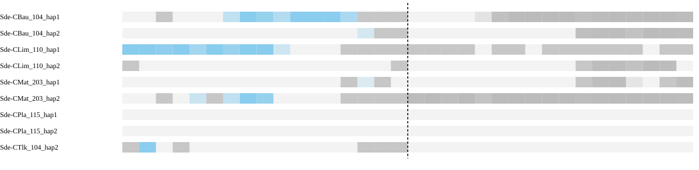

Different chromosomes means the assessed sides map to separate chromosomes in the peer, not that the peer has a fusion. Haplotypes are grouped by individual in the summary. Absence of an expected homologous match can be evidence when sequence availability and assay sensitivity are established. Failure of a qualifying alignment filter alone does not establish biological absence; the coverage and limitation columns show what was measured.

### Local sequence and contact support

| Assay | Measurement |
| --- | --- |
| Qualified immediate HiFi spanning molecules | 0 |
| Qualified HiFi flank molecules left/right | 0 / 4 |
| HiFi informative | False |
| Graph context | screened_primary_contig_paths |

Zero spanning reads must be interpreted with flank coverage, ambiguity and interval width. Graph connectivity alone does not establish a correct join.

| HiFi offset kb | Left molecules | Right molecules | Spanning molecules | Median depth left/right | Flanks observable |
| --- | --- | --- | --- | --- | --- |
| 100 | 7 | 22 | 0 | 12.0 / 35.0 | False |
| 250 | 9 | 26 | 0 | 23.0 / 29.0 | False |
| 500 | 30 | 21 | 0 | 43.0 / 36.0 | True |

Observable distant flanks show reads are available on each side; no spanning reads across a long interval do not by themselves test the exact seam.

| Library | Offset kb | Cross pairs | Within left/right | Sequence/gap controls | Informative |
| --- | --- | --- | --- | --- | --- |
| Ex2 | 100 | 7 | 2441 / 4983 | 0 / 0 | False |
| Ex3 | 100 | 18 | 2409 / 5745 | 0 / 0 | False |
| Ex2 | 250 | 16 | 7594 / 6922 | 4 / 2 | False |
| Ex3 | 250 | 17 | 8039 / 8032 | 4 / 2 | False |
| Ex2 | 500 | 5 | 7173 / 7259 | 2 / 1 | False |
| Ex3 | 500 | 5 | 7985 / 7946 | 2 / 1 | False |

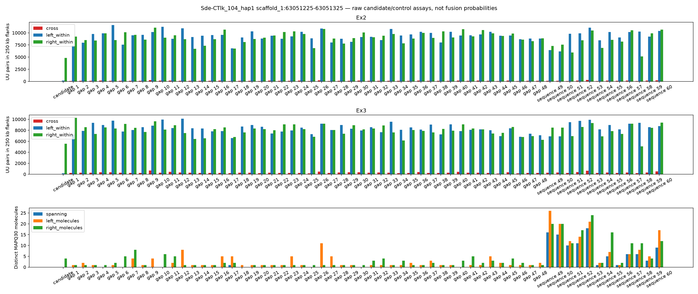

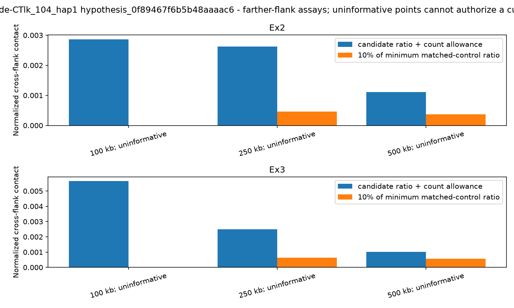

[IGV session: original coordinates](sequence-context/Sde-CTlk_104_hap1.sequence_context/hypothesis_0f89467f6b5b48aaaac6.igv.xml)

Scaffolding Hi-C is corroboration, not independent validation. Small control populations and poor observability limit conclusions from weak support.

**Decision needed:** review supporting, opposing and missing evidence before selecting an exact cut. Leave retained or unresolved rows at NO and record reviewer and rationale.

<details><summary>Full candidate measurements</summary>

```json
{
  "assembly": "Sde-CTlk_104_hap1",
  "scaffold": "scaffold_1",
  "assessment_sha256": "1fd4707ae4958ce31f7e95b5732e01d70686755c6a62a414b080fac24e4fd96a",
  "coordinate_stage": "pre_finishing",
  "review_only": true,
  "source_candidates": [
    "candidate_1"
  ],
  "packet_interval_id": "hypothesis_0f89467f6b5b48aaaac6",
  "gap_start": 63051225,
  "gap_end": 63051325,
  "cut_bp": 63051325,
  "verified_gap": true,
  "assessment_scaffold_length": 138446979,
  "hifi_spanning_molecules": 0,
  "graph_status": "screened_primary_contig_paths",
  "graph_contradiction": false,
  "native_continuity": false,
  "direct_native_link": false,
  "native_left": "h1tg000004l",
  "native_right": "h1tg000036l",
  "native_graph_sha256": "9b5ccab05303dc95c5d525f6ae565d219b4417d92b8046f0ecc6e5fb203ce355",
  "interpretation": "Primary path continuity alone is not read support or biological fusion confirmation; unmeasured unitig paths remain a limitation.",
  "chromosome_blocks": {
    "localized": false,
    "independent_individuals": [],
    "chromosome_pair": null,
    "contradictory_pairs": false,
    "peer_assays": [
      {
        "peer": "Sde-CBau_104_hap1",
        "sample": "Sde-CBau_104",
        "auto_evidence": true,
        "chromosome_pair": null,
        "qualified": false,
        "unique_gap_localization": false,
        "trials": [
          {
            "offset_bp": 100000,
            "left_chrom": null,
            "right_chrom": null,
            "left_target": null,
            "right_target": null,
            "usable": false,
            "left_edge": 62951225,
            "right_edge": 63151325
          },
          {
            "offset_bp": 250000,
            "left_chrom": "chr9",
            "right_chrom": null,
            "left_target": "scaffold_7",
            "right_target": null,
            "usable": false,
            "left_edge": 62801225,
            "right_edge": 63301325
          },
          {
            "offset_bp": 500000,
            "left_chrom": null,
            "right_chrom": null,
            "left_target": null,
            "right_target": null,
            "usable": false,
            "left_edge": 62551225,
            "right_edge": 63551325
          }
        ]
      },
      {
        "peer": "Sde-CBau_104_hap2",
        "sample": "Sde-CBau_104",
        "auto_evidence": true,
        "chromosome_pair": null,
        "qualified": false,
        "unique_gap_localization": false,
        "trials": [
          {
            "offset_bp": 100000,
            "left_chrom": null,
            "right_chrom": null,
            "left_target": null,
            "right_target": null,
            "usable": false,
            "left_edge": 62951225,
            "right_edge": 63151325
          },
          {
            "offset_bp": 250000,
            "left_chrom": null,
            "right_chrom": null,
            "left_target": null,
            "right_target": null,
            "usable": false,
            "left_edge": 62801225,
            "right_edge": 63301325
          },
          {
            "offset_bp": 500000,
            "left_chrom": null,
            "right_chrom": null,
            "left_target": null,
            "right_target": null,
            "usable": false,
            "left_edge": 62551225,
            "right_edge": 63551325
          }
        ]
      },
      {
        "peer": "Sde-CLim_110_hap1",
        "sample": "Sde-CLim_110",
        "auto_evidence": true,
        "chromosome_pair": null,
        "qualified": false,
        "unique_gap_localization": false,
        "trials": [
          {
            "offset_bp": 100000,
            "left_chrom": null,
            "right_chrom": null,
            "left_target": null,
            "right_target": null,
            "usable": false,
            "left_edge": 62951225,
            "right_edge": 63151325
          },
          {
            "offset_bp": 250000,
            "left_chrom": null,
            "right_chrom": null,
            "left_target": null,
            "right_target": null,
            "usable": false,
            "left_edge": 62801225,
            "right_edge": 63301325
          },
          {
            "offset_bp": 500000,
            "left_chrom": null,
            "right_chrom": null,
            "left_target": null,
            "right_target": null,
            "usable": false,
            "left_edge": 62551225,
            "right_edge": 63551325
          }
        ]
      },
      {
        "peer": "Sde-CLim_110_hap2",
        "sample": "Sde-CLim_110",
        "auto_evidence": true,
        "chromosome_pair": null,
        "qualified": false,
        "unique_gap_localization": false,
        "trials": [
          {
            "offset_bp": 100000,
            "left_chrom": null,
            "right_chrom": null,
            "left_target": null,
            "right_target": null,
            "usable": false,
            "left_edge": 62951225,
            "right_edge": 63151325
          },
          {
            "offset_bp": 250000,
            "left_chrom": null,
            "right_chrom": null,
            "left_target": null,
            "right_target": null,
            "usable": false,
            "left_edge": 62801225,
            "right_edge": 63301325
          },
          {
            "offset_bp": 500000,
            "left_chrom": null,
            "right_chrom": null,
            "left_target": null,
            "right_target": null,
            "usable": false,
            "left_edge": 62551225,
            "right_edge": 63551325
          }
        ]
      },
      {
        "peer": "Sde-CMat_203_hap1",
        "sample": "Sde-CMat_203",
        "auto_evidence": true,
        "chromosome_pair": null,
        "qualified": false,
        "unique_gap_localization": false,
        "trials": [
          {
            "offset_bp": 100000,
            "left_chrom": null,
            "right_chrom": null,
            "left_target": null,
            "right_target": null,
            "usable": false,
            "left_edge": 62951225,
            "right_edge": 63151325
          },
          {
            "offset_bp": 250000,
            "left_chrom": null,
            "right_chrom": null,
            "left_target": null,
            "right_target": null,
            "usable": false,
            "left_edge": 62801225,
            "right_edge": 63301325
          },
          {
            "offset_bp": 500000,
            "left_chrom": null,
            "right_chrom": null,
            "left_target": null,
            "right_target": null,
            "usable": false,
            "left_edge": 62551225,
            "right_edge": 63551325
          }
        ]
      },
      {
        "peer": "Sde-CMat_203_hap2",
        "sample": "Sde-CMat_203",
        "auto_evidence": true,
        "chromosome_pair": null,
        "qualified": false,
        "unique_gap_localization": false,
        "trials": [
          {
            "offset_bp": 100000,
            "left_chrom": null,
            "right_chrom": "chr7",
            "left_target": null,
            "right_target": "scaffold_6",
            "usable": false,
            "left_edge": 62951225,
            "right_edge": 63151325
          },
          {
            "offset_bp": 250000,
            "left_chrom": null,
            "right_chrom": "chr7",
            "left_target": null,
            "right_target": "scaffold_6",
            "usable": false,
            "left_edge": 62801225,
            "right_edge": 63301325
          },
          {
            "offset_bp": 500000,
            "left_chrom": null,
            "right_chrom": null,
            "left_target": null,
            "right_target": null,
            "usable": false,
            "left_edge": 62551225,
            "right_edge": 63551325
          }
        ]
      },
      {
        "peer": "Sde-CPla_115_hap1",
        "sample": "Sde-CPla_115",
        "auto_evidence": false,
        "chromosome_pair": null,
        "qualified": false,
        "unique_gap_localization": false,
        "trials": [
          {
            "offset_bp": 100000,
            "left_chrom": null,
            "right_chrom": null,
            "left_target": null,
            "right_target": null,
            "usable": false,
            "left_edge": 62951225,
            "right_edge": 63151325
          },
          {
            "offset_bp": 250000,
            "left_chrom": null,
            "right_chrom": null,
            "left_target": null,
            "right_target": null,
            "usable": false,
            "left_edge": 62801225,
            "right_edge": 63301325
          },
          {
            "offset_bp": 500000,
            "left_chrom": null,
            "right_chrom": null,
            "left_target": null,
            "right_target": null,
            "usable": false,
            "left_edge": 62551225,
            "right_edge": 63551325
          }
        ]
      },
      {
        "peer": "Sde-CPla_115_hap2",
        "sample": "Sde-CPla_115",
        "auto_evidence": false,
        "chromosome_pair": null,
        "qualified": false,
        "unique_gap_localization": false,
        "trials": [
          {
            "offset_bp": 100000,
            "left_chrom": null,
            "right_chrom": null,
            "left_target": null,
            "right_target": "scaffold_20",
            "usable": false,
            "left_edge": 62951225,
            "right_edge": 63151325
          },
          {
            "offset_bp": 250000,
            "left_chrom": null,
            "right_chrom": null,
            "left_target": null,
            "right_target": null,
            "usable": false,
            "left_edge": 62801225,
            "right_edge": 63301325
          },
          {
            "offset_bp": 500000,
            "left_chrom": null,
            "right_chrom": null,
            "left_target": null,
            "right_target": null,
            "usable": false,
            "left_edge": 62551225,
            "right_edge": 63551325
          }
        ]
      },
      {
        "peer": "Sde-CTlk_104_hap2",
        "sample": "Sde-CTlk_104",
        "auto_evidence": true,
        "chromosome_pair": null,
        "qualified": false,
        "unique_gap_localization": false,
        "trials": [
          {
            "offset_bp": 100000,
            "left_chrom": null,
            "right_chrom": null,
            "left_target": null,
            "right_target": "scaffold_5",
            "usable": false,
            "left_edge": 62951225,
            "right_edge": 63151325
          },
          {
            "offset_bp": 250000,
            "left_chrom": null,
            "right_chrom": null,
            "left_target": null,
            "right_target": null,
            "usable": false,
            "left_edge": 62801225,
            "right_edge": 63301325
          },
          {
            "offset_bp": 500000,
            "left_chrom": null,
            "right_chrom": null,
            "left_target": null,
            "right_target": null,
            "usable": false,
            "left_edge": 62551225,
            "right_edge": 63551325
          }
        ]
      }
    ]
  },
  "farther_contact_evidence": {
    "supported_offsets": [],
    "pass_all": false,
    "contradictory_informative_trial": false,
    "trials": [
      {
        "offset_bp": 100000,
        "library": "Ex2",
        "informative": false,
        "control_populations": {
          "continuous_control": 0,
          "gap_control": 0
        },
        "matched_control_ids": [],
        "minimum_control_ratio": 0,
        "upper_count_allowance_ratio": 0.0028672837058013973,
        "support_loss": false,
        "raw_counts": {
          "right_ends": 30367,
          "left_ends": 15706,
          "left_within": 2441,
          "cross": 7,
          "right_within": 4983
        }
      },
      {
        "offset_bp": 100000,
        "library": "Ex3",
        "informative": false,
        "control_populations": {
          "continuous_control": 0,
          "gap_control": 0
        },
        "matched_control_ids": [],
        "minimum_control_ratio": 0,
        "upper_count_allowance_ratio": 0.0056448951318619645,
        "support_loss": false,
        "raw_counts": {
          "left_ends": 10131,
          "right_ends": 21378,
          "left_within": 2409,
          "cross": 18,
          "right_within": 5745
        }
      },
      {
        "offset_bp": 250000,
        "library": "Ex2",
        "informative": false,
        "control_populations": {
          "continuous_control": 4,
          "gap_control": 2
        },
        "matched_control_ids": [
          "control_3799c7350d9d9a5a2361",
          "control_33c05a9cdb69e3d1db6f",
          "continuous_b7ba229530814a11184a",
          "continuous_32df9ccb6605fae7239b",
          "continuous_003987e8c2843b5c7d43",
          "continuous_154737139a6942d99c1d"
        ],
        "minimum_control_ratio": 0.004572626964537175,
        "upper_count_allowance_ratio": 0.002620610682810437,
        "support_loss": false,
        "raw_counts": {
          "right_ends": 39885,
          "left_ends": 45025,
          "left_within": 7594,
          "cross": 16,
          "right_within": 6922
        }
      },
      {
        "offset_bp": 250000,
        "library": "Ex3",
        "informative": false,
        "control_populations": {
          "continuous_control": 4,
          "gap_control": 2
        },
        "matched_control_ids": [
          "control_3799c7350d9d9a5a2361",
          "control_33c05a9cdb69e3d1db6f",
          "continuous_b7ba229530814a11184a",
          "continuous_32df9ccb6605fae7239b",
          "continuous_003987e8c2843b5c7d43",
          "continuous_154737139a6942d99c1d"
        ],
        "minimum_control_ratio": 0.006249849697024545,
        "upper_count_allowance_ratio": 0.0024889554971299697,
        "support_loss": false,
        "raw_counts": {
          "left_ends": 30700,
          "right_ends": 29371,
          "left_within": 8039,
          "cross": 17,
          "right_within": 8032
        }
      },
      {
        "offset_bp": 500000,
        "library": "Ex2",
        "informative": false,
        "control_populations": {
          "continuous_control": 2,
          "gap_control": 1
        },
        "matched_control_ids": [
          "control_0c92f0e3bd6df200dcd1",
          "continuous_16eabe0065c1a1be81b7",
          "continuous_c01f21a9e778cdc867d4"
        ],
        "minimum_control_ratio": 0.0037072906789429485,
        "upper_count_allowance_ratio": 0.001108667134361911,
        "support_loss": false,
        "raw_counts": {
          "right_ends": 42196,
          "left_ends": 40102,
          "left_within": 7173,
          "cross": 5,
          "right_within": 7259
        }
      },
      {
        "offset_bp": 500000,
        "library": "Ex3",
        "informative": false,
        "control_populations": {
          "continuous_control": 2,
          "gap_control": 1
        },
        "matched_control_ids": [
          "control_0c92f0e3bd6df200dcd1",
          "continuous_16eabe0065c1a1be81b7",
          "continuous_c01f21a9e778cdc867d4"
        ],
        "minimum_control_ratio": 0.005577960340932124,
        "upper_count_allowance_ratio": 0.0010043341876900239,
        "support_loss": false,
        "raw_counts": {
          "left_ends": 29387,
          "right_ends": 29579,
          "left_within": 7985,
          "cross": 5,
          "right_within": 7946
        }
      }
    ]
  },
  "farther_hifi": {
    "100000": {
      "informative": false,
      "raw": {
        "left_molecules": 7,
        "right_molecules": 22,
        "spanning": 0,
        "left_median_depth": 12.0,
        "right_median_depth": 35.0,
        "left_covered_fraction": 1.0,
        "right_covered_fraction": 1.0
      }
    },
    "250000": {
      "informative": false,
      "raw": {
        "left_molecules": 9,
        "right_molecules": 26,
        "spanning": 0,
        "left_median_depth": 23.0,
        "right_median_depth": 29.0,
        "left_covered_fraction": 1.0,
        "right_covered_fraction": 1.0
      }
    },
    "500000": {
      "informative": true,
      "raw": {
        "left_molecules": 30,
        "right_molecules": 21,
        "spanning": 0,
        "left_median_depth": 43.0,
        "right_median_depth": 36.0,
        "left_covered_fraction": 1.0,
        "right_covered_fraction": 1.0
      }
    }
  },
  "haplotype_block_conflict": false,
  "repeat_obscured_localization": false,
  "control_qualification": [
    {
      "id": "control_050cef3a3ec609b07cf1",
      "population": "gap_control",
      "qualified": false,
      "reasons": [
        "fewer_than_three_independent_continuous_peers"
      ]
    },
    {
      "id": "control_7aad69f9d33d9c657c30",
      "population": "gap_control",
      "qualified": false,
      "reasons": [
        "fewer_than_three_independent_continuous_peers"
      ]
    },
    {
      "id": "control_5cae74f1d2d925b9b430",
      "population": "gap_control",
      "qualified": false,
      "reasons": [
        "fewer_than_three_independent_continuous_peers"
      ]
    },
    {
      "id": "control_2a1c993a993df142204d",
      "population": "gap_control",
      "qualified": true,
      "reasons": []
    },
    {
      "id": "control_312fa3097873ad35e37b",
      "population": "gap_control",
      "qualified": false,
      "reasons": [
        "fewer_than_three_independent_continuous_peers"
      ]
    },
    {
      "id": "control_b2d47670e368ddb5edb3",
      "population": "gap_control",
      "qualified": false,
      "reasons": [
        "fewer_than_three_independent_continuous_peers"
      ]
    },
    {
      "id": "control_1337a1d2d985e9f38735",
      "population": "gap_control",
      "qualified": false,
      "reasons": [
        "fewer_than_three_independent_continuous_peers"
      ]
    },
    {
      "id": "control_90a12f6c37c5e683f2a2",
      "population": "gap_control",
      "qualified": false,
      "reasons": [
        "fewer_than_three_independent_continuous_peers"
      ]
    },
    {
      "id": "control_3799c7350d9d9a5a2361",
      "population": "gap_control",
      "qualified": true,
      "reasons": []
    },
    {
      "id": "control_33c05a9cdb69e3d1db6f",
      "population": "gap_control",
      "qualified": true,
      "reasons": []
    },
    {
      "id": "control_83cc4ef164b7573ea807",
      "population": "gap_control",
      "qualified": false,
      "reasons": [
        "fewer_than_three_independent_continuous_peers"
      ]
    },
    {
      "id": "control_633ceebbda40a661d411",
      "population": "gap_control",
      "qualified": false,
      "reasons": [
        "fewer_than_three_independent_continuous_peers"
      ]
    },
    {
      "id": "control_988400f3a9a52d94a557",
      "population": "gap_control",
      "qualified": false,
      "reasons": [
        "fewer_than_three_independent_continuous_peers"
      ]
    },
    {
      "id": "control_45e13703371e2f093b14",
      "population": "gap_control",
      "qualified": false,
      "reasons": [
        "fewer_than_three_independent_continuous_peers"
      ]
    },
    {
      "id": "control_c9e229801b772ae2d28c",
      "population": "gap_control",
      "qualified": false,
      "reasons": [
        "fewer_than_three_independent_continuous_peers"
      ]
    },
    {
      "id": "control_c111d6aa788fc339b924",
      "population": "gap_control",
      "qualified": false,
      "reasons": [
        "fewer_than_three_independent_continuous_peers"
      ]
    },
    {
      "id": "control_3017e76d8005ebf12bc7",
      "population": "gap_control",
      "qualified": false,
      "reasons": [
        "fewer_than_three_independent_continuous_peers"
      ]
    },
    {
      "id": "control_71f8609f8d738e874873",
      "population": "gap_control",
      "qualified": false,
      "reasons": [
        "fewer_than_three_independent_continuous_peers"
      ]
    },
    {
      "id": "control_e42245f17f7c418d8a1e",
      "population": "gap_control",
      "qualified": false,
      "reasons": [
        "fewer_than_three_independent_continuous_peers"
      ]
    },
    {
      "id": "control_a0df9e6624bd183ac3f2",
      "population": "gap_control",
      "qualified": false,
      "reasons": [
        "fewer_than_three_independent_continuous_peers"
      ]
    },
    {
      "id": "control_c2424e789cdef6dcf374",
      "population": "gap_control",
      "qualified": false,
      "reasons": [
        "fewer_than_three_independent_continuous_peers"
      ]
    },
    {
      "id": "control_5e57a66fe9803b1f9fe1",
      "population": "gap_control",
      "qualified": false,
      "reasons": [
        "fewer_than_three_independent_continuous_peers"
      ]
    },
    {
      "id": "control_ba9e581c3ee135101cfe",
      "population": "gap_control",
      "qualified": false,
      "reasons": [
        "fewer_than_three_independent_continuous_peers"
      ]
    },
    {
      "id": "control_a11a65dbba14655bc5e0",
      "population": "gap_control",
      "qualified": false,
      "reasons": [
        "fewer_than_three_independent_continuous_peers"
      ]
    },
    {
      "id": "control_8cc34cba939af7395cac",
      "population": "gap_control",
      "qualified": false,
      "reasons": [
        "fewer_than_three_independent_continuous_peers"
      ]
    },
    {
      "id": "control_19a94c1fd5b20d6f3e3a",
      "population": "gap_control",
      "qualified": false,
      "reasons": [
        "fewer_than_three_independent_continuous_peers"
      ]
    },
    {
      "id": "control_41ead556a290060e5108",
      "population": "gap_control",
      "qualified": false,
      "reasons": [
        "fewer_than_three_independent_continuous_peers"
      ]
    },
    {
      "id": "control_70372894eebca7e0360b",
      "population": "gap_control",
      "qualified": false,
      "reasons": [
        "fewer_than_three_independent_continuous_peers"
      ]
    },
    {
      "id": "control_271cf7c86e9cb5896e3a",
      "population": "gap_control",
      "qualified": false,
      "reasons": [
        "fewer_than_three_independent_continuous_peers"
      ]
    },
    {
      "id": "control_3c7013eb4d162bfab343",
      "population": "gap_control",
      "qualified": false,
      "reasons": [
        "fewer_than_three_independent_continuous_peers"
      ]
    },
    {
      "id": "control_ae4d45d0f1690a296d6f",
      "population": "gap_control",
      "qualified": false,
      "reasons": [
        "fewer_than_three_independent_continuous_peers"
      ]
    },
    {
      "id": "control_6b925c578e4356ac7454",
      "population": "gap_control",
      "qualified": false,
      "reasons": [
        "fewer_than_three_independent_continuous_peers"
      ]
    },
    {
      "id": "control_1b9e1b1b958c6ab798e1",
      "population": "gap_control",
      "qualified": false,
      "reasons": [
        "fewer_than_three_independent_continuous_peers"
      ]
    },
    {
      "id": "control_38cc216229685287e9a2",
      "population": "gap_control",
      "qualified": false,
      "reasons": [
        "fewer_than_three_independent_continuous_peers"
      ]
    },
    {
      "id": "control_566ff3919f462aa18929",
      "population": "gap_control",
      "qualified": false,
      "reasons": [
        "fewer_than_three_independent_continuous_peers"
      ]
    },
    {
      "id": "control_119c410e200d5c9701f4",
      "population": "gap_control",
      "qualified": false,
      "reasons": [
        "fewer_than_three_independent_continuous_peers"
      ]
    },
    {
      "id": "control_1300300ccb94604a75b2",
      "population": "gap_control",
      "qualified": false,
      "reasons": [
        "fewer_than_three_independent_continuous_peers"
      ]
    },
    {
      "id": "control_7f2ad1e2ad2982ed36ad",
      "population": "gap_control",
      "qualified": false,
      "reasons": [
        "fewer_than_three_independent_continuous_peers"
      ]
    },
    {
      "id": "control_64d391dbbe7c10217c1c",
      "population": "gap_control",
      "qualified": false,
      "reasons": [
        "fewer_than_three_independent_continuous_peers"
      ]
    },
    {
      "id": "control_6bec13c2f9caa589fc10",
      "population": "gap_control",
      "qualified": false,
      "reasons": [
        "fewer_than_three_independent_continuous_peers"
      ]
    },
    {
      "id": "control_036e95706b9c1b8735d5",
      "population": "gap_control",
      "qualified": false,
      "reasons": [
        "fewer_than_three_independent_continuous_peers"
      ]
    },
    {
      "id": "control_0c92f0e3bd6df200dcd1",
      "population": "gap_control",
      "qualified": true,
      "reasons": []
    },
    {
      "id": "control_643d25aa398b3c009760",
      "population": "gap_control",
      "qualified": false,
      "reasons": [
        "fewer_than_three_independent_continuous_peers"
      ]
    },
    {
      "id": "control_5648228c45794f7906a8",
      "population": "gap_control",
      "qualified": false,
      "reasons": [
        "fewer_than_three_independent_continuous_peers"
      ]
    },
    {
      "id": "control_886f4cdf205234ecb3f8",
      "population": "gap_control",
      "qualified": false,
      "reasons": [
        "fewer_than_three_independent_continuous_peers"
      ]
    },
    {
      "id": "control_ccfee1df752bd26bd84c",
      "population": "gap_control",
      "qualified": false,
      "reasons": [
        "fewer_than_three_independent_continuous_peers"
      ]
    },
    {
      "id": "control_3134eec55122ce633469",
      "population": "gap_control",
      "qualified": false,
      "reasons": [
        "fewer_than_three_independent_continuous_peers"
      ]
    },
    {
      "id": "control_9444ce1226c9b1a1ee1c",
      "population": "gap_control",
      "qualified": false,
      "reasons": [
        "fewer_than_three_independent_continuous_peers"
      ]
    },
    {
      "id": "continuous_b7ba229530814a11184a",
      "population": "continuous_control",
      "qualified": true,
      "reasons": []
    },
    {
      "id": "continuous_32df9ccb6605fae7239b",
      "population": "continuous_control",
      "qualified": true,
      "reasons": []
    },
    {
      "id": "continuous_16eabe0065c1a1be81b7",
      "population": "continuous_control",
      "qualified": true,
      "reasons": []
    },
    {
      "id": "continuous_c01f21a9e778cdc867d4",
      "population": "continuous_control",
      "qualified": true,
      "reasons": []
    },
    {
      "id": "continuous_003987e8c2843b5c7d43",
      "population": "continuous_control",
      "qualified": true,
      "reasons": []
    },
    {
      "id": "continuous_6cf47791891437ab2de9",
      "population": "continuous_control",
      "qualified": false,
      "reasons": [
        "uninformative_hifi_flanks",
        "fewer_than_two_hifi_bridges"
      ]
    },
    {
      "id": "continuous_0685b7402bc86455adde",
      "population": "continuous_control",
      "qualified": false,
      "reasons": [
        "uninformative_hifi_flanks"
      ]
    },
    {
      "id": "continuous_a6adce48ab01be725bef",
      "population": "continuous_control",
      "qualified": false,
      "reasons": [
        "uninformative_hifi_flanks",
        "fewer_than_two_hifi_bridges"
      ]
    },
    {
      "id": "continuous_f1855e0c810c0742d9c9",
      "population": "continuous_control",
      "qualified": false,
      "reasons": [
        "uninformative_hifi_flanks"
      ]
    },
    {
      "id": "continuous_89c1e3a1b1e257c8c728",
      "population": "continuous_control",
      "qualified": false,
      "reasons": [
        "uninformative_hifi_flanks"
      ]
    },
    {
      "id": "continuous_10002583619de4e8c9f6",
      "population": "continuous_control",
      "qualified": false,
      "reasons": [
        "uninformative_hifi_flanks"
      ]
    },
    {
      "id": "continuous_154737139a6942d99c1d",
      "population": "continuous_control",
      "qualified": true,
      "reasons": []
    }
  ],
  "hifi_informative": false,
  "matched_controls_pass": false,
  "hic_informative": false,
  "hic_support_loss": false,
  "libraries": [
    {
      "library": "Ex2",
      "matched_controls": 0,
      "control_populations": {
        "continuous_control": 0,
        "gap_control": 0
      },
      "informative": false,
      "ratio": 0.0,
      "upper_count_allowance_ratio": 0.0034489981813469956,
      "minimum_control_ratio": 0,
      "support_loss": false,
      "raw_counts": {
        "right_ends": 28814,
        "left_ends": 1456,
        "left_within": 157,
        "right_within": 4819
      }
    },
    {
      "library": "Ex3",
      "matched_controls": 0,
      "control_populations": {
        "continuous_control": 0,
        "gap_control": 0
      },
      "informative": false,
      "ratio": 0.0020999241547341296,
      "upper_count_allowance_ratio": 0.005249810386835324,
      "minimum_control_ratio": 0,
      "support_loss": false,
      "raw_counts": {
        "right_ends": 21006,
        "left_ends": 844,
        "left_within": 163,
        "cross": 2,
        "right_within": 5565
      }
    }
  ],
  "independent_discordant_individuals": 0,
  "alternative_placements_checked": true,
  "control_ids": [
    "control_050cef3a3ec609b07cf1",
    "control_7aad69f9d33d9c657c30",
    "control_5cae74f1d2d925b9b430",
    "control_2a1c993a993df142204d",
    "control_312fa3097873ad35e37b",
    "control_b2d47670e368ddb5edb3",
    "control_1337a1d2d985e9f38735",
    "control_90a12f6c37c5e683f2a2",
    "control_3799c7350d9d9a5a2361",
    "control_33c05a9cdb69e3d1db6f",
    "control_83cc4ef164b7573ea807",
    "control_633ceebbda40a661d411",
    "control_988400f3a9a52d94a557",
    "control_45e13703371e2f093b14",
    "control_c9e229801b772ae2d28c",
    "control_c111d6aa788fc339b924",
    "control_3017e76d8005ebf12bc7",
    "control_71f8609f8d738e874873",
    "control_e42245f17f7c418d8a1e",
    "control_a0df9e6624bd183ac3f2",
    "control_c2424e789cdef6dcf374",
    "control_5e57a66fe9803b1f9fe1",
    "control_ba9e581c3ee135101cfe",
    "control_a11a65dbba14655bc5e0",
    "control_8cc34cba939af7395cac",
    "control_19a94c1fd5b20d6f3e3a",
    "control_41ead556a290060e5108",
    "control_70372894eebca7e0360b",
    "control_271cf7c86e9cb5896e3a",
    "control_3c7013eb4d162bfab343",
    "control_ae4d45d0f1690a296d6f",
    "control_6b925c578e4356ac7454",
    "control_1b9e1b1b958c6ab798e1",
    "control_38cc216229685287e9a2",
    "control_566ff3919f462aa18929",
    "control_119c410e200d5c9701f4",
    "control_1300300ccb94604a75b2",
    "control_7f2ad1e2ad2982ed36ad",
    "control_64d391dbbe7c10217c1c",
    "control_6bec13c2f9caa589fc10",
    "control_036e95706b9c1b8735d5",
    "control_0c92f0e3bd6df200dcd1",
    "control_643d25aa398b3c009760",
    "control_5648228c45794f7906a8",
    "control_886f4cdf205234ecb3f8",
    "control_ccfee1df752bd26bd84c",
    "control_3134eec55122ce633469",
    "control_9444ce1226c9b1a1ee1c",
    "continuous_b7ba229530814a11184a",
    "continuous_32df9ccb6605fae7239b",
    "continuous_16eabe0065c1a1be81b7",
    "continuous_c01f21a9e778cdc867d4",
    "continuous_003987e8c2843b5c7d43",
    "continuous_6cf47791891437ab2de9",
    "continuous_0685b7402bc86455adde",
    "continuous_a6adce48ab01be725bef",
    "continuous_f1855e0c810c0742d9c9",
    "continuous_89c1e3a1b1e257c8c728",
    "continuous_10002583619de4e8c9f6",
    "continuous_154737139a6942d99c1d"
  ],
  "hifi_raw": {
    "left_molecules": 0,
    "right_molecules": 4,
    "spanning": 0,
    "left_median_depth": 2.0,
    "right_median_depth": 9.0,
    "left_covered_fraction": 0.0,
    "right_covered_fraction": 1.0
  },
  "alternative_placement_scope": "Assessment BAM MAPQ and competing peer anchors; bounded emitted alternatives, no proof of haplotype-specific uniqueness",
  "chromosome_tracks": [
    {
      "peer": "Sde-CBau_104_hap1",
      "sample": "Sde-CBau_104",
      "auto_evidence": true,
      "relationship": "different_chromosomes",
      "bins": [
        {
          "lo": 0,
          "hi": 50000,
          "aligned_bp": 0,
          "ambiguous_bp": 0,
          "dominance": 0.0,
          "chrom": null,
          "counts": {
            "chr9": 0,
            "chr7": 0
          }
        },
        {
          "lo": 50000,
          "hi": 100000,
          "aligned_bp": 0,
          "ambiguous_bp": 0,
          "dominance": 0.0,
          "chrom": null,
          "counts": {
            "chr9": 0,
            "chr7": 0
          }
        },
        {
          "lo": 100000,
          "hi": 150000,
          "aligned_bp": 2244,
          "ambiguous_bp": 0,
          "dominance": 1.0,
          "chrom": null,
          "counts": {
            "chr9": 2244,
            "chr7": 0
          }
        },
        {
          "lo": 150000,
          "hi": 200000,
          "aligned_bp": 0,
          "ambiguous_bp": 0,
          "dominance": 0.0,
          "chrom": null,
          "counts": {
            "chr9": 0,
            "chr7": 0
          }
        },
        {
          "lo": 200000,
          "hi": 250000,
          "aligned_bp": 0,
          "ambiguous_bp": 0,
          "dominance": 0.0,
          "chrom": null,
          "counts": {
            "chr9": 0,
            "chr7": 0
          }
        },
        {
          "lo": 250000,
          "hi": 300000,
          "aligned_bp": 0,
          "ambiguous_bp": 0,
          "dominance": 0.0,
          "chrom": null,
          "counts": {
            "chr9": 0,
            "chr7": 0
          }
        },
        {
          "lo": 300000,
          "hi": 350000,
          "aligned_bp": 23863,
          "ambiguous_bp": 0,
          "dominance": 1.0,
          "chrom": "chr9",
          "counts": {
            "chr9": 23863,
            "chr7": 0
          }
        },
        {
          "lo": 350000,
          "hi": 400000,
          "aligned_bp": 49983,
          "ambiguous_bp": 0,
          "dominance": 1.0,
          "chrom": "chr9",
          "counts": {
            "chr9": 49983,
            "chr7": 0
          }
        },
        {
          "lo": 400000,
          "hi": 450000,
          "aligned_bp": 43032,
          "ambiguous_bp": 0,
          "dominance": 1.0,
          "chrom": "chr9",
          "counts": {
            "chr9": 43032,
            "chr7": 0
          }
        },
        {
          "lo": 450000,
          "hi": 500000,
          "aligned_bp": 29631,
          "ambiguous_bp": 0,
          "dominance": 1.0,
          "chrom": "chr9",
          "counts": {
            "chr9": 29631,
            "chr7": 0
          }
        },
        {
          "lo": 500000,
          "hi": 550000,
          "aligned_bp": 49022,
          "ambiguous_bp": 0,
          "dominance": 1.0,
          "chrom": "chr9",
          "counts": {
            "chr9": 49022,
            "chr7": 0
          }
        },
        {
          "lo": 550000,
          "hi": 600000,
          "aligned_bp": 49152,
          "ambiguous_bp": 0,
          "dominance": 1.0,
          "chrom": "chr9",
          "counts": {
            "chr9": 49152,
            "chr7": 0
          }
        },
        {
          "lo": 600000,
          "hi": 650000,
          "aligned_bp": 48401,
          "ambiguous_bp": 0,
          "dominance": 1.0,
          "chrom": "chr9",
          "counts": {
            "chr9": 48401,
            "chr7": 0
          }
        },
        {
          "lo": 650000,
          "hi": 700000,
          "aligned_bp": 33455,
          "ambiguous_bp": 0,
          "dominance": 1.0,
          "chrom": "chr9",
          "counts": {
            "chr9": 33455,
            "chr7": 0
          }
        },
        {
          "lo": 700000,
          "hi": 750000,
          "aligned_bp": 8585,
          "ambiguous_bp": 0,
          "dominance": 1.0,
          "chrom": null,
          "counts": {
            "chr9": 8585,
            "chr7": 0
          }
        },
        {
          "lo": 750000,
          "hi": 800000,
          "aligned_bp": 2647,
          "ambiguous_bp": 0,
          "dominance": 1.0,
          "chrom": null,
          "counts": {
            "chr9": 2647,
            "chr7": 0
          }
        },
        {
          "lo": 800000,
          "hi": 850000,
          "aligned_bp": 1638,
          "ambiguous_bp": 0,
          "dominance": 0.6886446886446886,
          "chrom": null,
          "counts": {
            "chr9": 510,
            "chr7": 1128
          }
        },
        {
          "lo": 850000,
          "hi": 900000,
          "aligned_bp": 0,
          "ambiguous_bp": 0,
          "dominance": 0.0,
          "chrom": null,
          "counts": {
            "chr9": 0,
            "chr7": 0
          }
        },
        {
          "lo": 900000,
          "hi": 950000,
          "aligned_bp": 0,
          "ambiguous_bp": 0,
          "dominance": 0.0,
          "chrom": null,
          "counts": {
            "chr9": 0,
            "chr7": 0
          }
        },
        {
          "lo": 950000,
          "hi": 1000000,
          "aligned_bp": 0,
          "ambiguous_bp": 0,
          "dominance": 0.0,
          "chrom": null,
          "counts": {
            "chr9": 0,
            "chr7": 0
          }
        },
        {
          "lo": 1000000,
          "hi": 1050000,
          "aligned_bp": 0,
          "ambiguous_bp": 0,
          "dominance": 0.0,
          "chrom": null,
          "counts": {
            "chr9": 0,
            "chr7": 0
          }
        },
        {
          "lo": 1050000,
          "hi": 1100000,
          "aligned_bp": 14189,
          "ambiguous_bp": 0,
          "dominance": 1.0,
          "chrom": "chr7",
          "counts": {
            "chr9": 0,
            "chr7": 14189
          }
        },
        {
          "lo": 1100000,
          "hi": 1150000,
          "aligned_bp": 44791,
          "ambiguous_bp": 0,
          "dominance": 1.0,
          "chrom": "chr7",
          "counts": {
            "chr9": 0,
            "chr7": 44791
          }
        },
        {
          "lo": 1150000,
          "hi": 1200000,
          "aligned_bp": 49992,
          "ambiguous_bp": 0,
          "dominance": 1.0,
          "chrom": "chr7",
          "counts": {
            "chr9": 0,
            "chr7": 49992
          }
        },
        {
          "lo": 1200000,
          "hi": 1250000,
          "aligned_bp": 49985,
          "ambiguous_bp": 0,
          "dominance": 1.0,
          "chrom": "chr7",
          "counts": {
            "chr9": 0,
            "chr7": 49985
          }
        },
        {
          "lo": 1250000,
          "hi": 1300000,
          "aligned_bp": 49974,
          "ambiguous_bp": 0,
          "dominance": 1.0,
          "chrom": "chr7",
          "counts": {
            "chr9": 0,
            "chr7": 49974
          }
        },
        {
          "lo": 1300000,
          "hi": 1350000,
          "aligned_bp": 49973,
          "ambiguous_bp": 0,
          "dominance": 1.0,
          "chrom": "chr7",
          "counts": {
            "chr9": 0,
            "chr7": 49973
          }
        },
        {
          "lo": 1350000,
          "hi": 1400000,
          "aligned_bp": 46673,
          "ambiguous_bp": 0,
          "dominance": 1.0,
          "chrom": "chr7",
          "counts": {
            "chr9": 0,
            "chr7": 46673
          }
        },
        {
          "lo": 1400000,
          "hi": 1450000,
          "aligned_bp": 49714,
          "ambiguous_bp": 0,
          "dominance": 1.0,
          "chrom": "chr7",
          "counts": {
            "chr9": 0,
            "chr7": 49714
          }
        },
        {
          "lo": 1450000,
          "hi": 1500000,
          "aligned_bp": 49970,
          "ambiguous_bp": 0,
          "dominance": 1.0,
          "chrom": "chr7",
          "counts": {
            "chr9": 0,
            "chr7": 49970
          }
        },
        {
          "lo": 1500000,
          "hi": 1550000,
          "aligned_bp": 48787,
          "ambiguous_bp": 0,
          "dominance": 1.0,
          "chrom": "chr7",
          "counts": {
            "chr9": 0,
            "chr7": 48787
          }
        },
        {
          "lo": 1550000,
          "hi": 1600000,
          "aligned_bp": 49959,
          "ambiguous_bp": 0,
          "dominance": 1.0,
          "chrom": "chr7",
          "counts": {
            "chr9": 0,
            "chr7": 49959
          }
        },
        {
          "lo": 1600000,
          "hi": 1650000,
          "aligned_bp": 49791,
          "ambiguous_bp": 0,
          "dominance": 1.0,
          "chrom": "chr7",
          "counts": {
            "chr9": 0,
            "chr7": 49791
          }
        },
        {
          "lo": 1650000,
          "hi": 1700000,
          "aligned_bp": 48437,
          "ambiguous_bp": 0,
          "dominance": 1.0,
          "chrom": "chr7",
          "counts": {
            "chr9": 0,
            "chr7": 48437
          }
        },
        {
          "lo": 1700000,
          "hi": 1700100,
          "aligned_bp": 100,
          "ambiguous_bp": 0,
          "dominance": 1.0,
          "chrom": null,
          "counts": {
            "chr9": 0,
            "chr7": 100
          }
        }
      ],
      "left": {
        "chrom": "chr9",
        "aligned_bp": 341653,
        "coverage": 0.4019447058823529,
        "dominance": 0.9966984045215467,
        "informative_bins": 8,
        "qualified": true
      },
      "right": {
        "chrom": "chr7",
        "aligned_bp": 602335,
        "coverage": 0.7086294117647058,
        "dominance": 1.0,
        "informative_bins": 13,
        "qualified": true
      }
    },
    {
      "peer": "Sde-CBau_104_hap2",
      "sample": "Sde-CBau_104",
      "auto_evidence": true,
      "relationship": "uninformative",
      "bins": [
        {
          "lo": 0,
          "hi": 50000,
          "aligned_bp": 0,
          "ambiguous_bp": 0,
          "dominance": 0.0,
          "chrom": null,
          "counts": {
            "chr9": 0,
            "chr7": 0
          }
        },
        {
          "lo": 50000,
          "hi": 100000,
          "aligned_bp": 0,
          "ambiguous_bp": 0,
          "dominance": 0.0,
          "chrom": null,
          "counts": {
            "chr9": 0,
            "chr7": 0
          }
        },
        {
          "lo": 100000,
          "hi": 150000,
          "aligned_bp": 0,
          "ambiguous_bp": 0,
          "dominance": 0.0,
          "chrom": null,
          "counts": {
            "chr9": 0,
            "chr7": 0
          }
        },
        {
          "lo": 150000,
          "hi": 200000,
          "aligned_bp": 0,
          "ambiguous_bp": 0,
          "dominance": 0.0,
          "chrom": null,
          "counts": {
            "chr9": 0,
            "chr7": 0
          }
        },
        {
          "lo": 200000,
          "hi": 250000,
          "aligned_bp": 0,
          "ambiguous_bp": 0,
          "dominance": 0.0,
          "chrom": null,
          "counts": {
            "chr9": 0,
            "chr7": 0
          }
        },
        {
          "lo": 250000,
          "hi": 300000,
          "aligned_bp": 0,
          "ambiguous_bp": 0,
          "dominance": 0.0,
          "chrom": null,
          "counts": {
            "chr9": 0,
            "chr7": 0
          }
        },
        {
          "lo": 300000,
          "hi": 350000,
          "aligned_bp": 0,
          "ambiguous_bp": 0,
          "dominance": 0.0,
          "chrom": null,
          "counts": {
            "chr9": 0,
            "chr7": 0
          }
        },
        {
          "lo": 350000,
          "hi": 400000,
          "aligned_bp": 0,
          "ambiguous_bp": 0,
          "dominance": 0.0,
          "chrom": null,
          "counts": {
            "chr9": 0,
            "chr7": 0
          }
        },
        {
          "lo": 400000,
          "hi": 450000,
          "aligned_bp": 0,
          "ambiguous_bp": 0,
          "dominance": 0.0,
          "chrom": null,
          "counts": {
            "chr9": 0,
            "chr7": 0
          }
        },
        {
          "lo": 450000,
          "hi": 500000,
          "aligned_bp": 0,
          "ambiguous_bp": 0,
          "dominance": 0.0,
          "chrom": null,
          "counts": {
            "chr9": 0,
            "chr7": 0
          }
        },
        {
          "lo": 500000,
          "hi": 550000,
          "aligned_bp": 0,
          "ambiguous_bp": 0,
          "dominance": 0.0,
          "chrom": null,
          "counts": {
            "chr9": 0,
            "chr7": 0
          }
        },
        {
          "lo": 550000,
          "hi": 600000,
          "aligned_bp": 0,
          "ambiguous_bp": 0,
          "dominance": 0.0,
          "chrom": null,
          "counts": {
            "chr9": 0,
            "chr7": 0
          }
        },
        {
          "lo": 600000,
          "hi": 650000,
          "aligned_bp": 0,
          "ambiguous_bp": 0,
          "dominance": 0.0,
          "chrom": null,
          "counts": {
            "chr9": 0,
            "chr7": 0
          }
        },
        {
          "lo": 650000,
          "hi": 700000,
          "aligned_bp": 0,
          "ambiguous_bp": 0,
          "dominance": 0.0,
          "chrom": null,
          "counts": {
            "chr9": 0,
            "chr7": 0
          }
        },
        {
          "lo": 700000,
          "hi": 750000,
          "aligned_bp": 13844,
          "ambiguous_bp": 0,
          "dominance": 1.0,
          "chrom": "chr9",
          "counts": {
            "chr9": 13844,
            "chr7": 0
          }
        },
        {
          "lo": 750000,
          "hi": 800000,
          "aligned_bp": 434,
          "ambiguous_bp": 0,
          "dominance": 1.0,
          "chrom": null,
          "counts": {
            "chr9": 434,
            "chr7": 0
          }
        },
        {
          "lo": 800000,
          "hi": 850000,
          "aligned_bp": 444,
          "ambiguous_bp": 0,
          "dominance": 1.0,
          "chrom": null,
          "counts": {
            "chr9": 444,
            "chr7": 0
          }
        },
        {
          "lo": 850000,
          "hi": 900000,
          "aligned_bp": 0,
          "ambiguous_bp": 0,
          "dominance": 0.0,
          "chrom": null,
          "counts": {
            "chr9": 0,
            "chr7": 0
          }
        },
        {
          "lo": 900000,
          "hi": 950000,
          "aligned_bp": 0,
          "ambiguous_bp": 0,
          "dominance": 0.0,
          "chrom": null,
          "counts": {
            "chr9": 0,
            "chr7": 0
          }
        },
        {
          "lo": 950000,
          "hi": 1000000,
          "aligned_bp": 0,
          "ambiguous_bp": 0,
          "dominance": 0.0,
          "chrom": null,
          "counts": {
            "chr9": 0,
            "chr7": 0
          }
        },
        {
          "lo": 1000000,
          "hi": 1050000,
          "aligned_bp": 0,
          "ambiguous_bp": 0,
          "dominance": 0.0,
          "chrom": null,
          "counts": {
            "chr9": 0,
            "chr7": 0
          }
        },
        {
          "lo": 1050000,
          "hi": 1100000,
          "aligned_bp": 0,
          "ambiguous_bp": 0,
          "dominance": 0.0,
          "chrom": null,
          "counts": {
            "chr9": 0,
            "chr7": 0
          }
        },
        {
          "lo": 1100000,
          "hi": 1150000,
          "aligned_bp": 0,
          "ambiguous_bp": 0,
          "dominance": 0.0,
          "chrom": null,
          "counts": {
            "chr9": 0,
            "chr7": 0
          }
        },
        {
          "lo": 1150000,
          "hi": 1200000,
          "aligned_bp": 0,
          "ambiguous_bp": 0,
          "dominance": 0.0,
          "chrom": null,
          "counts": {
            "chr9": 0,
            "chr7": 0
          }
        },
        {
          "lo": 1200000,
          "hi": 1250000,
          "aligned_bp": 0,
          "ambiguous_bp": 0,
          "dominance": 0.0,
          "chrom": null,
          "counts": {
            "chr9": 0,
            "chr7": 0
          }
        },
        {
          "lo": 1250000,
          "hi": 1300000,
          "aligned_bp": 0,
          "ambiguous_bp": 0,
          "dominance": 0.0,
          "chrom": null,
          "counts": {
            "chr9": 0,
            "chr7": 0
          }
        },
        {
          "lo": 1300000,
          "hi": 1350000,
          "aligned_bp": 0,
          "ambiguous_bp": 0,
          "dominance": 0.0,
          "chrom": null,
          "counts": {
            "chr9": 0,
            "chr7": 0
          }
        },
        {
          "lo": 1350000,
          "hi": 1400000,
          "aligned_bp": 45837,
          "ambiguous_bp": 0,
          "dominance": 1.0,
          "chrom": "chr7",
          "counts": {
            "chr9": 0,
            "chr7": 45837
          }
        },
        {
          "lo": 1400000,
          "hi": 1450000,
          "aligned_bp": 48495,
          "ambiguous_bp": 0,
          "dominance": 1.0,
          "chrom": "chr7",
          "counts": {
            "chr9": 0,
            "chr7": 48495
          }
        },
        {
          "lo": 1450000,
          "hi": 1500000,
          "aligned_bp": 48472,
          "ambiguous_bp": 0,
          "dominance": 1.0,
          "chrom": "chr7",
          "counts": {
            "chr9": 0,
            "chr7": 48472
          }
        },
        {
          "lo": 1500000,
          "hi": 1550000,
          "aligned_bp": 43116,
          "ambiguous_bp": 0,
          "dominance": 1.0,
          "chrom": "chr7",
          "counts": {
            "chr9": 0,
            "chr7": 43116
          }
        },
        {
          "lo": 1550000,
          "hi": 1600000,
          "aligned_bp": 49801,
          "ambiguous_bp": 0,
          "dominance": 1.0,
          "chrom": "chr7",
          "counts": {
            "chr9": 0,
            "chr7": 49801
          }
        },
        {
          "lo": 1600000,
          "hi": 1650000,
          "aligned_bp": 49693,
          "ambiguous_bp": 0,
          "dominance": 1.0,
          "chrom": "chr7",
          "counts": {
            "chr9": 0,
            "chr7": 49693
          }
        },
        {
          "lo": 1650000,
          "hi": 1700000,
          "aligned_bp": 48423,
          "ambiguous_bp": 0,
          "dominance": 1.0,
          "chrom": "chr7",
          "counts": {
            "chr9": 0,
            "chr7": 48423
          }
        },
        {
          "lo": 1700000,
          "hi": 1700100,
          "aligned_bp": 100,
          "ambiguous_bp": 0,
          "dominance": 1.0,
          "chrom": null,
          "counts": {
            "chr9": 0,
            "chr7": 100
          }
        }
      ],
      "left": {
        "chrom": "chr9",
        "aligned_bp": 14722,
        "coverage": 0.01732,
        "dominance": 1.0,
        "informative_bins": 1,
        "qualified": false
      },
      "right": {
        "chrom": "chr7",
        "aligned_bp": 333937,
        "coverage": 0.3928670588235294,
        "dominance": 1.0,
        "informative_bins": 7,
        "qualified": false
      }
    },
    {
      "peer": "Sde-CLim_110_hap1",
      "sample": "Sde-CLim_110",
      "auto_evidence": true,
      "relationship": "uninformative",
      "bins": [
        {
          "lo": 0,
          "hi": 50000,
          "aligned_bp": 49975,
          "ambiguous_bp": 0,
          "dominance": 1.0,
          "chrom": "chr9",
          "counts": {
            "chr9": 49975,
            "chr3": 0,
            "chr10": 0,
            "chr4": 0,
            "chr5": 0,
            "chr2": 0,
            "chr15": 0,
            "chr8": 0,
            "chr12": 0,
            "chr1": 0,
            "chr7": 0,
            "chr11": 0
          }
        },
        {
          "lo": 50000,
          "hi": 100000,
          "aligned_bp": 49935,
          "ambiguous_bp": 0,
          "dominance": 1.0,
          "chrom": "chr9",
          "counts": {
            "chr9": 49935,
            "chr3": 0,
            "chr10": 0,
            "chr4": 0,
            "chr5": 0,
            "chr2": 0,
            "chr15": 0,
            "chr8": 0,
            "chr12": 0,
            "chr1": 0,
            "chr7": 0,
            "chr11": 0
          }
        },
        {
          "lo": 100000,
          "hi": 150000,
          "aligned_bp": 46325,
          "ambiguous_bp": 0,
          "dominance": 1.0,
          "chrom": "chr9",
          "counts": {
            "chr9": 46325,
            "chr3": 0,
            "chr10": 0,
            "chr4": 0,
            "chr5": 0,
            "chr2": 0,
            "chr15": 0,
            "chr8": 0,
            "chr12": 0,
            "chr1": 0,
            "chr7": 0,
            "chr11": 0
          }
        },
        {
          "lo": 150000,
          "hi": 200000,
          "aligned_bp": 49886,
          "ambiguous_bp": 0,
          "dominance": 1.0,
          "chrom": "chr9",
          "counts": {
            "chr9": 49886,
            "chr3": 0,
            "chr10": 0,
            "chr4": 0,
            "chr5": 0,
            "chr2": 0,
            "chr15": 0,
            "chr8": 0,
            "chr12": 0,
            "chr1": 0,
            "chr7": 0,
            "chr11": 0
          }
        },
        {
          "lo": 200000,
          "hi": 250000,
          "aligned_bp": 37562,
          "ambiguous_bp": 0,
          "dominance": 1.0,
          "chrom": "chr9",
          "counts": {
            "chr9": 37562,
            "chr3": 0,
            "chr10": 0,
            "chr4": 0,
            "chr5": 0,
            "chr2": 0,
            "chr15": 0,
            "chr8": 0,
            "chr12": 0,
            "chr1": 0,
            "chr7": 0,
            "chr11": 0
          }
        },
        {
          "lo": 250000,
          "hi": 300000,
          "aligned_bp": 49842,
          "ambiguous_bp": 0,
          "dominance": 1.0,
          "chrom": "chr9",
          "counts": {
            "chr9": 49842,
            "chr3": 0,
            "chr10": 0,
            "chr4": 0,
            "chr5": 0,
            "chr2": 0,
            "chr15": 0,
            "chr8": 0,
            "chr12": 0,
            "chr1": 0,
            "chr7": 0,
            "chr11": 0
          }
        },
        {
          "lo": 300000,
          "hi": 350000,
          "aligned_bp": 41969,
          "ambiguous_bp": 0,
          "dominance": 1.0,
          "chrom": "chr9",
          "counts": {
            "chr9": 41969,
            "chr3": 0,
            "chr10": 0,
            "chr4": 0,
            "chr5": 0,
            "chr2": 0,
            "chr15": 0,
            "chr8": 0,
            "chr12": 0,
            "chr1": 0,
            "chr7": 0,
            "chr11": 0
          }
        },
        {
          "lo": 350000,
          "hi": 400000,
          "aligned_bp": 49955,
          "ambiguous_bp": 0,
          "dominance": 1.0,
          "chrom": "chr9",
          "counts": {
            "chr9": 49955,
            "chr3": 0,
            "chr10": 0,
            "chr4": 0,
            "chr5": 0,
            "chr2": 0,
            "chr15": 0,
            "chr8": 0,
            "chr12": 0,
            "chr1": 0,
            "chr7": 0,
            "chr11": 0
          }
        },
        {
          "lo": 400000,
          "hi": 450000,
          "aligned_bp": 49908,
          "ambiguous_bp": 0,
          "dominance": 1.0,
          "chrom": "chr9",
          "counts": {
            "chr9": 49908,
            "chr3": 0,
            "chr10": 0,
            "chr4": 0,
            "chr5": 0,
            "chr2": 0,
            "chr15": 0,
            "chr8": 0,
            "chr12": 0,
            "chr1": 0,
            "chr7": 0,
            "chr11": 0
          }
        },
        {
          "lo": 450000,
          "hi": 500000,
          "aligned_bp": 17201,
          "ambiguous_bp": 0,
          "dominance": 1.0,
          "chrom": "chr9",
          "counts": {
            "chr9": 17201,
            "chr3": 0,
            "chr10": 0,
            "chr4": 0,
            "chr5": 0,
            "chr2": 0,
            "chr15": 0,
            "chr8": 0,
            "chr12": 0,
            "chr1": 0,
            "chr7": 0,
            "chr11": 0
          }
        },
        {
          "lo": 500000,
          "hi": 550000,
          "aligned_bp": 0,
          "ambiguous_bp": 0,
          "dominance": 0.0,
          "chrom": null,
          "counts": {
            "chr9": 0,
            "chr3": 0,
            "chr10": 0,
            "chr4": 0,
            "chr5": 0,
            "chr2": 0,
            "chr15": 0,
            "chr8": 0,
            "chr12": 0,
            "chr1": 0,
            "chr7": 0,
            "chr11": 0
          }
        },
        {
          "lo": 550000,
          "hi": 600000,
          "aligned_bp": 0,
          "ambiguous_bp": 0,
          "dominance": 0.0,
          "chrom": null,
          "counts": {
            "chr9": 0,
            "chr3": 0,
            "chr10": 0,
            "chr4": 0,
            "chr5": 0,
            "chr2": 0,
            "chr15": 0,
            "chr8": 0,
            "chr12": 0,
            "chr1": 0,
            "chr7": 0,
            "chr11": 0
          }
        },
        {
          "lo": 600000,
          "hi": 650000,
          "aligned_bp": 0,
          "ambiguous_bp": 0,
          "dominance": 0.0,
          "chrom": null,
          "counts": {
            "chr9": 0,
            "chr3": 0,
            "chr10": 0,
            "chr4": 0,
            "chr5": 0,
            "chr2": 0,
            "chr15": 0,
            "chr8": 0,
            "chr12": 0,
            "chr1": 0,
            "chr7": 0,
            "chr11": 0
          }
        },
        {
          "lo": 650000,
          "hi": 700000,
          "aligned_bp": 2145,
          "ambiguous_bp": 0,
          "dominance": 1.0,
          "chrom": null,
          "counts": {
            "chr9": 2145,
            "chr3": 0,
            "chr10": 0,
            "chr4": 0,
            "chr5": 0,
            "chr2": 0,
            "chr15": 0,
            "chr8": 0,
            "chr12": 0,
            "chr1": 0,
            "chr7": 0,
            "chr11": 0
          }
        },
        {
          "lo": 700000,
          "hi": 750000,
          "aligned_bp": 8413,
          "ambiguous_bp": 0,
          "dominance": 1.0,
          "chrom": null,
          "counts": {
            "chr9": 8413,
            "chr3": 0,
            "chr10": 0,
            "chr4": 0,
            "chr5": 0,
            "chr2": 0,
            "chr15": 0,
            "chr8": 0,
            "chr12": 0,
            "chr1": 0,
            "chr7": 0,
            "chr11": 0
          }
        },
        {
          "lo": 750000,
          "hi": 800000,
          "aligned_bp": 2087,
          "ambiguous_bp": 0,
          "dominance": 1.0,
          "chrom": null,
          "counts": {
            "chr9": 2087,
            "chr3": 0,
            "chr10": 0,
            "chr4": 0,
            "chr5": 0,
            "chr2": 0,
            "chr15": 0,
            "chr8": 0,
            "chr12": 0,
            "chr1": 0,
            "chr7": 0,
            "chr11": 0
          }
        },
        {
          "lo": 800000,
          "hi": 850000,
          "aligned_bp": 11270,
          "ambiguous_bp": 0,
          "dominance": 0.8165927240461403,
          "chrom": null,
          "counts": {
            "chr9": 2067,
            "chr3": 9203,
            "chr10": 0,
            "chr4": 0,
            "chr5": 0,
            "chr2": 0,
            "chr15": 0,
            "chr8": 0,
            "chr12": 0,
            "chr1": 0,
            "chr7": 0,
            "chr11": 0
          }
        },
        {
          "lo": 850000,
          "hi": 900000,
          "aligned_bp": 3139,
          "ambiguous_bp": 0,
          "dominance": 0.7374960178400765,
          "chrom": null,
          "counts": {
            "chr9": 0,
            "chr3": 0,
            "chr10": 2315,
            "chr4": 824,
            "chr5": 0,
            "chr2": 0,
            "chr15": 0,
            "chr8": 0,
            "chr12": 0,
            "chr1": 0,
            "chr7": 0,
            "chr11": 0
          }
        },
        {
          "lo": 900000,
          "hi": 950000,
          "aligned_bp": 1617,
          "ambiguous_bp": 0,
          "dominance": 1.0,
          "chrom": null,
          "counts": {
            "chr9": 1617,
            "chr3": 0,
            "chr10": 0,
            "chr4": 0,
            "chr5": 0,
            "chr2": 0,
            "chr15": 0,
            "chr8": 0,
            "chr12": 0,
            "chr1": 0,
            "chr7": 0,
            "chr11": 0
          }
        },
        {
          "lo": 950000,
          "hi": 1000000,
          "aligned_bp": 3353,
          "ambiguous_bp": 0,
          "dominance": 0.6456904264837459,
          "chrom": null,
          "counts": {
            "chr9": 0,
            "chr3": 0,
            "chr10": 2165,
            "chr4": 0,
            "chr5": 1188,
            "chr2": 0,
            "chr15": 0,
            "chr8": 0,
            "chr12": 0,
            "chr1": 0,
            "chr7": 0,
            "chr11": 0
          }
        },
        {
          "lo": 1000000,
          "hi": 1050000,
          "aligned_bp": 10604,
          "ambiguous_bp": 0,
          "dominance": 0.544511505092418,
          "chrom": null,
          "counts": {
            "chr9": 4830,
            "chr3": 0,
            "chr10": 0,
            "chr4": 0,
            "chr5": 0,
            "chr2": 5774,
            "chr15": 0,
            "chr8": 0,
            "chr12": 0,
            "chr1": 0,
            "chr7": 0,
            "chr11": 0
          }
        },
        {
          "lo": 1050000,
          "hi": 1100000,
          "aligned_bp": 0,
          "ambiguous_bp": 0,
          "dominance": 0.0,
          "chrom": null,
          "counts": {
            "chr9": 0,
            "chr3": 0,
            "chr10": 0,
            "chr4": 0,
            "chr5": 0,
            "chr2": 0,
            "chr15": 0,
            "chr8": 0,
            "chr12": 0,
            "chr1": 0,
            "chr7": 0,
            "chr11": 0
          }
        },
        {
          "lo": 1100000,
          "hi": 1150000,
          "aligned_bp": 1589,
          "ambiguous_bp": 0,
          "dominance": 1.0,
          "chrom": null,
          "counts": {
            "chr9": 0,
            "chr3": 0,
            "chr10": 0,
            "chr4": 0,
            "chr5": 0,
            "chr2": 0,
            "chr15": 1589,
            "chr8": 0,
            "chr12": 0,
            "chr1": 0,
            "chr7": 0,
            "chr11": 0
          }
        },
        {
          "lo": 1150000,
          "hi": 1200000,
          "aligned_bp": 5684,
          "ambiguous_bp": 0,
          "dominance": 1.0,
          "chrom": null,
          "counts": {
            "chr9": 0,
            "chr3": 5684,
            "chr10": 0,
            "chr4": 0,
            "chr5": 0,
            "chr2": 0,
            "chr15": 0,
            "chr8": 0,
            "chr12": 0,
            "chr1": 0,
            "chr7": 0,
            "chr11": 0
          }
        },
        {
          "lo": 1200000,
          "hi": 1250000,
          "aligned_bp": 0,
          "ambiguous_bp": 0,
          "dominance": 0.0,
          "chrom": null,
          "counts": {
            "chr9": 0,
            "chr3": 0,
            "chr10": 0,
            "chr4": 0,
            "chr5": 0,
            "chr2": 0,
            "chr15": 0,
            "chr8": 0,
            "chr12": 0,
            "chr1": 0,
            "chr7": 0,
            "chr11": 0
          }
        },
        {
          "lo": 1250000,
          "hi": 1300000,
          "aligned_bp": 5833,
          "ambiguous_bp": 518,
          "dominance": 0.4956283216183782,
          "chrom": null,
          "counts": {
            "chr9": 0,
            "chr3": 0,
            "chr10": 0,
            "chr4": 2891,
            "chr5": 2314,
            "chr2": 0,
            "chr15": 0,
            "chr8": 627,
            "chr12": 1,
            "chr1": 0,
            "chr7": 0,
            "chr11": 0
          }
        },
        {
          "lo": 1300000,
          "hi": 1350000,
          "aligned_bp": 400,
          "ambiguous_bp": 0,
          "dominance": 1.0,
          "chrom": null,
          "counts": {
            "chr9": 0,
            "chr3": 0,
            "chr10": 0,
            "chr4": 0,
            "chr5": 400,
            "chr2": 0,
            "chr15": 0,
            "chr8": 0,
            "chr12": 0,
            "chr1": 0,
            "chr7": 0,
            "chr11": 0
          }
        },
        {
          "lo": 1350000,
          "hi": 1400000,
          "aligned_bp": 1274,
          "ambiguous_bp": 0,
          "dominance": 1.0,
          "chrom": null,
          "counts": {
            "chr9": 0,
            "chr3": 0,
            "chr10": 0,
            "chr4": 0,
            "chr5": 0,
            "chr2": 0,
            "chr15": 0,
            "chr8": 1274,
            "chr12": 0,
            "chr1": 0,
            "chr7": 0,
            "chr11": 0
          }
        },
        {
          "lo": 1400000,
          "hi": 1450000,
          "aligned_bp": 3843,
          "ambiguous_bp": 0,
          "dominance": 0.5271922976841009,
          "chrom": null,
          "counts": {
            "chr9": 0,
            "chr3": 0,
            "chr10": 0,
            "chr4": 0,
            "chr5": 0,
            "chr2": 0,
            "chr15": 0,
            "chr8": 2026,
            "chr12": 0,
            "chr1": 431,
            "chr7": 1386,
            "chr11": 0
          }
        },
        {
          "lo": 1450000,
          "hi": 1500000,
          "aligned_bp": 5621,
          "ambiguous_bp": 0,
          "dominance": 0.6961394769613948,
          "chrom": null,
          "counts": {
            "chr9": 0,
            "chr3": 358,
            "chr10": 1350,
            "chr4": 0,
            "chr5": 0,
            "chr2": 0,
            "chr15": 0,
            "chr8": 0,
            "chr12": 0,
            "chr1": 0,
            "chr7": 0,
            "chr11": 3913
          }
        },
        {
          "lo": 1500000,
          "hi": 1550000,
          "aligned_bp": 80,
          "ambiguous_bp": 2017,
          "dominance": 1.0,
          "chrom": null,
          "counts": {
            "chr9": 0,
            "chr3": 0,
            "chr10": 0,
            "chr4": 0,
            "chr5": 0,
            "chr2": 0,
            "chr15": 0,
            "chr8": 0,
            "chr12": 0,
            "chr1": 80,
            "chr7": 0,
            "chr11": 0
          }
        },
        {
          "lo": 1550000,
          "hi": 1600000,
          "aligned_bp": 0,
          "ambiguous_bp": 0,
          "dominance": 0.0,
          "chrom": null,
          "counts": {
            "chr9": 0,
            "chr3": 0,
            "chr10": 0,
            "chr4": 0,
            "chr5": 0,
            "chr2": 0,
            "chr15": 0,
            "chr8": 0,
            "chr12": 0,
            "chr1": 0,
            "chr7": 0,
            "chr11": 0
          }
        },
        {
          "lo": 1600000,
          "hi": 1650000,
          "aligned_bp": 1551,
          "ambiguous_bp": 0,
          "dominance": 0.7588652482269503,
          "chrom": null,
          "counts": {
            "chr9": 0,
            "chr3": 0,
            "chr10": 0,
            "chr4": 0,
            "chr5": 374,
            "chr2": 0,
            "chr15": 0,
            "chr8": 0,
            "chr12": 0,
            "chr1": 0,
            "chr7": 0,
            "chr11": 1177
          }
        },
        {
          "lo": 1650000,
          "hi": 1700000,
          "aligned_bp": 3807,
          "ambiguous_bp": 0,
          "dominance": 1.0,
          "chrom": null,
          "counts": {
            "chr9": 3807,
            "chr3": 0,
            "chr10": 0,
            "chr4": 0,
            "chr5": 0,
            "chr2": 0,
            "chr15": 0,
            "chr8": 0,
            "chr12": 0,
            "chr1": 0,
            "chr7": 0,
            "chr11": 0
          }
        },
        {
          "lo": 1700000,
          "hi": 1700100,
          "aligned_bp": 0,
          "ambiguous_bp": 0,
          "dominance": 0.0,
          "chrom": null,
          "counts": {
            "chr9": 0,
            "chr3": 0,
            "chr10": 0,
            "chr4": 0,
            "chr5": 0,
            "chr2": 0,
            "chr15": 0,
            "chr8": 0,
            "chr12": 0,
            "chr1": 0,
            "chr7": 0,
            "chr11": 0
          }
        }
      ],
      "left": {
        "chrom": "chr9",
        "aligned_bp": 466473,
        "coverage": 0.5487917647058823,
        "dominance": 0.980271098220047,
        "informative_bins": 10,
        "qualified": false
      },
      "right": {
        "chrom": "chr9",
        "aligned_bp": 48395,
        "coverage": 0.056935294117647056,
        "dominance": 0.21188139270585804,
        "informative_bins": 0,
        "qualified": false
      }
    },
    {
      "peer": "Sde-CLim_110_hap2",
      "sample": "Sde-CLim_110",
      "auto_evidence": true,
      "relationship": "uninformative",
      "bins": [
        {
          "lo": 0,
          "hi": 50000,
          "aligned_bp": 19660,
          "ambiguous_bp": 0,
          "dominance": 0.7467955239064089,
          "chrom": null,
          "counts": {
            "chr14": 4978,
            "chr9": 14682,
            "chr7": 0
          }
        },
        {
          "lo": 50000,
          "hi": 100000,
          "aligned_bp": 0,
          "ambiguous_bp": 0,
          "dominance": 0.0,
          "chrom": null,
          "counts": {
            "chr14": 0,
            "chr9": 0,
            "chr7": 0
          }
        },
        {
          "lo": 100000,
          "hi": 150000,
          "aligned_bp": 0,
          "ambiguous_bp": 0,
          "dominance": 0.0,
          "chrom": null,
          "counts": {
            "chr14": 0,
            "chr9": 0,
            "chr7": 0
          }
        },
        {
          "lo": 150000,
          "hi": 200000,
          "aligned_bp": 0,
          "ambiguous_bp": 0,
          "dominance": 0.0,
          "chrom": null,
          "counts": {
            "chr14": 0,
            "chr9": 0,
            "chr7": 0
          }
        },
        {
          "lo": 200000,
          "hi": 250000,
          "aligned_bp": 0,
          "ambiguous_bp": 0,
          "dominance": 0.0,
          "chrom": null,
          "counts": {
            "chr14": 0,
            "chr9": 0,
            "chr7": 0
          }
        },
        {
          "lo": 250000,
          "hi": 300000,
          "aligned_bp": 0,
          "ambiguous_bp": 0,
          "dominance": 0.0,
          "chrom": null,
          "counts": {
            "chr14": 0,
            "chr9": 0,
            "chr7": 0
          }
        },
        {
          "lo": 300000,
          "hi": 350000,
          "aligned_bp": 0,
          "ambiguous_bp": 0,
          "dominance": 0.0,
          "chrom": null,
          "counts": {
            "chr14": 0,
            "chr9": 0,
            "chr7": 0
          }
        },
        {
          "lo": 350000,
          "hi": 400000,
          "aligned_bp": 0,
          "ambiguous_bp": 0,
          "dominance": 0.0,
          "chrom": null,
          "counts": {
            "chr14": 0,
            "chr9": 0,
            "chr7": 0
          }
        },
        {
          "lo": 400000,
          "hi": 450000,
          "aligned_bp": 0,
          "ambiguous_bp": 0,
          "dominance": 0.0,
          "chrom": null,
          "counts": {
            "chr14": 0,
            "chr9": 0,
            "chr7": 0
          }
        },
        {
          "lo": 450000,
          "hi": 500000,
          "aligned_bp": 0,
          "ambiguous_bp": 0,
          "dominance": 0.0,
          "chrom": null,
          "counts": {
            "chr14": 0,
            "chr9": 0,
            "chr7": 0
          }
        },
        {
          "lo": 500000,
          "hi": 550000,
          "aligned_bp": 0,
          "ambiguous_bp": 0,
          "dominance": 0.0,
          "chrom": null,
          "counts": {
            "chr14": 0,
            "chr9": 0,
            "chr7": 0
          }
        },
        {
          "lo": 550000,
          "hi": 600000,
          "aligned_bp": 0,
          "ambiguous_bp": 0,
          "dominance": 0.0,
          "chrom": null,
          "counts": {
            "chr14": 0,
            "chr9": 0,
            "chr7": 0
          }
        },
        {
          "lo": 600000,
          "hi": 650000,
          "aligned_bp": 0,
          "ambiguous_bp": 0,
          "dominance": 0.0,
          "chrom": null,
          "counts": {
            "chr14": 0,
            "chr9": 0,
            "chr7": 0
          }
        },
        {
          "lo": 650000,
          "hi": 700000,
          "aligned_bp": 0,
          "ambiguous_bp": 0,
          "dominance": 0.0,
          "chrom": null,
          "counts": {
            "chr14": 0,
            "chr9": 0,
            "chr7": 0
          }
        },
        {
          "lo": 700000,
          "hi": 750000,
          "aligned_bp": 0,
          "ambiguous_bp": 0,
          "dominance": 0.0,
          "chrom": null,
          "counts": {
            "chr14": 0,
            "chr9": 0,
            "chr7": 0
          }
        },
        {
          "lo": 750000,
          "hi": 800000,
          "aligned_bp": 0,
          "ambiguous_bp": 0,
          "dominance": 0.0,
          "chrom": null,
          "counts": {
            "chr14": 0,
            "chr9": 0,
            "chr7": 0
          }
        },
        {
          "lo": 800000,
          "hi": 850000,
          "aligned_bp": 6707,
          "ambiguous_bp": 0,
          "dominance": 1.0,
          "chrom": null,
          "counts": {
            "chr14": 0,
            "chr9": 0,
            "chr7": 6707
          }
        },
        {
          "lo": 850000,
          "hi": 900000,
          "aligned_bp": 0,
          "ambiguous_bp": 0,
          "dominance": 0.0,
          "chrom": null,
          "counts": {
            "chr14": 0,
            "chr9": 0,
            "chr7": 0
          }
        },
        {
          "lo": 900000,
          "hi": 950000,
          "aligned_bp": 0,
          "ambiguous_bp": 0,
          "dominance": 0.0,
          "chrom": null,
          "counts": {
            "chr14": 0,
            "chr9": 0,
            "chr7": 0
          }
        },
        {
          "lo": 950000,
          "hi": 1000000,
          "aligned_bp": 0,
          "ambiguous_bp": 0,
          "dominance": 0.0,
          "chrom": null,
          "counts": {
            "chr14": 0,
            "chr9": 0,
            "chr7": 0
          }
        },
        {
          "lo": 1000000,
          "hi": 1050000,
          "aligned_bp": 0,
          "ambiguous_bp": 0,
          "dominance": 0.0,
          "chrom": null,
          "counts": {
            "chr14": 0,
            "chr9": 0,
            "chr7": 0
          }
        },
        {
          "lo": 1050000,
          "hi": 1100000,
          "aligned_bp": 0,
          "ambiguous_bp": 0,
          "dominance": 0.0,
          "chrom": null,
          "counts": {
            "chr14": 0,
            "chr9": 0,
            "chr7": 0
          }
        },
        {
          "lo": 1100000,
          "hi": 1150000,
          "aligned_bp": 0,
          "ambiguous_bp": 0,
          "dominance": 0.0,
          "chrom": null,
          "counts": {
            "chr14": 0,
            "chr9": 0,
            "chr7": 0
          }
        },
        {
          "lo": 1150000,
          "hi": 1200000,
          "aligned_bp": 0,
          "ambiguous_bp": 0,
          "dominance": 0.0,
          "chrom": null,
          "counts": {
            "chr14": 0,
            "chr9": 0,
            "chr7": 0
          }
        },
        {
          "lo": 1200000,
          "hi": 1250000,
          "aligned_bp": 0,
          "ambiguous_bp": 0,
          "dominance": 0.0,
          "chrom": null,
          "counts": {
            "chr14": 0,
            "chr9": 0,
            "chr7": 0
          }
        },
        {
          "lo": 1250000,
          "hi": 1300000,
          "aligned_bp": 0,
          "ambiguous_bp": 0,
          "dominance": 0.0,
          "chrom": null,
          "counts": {
            "chr14": 0,
            "chr9": 0,
            "chr7": 0
          }
        },
        {
          "lo": 1300000,
          "hi": 1350000,
          "aligned_bp": 0,
          "ambiguous_bp": 0,
          "dominance": 0.0,
          "chrom": null,
          "counts": {
            "chr14": 0,
            "chr9": 0,
            "chr7": 0
          }
        },
        {
          "lo": 1350000,
          "hi": 1400000,
          "aligned_bp": 39761,
          "ambiguous_bp": 0,
          "dominance": 1.0,
          "chrom": "chr7",
          "counts": {
            "chr14": 0,
            "chr9": 0,
            "chr7": 39761
          }
        },
        {
          "lo": 1400000,
          "hi": 1450000,
          "aligned_bp": 48517,
          "ambiguous_bp": 0,
          "dominance": 1.0,
          "chrom": "chr7",
          "counts": {
            "chr14": 0,
            "chr9": 0,
            "chr7": 48517
          }
        },
        {
          "lo": 1450000,
          "hi": 1500000,
          "aligned_bp": 48582,
          "ambiguous_bp": 0,
          "dominance": 1.0,
          "chrom": "chr7",
          "counts": {
            "chr14": 0,
            "chr9": 0,
            "chr7": 48582
          }
        },
        {
          "lo": 1500000,
          "hi": 1550000,
          "aligned_bp": 43052,
          "ambiguous_bp": 0,
          "dominance": 1.0,
          "chrom": "chr7",
          "counts": {
            "chr14": 0,
            "chr9": 0,
            "chr7": 43052
          }
        },
        {
          "lo": 1550000,
          "hi": 1600000,
          "aligned_bp": 49805,
          "ambiguous_bp": 0,
          "dominance": 1.0,
          "chrom": "chr7",
          "counts": {
            "chr14": 0,
            "chr9": 0,
            "chr7": 49805
          }
        },
        {
          "lo": 1600000,
          "hi": 1650000,
          "aligned_bp": 48748,
          "ambiguous_bp": 0,
          "dominance": 1.0,
          "chrom": "chr7",
          "counts": {
            "chr14": 0,
            "chr9": 0,
            "chr7": 48748
          }
        },
        {
          "lo": 1650000,
          "hi": 1700000,
          "aligned_bp": 0,
          "ambiguous_bp": 0,
          "dominance": 0.0,
          "chrom": null,
          "counts": {
            "chr14": 0,
            "chr9": 0,
            "chr7": 0
          }
        },
        {
          "lo": 1700000,
          "hi": 1700100,
          "aligned_bp": 0,
          "ambiguous_bp": 0,
          "dominance": 0.0,
          "chrom": null,
          "counts": {
            "chr14": 0,
            "chr9": 0,
            "chr7": 0
          }
        }
      ],
      "left": {
        "chrom": "chr9",
        "aligned_bp": 26367,
        "coverage": 0.03102,
        "dominance": 0.5568324041415406,
        "informative_bins": 0,
        "qualified": false
      },
      "right": {
        "chrom": "chr7",
        "aligned_bp": 278465,
        "coverage": 0.3276058823529412,
        "dominance": 1.0,
        "informative_bins": 6,
        "qualified": false
      }
    },
    {
      "peer": "Sde-CMat_203_hap1",
      "sample": "Sde-CMat_203",
      "auto_evidence": true,
      "relationship": "uninformative",
      "bins": [
        {
          "lo": 0,
          "hi": 50000,
          "aligned_bp": 0,
          "ambiguous_bp": 0,
          "dominance": 0.0,
          "chrom": null,
          "counts": {
            "chr9": 0,
            "chr7": 0
          }
        },
        {
          "lo": 50000,
          "hi": 100000,
          "aligned_bp": 0,
          "ambiguous_bp": 0,
          "dominance": 0.0,
          "chrom": null,
          "counts": {
            "chr9": 0,
            "chr7": 0
          }
        },
        {
          "lo": 100000,
          "hi": 150000,
          "aligned_bp": 0,
          "ambiguous_bp": 0,
          "dominance": 0.0,
          "chrom": null,
          "counts": {
            "chr9": 0,
            "chr7": 0
          }
        },
        {
          "lo": 150000,
          "hi": 200000,
          "aligned_bp": 0,
          "ambiguous_bp": 0,
          "dominance": 0.0,
          "chrom": null,
          "counts": {
            "chr9": 0,
            "chr7": 0
          }
        },
        {
          "lo": 200000,
          "hi": 250000,
          "aligned_bp": 0,
          "ambiguous_bp": 0,
          "dominance": 0.0,
          "chrom": null,
          "counts": {
            "chr9": 0,
            "chr7": 0
          }
        },
        {
          "lo": 250000,
          "hi": 300000,
          "aligned_bp": 0,
          "ambiguous_bp": 0,
          "dominance": 0.0,
          "chrom": null,
          "counts": {
            "chr9": 0,
            "chr7": 0
          }
        },
        {
          "lo": 300000,
          "hi": 350000,
          "aligned_bp": 0,
          "ambiguous_bp": 0,
          "dominance": 0.0,
          "chrom": null,
          "counts": {
            "chr9": 0,
            "chr7": 0
          }
        },
        {
          "lo": 350000,
          "hi": 400000,
          "aligned_bp": 0,
          "ambiguous_bp": 0,
          "dominance": 0.0,
          "chrom": null,
          "counts": {
            "chr9": 0,
            "chr7": 0
          }
        },
        {
          "lo": 400000,
          "hi": 450000,
          "aligned_bp": 0,
          "ambiguous_bp": 0,
          "dominance": 0.0,
          "chrom": null,
          "counts": {
            "chr9": 0,
            "chr7": 0
          }
        },
        {
          "lo": 450000,
          "hi": 500000,
          "aligned_bp": 0,
          "ambiguous_bp": 0,
          "dominance": 0.0,
          "chrom": null,
          "counts": {
            "chr9": 0,
            "chr7": 0
          }
        },
        {
          "lo": 500000,
          "hi": 550000,
          "aligned_bp": 0,
          "ambiguous_bp": 0,
          "dominance": 0.0,
          "chrom": null,
          "counts": {
            "chr9": 0,
            "chr7": 0
          }
        },
        {
          "lo": 550000,
          "hi": 600000,
          "aligned_bp": 0,
          "ambiguous_bp": 0,
          "dominance": 0.0,
          "chrom": null,
          "counts": {
            "chr9": 0,
            "chr7": 0
          }
        },
        {
          "lo": 600000,
          "hi": 650000,
          "aligned_bp": 0,
          "ambiguous_bp": 0,
          "dominance": 0.0,
          "chrom": null,
          "counts": {
            "chr9": 0,
            "chr7": 0
          }
        },
        {
          "lo": 650000,
          "hi": 700000,
          "aligned_bp": 510,
          "ambiguous_bp": 0,
          "dominance": 1.0,
          "chrom": null,
          "counts": {
            "chr9": 510,
            "chr7": 0
          }
        },
        {
          "lo": 700000,
          "hi": 750000,
          "aligned_bp": 10985,
          "ambiguous_bp": 0,
          "dominance": 1.0,
          "chrom": "chr9",
          "counts": {
            "chr9": 10985,
            "chr7": 0
          }
        },
        {
          "lo": 750000,
          "hi": 800000,
          "aligned_bp": 254,
          "ambiguous_bp": 0,
          "dominance": 1.0,
          "chrom": null,
          "counts": {
            "chr9": 0,
            "chr7": 254
          }
        },
        {
          "lo": 800000,
          "hi": 850000,
          "aligned_bp": 0,
          "ambiguous_bp": 0,
          "dominance": 0.0,
          "chrom": null,
          "counts": {
            "chr9": 0,
            "chr7": 0
          }
        },
        {
          "lo": 850000,
          "hi": 900000,
          "aligned_bp": 0,
          "ambiguous_bp": 0,
          "dominance": 0.0,
          "chrom": null,
          "counts": {
            "chr9": 0,
            "chr7": 0
          }
        },
        {
          "lo": 900000,
          "hi": 950000,
          "aligned_bp": 0,
          "ambiguous_bp": 0,
          "dominance": 0.0,
          "chrom": null,
          "counts": {
            "chr9": 0,
            "chr7": 0
          }
        },
        {
          "lo": 950000,
          "hi": 1000000,
          "aligned_bp": 0,
          "ambiguous_bp": 0,
          "dominance": 0.0,
          "chrom": null,
          "counts": {
            "chr9": 0,
            "chr7": 0
          }
        },
        {
          "lo": 1000000,
          "hi": 1050000,
          "aligned_bp": 0,
          "ambiguous_bp": 0,
          "dominance": 0.0,
          "chrom": null,
          "counts": {
            "chr9": 0,
            "chr7": 0
          }
        },
        {
          "lo": 1050000,
          "hi": 1100000,
          "aligned_bp": 0,
          "ambiguous_bp": 0,
          "dominance": 0.0,
          "chrom": null,
          "counts": {
            "chr9": 0,
            "chr7": 0
          }
        },
        {
          "lo": 1100000,
          "hi": 1150000,
          "aligned_bp": 0,
          "ambiguous_bp": 0,
          "dominance": 0.0,
          "chrom": null,
          "counts": {
            "chr9": 0,
            "chr7": 0
          }
        },
        {
          "lo": 1150000,
          "hi": 1200000,
          "aligned_bp": 0,
          "ambiguous_bp": 0,
          "dominance": 0.0,
          "chrom": null,
          "counts": {
            "chr9": 0,
            "chr7": 0
          }
        },
        {
          "lo": 1200000,
          "hi": 1250000,
          "aligned_bp": 0,
          "ambiguous_bp": 0,
          "dominance": 0.0,
          "chrom": null,
          "counts": {
            "chr9": 0,
            "chr7": 0
          }
        },
        {
          "lo": 1250000,
          "hi": 1300000,
          "aligned_bp": 0,
          "ambiguous_bp": 0,
          "dominance": 0.0,
          "chrom": null,
          "counts": {
            "chr9": 0,
            "chr7": 0
          }
        },
        {
          "lo": 1300000,
          "hi": 1350000,
          "aligned_bp": 0,
          "ambiguous_bp": 0,
          "dominance": 0.0,
          "chrom": null,
          "counts": {
            "chr9": 0,
            "chr7": 0
          }
        },
        {
          "lo": 1350000,
          "hi": 1400000,
          "aligned_bp": 39399,
          "ambiguous_bp": 0,
          "dominance": 1.0,
          "chrom": "chr7",
          "counts": {
            "chr9": 0,
            "chr7": 39399
          }
        },
        {
          "lo": 1400000,
          "hi": 1450000,
          "aligned_bp": 48055,
          "ambiguous_bp": 0,
          "dominance": 1.0,
          "chrom": "chr7",
          "counts": {
            "chr9": 0,
            "chr7": 48055
          }
        },
        {
          "lo": 1450000,
          "hi": 1500000,
          "aligned_bp": 48472,
          "ambiguous_bp": 0,
          "dominance": 1.0,
          "chrom": "chr7",
          "counts": {
            "chr9": 0,
            "chr7": 48472
          }
        },
        {
          "lo": 1500000,
          "hi": 1550000,
          "aligned_bp": 12600,
          "ambiguous_bp": 0,
          "dominance": 1.0,
          "chrom": "chr7",
          "counts": {
            "chr9": 0,
            "chr7": 12600
          }
        },
        {
          "lo": 1550000,
          "hi": 1600000,
          "aligned_bp": 0,
          "ambiguous_bp": 0,
          "dominance": 0.0,
          "chrom": null,
          "counts": {
            "chr9": 0,
            "chr7": 0
          }
        },
        {
          "lo": 1600000,
          "hi": 1650000,
          "aligned_bp": 967,
          "ambiguous_bp": 0,
          "dominance": 1.0,
          "chrom": null,
          "counts": {
            "chr9": 0,
            "chr7": 967
          }
        },
        {
          "lo": 1650000,
          "hi": 1700000,
          "aligned_bp": 48440,
          "ambiguous_bp": 0,
          "dominance": 1.0,
          "chrom": "chr7",
          "counts": {
            "chr9": 0,
            "chr7": 48440
          }
        },
        {
          "lo": 1700000,
          "hi": 1700100,
          "aligned_bp": 100,
          "ambiguous_bp": 0,
          "dominance": 1.0,
          "chrom": null,
          "counts": {
            "chr9": 0,
            "chr7": 100
          }
        }
      ],
      "left": {
        "chrom": "chr9",
        "aligned_bp": 11749,
        "coverage": 0.013822352941176471,
        "dominance": 0.9783811388203252,
        "informative_bins": 1,
        "qualified": false
      },
      "right": {
        "chrom": "chr7",
        "aligned_bp": 198033,
        "coverage": 0.23298,
        "dominance": 1.0,
        "informative_bins": 5,
        "qualified": false
      }
    },
    {
      "peer": "Sde-CMat_203_hap2",
      "sample": "Sde-CMat_203",
      "auto_evidence": true,
      "relationship": "different_chromosomes",
      "bins": [
        {
          "lo": 0,
          "hi": 50000,
          "aligned_bp": 0,
          "ambiguous_bp": 0,
          "dominance": 0.0,
          "chrom": null,
          "counts": {
            "chr9": 0,
            "chr7": 0
          }
        },
        {
          "lo": 50000,
          "hi": 100000,
          "aligned_bp": 0,
          "ambiguous_bp": 0,
          "dominance": 0.0,
          "chrom": null,
          "counts": {
            "chr9": 0,
            "chr7": 0
          }
        },
        {
          "lo": 100000,
          "hi": 150000,
          "aligned_bp": 2244,
          "ambiguous_bp": 0,
          "dominance": 1.0,
          "chrom": null,
          "counts": {
            "chr9": 2244,
            "chr7": 0
          }
        },
        {
          "lo": 150000,
          "hi": 200000,
          "aligned_bp": 0,
          "ambiguous_bp": 0,
          "dominance": 0.0,
          "chrom": null,
          "counts": {
            "chr9": 0,
            "chr7": 0
          }
        },
        {
          "lo": 200000,
          "hi": 250000,
          "aligned_bp": 18524,
          "ambiguous_bp": 0,
          "dominance": 1.0,
          "chrom": "chr9",
          "counts": {
            "chr9": 18524,
            "chr7": 0
          }
        },
        {
          "lo": 250000,
          "hi": 300000,
          "aligned_bp": 5400,
          "ambiguous_bp": 0,
          "dominance": 1.0,
          "chrom": null,
          "counts": {
            "chr9": 5400,
            "chr7": 0
          }
        },
        {
          "lo": 300000,
          "hi": 350000,
          "aligned_bp": 23882,
          "ambiguous_bp": 0,
          "dominance": 1.0,
          "chrom": "chr9",
          "counts": {
            "chr9": 23882,
            "chr7": 0
          }
        },
        {
          "lo": 350000,
          "hi": 400000,
          "aligned_bp": 49975,
          "ambiguous_bp": 0,
          "dominance": 1.0,
          "chrom": "chr9",
          "counts": {
            "chr9": 49975,
            "chr7": 0
          }
        },
        {
          "lo": 400000,
          "hi": 450000,
          "aligned_bp": 43038,
          "ambiguous_bp": 0,
          "dominance": 1.0,
          "chrom": "chr9",
          "counts": {
            "chr9": 43038,
            "chr7": 0
          }
        },
        {
          "lo": 450000,
          "hi": 500000,
          "aligned_bp": 0,
          "ambiguous_bp": 0,
          "dominance": 0.0,
          "chrom": null,
          "counts": {
            "chr9": 0,
            "chr7": 0
          }
        },
        {
          "lo": 500000,
          "hi": 550000,
          "aligned_bp": 0,
          "ambiguous_bp": 0,
          "dominance": 0.0,
          "chrom": null,
          "counts": {
            "chr9": 0,
            "chr7": 0
          }
        },
        {
          "lo": 550000,
          "hi": 600000,
          "aligned_bp": 0,
          "ambiguous_bp": 0,
          "dominance": 0.0,
          "chrom": null,
          "counts": {
            "chr9": 0,
            "chr7": 0
          }
        },
        {
          "lo": 600000,
          "hi": 650000,
          "aligned_bp": 0,
          "ambiguous_bp": 0,
          "dominance": 0.0,
          "chrom": null,
          "counts": {
            "chr9": 0,
            "chr7": 0
          }
        },
        {
          "lo": 650000,
          "hi": 700000,
          "aligned_bp": 1135,
          "ambiguous_bp": 0,
          "dominance": 0.7938325991189428,
          "chrom": null,
          "counts": {
            "chr9": 901,
            "chr7": 234
          }
        },
        {
          "lo": 700000,
          "hi": 750000,
          "aligned_bp": 254,
          "ambiguous_bp": 0,
          "dominance": 1.0,
          "chrom": null,
          "counts": {
            "chr9": 0,
            "chr7": 254
          }
        },
        {
          "lo": 750000,
          "hi": 800000,
          "aligned_bp": 679,
          "ambiguous_bp": 0,
          "dominance": 1.0,
          "chrom": null,
          "counts": {
            "chr9": 0,
            "chr7": 679
          }
        },
        {
          "lo": 800000,
          "hi": 850000,
          "aligned_bp": 9563,
          "ambiguous_bp": 0,
          "dominance": 0.5562062114399247,
          "chrom": null,
          "counts": {
            "chr9": 4244,
            "chr7": 5319
          }
        },
        {
          "lo": 850000,
          "hi": 900000,
          "aligned_bp": 49577,
          "ambiguous_bp": 0,
          "dominance": 1.0,
          "chrom": "chr7",
          "counts": {
            "chr9": 0,
            "chr7": 49577
          }
        },
        {
          "lo": 900000,
          "hi": 950000,
          "aligned_bp": 49987,
          "ambiguous_bp": 0,
          "dominance": 1.0,
          "chrom": "chr7",
          "counts": {
            "chr9": 0,
            "chr7": 49987
          }
        },
        {
          "lo": 950000,
          "hi": 1000000,
          "aligned_bp": 46858,
          "ambiguous_bp": 0,
          "dominance": 1.0,
          "chrom": "chr7",
          "counts": {
            "chr9": 0,
            "chr7": 46858
          }
        },
        {
          "lo": 1000000,
          "hi": 1050000,
          "aligned_bp": 49981,
          "ambiguous_bp": 0,
          "dominance": 1.0,
          "chrom": "chr7",
          "counts": {
            "chr9": 0,
            "chr7": 49981
          }
        },
        {
          "lo": 1050000,
          "hi": 1100000,
          "aligned_bp": 42278,
          "ambiguous_bp": 0,
          "dominance": 1.0,
          "chrom": "chr7",
          "counts": {
            "chr9": 0,
            "chr7": 42278
          }
        },
        {
          "lo": 1100000,
          "hi": 1150000,
          "aligned_bp": 49969,
          "ambiguous_bp": 0,
          "dominance": 1.0,
          "chrom": "chr7",
          "counts": {
            "chr9": 0,
            "chr7": 49969
          }
        },
        {
          "lo": 1150000,
          "hi": 1200000,
          "aligned_bp": 49994,
          "ambiguous_bp": 0,
          "dominance": 1.0,
          "chrom": "chr7",
          "counts": {
            "chr9": 0,
            "chr7": 49994
          }
        },
        {
          "lo": 1200000,
          "hi": 1250000,
          "aligned_bp": 49989,
          "ambiguous_bp": 0,
          "dominance": 1.0,
          "chrom": "chr7",
          "counts": {
            "chr9": 0,
            "chr7": 49989
          }
        },
        {
          "lo": 1250000,
          "hi": 1300000,
          "aligned_bp": 49975,
          "ambiguous_bp": 0,
          "dominance": 1.0,
          "chrom": "chr7",
          "counts": {
            "chr9": 0,
            "chr7": 49975
          }
        },
        {
          "lo": 1300000,
          "hi": 1350000,
          "aligned_bp": 49952,
          "ambiguous_bp": 0,
          "dominance": 1.0,
          "chrom": "chr7",
          "counts": {
            "chr9": 0,
            "chr7": 49952
          }
        },
        {
          "lo": 1350000,
          "hi": 1400000,
          "aligned_bp": 47437,
          "ambiguous_bp": 0,
          "dominance": 1.0,
          "chrom": "chr7",
          "counts": {
            "chr9": 0,
            "chr7": 47437
          }
        },
        {
          "lo": 1400000,
          "hi": 1450000,
          "aligned_bp": 49990,
          "ambiguous_bp": 0,
          "dominance": 1.0,
          "chrom": "chr7",
          "counts": {
            "chr9": 0,
            "chr7": 49990
          }
        },
        {
          "lo": 1450000,
          "hi": 1500000,
          "aligned_bp": 49980,
          "ambiguous_bp": 0,
          "dominance": 1.0,
          "chrom": "chr7",
          "counts": {
            "chr9": 0,
            "chr7": 49980
          }
        },
        {
          "lo": 1500000,
          "hi": 1550000,
          "aligned_bp": 49947,
          "ambiguous_bp": 0,
          "dominance": 1.0,
          "chrom": "chr7",
          "counts": {
            "chr9": 0,
            "chr7": 49947
          }
        },
        {
          "lo": 1550000,
          "hi": 1600000,
          "aligned_bp": 49978,
          "ambiguous_bp": 0,
          "dominance": 1.0,
          "chrom": "chr7",
          "counts": {
            "chr9": 0,
            "chr7": 49978
          }
        },
        {
          "lo": 1600000,
          "hi": 1650000,
          "aligned_bp": 49314,
          "ambiguous_bp": 0,
          "dominance": 1.0,
          "chrom": "chr7",
          "counts": {
            "chr9": 0,
            "chr7": 49314
          }
        },
        {
          "lo": 1650000,
          "hi": 1700000,
          "aligned_bp": 48450,
          "ambiguous_bp": 2,
          "dominance": 1.0,
          "chrom": "chr7",
          "counts": {
            "chr9": 0,
            "chr7": 48450
          }
        },
        {
          "lo": 1700000,
          "hi": 1700100,
          "aligned_bp": 100,
          "ambiguous_bp": 0,
          "dominance": 1.0,
          "chrom": null,
          "counts": {
            "chr9": 0,
            "chr7": 100
          }
        }
      ],
      "left": {
        "chrom": "chr9",
        "aligned_bp": 154694,
        "coverage": 0.18199294117647058,
        "dominance": 0.9580720648506083,
        "informative_bins": 4,
        "qualified": true
      },
      "right": {
        "chrom": "chr7",
        "aligned_bp": 833756,
        "coverage": 0.9808894117647059,
        "dominance": 1.0,
        "informative_bins": 16,
        "qualified": true
      }
    },
    {
      "peer": "Sde-CPla_115_hap1",
      "sample": "Sde-CPla_115",
      "auto_evidence": false,
      "relationship": "uninformative",
      "bins": [
        {
          "lo": 0,
          "hi": 50000,
          "aligned_bp": 0,
          "ambiguous_bp": 0,
          "dominance": 0.0,
          "chrom": null,
          "counts": {}
        },
        {
          "lo": 50000,
          "hi": 100000,
          "aligned_bp": 0,
          "ambiguous_bp": 0,
          "dominance": 0.0,
          "chrom": null,
          "counts": {}
        },
        {
          "lo": 100000,
          "hi": 150000,
          "aligned_bp": 0,
          "ambiguous_bp": 0,
          "dominance": 0.0,
          "chrom": null,
          "counts": {}
        },
        {
          "lo": 150000,
          "hi": 200000,
          "aligned_bp": 0,
          "ambiguous_bp": 0,
          "dominance": 0.0,
          "chrom": null,
          "counts": {}
        },
        {
          "lo": 200000,
          "hi": 250000,
          "aligned_bp": 0,
          "ambiguous_bp": 0,
          "dominance": 0.0,
          "chrom": null,
          "counts": {}
        },
        {
          "lo": 250000,
          "hi": 300000,
          "aligned_bp": 0,
          "ambiguous_bp": 0,
          "dominance": 0.0,
          "chrom": null,
          "counts": {}
        },
        {
          "lo": 300000,
          "hi": 350000,
          "aligned_bp": 0,
          "ambiguous_bp": 0,
          "dominance": 0.0,
          "chrom": null,
          "counts": {}
        },
        {
          "lo": 350000,
          "hi": 400000,
          "aligned_bp": 0,
          "ambiguous_bp": 0,
          "dominance": 0.0,
          "chrom": null,
          "counts": {}
        },
        {
          "lo": 400000,
          "hi": 450000,
          "aligned_bp": 0,
          "ambiguous_bp": 0,
          "dominance": 0.0,
          "chrom": null,
          "counts": {}
        },
        {
          "lo": 450000,
          "hi": 500000,
          "aligned_bp": 0,
          "ambiguous_bp": 0,
          "dominance": 0.0,
          "chrom": null,
          "counts": {}
        },
        {
          "lo": 500000,
          "hi": 550000,
          "aligned_bp": 0,
          "ambiguous_bp": 0,
          "dominance": 0.0,
          "chrom": null,
          "counts": {}
        },
        {
          "lo": 550000,
          "hi": 600000,
          "aligned_bp": 0,
          "ambiguous_bp": 0,
          "dominance": 0.0,
          "chrom": null,
          "counts": {}
        },
        {
          "lo": 600000,
          "hi": 650000,
          "aligned_bp": 0,
          "ambiguous_bp": 0,
          "dominance": 0.0,
          "chrom": null,
          "counts": {}
        },
        {
          "lo": 650000,
          "hi": 700000,
          "aligned_bp": 0,
          "ambiguous_bp": 0,
          "dominance": 0.0,
          "chrom": null,
          "counts": {}
        },
        {
          "lo": 700000,
          "hi": 750000,
          "aligned_bp": 0,
          "ambiguous_bp": 0,
          "dominance": 0.0,
          "chrom": null,
          "counts": {}
        },
        {
          "lo": 750000,
          "hi": 800000,
          "aligned_bp": 0,
          "ambiguous_bp": 0,
          "dominance": 0.0,
          "chrom": null,
          "counts": {}
        },
        {
          "lo": 800000,
          "hi": 850000,
          "aligned_bp": 0,
          "ambiguous_bp": 0,
          "dominance": 0.0,
          "chrom": null,
          "counts": {}
        },
        {
          "lo": 850000,
          "hi": 900000,
          "aligned_bp": 0,
          "ambiguous_bp": 0,
          "dominance": 0.0,
          "chrom": null,
          "counts": {}
        },
        {
          "lo": 900000,
          "hi": 950000,
          "aligned_bp": 0,
          "ambiguous_bp": 0,
          "dominance": 0.0,
          "chrom": null,
          "counts": {}
        },
        {
          "lo": 950000,
          "hi": 1000000,
          "aligned_bp": 0,
          "ambiguous_bp": 0,
          "dominance": 0.0,
          "chrom": null,
          "counts": {}
        },
        {
          "lo": 1000000,
          "hi": 1050000,
          "aligned_bp": 0,
          "ambiguous_bp": 0,
          "dominance": 0.0,
          "chrom": null,
          "counts": {}
        },
        {
          "lo": 1050000,
          "hi": 1100000,
          "aligned_bp": 0,
          "ambiguous_bp": 0,
          "dominance": 0.0,
          "chrom": null,
          "counts": {}
        },
        {
          "lo": 1100000,
          "hi": 1150000,
          "aligned_bp": 0,
          "ambiguous_bp": 0,
          "dominance": 0.0,
          "chrom": null,
          "counts": {}
        },
        {
          "lo": 1150000,
          "hi": 1200000,
          "aligned_bp": 0,
          "ambiguous_bp": 0,
          "dominance": 0.0,
          "chrom": null,
          "counts": {}
        },
        {
          "lo": 1200000,
          "hi": 1250000,
          "aligned_bp": 0,
          "ambiguous_bp": 0,
          "dominance": 0.0,
          "chrom": null,
          "counts": {}
        },
        {
          "lo": 1250000,
          "hi": 1300000,
          "aligned_bp": 0,
          "ambiguous_bp": 0,
          "dominance": 0.0,
          "chrom": null,
          "counts": {}
        },
        {
          "lo": 1300000,
          "hi": 1350000,
          "aligned_bp": 0,
          "ambiguous_bp": 0,
          "dominance": 0.0,
          "chrom": null,
          "counts": {}
        },
        {
          "lo": 1350000,
          "hi": 1400000,
          "aligned_bp": 0,
          "ambiguous_bp": 0,
          "dominance": 0.0,
          "chrom": null,
          "counts": {}
        },
        {
          "lo": 1400000,
          "hi": 1450000,
          "aligned_bp": 0,
          "ambiguous_bp": 0,
          "dominance": 0.0,
          "chrom": null,
          "counts": {}
        },
        {
          "lo": 1450000,
          "hi": 1500000,
          "aligned_bp": 0,
          "ambiguous_bp": 0,
          "dominance": 0.0,
          "chrom": null,
          "counts": {}
        },
        {
          "lo": 1500000,
          "hi": 1550000,
          "aligned_bp": 0,
          "ambiguous_bp": 0,
          "dominance": 0.0,
          "chrom": null,
          "counts": {}
        },
        {
          "lo": 1550000,
          "hi": 1600000,
          "aligned_bp": 0,
          "ambiguous_bp": 0,
          "dominance": 0.0,
          "chrom": null,
          "counts": {}
        },
        {
          "lo": 1600000,
          "hi": 1650000,
          "aligned_bp": 0,
          "ambiguous_bp": 0,
          "dominance": 0.0,
          "chrom": null,
          "counts": {}
        },
        {
          "lo": 1650000,
          "hi": 1700000,
          "aligned_bp": 0,
          "ambiguous_bp": 0,
          "dominance": 0.0,
          "chrom": null,
          "counts": {}
        },
        {
          "lo": 1700000,
          "hi": 1700100,
          "aligned_bp": 0,
          "ambiguous_bp": 0,
          "dominance": 0.0,
          "chrom": null,
          "counts": {}
        }
      ],
      "left": {
        "chrom": null,
        "aligned_bp": 0,
        "coverage": 0.0,
        "dominance": 0.0,
        "informative_bins": 0,
        "qualified": false
      },
      "right": {
        "chrom": null,
        "aligned_bp": 0,
        "coverage": 0.0,
        "dominance": 0.0,
        "informative_bins": 0,
        "qualified": false
      }
    },
    {
      "peer": "Sde-CPla_115_hap2",
      "sample": "Sde-CPla_115",
      "auto_evidence": false,
      "relationship": "uninformative",
      "bins": [
        {
          "lo": 0,
          "hi": 50000,
          "aligned_bp": 0,
          "ambiguous_bp": 0,
          "dominance": 0.0,
          "chrom": null,
          "counts": {}
        },
        {
          "lo": 50000,
          "hi": 100000,
          "aligned_bp": 0,
          "ambiguous_bp": 0,
          "dominance": 0.0,
          "chrom": null,
          "counts": {}
        },
        {
          "lo": 100000,
          "hi": 150000,
          "aligned_bp": 0,
          "ambiguous_bp": 0,
          "dominance": 0.0,
          "chrom": null,
          "counts": {}
        },
        {
          "lo": 150000,
          "hi": 200000,
          "aligned_bp": 0,
          "ambiguous_bp": 0,
          "dominance": 0.0,
          "chrom": null,
          "counts": {}
        },
        {
          "lo": 200000,
          "hi": 250000,
          "aligned_bp": 0,
          "ambiguous_bp": 0,
          "dominance": 0.0,
          "chrom": null,
          "counts": {}
        },
        {
          "lo": 250000,
          "hi": 300000,
          "aligned_bp": 0,
          "ambiguous_bp": 0,
          "dominance": 0.0,
          "chrom": null,
          "counts": {}
        },
        {
          "lo": 300000,
          "hi": 350000,
          "aligned_bp": 0,
          "ambiguous_bp": 0,
          "dominance": 0.0,
          "chrom": null,
          "counts": {}
        },
        {
          "lo": 350000,
          "hi": 400000,
          "aligned_bp": 0,
          "ambiguous_bp": 0,
          "dominance": 0.0,
          "chrom": null,
          "counts": {}
        },
        {
          "lo": 400000,
          "hi": 450000,
          "aligned_bp": 0,
          "ambiguous_bp": 0,
          "dominance": 0.0,
          "chrom": null,
          "counts": {}
        },
        {
          "lo": 450000,
          "hi": 500000,
          "aligned_bp": 0,
          "ambiguous_bp": 0,
          "dominance": 0.0,
          "chrom": null,
          "counts": {}
        },
        {
          "lo": 500000,
          "hi": 550000,
          "aligned_bp": 0,
          "ambiguous_bp": 0,
          "dominance": 0.0,
          "chrom": null,
          "counts": {}
        },
        {
          "lo": 550000,
          "hi": 600000,
          "aligned_bp": 0,
          "ambiguous_bp": 0,
          "dominance": 0.0,
          "chrom": null,
          "counts": {}
        },
        {
          "lo": 600000,
          "hi": 650000,
          "aligned_bp": 0,
          "ambiguous_bp": 0,
          "dominance": 0.0,
          "chrom": null,
          "counts": {}
        },
        {
          "lo": 650000,
          "hi": 700000,
          "aligned_bp": 0,
          "ambiguous_bp": 0,
          "dominance": 0.0,
          "chrom": null,
          "counts": {}
        },
        {
          "lo": 700000,
          "hi": 750000,
          "aligned_bp": 0,
          "ambiguous_bp": 0,
          "dominance": 0.0,
          "chrom": null,
          "counts": {}
        },
        {
          "lo": 750000,
          "hi": 800000,
          "aligned_bp": 0,
          "ambiguous_bp": 0,
          "dominance": 0.0,
          "chrom": null,
          "counts": {}
        },
        {
          "lo": 800000,
          "hi": 850000,
          "aligned_bp": 0,
          "ambiguous_bp": 0,
          "dominance": 0.0,
          "chrom": null,
          "counts": {}
        },
        {
          "lo": 850000,
          "hi": 900000,
          "aligned_bp": 0,
          "ambiguous_bp": 0,
          "dominance": 0.0,
          "chrom": null,
          "counts": {}
        },
        {
          "lo": 900000,
          "hi": 950000,
          "aligned_bp": 0,
          "ambiguous_bp": 0,
          "dominance": 0.0,
          "chrom": null,
          "counts": {}
        },
        {
          "lo": 950000,
          "hi": 1000000,
          "aligned_bp": 0,
          "ambiguous_bp": 0,
          "dominance": 0.0,
          "chrom": null,
          "counts": {}
        },
        {
          "lo": 1000000,
          "hi": 1050000,
          "aligned_bp": 0,
          "ambiguous_bp": 0,
          "dominance": 0.0,
          "chrom": null,
          "counts": {}
        },
        {
          "lo": 1050000,
          "hi": 1100000,
          "aligned_bp": 0,
          "ambiguous_bp": 0,
          "dominance": 0.0,
          "chrom": null,
          "counts": {}
        },
        {
          "lo": 1100000,
          "hi": 1150000,
          "aligned_bp": 0,
          "ambiguous_bp": 0,
          "dominance": 0.0,
          "chrom": null,
          "counts": {}
        },
        {
          "lo": 1150000,
          "hi": 1200000,
          "aligned_bp": 0,
          "ambiguous_bp": 0,
          "dominance": 0.0,
          "chrom": null,
          "counts": {}
        },
        {
          "lo": 1200000,
          "hi": 1250000,
          "aligned_bp": 0,
          "ambiguous_bp": 0,
          "dominance": 0.0,
          "chrom": null,
          "counts": {}
        },
        {
          "lo": 1250000,
          "hi": 1300000,
          "aligned_bp": 0,
          "ambiguous_bp": 0,
          "dominance": 0.0,
          "chrom": null,
          "counts": {}
        },
        {
          "lo": 1300000,
          "hi": 1350000,
          "aligned_bp": 0,
          "ambiguous_bp": 0,
          "dominance": 0.0,
          "chrom": null,
          "counts": {}
        },
        {
          "lo": 1350000,
          "hi": 1400000,
          "aligned_bp": 0,
          "ambiguous_bp": 0,
          "dominance": 0.0,
          "chrom": null,
          "counts": {}
        },
        {
          "lo": 1400000,
          "hi": 1450000,
          "aligned_bp": 0,
          "ambiguous_bp": 0,
          "dominance": 0.0,
          "chrom": null,
          "counts": {}
        },
        {
          "lo": 1450000,
          "hi": 1500000,
          "aligned_bp": 0,
          "ambiguous_bp": 0,
          "dominance": 0.0,
          "chrom": null,
          "counts": {}
        },
        {
          "lo": 1500000,
          "hi": 1550000,
          "aligned_bp": 0,
          "ambiguous_bp": 0,
          "dominance": 0.0,
          "chrom": null,
          "counts": {}
        },
        {
          "lo": 1550000,
          "hi": 1600000,
          "aligned_bp": 0,
          "ambiguous_bp": 0,
          "dominance": 0.0,
          "chrom": null,
          "counts": {}
        },
        {
          "lo": 1600000,
          "hi": 1650000,
          "aligned_bp": 0,
          "ambiguous_bp": 0,
          "dominance": 0.0,
          "chrom": null,
          "counts": {}
        },
        {
          "lo": 1650000,
          "hi": 1700000,
          "aligned_bp": 0,
          "ambiguous_bp": 0,
          "dominance": 0.0,
          "chrom": null,
          "counts": {}
        },
        {
          "lo": 1700000,
          "hi": 1700100,
          "aligned_bp": 0,
          "ambiguous_bp": 0,
          "dominance": 0.0,
          "chrom": null,
          "counts": {}
        }
      ],
      "left": {
        "chrom": null,
        "aligned_bp": 0,
        "coverage": 0.0,
        "dominance": 0.0,
        "informative_bins": 0,
        "qualified": false
      },
      "right": {
        "chrom": null,
        "aligned_bp": 0,
        "coverage": 0.0,
        "dominance": 0.0,
        "informative_bins": 0,
        "qualified": false
      }
    },
    {
      "peer": "Sde-CTlk_104_hap2",
      "sample": "Sde-CTlk_104",
      "auto_evidence": true,
      "relationship": "uninformative",
      "bins": [
        {
          "lo": 0,
          "hi": 50000,
          "aligned_bp": 4951,
          "ambiguous_bp": 0,
          "dominance": 1.0,
          "chrom": null,
          "counts": {
            "chr9": 4951
          }
        },
        {
          "lo": 50000,
          "hi": 100000,
          "aligned_bp": 48666,
          "ambiguous_bp": 0,
          "dominance": 1.0,
          "chrom": "chr9",
          "counts": {
            "chr9": 48666
          }
        },
        {
          "lo": 100000,
          "hi": 150000,
          "aligned_bp": 0,
          "ambiguous_bp": 0,
          "dominance": 0.0,
          "chrom": null,
          "counts": {
            "chr9": 0
          }
        },
        {
          "lo": 150000,
          "hi": 200000,
          "aligned_bp": 1277,
          "ambiguous_bp": 0,
          "dominance": 1.0,
          "chrom": null,
          "counts": {
            "chr9": 1277
          }
        },
        {
          "lo": 200000,
          "hi": 250000,
          "aligned_bp": 0,
          "ambiguous_bp": 0,
          "dominance": 0.0,
          "chrom": null,
          "counts": {
            "chr9": 0
          }
        },
        {
          "lo": 250000,
          "hi": 300000,
          "aligned_bp": 0,
          "ambiguous_bp": 0,
          "dominance": 0.0,
          "chrom": null,
          "counts": {
            "chr9": 0
          }
        },
        {
          "lo": 300000,
          "hi": 350000,
          "aligned_bp": 0,
          "ambiguous_bp": 0,
          "dominance": 0.0,
          "chrom": null,
          "counts": {
            "chr9": 0
          }
        },
        {
          "lo": 350000,
          "hi": 400000,
          "aligned_bp": 0,
          "ambiguous_bp": 0,
          "dominance": 0.0,
          "chrom": null,
          "counts": {
            "chr9": 0
          }
        },
        {
          "lo": 400000,
          "hi": 450000,
          "aligned_bp": 0,
          "ambiguous_bp": 0,
          "dominance": 0.0,
          "chrom": null,
          "counts": {
            "chr9": 0
          }
        },
        {
          "lo": 450000,
          "hi": 500000,
          "aligned_bp": 0,
          "ambiguous_bp": 0,
          "dominance": 0.0,
          "chrom": null,
          "counts": {
            "chr9": 0
          }
        },
        {
          "lo": 500000,
          "hi": 550000,
          "aligned_bp": 0,
          "ambiguous_bp": 0,
          "dominance": 0.0,
          "chrom": null,
          "counts": {
            "chr9": 0
          }
        },
        {
          "lo": 550000,
          "hi": 600000,
          "aligned_bp": 0,
          "ambiguous_bp": 0,
          "dominance": 0.0,
          "chrom": null,
          "counts": {
            "chr9": 0
          }
        },
        {
          "lo": 600000,
          "hi": 650000,
          "aligned_bp": 0,
          "ambiguous_bp": 0,
          "dominance": 0.0,
          "chrom": null,
          "counts": {
            "chr9": 0
          }
        },
        {
          "lo": 650000,
          "hi": 700000,
          "aligned_bp": 0,
          "ambiguous_bp": 0,
          "dominance": 0.0,
          "chrom": null,
          "counts": {
            "chr9": 0
          }
        },
        {
          "lo": 700000,
          "hi": 750000,
          "aligned_bp": 1893,
          "ambiguous_bp": 0,
          "dominance": 1.0,
          "chrom": null,
          "counts": {
            "chr9": 1893
          }
        },
        {
          "lo": 750000,
          "hi": 800000,
          "aligned_bp": 1732,
          "ambiguous_bp": 0,
          "dominance": 1.0,
          "chrom": null,
          "counts": {
            "chr9": 1732
          }
        },
        {
          "lo": 800000,
          "hi": 850000,
          "aligned_bp": 2043,
          "ambiguous_bp": 0,
          "dominance": 1.0,
          "chrom": null,
          "counts": {
            "chr9": 2043
          }
        },
        {
          "lo": 850000,
          "hi": 900000,
          "aligned_bp": 0,
          "ambiguous_bp": 0,
          "dominance": 0.0,
          "chrom": null,
          "counts": {
            "chr9": 0
          }
        },
        {
          "lo": 900000,
          "hi": 950000,
          "aligned_bp": 0,
          "ambiguous_bp": 0,
          "dominance": 0.0,
          "chrom": null,
          "counts": {
            "chr9": 0
          }
        },
        {
          "lo": 950000,
          "hi": 1000000,
          "aligned_bp": 0,
          "ambiguous_bp": 0,
          "dominance": 0.0,
          "chrom": null,
          "counts": {
            "chr9": 0
          }
        },
        {
          "lo": 1000000,
          "hi": 1050000,
          "aligned_bp": 0,
          "ambiguous_bp": 0,
          "dominance": 0.0,
          "chrom": null,
          "counts": {
            "chr9": 0
          }
        },
        {
          "lo": 1050000,
          "hi": 1100000,
          "aligned_bp": 0,
          "ambiguous_bp": 0,
          "dominance": 0.0,
          "chrom": null,
          "counts": {
            "chr9": 0
          }
        },
        {
          "lo": 1100000,
          "hi": 1150000,
          "aligned_bp": 0,
          "ambiguous_bp": 0,
          "dominance": 0.0,
          "chrom": null,
          "counts": {
            "chr9": 0
          }
        },
        {
          "lo": 1150000,
          "hi": 1200000,
          "aligned_bp": 0,
          "ambiguous_bp": 0,
          "dominance": 0.0,
          "chrom": null,
          "counts": {
            "chr9": 0
          }
        },
        {
          "lo": 1200000,
          "hi": 1250000,
          "aligned_bp": 0,
          "ambiguous_bp": 0,
          "dominance": 0.0,
          "chrom": null,
          "counts": {
            "chr9": 0
          }
        },
        {
          "lo": 1250000,
          "hi": 1300000,
          "aligned_bp": 0,
          "ambiguous_bp": 0,
          "dominance": 0.0,
          "chrom": null,
          "counts": {
            "chr9": 0
          }
        },
        {
          "lo": 1300000,
          "hi": 1350000,
          "aligned_bp": 0,
          "ambiguous_bp": 0,
          "dominance": 0.0,
          "chrom": null,
          "counts": {
            "chr9": 0
          }
        },
        {
          "lo": 1350000,
          "hi": 1400000,
          "aligned_bp": 0,
          "ambiguous_bp": 0,
          "dominance": 0.0,
          "chrom": null,
          "counts": {
            "chr9": 0
          }
        },
        {
          "lo": 1400000,
          "hi": 1450000,
          "aligned_bp": 0,
          "ambiguous_bp": 0,
          "dominance": 0.0,
          "chrom": null,
          "counts": {
            "chr9": 0
          }
        },
        {
          "lo": 1450000,
          "hi": 1500000,
          "aligned_bp": 0,
          "ambiguous_bp": 0,
          "dominance": 0.0,
          "chrom": null,
          "counts": {
            "chr9": 0
          }
        },
        {
          "lo": 1500000,
          "hi": 1550000,
          "aligned_bp": 0,
          "ambiguous_bp": 0,
          "dominance": 0.0,
          "chrom": null,
          "counts": {
            "chr9": 0
          }
        },
        {
          "lo": 1550000,
          "hi": 1600000,
          "aligned_bp": 0,
          "ambiguous_bp": 0,
          "dominance": 0.0,
          "chrom": null,
          "counts": {
            "chr9": 0
          }
        },
        {
          "lo": 1600000,
          "hi": 1650000,
          "aligned_bp": 0,
          "ambiguous_bp": 0,
          "dominance": 0.0,
          "chrom": null,
          "counts": {
            "chr9": 0
          }
        },
        {
          "lo": 1650000,
          "hi": 1700000,
          "aligned_bp": 0,
          "ambiguous_bp": 0,
          "dominance": 0.0,
          "chrom": null,
          "counts": {
            "chr9": 0
          }
        },
        {
          "lo": 1700000,
          "hi": 1700100,
          "aligned_bp": 0,
          "ambiguous_bp": 0,
          "dominance": 0.0,
          "chrom": null,
          "counts": {
            "chr9": 0
          }
        }
      ],
      "left": {
        "chrom": "chr9",
        "aligned_bp": 60562,
        "coverage": 0.07124941176470588,
        "dominance": 1.0,
        "informative_bins": 1,
        "qualified": false
      },
      "right": {
        "chrom": "chr9",
        "aligned_bp": 0,
        "coverage": 0.0,
        "dominance": 0.0,
        "informative_bins": 0,
        "qualified": false
      }
    }
  ]
}
```

</details>

## Candidate C03

**Scaffold:** scaffold_1. **Region to review:** 95877814–96047526 bp. **Exact cut:** Not assigned. **Selected:** NO.

**Why this location is a range:** Chromosome-transition interval is measured, but no unique failed seam or verified gap has been established inside it.

**Gap interval:** Unavailable–Unavailable. **Proposed action:** UNRESOLVED.

**Chromosomes left → right:** Unresolved from qualified local alignments.

**Review priority:** Insufficient evidence to propose a break.

**For cutting:** No informative independent chromosome evidence supporting a break.

**Against cutting:** No opposing chromosome evidence observed.

**Limits on the decision:** No informative two-sided chromosome assignment: Sde-CBau_104, Sde-CLim_110, Sde-CMat_203; Hi-C assay not calibrated/informative for a cut decision.

### Across-assembly chromosome evidence

| Peer assembly | Individual | Role | Left chromosome | Right chromosome | Aligned kb left/right | Assigned coverage left/right | Relationship | Measurement adequacy / limitation |
| --- | --- | --- | --- | --- | --- | --- | --- | --- |
| Sde-CBau_104_hap1 | Sde-CBau_104 | Independent comparison eligible | chr7 | chr12 | 106.6 / 99.1 | 12.5% / 11.7% | uninformative | left: assignment to chr7 has insufficient qualifying bases, dominance or informative bins; right: assignment to chr12 has insufficient qualifying bases, dominance or informative bins |
| Sde-CBau_104_hap2 | Sde-CBau_104 | Independent comparison eligible | chr7 | chr12 | 109.9 / 111.3 | 12.9% / 13.1% | uninformative | left: assignment to chr7 has insufficient qualifying bases, dominance or informative bins; right: assignment to chr12 has insufficient qualifying bases, dominance or informative bins |
| Sde-CLim_110_hap1 | Sde-CLim_110 | Independent comparison eligible | chr7 | chr12 | 74.3 / 115.9 | 8.7% / 13.6% | uninformative | left: assignment to chr7 has insufficient qualifying bases, dominance or informative bins; right: assignment to chr12 has insufficient qualifying bases, dominance or informative bins |
| Sde-CLim_110_hap2 | Sde-CLim_110 | Independent comparison eligible | chr7 | chr12 | 105.3 / 99.1 | 12.4% / 11.7% | uninformative | left: assignment to chr7 has insufficient qualifying bases, dominance or informative bins; right: assignment to chr12 has insufficient qualifying bases, dominance or informative bins |
| Sde-CMat_203_hap1 | Sde-CMat_203 | Independent comparison eligible | chr7 | chr12 | 121.6 / 77.5 | 14.3% / 9.1% | uninformative | left: assignment to chr7 has insufficient qualifying bases, dominance or informative bins; right: assignment to chr12 has insufficient qualifying bases, dominance or informative bins |
| Sde-CMat_203_hap2 | Sde-CMat_203 | Independent comparison eligible | chr7 | chr12 | 140.2 / 124.5 | 16.5% / 14.7% | uninformative | left: assignment to chr7 has insufficient qualifying bases, dominance or informative bins; right: assignment to chr12 has insufficient qualifying bases, dominance or informative bins |
| Sde-CPla_115_hap1 | Sde-CPla_115 | Context only | Unresolved | Unresolved | 0.0 / 0.0 | 0.0% / 0.0% | uninformative | left: no qualifying aligned bases after filtering; raw matches may exist; right: no qualifying aligned bases after filtering; raw matches may exist |
| Sde-CPla_115_hap2 | Sde-CPla_115 | Context only | Unresolved | Unresolved | 0.0 / 0.0 | 0.0% / 0.0% | uninformative | left: no qualifying aligned bases after filtering; raw matches may exist; right: no qualifying aligned bases after filtering; raw matches may exist |
| Sde-CTlk_104_hap2 | Sde-CTlk_104 | Same individual | Unresolved | Unresolved | 0.0 / 0.0 | 0.0% / 0.0% | uninformative | left: no qualifying aligned bases after filtering; raw matches may exist; right: no qualifying aligned bases after filtering; raw matches may exist |

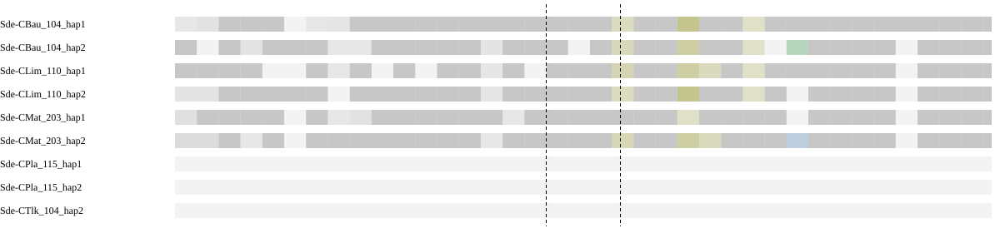

Different chromosomes means the assessed sides map to separate chromosomes in the peer, not that the peer has a fusion. Haplotypes are grouped by individual in the summary. Absence of an expected homologous match can be evidence when sequence availability and assay sensitivity are established. Failure of a qualifying alignment filter alone does not establish biological absence; the coverage and limitation columns show what was measured.

### Local sequence and contact support

| Assay | Measurement |
| --- | --- |
| Qualified immediate HiFi spanning molecules | 0 |
| Qualified HiFi flank molecules left/right | 14 / 39 |
| HiFi informative | True |
| Graph context | screened_primary_contig_paths |

Zero spanning reads must be interpreted with flank coverage, ambiguity and interval width. Graph connectivity alone does not establish a correct join.

| HiFi offset kb | Left molecules | Right molecules | Spanning molecules | Median depth left/right | Flanks observable |
| --- | --- | --- | --- | --- | --- |
| 100 | 11 | 24 | 0 | 17.0 / 33.0 | True |
| 250 | 3 | 17 | 0 | 7.0 / 29.0 | False |
| 500 | 8 | 28 | 0 | 21.0 / 36.0 | False |

Observable distant flanks show reads are available on each side; no spanning reads across a long interval do not by themselves test the exact seam.

| Library | Offset kb | Cross pairs | Within left/right | Sequence/gap controls | Informative |
| --- | --- | --- | --- | --- | --- |
| Ex2 | 100 | 43 | 7071 / 6863 | 7 / 0 | False |
| Ex3 | 100 | Unavailable | 3860 / 4739 | 5 / 0 | False |
| Ex2 | 250 | 27 | 6960 / 7021 | 6 / 0 | False |
| Ex3 | 250 | Unavailable | 4465 / 4194 | 6 / 0 | False |
| Ex2 | 500 | 7 | 4468 / 7268 | 8 / 0 | False |
| Ex3 | 500 | Unavailable | 3027 / 3609 | 7 / 0 | False |

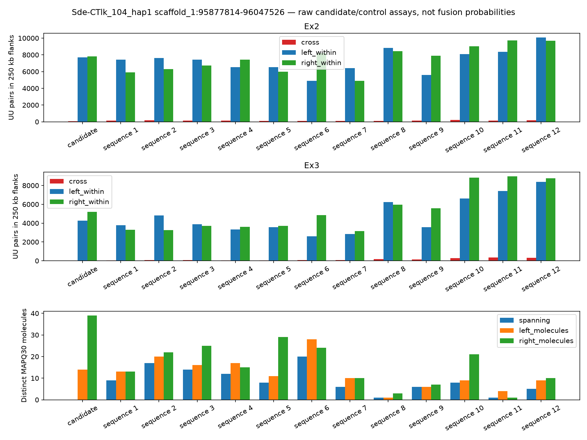

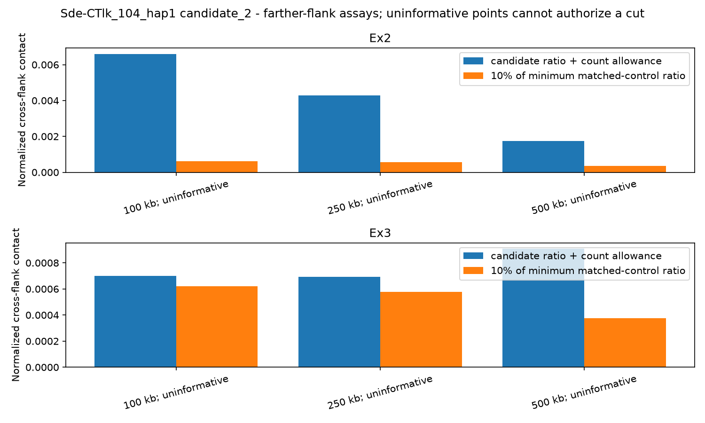

[IGV session: original coordinates](sequence-context/Sde-CTlk_104_hap1.sequence_context/candidate_2.igv.xml)

Scaffolding Hi-C is corroboration, not independent validation. Small control populations and poor observability limit conclusions from weak support.

**Decision needed:** review supporting, opposing and missing evidence before selecting an exact cut. Leave retained or unresolved rows at NO and record reviewer and rationale.

<details><summary>Full candidate measurements</summary>

```json
{
  "assessment_sha256": "1fd4707ae4958ce31f7e95b5732e01d70686755c6a62a414b080fac24e4fd96a",
  "coordinate_stage": "pre_finishing",
  "packet_interval_id": "candidate_2",
  "verified_gap": false,
  "assessment_scaffold_length": 138446979,
  "hifi_spanning_molecules": 0,
  "local_path_support": "unresolved",
  "continuity_grid": {
    "step_bp": 1000,
    "anchor_bp": 1000,
    "minimum_molecules": 1,
    "supported_fraction": 0.9532163742690059,
    "probes": [
      {
        "cut_bp": 95877814,
        "molecules": 6
      },
      {
        "cut_bp": 95878814,
        "molecules": 3
      },
      {
        "cut_bp": 95879814,
        "molecules": 7
      },
      {
        "cut_bp": 95880814,
        "molecules": 8
      },
      {
        "cut_bp": 95881814,
        "molecules": 4
      },
      {
        "cut_bp": 95882814,
        "molecules": 2
      },
      {
        "cut_bp": 95883814,
        "molecules": 3
      },
      {
        "cut_bp": 95884814,
        "molecules": 3
      },
      {
        "cut_bp": 95885814,
        "molecules": 2
      },
      {
        "cut_bp": 95886814,
        "molecules": 4
      },
      {
        "cut_bp": 95887814,
        "molecules": 4
      },
      {
        "cut_bp": 95888814,
        "molecules": 5
      },
      {
        "cut_bp": 95889814,
        "molecules": 8
      },
      {
        "cut_bp": 95890814,
        "molecules": 8
      },
      {
        "cut_bp": 95891814,
        "molecules": 4
      },
      {
        "cut_bp": 95892814,
        "molecules": 5
      },
      {
        "cut_bp": 95893814,
        "molecules": 5
      },
      {
        "cut_bp": 95894814,
        "molecules": 2
      },
      {
        "cut_bp": 95895814,
        "molecules": 2
      },
      {
        "cut_bp": 95896814,
        "molecules": 3
      },
      {
        "cut_bp": 95897814,
        "molecules": 4
      },
      {
        "cut_bp": 95898814,
        "molecules": 3
      },
      {
        "cut_bp": 95899814,
        "molecules": 7
      },
      {
        "cut_bp": 95900814,
        "molecules": 4
      },
      {
        "cut_bp": 95901814,
        "molecules": 6
      },
      {
        "cut_bp": 95902814,
        "molecules": 5
      },
      {
        "cut_bp": 95903814,
        "molecules": 5
      },
      {
        "cut_bp": 95904814,
        "molecules": 8
      },
      {
        "cut_bp": 95905814,
        "molecules": 4
      },
      {
        "cut_bp": 95906814,
        "molecules": 3
      },
      {
        "cut_bp": 95907814,
        "molecules": 2
      },
      {
        "cut_bp": 95908814,
        "molecules": 1
      },
      {
        "cut_bp": 95909814,
        "molecules": 2
      },
      {
        "cut_bp": 95910814,
        "molecules": 3
      },
      {
        "cut_bp": 95911814,
        "molecules": 2
      },
      {
        "cut_bp": 95912814,
        "molecules": 2
      },
      {
        "cut_bp": 95913814,
        "molecules": 2
      },
      {
        "cut_bp": 95914814,
        "molecules": 2
      },
      {
        "cut_bp": 95915814,
        "molecules": 3
      },
      {
        "cut_bp": 95916814,
        "molecules": 3
      },
      {
        "cut_bp": 95917814,
        "molecules": 2
      },
      {
        "cut_bp": 95918814,
        "molecules": 2
      },
      {
        "cut_bp": 95919814,
        "molecules": 4
      },
      {
        "cut_bp": 95920814,
        "molecules": 6
      },
      {
        "cut_bp": 95921814,
        "molecules": 3
      },
      {
        "cut_bp": 95922814,
        "molecules": 3
      },
      {
        "cut_bp": 95923814,
        "molecules": 2
      },
      {
        "cut_bp": 95924814,
        "molecules": 4
      },
      {
        "cut_bp": 95925814,
        "molecules": 4
      },
      {
        "cut_bp": 95926814,
        "molecules": 2
      },
      {
        "cut_bp": 95927814,
        "molecules": 2
      },
      {
        "cut_bp": 95928814,
        "molecules": 9
      },
      {
        "cut_bp": 95929814,
        "molecules": 12
      },
      {
        "cut_bp": 95930814,
        "molecules": 9
      },
      {
        "cut_bp": 95931814,
        "molecules": 13
      },
      {
        "cut_bp": 95932814,
        "molecules": 13
      },
      {
        "cut_bp": 95933814,
        "molecules": 13
      },
      {
        "cut_bp": 95934814,
        "molecules": 13
      },
      {
        "cut_bp": 95935814,
        "molecules": 16
      },
      {
        "cut_bp": 95936814,
        "molecules": 14
      },
      {
        "cut_bp": 95937814,
        "molecules": 11
      },
      {
        "cut_bp": 95938814,
        "molecules": 10
      },
      {
        "cut_bp": 95939814,
        "molecules": 13
      },
      {
        "cut_bp": 95940814,
        "molecules": 12
      },
      {
        "cut_bp": 95941814,
        "molecules": 16
      },
      {
        "cut_bp": 95942814,
        "molecules": 13
      },
      {
        "cut_bp": 95943814,
        "molecules": 13
      },
      {
        "cut_bp": 95944814,
        "molecules": 11
      },
      {
        "cut_bp": 95945814,
        "molecules": 9
      },
      {
        "cut_bp": 95946814,
        "molecules": 11
      },
      {
        "cut_bp": 95947814,
        "molecules": 11
      },
      {
        "cut_bp": 95948814,
        "molecules": 11
      },
      {
        "cut_bp": 95949814,
        "molecules": 11
      },
      {
        "cut_bp": 95950814,
        "molecules": 8
      },
      {
        "cut_bp": 95951814,
        "molecules": 10
      },
      {
        "cut_bp": 95952814,
        "molecules": 10
      },
      {
        "cut_bp": 95953814,
        "molecules": 9
      },
      {
        "cut_bp": 95954814,
        "molecules": 6
      },
      {
        "cut_bp": 95955814,
        "molecules": 6
      },
      {
        "cut_bp": 95956814,
        "molecules": 11
      },
      {
        "cut_bp": 95957814,
        "molecules": 7
      },
      {
        "cut_bp": 95958814,
        "molecules": 5
      },
      {
        "cut_bp": 95959814,
        "molecules": 11
      },
      {
        "cut_bp": 95960814,
        "molecules": 9
      },
      {
        "cut_bp": 95961814,
        "molecules": 9
      },
      {
        "cut_bp": 95962814,
        "molecules": 8
      },
      {
        "cut_bp": 95963814,
        "molecules": 7
      },
      {
        "cut_bp": 95964814,
        "molecules": 9
      },
      {
        "cut_bp": 95965814,
        "molecules": 10
      },
      {
        "cut_bp": 95966814,
        "molecules": 6
      },
      {
        "cut_bp": 95967814,
        "molecules": 6
      },
      {
        "cut_bp": 95968814,
        "molecules": 5
      },
      {
        "cut_bp": 95969814,
        "molecules": 5
      },
      {
        "cut_bp": 95970814,
        "molecules": 7
      },
      {
        "cut_bp": 95971814,
        "molecules": 7
      },
      {
        "cut_bp": 95972814,
        "molecules": 8
      },
      {
        "cut_bp": 95973814,
        "molecules": 6
      },
      {
        "cut_bp": 95974814,
        "molecules": 2
      },
      {
        "cut_bp": 95975814,
        "molecules": 4
      },
      {
        "cut_bp": 95976814,
        "molecules": 9
      },
      {
        "cut_bp": 95977814,
        "molecules": 9
      },
      {
        "cut_bp": 95978814,
        "molecules": 8
      },
      {
        "cut_bp": 95979814,
        "molecules": 5
      },
      {
        "cut_bp": 95980814,
        "molecules": 4
      },
      {
        "cut_bp": 95981814,
        "molecules": 1
      },
      {
        "cut_bp": 95982814,
        "molecules": 1
      },
      {
        "cut_bp": 95983814,
        "molecules": 2
      },
      {
        "cut_bp": 95984814,
        "molecules": 2
      },
      {
        "cut_bp": 95985814,
        "molecules": 3
      },
      {
        "cut_bp": 95986814,
        "molecules": 3
      },
      {
        "cut_bp": 95987814,
        "molecules": 3
      },
      {
        "cut_bp": 95988814,
        "molecules": 2
      },
      {
        "cut_bp": 95989814,
        "molecules": 1
      },
      {
        "cut_bp": 95990814,
        "molecules": 1
      },
      {
        "cut_bp": 95991814,
        "molecules": 4
      },
      {
        "cut_bp": 95992814,
        "molecules": 6
      },
      {
        "cut_bp": 95993814,
        "molecules": 5
      },
      {
        "cut_bp": 95994814,
        "molecules": 4
      },
      {
        "cut_bp": 95995814,
        "molecules": 4
      },
      {
        "cut_bp": 95996814,
        "molecules": 1
      },
      {
        "cut_bp": 95997814,
        "molecules": 2
      },
      {
        "cut_bp": 95998814,
        "molecules": 5
      },
      {
        "cut_bp": 95999814,
        "molecules": 9
      },
      {
        "cut_bp": 96000814,
        "molecules": 4
      },
      {
        "cut_bp": 96001814,
        "molecules": 2
      },
      {
        "cut_bp": 96002814,
        "molecules": 3
      },
      {
        "cut_bp": 96003814,
        "molecules": 7
      },
      {
        "cut_bp": 96004814,
        "molecules": 16
      },
      {
        "cut_bp": 96005814,
        "molecules": 6
      },
      {
        "cut_bp": 96006814,
        "molecules": 7
      },
      {
        "cut_bp": 96007814,
        "molecules": 16
      },
      {
        "cut_bp": 96008814,
        "molecules": 5
      },
      {
        "cut_bp": 96009814,
        "molecules": 3
      },
      {
        "cut_bp": 96010814,
        "molecules": 10
      },
      {
        "cut_bp": 96011814,
        "molecules": 4
      },
      {
        "cut_bp": 96012814,
        "molecules": 8
      },
      {
        "cut_bp": 96013814,
        "molecules": 5
      },
      {
        "cut_bp": 96014814,
        "molecules": 2
      },
      {
        "cut_bp": 96015814,
        "molecules": 1
      },
      {
        "cut_bp": 96016814,
        "molecules": 3
      },
      {
        "cut_bp": 96017814,
        "molecules": 6
      },
      {
        "cut_bp": 96018814,
        "molecules": 6
      },
      {
        "cut_bp": 96019814,
        "molecules": 6
      },
      {
        "cut_bp": 96020814,
        "molecules": 7
      },
      {
        "cut_bp": 96021814,
        "molecules": 5
      },
      {
        "cut_bp": 96022814,
        "molecules": 10
      },
      {
        "cut_bp": 96023814,
        "molecules": 8
      },
      {
        "cut_bp": 96024814,
        "molecules": 7
      },
      {
        "cut_bp": 96025814,
        "molecules": 7
      },
      {
        "cut_bp": 96026814,
        "molecules": 12
      },
      {
        "cut_bp": 96027814,
        "molecules": 14
      },
      {
        "cut_bp": 96028814,
        "molecules": 10
      },
      {
        "cut_bp": 96029814,
        "molecules": 8
      },
      {
        "cut_bp": 96030814,
        "molecules": 13
      },
      {
        "cut_bp": 96031814,
        "molecules": 12
      },
      {
        "cut_bp": 96032814,
        "molecules": 12
      },
      {
        "cut_bp": 96033814,
        "molecules": 7
      },
      {
        "cut_bp": 96034814,
        "molecules": 2
      },
      {
        "cut_bp": 96035814,
        "molecules": 1
      },
      {
        "cut_bp": 96036814,
        "molecules": 9
      },
      {
        "cut_bp": 96037814,
        "molecules": 20
      },
      {
        "cut_bp": 96038814,
        "molecules": 8
      },
      {
        "cut_bp": 96039814,
        "molecules": 10
      },
      {
        "cut_bp": 96040814,
        "molecules": 7
      },
      {
        "cut_bp": 96041814,
        "molecules": 6
      },
      {
        "cut_bp": 96042814,
        "molecules": 11
      },
      {
        "cut_bp": 96043814,
        "molecules": 8
      },
      {
        "cut_bp": 96044814,
        "molecules": 20
      },
      {
        "cut_bp": 96045814,
        "molecules": 19
      },
      {
        "cut_bp": 96046814,
        "molecules": 5
      },
      {
        "cut_bp": 96047526,
        "molecules": 6
      }
    ]
  },
  "graph_status": "screened_primary_contig_paths",
  "graph_contradiction": null,
  "native_continuity": true,
  "direct_native_link": false,
  "native_left": "h1tg000133l",
  "native_right": "h1tg000133l",
  "native_graph_sha256": "9b5ccab05303dc95c5d525f6ae565d219b4417d92b8046f0ecc6e5fb203ce355",
  "interpretation": "Primary path continuity alone is not read support or biological fusion confirmation; unmeasured unitig paths remain a limitation.",
  "chromosome_blocks": {
    "localized": false,
    "independent_individuals": [],
    "chromosome_pair": null,
    "contradictory_pairs": false,
    "peer_assays": [
      {
        "peer": "Sde-CBau_104_hap1",
        "sample": "Sde-CBau_104",
        "auto_evidence": true,
        "chromosome_pair": null,
        "qualified": false,
        "unique_gap_localization": false,
        "trials": [
          {
            "offset_bp": 100000,
            "left_chrom": null,
            "right_chrom": null,
            "left_target": null,
            "right_target": null,
            "usable": false,
            "left_edge": 95777814,
            "right_edge": 96147526
          },
          {
            "offset_bp": 250000,
            "left_chrom": null,
            "right_chrom": null,
            "left_target": null,
            "right_target": null,
            "usable": false,
            "left_edge": 95627814,
            "right_edge": 96297526
          },
          {
            "offset_bp": 500000,
            "left_chrom": null,
            "right_chrom": null,
            "left_target": null,
            "right_target": null,
            "usable": false,
            "left_edge": 95377814,
            "right_edge": 96547526
          }
        ]
      },
      {
        "peer": "Sde-CBau_104_hap2",
        "sample": "Sde-CBau_104",
        "auto_evidence": true,
        "chromosome_pair": null,
        "qualified": false,
        "unique_gap_localization": false,
        "trials": [
          {
            "offset_bp": 100000,
            "left_chrom": null,
            "right_chrom": null,
            "left_target": null,
            "right_target": null,
            "usable": false,
            "left_edge": 95777814,
            "right_edge": 96147526
          },
          {
            "offset_bp": 250000,
            "left_chrom": null,
            "right_chrom": null,
            "left_target": null,
            "right_target": null,
            "usable": false,
            "left_edge": 95627814,
            "right_edge": 96297526
          },
          {
            "offset_bp": 500000,
            "left_chrom": null,
            "right_chrom": null,
            "left_target": null,
            "right_target": null,
            "usable": false,
            "left_edge": 95377814,
            "right_edge": 96547526
          }
        ]
      },
      {
        "peer": "Sde-CLim_110_hap1",
        "sample": "Sde-CLim_110",
        "auto_evidence": true,
        "chromosome_pair": null,
        "qualified": false,
        "unique_gap_localization": false,
        "trials": [
          {
            "offset_bp": 100000,
            "left_chrom": null,
            "right_chrom": null,
            "left_target": null,
            "right_target": null,
            "usable": false,
            "left_edge": 95777814,
            "right_edge": 96147526
          },
          {
            "offset_bp": 250000,
            "left_chrom": null,
            "right_chrom": null,
            "left_target": null,
            "right_target": null,
            "usable": false,
            "left_edge": 95627814,
            "right_edge": 96297526
          },
          {
            "offset_bp": 500000,
            "left_chrom": null,
            "right_chrom": null,
            "left_target": null,
            "right_target": null,
            "usable": false,
            "left_edge": 95377814,
            "right_edge": 96547526
          }
        ]
      },
      {
        "peer": "Sde-CLim_110_hap2",
        "sample": "Sde-CLim_110",
        "auto_evidence": true,
        "chromosome_pair": null,
        "qualified": false,
        "unique_gap_localization": false,
        "trials": [
          {
            "offset_bp": 100000,
            "left_chrom": null,
            "right_chrom": null,
            "left_target": null,
            "right_target": null,
            "usable": false,
            "left_edge": 95777814,
            "right_edge": 96147526
          },
          {
            "offset_bp": 250000,
            "left_chrom": null,
            "right_chrom": null,
            "left_target": null,
            "right_target": null,
            "usable": false,
            "left_edge": 95627814,
            "right_edge": 96297526
          },
          {
            "offset_bp": 500000,
            "left_chrom": null,
            "right_chrom": null,
            "left_target": null,
            "right_target": null,
            "usable": false,
            "left_edge": 95377814,
            "right_edge": 96547526
          }
        ]
      },
      {
        "peer": "Sde-CMat_203_hap1",
        "sample": "Sde-CMat_203",
        "auto_evidence": true,
        "chromosome_pair": null,
        "qualified": false,
        "unique_gap_localization": false,
        "trials": [
          {
            "offset_bp": 100000,
            "left_chrom": null,
            "right_chrom": null,
            "left_target": null,
            "right_target": null,
            "usable": false,
            "left_edge": 95777814,
            "right_edge": 96147526
          },
          {
            "offset_bp": 250000,
            "left_chrom": null,
            "right_chrom": null,
            "left_target": null,
            "right_target": null,
            "usable": false,
            "left_edge": 95627814,
            "right_edge": 96297526
          },
          {
            "offset_bp": 500000,
            "left_chrom": null,
            "right_chrom": null,
            "left_target": null,
            "right_target": null,
            "usable": false,
            "left_edge": 95377814,
            "right_edge": 96547526
          }
        ]
      },
      {
        "peer": "Sde-CMat_203_hap2",
        "sample": "Sde-CMat_203",
        "auto_evidence": true,
        "chromosome_pair": null,
        "qualified": false,
        "unique_gap_localization": false,
        "trials": [
          {
            "offset_bp": 100000,
            "left_chrom": null,
            "right_chrom": null,
            "left_target": null,
            "right_target": null,
            "usable": false,
            "left_edge": 95777814,
            "right_edge": 96147526
          },
          {
            "offset_bp": 250000,
            "left_chrom": null,
            "right_chrom": null,
            "left_target": null,
            "right_target": null,
            "usable": false,
            "left_edge": 95627814,
            "right_edge": 96297526
          },
          {
            "offset_bp": 500000,
            "left_chrom": null,
            "right_chrom": null,
            "left_target": null,
            "right_target": null,
            "usable": false,
            "left_edge": 95377814,
            "right_edge": 96547526
          }
        ]
      },
      {
        "peer": "Sde-CPla_115_hap1",
        "sample": "Sde-CPla_115",
        "auto_evidence": false,
        "chromosome_pair": null,
        "qualified": false,
        "unique_gap_localization": false,
        "trials": [
          {
            "offset_bp": 100000,
            "left_chrom": null,
            "right_chrom": null,
            "left_target": null,
            "right_target": null,
            "usable": false,
            "left_edge": 95777814,
            "right_edge": 96147526
          },
          {
            "offset_bp": 250000,
            "left_chrom": null,
            "right_chrom": null,
            "left_target": null,
            "right_target": null,
            "usable": false,
            "left_edge": 95627814,
            "right_edge": 96297526
          },
          {
            "offset_bp": 500000,
            "left_chrom": null,
            "right_chrom": null,
            "left_target": null,
            "right_target": null,
            "usable": false,
            "left_edge": 95377814,
            "right_edge": 96547526
          }
        ]
      },
      {
        "peer": "Sde-CPla_115_hap2",
        "sample": "Sde-CPla_115",
        "auto_evidence": false,
        "chromosome_pair": null,
        "qualified": false,
        "unique_gap_localization": false,
        "trials": [
          {
            "offset_bp": 100000,
            "left_chrom": null,
            "right_chrom": null,
            "left_target": null,
            "right_target": null,
            "usable": false,
            "left_edge": 95777814,
            "right_edge": 96147526
          },
          {
            "offset_bp": 250000,
            "left_chrom": null,
            "right_chrom": null,
            "left_target": null,
            "right_target": null,
            "usable": false,
            "left_edge": 95627814,
            "right_edge": 96297526
          },
          {
            "offset_bp": 500000,
            "left_chrom": null,
            "right_chrom": null,
            "left_target": null,
            "right_target": null,
            "usable": false,
            "left_edge": 95377814,
            "right_edge": 96547526
          }
        ]
      },
      {
        "peer": "Sde-CTlk_104_hap2",
        "sample": "Sde-CTlk_104",
        "auto_evidence": true,
        "chromosome_pair": null,
        "qualified": false,
        "unique_gap_localization": false,
        "trials": [
          {
            "offset_bp": 100000,
            "left_chrom": null,
            "right_chrom": null,
            "left_target": null,
            "right_target": "scaffold_5",
            "usable": false,
            "left_edge": 95777814,
            "right_edge": 96147526
          },
          {
            "offset_bp": 250000,
            "left_chrom": null,
            "right_chrom": null,
            "left_target": null,
            "right_target": "scaffold_5",
            "usable": false,
            "left_edge": 95627814,
            "right_edge": 96297526
          },
          {
            "offset_bp": 500000,
            "left_chrom": null,
            "right_chrom": null,
            "left_target": null,
            "right_target": "scaffold_5",
            "usable": false,
            "left_edge": 95377814,
            "right_edge": 96547526
          }
        ]
      }
    ]
  },
  "farther_contact_evidence": {
    "supported_offsets": [],
    "pass_all": false,
    "contradictory_informative_trial": false,
    "trials": [
      {
        "offset_bp": 100000,
        "library": "Ex2",
        "informative": false,
        "control_populations": {
          "continuous_control": 7,
          "gap_control": 0
        },
        "matched_control_ids": [
          "continuous_04ac881b8b909a1a4922",
          "continuous_8ef00fe93edb4e00e384",
          "continuous_8d56d3677d0fe314d0bf",
          "continuous_826edd2b0e2812499a04",
          "continuous_ccd7653e4fe504997343",
          "continuous_148289d6c1db17e05b73",
          "continuous_4fa44e8f9e5a14c381c3"
        ],
        "minimum_control_ratio": 0.006296517225408968,
        "upper_count_allowance_ratio": 0.006603290650663321,
        "support_loss": false,
        "raw_counts": {
          "left_ends": 39256,
          "right_ends": 40716,
          "left_within": 7071,
          "cross": 43,
          "right_within": 6863
        }
      },
      {
        "offset_bp": 100000,
        "library": "Ex3",
        "informative": false,
        "control_populations": {
          "continuous_control": 5,
          "gap_control": 0
        },
        "matched_control_ids": [
          "continuous_04ac881b8b909a1a4922",
          "continuous_8ef00fe93edb4e00e384",
          "continuous_8d56d3677d0fe314d0bf",
          "continuous_826edd2b0e2812499a04",
          "continuous_148289d6c1db17e05b73"
        ],
        "minimum_control_ratio": 0.006210018893857529,
        "upper_count_allowance_ratio": 0.000701429856928001,
        "support_loss": false,
        "raw_counts": {
          "left_ends": 15604,
          "right_ends": 17825,
          "left_within": 3860,
          "right_within": 4739
        }
      },
      {
        "offset_bp": 250000,
        "library": "Ex2",
        "informative": false,
        "control_populations": {
          "continuous_control": 6,
          "gap_control": 0
        },
        "matched_control_ids": [
          "continuous_04ac881b8b909a1a4922",
          "continuous_8ef00fe93edb4e00e384",
          "continuous_8d56d3677d0fe314d0bf",
          "continuous_826edd2b0e2812499a04",
          "continuous_eca88e920df688c23537",
          "continuous_108c644dabb71a6652e9"
        ],
        "minimum_control_ratio": 0.0056105701231744425,
        "upper_count_allowance_ratio": 0.004291579364710626,
        "support_loss": false,
        "raw_counts": {
          "right_ends": 41876,
          "left_ends": 38542,
          "left_within": 6960,
          "cross": 27,
          "right_within": 7021
        }
      },
      {
        "offset_bp": 250000,
        "library": "Ex3",
        "informative": false,
        "control_populations": {
          "continuous_control": 6,
          "gap_control": 0
        },
        "matched_control_ids": [
          "continuous_04ac881b8b909a1a4922",
          "continuous_8ef00fe93edb4e00e384",
          "continuous_8d56d3677d0fe314d0bf",
          "continuous_826edd2b0e2812499a04",
          "continuous_eca88e920df688c23537",
          "continuous_108c644dabb71a6652e9"
        ],
        "minimum_control_ratio": 0.00577884565834848,
        "upper_count_allowance_ratio": 0.0006932602669353958,
        "support_loss": false,
        "raw_counts": {
          "left_ends": 17781,
          "right_ends": 16106,
          "left_within": 4465,
          "right_within": 4194
        }
      },
      {
        "offset_bp": 500000,
        "library": "Ex2",
        "informative": false,
        "control_populations": {
          "continuous_control": 8,
          "gap_control": 0
        },
        "matched_control_ids": [
          "continuous_04ac881b8b909a1a4922",
          "continuous_8ef00fe93edb4e00e384",
          "continuous_8d56d3677d0fe314d0bf",
          "continuous_826edd2b0e2812499a04",
          "continuous_eca88e920df688c23537",
          "continuous_9879b76c9ae2a54b2f5b",
          "continuous_ccd7653e4fe504997343",
          "continuous_148289d6c1db17e05b73"
        ],
        "minimum_control_ratio": 0.003463779884869779,
        "upper_count_allowance_ratio": 0.001754833669343656,
        "support_loss": false,
        "raw_counts": {
          "right_ends": 43056,
          "left_ends": 24381,
          "left_within": 4468,
          "cross": 7,
          "right_within": 7268
        }
      },
      {
        "offset_bp": 500000,
        "library": "Ex3",
        "informative": false,
        "control_populations": {
          "continuous_control": 7,
          "gap_control": 0
        },
        "matched_control_ids": [
          "continuous_04ac881b8b909a1a4922",
          "continuous_8ef00fe93edb4e00e384",
          "continuous_8d56d3677d0fe314d0bf",
          "continuous_826edd2b0e2812499a04",
          "continuous_eca88e920df688c23537",
          "continuous_9879b76c9ae2a54b2f5b",
          "continuous_ccd7653e4fe504997343"
        ],
        "minimum_control_ratio": 0.0037514530273940827,
        "upper_count_allowance_ratio": 0.0009076566694945122,
        "support_loss": false,
        "raw_counts": {
          "left_ends": 11570,
          "right_ends": 13815,
          "left_within": 3027,
          "right_within": 3609
        }
      }
    ]
  },
  "farther_hifi": {
    "100000": {
      "informative": true,
      "raw": {
        "left_molecules": 11,
        "right_molecules": 24,
        "spanning": 0,
        "left_median_depth": 17.0,
        "right_median_depth": 33.0,
        "left_covered_fraction": 1.0,
        "right_covered_fraction": 1.0
      }
    },
    "250000": {
      "informative": false,
      "raw": {
        "left_molecules": 3,
        "right_molecules": 17,
        "spanning": 0,
        "left_median_depth": 7.0,
        "right_median_depth": 29.0,
        "left_covered_fraction": 1.0,
        "right_covered_fraction": 1.0
      }
    },
    "500000": {
      "informative": false,
      "raw": {
        "left_molecules": 8,
        "right_molecules": 28,
        "spanning": 0,
        "left_median_depth": 21.0,
        "right_median_depth": 36.0,
        "left_covered_fraction": 1.0,
        "right_covered_fraction": 1.0
      }
    }
  },
  "haplotype_block_conflict": false,
  "repeat_obscured_localization": false,
  "control_qualification": [
    {
      "id": "continuous_04ac881b8b909a1a4922",
      "population": "continuous_control",
      "qualified": true,
      "reasons": []
    },
    {
      "id": "continuous_8ef00fe93edb4e00e384",
      "population": "continuous_control",
      "qualified": true,
      "reasons": []
    },
    {
      "id": "continuous_8d56d3677d0fe314d0bf",
      "population": "continuous_control",
      "qualified": true,
      "reasons": []
    },
    {
      "id": "continuous_826edd2b0e2812499a04",
      "population": "continuous_control",
      "qualified": true,
      "reasons": []
    },
    {
      "id": "continuous_eca88e920df688c23537",
      "population": "continuous_control",
      "qualified": true,
      "reasons": []
    },
    {
      "id": "continuous_9879b76c9ae2a54b2f5b",
      "population": "continuous_control",
      "qualified": true,
      "reasons": []
    },
    {
      "id": "continuous_ccd7653e4fe504997343",
      "population": "continuous_control",
      "qualified": true,
      "reasons": []
    },
    {
      "id": "continuous_b6d76a83c046c2f0cfbf",
      "population": "continuous_control",
      "qualified": false,
      "reasons": [
        "uninformative_hifi_flanks",
        "fewer_than_two_hifi_bridges"
      ]
    },
    {
      "id": "continuous_148289d6c1db17e05b73",
      "population": "continuous_control",
      "qualified": false,
      "reasons": [
        "uninformative_hifi_flanks"
      ]
    },
    {
      "id": "continuous_108c644dabb71a6652e9",
      "population": "continuous_control",
      "qualified": false,
      "reasons": [
        "uninformative_hifi_flanks"
      ]
    },
    {
      "id": "continuous_f444a6238cfb5e747aca",
      "population": "continuous_control",
      "qualified": false,
      "reasons": [
        "uninformative_hifi_flanks",
        "fewer_than_two_hifi_bridges"
      ]
    },
    {
      "id": "continuous_4fa44e8f9e5a14c381c3",
      "population": "continuous_control",
      "qualified": false,
      "reasons": [
        "uninformative_hifi_flanks"
      ]
    }
  ],
  "hifi_informative": true,
  "matched_controls_pass": false,
  "hic_informative": false,
  "hic_support_loss": false,
  "libraries": [
    {
      "library": "Ex2",
      "matched_controls": 7,
      "control_populations": {
        "continuous_control": 7,
        "gap_control": 0
      },
      "informative": false,
      "ratio": 0.006584247545179244,
      "upper_count_allowance_ratio": 0.006971556224307435,
      "minimum_control_ratio": 0.01805109978555403,
      "support_loss": false,
      "raw_counts": {
        "left_ends": 42097,
        "right_ends": 45740,
        "left_within": 7685,
        "cross": 51,
        "right_within": 7807
      }
    },
    {
      "library": "Ex3",
      "matched_controls": 7,
      "control_populations": {
        "continuous_control": 7,
        "gap_control": 0
      },
      "informative": false,
      "ratio": 0.0,
      "upper_count_allowance_ratio": 0.000637451941321704,
      "minimum_control_ratio": 0.011290457322144927,
      "support_loss": false,
      "raw_counts": {
        "left_ends": 17122,
        "right_ends": 19380,
        "left_within": 4252,
        "right_within": 5209
      }
    }
  ],
  "independent_discordant_individuals": 0,
  "alternative_placements_checked": true,
  "control_ids": [
    "continuous_04ac881b8b909a1a4922",
    "continuous_8ef00fe93edb4e00e384",
    "continuous_8d56d3677d0fe314d0bf",
    "continuous_826edd2b0e2812499a04",
    "continuous_eca88e920df688c23537",
    "continuous_9879b76c9ae2a54b2f5b",
    "continuous_ccd7653e4fe504997343",
    "continuous_b6d76a83c046c2f0cfbf",
    "continuous_148289d6c1db17e05b73",
    "continuous_108c644dabb71a6652e9",
    "continuous_f444a6238cfb5e747aca",
    "continuous_4fa44e8f9e5a14c381c3"
  ],
  "hifi_raw": {
    "left_molecules": 14,
    "right_molecules": 39,
    "spanning": 0,
    "left_median_depth": 21.0,
    "right_median_depth": 55.0,
    "left_covered_fraction": 1.0,
    "right_covered_fraction": 1.0
  },
  "alternative_placement_scope": "Assessment BAM MAPQ and competing peer anchors; bounded emitted alternatives, no proof of haplotype-specific uniqueness",
  "chromosome_tracks": [
    {
      "peer": "Sde-CBau_104_hap1",
      "sample": "Sde-CBau_104",
      "auto_evidence": true,
      "relationship": "uninformative",
      "bins": [
        {
          "lo": 0,
          "hi": 50000,
          "aligned_bp": 10408,
          "ambiguous_bp": 0,
          "dominance": 1.0,
          "chrom": "chr7",
          "counts": {
            "chr7": 10408,
            "chr10": 0,
            "chr12": 0,
            "chr3": 0
          }
        },
        {
          "lo": 50000,
          "hi": 100000,
          "aligned_bp": 15417,
          "ambiguous_bp": 0,
          "dominance": 1.0,
          "chrom": "chr7",
          "counts": {
            "chr7": 15417,
            "chr10": 0,
            "chr12": 0,
            "chr3": 0
          }
        },
        {
          "lo": 100000,
          "hi": 150000,
          "aligned_bp": 1891,
          "ambiguous_bp": 0,
          "dominance": 1.0,
          "chrom": null,
          "counts": {
            "chr7": 1891,
            "chr10": 0,
            "chr12": 0,
            "chr3": 0
          }
        },
        {
          "lo": 150000,
          "hi": 200000,
          "aligned_bp": 3352,
          "ambiguous_bp": 0,
          "dominance": 1.0,
          "chrom": null,
          "counts": {
            "chr7": 3352,
            "chr10": 0,
            "chr12": 0,
            "chr3": 0
          }
        },
        {
          "lo": 200000,
          "hi": 250000,
          "aligned_bp": 2198,
          "ambiguous_bp": 0,
          "dominance": 1.0,
          "chrom": null,
          "counts": {
            "chr7": 2198,
            "chr10": 0,
            "chr12": 0,
            "chr3": 0
          }
        },
        {
          "lo": 250000,
          "hi": 300000,
          "aligned_bp": 0,
          "ambiguous_bp": 0,
          "dominance": 0.0,
          "chrom": null,
          "counts": {
            "chr7": 0,
            "chr10": 0,
            "chr12": 0,
            "chr3": 0
          }
        },
        {
          "lo": 300000,
          "hi": 350000,
          "aligned_bp": 10840,
          "ambiguous_bp": 2,
          "dominance": 1.0,
          "chrom": "chr7",
          "counts": {
            "chr7": 10840,
            "chr10": 0,
            "chr12": 0,
            "chr3": 0
          }
        },
        {
          "lo": 350000,
          "hi": 400000,
          "aligned_bp": 12268,
          "ambiguous_bp": 0,
          "dominance": 1.0,
          "chrom": "chr7",
          "counts": {
            "chr7": 12268,
            "chr10": 0,
            "chr12": 0,
            "chr3": 0
          }
        },
        {
          "lo": 400000,
          "hi": 450000,
          "aligned_bp": 2556,
          "ambiguous_bp": 0,
          "dominance": 1.0,
          "chrom": null,
          "counts": {
            "chr7": 2556,
            "chr10": 0,
            "chr12": 0,
            "chr3": 0
          }
        },
        {
          "lo": 450000,
          "hi": 500000,
          "aligned_bp": 6850,
          "ambiguous_bp": 0,
          "dominance": 1.0,
          "chrom": null,
          "counts": {
            "chr7": 6850,
            "chr10": 0,
            "chr12": 0,
            "chr3": 0
          }
        },
        {
          "lo": 500000,
          "hi": 550000,
          "aligned_bp": 7703,
          "ambiguous_bp": 0,
          "dominance": 1.0,
          "chrom": null,
          "counts": {
            "chr7": 7703,
            "chr10": 0,
            "chr12": 0,
            "chr3": 0
          }
        },
        {
          "lo": 550000,
          "hi": 600000,
          "aligned_bp": 2079,
          "ambiguous_bp": 0,
          "dominance": 1.0,
          "chrom": null,
          "counts": {
            "chr7": 2079,
            "chr10": 0,
            "chr12": 0,
            "chr3": 0
          }
        },
        {
          "lo": 600000,
          "hi": 650000,
          "aligned_bp": 4876,
          "ambiguous_bp": 0,
          "dominance": 1.0,
          "chrom": null,
          "counts": {
            "chr7": 4876,
            "chr10": 0,
            "chr12": 0,
            "chr3": 0
          }
        },
        {
          "lo": 650000,
          "hi": 700000,
          "aligned_bp": 2543,
          "ambiguous_bp": 0,
          "dominance": 1.0,
          "chrom": null,
          "counts": {
            "chr7": 2543,
            "chr10": 0,
            "chr12": 0,
            "chr3": 0
          }
        },
        {
          "lo": 700000,
          "hi": 750000,
          "aligned_bp": 9293,
          "ambiguous_bp": 0,
          "dominance": 1.0,
          "chrom": null,
          "counts": {
            "chr7": 9293,
            "chr10": 0,
            "chr12": 0,
            "chr3": 0
          }
        },
        {
          "lo": 750000,
          "hi": 800000,
          "aligned_bp": 6475,
          "ambiguous_bp": 0,
          "dominance": 1.0,
          "chrom": null,
          "counts": {
            "chr7": 6475,
            "chr10": 0,
            "chr12": 0,
            "chr3": 0
          }
        },
        {
          "lo": 800000,
          "hi": 850000,
          "aligned_bp": 7802,
          "ambiguous_bp": 0,
          "dominance": 0.9355293514483466,
          "chrom": null,
          "counts": {
            "chr7": 7299,
            "chr10": 503,
            "chr12": 0,
            "chr3": 0
          }
        },
        {
          "lo": 850000,
          "hi": 900000,
          "aligned_bp": 385,
          "ambiguous_bp": 0,
          "dominance": 1.0,
          "chrom": null,
          "counts": {
            "chr7": 0,
            "chr10": 385,
            "chr12": 0,
            "chr3": 0
          }
        },
        {
          "lo": 900000,
          "hi": 950000,
          "aligned_bp": 0,
          "ambiguous_bp": 693,
          "dominance": 0.0,
          "chrom": null,
          "counts": {
            "chr7": 0,
            "chr10": 0,
            "chr12": 0,
            "chr3": 0
          }
        },
        {
          "lo": 950000,
          "hi": 1000000,
          "aligned_bp": 3994,
          "ambiguous_bp": 8064,
          "dominance": 1.0,
          "chrom": null,
          "counts": {
            "chr7": 3994,
            "chr10": 0,
            "chr12": 0,
            "chr3": 0
          }
        },
        {
          "lo": 1000000,
          "hi": 1050000,
          "aligned_bp": 12906,
          "ambiguous_bp": 0,
          "dominance": 1.0,
          "chrom": "chr12",
          "counts": {
            "chr7": 0,
            "chr10": 0,
            "chr12": 12906,
            "chr3": 0
          }
        },
        {
          "lo": 1050000,
          "hi": 1100000,
          "aligned_bp": 8165,
          "ambiguous_bp": 0,
          "dominance": 0.5797917942437232,
          "chrom": null,
          "counts": {
            "chr7": 0,
            "chr10": 3431,
            "chr12": 4734,
            "chr3": 0
          }
        },
        {
          "lo": 1100000,
          "hi": 1150000,
          "aligned_bp": 3804,
          "ambiguous_bp": 0,
          "dominance": 1.0,
          "chrom": null,
          "counts": {
            "chr7": 0,
            "chr10": 0,
            "chr12": 3804,
            "chr3": 0
          }
        },
        {
          "lo": 1150000,
          "hi": 1200000,
          "aligned_bp": 26072,
          "ambiguous_bp": 0,
          "dominance": 1.0,
          "chrom": "chr12",
          "counts": {
            "chr7": 0,
            "chr10": 0,
            "chr12": 26072,
            "chr3": 0
          }
        },
        {
          "lo": 1200000,
          "hi": 1250000,
          "aligned_bp": 9318,
          "ambiguous_bp": 0,
          "dominance": 1.0,
          "chrom": null,
          "counts": {
            "chr7": 0,
            "chr10": 0,
            "chr12": 9318,
            "chr3": 0
          }
        },
        {
          "lo": 1250000,
          "hi": 1300000,
          "aligned_bp": 2392,
          "ambiguous_bp": 0,
          "dominance": 1.0,
          "chrom": null,
          "counts": {
            "chr7": 0,
            "chr10": 0,
            "chr12": 2392,
            "chr3": 0
          }
        },
        {
          "lo": 1300000,
          "hi": 1350000,
          "aligned_bp": 11162,
          "ambiguous_bp": 0,
          "dominance": 1.0,
          "chrom": "chr12",
          "counts": {
            "chr7": 0,
            "chr10": 0,
            "chr12": 11162,
            "chr3": 0
          }
        },
        {
          "lo": 1350000,
          "hi": 1400000,
          "aligned_bp": 3374,
          "ambiguous_bp": 0,
          "dominance": 1.0,
          "chrom": null,
          "counts": {
            "chr7": 0,
            "chr10": 0,
            "chr12": 3374,
            "chr3": 0
          }
        },
        {
          "lo": 1400000,
          "hi": 1450000,
          "aligned_bp": 1276,
          "ambiguous_bp": 0,
          "dominance": 1.0,
          "chrom": null,
          "counts": {
            "chr7": 0,
            "chr10": 0,
            "chr12": 1276,
            "chr3": 0
          }
        },
        {
          "lo": 1450000,
          "hi": 1500000,
          "aligned_bp": 9006,
          "ambiguous_bp": 8,
          "dominance": 1.0,
          "chrom": null,
          "counts": {
            "chr7": 0,
            "chr10": 0,
            "chr12": 9006,
            "chr3": 0
          }
        },
        {
          "lo": 1500000,
          "hi": 1550000,
          "aligned_bp": 3178,
          "ambiguous_bp": 0,
          "dominance": 1.0,
          "chrom": null,
          "counts": {
            "chr7": 0,
            "chr10": 0,
            "chr12": 3178,
            "chr3": 0
          }
        },
        {
          "lo": 1550000,
          "hi": 1600000,
          "aligned_bp": 435,
          "ambiguous_bp": 0,
          "dominance": 1.0,
          "chrom": null,
          "counts": {
            "chr7": 0,
            "chr10": 0,
            "chr12": 435,
            "chr3": 0
          }
        },
        {
          "lo": 1600000,
          "hi": 1650000,
          "aligned_bp": 1611,
          "ambiguous_bp": 0,
          "dominance": 1.0,
          "chrom": null,
          "counts": {
            "chr7": 0,
            "chr10": 0,
            "chr12": 1611,
            "chr3": 0
          }
        },
        {
          "lo": 1650000,
          "hi": 1700000,
          "aligned_bp": 1494,
          "ambiguous_bp": 0,
          "dominance": 1.0,
          "chrom": null,
          "counts": {
            "chr7": 0,
            "chr10": 0,
            "chr12": 1494,
            "chr3": 0
          }
        },
        {
          "lo": 1700000,
          "hi": 1750000,
          "aligned_bp": 3003,
          "ambiguous_bp": 0,
          "dominance": 1.0,
          "chrom": null,
          "counts": {
            "chr7": 0,
            "chr10": 0,
            "chr12": 3003,
            "chr3": 0
          }
        },
        {
          "lo": 1750000,
          "hi": 1800000,
          "aligned_bp": 1476,
          "ambiguous_bp": 0,
          "dominance": 1.0,
          "chrom": null,
          "counts": {
            "chr7": 0,
            "chr10": 0,
            "chr12": 1476,
            "chr3": 0
          }
        },
        {
          "lo": 1800000,
          "hi": 1850000,
          "aligned_bp": 3604,
          "ambiguous_bp": 10742,
          "dominance": 0.5119311875693674,
          "chrom": null,
          "counts": {
            "chr7": 0,
            "chr10": 0,
            "chr12": 1759,
            "chr3": 1845
          }
        },
        {
          "lo": 1850000,
          "hi": 1869712,
          "aligned_bp": 6551,
          "ambiguous_bp": 0,
          "dominance": 1.0,
          "chrom": null,
          "counts": {
            "chr7": 0,
            "chr10": 0,
            "chr12": 6551,
            "chr3": 0
          }
        }
      ],
      "left": {
        "chrom": "chr7",
        "aligned_bp": 106551,
        "coverage": 0.1253541176470588,
        "dominance": 0.9952792559431634,
        "informative_bins": 4,
        "qualified": false
      },
      "right": {
        "chrom": "chr12",
        "aligned_bp": 99121,
        "coverage": 0.11661294117647059,
        "dominance": 0.9467721269962974,
        "informative_bins": 2,
        "qualified": false
      }
    },
    {
      "peer": "Sde-CBau_104_hap2",
      "sample": "Sde-CBau_104",
      "auto_evidence": true,
      "relationship": "uninformative",
      "bins": [
        {
          "lo": 0,
          "hi": 50000,
          "aligned_bp": 6571,
          "ambiguous_bp": 0,
          "dominance": 1.0,
          "chrom": null,
          "counts": {
            "chr7": 6571,
            "chr3": 0,
            "chr8": 0,
            "chr12": 0,
            "chr14": 0
          }
        },
        {
          "lo": 50000,
          "hi": 100000,
          "aligned_bp": 0,
          "ambiguous_bp": 0,
          "dominance": 0.0,
          "chrom": null,
          "counts": {
            "chr7": 0,
            "chr3": 0,
            "chr8": 0,
            "chr12": 0,
            "chr14": 0
          }
        },
        {
          "lo": 100000,
          "hi": 150000,
          "aligned_bp": 3852,
          "ambiguous_bp": 0,
          "dominance": 1.0,
          "chrom": null,
          "counts": {
            "chr7": 3852,
            "chr3": 0,
            "chr8": 0,
            "chr12": 0,
            "chr14": 0
          }
        },
        {
          "lo": 150000,
          "hi": 200000,
          "aligned_bp": 13466,
          "ambiguous_bp": 0,
          "dominance": 1.0,
          "chrom": "chr7",
          "counts": {
            "chr7": 13466,
            "chr3": 0,
            "chr8": 0,
            "chr12": 0,
            "chr14": 0
          }
        },
        {
          "lo": 200000,
          "hi": 250000,
          "aligned_bp": 6537,
          "ambiguous_bp": 0,
          "dominance": 1.0,
          "chrom": null,
          "counts": {
            "chr7": 6537,
            "chr3": 0,
            "chr8": 0,
            "chr12": 0,
            "chr14": 0
          }
        },
        {
          "lo": 250000,
          "hi": 300000,
          "aligned_bp": 2541,
          "ambiguous_bp": 0,
          "dominance": 1.0,
          "chrom": null,
          "counts": {
            "chr7": 2541,
            "chr3": 0,
            "chr8": 0,
            "chr12": 0,
            "chr14": 0
          }
        },
        {
          "lo": 300000,
          "hi": 350000,
          "aligned_bp": 8389,
          "ambiguous_bp": 0,
          "dominance": 1.0,
          "chrom": null,
          "counts": {
            "chr7": 8389,
            "chr3": 0,
            "chr8": 0,
            "chr12": 0,
            "chr14": 0
          }
        },
        {
          "lo": 350000,
          "hi": 400000,
          "aligned_bp": 11646,
          "ambiguous_bp": 0,
          "dominance": 1.0,
          "chrom": "chr7",
          "counts": {
            "chr7": 11646,
            "chr3": 0,
            "chr8": 0,
            "chr12": 0,
            "chr14": 0
          }
        },
        {
          "lo": 400000,
          "hi": 450000,
          "aligned_bp": 11578,
          "ambiguous_bp": 0,
          "dominance": 1.0,
          "chrom": "chr7",
          "counts": {
            "chr7": 11578,
            "chr3": 0,
            "chr8": 0,
            "chr12": 0,
            "chr14": 0
          }
        },
        {
          "lo": 450000,
          "hi": 500000,
          "aligned_bp": 8932,
          "ambiguous_bp": 0,
          "dominance": 1.0,
          "chrom": null,
          "counts": {
            "chr7": 8932,
            "chr3": 0,
            "chr8": 0,
            "chr12": 0,
            "chr14": 0
          }
        },
        {
          "lo": 500000,
          "hi": 550000,
          "aligned_bp": 4947,
          "ambiguous_bp": 0,
          "dominance": 1.0,
          "chrom": null,
          "counts": {
            "chr7": 4947,
            "chr3": 0,
            "chr8": 0,
            "chr12": 0,
            "chr14": 0
          }
        },
        {
          "lo": 550000,
          "hi": 600000,
          "aligned_bp": 2628,
          "ambiguous_bp": 0,
          "dominance": 1.0,
          "chrom": null,
          "counts": {
            "chr7": 2628,
            "chr3": 0,
            "chr8": 0,
            "chr12": 0,
            "chr14": 0
          }
        },
        {
          "lo": 600000,
          "hi": 650000,
          "aligned_bp": 4122,
          "ambiguous_bp": 0,
          "dominance": 1.0,
          "chrom": null,
          "counts": {
            "chr7": 4122,
            "chr3": 0,
            "chr8": 0,
            "chr12": 0,
            "chr14": 0
          }
        },
        {
          "lo": 650000,
          "hi": 700000,
          "aligned_bp": 1846,
          "ambiguous_bp": 0,
          "dominance": 1.0,
          "chrom": null,
          "counts": {
            "chr7": 1846,
            "chr3": 0,
            "chr8": 0,
            "chr12": 0,
            "chr14": 0
          }
        },
        {
          "lo": 700000,
          "hi": 750000,
          "aligned_bp": 13024,
          "ambiguous_bp": 0,
          "dominance": 1.0,
          "chrom": "chr7",
          "counts": {
            "chr7": 13024,
            "chr3": 0,
            "chr8": 0,
            "chr12": 0,
            "chr14": 0
          }
        },
        {
          "lo": 750000,
          "hi": 800000,
          "aligned_bp": 5999,
          "ambiguous_bp": 0,
          "dominance": 1.0,
          "chrom": null,
          "counts": {
            "chr7": 5999,
            "chr3": 0,
            "chr8": 0,
            "chr12": 0,
            "chr14": 0
          }
        },
        {
          "lo": 800000,
          "hi": 850000,
          "aligned_bp": 3854,
          "ambiguous_bp": 0,
          "dominance": 1.0,
          "chrom": null,
          "counts": {
            "chr7": 3854,
            "chr3": 0,
            "chr8": 0,
            "chr12": 0,
            "chr14": 0
          }
        },
        {
          "lo": 850000,
          "hi": 900000,
          "aligned_bp": 14000,
          "ambiguous_bp": 1,
          "dominance": 0.6532142857142857,
          "chrom": null,
          "counts": {
            "chr7": 9145,
            "chr3": 4855,
            "chr8": 0,
            "chr12": 0,
            "chr14": 0
          }
        },
        {
          "lo": 900000,
          "hi": 950000,
          "aligned_bp": 0,
          "ambiguous_bp": 0,
          "dominance": 0.0,
          "chrom": null,
          "counts": {
            "chr7": 0,
            "chr3": 0,
            "chr8": 0,
            "chr12": 0,
            "chr14": 0
          }
        },
        {
          "lo": 950000,
          "hi": 1000000,
          "aligned_bp": 6922,
          "ambiguous_bp": 2,
          "dominance": 0.5770008668015024,
          "chrom": null,
          "counts": {
            "chr7": 3994,
            "chr3": 0,
            "chr8": 2928,
            "chr12": 0,
            "chr14": 0
          }
        },
        {
          "lo": 1000000,
          "hi": 1050000,
          "aligned_bp": 14553,
          "ambiguous_bp": 0,
          "dominance": 1.0,
          "chrom": "chr12",
          "counts": {
            "chr7": 0,
            "chr3": 0,
            "chr8": 0,
            "chr12": 14553,
            "chr14": 0
          }
        },
        {
          "lo": 1050000,
          "hi": 1100000,
          "aligned_bp": 6545,
          "ambiguous_bp": 0,
          "dominance": 1.0,
          "chrom": null,
          "counts": {
            "chr7": 0,
            "chr3": 0,
            "chr8": 0,
            "chr12": 6545,
            "chr14": 0
          }
        },
        {
          "lo": 1100000,
          "hi": 1150000,
          "aligned_bp": 3804,
          "ambiguous_bp": 0,
          "dominance": 1.0,
          "chrom": null,
          "counts": {
            "chr7": 0,
            "chr3": 0,
            "chr8": 0,
            "chr12": 3804,
            "chr14": 0
          }
        },
        {
          "lo": 1150000,
          "hi": 1200000,
          "aligned_bp": 20609,
          "ambiguous_bp": 0,
          "dominance": 1.0,
          "chrom": "chr12",
          "counts": {
            "chr7": 0,
            "chr3": 0,
            "chr8": 0,
            "chr12": 20609,
            "chr14": 0
          }
        },
        {
          "lo": 1200000,
          "hi": 1250000,
          "aligned_bp": 9311,
          "ambiguous_bp": 0,
          "dominance": 1.0,
          "chrom": null,
          "counts": {
            "chr7": 0,
            "chr3": 0,
            "chr8": 0,
            "chr12": 9311,
            "chr14": 0
          }
        },
        {
          "lo": 1250000,
          "hi": 1300000,
          "aligned_bp": 2383,
          "ambiguous_bp": 0,
          "dominance": 1.0,
          "chrom": null,
          "counts": {
            "chr7": 0,
            "chr3": 0,
            "chr8": 0,
            "chr12": 2383,
            "chr14": 0
          }
        },
        {
          "lo": 1300000,
          "hi": 1350000,
          "aligned_bp": 10369,
          "ambiguous_bp": 0,
          "dominance": 1.0,
          "chrom": "chr12",
          "counts": {
            "chr7": 0,
            "chr3": 0,
            "chr8": 0,
            "chr12": 10369,
            "chr14": 0
          }
        },
        {
          "lo": 1350000,
          "hi": 1400000,
          "aligned_bp": 0,
          "ambiguous_bp": 0,
          "dominance": 0.0,
          "chrom": null,
          "counts": {
            "chr7": 0,
            "chr3": 0,
            "chr8": 0,
            "chr12": 0,
            "chr14": 0
          }
        },
        {
          "lo": 1400000,
          "hi": 1450000,
          "aligned_bp": 13792,
          "ambiguous_bp": 0,
          "dominance": 1.0,
          "chrom": "chr3",
          "counts": {
            "chr7": 0,
            "chr3": 13792,
            "chr8": 0,
            "chr12": 0,
            "chr14": 0
          }
        },
        {
          "lo": 1450000,
          "hi": 1500000,
          "aligned_bp": 9637,
          "ambiguous_bp": 0,
          "dominance": 1.0,
          "chrom": null,
          "counts": {
            "chr7": 0,
            "chr3": 0,
            "chr8": 0,
            "chr12": 9637,
            "chr14": 0
          }
        },
        {
          "lo": 1500000,
          "hi": 1550000,
          "aligned_bp": 3178,
          "ambiguous_bp": 0,
          "dominance": 1.0,
          "chrom": null,
          "counts": {
            "chr7": 0,
            "chr3": 0,
            "chr8": 0,
            "chr12": 3178,
            "chr14": 0
          }
        },
        {
          "lo": 1550000,
          "hi": 1600000,
          "aligned_bp": 907,
          "ambiguous_bp": 0,
          "dominance": 1.0,
          "chrom": null,
          "counts": {
            "chr7": 0,
            "chr3": 0,
            "chr8": 0,
            "chr12": 907,
            "chr14": 0
          }
        },
        {
          "lo": 1600000,
          "hi": 1650000,
          "aligned_bp": 1611,
          "ambiguous_bp": 0,
          "dominance": 1.0,
          "chrom": null,
          "counts": {
            "chr7": 0,
            "chr3": 0,
            "chr8": 0,
            "chr12": 1611,
            "chr14": 0
          }
        },
        {
          "lo": 1650000,
          "hi": 1700000,
          "aligned_bp": 0,
          "ambiguous_bp": 0,
          "dominance": 0.0,
          "chrom": null,
          "counts": {
            "chr7": 0,
            "chr3": 0,
            "chr8": 0,
            "chr12": 0,
            "chr14": 0
          }
        },
        {
          "lo": 1700000,
          "hi": 1750000,
          "aligned_bp": 3003,
          "ambiguous_bp": 0,
          "dominance": 1.0,
          "chrom": null,
          "counts": {
            "chr7": 0,
            "chr3": 0,
            "chr8": 0,
            "chr12": 3003,
            "chr14": 0
          }
        },
        {
          "lo": 1750000,
          "hi": 1800000,
          "aligned_bp": 1476,
          "ambiguous_bp": 0,
          "dominance": 1.0,
          "chrom": null,
          "counts": {
            "chr7": 0,
            "chr3": 0,
            "chr8": 0,
            "chr12": 1476,
            "chr14": 0
          }
        },
        {
          "lo": 1800000,
          "hi": 1850000,
          "aligned_bp": 13262,
          "ambiguous_bp": 0,
          "dominance": 0.866988387875132,
          "chrom": null,
          "counts": {
            "chr7": 0,
            "chr3": 0,
            "chr8": 0,
            "chr12": 1764,
            "chr14": 11498
          }
        },
        {
          "lo": 1850000,
          "hi": 1869712,
          "aligned_bp": 6560,
          "ambiguous_bp": 0,
          "dominance": 1.0,
          "chrom": null,
          "counts": {
            "chr7": 0,
            "chr3": 0,
            "chr8": 0,
            "chr12": 6560,
            "chr14": 0
          }
        }
      ],
      "left": {
        "chrom": "chr7",
        "aligned_bp": 109932,
        "coverage": 0.12933176470588234,
        "dominance": 1.0,
        "informative_bins": 4,
        "qualified": false
      },
      "right": {
        "chrom": "chr12",
        "aligned_bp": 111294,
        "coverage": 0.1309341176470588,
        "dominance": 0.7727640304059518,
        "informative_bins": 2,
        "qualified": false
      }
    },
    {
      "peer": "Sde-CLim_110_hap1",
      "sample": "Sde-CLim_110",
      "auto_evidence": true,
      "relationship": "uninformative",
      "bins": [
        {
          "lo": 0,
          "hi": 50000,
          "aligned_bp": 654,
          "ambiguous_bp": 0,
          "dominance": 1.0,
          "chrom": null,
          "counts": {
            "chr7": 654,
            "chr11": 0,
            "chr2": 0,
            "chr12": 0,
            "chr13": 0,
            "chr5": 0,
            "chr10": 0,
            "chr3": 0
          }
        },
        {
          "lo": 50000,
          "hi": 100000,
          "aligned_bp": 9695,
          "ambiguous_bp": 0,
          "dominance": 1.0,
          "chrom": null,
          "counts": {
            "chr7": 9695,
            "chr11": 0,
            "chr2": 0,
            "chr12": 0,
            "chr13": 0,
            "chr5": 0,
            "chr10": 0,
            "chr3": 0
          }
        },
        {
          "lo": 100000,
          "hi": 150000,
          "aligned_bp": 4503,
          "ambiguous_bp": 0,
          "dominance": 1.0,
          "chrom": null,
          "counts": {
            "chr7": 4503,
            "chr11": 0,
            "chr2": 0,
            "chr12": 0,
            "chr13": 0,
            "chr5": 0,
            "chr10": 0,
            "chr3": 0
          }
        },
        {
          "lo": 150000,
          "hi": 200000,
          "aligned_bp": 2666,
          "ambiguous_bp": 0,
          "dominance": 1.0,
          "chrom": null,
          "counts": {
            "chr7": 2666,
            "chr11": 0,
            "chr2": 0,
            "chr12": 0,
            "chr13": 0,
            "chr5": 0,
            "chr10": 0,
            "chr3": 0
          }
        },
        {
          "lo": 200000,
          "hi": 250000,
          "aligned_bp": 0,
          "ambiguous_bp": 0,
          "dominance": 0.0,
          "chrom": null,
          "counts": {
            "chr7": 0,
            "chr11": 0,
            "chr2": 0,
            "chr12": 0,
            "chr13": 0,
            "chr5": 0,
            "chr10": 0,
            "chr3": 0
          }
        },
        {
          "lo": 250000,
          "hi": 300000,
          "aligned_bp": 0,
          "ambiguous_bp": 0,
          "dominance": 0.0,
          "chrom": null,
          "counts": {
            "chr7": 0,
            "chr11": 0,
            "chr2": 0,
            "chr12": 0,
            "chr13": 0,
            "chr5": 0,
            "chr10": 0,
            "chr3": 0
          }
        },
        {
          "lo": 300000,
          "hi": 350000,
          "aligned_bp": 2436,
          "ambiguous_bp": 0,
          "dominance": 1.0,
          "chrom": null,
          "counts": {
            "chr7": 2436,
            "chr11": 0,
            "chr2": 0,
            "chr12": 0,
            "chr13": 0,
            "chr5": 0,
            "chr10": 0,
            "chr3": 0
          }
        },
        {
          "lo": 350000,
          "hi": 400000,
          "aligned_bp": 10350,
          "ambiguous_bp": 0,
          "dominance": 1.0,
          "chrom": "chr7",
          "counts": {
            "chr7": 10350,
            "chr11": 0,
            "chr2": 0,
            "chr12": 0,
            "chr13": 0,
            "chr5": 0,
            "chr10": 0,
            "chr3": 0
          }
        },
        {
          "lo": 400000,
          "hi": 450000,
          "aligned_bp": 12287,
          "ambiguous_bp": 0,
          "dominance": 0.6373402783429641,
          "chrom": null,
          "counts": {
            "chr7": 7831,
            "chr11": 4456,
            "chr2": 0,
            "chr12": 0,
            "chr13": 0,
            "chr5": 0,
            "chr10": 0,
            "chr3": 0
          }
        },
        {
          "lo": 450000,
          "hi": 500000,
          "aligned_bp": 0,
          "ambiguous_bp": 0,
          "dominance": 0.0,
          "chrom": null,
          "counts": {
            "chr7": 0,
            "chr11": 0,
            "chr2": 0,
            "chr12": 0,
            "chr13": 0,
            "chr5": 0,
            "chr10": 0,
            "chr3": 0
          }
        },
        {
          "lo": 500000,
          "hi": 550000,
          "aligned_bp": 2164,
          "ambiguous_bp": 0,
          "dominance": 1.0,
          "chrom": null,
          "counts": {
            "chr7": 0,
            "chr11": 0,
            "chr2": 2164,
            "chr12": 0,
            "chr13": 0,
            "chr5": 0,
            "chr10": 0,
            "chr3": 0
          }
        },
        {
          "lo": 550000,
          "hi": 600000,
          "aligned_bp": 0,
          "ambiguous_bp": 0,
          "dominance": 0.0,
          "chrom": null,
          "counts": {
            "chr7": 0,
            "chr11": 0,
            "chr2": 0,
            "chr12": 0,
            "chr13": 0,
            "chr5": 0,
            "chr10": 0,
            "chr3": 0
          }
        },
        {
          "lo": 600000,
          "hi": 650000,
          "aligned_bp": 5747,
          "ambiguous_bp": 0,
          "dominance": 0.7511745258395685,
          "chrom": null,
          "counts": {
            "chr7": 4317,
            "chr11": 0,
            "chr2": 1430,
            "chr12": 0,
            "chr13": 0,
            "chr5": 0,
            "chr10": 0,
            "chr3": 0
          }
        },
        {
          "lo": 650000,
          "hi": 700000,
          "aligned_bp": 4761,
          "ambiguous_bp": 0,
          "dominance": 1.0,
          "chrom": null,
          "counts": {
            "chr7": 4761,
            "chr11": 0,
            "chr2": 0,
            "chr12": 0,
            "chr13": 0,
            "chr5": 0,
            "chr10": 0,
            "chr3": 0
          }
        },
        {
          "lo": 700000,
          "hi": 750000,
          "aligned_bp": 11919,
          "ambiguous_bp": 0,
          "dominance": 1.0,
          "chrom": "chr7",
          "counts": {
            "chr7": 11919,
            "chr11": 0,
            "chr2": 0,
            "chr12": 0,
            "chr13": 0,
            "chr5": 0,
            "chr10": 0,
            "chr3": 0
          }
        },
        {
          "lo": 750000,
          "hi": 800000,
          "aligned_bp": 7131,
          "ambiguous_bp": 0,
          "dominance": 0.7652503155237694,
          "chrom": null,
          "counts": {
            "chr7": 5457,
            "chr11": 0,
            "chr2": 0,
            "chr12": 1674,
            "chr13": 0,
            "chr5": 0,
            "chr10": 0,
            "chr3": 0
          }
        },
        {
          "lo": 800000,
          "hi": 850000,
          "aligned_bp": 0,
          "ambiguous_bp": 0,
          "dominance": 0.0,
          "chrom": null,
          "counts": {
            "chr7": 0,
            "chr11": 0,
            "chr2": 0,
            "chr12": 0,
            "chr13": 0,
            "chr5": 0,
            "chr10": 0,
            "chr3": 0
          }
        },
        {
          "lo": 850000,
          "hi": 900000,
          "aligned_bp": 1908,
          "ambiguous_bp": 0,
          "dominance": 1.0,
          "chrom": null,
          "counts": {
            "chr7": 0,
            "chr11": 0,
            "chr2": 0,
            "chr12": 1908,
            "chr13": 0,
            "chr5": 0,
            "chr10": 0,
            "chr3": 0
          }
        },
        {
          "lo": 900000,
          "hi": 950000,
          "aligned_bp": 0,
          "ambiguous_bp": 763,
          "dominance": 0.0,
          "chrom": null,
          "counts": {
            "chr7": 0,
            "chr11": 0,
            "chr2": 0,
            "chr12": 0,
            "chr13": 0,
            "chr5": 0,
            "chr10": 0,
            "chr3": 0
          }
        },
        {
          "lo": 950000,
          "hi": 1000000,
          "aligned_bp": 5006,
          "ambiguous_bp": 8071,
          "dominance": 0.6014782261286457,
          "chrom": null,
          "counts": {
            "chr7": 0,
            "chr11": 0,
            "chr2": 0,
            "chr12": 0,
            "chr13": 1995,
            "chr5": 3011,
            "chr10": 0,
            "chr3": 0
          }
        },
        {
          "lo": 1000000,
          "hi": 1050000,
          "aligned_bp": 16302,
          "ambiguous_bp": 193,
          "dominance": 0.9583486688749847,
          "chrom": "chr12",
          "counts": {
            "chr7": 0,
            "chr11": 679,
            "chr2": 0,
            "chr12": 15623,
            "chr13": 0,
            "chr5": 0,
            "chr10": 0,
            "chr3": 0
          }
        },
        {
          "lo": 1050000,
          "hi": 1100000,
          "aligned_bp": 3431,
          "ambiguous_bp": 0,
          "dominance": 1.0,
          "chrom": null,
          "counts": {
            "chr7": 0,
            "chr11": 0,
            "chr2": 0,
            "chr12": 0,
            "chr13": 0,
            "chr5": 0,
            "chr10": 3431,
            "chr3": 0
          }
        },
        {
          "lo": 1100000,
          "hi": 1150000,
          "aligned_bp": 6140,
          "ambiguous_bp": 0,
          "dominance": 1.0,
          "chrom": null,
          "counts": {
            "chr7": 0,
            "chr11": 0,
            "chr2": 0,
            "chr12": 6140,
            "chr13": 0,
            "chr5": 0,
            "chr10": 0,
            "chr3": 0
          }
        },
        {
          "lo": 1150000,
          "hi": 1200000,
          "aligned_bp": 20308,
          "ambiguous_bp": 0,
          "dominance": 1.0,
          "chrom": "chr12",
          "counts": {
            "chr7": 0,
            "chr11": 0,
            "chr2": 0,
            "chr12": 20308,
            "chr13": 0,
            "chr5": 0,
            "chr10": 0,
            "chr3": 0
          }
        },
        {
          "lo": 1200000,
          "hi": 1250000,
          "aligned_bp": 13584,
          "ambiguous_bp": 0,
          "dominance": 1.0,
          "chrom": "chr12",
          "counts": {
            "chr7": 0,
            "chr11": 0,
            "chr2": 0,
            "chr12": 13584,
            "chr13": 0,
            "chr5": 0,
            "chr10": 0,
            "chr3": 0
          }
        },
        {
          "lo": 1250000,
          "hi": 1300000,
          "aligned_bp": 916,
          "ambiguous_bp": 0,
          "dominance": 1.0,
          "chrom": null,
          "counts": {
            "chr7": 0,
            "chr11": 0,
            "chr2": 0,
            "chr12": 916,
            "chr13": 0,
            "chr5": 0,
            "chr10": 0,
            "chr3": 0
          }
        },
        {
          "lo": 1300000,
          "hi": 1350000,
          "aligned_bp": 11136,
          "ambiguous_bp": 0,
          "dominance": 1.0,
          "chrom": "chr12",
          "counts": {
            "chr7": 0,
            "chr11": 0,
            "chr2": 0,
            "chr12": 11136,
            "chr13": 0,
            "chr5": 0,
            "chr10": 0,
            "chr3": 0
          }
        },
        {
          "lo": 1350000,
          "hi": 1400000,
          "aligned_bp": 5441,
          "ambiguous_bp": 0,
          "dominance": 1.0,
          "chrom": null,
          "counts": {
            "chr7": 0,
            "chr11": 0,
            "chr2": 0,
            "chr12": 5441,
            "chr13": 0,
            "chr5": 0,
            "chr10": 0,
            "chr3": 0
          }
        },
        {
          "lo": 1400000,
          "hi": 1450000,
          "aligned_bp": 1176,
          "ambiguous_bp": 0,
          "dominance": 1.0,
          "chrom": null,
          "counts": {
            "chr7": 0,
            "chr11": 0,
            "chr2": 0,
            "chr12": 1176,
            "chr13": 0,
            "chr5": 0,
            "chr10": 0,
            "chr3": 0
          }
        },
        {
          "lo": 1450000,
          "hi": 1500000,
          "aligned_bp": 5562,
          "ambiguous_bp": 0,
          "dominance": 1.0,
          "chrom": null,
          "counts": {
            "chr7": 0,
            "chr11": 0,
            "chr2": 0,
            "chr12": 5562,
            "chr13": 0,
            "chr5": 0,
            "chr10": 0,
            "chr3": 0
          }
        },
        {
          "lo": 1500000,
          "hi": 1550000,
          "aligned_bp": 4498,
          "ambiguous_bp": 0,
          "dominance": 1.0,
          "chrom": null,
          "counts": {
            "chr7": 0,
            "chr11": 0,
            "chr2": 0,
            "chr12": 4498,
            "chr13": 0,
            "chr5": 0,
            "chr10": 0,
            "chr3": 0
          }
        },
        {
          "lo": 1550000,
          "hi": 1600000,
          "aligned_bp": 6714,
          "ambiguous_bp": 0,
          "dominance": 1.0,
          "chrom": null,
          "counts": {
            "chr7": 0,
            "chr11": 0,
            "chr2": 0,
            "chr12": 6714,
            "chr13": 0,
            "chr5": 0,
            "chr10": 0,
            "chr3": 0
          }
        },
        {
          "lo": 1600000,
          "hi": 1650000,
          "aligned_bp": 8231,
          "ambiguous_bp": 0,
          "dominance": 1.0,
          "chrom": null,
          "counts": {
            "chr7": 0,
            "chr11": 0,
            "chr2": 0,
            "chr12": 8231,
            "chr13": 0,
            "chr5": 0,
            "chr10": 0,
            "chr3": 0
          }
        },
        {
          "lo": 1650000,
          "hi": 1700000,
          "aligned_bp": 0,
          "ambiguous_bp": 0,
          "dominance": 0.0,
          "chrom": null,
          "counts": {
            "chr7": 0,
            "chr11": 0,
            "chr2": 0,
            "chr12": 0,
            "chr13": 0,
            "chr5": 0,
            "chr10": 0,
            "chr3": 0
          }
        },
        {
          "lo": 1700000,
          "hi": 1750000,
          "aligned_bp": 4009,
          "ambiguous_bp": 0,
          "dominance": 1.0,
          "chrom": null,
          "counts": {
            "chr7": 0,
            "chr11": 0,
            "chr2": 0,
            "chr12": 4009,
            "chr13": 0,
            "chr5": 0,
            "chr10": 0,
            "chr3": 0
          }
        },
        {
          "lo": 1750000,
          "hi": 1800000,
          "aligned_bp": 7133,
          "ambiguous_bp": 0,
          "dominance": 1.0,
          "chrom": null,
          "counts": {
            "chr7": 0,
            "chr11": 0,
            "chr2": 0,
            "chr12": 7133,
            "chr13": 0,
            "chr5": 0,
            "chr10": 0,
            "chr3": 0
          }
        },
        {
          "lo": 1800000,
          "hi": 1850000,
          "aligned_bp": 7064,
          "ambiguous_bp": 11155,
          "dominance": 0.766704416761042,
          "chrom": null,
          "counts": {
            "chr7": 0,
            "chr11": 0,
            "chr2": 0,
            "chr12": 5416,
            "chr13": 1213,
            "chr5": 0,
            "chr10": 0,
            "chr3": 435
          }
        },
        {
          "lo": 1850000,
          "hi": 1869712,
          "aligned_bp": 3787,
          "ambiguous_bp": 0,
          "dominance": 1.0,
          "chrom": null,
          "counts": {
            "chr7": 0,
            "chr11": 0,
            "chr2": 0,
            "chr12": 3787,
            "chr13": 0,
            "chr5": 0,
            "chr10": 0,
            "chr3": 0
          }
        }
      ],
      "left": {
        "chrom": "chr7",
        "aligned_bp": 74313,
        "coverage": 0.08742705882352941,
        "dominance": 0.8691480629230417,
        "informative_bins": 2,
        "qualified": false
      },
      "right": {
        "chrom": "chr12",
        "aligned_bp": 115900,
        "coverage": 0.1363529411764706,
        "dominance": 0.9561777394305436,
        "informative_bins": 3,
        "qualified": false
      }
    },
    {
      "peer": "Sde-CLim_110_hap2",
      "sample": "Sde-CLim_110",
      "auto_evidence": true,
      "relationship": "uninformative",
      "bins": [
        {
          "lo": 0,
          "hi": 50000,
          "aligned_bp": 13205,
          "ambiguous_bp": 0,
          "dominance": 1.0,
          "chrom": "chr7",
          "counts": {
            "chr7": 13205,
            "chr13": 0,
            "chr10": 0,
            "chr3": 0,
            "chr1": 0,
            "chr4": 0,
            "chr12": 0
          }
        },
        {
          "lo": 50000,
          "hi": 100000,
          "aligned_bp": 12873,
          "ambiguous_bp": 0,
          "dominance": 1.0,
          "chrom": "chr7",
          "counts": {
            "chr7": 12873,
            "chr13": 0,
            "chr10": 0,
            "chr3": 0,
            "chr1": 0,
            "chr4": 0,
            "chr12": 0
          }
        },
        {
          "lo": 100000,
          "hi": 150000,
          "aligned_bp": 8594,
          "ambiguous_bp": 0,
          "dominance": 1.0,
          "chrom": null,
          "counts": {
            "chr7": 8594,
            "chr13": 0,
            "chr10": 0,
            "chr3": 0,
            "chr1": 0,
            "chr4": 0,
            "chr12": 0
          }
        },
        {
          "lo": 150000,
          "hi": 200000,
          "aligned_bp": 8922,
          "ambiguous_bp": 0,
          "dominance": 1.0,
          "chrom": null,
          "counts": {
            "chr7": 8922,
            "chr13": 0,
            "chr10": 0,
            "chr3": 0,
            "chr1": 0,
            "chr4": 0,
            "chr12": 0
          }
        },
        {
          "lo": 200000,
          "hi": 250000,
          "aligned_bp": 12366,
          "ambiguous_bp": 0,
          "dominance": 0.8844412097687206,
          "chrom": null,
          "counts": {
            "chr7": 10937,
            "chr13": 1429,
            "chr10": 0,
            "chr3": 0,
            "chr1": 0,
            "chr4": 0,
            "chr12": 0
          }
        },
        {
          "lo": 250000,
          "hi": 300000,
          "aligned_bp": 1026,
          "ambiguous_bp": 0,
          "dominance": 1.0,
          "chrom": null,
          "counts": {
            "chr7": 0,
            "chr13": 1026,
            "chr10": 0,
            "chr3": 0,
            "chr1": 0,
            "chr4": 0,
            "chr12": 0
          }
        },
        {
          "lo": 300000,
          "hi": 350000,
          "aligned_bp": 368,
          "ambiguous_bp": 0,
          "dominance": 1.0,
          "chrom": null,
          "counts": {
            "chr7": 0,
            "chr13": 368,
            "chr10": 0,
            "chr3": 0,
            "chr1": 0,
            "chr4": 0,
            "chr12": 0
          }
        },
        {
          "lo": 350000,
          "hi": 400000,
          "aligned_bp": 0,
          "ambiguous_bp": 0,
          "dominance": 0.0,
          "chrom": null,
          "counts": {
            "chr7": 0,
            "chr13": 0,
            "chr10": 0,
            "chr3": 0,
            "chr1": 0,
            "chr4": 0,
            "chr12": 0
          }
        },
        {
          "lo": 400000,
          "hi": 450000,
          "aligned_bp": 8023,
          "ambiguous_bp": 0,
          "dominance": 1.0,
          "chrom": null,
          "counts": {
            "chr7": 8023,
            "chr13": 0,
            "chr10": 0,
            "chr3": 0,
            "chr1": 0,
            "chr4": 0,
            "chr12": 0
          }
        },
        {
          "lo": 450000,
          "hi": 500000,
          "aligned_bp": 6735,
          "ambiguous_bp": 0,
          "dominance": 1.0,
          "chrom": null,
          "counts": {
            "chr7": 6735,
            "chr13": 0,
            "chr10": 0,
            "chr3": 0,
            "chr1": 0,
            "chr4": 0,
            "chr12": 0
          }
        },
        {
          "lo": 500000,
          "hi": 550000,
          "aligned_bp": 4494,
          "ambiguous_bp": 0,
          "dominance": 1.0,
          "chrom": null,
          "counts": {
            "chr7": 4494,
            "chr13": 0,
            "chr10": 0,
            "chr3": 0,
            "chr1": 0,
            "chr4": 0,
            "chr12": 0
          }
        },
        {
          "lo": 550000,
          "hi": 600000,
          "aligned_bp": 2380,
          "ambiguous_bp": 0,
          "dominance": 1.0,
          "chrom": null,
          "counts": {
            "chr7": 2380,
            "chr13": 0,
            "chr10": 0,
            "chr3": 0,
            "chr1": 0,
            "chr4": 0,
            "chr12": 0
          }
        },
        {
          "lo": 600000,
          "hi": 650000,
          "aligned_bp": 3568,
          "ambiguous_bp": 0,
          "dominance": 1.0,
          "chrom": null,
          "counts": {
            "chr7": 3568,
            "chr13": 0,
            "chr10": 0,
            "chr3": 0,
            "chr1": 0,
            "chr4": 0,
            "chr12": 0
          }
        },
        {
          "lo": 650000,
          "hi": 700000,
          "aligned_bp": 4996,
          "ambiguous_bp": 0,
          "dominance": 1.0,
          "chrom": null,
          "counts": {
            "chr7": 4996,
            "chr13": 0,
            "chr10": 0,
            "chr3": 0,
            "chr1": 0,
            "chr4": 0,
            "chr12": 0
          }
        },
        {
          "lo": 700000,
          "hi": 750000,
          "aligned_bp": 12343,
          "ambiguous_bp": 0,
          "dominance": 1.0,
          "chrom": "chr7",
          "counts": {
            "chr7": 12343,
            "chr13": 0,
            "chr10": 0,
            "chr3": 0,
            "chr1": 0,
            "chr4": 0,
            "chr12": 0
          }
        },
        {
          "lo": 750000,
          "hi": 800000,
          "aligned_bp": 4870,
          "ambiguous_bp": 2016,
          "dominance": 1.0,
          "chrom": null,
          "counts": {
            "chr7": 4870,
            "chr13": 0,
            "chr10": 0,
            "chr3": 0,
            "chr1": 0,
            "chr4": 0,
            "chr12": 0
          }
        },
        {
          "lo": 800000,
          "hi": 850000,
          "aligned_bp": 503,
          "ambiguous_bp": 0,
          "dominance": 1.0,
          "chrom": null,
          "counts": {
            "chr7": 0,
            "chr13": 0,
            "chr10": 503,
            "chr3": 0,
            "chr1": 0,
            "chr4": 0,
            "chr12": 0
          }
        },
        {
          "lo": 850000,
          "hi": 900000,
          "aligned_bp": 6188,
          "ambiguous_bp": 0,
          "dominance": 0.7786037491919845,
          "chrom": null,
          "counts": {
            "chr7": 985,
            "chr13": 0,
            "chr10": 385,
            "chr3": 4818,
            "chr1": 0,
            "chr4": 0,
            "chr12": 0
          }
        },
        {
          "lo": 900000,
          "hi": 950000,
          "aligned_bp": 5929,
          "ambiguous_bp": 761,
          "dominance": 0.8126159554730983,
          "chrom": null,
          "counts": {
            "chr7": 0,
            "chr13": 972,
            "chr10": 0,
            "chr3": 4818,
            "chr1": 139,
            "chr4": 0,
            "chr12": 0
          }
        },
        {
          "lo": 950000,
          "hi": 1000000,
          "aligned_bp": 4322,
          "ambiguous_bp": 7105,
          "dominance": 0.7531235539102268,
          "chrom": null,
          "counts": {
            "chr7": 0,
            "chr13": 0,
            "chr10": 0,
            "chr3": 0,
            "chr1": 1067,
            "chr4": 3255,
            "chr12": 0
          }
        },
        {
          "lo": 1000000,
          "hi": 1050000,
          "aligned_bp": 12922,
          "ambiguous_bp": 0,
          "dominance": 1.0,
          "chrom": "chr12",
          "counts": {
            "chr7": 0,
            "chr13": 0,
            "chr10": 0,
            "chr3": 0,
            "chr1": 0,
            "chr4": 0,
            "chr12": 12922
          }
        },
        {
          "lo": 1050000,
          "hi": 1100000,
          "aligned_bp": 8165,
          "ambiguous_bp": 0,
          "dominance": 0.5797917942437232,
          "chrom": null,
          "counts": {
            "chr7": 0,
            "chr13": 0,
            "chr10": 3431,
            "chr3": 0,
            "chr1": 0,
            "chr4": 0,
            "chr12": 4734
          }
        },
        {
          "lo": 1100000,
          "hi": 1150000,
          "aligned_bp": 3804,
          "ambiguous_bp": 0,
          "dominance": 1.0,
          "chrom": null,
          "counts": {
            "chr7": 0,
            "chr13": 0,
            "chr10": 0,
            "chr3": 0,
            "chr1": 0,
            "chr4": 0,
            "chr12": 3804
          }
        },
        {
          "lo": 1150000,
          "hi": 1200000,
          "aligned_bp": 26087,
          "ambiguous_bp": 0,
          "dominance": 1.0,
          "chrom": "chr12",
          "counts": {
            "chr7": 0,
            "chr13": 0,
            "chr10": 0,
            "chr3": 0,
            "chr1": 0,
            "chr4": 0,
            "chr12": 26087
          }
        },
        {
          "lo": 1200000,
          "hi": 1250000,
          "aligned_bp": 7887,
          "ambiguous_bp": 0,
          "dominance": 1.0,
          "chrom": null,
          "counts": {
            "chr7": 0,
            "chr13": 0,
            "chr10": 0,
            "chr3": 0,
            "chr1": 0,
            "chr4": 0,
            "chr12": 7887
          }
        },
        {
          "lo": 1250000,
          "hi": 1300000,
          "aligned_bp": 2392,
          "ambiguous_bp": 0,
          "dominance": 1.0,
          "chrom": null,
          "counts": {
            "chr7": 0,
            "chr13": 0,
            "chr10": 0,
            "chr3": 0,
            "chr1": 0,
            "chr4": 0,
            "chr12": 2392
          }
        },
        {
          "lo": 1300000,
          "hi": 1350000,
          "aligned_bp": 11195,
          "ambiguous_bp": 0,
          "dominance": 1.0,
          "chrom": "chr12",
          "counts": {
            "chr7": 0,
            "chr13": 0,
            "chr10": 0,
            "chr3": 0,
            "chr1": 0,
            "chr4": 0,
            "chr12": 11195
          }
        },
        {
          "lo": 1350000,
          "hi": 1400000,
          "aligned_bp": 3374,
          "ambiguous_bp": 0,
          "dominance": 1.0,
          "chrom": null,
          "counts": {
            "chr7": 0,
            "chr13": 0,
            "chr10": 0,
            "chr3": 0,
            "chr1": 0,
            "chr4": 0,
            "chr12": 3374
          }
        },
        {
          "lo": 1400000,
          "hi": 1450000,
          "aligned_bp": 0,
          "ambiguous_bp": 0,
          "dominance": 0.0,
          "chrom": null,
          "counts": {
            "chr7": 0,
            "chr13": 0,
            "chr10": 0,
            "chr3": 0,
            "chr1": 0,
            "chr4": 0,
            "chr12": 0
          }
        },
        {
          "lo": 1450000,
          "hi": 1500000,
          "aligned_bp": 9637,
          "ambiguous_bp": 0,
          "dominance": 1.0,
          "chrom": null,
          "counts": {
            "chr7": 0,
            "chr13": 0,
            "chr10": 0,
            "chr3": 0,
            "chr1": 0,
            "chr4": 0,
            "chr12": 9637
          }
        },
        {
          "lo": 1500000,
          "hi": 1550000,
          "aligned_bp": 3178,
          "ambiguous_bp": 0,
          "dominance": 1.0,
          "chrom": null,
          "counts": {
            "chr7": 0,
            "chr13": 0,
            "chr10": 0,
            "chr3": 0,
            "chr1": 0,
            "chr4": 0,
            "chr12": 3178
          }
        },
        {
          "lo": 1550000,
          "hi": 1600000,
          "aligned_bp": 3778,
          "ambiguous_bp": 2,
          "dominance": 1.0,
          "chrom": null,
          "counts": {
            "chr7": 0,
            "chr13": 0,
            "chr10": 0,
            "chr3": 0,
            "chr1": 0,
            "chr4": 0,
            "chr12": 3778
          }
        },
        {
          "lo": 1600000,
          "hi": 1650000,
          "aligned_bp": 1611,
          "ambiguous_bp": 0,
          "dominance": 1.0,
          "chrom": null,
          "counts": {
            "chr7": 0,
            "chr13": 0,
            "chr10": 0,
            "chr3": 0,
            "chr1": 0,
            "chr4": 0,
            "chr12": 1611
          }
        },
        {
          "lo": 1650000,
          "hi": 1700000,
          "aligned_bp": 0,
          "ambiguous_bp": 0,
          "dominance": 0.0,
          "chrom": null,
          "counts": {
            "chr7": 0,
            "chr13": 0,
            "chr10": 0,
            "chr3": 0,
            "chr1": 0,
            "chr4": 0,
            "chr12": 0
          }
        },
        {
          "lo": 1700000,
          "hi": 1750000,
          "aligned_bp": 3003,
          "ambiguous_bp": 0,
          "dominance": 1.0,
          "chrom": null,
          "counts": {
            "chr7": 0,
            "chr13": 0,
            "chr10": 0,
            "chr3": 0,
            "chr1": 0,
            "chr4": 0,
            "chr12": 3003
          }
        },
        {
          "lo": 1750000,
          "hi": 1800000,
          "aligned_bp": 1476,
          "ambiguous_bp": 0,
          "dominance": 1.0,
          "chrom": null,
          "counts": {
            "chr7": 0,
            "chr13": 0,
            "chr10": 0,
            "chr3": 0,
            "chr1": 0,
            "chr4": 0,
            "chr12": 1476
          }
        },
        {
          "lo": 1800000,
          "hi": 1850000,
          "aligned_bp": 3757,
          "ambiguous_bp": 10918,
          "dominance": 0.5304764439712537,
          "chrom": null,
          "counts": {
            "chr7": 0,
            "chr13": 1993,
            "chr10": 0,
            "chr3": 0,
            "chr1": 0,
            "chr4": 0,
            "chr12": 1764
          }
        },
        {
          "lo": 1850000,
          "hi": 1869712,
          "aligned_bp": 6560,
          "ambiguous_bp": 0,
          "dominance": 1.0,
          "chrom": null,
          "counts": {
            "chr7": 0,
            "chr13": 0,
            "chr10": 0,
            "chr3": 0,
            "chr1": 0,
            "chr4": 0,
            "chr12": 6560
          }
        }
      ],
      "left": {
        "chrom": "chr7",
        "aligned_bp": 105266,
        "coverage": 0.12384235294117647,
        "dominance": 0.9684038530959664,
        "informative_bins": 3,
        "qualified": false
      },
      "right": {
        "chrom": "chr12",
        "aligned_bp": 99120,
        "coverage": 0.11661176470588236,
        "dominance": 0.9452784503631961,
        "informative_bins": 2,
        "qualified": false
      }
    },
    {
      "peer": "Sde-CMat_203_hap1",
      "sample": "Sde-CMat_203",
      "auto_evidence": true,
      "relationship": "uninformative",
      "bins": [
        {
          "lo": 0,
          "hi": 50000,
          "aligned_bp": 16993,
          "ambiguous_bp": 0,
          "dominance": 1.0,
          "chrom": "chr7",
          "counts": {
            "chr7": 16993,
            "chr10": 0,
            "chr13": 0,
            "chr12": 0,
            "chr5": 0
          }
        },
        {
          "lo": 50000,
          "hi": 100000,
          "aligned_bp": 7559,
          "ambiguous_bp": 0,
          "dominance": 1.0,
          "chrom": null,
          "counts": {
            "chr7": 7559,
            "chr10": 0,
            "chr13": 0,
            "chr12": 0,
            "chr5": 0
          }
        },
        {
          "lo": 100000,
          "hi": 150000,
          "aligned_bp": 8281,
          "ambiguous_bp": 0,
          "dominance": 1.0,
          "chrom": null,
          "counts": {
            "chr7": 8281,
            "chr10": 0,
            "chr13": 0,
            "chr12": 0,
            "chr5": 0
          }
        },
        {
          "lo": 150000,
          "hi": 200000,
          "aligned_bp": 9654,
          "ambiguous_bp": 0,
          "dominance": 1.0,
          "chrom": null,
          "counts": {
            "chr7": 9654,
            "chr10": 0,
            "chr13": 0,
            "chr12": 0,
            "chr5": 0
          }
        },
        {
          "lo": 200000,
          "hi": 250000,
          "aligned_bp": 3292,
          "ambiguous_bp": 0,
          "dominance": 1.0,
          "chrom": null,
          "counts": {
            "chr7": 3292,
            "chr10": 0,
            "chr13": 0,
            "chr12": 0,
            "chr5": 0
          }
        },
        {
          "lo": 250000,
          "hi": 300000,
          "aligned_bp": 0,
          "ambiguous_bp": 0,
          "dominance": 0.0,
          "chrom": null,
          "counts": {
            "chr7": 0,
            "chr10": 0,
            "chr13": 0,
            "chr12": 0,
            "chr5": 0
          }
        },
        {
          "lo": 300000,
          "hi": 350000,
          "aligned_bp": 2648,
          "ambiguous_bp": 0,
          "dominance": 1.0,
          "chrom": null,
          "counts": {
            "chr7": 2648,
            "chr10": 0,
            "chr13": 0,
            "chr12": 0,
            "chr5": 0
          }
        },
        {
          "lo": 350000,
          "hi": 400000,
          "aligned_bp": 10812,
          "ambiguous_bp": 0,
          "dominance": 1.0,
          "chrom": "chr7",
          "counts": {
            "chr7": 10812,
            "chr10": 0,
            "chr13": 0,
            "chr12": 0,
            "chr5": 0
          }
        },
        {
          "lo": 400000,
          "hi": 450000,
          "aligned_bp": 15579,
          "ambiguous_bp": 0,
          "dominance": 1.0,
          "chrom": "chr7",
          "counts": {
            "chr7": 15579,
            "chr10": 0,
            "chr13": 0,
            "chr12": 0,
            "chr5": 0
          }
        },
        {
          "lo": 450000,
          "hi": 500000,
          "aligned_bp": 8830,
          "ambiguous_bp": 0,
          "dominance": 1.0,
          "chrom": null,
          "counts": {
            "chr7": 8830,
            "chr10": 0,
            "chr13": 0,
            "chr12": 0,
            "chr5": 0
          }
        },
        {
          "lo": 500000,
          "hi": 550000,
          "aligned_bp": 3207,
          "ambiguous_bp": 0,
          "dominance": 1.0,
          "chrom": null,
          "counts": {
            "chr7": 3207,
            "chr10": 0,
            "chr13": 0,
            "chr12": 0,
            "chr5": 0
          }
        },
        {
          "lo": 550000,
          "hi": 600000,
          "aligned_bp": 3600,
          "ambiguous_bp": 0,
          "dominance": 1.0,
          "chrom": null,
          "counts": {
            "chr7": 3600,
            "chr10": 0,
            "chr13": 0,
            "chr12": 0,
            "chr5": 0
          }
        },
        {
          "lo": 600000,
          "hi": 650000,
          "aligned_bp": 3614,
          "ambiguous_bp": 0,
          "dominance": 1.0,
          "chrom": null,
          "counts": {
            "chr7": 3614,
            "chr10": 0,
            "chr13": 0,
            "chr12": 0,
            "chr5": 0
          }
        },
        {
          "lo": 650000,
          "hi": 700000,
          "aligned_bp": 3532,
          "ambiguous_bp": 0,
          "dominance": 1.0,
          "chrom": null,
          "counts": {
            "chr7": 3532,
            "chr10": 0,
            "chr13": 0,
            "chr12": 0,
            "chr5": 0
          }
        },
        {
          "lo": 700000,
          "hi": 750000,
          "aligned_bp": 7455,
          "ambiguous_bp": 0,
          "dominance": 1.0,
          "chrom": null,
          "counts": {
            "chr7": 7455,
            "chr10": 0,
            "chr13": 0,
            "chr12": 0,
            "chr5": 0
          }
        },
        {
          "lo": 750000,
          "hi": 800000,
          "aligned_bp": 10424,
          "ambiguous_bp": 0,
          "dominance": 1.0,
          "chrom": "chr7",
          "counts": {
            "chr7": 10424,
            "chr10": 0,
            "chr13": 0,
            "chr12": 0,
            "chr5": 0
          }
        },
        {
          "lo": 800000,
          "hi": 850000,
          "aligned_bp": 6135,
          "ambiguous_bp": 0,
          "dominance": 1.0,
          "chrom": null,
          "counts": {
            "chr7": 6135,
            "chr10": 0,
            "chr13": 0,
            "chr12": 0,
            "chr5": 0
          }
        },
        {
          "lo": 850000,
          "hi": 900000,
          "aligned_bp": 749,
          "ambiguous_bp": 0,
          "dominance": 1.0,
          "chrom": null,
          "counts": {
            "chr7": 0,
            "chr10": 749,
            "chr13": 0,
            "chr12": 0,
            "chr5": 0
          }
        },
        {
          "lo": 900000,
          "hi": 950000,
          "aligned_bp": 3013,
          "ambiguous_bp": 0,
          "dominance": 1.0,
          "chrom": null,
          "counts": {
            "chr7": 0,
            "chr10": 0,
            "chr13": 3013,
            "chr12": 0,
            "chr5": 0
          }
        },
        {
          "lo": 950000,
          "hi": 1000000,
          "aligned_bp": 8363,
          "ambiguous_bp": 0,
          "dominance": 1.0,
          "chrom": null,
          "counts": {
            "chr7": 8363,
            "chr10": 0,
            "chr13": 0,
            "chr12": 0,
            "chr5": 0
          }
        },
        {
          "lo": 1000000,
          "hi": 1050000,
          "aligned_bp": 8206,
          "ambiguous_bp": 0,
          "dominance": 1.0,
          "chrom": null,
          "counts": {
            "chr7": 0,
            "chr10": 0,
            "chr13": 0,
            "chr12": 8206,
            "chr5": 0
          }
        },
        {
          "lo": 1050000,
          "hi": 1100000,
          "aligned_bp": 5208,
          "ambiguous_bp": 0,
          "dominance": 1.0,
          "chrom": null,
          "counts": {
            "chr7": 0,
            "chr10": 0,
            "chr13": 0,
            "chr12": 5208,
            "chr5": 0
          }
        },
        {
          "lo": 1100000,
          "hi": 1150000,
          "aligned_bp": 3804,
          "ambiguous_bp": 0,
          "dominance": 1.0,
          "chrom": null,
          "counts": {
            "chr7": 0,
            "chr10": 0,
            "chr13": 0,
            "chr12": 3804,
            "chr5": 0
          }
        },
        {
          "lo": 1150000,
          "hi": 1200000,
          "aligned_bp": 11223,
          "ambiguous_bp": 0,
          "dominance": 1.0,
          "chrom": "chr12",
          "counts": {
            "chr7": 0,
            "chr10": 0,
            "chr13": 0,
            "chr12": 11223,
            "chr5": 0
          }
        },
        {
          "lo": 1200000,
          "hi": 1250000,
          "aligned_bp": 9232,
          "ambiguous_bp": 0,
          "dominance": 1.0,
          "chrom": null,
          "counts": {
            "chr7": 0,
            "chr10": 0,
            "chr13": 0,
            "chr12": 9232,
            "chr5": 0
          }
        },
        {
          "lo": 1250000,
          "hi": 1300000,
          "aligned_bp": 2386,
          "ambiguous_bp": 0,
          "dominance": 1.0,
          "chrom": null,
          "counts": {
            "chr7": 0,
            "chr10": 0,
            "chr13": 0,
            "chr12": 2386,
            "chr5": 0
          }
        },
        {
          "lo": 1300000,
          "hi": 1350000,
          "aligned_bp": 9716,
          "ambiguous_bp": 0,
          "dominance": 1.0,
          "chrom": null,
          "counts": {
            "chr7": 0,
            "chr10": 0,
            "chr13": 0,
            "chr12": 9716,
            "chr5": 0
          }
        },
        {
          "lo": 1350000,
          "hi": 1400000,
          "aligned_bp": 3374,
          "ambiguous_bp": 0,
          "dominance": 1.0,
          "chrom": null,
          "counts": {
            "chr7": 0,
            "chr10": 0,
            "chr13": 0,
            "chr12": 3374,
            "chr5": 0
          }
        },
        {
          "lo": 1400000,
          "hi": 1450000,
          "aligned_bp": 0,
          "ambiguous_bp": 0,
          "dominance": 0.0,
          "chrom": null,
          "counts": {
            "chr7": 0,
            "chr10": 0,
            "chr13": 0,
            "chr12": 0,
            "chr5": 0
          }
        },
        {
          "lo": 1450000,
          "hi": 1500000,
          "aligned_bp": 9637,
          "ambiguous_bp": 0,
          "dominance": 1.0,
          "chrom": null,
          "counts": {
            "chr7": 0,
            "chr10": 0,
            "chr13": 0,
            "chr12": 9637,
            "chr5": 0
          }
        },
        {
          "lo": 1500000,
          "hi": 1550000,
          "aligned_bp": 3178,
          "ambiguous_bp": 0,
          "dominance": 1.0,
          "chrom": null,
          "counts": {
            "chr7": 0,
            "chr10": 0,
            "chr13": 0,
            "chr12": 3178,
            "chr5": 0
          }
        },
        {
          "lo": 1550000,
          "hi": 1600000,
          "aligned_bp": 435,
          "ambiguous_bp": 0,
          "dominance": 1.0,
          "chrom": null,
          "counts": {
            "chr7": 0,
            "chr10": 0,
            "chr13": 0,
            "chr12": 435,
            "chr5": 0
          }
        },
        {
          "lo": 1600000,
          "hi": 1650000,
          "aligned_bp": 1611,
          "ambiguous_bp": 0,
          "dominance": 1.0,
          "chrom": null,
          "counts": {
            "chr7": 0,
            "chr10": 0,
            "chr13": 0,
            "chr12": 1611,
            "chr5": 0
          }
        },
        {
          "lo": 1650000,
          "hi": 1700000,
          "aligned_bp": 0,
          "ambiguous_bp": 0,
          "dominance": 0.0,
          "chrom": null,
          "counts": {
            "chr7": 0,
            "chr10": 0,
            "chr13": 0,
            "chr12": 0,
            "chr5": 0
          }
        },
        {
          "lo": 1700000,
          "hi": 1750000,
          "aligned_bp": 3003,
          "ambiguous_bp": 0,
          "dominance": 1.0,
          "chrom": null,
          "counts": {
            "chr7": 0,
            "chr10": 0,
            "chr13": 0,
            "chr12": 3003,
            "chr5": 0
          }
        },
        {
          "lo": 1750000,
          "hi": 1800000,
          "aligned_bp": 1476,
          "ambiguous_bp": 0,
          "dominance": 1.0,
          "chrom": null,
          "counts": {
            "chr7": 0,
            "chr10": 0,
            "chr13": 0,
            "chr12": 1476,
            "chr5": 0
          }
        },
        {
          "lo": 1800000,
          "hi": 1850000,
          "aligned_bp": 1809,
          "ambiguous_bp": 1783,
          "dominance": 0.9751243781094527,
          "chrom": null,
          "counts": {
            "chr7": 0,
            "chr10": 0,
            "chr13": 0,
            "chr12": 1764,
            "chr5": 45
          }
        },
        {
          "lo": 1850000,
          "hi": 1869712,
          "aligned_bp": 6560,
          "ambiguous_bp": 0,
          "dominance": 1.0,
          "chrom": null,
          "counts": {
            "chr7": 0,
            "chr10": 0,
            "chr13": 0,
            "chr12": 6560,
            "chr5": 0
          }
        }
      ],
      "left": {
        "chrom": "chr7",
        "aligned_bp": 121615,
        "coverage": 0.1430764705882353,
        "dominance": 1.0,
        "informative_bins": 4,
        "qualified": false
      },
      "right": {
        "chrom": "chr12",
        "aligned_bp": 77501,
        "coverage": 0.09117764705882353,
        "dominance": 0.9994193623308086,
        "informative_bins": 1,
        "qualified": false
      }
    },
    {
      "peer": "Sde-CMat_203_hap2",
      "sample": "Sde-CMat_203",
      "auto_evidence": true,
      "relationship": "uninformative",
      "bins": [
        {
          "lo": 0,
          "hi": 50000,
          "aligned_bp": 21215,
          "ambiguous_bp": 0,
          "dominance": 1.0,
          "chrom": "chr7",
          "counts": {
            "chr7": 21215,
            "chr10": 0,
            "chr9": 0,
            "chr13": 0,
            "chr15": 0,
            "chr5": 0,
            "chr12": 0,
            "chr1": 0
          }
        },
        {
          "lo": 50000,
          "hi": 100000,
          "aligned_bp": 20988,
          "ambiguous_bp": 0,
          "dominance": 1.0,
          "chrom": "chr7",
          "counts": {
            "chr7": 20988,
            "chr10": 0,
            "chr9": 0,
            "chr13": 0,
            "chr15": 0,
            "chr5": 0,
            "chr12": 0,
            "chr1": 0
          }
        },
        {
          "lo": 100000,
          "hi": 150000,
          "aligned_bp": 3944,
          "ambiguous_bp": 0,
          "dominance": 1.0,
          "chrom": null,
          "counts": {
            "chr7": 3944,
            "chr10": 0,
            "chr9": 0,
            "chr13": 0,
            "chr15": 0,
            "chr5": 0,
            "chr12": 0,
            "chr1": 0
          }
        },
        {
          "lo": 150000,
          "hi": 200000,
          "aligned_bp": 10075,
          "ambiguous_bp": 0,
          "dominance": 1.0,
          "chrom": "chr7",
          "counts": {
            "chr7": 10075,
            "chr10": 0,
            "chr9": 0,
            "chr13": 0,
            "chr15": 0,
            "chr5": 0,
            "chr12": 0,
            "chr1": 0
          }
        },
        {
          "lo": 200000,
          "hi": 250000,
          "aligned_bp": 6423,
          "ambiguous_bp": 0,
          "dominance": 1.0,
          "chrom": null,
          "counts": {
            "chr7": 6423,
            "chr10": 0,
            "chr9": 0,
            "chr13": 0,
            "chr15": 0,
            "chr5": 0,
            "chr12": 0,
            "chr1": 0
          }
        },
        {
          "lo": 250000,
          "hi": 300000,
          "aligned_bp": 0,
          "ambiguous_bp": 0,
          "dominance": 0.0,
          "chrom": null,
          "counts": {
            "chr7": 0,
            "chr10": 0,
            "chr9": 0,
            "chr13": 0,
            "chr15": 0,
            "chr5": 0,
            "chr12": 0,
            "chr1": 0
          }
        },
        {
          "lo": 300000,
          "hi": 350000,
          "aligned_bp": 9280,
          "ambiguous_bp": 0,
          "dominance": 1.0,
          "chrom": null,
          "counts": {
            "chr7": 9280,
            "chr10": 0,
            "chr9": 0,
            "chr13": 0,
            "chr15": 0,
            "chr5": 0,
            "chr12": 0,
            "chr1": 0
          }
        },
        {
          "lo": 350000,
          "hi": 400000,
          "aligned_bp": 4950,
          "ambiguous_bp": 0,
          "dominance": 1.0,
          "chrom": null,
          "counts": {
            "chr7": 4950,
            "chr10": 0,
            "chr9": 0,
            "chr13": 0,
            "chr15": 0,
            "chr5": 0,
            "chr12": 0,
            "chr1": 0
          }
        },
        {
          "lo": 400000,
          "hi": 450000,
          "aligned_bp": 9071,
          "ambiguous_bp": 0,
          "dominance": 1.0,
          "chrom": null,
          "counts": {
            "chr7": 9071,
            "chr10": 0,
            "chr9": 0,
            "chr13": 0,
            "chr15": 0,
            "chr5": 0,
            "chr12": 0,
            "chr1": 0
          }
        },
        {
          "lo": 450000,
          "hi": 500000,
          "aligned_bp": 6585,
          "ambiguous_bp": 0,
          "dominance": 1.0,
          "chrom": null,
          "counts": {
            "chr7": 6585,
            "chr10": 0,
            "chr9": 0,
            "chr13": 0,
            "chr15": 0,
            "chr5": 0,
            "chr12": 0,
            "chr1": 0
          }
        },
        {
          "lo": 500000,
          "hi": 550000,
          "aligned_bp": 3744,
          "ambiguous_bp": 0,
          "dominance": 1.0,
          "chrom": null,
          "counts": {
            "chr7": 3744,
            "chr10": 0,
            "chr9": 0,
            "chr13": 0,
            "chr15": 0,
            "chr5": 0,
            "chr12": 0,
            "chr1": 0
          }
        },
        {
          "lo": 550000,
          "hi": 600000,
          "aligned_bp": 7250,
          "ambiguous_bp": 0,
          "dominance": 1.0,
          "chrom": null,
          "counts": {
            "chr7": 7250,
            "chr10": 0,
            "chr9": 0,
            "chr13": 0,
            "chr15": 0,
            "chr5": 0,
            "chr12": 0,
            "chr1": 0
          }
        },
        {
          "lo": 600000,
          "hi": 650000,
          "aligned_bp": 6176,
          "ambiguous_bp": 0,
          "dominance": 1.0,
          "chrom": null,
          "counts": {
            "chr7": 6176,
            "chr10": 0,
            "chr9": 0,
            "chr13": 0,
            "chr15": 0,
            "chr5": 0,
            "chr12": 0,
            "chr1": 0
          }
        },
        {
          "lo": 650000,
          "hi": 700000,
          "aligned_bp": 4746,
          "ambiguous_bp": 0,
          "dominance": 1.0,
          "chrom": null,
          "counts": {
            "chr7": 4746,
            "chr10": 0,
            "chr9": 0,
            "chr13": 0,
            "chr15": 0,
            "chr5": 0,
            "chr12": 0,
            "chr1": 0
          }
        },
        {
          "lo": 700000,
          "hi": 750000,
          "aligned_bp": 11353,
          "ambiguous_bp": 0,
          "dominance": 1.0,
          "chrom": "chr7",
          "counts": {
            "chr7": 11353,
            "chr10": 0,
            "chr9": 0,
            "chr13": 0,
            "chr15": 0,
            "chr5": 0,
            "chr12": 0,
            "chr1": 0
          }
        },
        {
          "lo": 750000,
          "hi": 800000,
          "aligned_bp": 6006,
          "ambiguous_bp": 0,
          "dominance": 1.0,
          "chrom": null,
          "counts": {
            "chr7": 6006,
            "chr10": 0,
            "chr9": 0,
            "chr13": 0,
            "chr15": 0,
            "chr5": 0,
            "chr12": 0,
            "chr1": 0
          }
        },
        {
          "lo": 800000,
          "hi": 850000,
          "aligned_bp": 8442,
          "ambiguous_bp": 0,
          "dominance": 0.9404169628050225,
          "chrom": null,
          "counts": {
            "chr7": 7939,
            "chr10": 503,
            "chr9": 0,
            "chr13": 0,
            "chr15": 0,
            "chr5": 0,
            "chr12": 0,
            "chr1": 0
          }
        },
        {
          "lo": 850000,
          "hi": 900000,
          "aligned_bp": 1815,
          "ambiguous_bp": 0,
          "dominance": 1.0,
          "chrom": null,
          "counts": {
            "chr7": 0,
            "chr10": 1815,
            "chr9": 0,
            "chr13": 0,
            "chr15": 0,
            "chr5": 0,
            "chr12": 0,
            "chr1": 0
          }
        },
        {
          "lo": 900000,
          "hi": 950000,
          "aligned_bp": 1300,
          "ambiguous_bp": 763,
          "dominance": 0.7484615384615385,
          "chrom": null,
          "counts": {
            "chr7": 0,
            "chr10": 0,
            "chr9": 327,
            "chr13": 973,
            "chr15": 0,
            "chr5": 0,
            "chr12": 0,
            "chr1": 0
          }
        },
        {
          "lo": 950000,
          "hi": 1000000,
          "aligned_bp": 22884,
          "ambiguous_bp": 6709,
          "dominance": 0.6541251529452893,
          "chrom": null,
          "counts": {
            "chr7": 14969,
            "chr10": 0,
            "chr9": 0,
            "chr13": 1995,
            "chr15": 2909,
            "chr5": 3011,
            "chr12": 0,
            "chr1": 0
          }
        },
        {
          "lo": 1000000,
          "hi": 1050000,
          "aligned_bp": 15826,
          "ambiguous_bp": 0,
          "dominance": 1.0,
          "chrom": "chr12",
          "counts": {
            "chr7": 0,
            "chr10": 0,
            "chr9": 0,
            "chr13": 0,
            "chr15": 0,
            "chr5": 0,
            "chr12": 15826,
            "chr1": 0
          }
        },
        {
          "lo": 1050000,
          "hi": 1100000,
          "aligned_bp": 5541,
          "ambiguous_bp": 0,
          "dominance": 0.6192023100523372,
          "chrom": null,
          "counts": {
            "chr7": 0,
            "chr10": 3431,
            "chr9": 0,
            "chr13": 0,
            "chr15": 0,
            "chr5": 0,
            "chr12": 2110,
            "chr1": 0
          }
        },
        {
          "lo": 1100000,
          "hi": 1150000,
          "aligned_bp": 6197,
          "ambiguous_bp": 0,
          "dominance": 1.0,
          "chrom": null,
          "counts": {
            "chr7": 0,
            "chr10": 0,
            "chr9": 0,
            "chr13": 0,
            "chr15": 0,
            "chr5": 0,
            "chr12": 6197,
            "chr1": 0
          }
        },
        {
          "lo": 1150000,
          "hi": 1200000,
          "aligned_bp": 20308,
          "ambiguous_bp": 0,
          "dominance": 1.0,
          "chrom": "chr12",
          "counts": {
            "chr7": 0,
            "chr10": 0,
            "chr9": 0,
            "chr13": 0,
            "chr15": 0,
            "chr5": 0,
            "chr12": 20308,
            "chr1": 0
          }
        },
        {
          "lo": 1200000,
          "hi": 1250000,
          "aligned_bp": 13584,
          "ambiguous_bp": 0,
          "dominance": 1.0,
          "chrom": "chr12",
          "counts": {
            "chr7": 0,
            "chr10": 0,
            "chr9": 0,
            "chr13": 0,
            "chr15": 0,
            "chr5": 0,
            "chr12": 13584,
            "chr1": 0
          }
        },
        {
          "lo": 1250000,
          "hi": 1300000,
          "aligned_bp": 916,
          "ambiguous_bp": 0,
          "dominance": 1.0,
          "chrom": null,
          "counts": {
            "chr7": 0,
            "chr10": 0,
            "chr9": 0,
            "chr13": 0,
            "chr15": 0,
            "chr5": 0,
            "chr12": 916,
            "chr1": 0
          }
        },
        {
          "lo": 1300000,
          "hi": 1350000,
          "aligned_bp": 4233,
          "ambiguous_bp": 0,
          "dominance": 1.0,
          "chrom": null,
          "counts": {
            "chr7": 0,
            "chr10": 0,
            "chr9": 0,
            "chr13": 0,
            "chr15": 0,
            "chr5": 0,
            "chr12": 4233,
            "chr1": 0
          }
        },
        {
          "lo": 1350000,
          "hi": 1400000,
          "aligned_bp": 5441,
          "ambiguous_bp": 0,
          "dominance": 1.0,
          "chrom": null,
          "counts": {
            "chr7": 0,
            "chr10": 0,
            "chr9": 0,
            "chr13": 0,
            "chr15": 0,
            "chr5": 0,
            "chr12": 5441,
            "chr1": 0
          }
        },
        {
          "lo": 1400000,
          "hi": 1450000,
          "aligned_bp": 14968,
          "ambiguous_bp": 0,
          "dominance": 0.9214323890967397,
          "chrom": "chr1",
          "counts": {
            "chr7": 0,
            "chr10": 0,
            "chr9": 0,
            "chr13": 0,
            "chr15": 0,
            "chr5": 0,
            "chr12": 1176,
            "chr1": 13792
          }
        },
        {
          "lo": 1450000,
          "hi": 1500000,
          "aligned_bp": 5559,
          "ambiguous_bp": 0,
          "dominance": 1.0,
          "chrom": null,
          "counts": {
            "chr7": 0,
            "chr10": 0,
            "chr9": 0,
            "chr13": 0,
            "chr15": 0,
            "chr5": 0,
            "chr12": 5559,
            "chr1": 0
          }
        },
        {
          "lo": 1500000,
          "hi": 1550000,
          "aligned_bp": 3923,
          "ambiguous_bp": 0,
          "dominance": 1.0,
          "chrom": null,
          "counts": {
            "chr7": 0,
            "chr10": 0,
            "chr9": 0,
            "chr13": 0,
            "chr15": 0,
            "chr5": 0,
            "chr12": 3923,
            "chr1": 0
          }
        },
        {
          "lo": 1550000,
          "hi": 1600000,
          "aligned_bp": 6715,
          "ambiguous_bp": 0,
          "dominance": 1.0,
          "chrom": null,
          "counts": {
            "chr7": 0,
            "chr10": 0,
            "chr9": 0,
            "chr13": 0,
            "chr15": 0,
            "chr5": 0,
            "chr12": 6715,
            "chr1": 0
          }
        },
        {
          "lo": 1600000,
          "hi": 1650000,
          "aligned_bp": 8231,
          "ambiguous_bp": 0,
          "dominance": 1.0,
          "chrom": null,
          "counts": {
            "chr7": 0,
            "chr10": 0,
            "chr9": 0,
            "chr13": 0,
            "chr15": 0,
            "chr5": 0,
            "chr12": 8231,
            "chr1": 0
          }
        },
        {
          "lo": 1650000,
          "hi": 1700000,
          "aligned_bp": 0,
          "ambiguous_bp": 0,
          "dominance": 0.0,
          "chrom": null,
          "counts": {
            "chr7": 0,
            "chr10": 0,
            "chr9": 0,
            "chr13": 0,
            "chr15": 0,
            "chr5": 0,
            "chr12": 0,
            "chr1": 0
          }
        },
        {
          "lo": 1700000,
          "hi": 1750000,
          "aligned_bp": 4009,
          "ambiguous_bp": 0,
          "dominance": 1.0,
          "chrom": null,
          "counts": {
            "chr7": 0,
            "chr10": 0,
            "chr9": 0,
            "chr13": 0,
            "chr15": 0,
            "chr5": 0,
            "chr12": 4009,
            "chr1": 0
          }
        },
        {
          "lo": 1750000,
          "hi": 1800000,
          "aligned_bp": 7074,
          "ambiguous_bp": 0,
          "dominance": 1.0,
          "chrom": null,
          "counts": {
            "chr7": 0,
            "chr10": 0,
            "chr9": 0,
            "chr13": 0,
            "chr15": 0,
            "chr5": 0,
            "chr12": 7074,
            "chr1": 0
          }
        },
        {
          "lo": 1800000,
          "hi": 1850000,
          "aligned_bp": 7269,
          "ambiguous_bp": 10954,
          "dominance": 0.7405420277892419,
          "chrom": null,
          "counts": {
            "chr7": 0,
            "chr10": 0,
            "chr9": 0,
            "chr13": 1886,
            "chr15": 0,
            "chr5": 0,
            "chr12": 5383,
            "chr1": 0
          }
        },
        {
          "lo": 1850000,
          "hi": 1869712,
          "aligned_bp": 3787,
          "ambiguous_bp": 0,
          "dominance": 1.0,
          "chrom": null,
          "counts": {
            "chr7": 0,
            "chr10": 0,
            "chr9": 0,
            "chr13": 0,
            "chr15": 0,
            "chr5": 0,
            "chr12": 3787,
            "chr1": 0
          }
        }
      ],
      "left": {
        "chrom": "chr7",
        "aligned_bp": 140248,
        "coverage": 0.16499764705882353,
        "dominance": 0.9964134960926359,
        "informative_bins": 4,
        "qualified": false
      },
      "right": {
        "chrom": "chr12",
        "aligned_bp": 124535,
        "coverage": 0.14651176470588234,
        "dominance": 0.8465571927570562,
        "informative_bins": 2,
        "qualified": false
      }
    },
    {
      "peer": "Sde-CPla_115_hap1",
      "sample": "Sde-CPla_115",
      "auto_evidence": false,
      "relationship": "uninformative",
      "bins": [
        {
          "lo": 0,
          "hi": 50000,
          "aligned_bp": 0,
          "ambiguous_bp": 0,
          "dominance": 0.0,
          "chrom": null,
          "counts": {}
        },
        {
          "lo": 50000,
          "hi": 100000,
          "aligned_bp": 0,
          "ambiguous_bp": 0,
          "dominance": 0.0,
          "chrom": null,
          "counts": {}
        },
        {
          "lo": 100000,
          "hi": 150000,
          "aligned_bp": 0,
          "ambiguous_bp": 0,
          "dominance": 0.0,
          "chrom": null,
          "counts": {}
        },
        {
          "lo": 150000,
          "hi": 200000,
          "aligned_bp": 0,
          "ambiguous_bp": 0,
          "dominance": 0.0,
          "chrom": null,
          "counts": {}
        },
        {
          "lo": 200000,
          "hi": 250000,
          "aligned_bp": 0,
          "ambiguous_bp": 0,
          "dominance": 0.0,
          "chrom": null,
          "counts": {}
        },
        {
          "lo": 250000,
          "hi": 300000,
          "aligned_bp": 0,
          "ambiguous_bp": 0,
          "dominance": 0.0,
          "chrom": null,
          "counts": {}
        },
        {
          "lo": 300000,
          "hi": 350000,
          "aligned_bp": 0,
          "ambiguous_bp": 0,
          "dominance": 0.0,
          "chrom": null,
          "counts": {}
        },
        {
          "lo": 350000,
          "hi": 400000,
          "aligned_bp": 0,
          "ambiguous_bp": 0,
          "dominance": 0.0,
          "chrom": null,
          "counts": {}
        },
        {
          "lo": 400000,
          "hi": 450000,
          "aligned_bp": 0,
          "ambiguous_bp": 0,
          "dominance": 0.0,
          "chrom": null,
          "counts": {}
        },
        {
          "lo": 450000,
          "hi": 500000,
          "aligned_bp": 0,
          "ambiguous_bp": 0,
          "dominance": 0.0,
          "chrom": null,
          "counts": {}
        },
        {
          "lo": 500000,
          "hi": 550000,
          "aligned_bp": 0,
          "ambiguous_bp": 0,
          "dominance": 0.0,
          "chrom": null,
          "counts": {}
        },
        {
          "lo": 550000,
          "hi": 600000,
          "aligned_bp": 0,
          "ambiguous_bp": 0,
          "dominance": 0.0,
          "chrom": null,
          "counts": {}
        },
        {
          "lo": 600000,
          "hi": 650000,
          "aligned_bp": 0,
          "ambiguous_bp": 0,
          "dominance": 0.0,
          "chrom": null,
          "counts": {}
        },
        {
          "lo": 650000,
          "hi": 700000,
          "aligned_bp": 0,
          "ambiguous_bp": 0,
          "dominance": 0.0,
          "chrom": null,
          "counts": {}
        },
        {
          "lo": 700000,
          "hi": 750000,
          "aligned_bp": 0,
          "ambiguous_bp": 0,
          "dominance": 0.0,
          "chrom": null,
          "counts": {}
        },
        {
          "lo": 750000,
          "hi": 800000,
          "aligned_bp": 0,
          "ambiguous_bp": 0,
          "dominance": 0.0,
          "chrom": null,
          "counts": {}
        },
        {
          "lo": 800000,
          "hi": 850000,
          "aligned_bp": 0,
          "ambiguous_bp": 0,
          "dominance": 0.0,
          "chrom": null,
          "counts": {}
        },
        {
          "lo": 850000,
          "hi": 900000,
          "aligned_bp": 0,
          "ambiguous_bp": 0,
          "dominance": 0.0,
          "chrom": null,
          "counts": {}
        },
        {
          "lo": 900000,
          "hi": 950000,
          "aligned_bp": 0,
          "ambiguous_bp": 0,
          "dominance": 0.0,
          "chrom": null,
          "counts": {}
        },
        {
          "lo": 950000,
          "hi": 1000000,
          "aligned_bp": 0,
          "ambiguous_bp": 0,
          "dominance": 0.0,
          "chrom": null,
          "counts": {}
        },
        {
          "lo": 1000000,
          "hi": 1050000,
          "aligned_bp": 0,
          "ambiguous_bp": 0,
          "dominance": 0.0,
          "chrom": null,
          "counts": {}
        },
        {
          "lo": 1050000,
          "hi": 1100000,
          "aligned_bp": 0,
          "ambiguous_bp": 0,
          "dominance": 0.0,
          "chrom": null,
          "counts": {}
        },
        {
          "lo": 1100000,
          "hi": 1150000,
          "aligned_bp": 0,
          "ambiguous_bp": 0,
          "dominance": 0.0,
          "chrom": null,
          "counts": {}
        },
        {
          "lo": 1150000,
          "hi": 1200000,
          "aligned_bp": 0,
          "ambiguous_bp": 0,
          "dominance": 0.0,
          "chrom": null,
          "counts": {}
        },
        {
          "lo": 1200000,
          "hi": 1250000,
          "aligned_bp": 0,
          "ambiguous_bp": 0,
          "dominance": 0.0,
          "chrom": null,
          "counts": {}
        },
        {
          "lo": 1250000,
          "hi": 1300000,
          "aligned_bp": 0,
          "ambiguous_bp": 0,
          "dominance": 0.0,
          "chrom": null,
          "counts": {}
        },
        {
          "lo": 1300000,
          "hi": 1350000,
          "aligned_bp": 0,
          "ambiguous_bp": 0,
          "dominance": 0.0,
          "chrom": null,
          "counts": {}
        },
        {
          "lo": 1350000,
          "hi": 1400000,
          "aligned_bp": 0,
          "ambiguous_bp": 0,
          "dominance": 0.0,
          "chrom": null,
          "counts": {}
        },
        {
          "lo": 1400000,
          "hi": 1450000,
          "aligned_bp": 0,
          "ambiguous_bp": 0,
          "dominance": 0.0,
          "chrom": null,
          "counts": {}
        },
        {
          "lo": 1450000,
          "hi": 1500000,
          "aligned_bp": 0,
          "ambiguous_bp": 0,
          "dominance": 0.0,
          "chrom": null,
          "counts": {}
        },
        {
          "lo": 1500000,
          "hi": 1550000,
          "aligned_bp": 0,
          "ambiguous_bp": 0,
          "dominance": 0.0,
          "chrom": null,
          "counts": {}
        },
        {
          "lo": 1550000,
          "hi": 1600000,
          "aligned_bp": 0,
          "ambiguous_bp": 0,
          "dominance": 0.0,
          "chrom": null,
          "counts": {}
        },
        {
          "lo": 1600000,
          "hi": 1650000,
          "aligned_bp": 0,
          "ambiguous_bp": 0,
          "dominance": 0.0,
          "chrom": null,
          "counts": {}
        },
        {
          "lo": 1650000,
          "hi": 1700000,
          "aligned_bp": 0,
          "ambiguous_bp": 0,
          "dominance": 0.0,
          "chrom": null,
          "counts": {}
        },
        {
          "lo": 1700000,
          "hi": 1750000,
          "aligned_bp": 0,
          "ambiguous_bp": 0,
          "dominance": 0.0,
          "chrom": null,
          "counts": {}
        },
        {
          "lo": 1750000,
          "hi": 1800000,
          "aligned_bp": 0,
          "ambiguous_bp": 0,
          "dominance": 0.0,
          "chrom": null,
          "counts": {}
        },
        {
          "lo": 1800000,
          "hi": 1850000,
          "aligned_bp": 0,
          "ambiguous_bp": 0,
          "dominance": 0.0,
          "chrom": null,
          "counts": {}
        },
        {
          "lo": 1850000,
          "hi": 1869712,
          "aligned_bp": 0,
          "ambiguous_bp": 0,
          "dominance": 0.0,
          "chrom": null,
          "counts": {}
        }
      ],
      "left": {
        "chrom": null,
        "aligned_bp": 0,
        "coverage": 0.0,
        "dominance": 0.0,
        "informative_bins": 0,
        "qualified": false
      },
      "right": {
        "chrom": null,
        "aligned_bp": 0,
        "coverage": 0.0,
        "dominance": 0.0,
        "informative_bins": 0,
        "qualified": false
      }
    },
    {
      "peer": "Sde-CPla_115_hap2",
      "sample": "Sde-CPla_115",
      "auto_evidence": false,
      "relationship": "uninformative",
      "bins": [
        {
          "lo": 0,
          "hi": 50000,
          "aligned_bp": 0,
          "ambiguous_bp": 0,
          "dominance": 0.0,
          "chrom": null,
          "counts": {}
        },
        {
          "lo": 50000,
          "hi": 100000,
          "aligned_bp": 0,
          "ambiguous_bp": 0,
          "dominance": 0.0,
          "chrom": null,
          "counts": {}
        },
        {
          "lo": 100000,
          "hi": 150000,
          "aligned_bp": 0,
          "ambiguous_bp": 0,
          "dominance": 0.0,
          "chrom": null,
          "counts": {}
        },
        {
          "lo": 150000,
          "hi": 200000,
          "aligned_bp": 0,
          "ambiguous_bp": 0,
          "dominance": 0.0,
          "chrom": null,
          "counts": {}
        },
        {
          "lo": 200000,
          "hi": 250000,
          "aligned_bp": 0,
          "ambiguous_bp": 0,
          "dominance": 0.0,
          "chrom": null,
          "counts": {}
        },
        {
          "lo": 250000,
          "hi": 300000,
          "aligned_bp": 0,
          "ambiguous_bp": 0,
          "dominance": 0.0,
          "chrom": null,
          "counts": {}
        },
        {
          "lo": 300000,
          "hi": 350000,
          "aligned_bp": 0,
          "ambiguous_bp": 0,
          "dominance": 0.0,
          "chrom": null,
          "counts": {}
        },
        {
          "lo": 350000,
          "hi": 400000,
          "aligned_bp": 0,
          "ambiguous_bp": 0,
          "dominance": 0.0,
          "chrom": null,
          "counts": {}
        },
        {
          "lo": 400000,
          "hi": 450000,
          "aligned_bp": 0,
          "ambiguous_bp": 0,
          "dominance": 0.0,
          "chrom": null,
          "counts": {}
        },
        {
          "lo": 450000,
          "hi": 500000,
          "aligned_bp": 0,
          "ambiguous_bp": 0,
          "dominance": 0.0,
          "chrom": null,
          "counts": {}
        },
        {
          "lo": 500000,
          "hi": 550000,
          "aligned_bp": 0,
          "ambiguous_bp": 0,
          "dominance": 0.0,
          "chrom": null,
          "counts": {}
        },
        {
          "lo": 550000,
          "hi": 600000,
          "aligned_bp": 0,
          "ambiguous_bp": 0,
          "dominance": 0.0,
          "chrom": null,
          "counts": {}
        },
        {
          "lo": 600000,
          "hi": 650000,
          "aligned_bp": 0,
          "ambiguous_bp": 0,
          "dominance": 0.0,
          "chrom": null,
          "counts": {}
        },
        {
          "lo": 650000,
          "hi": 700000,
          "aligned_bp": 0,
          "ambiguous_bp": 0,
          "dominance": 0.0,
          "chrom": null,
          "counts": {}
        },
        {
          "lo": 700000,
          "hi": 750000,
          "aligned_bp": 0,
          "ambiguous_bp": 0,
          "dominance": 0.0,
          "chrom": null,
          "counts": {}
        },
        {
          "lo": 750000,
          "hi": 800000,
          "aligned_bp": 0,
          "ambiguous_bp": 0,
          "dominance": 0.0,
          "chrom": null,
          "counts": {}
        },
        {
          "lo": 800000,
          "hi": 850000,
          "aligned_bp": 0,
          "ambiguous_bp": 0,
          "dominance": 0.0,
          "chrom": null,
          "counts": {}
        },
        {
          "lo": 850000,
          "hi": 900000,
          "aligned_bp": 0,
          "ambiguous_bp": 0,
          "dominance": 0.0,
          "chrom": null,
          "counts": {}
        },
        {
          "lo": 900000,
          "hi": 950000,
          "aligned_bp": 0,
          "ambiguous_bp": 0,
          "dominance": 0.0,
          "chrom": null,
          "counts": {}
        },
        {
          "lo": 950000,
          "hi": 1000000,
          "aligned_bp": 0,
          "ambiguous_bp": 0,
          "dominance": 0.0,
          "chrom": null,
          "counts": {}
        },
        {
          "lo": 1000000,
          "hi": 1050000,
          "aligned_bp": 0,
          "ambiguous_bp": 0,
          "dominance": 0.0,
          "chrom": null,
          "counts": {}
        },
        {
          "lo": 1050000,
          "hi": 1100000,
          "aligned_bp": 0,
          "ambiguous_bp": 0,
          "dominance": 0.0,
          "chrom": null,
          "counts": {}
        },
        {
          "lo": 1100000,
          "hi": 1150000,
          "aligned_bp": 0,
          "ambiguous_bp": 0,
          "dominance": 0.0,
          "chrom": null,
          "counts": {}
        },
        {
          "lo": 1150000,
          "hi": 1200000,
          "aligned_bp": 0,
          "ambiguous_bp": 0,
          "dominance": 0.0,
          "chrom": null,
          "counts": {}
        },
        {
          "lo": 1200000,
          "hi": 1250000,
          "aligned_bp": 0,
          "ambiguous_bp": 0,
          "dominance": 0.0,
          "chrom": null,
          "counts": {}
        },
        {
          "lo": 1250000,
          "hi": 1300000,
          "aligned_bp": 0,
          "ambiguous_bp": 0,
          "dominance": 0.0,
          "chrom": null,
          "counts": {}
        },
        {
          "lo": 1300000,
          "hi": 1350000,
          "aligned_bp": 0,
          "ambiguous_bp": 0,
          "dominance": 0.0,
          "chrom": null,
          "counts": {}
        },
        {
          "lo": 1350000,
          "hi": 1400000,
          "aligned_bp": 0,
          "ambiguous_bp": 0,
          "dominance": 0.0,
          "chrom": null,
          "counts": {}
        },
        {
          "lo": 1400000,
          "hi": 1450000,
          "aligned_bp": 0,
          "ambiguous_bp": 0,
          "dominance": 0.0,
          "chrom": null,
          "counts": {}
        },
        {
          "lo": 1450000,
          "hi": 1500000,
          "aligned_bp": 0,
          "ambiguous_bp": 0,
          "dominance": 0.0,
          "chrom": null,
          "counts": {}
        },
        {
          "lo": 1500000,
          "hi": 1550000,
          "aligned_bp": 0,
          "ambiguous_bp": 0,
          "dominance": 0.0,
          "chrom": null,
          "counts": {}
        },
        {
          "lo": 1550000,
          "hi": 1600000,
          "aligned_bp": 0,
          "ambiguous_bp": 0,
          "dominance": 0.0,
          "chrom": null,
          "counts": {}
        },
        {
          "lo": 1600000,
          "hi": 1650000,
          "aligned_bp": 0,
          "ambiguous_bp": 0,
          "dominance": 0.0,
          "chrom": null,
          "counts": {}
        },
        {
          "lo": 1650000,
          "hi": 1700000,
          "aligned_bp": 0,
          "ambiguous_bp": 0,
          "dominance": 0.0,
          "chrom": null,
          "counts": {}
        },
        {
          "lo": 1700000,
          "hi": 1750000,
          "aligned_bp": 0,
          "ambiguous_bp": 0,
          "dominance": 0.0,
          "chrom": null,
          "counts": {}
        },
        {
          "lo": 1750000,
          "hi": 1800000,
          "aligned_bp": 0,
          "ambiguous_bp": 0,
          "dominance": 0.0,
          "chrom": null,
          "counts": {}
        },
        {
          "lo": 1800000,
          "hi": 1850000,
          "aligned_bp": 0,
          "ambiguous_bp": 0,
          "dominance": 0.0,
          "chrom": null,
          "counts": {}
        },
        {
          "lo": 1850000,
          "hi": 1869712,
          "aligned_bp": 0,
          "ambiguous_bp": 0,
          "dominance": 0.0,
          "chrom": null,
          "counts": {}
        }
      ],
      "left": {
        "chrom": null,
        "aligned_bp": 0,
        "coverage": 0.0,
        "dominance": 0.0,
        "informative_bins": 0,
        "qualified": false
      },
      "right": {
        "chrom": null,
        "aligned_bp": 0,
        "coverage": 0.0,
        "dominance": 0.0,
        "informative_bins": 0,
        "qualified": false
      }
    },
    {
      "peer": "Sde-CTlk_104_hap2",
      "sample": "Sde-CTlk_104",
      "auto_evidence": true,
      "relationship": "uninformative",
      "bins": [
        {
          "lo": 0,
          "hi": 50000,
          "aligned_bp": 0,
          "ambiguous_bp": 0,
          "dominance": 0.0,
          "chrom": null,
          "counts": {}
        },
        {
          "lo": 50000,
          "hi": 100000,
          "aligned_bp": 0,
          "ambiguous_bp": 0,
          "dominance": 0.0,
          "chrom": null,
          "counts": {}
        },
        {
          "lo": 100000,
          "hi": 150000,
          "aligned_bp": 0,
          "ambiguous_bp": 0,
          "dominance": 0.0,
          "chrom": null,
          "counts": {}
        },
        {
          "lo": 150000,
          "hi": 200000,
          "aligned_bp": 0,
          "ambiguous_bp": 0,
          "dominance": 0.0,
          "chrom": null,
          "counts": {}
        },
        {
          "lo": 200000,
          "hi": 250000,
          "aligned_bp": 0,
          "ambiguous_bp": 0,
          "dominance": 0.0,
          "chrom": null,
          "counts": {}
        },
        {
          "lo": 250000,
          "hi": 300000,
          "aligned_bp": 0,
          "ambiguous_bp": 0,
          "dominance": 0.0,
          "chrom": null,
          "counts": {}
        },
        {
          "lo": 300000,
          "hi": 350000,
          "aligned_bp": 0,
          "ambiguous_bp": 0,
          "dominance": 0.0,
          "chrom": null,
          "counts": {}
        },
        {
          "lo": 350000,
          "hi": 400000,
          "aligned_bp": 0,
          "ambiguous_bp": 0,
          "dominance": 0.0,
          "chrom": null,
          "counts": {}
        },
        {
          "lo": 400000,
          "hi": 450000,
          "aligned_bp": 0,
          "ambiguous_bp": 0,
          "dominance": 0.0,
          "chrom": null,
          "counts": {}
        },
        {
          "lo": 450000,
          "hi": 500000,
          "aligned_bp": 0,
          "ambiguous_bp": 0,
          "dominance": 0.0,
          "chrom": null,
          "counts": {}
        },
        {
          "lo": 500000,
          "hi": 550000,
          "aligned_bp": 0,
          "ambiguous_bp": 0,
          "dominance": 0.0,
          "chrom": null,
          "counts": {}
        },
        {
          "lo": 550000,
          "hi": 600000,
          "aligned_bp": 0,
          "ambiguous_bp": 0,
          "dominance": 0.0,
          "chrom": null,
          "counts": {}
        },
        {
          "lo": 600000,
          "hi": 650000,
          "aligned_bp": 0,
          "ambiguous_bp": 0,
          "dominance": 0.0,
          "chrom": null,
          "counts": {}
        },
        {
          "lo": 650000,
          "hi": 700000,
          "aligned_bp": 0,
          "ambiguous_bp": 0,
          "dominance": 0.0,
          "chrom": null,
          "counts": {}
        },
        {
          "lo": 700000,
          "hi": 750000,
          "aligned_bp": 0,
          "ambiguous_bp": 0,
          "dominance": 0.0,
          "chrom": null,
          "counts": {}
        },
        {
          "lo": 750000,
          "hi": 800000,
          "aligned_bp": 0,
          "ambiguous_bp": 0,
          "dominance": 0.0,
          "chrom": null,
          "counts": {}
        },
        {
          "lo": 800000,
          "hi": 850000,
          "aligned_bp": 0,
          "ambiguous_bp": 0,
          "dominance": 0.0,
          "chrom": null,
          "counts": {}
        },
        {
          "lo": 850000,
          "hi": 900000,
          "aligned_bp": 0,
          "ambiguous_bp": 0,
          "dominance": 0.0,
          "chrom": null,
          "counts": {}
        },
        {
          "lo": 900000,
          "hi": 950000,
          "aligned_bp": 0,
          "ambiguous_bp": 0,
          "dominance": 0.0,
          "chrom": null,
          "counts": {}
        },
        {
          "lo": 950000,
          "hi": 1000000,
          "aligned_bp": 0,
          "ambiguous_bp": 0,
          "dominance": 0.0,
          "chrom": null,
          "counts": {}
        },
        {
          "lo": 1000000,
          "hi": 1050000,
          "aligned_bp": 0,
          "ambiguous_bp": 0,
          "dominance": 0.0,
          "chrom": null,
          "counts": {}
        },
        {
          "lo": 1050000,
          "hi": 1100000,
          "aligned_bp": 0,
          "ambiguous_bp": 0,
          "dominance": 0.0,
          "chrom": null,
          "counts": {}
        },
        {
          "lo": 1100000,
          "hi": 1150000,
          "aligned_bp": 0,
          "ambiguous_bp": 0,
          "dominance": 0.0,
          "chrom": null,
          "counts": {}
        },
        {
          "lo": 1150000,
          "hi": 1200000,
          "aligned_bp": 0,
          "ambiguous_bp": 0,
          "dominance": 0.0,
          "chrom": null,
          "counts": {}
        },
        {
          "lo": 1200000,
          "hi": 1250000,
          "aligned_bp": 0,
          "ambiguous_bp": 0,
          "dominance": 0.0,
          "chrom": null,
          "counts": {}
        },
        {
          "lo": 1250000,
          "hi": 1300000,
          "aligned_bp": 0,
          "ambiguous_bp": 0,
          "dominance": 0.0,
          "chrom": null,
          "counts": {}
        },
        {
          "lo": 1300000,
          "hi": 1350000,
          "aligned_bp": 0,
          "ambiguous_bp": 0,
          "dominance": 0.0,
          "chrom": null,
          "counts": {}
        },
        {
          "lo": 1350000,
          "hi": 1400000,
          "aligned_bp": 0,
          "ambiguous_bp": 0,
          "dominance": 0.0,
          "chrom": null,
          "counts": {}
        },
        {
          "lo": 1400000,
          "hi": 1450000,
          "aligned_bp": 0,
          "ambiguous_bp": 0,
          "dominance": 0.0,
          "chrom": null,
          "counts": {}
        },
        {
          "lo": 1450000,
          "hi": 1500000,
          "aligned_bp": 0,
          "ambiguous_bp": 0,
          "dominance": 0.0,
          "chrom": null,
          "counts": {}
        },
        {
          "lo": 1500000,
          "hi": 1550000,
          "aligned_bp": 0,
          "ambiguous_bp": 0,
          "dominance": 0.0,
          "chrom": null,
          "counts": {}
        },
        {
          "lo": 1550000,
          "hi": 1600000,
          "aligned_bp": 0,
          "ambiguous_bp": 0,
          "dominance": 0.0,
          "chrom": null,
          "counts": {}
        },
        {
          "lo": 1600000,
          "hi": 1650000,
          "aligned_bp": 0,
          "ambiguous_bp": 0,
          "dominance": 0.0,
          "chrom": null,
          "counts": {}
        },
        {
          "lo": 1650000,
          "hi": 1700000,
          "aligned_bp": 0,
          "ambiguous_bp": 0,
          "dominance": 0.0,
          "chrom": null,
          "counts": {}
        },
        {
          "lo": 1700000,
          "hi": 1750000,
          "aligned_bp": 0,
          "ambiguous_bp": 0,
          "dominance": 0.0,
          "chrom": null,
          "counts": {}
        },
        {
          "lo": 1750000,
          "hi": 1800000,
          "aligned_bp": 0,
          "ambiguous_bp": 0,
          "dominance": 0.0,
          "chrom": null,
          "counts": {}
        },
        {
          "lo": 1800000,
          "hi": 1850000,
          "aligned_bp": 0,
          "ambiguous_bp": 0,
          "dominance": 0.0,
          "chrom": null,
          "counts": {}
        },
        {
          "lo": 1850000,
          "hi": 1869712,
          "aligned_bp": 0,
          "ambiguous_bp": 0,
          "dominance": 0.0,
          "chrom": null,
          "counts": {}
        }
      ],
      "left": {
        "chrom": null,
        "aligned_bp": 0,
        "coverage": 0.0,
        "dominance": 0.0,
        "informative_bins": 0,
        "qualified": false
      },
      "right": {
        "chrom": null,
        "aligned_bp": 0,
        "coverage": 0.0,
        "dominance": 0.0,
        "informative_bins": 0,
        "qualified": false
      }
    }
  ]
}
```

</details>

## Candidate C04

**Scaffold:** scaffold_1. **Region to review:** 116057447–116057547 bp. **Exact cut:** 116057547. **Selected:** NO.

**Why this location is a range:** Verified all-N gap; an exact gap-end cut is available.

**Gap interval:** 116057447–116057547. **Proposed action:** UNJOIN_UNSUPPORTED.

**Chromosomes left → right:** chr12 → chr12.

**Review priority:** Evidence favors retaining this sampled boundary.

**For cutting:** No informative independent chromosome evidence supporting a break.

**Against cutting:** Same chromosome: Sde-CBau_104: chr12 → chr12; Sde-CMat_203: chr12 → chr12.

**Limits on the decision:** No informative two-sided chromosome assignment: Sde-CLim_110; Immediate HiFi assay not informative; zero spanning reads is inconclusive; Hi-C assay not calibrated/informative for a cut decision.

### Across-assembly chromosome evidence

| Peer assembly | Individual | Role | Left chromosome | Right chromosome | Aligned kb left/right | Assigned coverage left/right | Relationship | Measurement adequacy / limitation |
| --- | --- | --- | --- | --- | --- | --- | --- | --- |
| Sde-CBau_104_hap1 | Sde-CBau_104 | Independent comparison eligible | chr12 | chr12 | 365.1 / 320.0 | 39.9% / 37.3% | same_chromosome | Both sides meet chromosome-assignment requirements |
| Sde-CBau_104_hap2 | Sde-CBau_104 | Independent comparison eligible | chr12 | chr12 | 412.6 / 353.8 | 45.1% / 41.2% | same_chromosome | Both sides meet chromosome-assignment requirements |
| Sde-CLim_110_hap1 | Sde-CLim_110 | Independent comparison eligible | chr12 | chr12 | 416.0 / 346.3 | 45.5% / 40.4% | uninformative | left: assignment to chr12 has insufficient qualifying bases, dominance or informative bins; right: assignment to chr12 has insufficient qualifying bases, dominance or informative bins |
| Sde-CLim_110_hap2 | Sde-CLim_110 | Independent comparison eligible | chr12 | chr12 | 426.4 / 317.6 | 46.6% / 37.0% | uninformative | left: assignment to chr12 has insufficient qualifying bases, dominance or informative bins; right: assignment to chr12 has insufficient qualifying bases, dominance or informative bins |
| Sde-CMat_203_hap1 | Sde-CMat_203 | Independent comparison eligible | chr12 | chr12 | 418.8 / 280.5 | 45.8% / 32.7% | uninformative | left: assignment to chr12 has insufficient qualifying bases, dominance or informative bins; right: assignment to chr12 has insufficient qualifying bases, dominance or informative bins |
| Sde-CMat_203_hap2 | Sde-CMat_203 | Independent comparison eligible | chr12 | chr12 | 409.9 / 353.6 | 44.8% / 41.2% | same_chromosome | Both sides meet chromosome-assignment requirements |
| Sde-CPla_115_hap1 | Sde-CPla_115 | Context only | Unresolved | Unresolved | 0.0 / 0.0 | 0.0% / 0.0% | uninformative | left: no qualifying aligned bases after filtering; raw matches may exist; right: no qualifying aligned bases after filtering; raw matches may exist |
| Sde-CPla_115_hap2 | Sde-CPla_115 | Context only | Unresolved | Unresolved | 0.0 / 0.0 | 0.0% / 0.0% | uninformative | left: no qualifying aligned bases after filtering; raw matches may exist; right: no qualifying aligned bases after filtering; raw matches may exist |
| Sde-CTlk_104_hap2 | Sde-CTlk_104 | Same individual | chr10 | chr4 | 7.1 / 9.9 | 0.8% / 1.2% | uninformative | left: assignment to chr10 has insufficient qualifying bases, dominance or informative bins; right: assignment to chr4 has insufficient qualifying bases, dominance or informative bins |

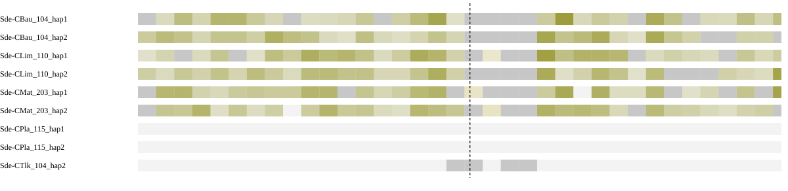

Different chromosomes means the assessed sides map to separate chromosomes in the peer, not that the peer has a fusion. Haplotypes are grouped by individual in the summary. Absence of an expected homologous match can be evidence when sequence availability and assay sensitivity are established. Failure of a qualifying alignment filter alone does not establish biological absence; the coverage and limitation columns show what was measured.

### Local sequence and contact support

| Assay | Measurement |
| --- | --- |
| Qualified immediate HiFi spanning molecules | 0 |
| Qualified HiFi flank molecules left/right | 1 / 1 |
| HiFi informative | False |
| Graph context | screened_primary_contig_paths |

Zero spanning reads must be interpreted with flank coverage, ambiguity and interval width. Graph connectivity alone does not establish a correct join.

| HiFi offset kb | Left molecules | Right molecules | Spanning molecules | Median depth left/right | Flanks observable |
| --- | --- | --- | --- | --- | --- |
| 100 | 5 | 5 | 0 | 10.0 / 7.0 | False |
| 250 | 0 | 4 | 0 | 6.0 / 10.0 | False |
| 500 | 3 | 5 | 0 | 7.0 / 9.0 | False |

Observable distant flanks show reads are available on each side; no spanning reads across a long interval do not by themselves test the exact seam.

| Library | Offset kb | Cross pairs | Within left/right | Sequence/gap controls | Informative |
| --- | --- | --- | --- | --- | --- |
| Ex2 | 100 | 35 | 6333 / 3803 | 0 / 0 | False |
| Ex3 | 100 | 66 | 5429 / 2567 | 0 / 0 | False |
| Ex2 | 250 | 36 | 8895 / 5999 | 2 / 1 | False |
| Ex3 | 250 | 114 | 7725 / 5092 | 2 / 1 | False |
| Ex2 | 500 | 36 | 8729 / 7157 | 4 / 0 | False |
| Ex3 | 500 | 80 | 8018 / 6128 | 4 / 0 | False |


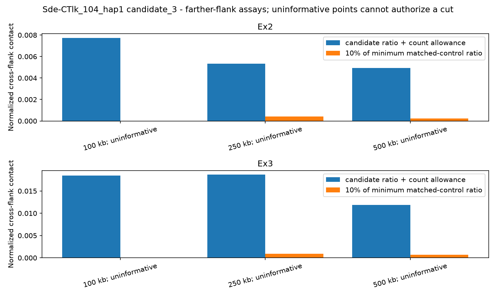

[IGV session: original coordinates](sequence-context/Sde-CTlk_104_hap1.sequence_context/candidate_3.igv.xml)

Scaffolding Hi-C is corroboration, not independent validation. Small control populations and poor observability limit conclusions from weak support.

**Decision needed:** review supporting, opposing and missing evidence before selecting an exact cut. Leave retained or unresolved rows at NO and record reviewer and rationale.

<details><summary>Full candidate measurements</summary>

```json
{
  "assessment_sha256": "1fd4707ae4958ce31f7e95b5732e01d70686755c6a62a414b080fac24e4fd96a",
  "coordinate_stage": "pre_finishing",
  "packet_interval_id": "candidate_3",
  "verified_gap": true,
  "assessment_scaffold_length": 138446979,
  "gap_start": 116057447,
  "gap_end": 116057547,
  "cut_bp": 116057547,
  "hifi_spanning_molecules": 0,
  "graph_status": "screened_primary_contig_paths",
  "graph_contradiction": false,
  "native_continuity": false,
  "direct_native_link": false,
  "native_left": "h1tg000549l",
  "native_right": "h1tg002235l",
  "native_graph_sha256": "9b5ccab05303dc95c5d525f6ae565d219b4417d92b8046f0ecc6e5fb203ce355",
  "interpretation": "Primary path continuity alone is not read support or biological fusion confirmation; unmeasured unitig paths remain a limitation.",
  "chromosome_blocks": {
    "localized": false,
    "independent_individuals": [],
    "chromosome_pair": null,
    "contradictory_pairs": false,
    "peer_assays": [
      {
        "peer": "Sde-CBau_104_hap1",
        "sample": "Sde-CBau_104",
        "auto_evidence": true,
        "chromosome_pair": null,
        "qualified": false,
        "unique_gap_localization": false,
        "trials": [
          {
            "offset_bp": 100000,
            "left_chrom": null,
            "right_chrom": null,
            "left_target": null,
            "right_target": null,
            "usable": false,
            "left_edge": 115957447,
            "right_edge": 116157547
          },
          {
            "offset_bp": 250000,
            "left_chrom": null,
            "right_chrom": null,
            "left_target": null,
            "right_target": null,
            "usable": false,
            "left_edge": 115807447,
            "right_edge": 116307547
          },
          {
            "offset_bp": 500000,
            "left_chrom": null,
            "right_chrom": null,
            "left_target": null,
            "right_target": null,
            "usable": false,
            "left_edge": 115557447,
            "right_edge": 116557547
          }
        ]
      },
      {
        "peer": "Sde-CBau_104_hap2",
        "sample": "Sde-CBau_104",
        "auto_evidence": true,
        "chromosome_pair": null,
        "qualified": false,
        "unique_gap_localization": false,
        "trials": [
          {
            "offset_bp": 100000,
            "left_chrom": null,
            "right_chrom": null,
            "left_target": null,
            "right_target": null,
            "usable": false,
            "left_edge": 115957447,
            "right_edge": 116157547
          },
          {
            "offset_bp": 250000,
            "left_chrom": null,
            "right_chrom": null,
            "left_target": null,
            "right_target": null,
            "usable": false,
            "left_edge": 115807447,
            "right_edge": 116307547
          },
          {
            "offset_bp": 500000,
            "left_chrom": null,
            "right_chrom": null,
            "left_target": null,
            "right_target": null,
            "usable": false,
            "left_edge": 115557447,
            "right_edge": 116557547
          }
        ]
      },
      {
        "peer": "Sde-CLim_110_hap1",
        "sample": "Sde-CLim_110",
        "auto_evidence": true,
        "chromosome_pair": null,
        "qualified": false,
        "unique_gap_localization": false,
        "trials": [
          {
            "offset_bp": 100000,
            "left_chrom": null,
            "right_chrom": null,
            "left_target": null,
            "right_target": null,
            "usable": false,
            "left_edge": 115957447,
            "right_edge": 116157547
          },
          {
            "offset_bp": 250000,
            "left_chrom": null,
            "right_chrom": null,
            "left_target": null,
            "right_target": null,
            "usable": false,
            "left_edge": 115807447,
            "right_edge": 116307547
          },
          {
            "offset_bp": 500000,
            "left_chrom": null,
            "right_chrom": null,
            "left_target": null,
            "right_target": null,
            "usable": false,
            "left_edge": 115557447,
            "right_edge": 116557547
          }
        ]
      },
      {
        "peer": "Sde-CLim_110_hap2",
        "sample": "Sde-CLim_110",
        "auto_evidence": true,
        "chromosome_pair": null,
        "qualified": false,
        "unique_gap_localization": false,
        "trials": [
          {
            "offset_bp": 100000,
            "left_chrom": null,
            "right_chrom": null,
            "left_target": null,
            "right_target": null,
            "usable": false,
            "left_edge": 115957447,
            "right_edge": 116157547
          },
          {
            "offset_bp": 250000,
            "left_chrom": null,
            "right_chrom": null,
            "left_target": null,
            "right_target": null,
            "usable": false,
            "left_edge": 115807447,
            "right_edge": 116307547
          },
          {
            "offset_bp": 500000,
            "left_chrom": null,
            "right_chrom": null,
            "left_target": null,
            "right_target": null,
            "usable": false,
            "left_edge": 115557447,
            "right_edge": 116557547
          }
        ]
      },
      {
        "peer": "Sde-CMat_203_hap1",
        "sample": "Sde-CMat_203",
        "auto_evidence": true,
        "chromosome_pair": null,
        "qualified": false,
        "unique_gap_localization": false,
        "trials": [
          {
            "offset_bp": 100000,
            "left_chrom": null,
            "right_chrom": null,
            "left_target": null,
            "right_target": null,
            "usable": false,
            "left_edge": 115957447,
            "right_edge": 116157547
          },
          {
            "offset_bp": 250000,
            "left_chrom": null,
            "right_chrom": null,
            "left_target": null,
            "right_target": null,
            "usable": false,
            "left_edge": 115807447,
            "right_edge": 116307547
          },
          {
            "offset_bp": 500000,
            "left_chrom": null,
            "right_chrom": null,
            "left_target": null,
            "right_target": null,
            "usable": false,
            "left_edge": 115557447,
            "right_edge": 116557547
          }
        ]
      },
      {
        "peer": "Sde-CMat_203_hap2",
        "sample": "Sde-CMat_203",
        "auto_evidence": true,
        "chromosome_pair": null,
        "qualified": false,
        "unique_gap_localization": false,
        "trials": [
          {
            "offset_bp": 100000,
            "left_chrom": null,
            "right_chrom": null,
            "left_target": null,
            "right_target": null,
            "usable": false,
            "left_edge": 115957447,
            "right_edge": 116157547
          },
          {
            "offset_bp": 250000,
            "left_chrom": null,
            "right_chrom": null,
            "left_target": null,
            "right_target": null,
            "usable": false,
            "left_edge": 115807447,
            "right_edge": 116307547
          },
          {
            "offset_bp": 500000,
            "left_chrom": null,
            "right_chrom": null,
            "left_target": null,
            "right_target": null,
            "usable": false,
            "left_edge": 115557447,
            "right_edge": 116557547
          }
        ]
      },
      {
        "peer": "Sde-CPla_115_hap1",
        "sample": "Sde-CPla_115",
        "auto_evidence": false,
        "chromosome_pair": null,
        "qualified": false,
        "unique_gap_localization": false,
        "trials": [
          {
            "offset_bp": 100000,
            "left_chrom": null,
            "right_chrom": null,
            "left_target": null,
            "right_target": null,
            "usable": false,
            "left_edge": 115957447,
            "right_edge": 116157547
          },
          {
            "offset_bp": 250000,
            "left_chrom": null,
            "right_chrom": null,
            "left_target": null,
            "right_target": null,
            "usable": false,
            "left_edge": 115807447,
            "right_edge": 116307547
          },
          {
            "offset_bp": 500000,
            "left_chrom": null,
            "right_chrom": null,
            "left_target": null,
            "right_target": null,
            "usable": false,
            "left_edge": 115557447,
            "right_edge": 116557547
          }
        ]
      },
      {
        "peer": "Sde-CPla_115_hap2",
        "sample": "Sde-CPla_115",
        "auto_evidence": false,
        "chromosome_pair": null,
        "qualified": false,
        "unique_gap_localization": false,
        "trials": [
          {
            "offset_bp": 100000,
            "left_chrom": null,
            "right_chrom": null,
            "left_target": null,
            "right_target": null,
            "usable": false,
            "left_edge": 115957447,
            "right_edge": 116157547
          },
          {
            "offset_bp": 250000,
            "left_chrom": null,
            "right_chrom": null,
            "left_target": null,
            "right_target": null,
            "usable": false,
            "left_edge": 115807447,
            "right_edge": 116307547
          },
          {
            "offset_bp": 500000,
            "left_chrom": null,
            "right_chrom": null,
            "left_target": null,
            "right_target": null,
            "usable": false,
            "left_edge": 115557447,
            "right_edge": 116557547
          }
        ]
      },
      {
        "peer": "Sde-CTlk_104_hap2",
        "sample": "Sde-CTlk_104",
        "auto_evidence": true,
        "chromosome_pair": null,
        "qualified": false,
        "unique_gap_localization": false,
        "trials": [
          {
            "offset_bp": 100000,
            "left_chrom": null,
            "right_chrom": null,
            "left_target": null,
            "right_target": null,
            "usable": false,
            "left_edge": 115957447,
            "right_edge": 116157547
          },
          {
            "offset_bp": 250000,
            "left_chrom": null,
            "right_chrom": null,
            "left_target": null,
            "right_target": "scaffold_5",
            "usable": false,
            "left_edge": 115807447,
            "right_edge": 116307547
          },
          {
            "offset_bp": 500000,
            "left_chrom": null,
            "right_chrom": null,
            "left_target": null,
            "right_target": null,
            "usable": false,
            "left_edge": 115557447,
            "right_edge": 116557547
          }
        ]
      }
    ]
  },
  "farther_contact_evidence": {
    "supported_offsets": [],
    "pass_all": false,
    "contradictory_informative_trial": false,
    "trials": [
      {
        "offset_bp": 100000,
        "library": "Ex2",
        "informative": false,
        "control_populations": {
          "continuous_control": 0,
          "gap_control": 0
        },
        "matched_control_ids": [],
        "minimum_control_ratio": 0,
        "upper_count_allowance_ratio": 0.007743114652081591,
        "support_loss": false,
        "raw_counts": {
          "left_ends": 35831,
          "right_ends": 22241,
          "left_within": 6333,
          "cross": 35,
          "right_within": 3803
        }
      },
      {
        "offset_bp": 100000,
        "library": "Ex3",
        "informative": false,
        "control_populations": {
          "continuous_control": 0,
          "gap_control": 0
        },
        "matched_control_ids": [],
        "minimum_control_ratio": 0,
        "upper_count_allowance_ratio": 0.018483160534619132,
        "support_loss": false,
        "raw_counts": {
          "left_ends": 21362,
          "right_ends": 10617,
          "left_within": 5429,
          "cross": 66,
          "right_within": 2567
        }
      },
      {
        "offset_bp": 250000,
        "library": "Ex2",
        "informative": false,
        "control_populations": {
          "continuous_control": 2,
          "gap_control": 1
        },
        "matched_control_ids": [
          "control_18326e94c47c77349225",
          "continuous_fa45919372ff1e082178",
          "continuous_7389ba58d31d607b82cd"
        ],
        "minimum_control_ratio": 0.004218842492131582,
        "upper_count_allowance_ratio": 0.005338905082591975,
        "support_loss": false,
        "raw_counts": {
          "left_ends": 48386,
          "right_ends": 33554,
          "left_within": 8895,
          "cross": 36,
          "right_within": 5999
        }
      },
      {
        "offset_bp": 250000,
        "library": "Ex3",
        "informative": false,
        "control_populations": {
          "continuous_control": 2,
          "gap_control": 1
        },
        "matched_control_ids": [
          "control_18326e94c47c77349225",
          "continuous_fa45919372ff1e082178",
          "continuous_7389ba58d31d607b82cd"
        ],
        "minimum_control_ratio": 0.0089362455797999,
        "upper_count_allowance_ratio": 0.018654878302361934,
        "support_loss": false,
        "raw_counts": {
          "left_ends": 29913,
          "right_ends": 19745,
          "left_within": 7725,
          "cross": 114,
          "right_within": 5092
        }
      },
      {
        "offset_bp": 500000,
        "library": "Ex2",
        "informative": false,
        "control_populations": {
          "continuous_control": 4,
          "gap_control": 0
        },
        "matched_control_ids": [
          "continuous_2f74d1f591dfc7e637ba",
          "continuous_8a767de411d1390f7597",
          "continuous_05504a31bd9d7f247a00",
          "continuous_47d46ab35fbfc9adc31f"
        ],
        "minimum_control_ratio": 0.0022717845927510685,
        "upper_count_allowance_ratio": 0.0049342011670684,
        "support_loss": false,
        "raw_counts": {
          "right_ends": 38934,
          "left_ends": 47480,
          "left_within": 8729,
          "cross": 36,
          "right_within": 7157
        }
      },
      {
        "offset_bp": 500000,
        "library": "Ex3",
        "informative": false,
        "control_populations": {
          "continuous_control": 4,
          "gap_control": 0
        },
        "matched_control_ids": [
          "continuous_2f74d1f591dfc7e637ba",
          "continuous_8a767de411d1390f7597",
          "continuous_05504a31bd9d7f247a00",
          "continuous_47d46ab35fbfc9adc31f"
        ],
        "minimum_control_ratio": 0.007081390023972112,
        "upper_count_allowance_ratio": 0.011840926575589517,
        "support_loss": false,
        "raw_counts": {
          "right_ends": 24068,
          "left_ends": 30870,
          "left_within": 8018,
          "cross": 80,
          "right_within": 6128
        }
      }
    ]
  },
  "farther_hifi": {
    "100000": {
      "informative": false,
      "raw": {
        "left_molecules": 5,
        "right_molecules": 5,
        "spanning": 0,
        "left_median_depth": 10.0,
        "right_median_depth": 7.0,
        "left_covered_fraction": 1.0,
        "right_covered_fraction": 1.0
      }
    },
    "250000": {
      "informative": false,
      "raw": {
        "left_molecules": 0,
        "right_molecules": 4,
        "spanning": 0,
        "left_median_depth": 6.0,
        "right_median_depth": 10.0,
        "left_covered_fraction": 0.996,
        "right_covered_fraction": 1.0
      }
    },
    "500000": {
      "informative": false,
      "raw": {
        "left_molecules": 3,
        "right_molecules": 5,
        "spanning": 0,
        "left_median_depth": 7.0,
        "right_median_depth": 9.0,
        "left_covered_fraction": 1.0,
        "right_covered_fraction": 1.0
      }
    }
  },
  "haplotype_block_conflict": false,
  "repeat_obscured_localization": false,
  "control_qualification": [
    {
      "id": "control_338eca06b1d0c084f1ff",
      "population": "gap_control",
      "qualified": false,
      "reasons": [
        "fewer_than_three_independent_continuous_peers"
      ]
    },
    {
      "id": "control_a5323ea9a74b5dc5066d",
      "population": "gap_control",
      "qualified": false,
      "reasons": [
        "fewer_than_three_independent_continuous_peers"
      ]
    },
    {
      "id": "control_9b39e52dc8bb9983630c",
      "population": "gap_control",
      "qualified": false,
      "reasons": [
        "fewer_than_three_independent_continuous_peers"
      ]
    },
    {
      "id": "control_6b64501387d064397809",
      "population": "gap_control",
      "qualified": false,
      "reasons": [
        "fewer_than_three_independent_continuous_peers"
      ]
    },
    {
      "id": "control_18326e94c47c77349225",
      "population": "gap_control",
      "qualified": true,
      "reasons": []
    },
    {
      "id": "control_c7a588bbbcd13360e031",
      "population": "gap_control",
      "qualified": false,
      "reasons": [
        "fewer_than_three_independent_continuous_peers"
      ]
    },
    {
      "id": "control_4e35aa8aae82ad3f82ce",
      "population": "gap_control",
      "qualified": false,
      "reasons": [
        "fewer_than_three_independent_continuous_peers"
      ]
    },
    {
      "id": "control_c019bfe9b45aaeb19ce1",
      "population": "gap_control",
      "qualified": false,
      "reasons": [
        "fewer_than_three_independent_continuous_peers"
      ]
    },
    {
      "id": "control_4387319a110f4604efea",
      "population": "gap_control",
      "qualified": false,
      "reasons": [
        "fewer_than_three_independent_continuous_peers"
      ]
    },
    {
      "id": "control_ea6b43831e17ea702d3c",
      "population": "gap_control",
      "qualified": false,
      "reasons": [
        "fewer_than_three_independent_continuous_peers"
      ]
    },
    {
      "id": "control_ee517b485c7f0d77b1ad",
      "population": "gap_control",
      "qualified": false,
      "reasons": [
        "fewer_than_three_independent_continuous_peers"
      ]
    },
    {
      "id": "control_a480a38b2580798ef439",
      "population": "gap_control",
      "qualified": false,
      "reasons": [
        "fewer_than_three_independent_continuous_peers"
      ]
    },
    {
      "id": "control_81a3326eb0a6337f3955",
      "population": "gap_control",
      "qualified": false,
      "reasons": [
        "fewer_than_three_independent_continuous_peers"
      ]
    },
    {
      "id": "control_2d692b9696079b0c1013",
      "population": "gap_control",
      "qualified": false,
      "reasons": [
        "fewer_than_three_independent_continuous_peers"
      ]
    },
    {
      "id": "control_d2ac5db9f909b8b46166",
      "population": "gap_control",
      "qualified": false,
      "reasons": [
        "fewer_than_three_independent_continuous_peers"
      ]
    },
    {
      "id": "control_13ec29cf570933f9bc4a",
      "population": "gap_control",
      "qualified": false,
      "reasons": [
        "fewer_than_three_independent_continuous_peers"
      ]
    },
    {
      "id": "control_854d9b7143ba711e97d3",
      "population": "gap_control",
      "qualified": false,
      "reasons": [
        "fewer_than_three_independent_continuous_peers"
      ]
    },
    {
      "id": "control_2d204e71eb8421dc639a",
      "population": "gap_control",
      "qualified": false,
      "reasons": [
        "fewer_than_three_independent_continuous_peers"
      ]
    },
    {
      "id": "control_1cbad407caea6077629a",
      "population": "gap_control",
      "qualified": false,
      "reasons": [
        "fewer_than_three_independent_continuous_peers"
      ]
    },
    {
      "id": "control_fe53b991e3e8f28e29a6",
      "population": "gap_control",
      "qualified": false,
      "reasons": [
        "fewer_than_three_independent_continuous_peers"
      ]
    },
    {
      "id": "control_9f2d65ff33b8d3929fe0",
      "population": "gap_control",
      "qualified": false,
      "reasons": [
        "fewer_than_three_independent_continuous_peers"
      ]
    },
    {
      "id": "control_423d31e9f73e6319505f",
      "population": "gap_control",
      "qualified": false,
      "reasons": [
        "fewer_than_three_independent_continuous_peers"
      ]
    },
    {
      "id": "control_20941f46666c1199889d",
      "population": "gap_control",
      "qualified": false,
      "reasons": [
        "fewer_than_three_independent_continuous_peers"
      ]
    },
    {
      "id": "control_82a6ec11ff594baab2c2",
      "population": "gap_control",
      "qualified": false,
      "reasons": [
        "fewer_than_three_independent_continuous_peers"
      ]
    },
    {
      "id": "control_b5fb0487ecdf76b3a7b1",
      "population": "gap_control",
      "qualified": false,
      "reasons": [
        "fewer_than_three_independent_continuous_peers"
      ]
    },
    {
      "id": "control_a59d15188fe973245928",
      "population": "gap_control",
      "qualified": false,
      "reasons": [
        "fewer_than_three_independent_continuous_peers"
      ]
    },
    {
      "id": "control_214e691a86c63c308fac",
      "population": "gap_control",
      "qualified": false,
      "reasons": [
        "fewer_than_three_independent_continuous_peers"
      ]
    },
    {
      "id": "control_052334d35bc518defd23",
      "population": "gap_control",
      "qualified": false,
      "reasons": [
        "fewer_than_three_independent_continuous_peers"
      ]
    },
    {
      "id": "control_109a525a7f732a95fb64",
      "population": "gap_control",
      "qualified": false,
      "reasons": [
        "fewer_than_three_independent_continuous_peers"
      ]
    },
    {
      "id": "control_a014bc9fe9fa18f50e6e",
      "population": "gap_control",
      "qualified": false,
      "reasons": [
        "fewer_than_three_independent_continuous_peers"
      ]
    },
    {
      "id": "control_c12f052116c64fb38745",
      "population": "gap_control",
      "qualified": false,
      "reasons": [
        "fewer_than_three_independent_continuous_peers"
      ]
    },
    {
      "id": "control_cc2e7b3e346eb598cf96",
      "population": "gap_control",
      "qualified": false,
      "reasons": [
        "fewer_than_three_independent_continuous_peers"
      ]
    },
    {
      "id": "control_5b2b73fa3e8c8c92f365",
      "population": "gap_control",
      "qualified": false,
      "reasons": [
        "fewer_than_three_independent_continuous_peers"
      ]
    },
    {
      "id": "control_fd41118be3f75fdf096d",
      "population": "gap_control",
      "qualified": false,
      "reasons": [
        "fewer_than_three_independent_continuous_peers"
      ]
    },
    {
      "id": "control_c5b20ec6d9e610766621",
      "population": "gap_control",
      "qualified": false,
      "reasons": [
        "fewer_than_three_independent_continuous_peers"
      ]
    },
    {
      "id": "control_79e202122f0a9f6998ba",
      "population": "gap_control",
      "qualified": false,
      "reasons": [
        "fewer_than_three_independent_continuous_peers"
      ]
    },
    {
      "id": "control_ffc374ecfe1c3c948c1f",
      "population": "gap_control",
      "qualified": false,
      "reasons": [
        "fewer_than_three_independent_continuous_peers"
      ]
    },
    {
      "id": "control_6d3a69e084d8b86c86d1",
      "population": "gap_control",
      "qualified": false,
      "reasons": [
        "fewer_than_three_independent_continuous_peers"
      ]
    },
    {
      "id": "control_2717a51d8a79f804cb8d",
      "population": "gap_control",
      "qualified": false,
      "reasons": [
        "fewer_than_three_independent_continuous_peers"
      ]
    },
    {
      "id": "control_0c3defd314802c20a0ef",
      "population": "gap_control",
      "qualified": false,
      "reasons": [
        "fewer_than_three_independent_continuous_peers"
      ]
    },
    {
      "id": "control_685ca03f4dafa4a61938",
      "population": "gap_control",
      "qualified": false,
      "reasons": [
        "fewer_than_three_independent_continuous_peers"
      ]
    },
    {
      "id": "control_f45e5b2dfda35da64adf",
      "population": "gap_control",
      "qualified": false,
      "reasons": [
        "fewer_than_three_independent_continuous_peers"
      ]
    },
    {
      "id": "control_9444ce1226c9b1a1ee1c",
      "population": "gap_control",
      "qualified": false,
      "reasons": [
        "fewer_than_three_independent_continuous_peers"
      ]
    },
    {
      "id": "control_ab4dabd56aa7886691c4",
      "population": "gap_control",
      "qualified": false,
      "reasons": [
        "fewer_than_three_independent_continuous_peers"
      ]
    },
    {
      "id": "control_6453a8697e57b418b47c",
      "population": "gap_control",
      "qualified": false,
      "reasons": [
        "fewer_than_three_independent_continuous_peers"
      ]
    },
    {
      "id": "control_349e2fa2ebeee7fcd536",
      "population": "gap_control",
      "qualified": false,
      "reasons": [
        "fewer_than_three_independent_continuous_peers"
      ]
    },
    {
      "id": "control_2575ce2cce7c3727bc8f",
      "population": "gap_control",
      "qualified": false,
      "reasons": [
        "fewer_than_three_independent_continuous_peers"
      ]
    },
    {
      "id": "control_6bec13c2f9caa589fc10",
      "population": "gap_control",
      "qualified": false,
      "reasons": [
        "fewer_than_three_independent_continuous_peers"
      ]
    },
    {
      "id": "continuous_2f74d1f591dfc7e637ba",
      "population": "continuous_control",
      "qualified": false,
      "reasons": [
        "uninformative_hifi_flanks"
      ]
    },
    {
      "id": "continuous_3eec3fefc1dc42343168",
      "population": "continuous_control",
      "qualified": true,
      "reasons": []
    },
    {
      "id": "continuous_8a767de411d1390f7597",
      "population": "continuous_control",
      "qualified": true,
      "reasons": []
    },
    {
      "id": "continuous_f492b20f69ab1e4448f3",
      "population": "continuous_control",
      "qualified": true,
      "reasons": []
    },
    {
      "id": "continuous_a5c2e93260d7b6d05fbf",
      "population": "continuous_control",
      "qualified": false,
      "reasons": [
        "uninformative_hifi_flanks"
      ]
    },
    {
      "id": "continuous_fa45919372ff1e082178",
      "population": "continuous_control",
      "qualified": false,
      "reasons": [
        "uninformative_hifi_flanks"
      ]
    },
    {
      "id": "continuous_2079d6f8d9fa515198ec",
      "population": "continuous_control",
      "qualified": true,
      "reasons": []
    },
    {
      "id": "continuous_7389ba58d31d607b82cd",
      "population": "continuous_control",
      "qualified": true,
      "reasons": []
    },
    {
      "id": "continuous_05504a31bd9d7f247a00",
      "population": "continuous_control",
      "qualified": false,
      "reasons": [
        "uninformative_hifi_flanks"
      ]
    },
    {
      "id": "continuous_44efc9432652e72dc649",
      "population": "continuous_control",
      "qualified": true,
      "reasons": []
    },
    {
      "id": "continuous_47d46ab35fbfc9adc31f",
      "population": "continuous_control",
      "qualified": false,
      "reasons": [
        "uninformative_hifi_flanks"
      ]
    },
    {
      "id": "continuous_779722eda9dc566cd379",
      "population": "continuous_control",
      "qualified": true,
      "reasons": []
    }
  ],
  "hifi_informative": false,
  "matched_controls_pass": false,
  "hic_informative": false,
  "hic_support_loss": false,
  "libraries": [
    {
      "library": "Ex2",
      "matched_controls": 0,
      "control_populations": {
        "continuous_control": 0,
        "gap_control": 0
      },
      "informative": false,
      "ratio": 0.003120311946937847,
      "upper_count_allowance_ratio": 0.0038403839346927344,
      "minimum_control_ratio": 0,
      "support_loss": false,
      "raw_counts": {
        "right_ends": 30683,
        "left_ends": 20249,
        "left_within": 3310,
        "cross": 13,
        "right_within": 5244
      }
    },
    {
      "library": "Ex3",
      "matched_controls": 0,
      "control_populations": {
        "continuous_control": 0,
        "gap_control": 0
      },
      "informative": false,
      "ratio": 0.012624062911683723,
      "upper_count_allowance_ratio": 0.013620699457342966,
      "minimum_control_ratio": 0,
      "support_loss": false,
      "raw_counts": {
        "right_ends": 16005,
        "left_ends": 9671,
        "left_within": 2259,
        "cross": 38,
        "right_within": 4011
      }
    }
  ],
  "independent_discordant_individuals": 0,
  "alternative_placements_checked": true,
  "control_ids": [
    "control_338eca06b1d0c084f1ff",
    "control_a5323ea9a74b5dc5066d",
    "control_9b39e52dc8bb9983630c",
    "control_6b64501387d064397809",
    "control_18326e94c47c77349225",
    "control_c7a588bbbcd13360e031",
    "control_4e35aa8aae82ad3f82ce",
    "control_c019bfe9b45aaeb19ce1",
    "control_4387319a110f4604efea",
    "control_ea6b43831e17ea702d3c",
    "control_ee517b485c7f0d77b1ad",
    "control_a480a38b2580798ef439",
    "control_81a3326eb0a6337f3955",
    "control_2d692b9696079b0c1013",
    "control_d2ac5db9f909b8b46166",
    "control_13ec29cf570933f9bc4a",
    "control_854d9b7143ba711e97d3",
    "control_2d204e71eb8421dc639a",
    "control_1cbad407caea6077629a",
    "control_fe53b991e3e8f28e29a6",
    "control_9f2d65ff33b8d3929fe0",
    "control_423d31e9f73e6319505f",
    "control_20941f46666c1199889d",
    "control_82a6ec11ff594baab2c2",
    "control_b5fb0487ecdf76b3a7b1",
    "control_a59d15188fe973245928",
    "control_214e691a86c63c308fac",
    "control_052334d35bc518defd23",
    "control_109a525a7f732a95fb64",
    "control_a014bc9fe9fa18f50e6e",
    "control_c12f052116c64fb38745",
    "control_cc2e7b3e346eb598cf96",
    "control_5b2b73fa3e8c8c92f365",
    "control_fd41118be3f75fdf096d",
    "control_c5b20ec6d9e610766621",
    "control_79e202122f0a9f6998ba",
    "control_ffc374ecfe1c3c948c1f",
    "control_6d3a69e084d8b86c86d1",
    "control_2717a51d8a79f804cb8d",
    "control_0c3defd314802c20a0ef",
    "control_685ca03f4dafa4a61938",
    "control_f45e5b2dfda35da64adf",
    "control_9444ce1226c9b1a1ee1c",
    "control_ab4dabd56aa7886691c4",
    "control_6453a8697e57b418b47c",
    "control_349e2fa2ebeee7fcd536",
    "control_2575ce2cce7c3727bc8f",
    "control_6bec13c2f9caa589fc10",
    "continuous_2f74d1f591dfc7e637ba",
    "continuous_3eec3fefc1dc42343168",
    "continuous_8a767de411d1390f7597",
    "continuous_f492b20f69ab1e4448f3",
    "continuous_a5c2e93260d7b6d05fbf",
    "continuous_fa45919372ff1e082178",
    "continuous_2079d6f8d9fa515198ec",
    "continuous_7389ba58d31d607b82cd",
    "continuous_05504a31bd9d7f247a00",
    "continuous_44efc9432652e72dc649",
    "continuous_47d46ab35fbfc9adc31f",
    "continuous_779722eda9dc566cd379"
  ],
  "hifi_raw": {
    "left_molecules": 1,
    "right_molecules": 1,
    "spanning": 0,
    "left_median_depth": 1.0,
    "right_median_depth": 1.0,
    "left_covered_fraction": 0.0,
    "right_covered_fraction": 0.0
  },
  "alternative_placement_scope": "Assessment BAM MAPQ and competing peer anchors; bounded emitted alternatives, no proof of haplotype-specific uniqueness",
  "chromosome_tracks": [
    {
      "peer": "Sde-CBau_104_hap1",
      "sample": "Sde-CBau_104",
      "auto_evidence": true,
      "relationship": "same_chromosome",
      "bins": [
        {
          "lo": 0,
          "hi": 50000,
          "aligned_bp": 8604,
          "ambiguous_bp": 0,
          "dominance": 1.0,
          "chrom": null,
          "counts": {
            "chr12": 8604,
            "chr4": 0,
            "chr13": 0
          }
        },
        {
          "lo": 50000,
          "hi": 100000,
          "aligned_bp": 13466,
          "ambiguous_bp": 0,
          "dominance": 1.0,
          "chrom": "chr12",
          "counts": {
            "chr12": 13466,
            "chr4": 0,
            "chr13": 0
          }
        },
        {
          "lo": 100000,
          "hi": 150000,
          "aligned_bp": 30029,
          "ambiguous_bp": 0,
          "dominance": 1.0,
          "chrom": "chr12",
          "counts": {
            "chr12": 30029,
            "chr4": 0,
            "chr13": 0
          }
        },
        {
          "lo": 150000,
          "hi": 200000,
          "aligned_bp": 16812,
          "ambiguous_bp": 0,
          "dominance": 1.0,
          "chrom": "chr12",
          "counts": {
            "chr12": 16812,
            "chr4": 0,
            "chr13": 0
          }
        },
        {
          "lo": 200000,
          "hi": 250000,
          "aligned_bp": 34603,
          "ambiguous_bp": 0,
          "dominance": 1.0,
          "chrom": "chr12",
          "counts": {
            "chr12": 34603,
            "chr4": 0,
            "chr13": 0
          }
        },
        {
          "lo": 250000,
          "hi": 300000,
          "aligned_bp": 34564,
          "ambiguous_bp": 0,
          "dominance": 1.0,
          "chrom": "chr12",
          "counts": {
            "chr12": 34564,
            "chr4": 0,
            "chr13": 0
          }
        },
        {
          "lo": 300000,
          "hi": 350000,
          "aligned_bp": 23414,
          "ambiguous_bp": 0,
          "dominance": 1.0,
          "chrom": "chr12",
          "counts": {
            "chr12": 23414,
            "chr4": 0,
            "chr13": 0
          }
        },
        {
          "lo": 350000,
          "hi": 400000,
          "aligned_bp": 15702,
          "ambiguous_bp": 0,
          "dominance": 1.0,
          "chrom": "chr12",
          "counts": {
            "chr12": 15702,
            "chr4": 0,
            "chr13": 0
          }
        },
        {
          "lo": 400000,
          "hi": 450000,
          "aligned_bp": 9514,
          "ambiguous_bp": 0,
          "dominance": 1.0,
          "chrom": null,
          "counts": {
            "chr12": 9514,
            "chr4": 0,
            "chr13": 0
          }
        },
        {
          "lo": 450000,
          "hi": 500000,
          "aligned_bp": 13008,
          "ambiguous_bp": 0,
          "dominance": 1.0,
          "chrom": "chr12",
          "counts": {
            "chr12": 13008,
            "chr4": 0,
            "chr13": 0
          }
        },
        {
          "lo": 500000,
          "hi": 550000,
          "aligned_bp": 13325,
          "ambiguous_bp": 0,
          "dominance": 1.0,
          "chrom": "chr12",
          "counts": {
            "chr12": 13325,
            "chr4": 0,
            "chr13": 0
          }
        },
        {
          "lo": 550000,
          "hi": 600000,
          "aligned_bp": 15383,
          "ambiguous_bp": 0,
          "dominance": 1.0,
          "chrom": "chr12",
          "counts": {
            "chr12": 15383,
            "chr4": 0,
            "chr13": 0
          }
        },
        {
          "lo": 600000,
          "hi": 650000,
          "aligned_bp": 23791,
          "ambiguous_bp": 0,
          "dominance": 1.0,
          "chrom": "chr12",
          "counts": {
            "chr12": 23791,
            "chr4": 0,
            "chr13": 0
          }
        },
        {
          "lo": 650000,
          "hi": 700000,
          "aligned_bp": 5296,
          "ambiguous_bp": 0,
          "dominance": 1.0,
          "chrom": null,
          "counts": {
            "chr12": 5296,
            "chr4": 0,
            "chr13": 0
          }
        },
        {
          "lo": 700000,
          "hi": 750000,
          "aligned_bp": 19987,
          "ambiguous_bp": 0,
          "dominance": 1.0,
          "chrom": "chr12",
          "counts": {
            "chr12": 19987,
            "chr4": 0,
            "chr13": 0
          }
        },
        {
          "lo": 750000,
          "hi": 800000,
          "aligned_bp": 31396,
          "ambiguous_bp": 0,
          "dominance": 1.0,
          "chrom": "chr12",
          "counts": {
            "chr12": 31396,
            "chr4": 0,
            "chr13": 0
          }
        },
        {
          "lo": 800000,
          "hi": 850000,
          "aligned_bp": 42413,
          "ambiguous_bp": 0,
          "dominance": 1.0,
          "chrom": "chr12",
          "counts": {
            "chr12": 42413,
            "chr4": 0,
            "chr13": 0
          }
        },
        {
          "lo": 850000,
          "hi": 900000,
          "aligned_bp": 10889,
          "ambiguous_bp": 0,
          "dominance": 1.0,
          "chrom": "chr12",
          "counts": {
            "chr12": 10889,
            "chr4": 0,
            "chr13": 0
          }
        },
        {
          "lo": 900000,
          "hi": 950000,
          "aligned_bp": 13503,
          "ambiguous_bp": 0,
          "dominance": 0.7881211582611272,
          "chrom": null,
          "counts": {
            "chr12": 2861,
            "chr4": 10642,
            "chr13": 0
          }
        },
        {
          "lo": 950000,
          "hi": 1000000,
          "aligned_bp": 6768,
          "ambiguous_bp": 0,
          "dominance": 1.0,
          "chrom": null,
          "counts": {
            "chr12": 0,
            "chr4": 6768,
            "chr13": 0
          }
        },
        {
          "lo": 1000000,
          "hi": 1050000,
          "aligned_bp": 2184,
          "ambiguous_bp": 0,
          "dominance": 1.0,
          "chrom": null,
          "counts": {
            "chr12": 0,
            "chr4": 2184,
            "chr13": 0
          }
        },
        {
          "lo": 1050000,
          "hi": 1100000,
          "aligned_bp": 4843,
          "ambiguous_bp": 0,
          "dominance": 0.9430105306628123,
          "chrom": null,
          "counts": {
            "chr12": 0,
            "chr4": 4567,
            "chr13": 276
          }
        },
        {
          "lo": 1100000,
          "hi": 1150000,
          "aligned_bp": 21842,
          "ambiguous_bp": 0,
          "dominance": 1.0,
          "chrom": "chr12",
          "counts": {
            "chr12": 21842,
            "chr4": 0,
            "chr13": 0
          }
        },
        {
          "lo": 1150000,
          "hi": 1200000,
          "aligned_bp": 47608,
          "ambiguous_bp": 0,
          "dominance": 1.0,
          "chrom": "chr12",
          "counts": {
            "chr12": 47608,
            "chr4": 0,
            "chr13": 0
          }
        },
        {
          "lo": 1200000,
          "hi": 1250000,
          "aligned_bp": 14361,
          "ambiguous_bp": 0,
          "dominance": 1.0,
          "chrom": "chr12",
          "counts": {
            "chr12": 14361,
            "chr4": 0,
            "chr13": 0
          }
        },
        {
          "lo": 1250000,
          "hi": 1300000,
          "aligned_bp": 23052,
          "ambiguous_bp": 0,
          "dominance": 1.0,
          "chrom": "chr12",
          "counts": {
            "chr12": 23052,
            "chr4": 0,
            "chr13": 0
          }
        },
        {
          "lo": 1300000,
          "hi": 1350000,
          "aligned_bp": 18089,
          "ambiguous_bp": 0,
          "dominance": 1.0,
          "chrom": "chr12",
          "counts": {
            "chr12": 18089,
            "chr4": 0,
            "chr13": 0
          }
        },
        {
          "lo": 1350000,
          "hi": 1400000,
          "aligned_bp": 9613,
          "ambiguous_bp": 0,
          "dominance": 1.0,
          "chrom": null,
          "counts": {
            "chr12": 9613,
            "chr4": 0,
            "chr13": 0
          }
        },
        {
          "lo": 1400000,
          "hi": 1450000,
          "aligned_bp": 40078,
          "ambiguous_bp": 0,
          "dominance": 1.0,
          "chrom": "chr12",
          "counts": {
            "chr12": 40078,
            "chr4": 0,
            "chr13": 0
          }
        },
        {
          "lo": 1450000,
          "hi": 1500000,
          "aligned_bp": 27036,
          "ambiguous_bp": 0,
          "dominance": 1.0,
          "chrom": "chr12",
          "counts": {
            "chr12": 27036,
            "chr4": 0,
            "chr13": 0
          }
        },
        {
          "lo": 1500000,
          "hi": 1550000,
          "aligned_bp": 7075,
          "ambiguous_bp": 0,
          "dominance": 1.0,
          "chrom": null,
          "counts": {
            "chr12": 7075,
            "chr4": 0,
            "chr13": 0
          }
        },
        {
          "lo": 1550000,
          "hi": 1600000,
          "aligned_bp": 15067,
          "ambiguous_bp": 0,
          "dominance": 1.0,
          "chrom": "chr12",
          "counts": {
            "chr12": 15067,
            "chr4": 0,
            "chr13": 0
          }
        },
        {
          "lo": 1600000,
          "hi": 1650000,
          "aligned_bp": 13937,
          "ambiguous_bp": 0,
          "dominance": 1.0,
          "chrom": "chr12",
          "counts": {
            "chr12": 13937,
            "chr4": 0,
            "chr13": 0
          }
        },
        {
          "lo": 1650000,
          "hi": 1700000,
          "aligned_bp": 28405,
          "ambiguous_bp": 0,
          "dominance": 1.0,
          "chrom": "chr12",
          "counts": {
            "chr12": 28405,
            "chr4": 0,
            "chr13": 0
          }
        },
        {
          "lo": 1700000,
          "hi": 1750000,
          "aligned_bp": 15831,
          "ambiguous_bp": 10,
          "dominance": 1.0,
          "chrom": "chr12",
          "counts": {
            "chr12": 15831,
            "chr4": 0,
            "chr13": 0
          }
        },
        {
          "lo": 1750000,
          "hi": 1773333,
          "aligned_bp": 13606,
          "ambiguous_bp": 0,
          "dominance": 1.0,
          "chrom": "chr12",
          "counts": {
            "chr12": 13606,
            "chr4": 0,
            "chr13": 0
          }
        }
      ],
      "left": {
        "chrom": "chr12",
        "aligned_bp": 365057,
        "coverage": 0.3989829163611008,
        "dominance": 1.0,
        "informative_bins": 15,
        "qualified": true
      },
      "right": {
        "chrom": "chr12",
        "aligned_bp": 320037,
        "coverage": 0.37288876149995803,
        "dominance": 0.9236432037545659,
        "informative_bins": 12,
        "qualified": true
      }
    },
    {
      "peer": "Sde-CBau_104_hap2",
      "sample": "Sde-CBau_104",
      "auto_evidence": true,
      "relationship": "same_chromosome",
      "bins": [
        {
          "lo": 0,
          "hi": 50000,
          "aligned_bp": 21974,
          "ambiguous_bp": 0,
          "dominance": 1.0,
          "chrom": "chr12",
          "counts": {
            "chr12": 21974,
            "chr4": 0
          }
        },
        {
          "lo": 50000,
          "hi": 100000,
          "aligned_bp": 30806,
          "ambiguous_bp": 0,
          "dominance": 1.0,
          "chrom": "chr12",
          "counts": {
            "chr12": 30806,
            "chr4": 0
          }
        },
        {
          "lo": 100000,
          "hi": 150000,
          "aligned_bp": 27467,
          "ambiguous_bp": 0,
          "dominance": 1.0,
          "chrom": "chr12",
          "counts": {
            "chr12": 27467,
            "chr4": 0
          }
        },
        {
          "lo": 150000,
          "hi": 200000,
          "aligned_bp": 16655,
          "ambiguous_bp": 0,
          "dominance": 1.0,
          "chrom": "chr12",
          "counts": {
            "chr12": 16655,
            "chr4": 0
          }
        },
        {
          "lo": 200000,
          "hi": 250000,
          "aligned_bp": 25854,
          "ambiguous_bp": 0,
          "dominance": 1.0,
          "chrom": "chr12",
          "counts": {
            "chr12": 25854,
            "chr4": 0
          }
        },
        {
          "lo": 250000,
          "hi": 300000,
          "aligned_bp": 25767,
          "ambiguous_bp": 0,
          "dominance": 1.0,
          "chrom": "chr12",
          "counts": {
            "chr12": 25767,
            "chr4": 0
          }
        },
        {
          "lo": 300000,
          "hi": 350000,
          "aligned_bp": 20241,
          "ambiguous_bp": 0,
          "dominance": 1.0,
          "chrom": "chr12",
          "counts": {
            "chr12": 20241,
            "chr4": 0
          }
        },
        {
          "lo": 350000,
          "hi": 400000,
          "aligned_bp": 37683,
          "ambiguous_bp": 0,
          "dominance": 1.0,
          "chrom": "chr12",
          "counts": {
            "chr12": 37683,
            "chr4": 0
          }
        },
        {
          "lo": 400000,
          "hi": 450000,
          "aligned_bp": 29315,
          "ambiguous_bp": 0,
          "dominance": 1.0,
          "chrom": "chr12",
          "counts": {
            "chr12": 29315,
            "chr4": 0
          }
        },
        {
          "lo": 450000,
          "hi": 500000,
          "aligned_bp": 27097,
          "ambiguous_bp": 0,
          "dominance": 1.0,
          "chrom": "chr12",
          "counts": {
            "chr12": 27097,
            "chr4": 0
          }
        },
        {
          "lo": 500000,
          "hi": 550000,
          "aligned_bp": 13357,
          "ambiguous_bp": 0,
          "dominance": 1.0,
          "chrom": "chr12",
          "counts": {
            "chr12": 13357,
            "chr4": 0
          }
        },
        {
          "lo": 550000,
          "hi": 600000,
          "aligned_bp": 11131,
          "ambiguous_bp": 0,
          "dominance": 1.0,
          "chrom": "chr12",
          "counts": {
            "chr12": 11131,
            "chr4": 0
          }
        },
        {
          "lo": 600000,
          "hi": 650000,
          "aligned_bp": 28535,
          "ambiguous_bp": 0,
          "dominance": 1.0,
          "chrom": "chr12",
          "counts": {
            "chr12": 28535,
            "chr4": 0
          }
        },
        {
          "lo": 650000,
          "hi": 700000,
          "aligned_bp": 14332,
          "ambiguous_bp": 0,
          "dominance": 1.0,
          "chrom": "chr12",
          "counts": {
            "chr12": 14332,
            "chr4": 0
          }
        },
        {
          "lo": 700000,
          "hi": 750000,
          "aligned_bp": 12181,
          "ambiguous_bp": 0,
          "dominance": 1.0,
          "chrom": "chr12",
          "counts": {
            "chr12": 12181,
            "chr4": 0
          }
        },
        {
          "lo": 750000,
          "hi": 800000,
          "aligned_bp": 16969,
          "ambiguous_bp": 0,
          "dominance": 1.0,
          "chrom": "chr12",
          "counts": {
            "chr12": 16969,
            "chr4": 0
          }
        },
        {
          "lo": 800000,
          "hi": 850000,
          "aligned_bp": 26291,
          "ambiguous_bp": 0,
          "dominance": 1.0,
          "chrom": "chr12",
          "counts": {
            "chr12": 26291,
            "chr4": 0
          }
        },
        {
          "lo": 850000,
          "hi": 900000,
          "aligned_bp": 16463,
          "ambiguous_bp": 0,
          "dominance": 1.0,
          "chrom": "chr12",
          "counts": {
            "chr12": 16463,
            "chr4": 0
          }
        },
        {
          "lo": 900000,
          "hi": 950000,
          "aligned_bp": 13912,
          "ambiguous_bp": 0,
          "dominance": 0.7547441058079356,
          "chrom": null,
          "counts": {
            "chr12": 10500,
            "chr4": 3412
          }
        },
        {
          "lo": 950000,
          "hi": 1000000,
          "aligned_bp": 9857,
          "ambiguous_bp": 0,
          "dominance": 1.0,
          "chrom": null,
          "counts": {
            "chr12": 0,
            "chr4": 9857
          }
        },
        {
          "lo": 1000000,
          "hi": 1050000,
          "aligned_bp": 5244,
          "ambiguous_bp": 0,
          "dominance": 1.0,
          "chrom": null,
          "counts": {
            "chr12": 0,
            "chr4": 5244
          }
        },
        {
          "lo": 1050000,
          "hi": 1100000,
          "aligned_bp": 28004,
          "ambiguous_bp": 901,
          "dominance": 0.7078274532209684,
          "chrom": null,
          "counts": {
            "chr12": 19822,
            "chr4": 8182
          }
        },
        {
          "lo": 1100000,
          "hi": 1150000,
          "aligned_bp": 42046,
          "ambiguous_bp": 0,
          "dominance": 1.0,
          "chrom": "chr12",
          "counts": {
            "chr12": 42046,
            "chr4": 0
          }
        },
        {
          "lo": 1150000,
          "hi": 1200000,
          "aligned_bp": 26607,
          "ambiguous_bp": 0,
          "dominance": 1.0,
          "chrom": "chr12",
          "counts": {
            "chr12": 26607,
            "chr4": 0
          }
        },
        {
          "lo": 1200000,
          "hi": 1250000,
          "aligned_bp": 31936,
          "ambiguous_bp": 0,
          "dominance": 1.0,
          "chrom": "chr12",
          "counts": {
            "chr12": 31936,
            "chr4": 0
          }
        },
        {
          "lo": 1250000,
          "hi": 1300000,
          "aligned_bp": 40084,
          "ambiguous_bp": 0,
          "dominance": 1.0,
          "chrom": "chr12",
          "counts": {
            "chr12": 40084,
            "chr4": 0
          }
        },
        {
          "lo": 1300000,
          "hi": 1350000,
          "aligned_bp": 15303,
          "ambiguous_bp": 0,
          "dominance": 1.0,
          "chrom": "chr12",
          "counts": {
            "chr12": 15303,
            "chr4": 0
          }
        },
        {
          "lo": 1350000,
          "hi": 1400000,
          "aligned_bp": 11015,
          "ambiguous_bp": 8,
          "dominance": 1.0,
          "chrom": "chr12",
          "counts": {
            "chr12": 11015,
            "chr4": 0
          }
        },
        {
          "lo": 1400000,
          "hi": 1450000,
          "aligned_bp": 40453,
          "ambiguous_bp": 0,
          "dominance": 1.0,
          "chrom": "chr12",
          "counts": {
            "chr12": 40453,
            "chr4": 0
          }
        },
        {
          "lo": 1450000,
          "hi": 1500000,
          "aligned_bp": 24811,
          "ambiguous_bp": 0,
          "dominance": 1.0,
          "chrom": "chr12",
          "counts": {
            "chr12": 24811,
            "chr4": 0
          }
        },
        {
          "lo": 1500000,
          "hi": 1550000,
          "aligned_bp": 18886,
          "ambiguous_bp": 0,
          "dominance": 1.0,
          "chrom": "chr12",
          "counts": {
            "chr12": 18886,
            "chr4": 0
          }
        },
        {
          "lo": 1550000,
          "hi": 1600000,
          "aligned_bp": 7583,
          "ambiguous_bp": 0,
          "dominance": 1.0,
          "chrom": null,
          "counts": {
            "chr12": 7583,
            "chr4": 0
          }
        },
        {
          "lo": 1600000,
          "hi": 1650000,
          "aligned_bp": 9368,
          "ambiguous_bp": 0,
          "dominance": 1.0,
          "chrom": null,
          "counts": {
            "chr12": 9368,
            "chr4": 0
          }
        },
        {
          "lo": 1650000,
          "hi": 1700000,
          "aligned_bp": 19299,
          "ambiguous_bp": 0,
          "dominance": 1.0,
          "chrom": "chr12",
          "counts": {
            "chr12": 19299,
            "chr4": 0
          }
        },
        {
          "lo": 1700000,
          "hi": 1750000,
          "aligned_bp": 18619,
          "ambiguous_bp": 0,
          "dominance": 1.0,
          "chrom": "chr12",
          "counts": {
            "chr12": 18619,
            "chr4": 0
          }
        },
        {
          "lo": 1750000,
          "hi": 1773333,
          "aligned_bp": 1234,
          "ambiguous_bp": 0,
          "dominance": 1.0,
          "chrom": null,
          "counts": {
            "chr12": 1234,
            "chr4": 0
          }
        }
      ],
      "left": {
        "chrom": "chr12",
        "aligned_bp": 412618,
        "coverage": 0.4509639124385635,
        "dominance": 1.0,
        "informative_bins": 18,
        "qualified": true
      },
      "right": {
        "chrom": "chr12",
        "aligned_bp": 353761,
        "coverage": 0.4121820325680676,
        "dominance": 0.9245394489499973,
        "informative_bins": 11,
        "qualified": true
      }
    },
    {
      "peer": "Sde-CLim_110_hap1",
      "sample": "Sde-CLim_110",
      "auto_evidence": true,
      "relationship": "uninformative",
      "bins": [
        {
          "lo": 0,
          "hi": 50000,
          "aligned_bp": 10313,
          "ambiguous_bp": 6,
          "dominance": 1.0,
          "chrom": "chr12",
          "counts": {
            "chr12": 10313,
            "chr4": 0,
            "chr5": 0
          }
        },
        {
          "lo": 50000,
          "hi": 100000,
          "aligned_bp": 17237,
          "ambiguous_bp": 0,
          "dominance": 1.0,
          "chrom": "chr12",
          "counts": {
            "chr12": 17237,
            "chr4": 0,
            "chr5": 0
          }
        },
        {
          "lo": 100000,
          "hi": 150000,
          "aligned_bp": 7836,
          "ambiguous_bp": 0,
          "dominance": 1.0,
          "chrom": null,
          "counts": {
            "chr12": 7836,
            "chr4": 0,
            "chr5": 0
          }
        },
        {
          "lo": 150000,
          "hi": 200000,
          "aligned_bp": 13871,
          "ambiguous_bp": 0,
          "dominance": 1.0,
          "chrom": "chr12",
          "counts": {
            "chr12": 13871,
            "chr4": 0,
            "chr5": 0
          }
        },
        {
          "lo": 200000,
          "hi": 250000,
          "aligned_bp": 25627,
          "ambiguous_bp": 0,
          "dominance": 1.0,
          "chrom": "chr12",
          "counts": {
            "chr12": 25627,
            "chr4": 0,
            "chr5": 0
          }
        },
        {
          "lo": 250000,
          "hi": 300000,
          "aligned_bp": 9356,
          "ambiguous_bp": 0,
          "dominance": 1.0,
          "chrom": null,
          "counts": {
            "chr12": 9356,
            "chr4": 0,
            "chr5": 0
          }
        },
        {
          "lo": 300000,
          "hi": 350000,
          "aligned_bp": 10994,
          "ambiguous_bp": 0,
          "dominance": 1.0,
          "chrom": "chr12",
          "counts": {
            "chr12": 10994,
            "chr4": 0,
            "chr5": 0
          }
        },
        {
          "lo": 350000,
          "hi": 400000,
          "aligned_bp": 29327,
          "ambiguous_bp": 0,
          "dominance": 1.0,
          "chrom": "chr12",
          "counts": {
            "chr12": 29327,
            "chr4": 0,
            "chr5": 0
          }
        },
        {
          "lo": 400000,
          "hi": 450000,
          "aligned_bp": 22842,
          "ambiguous_bp": 0,
          "dominance": 1.0,
          "chrom": "chr12",
          "counts": {
            "chr12": 22842,
            "chr4": 0,
            "chr5": 0
          }
        },
        {
          "lo": 450000,
          "hi": 500000,
          "aligned_bp": 37950,
          "ambiguous_bp": 0,
          "dominance": 1.0,
          "chrom": "chr12",
          "counts": {
            "chr12": 37950,
            "chr4": 0,
            "chr5": 0
          }
        },
        {
          "lo": 500000,
          "hi": 550000,
          "aligned_bp": 31919,
          "ambiguous_bp": 0,
          "dominance": 1.0,
          "chrom": "chr12",
          "counts": {
            "chr12": 31919,
            "chr4": 0,
            "chr5": 0
          }
        },
        {
          "lo": 550000,
          "hi": 600000,
          "aligned_bp": 34415,
          "ambiguous_bp": 0,
          "dominance": 1.0,
          "chrom": "chr12",
          "counts": {
            "chr12": 34415,
            "chr4": 0,
            "chr5": 0
          }
        },
        {
          "lo": 600000,
          "hi": 650000,
          "aligned_bp": 27865,
          "ambiguous_bp": 0,
          "dominance": 1.0,
          "chrom": "chr12",
          "counts": {
            "chr12": 27865,
            "chr4": 0,
            "chr5": 0
          }
        },
        {
          "lo": 650000,
          "hi": 700000,
          "aligned_bp": 13544,
          "ambiguous_bp": 0,
          "dominance": 1.0,
          "chrom": "chr12",
          "counts": {
            "chr12": 13544,
            "chr4": 0,
            "chr5": 0
          }
        },
        {
          "lo": 700000,
          "hi": 750000,
          "aligned_bp": 21670,
          "ambiguous_bp": 0,
          "dominance": 1.0,
          "chrom": "chr12",
          "counts": {
            "chr12": 21670,
            "chr4": 0,
            "chr5": 0
          }
        },
        {
          "lo": 750000,
          "hi": 800000,
          "aligned_bp": 38776,
          "ambiguous_bp": 0,
          "dominance": 1.0,
          "chrom": "chr12",
          "counts": {
            "chr12": 38776,
            "chr4": 0,
            "chr5": 0
          }
        },
        {
          "lo": 800000,
          "hi": 850000,
          "aligned_bp": 35553,
          "ambiguous_bp": 0,
          "dominance": 1.0,
          "chrom": "chr12",
          "counts": {
            "chr12": 35553,
            "chr4": 0,
            "chr5": 0
          }
        },
        {
          "lo": 850000,
          "hi": 900000,
          "aligned_bp": 18347,
          "ambiguous_bp": 0,
          "dominance": 1.0,
          "chrom": "chr12",
          "counts": {
            "chr12": 18347,
            "chr4": 0,
            "chr5": 0
          }
        },
        {
          "lo": 900000,
          "hi": 950000,
          "aligned_bp": 23671,
          "ambiguous_bp": 0,
          "dominance": 0.6363905200456255,
          "chrom": null,
          "counts": {
            "chr12": 8607,
            "chr4": 15064,
            "chr5": 0
          }
        },
        {
          "lo": 950000,
          "hi": 1000000,
          "aligned_bp": 10850,
          "ambiguous_bp": 0,
          "dominance": 1.0,
          "chrom": "chr4",
          "counts": {
            "chr12": 0,
            "chr4": 10850,
            "chr5": 0
          }
        },
        {
          "lo": 1000000,
          "hi": 1050000,
          "aligned_bp": 7126,
          "ambiguous_bp": 0,
          "dominance": 1.0,
          "chrom": null,
          "counts": {
            "chr12": 0,
            "chr4": 7126,
            "chr5": 0
          }
        },
        {
          "lo": 1050000,
          "hi": 1100000,
          "aligned_bp": 9468,
          "ambiguous_bp": 1,
          "dominance": 0.8167511618081961,
          "chrom": null,
          "counts": {
            "chr12": 1462,
            "chr4": 7733,
            "chr5": 273
          }
        },
        {
          "lo": 1100000,
          "hi": 1150000,
          "aligned_bp": 45691,
          "ambiguous_bp": 0,
          "dominance": 1.0,
          "chrom": "chr12",
          "counts": {
            "chr12": 45691,
            "chr4": 0,
            "chr5": 0
          }
        },
        {
          "lo": 1150000,
          "hi": 1200000,
          "aligned_bp": 28375,
          "ambiguous_bp": 0,
          "dominance": 1.0,
          "chrom": "chr12",
          "counts": {
            "chr12": 28375,
            "chr4": 0,
            "chr5": 0
          }
        },
        {
          "lo": 1200000,
          "hi": 1250000,
          "aligned_bp": 36204,
          "ambiguous_bp": 0,
          "dominance": 1.0,
          "chrom": "chr12",
          "counts": {
            "chr12": 36204,
            "chr4": 0,
            "chr5": 0
          }
        },
        {
          "lo": 1250000,
          "hi": 1300000,
          "aligned_bp": 36220,
          "ambiguous_bp": 0,
          "dominance": 1.0,
          "chrom": "chr12",
          "counts": {
            "chr12": 36220,
            "chr4": 0,
            "chr5": 0
          }
        },
        {
          "lo": 1300000,
          "hi": 1350000,
          "aligned_bp": 33721,
          "ambiguous_bp": 0,
          "dominance": 1.0,
          "chrom": "chr12",
          "counts": {
            "chr12": 33721,
            "chr4": 0,
            "chr5": 0
          }
        },
        {
          "lo": 1350000,
          "hi": 1400000,
          "aligned_bp": 3903,
          "ambiguous_bp": 0,
          "dominance": 1.0,
          "chrom": null,
          "counts": {
            "chr12": 3903,
            "chr4": 0,
            "chr5": 0
          }
        },
        {
          "lo": 1400000,
          "hi": 1450000,
          "aligned_bp": 13928,
          "ambiguous_bp": 0,
          "dominance": 1.0,
          "chrom": "chr12",
          "counts": {
            "chr12": 13928,
            "chr4": 0,
            "chr5": 0
          }
        },
        {
          "lo": 1450000,
          "hi": 1500000,
          "aligned_bp": 19634,
          "ambiguous_bp": 0,
          "dominance": 1.0,
          "chrom": "chr12",
          "counts": {
            "chr12": 19634,
            "chr4": 0,
            "chr5": 0
          }
        },
        {
          "lo": 1500000,
          "hi": 1550000,
          "aligned_bp": 15617,
          "ambiguous_bp": 0,
          "dominance": 1.0,
          "chrom": "chr12",
          "counts": {
            "chr12": 15617,
            "chr4": 0,
            "chr5": 0
          }
        },
        {
          "lo": 1550000,
          "hi": 1600000,
          "aligned_bp": 13390,
          "ambiguous_bp": 0,
          "dominance": 1.0,
          "chrom": "chr12",
          "counts": {
            "chr12": 13390,
            "chr4": 0,
            "chr5": 0
          }
        },
        {
          "lo": 1600000,
          "hi": 1650000,
          "aligned_bp": 7969,
          "ambiguous_bp": 0,
          "dominance": 1.0,
          "chrom": null,
          "counts": {
            "chr12": 7969,
            "chr4": 0,
            "chr5": 0
          }
        },
        {
          "lo": 1650000,
          "hi": 1700000,
          "aligned_bp": 24020,
          "ambiguous_bp": 0,
          "dominance": 1.0,
          "chrom": "chr12",
          "counts": {
            "chr12": 24020,
            "chr4": 0,
            "chr5": 0
          }
        },
        {
          "lo": 1700000,
          "hi": 1750000,
          "aligned_bp": 15135,
          "ambiguous_bp": 0,
          "dominance": 1.0,
          "chrom": "chr12",
          "counts": {
            "chr12": 15135,
            "chr4": 0,
            "chr5": 0
          }
        },
        {
          "lo": 1750000,
          "hi": 1773333,
          "aligned_bp": 10005,
          "ambiguous_bp": 0,
          "dominance": 1.0,
          "chrom": "chr12",
          "counts": {
            "chr12": 10005,
            "chr4": 0,
            "chr5": 0
          }
        }
      ],
      "left": {
        "chrom": "chr12",
        "aligned_bp": 416049,
        "coverage": 0.45471376625874754,
        "dominance": 1.0,
        "informative_bins": 16,
        "qualified": false
      },
      "right": {
        "chrom": "chr12",
        "aligned_bp": 346320,
        "coverage": 0.4035122060345069,
        "dominance": 0.8814795564795564,
        "informative_bins": 12,
        "qualified": false
      }
    },
    {
      "peer": "Sde-CLim_110_hap2",
      "sample": "Sde-CLim_110",
      "auto_evidence": true,
      "relationship": "uninformative",
      "bins": [
        {
          "lo": 0,
          "hi": 50000,
          "aligned_bp": 20442,
          "ambiguous_bp": 0,
          "dominance": 1.0,
          "chrom": "chr12",
          "counts": {
            "chr12": 20442,
            "chr4": 0,
            "chr2": 0
          }
        },
        {
          "lo": 50000,
          "hi": 100000,
          "aligned_bp": 13654,
          "ambiguous_bp": 0,
          "dominance": 1.0,
          "chrom": "chr12",
          "counts": {
            "chr12": 13654,
            "chr4": 0,
            "chr2": 0
          }
        },
        {
          "lo": 100000,
          "hi": 150000,
          "aligned_bp": 24175,
          "ambiguous_bp": 0,
          "dominance": 1.0,
          "chrom": "chr12",
          "counts": {
            "chr12": 24175,
            "chr4": 0,
            "chr2": 0
          }
        },
        {
          "lo": 150000,
          "hi": 200000,
          "aligned_bp": 18622,
          "ambiguous_bp": 0,
          "dominance": 1.0,
          "chrom": "chr12",
          "counts": {
            "chr12": 18622,
            "chr4": 0,
            "chr2": 0
          }
        },
        {
          "lo": 200000,
          "hi": 250000,
          "aligned_bp": 27195,
          "ambiguous_bp": 0,
          "dominance": 1.0,
          "chrom": "chr12",
          "counts": {
            "chr12": 27195,
            "chr4": 0,
            "chr2": 0
          }
        },
        {
          "lo": 250000,
          "hi": 300000,
          "aligned_bp": 17013,
          "ambiguous_bp": 0,
          "dominance": 1.0,
          "chrom": "chr12",
          "counts": {
            "chr12": 17013,
            "chr4": 0,
            "chr2": 0
          }
        },
        {
          "lo": 300000,
          "hi": 350000,
          "aligned_bp": 30026,
          "ambiguous_bp": 0,
          "dominance": 1.0,
          "chrom": "chr12",
          "counts": {
            "chr12": 30026,
            "chr4": 0,
            "chr2": 0
          }
        },
        {
          "lo": 350000,
          "hi": 400000,
          "aligned_bp": 22684,
          "ambiguous_bp": 0,
          "dominance": 1.0,
          "chrom": "chr12",
          "counts": {
            "chr12": 22684,
            "chr4": 0,
            "chr2": 0
          }
        },
        {
          "lo": 400000,
          "hi": 450000,
          "aligned_bp": 14188,
          "ambiguous_bp": 0,
          "dominance": 1.0,
          "chrom": "chr12",
          "counts": {
            "chr12": 14188,
            "chr4": 0,
            "chr2": 0
          }
        },
        {
          "lo": 450000,
          "hi": 500000,
          "aligned_bp": 30890,
          "ambiguous_bp": 0,
          "dominance": 1.0,
          "chrom": "chr12",
          "counts": {
            "chr12": 30890,
            "chr4": 0,
            "chr2": 0
          }
        },
        {
          "lo": 500000,
          "hi": 550000,
          "aligned_bp": 31989,
          "ambiguous_bp": 0,
          "dominance": 1.0,
          "chrom": "chr12",
          "counts": {
            "chr12": 31989,
            "chr4": 0,
            "chr2": 0
          }
        },
        {
          "lo": 550000,
          "hi": 600000,
          "aligned_bp": 26965,
          "ambiguous_bp": 0,
          "dominance": 1.0,
          "chrom": "chr12",
          "counts": {
            "chr12": 26965,
            "chr4": 0,
            "chr2": 0
          }
        },
        {
          "lo": 600000,
          "hi": 650000,
          "aligned_bp": 27932,
          "ambiguous_bp": 0,
          "dominance": 1.0,
          "chrom": "chr12",
          "counts": {
            "chr12": 27932,
            "chr4": 0,
            "chr2": 0
          }
        },
        {
          "lo": 650000,
          "hi": 700000,
          "aligned_bp": 15396,
          "ambiguous_bp": 0,
          "dominance": 1.0,
          "chrom": "chr12",
          "counts": {
            "chr12": 15396,
            "chr4": 0,
            "chr2": 0
          }
        },
        {
          "lo": 700000,
          "hi": 750000,
          "aligned_bp": 15466,
          "ambiguous_bp": 0,
          "dominance": 1.0,
          "chrom": "chr12",
          "counts": {
            "chr12": 15466,
            "chr4": 0,
            "chr2": 0
          }
        },
        {
          "lo": 750000,
          "hi": 800000,
          "aligned_bp": 26007,
          "ambiguous_bp": 0,
          "dominance": 1.0,
          "chrom": "chr12",
          "counts": {
            "chr12": 26007,
            "chr4": 0,
            "chr2": 0
          }
        },
        {
          "lo": 800000,
          "hi": 850000,
          "aligned_bp": 37818,
          "ambiguous_bp": 0,
          "dominance": 1.0,
          "chrom": "chr12",
          "counts": {
            "chr12": 37818,
            "chr4": 0,
            "chr2": 0
          }
        },
        {
          "lo": 850000,
          "hi": 900000,
          "aligned_bp": 19411,
          "ambiguous_bp": 0,
          "dominance": 1.0,
          "chrom": "chr12",
          "counts": {
            "chr12": 19411,
            "chr4": 0,
            "chr2": 0
          }
        },
        {
          "lo": 900000,
          "hi": 950000,
          "aligned_bp": 14411,
          "ambiguous_bp": 0,
          "dominance": 0.5439594754007355,
          "chrom": null,
          "counts": {
            "chr12": 6572,
            "chr4": 7839,
            "chr2": 0
          }
        },
        {
          "lo": 950000,
          "hi": 1000000,
          "aligned_bp": 7517,
          "ambiguous_bp": 0,
          "dominance": 1.0,
          "chrom": null,
          "counts": {
            "chr12": 0,
            "chr4": 7517,
            "chr2": 0
          }
        },
        {
          "lo": 1000000,
          "hi": 1050000,
          "aligned_bp": 8832,
          "ambiguous_bp": 0,
          "dominance": 1.0,
          "chrom": null,
          "counts": {
            "chr12": 0,
            "chr4": 8832,
            "chr2": 0
          }
        },
        {
          "lo": 1050000,
          "hi": 1100000,
          "aligned_bp": 33186,
          "ambiguous_bp": 794,
          "dominance": 0.62225034653167,
          "chrom": null,
          "counts": {
            "chr12": 20650,
            "chr4": 12216,
            "chr2": 320
          }
        },
        {
          "lo": 1100000,
          "hi": 1150000,
          "aligned_bp": 40091,
          "ambiguous_bp": 0,
          "dominance": 1.0,
          "chrom": "chr12",
          "counts": {
            "chr12": 40091,
            "chr4": 0,
            "chr2": 0
          }
        },
        {
          "lo": 1150000,
          "hi": 1200000,
          "aligned_bp": 11627,
          "ambiguous_bp": 0,
          "dominance": 1.0,
          "chrom": "chr12",
          "counts": {
            "chr12": 11627,
            "chr4": 0,
            "chr2": 0
          }
        },
        {
          "lo": 1200000,
          "hi": 1250000,
          "aligned_bp": 18428,
          "ambiguous_bp": 0,
          "dominance": 1.0,
          "chrom": "chr12",
          "counts": {
            "chr12": 18428,
            "chr4": 0,
            "chr2": 0
          }
        },
        {
          "lo": 1250000,
          "hi": 1300000,
          "aligned_bp": 33289,
          "ambiguous_bp": 0,
          "dominance": 1.0,
          "chrom": "chr12",
          "counts": {
            "chr12": 33289,
            "chr4": 0,
            "chr2": 0
          }
        },
        {
          "lo": 1300000,
          "hi": 1350000,
          "aligned_bp": 26473,
          "ambiguous_bp": 0,
          "dominance": 1.0,
          "chrom": "chr12",
          "counts": {
            "chr12": 26473,
            "chr4": 0,
            "chr2": 0
          }
        },
        {
          "lo": 1350000,
          "hi": 1400000,
          "aligned_bp": 10329,
          "ambiguous_bp": 0,
          "dominance": 1.0,
          "chrom": "chr12",
          "counts": {
            "chr12": 10329,
            "chr4": 0,
            "chr2": 0
          }
        },
        {
          "lo": 1400000,
          "hi": 1450000,
          "aligned_bp": 31702,
          "ambiguous_bp": 0,
          "dominance": 1.0,
          "chrom": "chr12",
          "counts": {
            "chr12": 31702,
            "chr4": 0,
            "chr2": 0
          }
        },
        {
          "lo": 1450000,
          "hi": 1500000,
          "aligned_bp": 9405,
          "ambiguous_bp": 0,
          "dominance": 1.0,
          "chrom": null,
          "counts": {
            "chr12": 9405,
            "chr4": 0,
            "chr2": 0
          }
        },
        {
          "lo": 1500000,
          "hi": 1550000,
          "aligned_bp": 5232,
          "ambiguous_bp": 0,
          "dominance": 1.0,
          "chrom": null,
          "counts": {
            "chr12": 5232,
            "chr4": 0,
            "chr2": 0
          }
        },
        {
          "lo": 1550000,
          "hi": 1600000,
          "aligned_bp": 4912,
          "ambiguous_bp": 0,
          "dominance": 1.0,
          "chrom": null,
          "counts": {
            "chr12": 4912,
            "chr4": 0,
            "chr2": 0
          }
        },
        {
          "lo": 1600000,
          "hi": 1650000,
          "aligned_bp": 19360,
          "ambiguous_bp": 0,
          "dominance": 1.0,
          "chrom": "chr12",
          "counts": {
            "chr12": 19360,
            "chr4": 0,
            "chr2": 0
          }
        },
        {
          "lo": 1650000,
          "hi": 1700000,
          "aligned_bp": 15688,
          "ambiguous_bp": 0,
          "dominance": 1.0,
          "chrom": "chr12",
          "counts": {
            "chr12": 15688,
            "chr4": 0,
            "chr2": 0
          }
        },
        {
          "lo": 1700000,
          "hi": 1750000,
          "aligned_bp": 13159,
          "ambiguous_bp": 0,
          "dominance": 1.0,
          "chrom": "chr12",
          "counts": {
            "chr12": 13159,
            "chr4": 0,
            "chr2": 0
          }
        },
        {
          "lo": 1750000,
          "hi": 1773333,
          "aligned_bp": 20501,
          "ambiguous_bp": 0,
          "dominance": 1.0,
          "chrom": "chr12",
          "counts": {
            "chr12": 20501,
            "chr4": 0,
            "chr2": 0
          }
        }
      ],
      "left": {
        "chrom": "chr12",
        "aligned_bp": 426445,
        "coverage": 0.46607589983922953,
        "dominance": 1.0,
        "informative_bins": 18,
        "qualified": false
      },
      "right": {
        "chrom": "chr12",
        "aligned_bp": 317570,
        "coverage": 0.37001435455757203,
        "dominance": 0.8843593538432472,
        "informative_bins": 11,
        "qualified": false
      }
    },
    {
      "peer": "Sde-CMat_203_hap1",
      "sample": "Sde-CMat_203",
      "auto_evidence": true,
      "relationship": "uninformative",
      "bins": [
        {
          "lo": 0,
          "hi": 50000,
          "aligned_bp": 9499,
          "ambiguous_bp": 0,
          "dominance": 1.0,
          "chrom": null,
          "counts": {
            "chr12": 9499,
            "chr4": 0
          }
        },
        {
          "lo": 50000,
          "hi": 100000,
          "aligned_bp": 33400,
          "ambiguous_bp": 0,
          "dominance": 1.0,
          "chrom": "chr12",
          "counts": {
            "chr12": 33400,
            "chr4": 0
          }
        },
        {
          "lo": 100000,
          "hi": 150000,
          "aligned_bp": 34285,
          "ambiguous_bp": 0,
          "dominance": 1.0,
          "chrom": "chr12",
          "counts": {
            "chr12": 34285,
            "chr4": 0
          }
        },
        {
          "lo": 150000,
          "hi": 200000,
          "aligned_bp": 18025,
          "ambiguous_bp": 0,
          "dominance": 1.0,
          "chrom": "chr12",
          "counts": {
            "chr12": 18025,
            "chr4": 0
          }
        },
        {
          "lo": 200000,
          "hi": 250000,
          "aligned_bp": 14626,
          "ambiguous_bp": 0,
          "dominance": 1.0,
          "chrom": "chr12",
          "counts": {
            "chr12": 14626,
            "chr4": 0
          }
        },
        {
          "lo": 250000,
          "hi": 300000,
          "aligned_bp": 22651,
          "ambiguous_bp": 0,
          "dominance": 1.0,
          "chrom": "chr12",
          "counts": {
            "chr12": 22651,
            "chr4": 0
          }
        },
        {
          "lo": 300000,
          "hi": 350000,
          "aligned_bp": 24436,
          "ambiguous_bp": 0,
          "dominance": 1.0,
          "chrom": "chr12",
          "counts": {
            "chr12": 24436,
            "chr4": 0
          }
        },
        {
          "lo": 350000,
          "hi": 400000,
          "aligned_bp": 23142,
          "ambiguous_bp": 0,
          "dominance": 1.0,
          "chrom": "chr12",
          "counts": {
            "chr12": 23142,
            "chr4": 0
          }
        },
        {
          "lo": 400000,
          "hi": 450000,
          "aligned_bp": 22578,
          "ambiguous_bp": 0,
          "dominance": 1.0,
          "chrom": "chr12",
          "counts": {
            "chr12": 22578,
            "chr4": 0
          }
        },
        {
          "lo": 450000,
          "hi": 500000,
          "aligned_bp": 34445,
          "ambiguous_bp": 0,
          "dominance": 1.0,
          "chrom": "chr12",
          "counts": {
            "chr12": 34445,
            "chr4": 0
          }
        },
        {
          "lo": 500000,
          "hi": 550000,
          "aligned_bp": 33846,
          "ambiguous_bp": 0,
          "dominance": 1.0,
          "chrom": "chr12",
          "counts": {
            "chr12": 33846,
            "chr4": 0
          }
        },
        {
          "lo": 550000,
          "hi": 600000,
          "aligned_bp": 6052,
          "ambiguous_bp": 0,
          "dominance": 1.0,
          "chrom": null,
          "counts": {
            "chr12": 6052,
            "chr4": 0
          }
        },
        {
          "lo": 600000,
          "hi": 650000,
          "aligned_bp": 25468,
          "ambiguous_bp": 0,
          "dominance": 1.0,
          "chrom": "chr12",
          "counts": {
            "chr12": 25468,
            "chr4": 0
          }
        },
        {
          "lo": 650000,
          "hi": 700000,
          "aligned_bp": 15906,
          "ambiguous_bp": 0,
          "dominance": 1.0,
          "chrom": "chr12",
          "counts": {
            "chr12": 15906,
            "chr4": 0
          }
        },
        {
          "lo": 700000,
          "hi": 750000,
          "aligned_bp": 20713,
          "ambiguous_bp": 0,
          "dominance": 1.0,
          "chrom": "chr12",
          "counts": {
            "chr12": 20713,
            "chr4": 0
          }
        },
        {
          "lo": 750000,
          "hi": 800000,
          "aligned_bp": 32518,
          "ambiguous_bp": 0,
          "dominance": 1.0,
          "chrom": "chr12",
          "counts": {
            "chr12": 32518,
            "chr4": 0
          }
        },
        {
          "lo": 800000,
          "hi": 850000,
          "aligned_bp": 35888,
          "ambiguous_bp": 0,
          "dominance": 0.9991640659830584,
          "chrom": "chr12",
          "counts": {
            "chr12": 35858,
            "chr4": 30
          }
        },
        {
          "lo": 850000,
          "hi": 900000,
          "aligned_bp": 11295,
          "ambiguous_bp": 0,
          "dominance": 0.8463036741921204,
          "chrom": null,
          "counts": {
            "chr12": 9559,
            "chr4": 1736
          }
        },
        {
          "lo": 900000,
          "hi": 950000,
          "aligned_bp": 12751,
          "ambiguous_bp": 0,
          "dominance": 1.0,
          "chrom": "chr4",
          "counts": {
            "chr12": 0,
            "chr4": 12751
          }
        },
        {
          "lo": 950000,
          "hi": 1000000,
          "aligned_bp": 6521,
          "ambiguous_bp": 0,
          "dominance": 1.0,
          "chrom": null,
          "counts": {
            "chr12": 0,
            "chr4": 6521
          }
        },
        {
          "lo": 1000000,
          "hi": 1050000,
          "aligned_bp": 5765,
          "ambiguous_bp": 0,
          "dominance": 1.0,
          "chrom": null,
          "counts": {
            "chr12": 0,
            "chr4": 5765
          }
        },
        {
          "lo": 1050000,
          "hi": 1100000,
          "aligned_bp": 4921,
          "ambiguous_bp": 0,
          "dominance": 1.0,
          "chrom": null,
          "counts": {
            "chr12": 0,
            "chr4": 4921
          }
        },
        {
          "lo": 1100000,
          "hi": 1150000,
          "aligned_bp": 22088,
          "ambiguous_bp": 0,
          "dominance": 1.0,
          "chrom": "chr12",
          "counts": {
            "chr12": 22088,
            "chr4": 0
          }
        },
        {
          "lo": 1150000,
          "hi": 1200000,
          "aligned_bp": 40879,
          "ambiguous_bp": 0,
          "dominance": 1.0,
          "chrom": "chr12",
          "counts": {
            "chr12": 40879,
            "chr4": 0
          }
        },
        {
          "lo": 1200000,
          "hi": 1250000,
          "aligned_bp": 0,
          "ambiguous_bp": 0,
          "dominance": 0.0,
          "chrom": null,
          "counts": {
            "chr12": 0,
            "chr4": 0
          }
        },
        {
          "lo": 1250000,
          "hi": 1300000,
          "aligned_bp": 37071,
          "ambiguous_bp": 0,
          "dominance": 1.0,
          "chrom": "chr12",
          "counts": {
            "chr12": 37071,
            "chr4": 0
          }
        },
        {
          "lo": 1300000,
          "hi": 1350000,
          "aligned_bp": 12941,
          "ambiguous_bp": 0,
          "dominance": 1.0,
          "chrom": "chr12",
          "counts": {
            "chr12": 12941,
            "chr4": 0
          }
        },
        {
          "lo": 1350000,
          "hi": 1400000,
          "aligned_bp": 13168,
          "ambiguous_bp": 0,
          "dominance": 1.0,
          "chrom": "chr12",
          "counts": {
            "chr12": 13168,
            "chr4": 0
          }
        },
        {
          "lo": 1400000,
          "hi": 1450000,
          "aligned_bp": 32556,
          "ambiguous_bp": 0,
          "dominance": 1.0,
          "chrom": "chr12",
          "counts": {
            "chr12": 32556,
            "chr4": 0
          }
        },
        {
          "lo": 1450000,
          "hi": 1500000,
          "aligned_bp": 5655,
          "ambiguous_bp": 0,
          "dominance": 1.0,
          "chrom": null,
          "counts": {
            "chr12": 5655,
            "chr4": 0
          }
        },
        {
          "lo": 1500000,
          "hi": 1550000,
          "aligned_bp": 10611,
          "ambiguous_bp": 0,
          "dominance": 1.0,
          "chrom": "chr12",
          "counts": {
            "chr12": 10611,
            "chr4": 0
          }
        },
        {
          "lo": 1550000,
          "hi": 1600000,
          "aligned_bp": 16405,
          "ambiguous_bp": 0,
          "dominance": 1.0,
          "chrom": "chr12",
          "counts": {
            "chr12": 16405,
            "chr4": 0
          }
        },
        {
          "lo": 1600000,
          "hi": 1650000,
          "aligned_bp": 9226,
          "ambiguous_bp": 0,
          "dominance": 1.0,
          "chrom": null,
          "counts": {
            "chr12": 9226,
            "chr4": 0
          }
        },
        {
          "lo": 1650000,
          "hi": 1700000,
          "aligned_bp": 25887,
          "ambiguous_bp": 0,
          "dominance": 1.0,
          "chrom": "chr12",
          "counts": {
            "chr12": 25887,
            "chr4": 0
          }
        },
        {
          "lo": 1700000,
          "hi": 1750000,
          "aligned_bp": 3513,
          "ambiguous_bp": 0,
          "dominance": 1.0,
          "chrom": null,
          "counts": {
            "chr12": 3513,
            "chr4": 0
          }
        },
        {
          "lo": 1750000,
          "hi": 1773333,
          "aligned_bp": 20539,
          "ambiguous_bp": 0,
          "dominance": 1.0,
          "chrom": "chr12",
          "counts": {
            "chr12": 20539,
            "chr4": 0
          }
        }
      ],
      "left": {
        "chrom": "chr12",
        "aligned_bp": 418773,
        "coverage": 0.4576909163042682,
        "dominance": 0.9957829181919561,
        "informative_bins": 15,
        "qualified": false
      },
      "right": {
        "chrom": "chr12",
        "aligned_bp": 280497,
        "coverage": 0.3268190207208971,
        "dominance": 0.8931967186814832,
        "informative_bins": 10,
        "qualified": false
      }
    },
    {
      "peer": "Sde-CMat_203_hap2",
      "sample": "Sde-CMat_203",
      "auto_evidence": true,
      "relationship": "same_chromosome",
      "bins": [
        {
          "lo": 0,
          "hi": 50000,
          "aligned_bp": 27295,
          "ambiguous_bp": 1746,
          "dominance": 0.8627587470232644,
          "chrom": null,
          "counts": {
            "chr12": 23549,
            "chr11": 490,
            "chr4": 3256
          }
        },
        {
          "lo": 50000,
          "hi": 100000,
          "aligned_bp": 25374,
          "ambiguous_bp": 0,
          "dominance": 1.0,
          "chrom": "chr12",
          "counts": {
            "chr12": 25374,
            "chr11": 0,
            "chr4": 0
          }
        },
        {
          "lo": 100000,
          "hi": 150000,
          "aligned_bp": 23952,
          "ambiguous_bp": 0,
          "dominance": 1.0,
          "chrom": "chr12",
          "counts": {
            "chr12": 23952,
            "chr11": 0,
            "chr4": 0
          }
        },
        {
          "lo": 150000,
          "hi": 200000,
          "aligned_bp": 35378,
          "ambiguous_bp": 0,
          "dominance": 1.0,
          "chrom": "chr12",
          "counts": {
            "chr12": 35378,
            "chr11": 0,
            "chr4": 0
          }
        },
        {
          "lo": 200000,
          "hi": 250000,
          "aligned_bp": 11595,
          "ambiguous_bp": 0,
          "dominance": 1.0,
          "chrom": "chr12",
          "counts": {
            "chr12": 11595,
            "chr11": 0,
            "chr4": 0
          }
        },
        {
          "lo": 250000,
          "hi": 300000,
          "aligned_bp": 23763,
          "ambiguous_bp": 0,
          "dominance": 1.0,
          "chrom": "chr12",
          "counts": {
            "chr12": 23763,
            "chr11": 0,
            "chr4": 0
          }
        },
        {
          "lo": 300000,
          "hi": 350000,
          "aligned_bp": 12404,
          "ambiguous_bp": 0,
          "dominance": 1.0,
          "chrom": "chr12",
          "counts": {
            "chr12": 12404,
            "chr11": 0,
            "chr4": 0
          }
        },
        {
          "lo": 350000,
          "hi": 400000,
          "aligned_bp": 19985,
          "ambiguous_bp": 0,
          "dominance": 1.0,
          "chrom": "chr12",
          "counts": {
            "chr12": 19985,
            "chr11": 0,
            "chr4": 0
          }
        },
        {
          "lo": 400000,
          "hi": 450000,
          "aligned_bp": 0,
          "ambiguous_bp": 0,
          "dominance": 0.0,
          "chrom": null,
          "counts": {
            "chr12": 0,
            "chr11": 0,
            "chr4": 0
          }
        },
        {
          "lo": 450000,
          "hi": 500000,
          "aligned_bp": 21552,
          "ambiguous_bp": 0,
          "dominance": 1.0,
          "chrom": "chr12",
          "counts": {
            "chr12": 21552,
            "chr11": 0,
            "chr4": 0
          }
        },
        {
          "lo": 500000,
          "hi": 550000,
          "aligned_bp": 35503,
          "ambiguous_bp": 0,
          "dominance": 1.0,
          "chrom": "chr12",
          "counts": {
            "chr12": 35503,
            "chr11": 0,
            "chr4": 0
          }
        },
        {
          "lo": 550000,
          "hi": 600000,
          "aligned_bp": 23414,
          "ambiguous_bp": 0,
          "dominance": 1.0,
          "chrom": "chr12",
          "counts": {
            "chr12": 23414,
            "chr11": 0,
            "chr4": 0
          }
        },
        {
          "lo": 600000,
          "hi": 650000,
          "aligned_bp": 24983,
          "ambiguous_bp": 0,
          "dominance": 1.0,
          "chrom": "chr12",
          "counts": {
            "chr12": 24983,
            "chr11": 0,
            "chr4": 0
          }
        },
        {
          "lo": 650000,
          "hi": 700000,
          "aligned_bp": 13948,
          "ambiguous_bp": 0,
          "dominance": 1.0,
          "chrom": "chr12",
          "counts": {
            "chr12": 13948,
            "chr11": 0,
            "chr4": 0
          }
        },
        {
          "lo": 700000,
          "hi": 750000,
          "aligned_bp": 11363,
          "ambiguous_bp": 0,
          "dominance": 1.0,
          "chrom": "chr12",
          "counts": {
            "chr12": 11363,
            "chr11": 0,
            "chr4": 0
          }
        },
        {
          "lo": 750000,
          "hi": 800000,
          "aligned_bp": 33272,
          "ambiguous_bp": 0,
          "dominance": 1.0,
          "chrom": "chr12",
          "counts": {
            "chr12": 33272,
            "chr11": 0,
            "chr4": 0
          }
        },
        {
          "lo": 800000,
          "hi": 850000,
          "aligned_bp": 29867,
          "ambiguous_bp": 0,
          "dominance": 1.0,
          "chrom": "chr12",
          "counts": {
            "chr12": 29867,
            "chr11": 0,
            "chr4": 0
          }
        },
        {
          "lo": 850000,
          "hi": 900000,
          "aligned_bp": 24450,
          "ambiguous_bp": 0,
          "dominance": 1.0,
          "chrom": "chr12",
          "counts": {
            "chr12": 24450,
            "chr11": 0,
            "chr4": 0
          }
        },
        {
          "lo": 900000,
          "hi": 950000,
          "aligned_bp": 21347,
          "ambiguous_bp": 0,
          "dominance": 0.5517402913758374,
          "chrom": null,
          "counts": {
            "chr12": 11778,
            "chr11": 0,
            "chr4": 9569
          }
        },
        {
          "lo": 950000,
          "hi": 1000000,
          "aligned_bp": 13387,
          "ambiguous_bp": 0,
          "dominance": 1.0,
          "chrom": "chr4",
          "counts": {
            "chr12": 0,
            "chr11": 0,
            "chr4": 13387
          }
        },
        {
          "lo": 1000000,
          "hi": 1050000,
          "aligned_bp": 1567,
          "ambiguous_bp": 0,
          "dominance": 1.0,
          "chrom": null,
          "counts": {
            "chr12": 0,
            "chr11": 0,
            "chr4": 1567
          }
        },
        {
          "lo": 1050000,
          "hi": 1100000,
          "aligned_bp": 30283,
          "ambiguous_bp": 0,
          "dominance": 0.6455767262160288,
          "chrom": null,
          "counts": {
            "chr12": 19550,
            "chr11": 0,
            "chr4": 10733
          }
        },
        {
          "lo": 1100000,
          "hi": 1150000,
          "aligned_bp": 36288,
          "ambiguous_bp": 0,
          "dominance": 1.0,
          "chrom": "chr12",
          "counts": {
            "chr12": 36288,
            "chr11": 0,
            "chr4": 0
          }
        },
        {
          "lo": 1150000,
          "hi": 1200000,
          "aligned_bp": 31006,
          "ambiguous_bp": 0,
          "dominance": 1.0,
          "chrom": "chr12",
          "counts": {
            "chr12": 31006,
            "chr11": 0,
            "chr4": 0
          }
        },
        {
          "lo": 1200000,
          "hi": 1250000,
          "aligned_bp": 32658,
          "ambiguous_bp": 0,
          "dominance": 1.0,
          "chrom": "chr12",
          "counts": {
            "chr12": 32658,
            "chr11": 0,
            "chr4": 0
          }
        },
        {
          "lo": 1250000,
          "hi": 1300000,
          "aligned_bp": 29595,
          "ambiguous_bp": 0,
          "dominance": 1.0,
          "chrom": "chr12",
          "counts": {
            "chr12": 29595,
            "chr11": 0,
            "chr4": 0
          }
        },
        {
          "lo": 1300000,
          "hi": 1350000,
          "aligned_bp": 15224,
          "ambiguous_bp": 0,
          "dominance": 1.0,
          "chrom": "chr12",
          "counts": {
            "chr12": 15224,
            "chr11": 0,
            "chr4": 0
          }
        },
        {
          "lo": 1350000,
          "hi": 1400000,
          "aligned_bp": 9927,
          "ambiguous_bp": 0,
          "dominance": 1.0,
          "chrom": null,
          "counts": {
            "chr12": 9927,
            "chr11": 0,
            "chr4": 0
          }
        },
        {
          "lo": 1400000,
          "hi": 1450000,
          "aligned_bp": 32040,
          "ambiguous_bp": 0,
          "dominance": 1.0,
          "chrom": "chr12",
          "counts": {
            "chr12": 32040,
            "chr11": 0,
            "chr4": 0
          }
        },
        {
          "lo": 1450000,
          "hi": 1500000,
          "aligned_bp": 20254,
          "ambiguous_bp": 0,
          "dominance": 1.0,
          "chrom": "chr12",
          "counts": {
            "chr12": 20254,
            "chr11": 0,
            "chr4": 0
          }
        },
        {
          "lo": 1500000,
          "hi": 1550000,
          "aligned_bp": 19541,
          "ambiguous_bp": 0,
          "dominance": 1.0,
          "chrom": "chr12",
          "counts": {
            "chr12": 19541,
            "chr11": 0,
            "chr4": 0
          }
        },
        {
          "lo": 1550000,
          "hi": 1600000,
          "aligned_bp": 14532,
          "ambiguous_bp": 0,
          "dominance": 1.0,
          "chrom": "chr12",
          "counts": {
            "chr12": 14532,
            "chr11": 0,
            "chr4": 0
          }
        },
        {
          "lo": 1600000,
          "hi": 1650000,
          "aligned_bp": 11825,
          "ambiguous_bp": 0,
          "dominance": 1.0,
          "chrom": "chr12",
          "counts": {
            "chr12": 11825,
            "chr11": 0,
            "chr4": 0
          }
        },
        {
          "lo": 1650000,
          "hi": 1700000,
          "aligned_bp": 17765,
          "ambiguous_bp": 0,
          "dominance": 1.0,
          "chrom": "chr12",
          "counts": {
            "chr12": 17765,
            "chr11": 0,
            "chr4": 0
          }
        },
        {
          "lo": 1700000,
          "hi": 1750000,
          "aligned_bp": 19829,
          "ambiguous_bp": 0,
          "dominance": 1.0,
          "chrom": "chr12",
          "counts": {
            "chr12": 19829,
            "chr11": 0,
            "chr4": 0
          }
        },
        {
          "lo": 1750000,
          "hi": 1773333,
          "aligned_bp": 8310,
          "ambiguous_bp": 0,
          "dominance": 1.0,
          "chrom": null,
          "counts": {
            "chr12": 8310,
            "chr11": 0,
            "chr4": 0
          }
        }
      ],
      "left": {
        "chrom": "chr12",
        "aligned_bp": 409876,
        "coverage": 0.4479670895953852,
        "dominance": 0.9908606505382116,
        "informative_bins": 16,
        "qualified": true
      },
      "right": {
        "chrom": "chr12",
        "aligned_bp": 353600,
        "coverage": 0.4119944445997968,
        "dominance": 0.9002941176470588,
        "informative_bins": 12,
        "qualified": true
      }
    },
    {
      "peer": "Sde-CPla_115_hap1",
      "sample": "Sde-CPla_115",
      "auto_evidence": false,
      "relationship": "uninformative",
      "bins": [
        {
          "lo": 0,
          "hi": 50000,
          "aligned_bp": 0,
          "ambiguous_bp": 0,
          "dominance": 0.0,
          "chrom": null,
          "counts": {}
        },
        {
          "lo": 50000,
          "hi": 100000,
          "aligned_bp": 0,
          "ambiguous_bp": 0,
          "dominance": 0.0,
          "chrom": null,
          "counts": {}
        },
        {
          "lo": 100000,
          "hi": 150000,
          "aligned_bp": 0,
          "ambiguous_bp": 0,
          "dominance": 0.0,
          "chrom": null,
          "counts": {}
        },
        {
          "lo": 150000,
          "hi": 200000,
          "aligned_bp": 0,
          "ambiguous_bp": 0,
          "dominance": 0.0,
          "chrom": null,
          "counts": {}
        },
        {
          "lo": 200000,
          "hi": 250000,
          "aligned_bp": 0,
          "ambiguous_bp": 0,
          "dominance": 0.0,
          "chrom": null,
          "counts": {}
        },
        {
          "lo": 250000,
          "hi": 300000,
          "aligned_bp": 0,
          "ambiguous_bp": 0,
          "dominance": 0.0,
          "chrom": null,
          "counts": {}
        },
        {
          "lo": 300000,
          "hi": 350000,
          "aligned_bp": 0,
          "ambiguous_bp": 0,
          "dominance": 0.0,
          "chrom": null,
          "counts": {}
        },
        {
          "lo": 350000,
          "hi": 400000,
          "aligned_bp": 0,
          "ambiguous_bp": 0,
          "dominance": 0.0,
          "chrom": null,
          "counts": {}
        },
        {
          "lo": 400000,
          "hi": 450000,
          "aligned_bp": 0,
          "ambiguous_bp": 0,
          "dominance": 0.0,
          "chrom": null,
          "counts": {}
        },
        {
          "lo": 450000,
          "hi": 500000,
          "aligned_bp": 0,
          "ambiguous_bp": 0,
          "dominance": 0.0,
          "chrom": null,
          "counts": {}
        },
        {
          "lo": 500000,
          "hi": 550000,
          "aligned_bp": 0,
          "ambiguous_bp": 0,
          "dominance": 0.0,
          "chrom": null,
          "counts": {}
        },
        {
          "lo": 550000,
          "hi": 600000,
          "aligned_bp": 0,
          "ambiguous_bp": 0,
          "dominance": 0.0,
          "chrom": null,
          "counts": {}
        },
        {
          "lo": 600000,
          "hi": 650000,
          "aligned_bp": 0,
          "ambiguous_bp": 0,
          "dominance": 0.0,
          "chrom": null,
          "counts": {}
        },
        {
          "lo": 650000,
          "hi": 700000,
          "aligned_bp": 0,
          "ambiguous_bp": 0,
          "dominance": 0.0,
          "chrom": null,
          "counts": {}
        },
        {
          "lo": 700000,
          "hi": 750000,
          "aligned_bp": 0,
          "ambiguous_bp": 0,
          "dominance": 0.0,
          "chrom": null,
          "counts": {}
        },
        {
          "lo": 750000,
          "hi": 800000,
          "aligned_bp": 0,
          "ambiguous_bp": 0,
          "dominance": 0.0,
          "chrom": null,
          "counts": {}
        },
        {
          "lo": 800000,
          "hi": 850000,
          "aligned_bp": 0,
          "ambiguous_bp": 0,
          "dominance": 0.0,
          "chrom": null,
          "counts": {}
        },
        {
          "lo": 850000,
          "hi": 900000,
          "aligned_bp": 0,
          "ambiguous_bp": 0,
          "dominance": 0.0,
          "chrom": null,
          "counts": {}
        },
        {
          "lo": 900000,
          "hi": 950000,
          "aligned_bp": 0,
          "ambiguous_bp": 0,
          "dominance": 0.0,
          "chrom": null,
          "counts": {}
        },
        {
          "lo": 950000,
          "hi": 1000000,
          "aligned_bp": 0,
          "ambiguous_bp": 0,
          "dominance": 0.0,
          "chrom": null,
          "counts": {}
        },
        {
          "lo": 1000000,
          "hi": 1050000,
          "aligned_bp": 0,
          "ambiguous_bp": 0,
          "dominance": 0.0,
          "chrom": null,
          "counts": {}
        },
        {
          "lo": 1050000,
          "hi": 1100000,
          "aligned_bp": 0,
          "ambiguous_bp": 0,
          "dominance": 0.0,
          "chrom": null,
          "counts": {}
        },
        {
          "lo": 1100000,
          "hi": 1150000,
          "aligned_bp": 0,
          "ambiguous_bp": 0,
          "dominance": 0.0,
          "chrom": null,
          "counts": {}
        },
        {
          "lo": 1150000,
          "hi": 1200000,
          "aligned_bp": 0,
          "ambiguous_bp": 0,
          "dominance": 0.0,
          "chrom": null,
          "counts": {}
        },
        {
          "lo": 1200000,
          "hi": 1250000,
          "aligned_bp": 0,
          "ambiguous_bp": 0,
          "dominance": 0.0,
          "chrom": null,
          "counts": {}
        },
        {
          "lo": 1250000,
          "hi": 1300000,
          "aligned_bp": 0,
          "ambiguous_bp": 0,
          "dominance": 0.0,
          "chrom": null,
          "counts": {}
        },
        {
          "lo": 1300000,
          "hi": 1350000,
          "aligned_bp": 0,
          "ambiguous_bp": 0,
          "dominance": 0.0,
          "chrom": null,
          "counts": {}
        },
        {
          "lo": 1350000,
          "hi": 1400000,
          "aligned_bp": 0,
          "ambiguous_bp": 0,
          "dominance": 0.0,
          "chrom": null,
          "counts": {}
        },
        {
          "lo": 1400000,
          "hi": 1450000,
          "aligned_bp": 0,
          "ambiguous_bp": 0,
          "dominance": 0.0,
          "chrom": null,
          "counts": {}
        },
        {
          "lo": 1450000,
          "hi": 1500000,
          "aligned_bp": 0,
          "ambiguous_bp": 0,
          "dominance": 0.0,
          "chrom": null,
          "counts": {}
        },
        {
          "lo": 1500000,
          "hi": 1550000,
          "aligned_bp": 0,
          "ambiguous_bp": 0,
          "dominance": 0.0,
          "chrom": null,
          "counts": {}
        },
        {
          "lo": 1550000,
          "hi": 1600000,
          "aligned_bp": 0,
          "ambiguous_bp": 0,
          "dominance": 0.0,
          "chrom": null,
          "counts": {}
        },
        {
          "lo": 1600000,
          "hi": 1650000,
          "aligned_bp": 0,
          "ambiguous_bp": 0,
          "dominance": 0.0,
          "chrom": null,
          "counts": {}
        },
        {
          "lo": 1650000,
          "hi": 1700000,
          "aligned_bp": 0,
          "ambiguous_bp": 0,
          "dominance": 0.0,
          "chrom": null,
          "counts": {}
        },
        {
          "lo": 1700000,
          "hi": 1750000,
          "aligned_bp": 0,
          "ambiguous_bp": 0,
          "dominance": 0.0,
          "chrom": null,
          "counts": {}
        },
        {
          "lo": 1750000,
          "hi": 1773333,
          "aligned_bp": 0,
          "ambiguous_bp": 0,
          "dominance": 0.0,
          "chrom": null,
          "counts": {}
        }
      ],
      "left": {
        "chrom": null,
        "aligned_bp": 0,
        "coverage": 0.0,
        "dominance": 0.0,
        "informative_bins": 0,
        "qualified": false
      },
      "right": {
        "chrom": null,
        "aligned_bp": 0,
        "coverage": 0.0,
        "dominance": 0.0,
        "informative_bins": 0,
        "qualified": false
      }
    },
    {
      "peer": "Sde-CPla_115_hap2",
      "sample": "Sde-CPla_115",
      "auto_evidence": false,
      "relationship": "uninformative",
      "bins": [
        {
          "lo": 0,
          "hi": 50000,
          "aligned_bp": 0,
          "ambiguous_bp": 0,
          "dominance": 0.0,
          "chrom": null,
          "counts": {}
        },
        {
          "lo": 50000,
          "hi": 100000,
          "aligned_bp": 0,
          "ambiguous_bp": 0,
          "dominance": 0.0,
          "chrom": null,
          "counts": {}
        },
        {
          "lo": 100000,
          "hi": 150000,
          "aligned_bp": 0,
          "ambiguous_bp": 0,
          "dominance": 0.0,
          "chrom": null,
          "counts": {}
        },
        {
          "lo": 150000,
          "hi": 200000,
          "aligned_bp": 0,
          "ambiguous_bp": 0,
          "dominance": 0.0,
          "chrom": null,
          "counts": {}
        },
        {
          "lo": 200000,
          "hi": 250000,
          "aligned_bp": 0,
          "ambiguous_bp": 0,
          "dominance": 0.0,
          "chrom": null,
          "counts": {}
        },
        {
          "lo": 250000,
          "hi": 300000,
          "aligned_bp": 0,
          "ambiguous_bp": 0,
          "dominance": 0.0,
          "chrom": null,
          "counts": {}
        },
        {
          "lo": 300000,
          "hi": 350000,
          "aligned_bp": 0,
          "ambiguous_bp": 0,
          "dominance": 0.0,
          "chrom": null,
          "counts": {}
        },
        {
          "lo": 350000,
          "hi": 400000,
          "aligned_bp": 0,
          "ambiguous_bp": 0,
          "dominance": 0.0,
          "chrom": null,
          "counts": {}
        },
        {
          "lo": 400000,
          "hi": 450000,
          "aligned_bp": 0,
          "ambiguous_bp": 0,
          "dominance": 0.0,
          "chrom": null,
          "counts": {}
        },
        {
          "lo": 450000,
          "hi": 500000,
          "aligned_bp": 0,
          "ambiguous_bp": 0,
          "dominance": 0.0,
          "chrom": null,
          "counts": {}
        },
        {
          "lo": 500000,
          "hi": 550000,
          "aligned_bp": 0,
          "ambiguous_bp": 0,
          "dominance": 0.0,
          "chrom": null,
          "counts": {}
        },
        {
          "lo": 550000,
          "hi": 600000,
          "aligned_bp": 0,
          "ambiguous_bp": 0,
          "dominance": 0.0,
          "chrom": null,
          "counts": {}
        },
        {
          "lo": 600000,
          "hi": 650000,
          "aligned_bp": 0,
          "ambiguous_bp": 0,
          "dominance": 0.0,
          "chrom": null,
          "counts": {}
        },
        {
          "lo": 650000,
          "hi": 700000,
          "aligned_bp": 0,
          "ambiguous_bp": 0,
          "dominance": 0.0,
          "chrom": null,
          "counts": {}
        },
        {
          "lo": 700000,
          "hi": 750000,
          "aligned_bp": 0,
          "ambiguous_bp": 0,
          "dominance": 0.0,
          "chrom": null,
          "counts": {}
        },
        {
          "lo": 750000,
          "hi": 800000,
          "aligned_bp": 0,
          "ambiguous_bp": 0,
          "dominance": 0.0,
          "chrom": null,
          "counts": {}
        },
        {
          "lo": 800000,
          "hi": 850000,
          "aligned_bp": 0,
          "ambiguous_bp": 0,
          "dominance": 0.0,
          "chrom": null,
          "counts": {}
        },
        {
          "lo": 850000,
          "hi": 900000,
          "aligned_bp": 0,
          "ambiguous_bp": 0,
          "dominance": 0.0,
          "chrom": null,
          "counts": {}
        },
        {
          "lo": 900000,
          "hi": 950000,
          "aligned_bp": 0,
          "ambiguous_bp": 0,
          "dominance": 0.0,
          "chrom": null,
          "counts": {}
        },
        {
          "lo": 950000,
          "hi": 1000000,
          "aligned_bp": 0,
          "ambiguous_bp": 0,
          "dominance": 0.0,
          "chrom": null,
          "counts": {}
        },
        {
          "lo": 1000000,
          "hi": 1050000,
          "aligned_bp": 0,
          "ambiguous_bp": 0,
          "dominance": 0.0,
          "chrom": null,
          "counts": {}
        },
        {
          "lo": 1050000,
          "hi": 1100000,
          "aligned_bp": 0,
          "ambiguous_bp": 0,
          "dominance": 0.0,
          "chrom": null,
          "counts": {}
        },
        {
          "lo": 1100000,
          "hi": 1150000,
          "aligned_bp": 0,
          "ambiguous_bp": 0,
          "dominance": 0.0,
          "chrom": null,
          "counts": {}
        },
        {
          "lo": 1150000,
          "hi": 1200000,
          "aligned_bp": 0,
          "ambiguous_bp": 0,
          "dominance": 0.0,
          "chrom": null,
          "counts": {}
        },
        {
          "lo": 1200000,
          "hi": 1250000,
          "aligned_bp": 0,
          "ambiguous_bp": 0,
          "dominance": 0.0,
          "chrom": null,
          "counts": {}
        },
        {
          "lo": 1250000,
          "hi": 1300000,
          "aligned_bp": 0,
          "ambiguous_bp": 0,
          "dominance": 0.0,
          "chrom": null,
          "counts": {}
        },
        {
          "lo": 1300000,
          "hi": 1350000,
          "aligned_bp": 0,
          "ambiguous_bp": 0,
          "dominance": 0.0,
          "chrom": null,
          "counts": {}
        },
        {
          "lo": 1350000,
          "hi": 1400000,
          "aligned_bp": 0,
          "ambiguous_bp": 0,
          "dominance": 0.0,
          "chrom": null,
          "counts": {}
        },
        {
          "lo": 1400000,
          "hi": 1450000,
          "aligned_bp": 0,
          "ambiguous_bp": 0,
          "dominance": 0.0,
          "chrom": null,
          "counts": {}
        },
        {
          "lo": 1450000,
          "hi": 1500000,
          "aligned_bp": 0,
          "ambiguous_bp": 0,
          "dominance": 0.0,
          "chrom": null,
          "counts": {}
        },
        {
          "lo": 1500000,
          "hi": 1550000,
          "aligned_bp": 0,
          "ambiguous_bp": 0,
          "dominance": 0.0,
          "chrom": null,
          "counts": {}
        },
        {
          "lo": 1550000,
          "hi": 1600000,
          "aligned_bp": 0,
          "ambiguous_bp": 0,
          "dominance": 0.0,
          "chrom": null,
          "counts": {}
        },
        {
          "lo": 1600000,
          "hi": 1650000,
          "aligned_bp": 0,
          "ambiguous_bp": 0,
          "dominance": 0.0,
          "chrom": null,
          "counts": {}
        },
        {
          "lo": 1650000,
          "hi": 1700000,
          "aligned_bp": 0,
          "ambiguous_bp": 0,
          "dominance": 0.0,
          "chrom": null,
          "counts": {}
        },
        {
          "lo": 1700000,
          "hi": 1750000,
          "aligned_bp": 0,
          "ambiguous_bp": 0,
          "dominance": 0.0,
          "chrom": null,
          "counts": {}
        },
        {
          "lo": 1750000,
          "hi": 1773333,
          "aligned_bp": 0,
          "ambiguous_bp": 0,
          "dominance": 0.0,
          "chrom": null,
          "counts": {}
        }
      ],
      "left": {
        "chrom": null,
        "aligned_bp": 0,
        "coverage": 0.0,
        "dominance": 0.0,
        "informative_bins": 0,
        "qualified": false
      },
      "right": {
        "chrom": null,
        "aligned_bp": 0,
        "coverage": 0.0,
        "dominance": 0.0,
        "informative_bins": 0,
        "qualified": false
      }
    },
    {
      "peer": "Sde-CTlk_104_hap2",
      "sample": "Sde-CTlk_104",
      "auto_evidence": true,
      "relationship": "uninformative",
      "bins": [
        {
          "lo": 0,
          "hi": 50000,
          "aligned_bp": 0,
          "ambiguous_bp": 0,
          "dominance": 0.0,
          "chrom": null,
          "counts": {
            "chr10": 0,
            "chr9": 0,
            "chr4": 0
          }
        },
        {
          "lo": 50000,
          "hi": 100000,
          "aligned_bp": 0,
          "ambiguous_bp": 0,
          "dominance": 0.0,
          "chrom": null,
          "counts": {
            "chr10": 0,
            "chr9": 0,
            "chr4": 0
          }
        },
        {
          "lo": 100000,
          "hi": 150000,
          "aligned_bp": 0,
          "ambiguous_bp": 0,
          "dominance": 0.0,
          "chrom": null,
          "counts": {
            "chr10": 0,
            "chr9": 0,
            "chr4": 0
          }
        },
        {
          "lo": 150000,
          "hi": 200000,
          "aligned_bp": 0,
          "ambiguous_bp": 0,
          "dominance": 0.0,
          "chrom": null,
          "counts": {
            "chr10": 0,
            "chr9": 0,
            "chr4": 0
          }
        },
        {
          "lo": 200000,
          "hi": 250000,
          "aligned_bp": 0,
          "ambiguous_bp": 0,
          "dominance": 0.0,
          "chrom": null,
          "counts": {
            "chr10": 0,
            "chr9": 0,
            "chr4": 0
          }
        },
        {
          "lo": 250000,
          "hi": 300000,
          "aligned_bp": 0,
          "ambiguous_bp": 0,
          "dominance": 0.0,
          "chrom": null,
          "counts": {
            "chr10": 0,
            "chr9": 0,
            "chr4": 0
          }
        },
        {
          "lo": 300000,
          "hi": 350000,
          "aligned_bp": 0,
          "ambiguous_bp": 0,
          "dominance": 0.0,
          "chrom": null,
          "counts": {
            "chr10": 0,
            "chr9": 0,
            "chr4": 0
          }
        },
        {
          "lo": 350000,
          "hi": 400000,
          "aligned_bp": 0,
          "ambiguous_bp": 0,
          "dominance": 0.0,
          "chrom": null,
          "counts": {
            "chr10": 0,
            "chr9": 0,
            "chr4": 0
          }
        },
        {
          "lo": 400000,
          "hi": 450000,
          "aligned_bp": 0,
          "ambiguous_bp": 0,
          "dominance": 0.0,
          "chrom": null,
          "counts": {
            "chr10": 0,
            "chr9": 0,
            "chr4": 0
          }
        },
        {
          "lo": 450000,
          "hi": 500000,
          "aligned_bp": 0,
          "ambiguous_bp": 0,
          "dominance": 0.0,
          "chrom": null,
          "counts": {
            "chr10": 0,
            "chr9": 0,
            "chr4": 0
          }
        },
        {
          "lo": 500000,
          "hi": 550000,
          "aligned_bp": 0,
          "ambiguous_bp": 0,
          "dominance": 0.0,
          "chrom": null,
          "counts": {
            "chr10": 0,
            "chr9": 0,
            "chr4": 0
          }
        },
        {
          "lo": 550000,
          "hi": 600000,
          "aligned_bp": 0,
          "ambiguous_bp": 0,
          "dominance": 0.0,
          "chrom": null,
          "counts": {
            "chr10": 0,
            "chr9": 0,
            "chr4": 0
          }
        },
        {
          "lo": 600000,
          "hi": 650000,
          "aligned_bp": 0,
          "ambiguous_bp": 0,
          "dominance": 0.0,
          "chrom": null,
          "counts": {
            "chr10": 0,
            "chr9": 0,
            "chr4": 0
          }
        },
        {
          "lo": 650000,
          "hi": 700000,
          "aligned_bp": 0,
          "ambiguous_bp": 0,
          "dominance": 0.0,
          "chrom": null,
          "counts": {
            "chr10": 0,
            "chr9": 0,
            "chr4": 0
          }
        },
        {
          "lo": 700000,
          "hi": 750000,
          "aligned_bp": 0,
          "ambiguous_bp": 0,
          "dominance": 0.0,
          "chrom": null,
          "counts": {
            "chr10": 0,
            "chr9": 0,
            "chr4": 0
          }
        },
        {
          "lo": 750000,
          "hi": 800000,
          "aligned_bp": 0,
          "ambiguous_bp": 0,
          "dominance": 0.0,
          "chrom": null,
          "counts": {
            "chr10": 0,
            "chr9": 0,
            "chr4": 0
          }
        },
        {
          "lo": 800000,
          "hi": 850000,
          "aligned_bp": 0,
          "ambiguous_bp": 0,
          "dominance": 0.0,
          "chrom": null,
          "counts": {
            "chr10": 0,
            "chr9": 0,
            "chr4": 0
          }
        },
        {
          "lo": 850000,
          "hi": 900000,
          "aligned_bp": 7122,
          "ambiguous_bp": 0,
          "dominance": 1.0,
          "chrom": null,
          "counts": {
            "chr10": 7122,
            "chr9": 0,
            "chr4": 0
          }
        },
        {
          "lo": 900000,
          "hi": 950000,
          "aligned_bp": 841,
          "ambiguous_bp": 0,
          "dominance": 1.0,
          "chrom": null,
          "counts": {
            "chr10": 0,
            "chr9": 841,
            "chr4": 0
          }
        },
        {
          "lo": 950000,
          "hi": 1000000,
          "aligned_bp": 0,
          "ambiguous_bp": 0,
          "dominance": 0.0,
          "chrom": null,
          "counts": {
            "chr10": 0,
            "chr9": 0,
            "chr4": 0
          }
        },
        {
          "lo": 1000000,
          "hi": 1050000,
          "aligned_bp": 2466,
          "ambiguous_bp": 0,
          "dominance": 1.0,
          "chrom": null,
          "counts": {
            "chr10": 0,
            "chr9": 0,
            "chr4": 2466
          }
        },
        {
          "lo": 1050000,
          "hi": 1100000,
          "aligned_bp": 6623,
          "ambiguous_bp": 0,
          "dominance": 1.0,
          "chrom": null,
          "counts": {
            "chr10": 0,
            "chr9": 0,
            "chr4": 6623
          }
        },
        {
          "lo": 1100000,
          "hi": 1150000,
          "aligned_bp": 0,
          "ambiguous_bp": 0,
          "dominance": 0.0,
          "chrom": null,
          "counts": {
            "chr10": 0,
            "chr9": 0,
            "chr4": 0
          }
        },
        {
          "lo": 1150000,
          "hi": 1200000,
          "aligned_bp": 0,
          "ambiguous_bp": 0,
          "dominance": 0.0,
          "chrom": null,
          "counts": {
            "chr10": 0,
            "chr9": 0,
            "chr4": 0
          }
        },
        {
          "lo": 1200000,
          "hi": 1250000,
          "aligned_bp": 0,
          "ambiguous_bp": 0,
          "dominance": 0.0,
          "chrom": null,
          "counts": {
            "chr10": 0,
            "chr9": 0,
            "chr4": 0
          }
        },
        {
          "lo": 1250000,
          "hi": 1300000,
          "aligned_bp": 0,
          "ambiguous_bp": 0,
          "dominance": 0.0,
          "chrom": null,
          "counts": {
            "chr10": 0,
            "chr9": 0,
            "chr4": 0
          }
        },
        {
          "lo": 1300000,
          "hi": 1350000,
          "aligned_bp": 0,
          "ambiguous_bp": 0,
          "dominance": 0.0,
          "chrom": null,
          "counts": {
            "chr10": 0,
            "chr9": 0,
            "chr4": 0
          }
        },
        {
          "lo": 1350000,
          "hi": 1400000,
          "aligned_bp": 0,
          "ambiguous_bp": 0,
          "dominance": 0.0,
          "chrom": null,
          "counts": {
            "chr10": 0,
            "chr9": 0,
            "chr4": 0
          }
        },
        {
          "lo": 1400000,
          "hi": 1450000,
          "aligned_bp": 0,
          "ambiguous_bp": 0,
          "dominance": 0.0,
          "chrom": null,
          "counts": {
            "chr10": 0,
            "chr9": 0,
            "chr4": 0
          }
        },
        {
          "lo": 1450000,
          "hi": 1500000,
          "aligned_bp": 0,
          "ambiguous_bp": 0,
          "dominance": 0.0,
          "chrom": null,
          "counts": {
            "chr10": 0,
            "chr9": 0,
            "chr4": 0
          }
        },
        {
          "lo": 1500000,
          "hi": 1550000,
          "aligned_bp": 0,
          "ambiguous_bp": 0,
          "dominance": 0.0,
          "chrom": null,
          "counts": {
            "chr10": 0,
            "chr9": 0,
            "chr4": 0
          }
        },
        {
          "lo": 1550000,
          "hi": 1600000,
          "aligned_bp": 0,
          "ambiguous_bp": 0,
          "dominance": 0.0,
          "chrom": null,
          "counts": {
            "chr10": 0,
            "chr9": 0,
            "chr4": 0
          }
        },
        {
          "lo": 1600000,
          "hi": 1650000,
          "aligned_bp": 0,
          "ambiguous_bp": 0,
          "dominance": 0.0,
          "chrom": null,
          "counts": {
            "chr10": 0,
            "chr9": 0,
            "chr4": 0
          }
        },
        {
          "lo": 1650000,
          "hi": 1700000,
          "aligned_bp": 0,
          "ambiguous_bp": 0,
          "dominance": 0.0,
          "chrom": null,
          "counts": {
            "chr10": 0,
            "chr9": 0,
            "chr4": 0
          }
        },
        {
          "lo": 1700000,
          "hi": 1750000,
          "aligned_bp": 0,
          "ambiguous_bp": 0,
          "dominance": 0.0,
          "chrom": null,
          "counts": {
            "chr10": 0,
            "chr9": 0,
            "chr4": 0
          }
        },
        {
          "lo": 1750000,
          "hi": 1773333,
          "aligned_bp": 0,
          "ambiguous_bp": 0,
          "dominance": 0.0,
          "chrom": null,
          "counts": {
            "chr10": 0,
            "chr9": 0,
            "chr4": 0
          }
        }
      ],
      "left": {
        "chrom": "chr10",
        "aligned_bp": 7122,
        "coverage": 0.007783870273200513,
        "dominance": 1.0,
        "informative_bins": 0,
        "qualified": false
      },
      "right": {
        "chrom": "chr4",
        "aligned_bp": 9930,
        "coverage": 0.011569866614468275,
        "dominance": 0.9153071500503525,
        "informative_bins": 0,
        "qualified": false
      }
    }
  ]
}
```

</details>

## Candidate C05

**Scaffold:** scaffold_1. **Region to review:** 116171488–116171588 bp. **Exact cut:** 116171588. **Selected:** NO.

**Why this location is a range:** Verified all-N gap; an exact gap-end cut is available.

**Gap interval:** 116171488–116171588. **Proposed action:** UNJOIN_UNSUPPORTED.

**Chromosomes left → right:** chr12 → chr12.

**Review priority:** Evidence favors retaining this sampled boundary.

**For cutting:** No informative independent chromosome evidence supporting a break.

**Against cutting:** Same chromosome: Sde-CBau_104: chr12 → chr12; Sde-CLim_110: chr12 → chr12; Sde-CMat_203: chr12 → chr12.

**Limits on the decision:** Immediate HiFi assay not informative; zero spanning reads is inconclusive; Hi-C assay not calibrated/informative for a cut decision.

### Across-assembly chromosome evidence

| Peer assembly | Individual | Role | Left chromosome | Right chromosome | Aligned kb left/right | Assigned coverage left/right | Relationship | Measurement adequacy / limitation |
| --- | --- | --- | --- | --- | --- | --- | --- | --- |
| Sde-CBau_104_hap1 | Sde-CBau_104 | Independent comparison eligible | chr12 | chr12 | 320.8 / 361.3 | 37.7% / 40.2% | same_chromosome | Both sides meet chromosome-assignment requirements |
| Sde-CBau_104_hap2 | Sde-CBau_104 | Independent comparison eligible | chr12 | chr12 | 330.3 / 376.3 | 38.9% / 41.8% | same_chromosome | Both sides meet chromosome-assignment requirements |
| Sde-CLim_110_hap1 | Sde-CLim_110 | Independent comparison eligible | chr12 | chr12 | 401.1 / 380.6 | 47.2% / 42.3% | same_chromosome | Both sides meet chromosome-assignment requirements |
| Sde-CLim_110_hap2 | Sde-CLim_110 | Independent comparison eligible | chr12 | chr12 | 374.2 / 362.2 | 44.0% / 40.2% | same_chromosome | Both sides meet chromosome-assignment requirements |
| Sde-CMat_203_hap1 | Sde-CMat_203 | Independent comparison eligible | chr12 | chr12 | 349.9 / 331.3 | 41.2% / 36.8% | same_chromosome | Both sides meet chromosome-assignment requirements |
| Sde-CMat_203_hap2 | Sde-CMat_203 | Independent comparison eligible | chr12 | chr12 | 336.1 / 384.2 | 39.5% / 42.7% | same_chromosome | Both sides meet chromosome-assignment requirements |
| Sde-CPla_115_hap1 | Sde-CPla_115 | Context only | Unresolved | Unresolved | 0.0 / 0.0 | 0.0% / 0.0% | uninformative | left: no qualifying aligned bases after filtering; raw matches may exist; right: no qualifying aligned bases after filtering; raw matches may exist |
| Sde-CPla_115_hap2 | Sde-CPla_115 | Context only | Unresolved | Unresolved | 0.0 / 0.0 | 0.0% / 0.0% | uninformative | left: no qualifying aligned bases after filtering; raw matches may exist; right: no qualifying aligned bases after filtering; raw matches may exist |
| Sde-CTlk_104_hap2 | Sde-CTlk_104 | Same individual | chr10 | chr8 | 10.4 / 16.0 | 1.2% / 1.8% | uninformative | left: assignment to chr10 has insufficient qualifying bases, dominance or informative bins; right: assignment to chr8 has insufficient qualifying bases, dominance or informative bins |

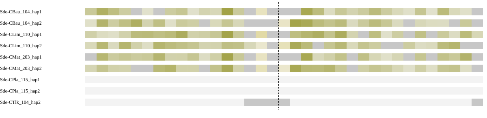

Different chromosomes means the assessed sides map to separate chromosomes in the peer, not that the peer has a fusion. Haplotypes are grouped by individual in the summary. Absence of an expected homologous match can be evidence when sequence availability and assay sensitivity are established. Failure of a qualifying alignment filter alone does not establish biological absence; the coverage and limitation columns show what was measured.

### Local sequence and contact support

| Assay | Measurement |
| --- | --- |
| Qualified immediate HiFi spanning molecules | 0 |
| Qualified HiFi flank molecules left/right | 1 / 1 |
| HiFi informative | False |
| Graph context | screened_primary_contig_paths |

Zero spanning reads must be interpreted with flank coverage, ambiguity and interval width. Graph connectivity alone does not establish a correct join.

| HiFi offset kb | Left molecules | Right molecules | Spanning molecules | Median depth left/right | Flanks observable |
| --- | --- | --- | --- | --- | --- |
| 100 | 1 | 10 | 0 | 3.0 / 17.0 | False |
| 250 | 7 | 3 | 0 | 12.0 / 10.0 | False |
| 500 | 0 | 1 | 0 | 6.0 / 7.0 | False |

Observable distant flanks show reads are available on each side; no spanning reads across a long interval do not by themselves test the exact seam.

| Library | Offset kb | Cross pairs | Within left/right | Sequence/gap controls | Informative |
| --- | --- | --- | --- | --- | --- |
| Ex2 | 100 | 56 | 3201 / 5418 | 0 / 0 | False |
| Ex3 | 100 | 82 | 2141 / 4651 | 0 / 0 | False |
| Ex2 | 250 | 58 | 7419 / 7802 | 2 / 1 | False |
| Ex3 | 250 | 115 | 6451 / 6740 | 2 / 1 | False |
| Ex2 | 500 | 31 | 8634 / 7173 | 4 / 0 | False |
| Ex3 | 500 | 83 | 7589 / 6410 | 4 / 0 | False |

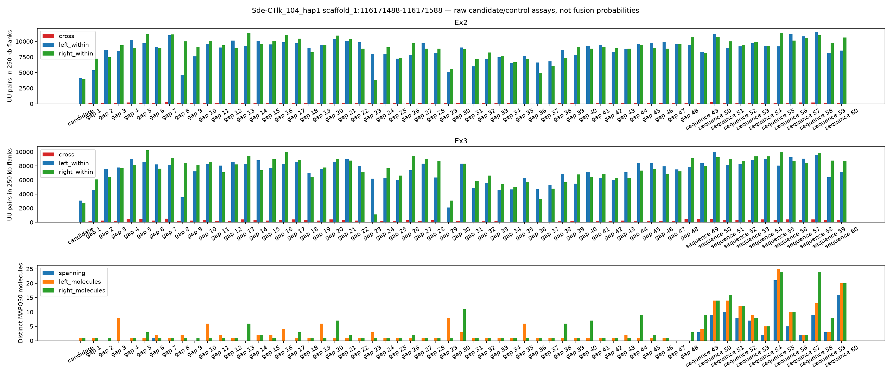

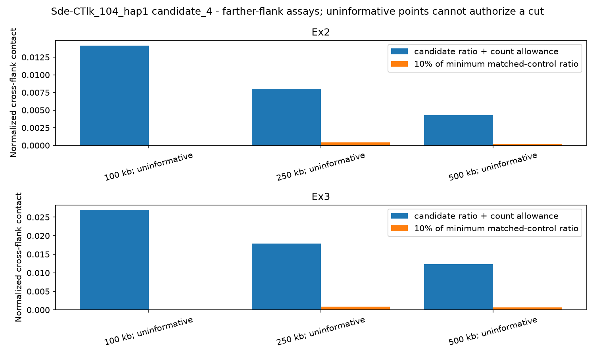

[IGV session: original coordinates](sequence-context/Sde-CTlk_104_hap1.sequence_context/candidate_4.igv.xml)

Scaffolding Hi-C is corroboration, not independent validation. Small control populations and poor observability limit conclusions from weak support.

**Decision needed:** review supporting, opposing and missing evidence before selecting an exact cut. Leave retained or unresolved rows at NO and record reviewer and rationale.

<details><summary>Full candidate measurements</summary>

```json
{
  "assessment_sha256": "1fd4707ae4958ce31f7e95b5732e01d70686755c6a62a414b080fac24e4fd96a",
  "coordinate_stage": "pre_finishing",
  "packet_interval_id": "candidate_4",
  "verified_gap": true,
  "assessment_scaffold_length": 138446979,
  "gap_start": 116171488,
  "gap_end": 116171588,
  "cut_bp": 116171588,
  "hifi_spanning_molecules": 0,
  "graph_status": "screened_primary_contig_paths",
  "graph_contradiction": false,
  "native_continuity": false,
  "direct_native_link": false,
  "native_left": "h1tg002235l",
  "native_right": "h1tg001566l",
  "native_graph_sha256": "9b5ccab05303dc95c5d525f6ae565d219b4417d92b8046f0ecc6e5fb203ce355",
  "interpretation": "Primary path continuity alone is not read support or biological fusion confirmation; unmeasured unitig paths remain a limitation.",
  "chromosome_blocks": {
    "localized": false,
    "independent_individuals": [],
    "chromosome_pair": null,
    "contradictory_pairs": false,
    "peer_assays": [
      {
        "peer": "Sde-CBau_104_hap1",
        "sample": "Sde-CBau_104",
        "auto_evidence": true,
        "chromosome_pair": null,
        "qualified": false,
        "unique_gap_localization": false,
        "trials": [
          {
            "offset_bp": 100000,
            "left_chrom": null,
            "right_chrom": null,
            "left_target": null,
            "right_target": null,
            "usable": false,
            "left_edge": 116071488,
            "right_edge": 116271588
          },
          {
            "offset_bp": 250000,
            "left_chrom": null,
            "right_chrom": null,
            "left_target": null,
            "right_target": null,
            "usable": false,
            "left_edge": 115921488,
            "right_edge": 116421588
          },
          {
            "offset_bp": 500000,
            "left_chrom": null,
            "right_chrom": null,
            "left_target": null,
            "right_target": null,
            "usable": false,
            "left_edge": 115671488,
            "right_edge": 116671588
          }
        ]
      },
      {
        "peer": "Sde-CBau_104_hap2",
        "sample": "Sde-CBau_104",
        "auto_evidence": true,
        "chromosome_pair": null,
        "qualified": false,
        "unique_gap_localization": false,
        "trials": [
          {
            "offset_bp": 100000,
            "left_chrom": null,
            "right_chrom": null,
            "left_target": null,
            "right_target": null,
            "usable": false,
            "left_edge": 116071488,
            "right_edge": 116271588
          },
          {
            "offset_bp": 250000,
            "left_chrom": null,
            "right_chrom": null,
            "left_target": null,
            "right_target": null,
            "usable": false,
            "left_edge": 115921488,
            "right_edge": 116421588
          },
          {
            "offset_bp": 500000,
            "left_chrom": null,
            "right_chrom": null,
            "left_target": null,
            "right_target": null,
            "usable": false,
            "left_edge": 115671488,
            "right_edge": 116671588
          }
        ]
      },
      {
        "peer": "Sde-CLim_110_hap1",
        "sample": "Sde-CLim_110",
        "auto_evidence": true,
        "chromosome_pair": null,
        "qualified": false,
        "unique_gap_localization": false,
        "trials": [
          {
            "offset_bp": 100000,
            "left_chrom": null,
            "right_chrom": null,
            "left_target": null,
            "right_target": null,
            "usable": false,
            "left_edge": 116071488,
            "right_edge": 116271588
          },
          {
            "offset_bp": 250000,
            "left_chrom": null,
            "right_chrom": null,
            "left_target": null,
            "right_target": null,
            "usable": false,
            "left_edge": 115921488,
            "right_edge": 116421588
          },
          {
            "offset_bp": 500000,
            "left_chrom": null,
            "right_chrom": null,
            "left_target": null,
            "right_target": null,
            "usable": false,
            "left_edge": 115671488,
            "right_edge": 116671588
          }
        ]
      },
      {
        "peer": "Sde-CLim_110_hap2",
        "sample": "Sde-CLim_110",
        "auto_evidence": true,
        "chromosome_pair": null,
        "qualified": false,
        "unique_gap_localization": false,
        "trials": [
          {
            "offset_bp": 100000,
            "left_chrom": null,
            "right_chrom": null,
            "left_target": null,
            "right_target": null,
            "usable": false,
            "left_edge": 116071488,
            "right_edge": 116271588
          },
          {
            "offset_bp": 250000,
            "left_chrom": null,
            "right_chrom": null,
            "left_target": null,
            "right_target": null,
            "usable": false,
            "left_edge": 115921488,
            "right_edge": 116421588
          },
          {
            "offset_bp": 500000,
            "left_chrom": null,
            "right_chrom": null,
            "left_target": null,
            "right_target": null,
            "usable": false,
            "left_edge": 115671488,
            "right_edge": 116671588
          }
        ]
      },
      {
        "peer": "Sde-CMat_203_hap1",
        "sample": "Sde-CMat_203",
        "auto_evidence": true,
        "chromosome_pair": null,
        "qualified": false,
        "unique_gap_localization": false,
        "trials": [
          {
            "offset_bp": 100000,
            "left_chrom": null,
            "right_chrom": null,
            "left_target": null,
            "right_target": null,
            "usable": false,
            "left_edge": 116071488,
            "right_edge": 116271588
          },
          {
            "offset_bp": 250000,
            "left_chrom": null,
            "right_chrom": null,
            "left_target": null,
            "right_target": null,
            "usable": false,
            "left_edge": 115921488,
            "right_edge": 116421588
          },
          {
            "offset_bp": 500000,
            "left_chrom": null,
            "right_chrom": null,
            "left_target": null,
            "right_target": null,
            "usable": false,
            "left_edge": 115671488,
            "right_edge": 116671588
          }
        ]
      },
      {
        "peer": "Sde-CMat_203_hap2",
        "sample": "Sde-CMat_203",
        "auto_evidence": true,
        "chromosome_pair": null,
        "qualified": false,
        "unique_gap_localization": false,
        "trials": [
          {
            "offset_bp": 100000,
            "left_chrom": null,
            "right_chrom": null,
            "left_target": null,
            "right_target": null,
            "usable": false,
            "left_edge": 116071488,
            "right_edge": 116271588
          },
          {
            "offset_bp": 250000,
            "left_chrom": null,
            "right_chrom": null,
            "left_target": null,
            "right_target": null,
            "usable": false,
            "left_edge": 115921488,
            "right_edge": 116421588
          },
          {
            "offset_bp": 500000,
            "left_chrom": null,
            "right_chrom": null,
            "left_target": null,
            "right_target": null,
            "usable": false,
            "left_edge": 115671488,
            "right_edge": 116671588
          }
        ]
      },
      {
        "peer": "Sde-CPla_115_hap1",
        "sample": "Sde-CPla_115",
        "auto_evidence": false,
        "chromosome_pair": null,
        "qualified": false,
        "unique_gap_localization": false,
        "trials": [
          {
            "offset_bp": 100000,
            "left_chrom": null,
            "right_chrom": null,
            "left_target": null,
            "right_target": null,
            "usable": false,
            "left_edge": 116071488,
            "right_edge": 116271588
          },
          {
            "offset_bp": 250000,
            "left_chrom": null,
            "right_chrom": null,
            "left_target": null,
            "right_target": null,
            "usable": false,
            "left_edge": 115921488,
            "right_edge": 116421588
          },
          {
            "offset_bp": 500000,
            "left_chrom": null,
            "right_chrom": null,
            "left_target": null,
            "right_target": null,
            "usable": false,
            "left_edge": 115671488,
            "right_edge": 116671588
          }
        ]
      },
      {
        "peer": "Sde-CPla_115_hap2",
        "sample": "Sde-CPla_115",
        "auto_evidence": false,
        "chromosome_pair": null,
        "qualified": false,
        "unique_gap_localization": false,
        "trials": [
          {
            "offset_bp": 100000,
            "left_chrom": null,
            "right_chrom": null,
            "left_target": null,
            "right_target": null,
            "usable": false,
            "left_edge": 116071488,
            "right_edge": 116271588
          },
          {
            "offset_bp": 250000,
            "left_chrom": null,
            "right_chrom": null,
            "left_target": null,
            "right_target": null,
            "usable": false,
            "left_edge": 115921488,
            "right_edge": 116421588
          },
          {
            "offset_bp": 500000,
            "left_chrom": null,
            "right_chrom": null,
            "left_target": null,
            "right_target": null,
            "usable": false,
            "left_edge": 115671488,
            "right_edge": 116671588
          }
        ]
      },
      {
        "peer": "Sde-CTlk_104_hap2",
        "sample": "Sde-CTlk_104",
        "auto_evidence": true,
        "chromosome_pair": null,
        "qualified": false,
        "unique_gap_localization": false,
        "trials": [
          {
            "offset_bp": 100000,
            "left_chrom": null,
            "right_chrom": null,
            "left_target": null,
            "right_target": "scaffold_5",
            "usable": false,
            "left_edge": 116071488,
            "right_edge": 116271588
          },
          {
            "offset_bp": 250000,
            "left_chrom": null,
            "right_chrom": null,
            "left_target": null,
            "right_target": null,
            "usable": false,
            "left_edge": 115921488,
            "right_edge": 116421588
          },
          {
            "offset_bp": 500000,
            "left_chrom": null,
            "right_chrom": null,
            "left_target": null,
            "right_target": null,
            "usable": false,
            "left_edge": 115671488,
            "right_edge": 116671588
          }
        ]
      }
    ]
  },
  "farther_contact_evidence": {
    "supported_offsets": [],
    "pass_all": false,
    "contradictory_informative_trial": false,
    "trials": [
      {
        "offset_bp": 100000,
        "library": "Ex2",
        "informative": false,
        "control_populations": {
          "continuous_control": 0,
          "gap_control": 0
        },
        "matched_control_ids": [],
        "minimum_control_ratio": 0,
        "upper_count_allowance_ratio": 0.014167384287682178,
        "support_loss": false,
        "raw_counts": {
          "right_ends": 30569,
          "left_ends": 19576,
          "left_within": 3201,
          "cross": 56,
          "right_within": 5418
        }
      },
      {
        "offset_bp": 100000,
        "library": "Ex3",
        "informative": false,
        "control_populations": {
          "continuous_control": 0,
          "gap_control": 0
        },
        "matched_control_ids": [],
        "minimum_control_ratio": 0,
        "upper_count_allowance_ratio": 0.026936267871954054,
        "support_loss": false,
        "raw_counts": {
          "right_ends": 18196,
          "left_ends": 9268,
          "left_within": 2141,
          "cross": 82,
          "right_within": 4651
        }
      },
      {
        "offset_bp": 250000,
        "library": "Ex2",
        "informative": false,
        "control_populations": {
          "continuous_control": 2,
          "gap_control": 1
        },
        "matched_control_ids": [
          "control_18326e94c47c77349225",
          "continuous_fa45919372ff1e082178",
          "continuous_7389ba58d31d607b82cd"
        ],
        "minimum_control_ratio": 0.004218842492131582,
        "upper_count_allowance_ratio": 0.008017780757258602,
        "support_loss": false,
        "raw_counts": {
          "right_ends": 42090,
          "left_ends": 41211,
          "left_within": 7419,
          "cross": 58,
          "right_within": 7802
        }
      },
      {
        "offset_bp": 250000,
        "library": "Ex3",
        "informative": false,
        "control_populations": {
          "continuous_control": 2,
          "gap_control": 1
        },
        "matched_control_ids": [
          "control_18326e94c47c77349225",
          "continuous_fa45919372ff1e082178",
          "continuous_7389ba58d31d607b82cd"
        ],
        "minimum_control_ratio": 0.0089362455797999,
        "upper_count_allowance_ratio": 0.01789528165180963,
        "support_loss": false,
        "raw_counts": {
          "right_ends": 26006,
          "left_ends": 25057,
          "cross": 115,
          "left_within": 6451,
          "right_within": 6740
        }
      },
      {
        "offset_bp": 500000,
        "library": "Ex2",
        "informative": false,
        "control_populations": {
          "continuous_control": 4,
          "gap_control": 0
        },
        "matched_control_ids": [
          "continuous_2f74d1f591dfc7e637ba",
          "continuous_8a767de411d1390f7597",
          "continuous_05504a31bd9d7f247a00",
          "continuous_47d46ab35fbfc9adc31f"
        ],
        "minimum_control_ratio": 0.0022717845927510685,
        "upper_count_allowance_ratio": 0.004320385297337395,
        "support_loss": false,
        "raw_counts": {
          "right_ends": 39424,
          "left_ends": 46840,
          "left_within": 8634,
          "cross": 31,
          "right_within": 7173
        }
      },
      {
        "offset_bp": 500000,
        "library": "Ex3",
        "informative": false,
        "control_populations": {
          "continuous_control": 4,
          "gap_control": 0
        },
        "matched_control_ids": [
          "continuous_2f74d1f591dfc7e637ba",
          "continuous_8a767de411d1390f7597",
          "continuous_05504a31bd9d7f247a00",
          "continuous_47d46ab35fbfc9adc31f"
        ],
        "minimum_control_ratio": 0.007081390023972112,
        "upper_count_allowance_ratio": 0.012330399848656148,
        "support_loss": false,
        "raw_counts": {
          "left_ends": 29510,
          "right_ends": 24892,
          "left_within": 7589,
          "cross": 83,
          "right_within": 6410
        }
      }
    ]
  },
  "farther_hifi": {
    "100000": {
      "informative": false,
      "raw": {
        "left_molecules": 1,
        "right_molecules": 10,
        "spanning": 0,
        "left_median_depth": 3.0,
        "right_median_depth": 17.0,
        "left_covered_fraction": 0.0,
        "right_covered_fraction": 1.0
      }
    },
    "250000": {
      "informative": false,
      "raw": {
        "left_molecules": 7,
        "right_molecules": 3,
        "spanning": 0,
        "left_median_depth": 12.0,
        "right_median_depth": 10.0,
        "left_covered_fraction": 1.0,
        "right_covered_fraction": 1.0
      }
    },
    "500000": {
      "informative": false,
      "raw": {
        "left_molecules": 0,
        "right_molecules": 1,
        "spanning": 0,
        "left_median_depth": 6.0,
        "right_median_depth": 7.0,
        "left_covered_fraction": 0.707,
        "right_covered_fraction": 0.998
      }
    }
  },
  "haplotype_block_conflict": false,
  "repeat_obscured_localization": false,
  "control_qualification": [
    {
      "id": "control_a5323ea9a74b5dc5066d",
      "population": "gap_control",
      "qualified": false,
      "reasons": [
        "fewer_than_three_independent_continuous_peers"
      ]
    },
    {
      "id": "control_338eca06b1d0c084f1ff",
      "population": "gap_control",
      "qualified": false,
      "reasons": [
        "fewer_than_three_independent_continuous_peers"
      ]
    },
    {
      "id": "control_9b39e52dc8bb9983630c",
      "population": "gap_control",
      "qualified": false,
      "reasons": [
        "fewer_than_three_independent_continuous_peers"
      ]
    },
    {
      "id": "control_6b64501387d064397809",
      "population": "gap_control",
      "qualified": false,
      "reasons": [
        "fewer_than_three_independent_continuous_peers"
      ]
    },
    {
      "id": "control_18326e94c47c77349225",
      "population": "gap_control",
      "qualified": true,
      "reasons": []
    },
    {
      "id": "control_c7a588bbbcd13360e031",
      "population": "gap_control",
      "qualified": false,
      "reasons": [
        "fewer_than_three_independent_continuous_peers"
      ]
    },
    {
      "id": "control_4e35aa8aae82ad3f82ce",
      "population": "gap_control",
      "qualified": false,
      "reasons": [
        "fewer_than_three_independent_continuous_peers"
      ]
    },
    {
      "id": "control_c019bfe9b45aaeb19ce1",
      "population": "gap_control",
      "qualified": false,
      "reasons": [
        "fewer_than_three_independent_continuous_peers"
      ]
    },
    {
      "id": "control_4387319a110f4604efea",
      "population": "gap_control",
      "qualified": false,
      "reasons": [
        "fewer_than_three_independent_continuous_peers"
      ]
    },
    {
      "id": "control_ea6b43831e17ea702d3c",
      "population": "gap_control",
      "qualified": false,
      "reasons": [
        "fewer_than_three_independent_continuous_peers"
      ]
    },
    {
      "id": "control_ee517b485c7f0d77b1ad",
      "population": "gap_control",
      "qualified": false,
      "reasons": [
        "fewer_than_three_independent_continuous_peers"
      ]
    },
    {
      "id": "control_81a3326eb0a6337f3955",
      "population": "gap_control",
      "qualified": false,
      "reasons": [
        "fewer_than_three_independent_continuous_peers"
      ]
    },
    {
      "id": "control_a480a38b2580798ef439",
      "population": "gap_control",
      "qualified": false,
      "reasons": [
        "fewer_than_three_independent_continuous_peers"
      ]
    },
    {
      "id": "control_2d692b9696079b0c1013",
      "population": "gap_control",
      "qualified": false,
      "reasons": [
        "fewer_than_three_independent_continuous_peers"
      ]
    },
    {
      "id": "control_d2ac5db9f909b8b46166",
      "population": "gap_control",
      "qualified": false,
      "reasons": [
        "fewer_than_three_independent_continuous_peers"
      ]
    },
    {
      "id": "control_13ec29cf570933f9bc4a",
      "population": "gap_control",
      "qualified": false,
      "reasons": [
        "fewer_than_three_independent_continuous_peers"
      ]
    },
    {
      "id": "control_854d9b7143ba711e97d3",
      "population": "gap_control",
      "qualified": false,
      "reasons": [
        "fewer_than_three_independent_continuous_peers"
      ]
    },
    {
      "id": "control_2d204e71eb8421dc639a",
      "population": "gap_control",
      "qualified": false,
      "reasons": [
        "fewer_than_three_independent_continuous_peers"
      ]
    },
    {
      "id": "control_1cbad407caea6077629a",
      "population": "gap_control",
      "qualified": false,
      "reasons": [
        "fewer_than_three_independent_continuous_peers"
      ]
    },
    {
      "id": "control_fe53b991e3e8f28e29a6",
      "population": "gap_control",
      "qualified": false,
      "reasons": [
        "fewer_than_three_independent_continuous_peers"
      ]
    },
    {
      "id": "control_9f2d65ff33b8d3929fe0",
      "population": "gap_control",
      "qualified": false,
      "reasons": [
        "fewer_than_three_independent_continuous_peers"
      ]
    },
    {
      "id": "control_423d31e9f73e6319505f",
      "population": "gap_control",
      "qualified": false,
      "reasons": [
        "fewer_than_three_independent_continuous_peers"
      ]
    },
    {
      "id": "control_20941f46666c1199889d",
      "population": "gap_control",
      "qualified": false,
      "reasons": [
        "fewer_than_three_independent_continuous_peers"
      ]
    },
    {
      "id": "control_82a6ec11ff594baab2c2",
      "population": "gap_control",
      "qualified": false,
      "reasons": [
        "fewer_than_three_independent_continuous_peers"
      ]
    },
    {
      "id": "control_b5fb0487ecdf76b3a7b1",
      "population": "gap_control",
      "qualified": false,
      "reasons": [
        "fewer_than_three_independent_continuous_peers"
      ]
    },
    {
      "id": "control_a59d15188fe973245928",
      "population": "gap_control",
      "qualified": false,
      "reasons": [
        "fewer_than_three_independent_continuous_peers"
      ]
    },
    {
      "id": "control_214e691a86c63c308fac",
      "population": "gap_control",
      "qualified": false,
      "reasons": [
        "fewer_than_three_independent_continuous_peers"
      ]
    },
    {
      "id": "control_109a525a7f732a95fb64",
      "population": "gap_control",
      "qualified": false,
      "reasons": [
        "fewer_than_three_independent_continuous_peers"
      ]
    },
    {
      "id": "control_052334d35bc518defd23",
      "population": "gap_control",
      "qualified": false,
      "reasons": [
        "fewer_than_three_independent_continuous_peers"
      ]
    },
    {
      "id": "control_a014bc9fe9fa18f50e6e",
      "population": "gap_control",
      "qualified": false,
      "reasons": [
        "fewer_than_three_independent_continuous_peers"
      ]
    },
    {
      "id": "control_c12f052116c64fb38745",
      "population": "gap_control",
      "qualified": false,
      "reasons": [
        "fewer_than_three_independent_continuous_peers"
      ]
    },
    {
      "id": "control_cc2e7b3e346eb598cf96",
      "population": "gap_control",
      "qualified": false,
      "reasons": [
        "fewer_than_three_independent_continuous_peers"
      ]
    },
    {
      "id": "control_5b2b73fa3e8c8c92f365",
      "population": "gap_control",
      "qualified": false,
      "reasons": [
        "fewer_than_three_independent_continuous_peers"
      ]
    },
    {
      "id": "control_fd41118be3f75fdf096d",
      "population": "gap_control",
      "qualified": false,
      "reasons": [
        "fewer_than_three_independent_continuous_peers"
      ]
    },
    {
      "id": "control_79e202122f0a9f6998ba",
      "population": "gap_control",
      "qualified": false,
      "reasons": [
        "fewer_than_three_independent_continuous_peers"
      ]
    },
    {
      "id": "control_c5b20ec6d9e610766621",
      "population": "gap_control",
      "qualified": false,
      "reasons": [
        "fewer_than_three_independent_continuous_peers"
      ]
    },
    {
      "id": "control_6d3a69e084d8b86c86d1",
      "population": "gap_control",
      "qualified": false,
      "reasons": [
        "fewer_than_three_independent_continuous_peers"
      ]
    },
    {
      "id": "control_ffc374ecfe1c3c948c1f",
      "population": "gap_control",
      "qualified": false,
      "reasons": [
        "fewer_than_three_independent_continuous_peers"
      ]
    },
    {
      "id": "control_2717a51d8a79f804cb8d",
      "population": "gap_control",
      "qualified": false,
      "reasons": [
        "fewer_than_three_independent_continuous_peers"
      ]
    },
    {
      "id": "control_0c3defd314802c20a0ef",
      "population": "gap_control",
      "qualified": false,
      "reasons": [
        "fewer_than_three_independent_continuous_peers"
      ]
    },
    {
      "id": "control_685ca03f4dafa4a61938",
      "population": "gap_control",
      "qualified": false,
      "reasons": [
        "fewer_than_three_independent_continuous_peers"
      ]
    },
    {
      "id": "control_f45e5b2dfda35da64adf",
      "population": "gap_control",
      "qualified": false,
      "reasons": [
        "fewer_than_three_independent_continuous_peers"
      ]
    },
    {
      "id": "control_9444ce1226c9b1a1ee1c",
      "population": "gap_control",
      "qualified": false,
      "reasons": [
        "fewer_than_three_independent_continuous_peers"
      ]
    },
    {
      "id": "control_ab4dabd56aa7886691c4",
      "population": "gap_control",
      "qualified": false,
      "reasons": [
        "fewer_than_three_independent_continuous_peers"
      ]
    },
    {
      "id": "control_6453a8697e57b418b47c",
      "population": "gap_control",
      "qualified": false,
      "reasons": [
        "fewer_than_three_independent_continuous_peers"
      ]
    },
    {
      "id": "control_349e2fa2ebeee7fcd536",
      "population": "gap_control",
      "qualified": false,
      "reasons": [
        "fewer_than_three_independent_continuous_peers"
      ]
    },
    {
      "id": "control_2575ce2cce7c3727bc8f",
      "population": "gap_control",
      "qualified": false,
      "reasons": [
        "fewer_than_three_independent_continuous_peers"
      ]
    },
    {
      "id": "control_6bec13c2f9caa589fc10",
      "population": "gap_control",
      "qualified": false,
      "reasons": [
        "fewer_than_three_independent_continuous_peers"
      ]
    },
    {
      "id": "continuous_2f74d1f591dfc7e637ba",
      "population": "continuous_control",
      "qualified": false,
      "reasons": [
        "uninformative_hifi_flanks"
      ]
    },
    {
      "id": "continuous_3eec3fefc1dc42343168",
      "population": "continuous_control",
      "qualified": true,
      "reasons": []
    },
    {
      "id": "continuous_8a767de411d1390f7597",
      "population": "continuous_control",
      "qualified": true,
      "reasons": []
    },
    {
      "id": "continuous_f492b20f69ab1e4448f3",
      "population": "continuous_control",
      "qualified": true,
      "reasons": []
    },
    {
      "id": "continuous_a5c2e93260d7b6d05fbf",
      "population": "continuous_control",
      "qualified": false,
      "reasons": [
        "uninformative_hifi_flanks"
      ]
    },
    {
      "id": "continuous_fa45919372ff1e082178",
      "population": "continuous_control",
      "qualified": false,
      "reasons": [
        "uninformative_hifi_flanks"
      ]
    },
    {
      "id": "continuous_2079d6f8d9fa515198ec",
      "population": "continuous_control",
      "qualified": true,
      "reasons": []
    },
    {
      "id": "continuous_7389ba58d31d607b82cd",
      "population": "continuous_control",
      "qualified": true,
      "reasons": []
    },
    {
      "id": "continuous_05504a31bd9d7f247a00",
      "population": "continuous_control",
      "qualified": false,
      "reasons": [
        "uninformative_hifi_flanks"
      ]
    },
    {
      "id": "continuous_44efc9432652e72dc649",
      "population": "continuous_control",
      "qualified": true,
      "reasons": []
    },
    {
      "id": "continuous_47d46ab35fbfc9adc31f",
      "population": "continuous_control",
      "qualified": false,
      "reasons": [
        "uninformative_hifi_flanks"
      ]
    },
    {
      "id": "continuous_779722eda9dc566cd379",
      "population": "continuous_control",
      "qualified": true,
      "reasons": []
    }
  ],
  "hifi_informative": false,
  "matched_controls_pass": false,
  "hic_informative": false,
  "hic_support_loss": false,
  "libraries": [
    {
      "library": "Ex2",
      "matched_controls": 0,
      "control_populations": {
        "continuous_control": 0,
        "gap_control": 0
      },
      "informative": false,
      "ratio": 0.0034884684136184327,
      "upper_count_allowance_ratio": 0.004235997359393811,
      "minimum_control_ratio": 0,
      "support_loss": false,
      "raw_counts": {
        "left_ends": 25110,
        "right_ends": 23120,
        "left_within": 4093,
        "cross": 14,
        "right_within": 3935
      }
    },
    {
      "library": "Ex3",
      "matched_controls": 0,
      "control_populations": {
        "continuous_control": 0,
        "gap_control": 0
      },
      "informative": false,
      "ratio": 0.022096695747028782,
      "upper_count_allowance_ratio": 0.023132478360170756,
      "minimum_control_ratio": 0,
      "support_loss": false,
      "raw_counts": {
        "right_ends": 11271,
        "left_ends": 12604,
        "left_within": 3065,
        "cross": 64,
        "right_within": 2737
      }
    }
  ],
  "independent_discordant_individuals": 0,
  "alternative_placements_checked": true,
  "control_ids": [
    "control_a5323ea9a74b5dc5066d",
    "control_338eca06b1d0c084f1ff",
    "control_9b39e52dc8bb9983630c",
    "control_6b64501387d064397809",
    "control_18326e94c47c77349225",
    "control_c7a588bbbcd13360e031",
    "control_4e35aa8aae82ad3f82ce",
    "control_c019bfe9b45aaeb19ce1",
    "control_4387319a110f4604efea",
    "control_ea6b43831e17ea702d3c",
    "control_ee517b485c7f0d77b1ad",
    "control_81a3326eb0a6337f3955",
    "control_a480a38b2580798ef439",
    "control_2d692b9696079b0c1013",
    "control_d2ac5db9f909b8b46166",
    "control_13ec29cf570933f9bc4a",
    "control_854d9b7143ba711e97d3",
    "control_2d204e71eb8421dc639a",
    "control_1cbad407caea6077629a",
    "control_fe53b991e3e8f28e29a6",
    "control_9f2d65ff33b8d3929fe0",
    "control_423d31e9f73e6319505f",
    "control_20941f46666c1199889d",
    "control_82a6ec11ff594baab2c2",
    "control_b5fb0487ecdf76b3a7b1",
    "control_a59d15188fe973245928",
    "control_214e691a86c63c308fac",
    "control_109a525a7f732a95fb64",
    "control_052334d35bc518defd23",
    "control_a014bc9fe9fa18f50e6e",
    "control_c12f052116c64fb38745",
    "control_cc2e7b3e346eb598cf96",
    "control_5b2b73fa3e8c8c92f365",
    "control_fd41118be3f75fdf096d",
    "control_79e202122f0a9f6998ba",
    "control_c5b20ec6d9e610766621",
    "control_6d3a69e084d8b86c86d1",
    "control_ffc374ecfe1c3c948c1f",
    "control_2717a51d8a79f804cb8d",
    "control_0c3defd314802c20a0ef",
    "control_685ca03f4dafa4a61938",
    "control_f45e5b2dfda35da64adf",
    "control_9444ce1226c9b1a1ee1c",
    "control_ab4dabd56aa7886691c4",
    "control_6453a8697e57b418b47c",
    "control_349e2fa2ebeee7fcd536",
    "control_2575ce2cce7c3727bc8f",
    "control_6bec13c2f9caa589fc10",
    "continuous_2f74d1f591dfc7e637ba",
    "continuous_3eec3fefc1dc42343168",
    "continuous_8a767de411d1390f7597",
    "continuous_f492b20f69ab1e4448f3",
    "continuous_a5c2e93260d7b6d05fbf",
    "continuous_fa45919372ff1e082178",
    "continuous_2079d6f8d9fa515198ec",
    "continuous_7389ba58d31d607b82cd",
    "continuous_05504a31bd9d7f247a00",
    "continuous_44efc9432652e72dc649",
    "continuous_47d46ab35fbfc9adc31f",
    "continuous_779722eda9dc566cd379"
  ],
  "hifi_raw": {
    "left_molecules": 1,
    "right_molecules": 1,
    "spanning": 0,
    "left_median_depth": 2.0,
    "right_median_depth": 3.0,
    "left_covered_fraction": 0.0,
    "right_covered_fraction": 0.0
  },
  "alternative_placement_scope": "Assessment BAM MAPQ and competing peer anchors; bounded emitted alternatives, no proof of haplotype-specific uniqueness",
  "chromosome_tracks": [
    {
      "peer": "Sde-CBau_104_hap1",
      "sample": "Sde-CBau_104",
      "auto_evidence": true,
      "relationship": "same_chromosome",
      "bins": [
        {
          "lo": 0,
          "hi": 50000,
          "aligned_bp": 23514,
          "ambiguous_bp": 0,
          "dominance": 1.0,
          "chrom": "chr12",
          "counts": {
            "chr12": 23514,
            "chr4": 0,
            "chr13": 0,
            "chr5": 0,
            "chr2": 0
          }
        },
        {
          "lo": 50000,
          "hi": 100000,
          "aligned_bp": 37366,
          "ambiguous_bp": 0,
          "dominance": 1.0,
          "chrom": "chr12",
          "counts": {
            "chr12": 37366,
            "chr4": 0,
            "chr13": 0,
            "chr5": 0,
            "chr2": 0
          }
        },
        {
          "lo": 100000,
          "hi": 150000,
          "aligned_bp": 29579,
          "ambiguous_bp": 0,
          "dominance": 1.0,
          "chrom": "chr12",
          "counts": {
            "chr12": 29579,
            "chr4": 0,
            "chr13": 0,
            "chr5": 0,
            "chr2": 0
          }
        },
        {
          "lo": 150000,
          "hi": 200000,
          "aligned_bp": 20920,
          "ambiguous_bp": 0,
          "dominance": 1.0,
          "chrom": "chr12",
          "counts": {
            "chr12": 20920,
            "chr4": 0,
            "chr13": 0,
            "chr5": 0,
            "chr2": 0
          }
        },
        {
          "lo": 200000,
          "hi": 250000,
          "aligned_bp": 9702,
          "ambiguous_bp": 0,
          "dominance": 1.0,
          "chrom": null,
          "counts": {
            "chr12": 9702,
            "chr4": 0,
            "chr13": 0,
            "chr5": 0,
            "chr2": 0
          }
        },
        {
          "lo": 250000,
          "hi": 300000,
          "aligned_bp": 10008,
          "ambiguous_bp": 0,
          "dominance": 1.0,
          "chrom": "chr12",
          "counts": {
            "chr12": 10008,
            "chr4": 0,
            "chr13": 0,
            "chr5": 0,
            "chr2": 0
          }
        },
        {
          "lo": 300000,
          "hi": 350000,
          "aligned_bp": 6984,
          "ambiguous_bp": 0,
          "dominance": 1.0,
          "chrom": null,
          "counts": {
            "chr12": 6984,
            "chr4": 0,
            "chr13": 0,
            "chr5": 0,
            "chr2": 0
          }
        },
        {
          "lo": 350000,
          "hi": 400000,
          "aligned_bp": 21698,
          "ambiguous_bp": 0,
          "dominance": 1.0,
          "chrom": "chr12",
          "counts": {
            "chr12": 21698,
            "chr4": 0,
            "chr13": 0,
            "chr5": 0,
            "chr2": 0
          }
        },
        {
          "lo": 400000,
          "hi": 450000,
          "aligned_bp": 25083,
          "ambiguous_bp": 0,
          "dominance": 1.0,
          "chrom": "chr12",
          "counts": {
            "chr12": 25083,
            "chr4": 0,
            "chr13": 0,
            "chr5": 0,
            "chr2": 0
          }
        },
        {
          "lo": 450000,
          "hi": 500000,
          "aligned_bp": 10510,
          "ambiguous_bp": 0,
          "dominance": 1.0,
          "chrom": "chr12",
          "counts": {
            "chr12": 10510,
            "chr4": 0,
            "chr13": 0,
            "chr5": 0,
            "chr2": 0
          }
        },
        {
          "lo": 500000,
          "hi": 550000,
          "aligned_bp": 17305,
          "ambiguous_bp": 0,
          "dominance": 1.0,
          "chrom": "chr12",
          "counts": {
            "chr12": 17305,
            "chr4": 0,
            "chr13": 0,
            "chr5": 0,
            "chr2": 0
          }
        },
        {
          "lo": 550000,
          "hi": 600000,
          "aligned_bp": 15489,
          "ambiguous_bp": 0,
          "dominance": 1.0,
          "chrom": "chr12",
          "counts": {
            "chr12": 15489,
            "chr4": 0,
            "chr13": 0,
            "chr5": 0,
            "chr2": 0
          }
        },
        {
          "lo": 600000,
          "hi": 650000,
          "aligned_bp": 44821,
          "ambiguous_bp": 0,
          "dominance": 1.0,
          "chrom": "chr12",
          "counts": {
            "chr12": 44821,
            "chr4": 0,
            "chr13": 0,
            "chr5": 0,
            "chr2": 0
          }
        },
        {
          "lo": 650000,
          "hi": 700000,
          "aligned_bp": 22415,
          "ambiguous_bp": 0,
          "dominance": 1.0,
          "chrom": "chr12",
          "counts": {
            "chr12": 22415,
            "chr4": 0,
            "chr13": 0,
            "chr5": 0,
            "chr2": 0
          }
        },
        {
          "lo": 700000,
          "hi": 750000,
          "aligned_bp": 8268,
          "ambiguous_bp": 0,
          "dominance": 0.9700048379293662,
          "chrom": null,
          "counts": {
            "chr12": 8020,
            "chr4": 248,
            "chr13": 0,
            "chr5": 0,
            "chr2": 0
          }
        },
        {
          "lo": 750000,
          "hi": 800000,
          "aligned_bp": 15033,
          "ambiguous_bp": 0,
          "dominance": 1.0,
          "chrom": "chr4",
          "counts": {
            "chr12": 0,
            "chr4": 15033,
            "chr13": 0,
            "chr5": 0,
            "chr2": 0
          }
        },
        {
          "lo": 800000,
          "hi": 850000,
          "aligned_bp": 2129,
          "ambiguous_bp": 0,
          "dominance": 1.0,
          "chrom": null,
          "counts": {
            "chr12": 0,
            "chr4": 2129,
            "chr13": 0,
            "chr5": 0,
            "chr2": 0
          }
        },
        {
          "lo": 850000,
          "hi": 900000,
          "aligned_bp": 7027,
          "ambiguous_bp": 0,
          "dominance": 0.9607229258574072,
          "chrom": null,
          "counts": {
            "chr12": 0,
            "chr4": 6751,
            "chr13": 276,
            "chr5": 0,
            "chr2": 0
          }
        },
        {
          "lo": 900000,
          "hi": 950000,
          "aligned_bp": 7017,
          "ambiguous_bp": 0,
          "dominance": 1.0,
          "chrom": null,
          "counts": {
            "chr12": 7017,
            "chr4": 0,
            "chr13": 0,
            "chr5": 0,
            "chr2": 0
          }
        },
        {
          "lo": 950000,
          "hi": 1000000,
          "aligned_bp": 41586,
          "ambiguous_bp": 0,
          "dominance": 1.0,
          "chrom": "chr12",
          "counts": {
            "chr12": 41586,
            "chr4": 0,
            "chr13": 0,
            "chr5": 0,
            "chr2": 0
          }
        },
        {
          "lo": 1000000,
          "hi": 1050000,
          "aligned_bp": 30670,
          "ambiguous_bp": 0,
          "dominance": 1.0,
          "chrom": "chr12",
          "counts": {
            "chr12": 30670,
            "chr4": 0,
            "chr13": 0,
            "chr5": 0,
            "chr2": 0
          }
        },
        {
          "lo": 1050000,
          "hi": 1100000,
          "aligned_bp": 13168,
          "ambiguous_bp": 0,
          "dominance": 1.0,
          "chrom": "chr12",
          "counts": {
            "chr12": 13168,
            "chr4": 0,
            "chr13": 0,
            "chr5": 0,
            "chr2": 0
          }
        },
        {
          "lo": 1100000,
          "hi": 1150000,
          "aligned_bp": 23840,
          "ambiguous_bp": 0,
          "dominance": 1.0,
          "chrom": "chr12",
          "counts": {
            "chr12": 23840,
            "chr4": 0,
            "chr13": 0,
            "chr5": 0,
            "chr2": 0
          }
        },
        {
          "lo": 1150000,
          "hi": 1200000,
          "aligned_bp": 17454,
          "ambiguous_bp": 0,
          "dominance": 1.0,
          "chrom": "chr12",
          "counts": {
            "chr12": 17454,
            "chr4": 0,
            "chr13": 0,
            "chr5": 0,
            "chr2": 0
          }
        },
        {
          "lo": 1200000,
          "hi": 1250000,
          "aligned_bp": 22064,
          "ambiguous_bp": 0,
          "dominance": 1.0,
          "chrom": "chr12",
          "counts": {
            "chr12": 22064,
            "chr4": 0,
            "chr13": 0,
            "chr5": 0,
            "chr2": 0
          }
        },
        {
          "lo": 1250000,
          "hi": 1300000,
          "aligned_bp": 30984,
          "ambiguous_bp": 0,
          "dominance": 1.0,
          "chrom": "chr12",
          "counts": {
            "chr12": 30984,
            "chr4": 0,
            "chr13": 0,
            "chr5": 0,
            "chr2": 0
          }
        },
        {
          "lo": 1300000,
          "hi": 1350000,
          "aligned_bp": 21672,
          "ambiguous_bp": 0,
          "dominance": 1.0,
          "chrom": "chr12",
          "counts": {
            "chr12": 21672,
            "chr4": 0,
            "chr13": 0,
            "chr5": 0,
            "chr2": 0
          }
        },
        {
          "lo": 1350000,
          "hi": 1400000,
          "aligned_bp": 14825,
          "ambiguous_bp": 0,
          "dominance": 1.0,
          "chrom": "chr12",
          "counts": {
            "chr12": 14825,
            "chr4": 0,
            "chr13": 0,
            "chr5": 0,
            "chr2": 0
          }
        },
        {
          "lo": 1400000,
          "hi": 1450000,
          "aligned_bp": 10963,
          "ambiguous_bp": 0,
          "dominance": 1.0,
          "chrom": "chr12",
          "counts": {
            "chr12": 10963,
            "chr4": 0,
            "chr13": 0,
            "chr5": 0,
            "chr2": 0
          }
        },
        {
          "lo": 1450000,
          "hi": 1500000,
          "aligned_bp": 25317,
          "ambiguous_bp": 0,
          "dominance": 1.0,
          "chrom": "chr12",
          "counts": {
            "chr12": 25317,
            "chr4": 0,
            "chr13": 0,
            "chr5": 0,
            "chr2": 0
          }
        },
        {
          "lo": 1500000,
          "hi": 1550000,
          "aligned_bp": 10132,
          "ambiguous_bp": 0,
          "dominance": 1.0,
          "chrom": "chr12",
          "counts": {
            "chr12": 10132,
            "chr4": 0,
            "chr13": 0,
            "chr5": 0,
            "chr2": 0
          }
        },
        {
          "lo": 1550000,
          "hi": 1600000,
          "aligned_bp": 31488,
          "ambiguous_bp": 10,
          "dominance": 1.0,
          "chrom": "chr12",
          "counts": {
            "chr12": 31488,
            "chr4": 0,
            "chr13": 0,
            "chr5": 0,
            "chr2": 0
          }
        },
        {
          "lo": 1600000,
          "hi": 1650000,
          "aligned_bp": 15116,
          "ambiguous_bp": 0,
          "dominance": 1.0,
          "chrom": "chr12",
          "counts": {
            "chr12": 15116,
            "chr4": 0,
            "chr13": 0,
            "chr5": 0,
            "chr2": 0
          }
        },
        {
          "lo": 1650000,
          "hi": 1700000,
          "aligned_bp": 10883,
          "ambiguous_bp": 0,
          "dominance": 1.0,
          "chrom": "chr12",
          "counts": {
            "chr12": 10883,
            "chr4": 0,
            "chr13": 0,
            "chr5": 0,
            "chr2": 0
          }
        },
        {
          "lo": 1700000,
          "hi": 1749919,
          "aligned_bp": 27134,
          "ambiguous_bp": 0,
          "dominance": 0.6753151028230264,
          "chrom": null,
          "counts": {
            "chr12": 18324,
            "chr4": 0,
            "chr13": 0,
            "chr5": 7214,
            "chr2": 1596
          }
        }
      ],
      "left": {
        "chrom": "chr12",
        "aligned_bp": 320824,
        "coverage": 0.37743156329446753,
        "dominance": 0.9457334862728474,
        "informative_bins": 12,
        "qualified": true
      },
      "right": {
        "chrom": "chr12",
        "aligned_bp": 361340,
        "coverage": 0.401578128472994,
        "dominance": 0.9561714728510544,
        "informative_bins": 15,
        "qualified": true
      }
    },
    {
      "peer": "Sde-CBau_104_hap2",
      "sample": "Sde-CBau_104",
      "auto_evidence": true,
      "relationship": "same_chromosome",
      "bins": [
        {
          "lo": 0,
          "hi": 50000,
          "aligned_bp": 10774,
          "ambiguous_bp": 0,
          "dominance": 1.0,
          "chrom": "chr12",
          "counts": {
            "chr12": 10774,
            "chr4": 0
          }
        },
        {
          "lo": 50000,
          "hi": 100000,
          "aligned_bp": 34855,
          "ambiguous_bp": 0,
          "dominance": 1.0,
          "chrom": "chr12",
          "counts": {
            "chr12": 34855,
            "chr4": 0
          }
        },
        {
          "lo": 100000,
          "hi": 150000,
          "aligned_bp": 20812,
          "ambiguous_bp": 0,
          "dominance": 1.0,
          "chrom": "chr12",
          "counts": {
            "chr12": 20812,
            "chr4": 0
          }
        },
        {
          "lo": 150000,
          "hi": 200000,
          "aligned_bp": 28967,
          "ambiguous_bp": 0,
          "dominance": 1.0,
          "chrom": "chr12",
          "counts": {
            "chr12": 28967,
            "chr4": 0
          }
        },
        {
          "lo": 200000,
          "hi": 250000,
          "aligned_bp": 37978,
          "ambiguous_bp": 0,
          "dominance": 1.0,
          "chrom": "chr12",
          "counts": {
            "chr12": 37978,
            "chr4": 0
          }
        },
        {
          "lo": 250000,
          "hi": 300000,
          "aligned_bp": 17302,
          "ambiguous_bp": 0,
          "dominance": 1.0,
          "chrom": "chr12",
          "counts": {
            "chr12": 17302,
            "chr4": 0
          }
        },
        {
          "lo": 300000,
          "hi": 350000,
          "aligned_bp": 29079,
          "ambiguous_bp": 0,
          "dominance": 1.0,
          "chrom": "chr12",
          "counts": {
            "chr12": 29079,
            "chr4": 0
          }
        },
        {
          "lo": 350000,
          "hi": 400000,
          "aligned_bp": 11595,
          "ambiguous_bp": 0,
          "dominance": 1.0,
          "chrom": "chr12",
          "counts": {
            "chr12": 11595,
            "chr4": 0
          }
        },
        {
          "lo": 400000,
          "hi": 450000,
          "aligned_bp": 22503,
          "ambiguous_bp": 0,
          "dominance": 1.0,
          "chrom": "chr12",
          "counts": {
            "chr12": 22503,
            "chr4": 0
          }
        },
        {
          "lo": 450000,
          "hi": 500000,
          "aligned_bp": 20364,
          "ambiguous_bp": 0,
          "dominance": 1.0,
          "chrom": "chr12",
          "counts": {
            "chr12": 20364,
            "chr4": 0
          }
        },
        {
          "lo": 500000,
          "hi": 550000,
          "aligned_bp": 9399,
          "ambiguous_bp": 0,
          "dominance": 1.0,
          "chrom": null,
          "counts": {
            "chr12": 9399,
            "chr4": 0
          }
        },
        {
          "lo": 550000,
          "hi": 600000,
          "aligned_bp": 14978,
          "ambiguous_bp": 0,
          "dominance": 1.0,
          "chrom": "chr12",
          "counts": {
            "chr12": 14978,
            "chr4": 0
          }
        },
        {
          "lo": 600000,
          "hi": 650000,
          "aligned_bp": 25151,
          "ambiguous_bp": 0,
          "dominance": 1.0,
          "chrom": "chr12",
          "counts": {
            "chr12": 25151,
            "chr4": 0
          }
        },
        {
          "lo": 650000,
          "hi": 700000,
          "aligned_bp": 15586,
          "ambiguous_bp": 0,
          "dominance": 1.0,
          "chrom": "chr12",
          "counts": {
            "chr12": 15586,
            "chr4": 0
          }
        },
        {
          "lo": 700000,
          "hi": 750000,
          "aligned_bp": 19350,
          "ambiguous_bp": 0,
          "dominance": 0.8935400516795866,
          "chrom": null,
          "counts": {
            "chr12": 17290,
            "chr4": 2060
          }
        },
        {
          "lo": 750000,
          "hi": 800000,
          "aligned_bp": 9241,
          "ambiguous_bp": 0,
          "dominance": 1.0,
          "chrom": null,
          "counts": {
            "chr12": 0,
            "chr4": 9241
          }
        },
        {
          "lo": 800000,
          "hi": 850000,
          "aligned_bp": 2323,
          "ambiguous_bp": 0,
          "dominance": 1.0,
          "chrom": null,
          "counts": {
            "chr12": 0,
            "chr4": 2323
          }
        },
        {
          "lo": 850000,
          "hi": 900000,
          "aligned_bp": 13158,
          "ambiguous_bp": 901,
          "dominance": 0.9933880528955769,
          "chrom": "chr4",
          "counts": {
            "chr12": 87,
            "chr4": 13071
          }
        },
        {
          "lo": 900000,
          "hi": 950000,
          "aligned_bp": 43801,
          "ambiguous_bp": 0,
          "dominance": 1.0,
          "chrom": "chr12",
          "counts": {
            "chr12": 43801,
            "chr4": 0
          }
        },
        {
          "lo": 950000,
          "hi": 1000000,
          "aligned_bp": 40952,
          "ambiguous_bp": 0,
          "dominance": 1.0,
          "chrom": "chr12",
          "counts": {
            "chr12": 40952,
            "chr4": 0
          }
        },
        {
          "lo": 1000000,
          "hi": 1050000,
          "aligned_bp": 31104,
          "ambiguous_bp": 0,
          "dominance": 1.0,
          "chrom": "chr12",
          "counts": {
            "chr12": 31104,
            "chr4": 0
          }
        },
        {
          "lo": 1050000,
          "hi": 1100000,
          "aligned_bp": 26545,
          "ambiguous_bp": 0,
          "dominance": 1.0,
          "chrom": "chr12",
          "counts": {
            "chr12": 26545,
            "chr4": 0
          }
        },
        {
          "lo": 1100000,
          "hi": 1150000,
          "aligned_bp": 31005,
          "ambiguous_bp": 0,
          "dominance": 1.0,
          "chrom": "chr12",
          "counts": {
            "chr12": 31005,
            "chr4": 0
          }
        },
        {
          "lo": 1150000,
          "hi": 1200000,
          "aligned_bp": 13319,
          "ambiguous_bp": 8,
          "dominance": 1.0,
          "chrom": "chr12",
          "counts": {
            "chr12": 13319,
            "chr4": 0
          }
        },
        {
          "lo": 1200000,
          "hi": 1250000,
          "aligned_bp": 22499,
          "ambiguous_bp": 0,
          "dominance": 1.0,
          "chrom": "chr12",
          "counts": {
            "chr12": 22499,
            "chr4": 0
          }
        },
        {
          "lo": 1250000,
          "hi": 1300000,
          "aligned_bp": 30974,
          "ambiguous_bp": 0,
          "dominance": 1.0,
          "chrom": "chr12",
          "counts": {
            "chr12": 30974,
            "chr4": 0
          }
        },
        {
          "lo": 1300000,
          "hi": 1350000,
          "aligned_bp": 24605,
          "ambiguous_bp": 0,
          "dominance": 1.0,
          "chrom": "chr12",
          "counts": {
            "chr12": 24605,
            "chr4": 0
          }
        },
        {
          "lo": 1350000,
          "hi": 1400000,
          "aligned_bp": 13655,
          "ambiguous_bp": 0,
          "dominance": 1.0,
          "chrom": "chr12",
          "counts": {
            "chr12": 13655,
            "chr4": 0
          }
        },
        {
          "lo": 1400000,
          "hi": 1450000,
          "aligned_bp": 7384,
          "ambiguous_bp": 0,
          "dominance": 1.0,
          "chrom": null,
          "counts": {
            "chr12": 7384,
            "chr4": 0
          }
        },
        {
          "lo": 1450000,
          "hi": 1500000,
          "aligned_bp": 15674,
          "ambiguous_bp": 0,
          "dominance": 1.0,
          "chrom": "chr12",
          "counts": {
            "chr12": 15674,
            "chr4": 0
          }
        },
        {
          "lo": 1500000,
          "hi": 1550000,
          "aligned_bp": 12988,
          "ambiguous_bp": 0,
          "dominance": 1.0,
          "chrom": "chr12",
          "counts": {
            "chr12": 12988,
            "chr4": 0
          }
        },
        {
          "lo": 1550000,
          "hi": 1600000,
          "aligned_bp": 12474,
          "ambiguous_bp": 0,
          "dominance": 1.0,
          "chrom": "chr12",
          "counts": {
            "chr12": 12474,
            "chr4": 0
          }
        },
        {
          "lo": 1600000,
          "hi": 1650000,
          "aligned_bp": 3518,
          "ambiguous_bp": 0,
          "dominance": 1.0,
          "chrom": null,
          "counts": {
            "chr12": 3518,
            "chr4": 0
          }
        },
        {
          "lo": 1650000,
          "hi": 1700000,
          "aligned_bp": 23492,
          "ambiguous_bp": 0,
          "dominance": 1.0,
          "chrom": "chr12",
          "counts": {
            "chr12": 23492,
            "chr4": 0
          }
        },
        {
          "lo": 1700000,
          "hi": 1749919,
          "aligned_bp": 9201,
          "ambiguous_bp": 0,
          "dominance": 1.0,
          "chrom": null,
          "counts": {
            "chr12": 9201,
            "chr4": 0
          }
        }
      ],
      "left": {
        "chrom": "chr12",
        "aligned_bp": 330257,
        "coverage": 0.38852896229378403,
        "dominance": 0.9587472786345179,
        "informative_bins": 13,
        "qualified": true
      },
      "right": {
        "chrom": "chr12",
        "aligned_bp": 376348,
        "coverage": 0.4182573905312292,
        "dominance": 0.9652688469182777,
        "informative_bins": 14,
        "qualified": true
      }
    },
    {
      "peer": "Sde-CLim_110_hap1",
      "sample": "Sde-CLim_110",
      "auto_evidence": true,
      "relationship": "same_chromosome",
      "bins": [
        {
          "lo": 0,
          "hi": 50000,
          "aligned_bp": 19706,
          "ambiguous_bp": 0,
          "dominance": 1.0,
          "chrom": "chr12",
          "counts": {
            "chr12": 19706,
            "chr4": 0,
            "chr5": 0
          }
        },
        {
          "lo": 50000,
          "hi": 100000,
          "aligned_bp": 13058,
          "ambiguous_bp": 0,
          "dominance": 1.0,
          "chrom": "chr12",
          "counts": {
            "chr12": 13058,
            "chr4": 0,
            "chr5": 0
          }
        },
        {
          "lo": 100000,
          "hi": 150000,
          "aligned_bp": 11568,
          "ambiguous_bp": 0,
          "dominance": 1.0,
          "chrom": "chr12",
          "counts": {
            "chr12": 11568,
            "chr4": 0,
            "chr5": 0
          }
        },
        {
          "lo": 150000,
          "hi": 200000,
          "aligned_bp": 18394,
          "ambiguous_bp": 0,
          "dominance": 1.0,
          "chrom": "chr12",
          "counts": {
            "chr12": 18394,
            "chr4": 0,
            "chr5": 0
          }
        },
        {
          "lo": 200000,
          "hi": 250000,
          "aligned_bp": 30868,
          "ambiguous_bp": 0,
          "dominance": 1.0,
          "chrom": "chr12",
          "counts": {
            "chr12": 30868,
            "chr4": 0,
            "chr5": 0
          }
        },
        {
          "lo": 250000,
          "hi": 300000,
          "aligned_bp": 32239,
          "ambiguous_bp": 0,
          "dominance": 1.0,
          "chrom": "chr12",
          "counts": {
            "chr12": 32239,
            "chr4": 0,
            "chr5": 0
          }
        },
        {
          "lo": 300000,
          "hi": 350000,
          "aligned_bp": 28909,
          "ambiguous_bp": 0,
          "dominance": 1.0,
          "chrom": "chr12",
          "counts": {
            "chr12": 28909,
            "chr4": 0,
            "chr5": 0
          }
        },
        {
          "lo": 350000,
          "hi": 400000,
          "aligned_bp": 31439,
          "ambiguous_bp": 0,
          "dominance": 1.0,
          "chrom": "chr12",
          "counts": {
            "chr12": 31439,
            "chr4": 0,
            "chr5": 0
          }
        },
        {
          "lo": 400000,
          "hi": 450000,
          "aligned_bp": 39088,
          "ambiguous_bp": 0,
          "dominance": 1.0,
          "chrom": "chr12",
          "counts": {
            "chr12": 39088,
            "chr4": 0,
            "chr5": 0
          }
        },
        {
          "lo": 450000,
          "hi": 500000,
          "aligned_bp": 19078,
          "ambiguous_bp": 0,
          "dominance": 1.0,
          "chrom": "chr12",
          "counts": {
            "chr12": 19078,
            "chr4": 0,
            "chr5": 0
          }
        },
        {
          "lo": 500000,
          "hi": 550000,
          "aligned_bp": 20295,
          "ambiguous_bp": 0,
          "dominance": 1.0,
          "chrom": "chr12",
          "counts": {
            "chr12": 20295,
            "chr4": 0,
            "chr5": 0
          }
        },
        {
          "lo": 550000,
          "hi": 600000,
          "aligned_bp": 24461,
          "ambiguous_bp": 0,
          "dominance": 1.0,
          "chrom": "chr12",
          "counts": {
            "chr12": 24461,
            "chr4": 0,
            "chr5": 0
          }
        },
        {
          "lo": 600000,
          "hi": 650000,
          "aligned_bp": 44244,
          "ambiguous_bp": 0,
          "dominance": 1.0,
          "chrom": "chr12",
          "counts": {
            "chr12": 44244,
            "chr4": 0,
            "chr5": 0
          }
        },
        {
          "lo": 650000,
          "hi": 700000,
          "aligned_bp": 24139,
          "ambiguous_bp": 0,
          "dominance": 1.0,
          "chrom": "chr12",
          "counts": {
            "chr12": 24139,
            "chr4": 0,
            "chr5": 0
          }
        },
        {
          "lo": 700000,
          "hi": 750000,
          "aligned_bp": 14361,
          "ambiguous_bp": 0,
          "dominance": 0.863658519601699,
          "chrom": null,
          "counts": {
            "chr12": 12403,
            "chr4": 1958,
            "chr5": 0
          }
        },
        {
          "lo": 750000,
          "hi": 800000,
          "aligned_bp": 22072,
          "ambiguous_bp": 0,
          "dominance": 1.0,
          "chrom": "chr4",
          "counts": {
            "chr12": 0,
            "chr4": 22072,
            "chr5": 0
          }
        },
        {
          "lo": 800000,
          "hi": 850000,
          "aligned_bp": 7137,
          "ambiguous_bp": 0,
          "dominance": 1.0,
          "chrom": null,
          "counts": {
            "chr12": 0,
            "chr4": 7137,
            "chr5": 0
          }
        },
        {
          "lo": 850000,
          "hi": 900000,
          "aligned_bp": 9879,
          "ambiguous_bp": 1,
          "dominance": 0.9723656240510173,
          "chrom": null,
          "counts": {
            "chr12": 0,
            "chr4": 9606,
            "chr5": 273
          }
        },
        {
          "lo": 900000,
          "hi": 950000,
          "aligned_bp": 29685,
          "ambiguous_bp": 0,
          "dominance": 1.0,
          "chrom": "chr12",
          "counts": {
            "chr12": 29685,
            "chr4": 0,
            "chr5": 0
          }
        },
        {
          "lo": 950000,
          "hi": 1000000,
          "aligned_bp": 34689,
          "ambiguous_bp": 0,
          "dominance": 1.0,
          "chrom": "chr12",
          "counts": {
            "chr12": 34689,
            "chr4": 0,
            "chr5": 0
          }
        },
        {
          "lo": 1000000,
          "hi": 1050000,
          "aligned_bp": 38097,
          "ambiguous_bp": 0,
          "dominance": 1.0,
          "chrom": "chr12",
          "counts": {
            "chr12": 38097,
            "chr4": 0,
            "chr5": 0
          }
        },
        {
          "lo": 1050000,
          "hi": 1100000,
          "aligned_bp": 26438,
          "ambiguous_bp": 0,
          "dominance": 1.0,
          "chrom": "chr12",
          "counts": {
            "chr12": 26438,
            "chr4": 0,
            "chr5": 0
          }
        },
        {
          "lo": 1100000,
          "hi": 1150000,
          "aligned_bp": 39081,
          "ambiguous_bp": 0,
          "dominance": 1.0,
          "chrom": "chr12",
          "counts": {
            "chr12": 39081,
            "chr4": 0,
            "chr5": 0
          }
        },
        {
          "lo": 1150000,
          "hi": 1200000,
          "aligned_bp": 17586,
          "ambiguous_bp": 0,
          "dominance": 1.0,
          "chrom": "chr12",
          "counts": {
            "chr12": 17586,
            "chr4": 0,
            "chr5": 0
          }
        },
        {
          "lo": 1200000,
          "hi": 1250000,
          "aligned_bp": 487,
          "ambiguous_bp": 0,
          "dominance": 1.0,
          "chrom": null,
          "counts": {
            "chr12": 487,
            "chr4": 0,
            "chr5": 0
          }
        },
        {
          "lo": 1250000,
          "hi": 1300000,
          "aligned_bp": 29479,
          "ambiguous_bp": 0,
          "dominance": 1.0,
          "chrom": "chr12",
          "counts": {
            "chr12": 29479,
            "chr4": 0,
            "chr5": 0
          }
        },
        {
          "lo": 1300000,
          "hi": 1350000,
          "aligned_bp": 10321,
          "ambiguous_bp": 0,
          "dominance": 1.0,
          "chrom": "chr12",
          "counts": {
            "chr12": 10321,
            "chr4": 0,
            "chr5": 0
          }
        },
        {
          "lo": 1350000,
          "hi": 1400000,
          "aligned_bp": 20800,
          "ambiguous_bp": 0,
          "dominance": 1.0,
          "chrom": "chr12",
          "counts": {
            "chr12": 20800,
            "chr4": 0,
            "chr5": 0
          }
        },
        {
          "lo": 1400000,
          "hi": 1450000,
          "aligned_bp": 5042,
          "ambiguous_bp": 0,
          "dominance": 1.0,
          "chrom": null,
          "counts": {
            "chr12": 5042,
            "chr4": 0,
            "chr5": 0
          }
        },
        {
          "lo": 1450000,
          "hi": 1500000,
          "aligned_bp": 28429,
          "ambiguous_bp": 0,
          "dominance": 1.0,
          "chrom": "chr12",
          "counts": {
            "chr12": 28429,
            "chr4": 0,
            "chr5": 0
          }
        },
        {
          "lo": 1500000,
          "hi": 1550000,
          "aligned_bp": 7579,
          "ambiguous_bp": 0,
          "dominance": 1.0,
          "chrom": null,
          "counts": {
            "chr12": 7579,
            "chr4": 0,
            "chr5": 0
          }
        },
        {
          "lo": 1550000,
          "hi": 1600000,
          "aligned_bp": 23101,
          "ambiguous_bp": 0,
          "dominance": 1.0,
          "chrom": "chr12",
          "counts": {
            "chr12": 23101,
            "chr4": 0,
            "chr5": 0
          }
        },
        {
          "lo": 1600000,
          "hi": 1650000,
          "aligned_bp": 12381,
          "ambiguous_bp": 0,
          "dominance": 1.0,
          "chrom": "chr12",
          "counts": {
            "chr12": 12381,
            "chr4": 0,
            "chr5": 0
          }
        },
        {
          "lo": 1650000,
          "hi": 1700000,
          "aligned_bp": 31563,
          "ambiguous_bp": 0,
          "dominance": 1.0,
          "chrom": "chr12",
          "counts": {
            "chr12": 31563,
            "chr4": 0,
            "chr5": 0
          }
        },
        {
          "lo": 1700000,
          "hi": 1749919,
          "aligned_bp": 16004,
          "ambiguous_bp": 0,
          "dominance": 1.0,
          "chrom": "chr12",
          "counts": {
            "chr12": 16004,
            "chr4": 0,
            "chr5": 0
          }
        }
      ],
      "left": {
        "chrom": "chr12",
        "aligned_bp": 401056,
        "coverage": 0.4718200416696568,
        "dominance": 0.9222876605760791,
        "informative_bins": 14,
        "qualified": true
      },
      "right": {
        "chrom": "chr12",
        "aligned_bp": 380641,
        "coverage": 0.4230284507668371,
        "dominance": 0.9740464111853426,
        "informative_bins": 14,
        "qualified": true
      }
    },
    {
      "peer": "Sde-CLim_110_hap2",
      "sample": "Sde-CLim_110",
      "auto_evidence": true,
      "relationship": "same_chromosome",
      "bins": [
        {
          "lo": 0,
          "hi": 50000,
          "aligned_bp": 15095,
          "ambiguous_bp": 0,
          "dominance": 1.0,
          "chrom": "chr12",
          "counts": {
            "chr12": 15095,
            "chr4": 0,
            "chr2": 0,
            "chr6": 0
          }
        },
        {
          "lo": 50000,
          "hi": 100000,
          "aligned_bp": 33269,
          "ambiguous_bp": 0,
          "dominance": 1.0,
          "chrom": "chr12",
          "counts": {
            "chr12": 33269,
            "chr4": 0,
            "chr2": 0,
            "chr6": 0
          }
        },
        {
          "lo": 100000,
          "hi": 150000,
          "aligned_bp": 13474,
          "ambiguous_bp": 0,
          "dominance": 1.0,
          "chrom": "chr12",
          "counts": {
            "chr12": 13474,
            "chr4": 0,
            "chr2": 0,
            "chr6": 0
          }
        },
        {
          "lo": 150000,
          "hi": 200000,
          "aligned_bp": 34370,
          "ambiguous_bp": 0,
          "dominance": 1.0,
          "chrom": "chr12",
          "counts": {
            "chr12": 34370,
            "chr4": 0,
            "chr2": 0,
            "chr6": 0
          }
        },
        {
          "lo": 200000,
          "hi": 250000,
          "aligned_bp": 19054,
          "ambiguous_bp": 0,
          "dominance": 1.0,
          "chrom": "chr12",
          "counts": {
            "chr12": 19054,
            "chr4": 0,
            "chr2": 0,
            "chr6": 0
          }
        },
        {
          "lo": 250000,
          "hi": 300000,
          "aligned_bp": 11948,
          "ambiguous_bp": 0,
          "dominance": 1.0,
          "chrom": "chr12",
          "counts": {
            "chr12": 11948,
            "chr4": 0,
            "chr2": 0,
            "chr6": 0
          }
        },
        {
          "lo": 300000,
          "hi": 350000,
          "aligned_bp": 34512,
          "ambiguous_bp": 0,
          "dominance": 1.0,
          "chrom": "chr12",
          "counts": {
            "chr12": 34512,
            "chr4": 0,
            "chr2": 0,
            "chr6": 0
          }
        },
        {
          "lo": 350000,
          "hi": 400000,
          "aligned_bp": 30627,
          "ambiguous_bp": 0,
          "dominance": 1.0,
          "chrom": "chr12",
          "counts": {
            "chr12": 30627,
            "chr4": 0,
            "chr2": 0,
            "chr6": 0
          }
        },
        {
          "lo": 400000,
          "hi": 450000,
          "aligned_bp": 28565,
          "ambiguous_bp": 0,
          "dominance": 1.0,
          "chrom": "chr12",
          "counts": {
            "chr12": 28565,
            "chr4": 0,
            "chr2": 0,
            "chr6": 0
          }
        },
        {
          "lo": 450000,
          "hi": 500000,
          "aligned_bp": 25425,
          "ambiguous_bp": 0,
          "dominance": 1.0,
          "chrom": "chr12",
          "counts": {
            "chr12": 25425,
            "chr4": 0,
            "chr2": 0,
            "chr6": 0
          }
        },
        {
          "lo": 500000,
          "hi": 550000,
          "aligned_bp": 17561,
          "ambiguous_bp": 0,
          "dominance": 1.0,
          "chrom": "chr12",
          "counts": {
            "chr12": 17561,
            "chr4": 0,
            "chr2": 0,
            "chr6": 0
          }
        },
        {
          "lo": 550000,
          "hi": 600000,
          "aligned_bp": 18223,
          "ambiguous_bp": 0,
          "dominance": 1.0,
          "chrom": "chr12",
          "counts": {
            "chr12": 18223,
            "chr4": 0,
            "chr2": 0,
            "chr6": 0
          }
        },
        {
          "lo": 600000,
          "hi": 650000,
          "aligned_bp": 29223,
          "ambiguous_bp": 0,
          "dominance": 1.0,
          "chrom": "chr12",
          "counts": {
            "chr12": 29223,
            "chr4": 0,
            "chr2": 0,
            "chr6": 0
          }
        },
        {
          "lo": 650000,
          "hi": 700000,
          "aligned_bp": 28152,
          "ambiguous_bp": 0,
          "dominance": 1.0,
          "chrom": "chr12",
          "counts": {
            "chr12": 28152,
            "chr4": 0,
            "chr2": 0,
            "chr6": 0
          }
        },
        {
          "lo": 700000,
          "hi": 750000,
          "aligned_bp": 15344,
          "ambiguous_bp": 0,
          "dominance": 0.926094890510949,
          "chrom": "chr12",
          "counts": {
            "chr12": 14210,
            "chr4": 1134,
            "chr2": 0,
            "chr6": 0
          }
        },
        {
          "lo": 750000,
          "hi": 800000,
          "aligned_bp": 10719,
          "ambiguous_bp": 0,
          "dominance": 1.0,
          "chrom": "chr4",
          "counts": {
            "chr12": 0,
            "chr4": 10719,
            "chr2": 0,
            "chr6": 0
          }
        },
        {
          "lo": 800000,
          "hi": 850000,
          "aligned_bp": 8640,
          "ambiguous_bp": 0,
          "dominance": 1.0,
          "chrom": null,
          "counts": {
            "chr12": 0,
            "chr4": 8640,
            "chr2": 0,
            "chr6": 0
          }
        },
        {
          "lo": 850000,
          "hi": 900000,
          "aligned_bp": 16317,
          "ambiguous_bp": 794,
          "dominance": 0.9751179751179752,
          "chrom": "chr4",
          "counts": {
            "chr12": 86,
            "chr4": 15911,
            "chr2": 320,
            "chr6": 0
          }
        },
        {
          "lo": 900000,
          "hi": 950000,
          "aligned_bp": 40502,
          "ambiguous_bp": 0,
          "dominance": 1.0,
          "chrom": "chr12",
          "counts": {
            "chr12": 40502,
            "chr4": 0,
            "chr2": 0,
            "chr6": 0
          }
        },
        {
          "lo": 950000,
          "hi": 1000000,
          "aligned_bp": 31780,
          "ambiguous_bp": 0,
          "dominance": 1.0,
          "chrom": "chr12",
          "counts": {
            "chr12": 31780,
            "chr4": 0,
            "chr2": 0,
            "chr6": 0
          }
        },
        {
          "lo": 1000000,
          "hi": 1050000,
          "aligned_bp": 8012,
          "ambiguous_bp": 0,
          "dominance": 1.0,
          "chrom": null,
          "counts": {
            "chr12": 8012,
            "chr4": 0,
            "chr2": 0,
            "chr6": 0
          }
        },
        {
          "lo": 1050000,
          "hi": 1100000,
          "aligned_bp": 25540,
          "ambiguous_bp": 0,
          "dominance": 1.0,
          "chrom": "chr12",
          "counts": {
            "chr12": 25540,
            "chr4": 0,
            "chr2": 0,
            "chr6": 0
          }
        },
        {
          "lo": 1100000,
          "hi": 1150000,
          "aligned_bp": 33191,
          "ambiguous_bp": 0,
          "dominance": 1.0,
          "chrom": "chr12",
          "counts": {
            "chr12": 33191,
            "chr4": 0,
            "chr2": 0,
            "chr6": 0
          }
        },
        {
          "lo": 1150000,
          "hi": 1200000,
          "aligned_bp": 15213,
          "ambiguous_bp": 0,
          "dominance": 1.0,
          "chrom": "chr12",
          "counts": {
            "chr12": 15213,
            "chr4": 0,
            "chr2": 0,
            "chr6": 0
          }
        },
        {
          "lo": 1200000,
          "hi": 1250000,
          "aligned_bp": 26077,
          "ambiguous_bp": 0,
          "dominance": 1.0,
          "chrom": "chr12",
          "counts": {
            "chr12": 26077,
            "chr4": 0,
            "chr2": 0,
            "chr6": 0
          }
        },
        {
          "lo": 1250000,
          "hi": 1300000,
          "aligned_bp": 21593,
          "ambiguous_bp": 0,
          "dominance": 1.0,
          "chrom": "chr12",
          "counts": {
            "chr12": 21593,
            "chr4": 0,
            "chr2": 0,
            "chr6": 0
          }
        },
        {
          "lo": 1300000,
          "hi": 1350000,
          "aligned_bp": 4656,
          "ambiguous_bp": 0,
          "dominance": 1.0,
          "chrom": null,
          "counts": {
            "chr12": 4656,
            "chr4": 0,
            "chr2": 0,
            "chr6": 0
          }
        },
        {
          "lo": 1350000,
          "hi": 1400000,
          "aligned_bp": 921,
          "ambiguous_bp": 0,
          "dominance": 1.0,
          "chrom": null,
          "counts": {
            "chr12": 921,
            "chr4": 0,
            "chr2": 0,
            "chr6": 0
          }
        },
        {
          "lo": 1400000,
          "hi": 1450000,
          "aligned_bp": 21623,
          "ambiguous_bp": 0,
          "dominance": 1.0,
          "chrom": "chr12",
          "counts": {
            "chr12": 21623,
            "chr4": 0,
            "chr2": 0,
            "chr6": 0
          }
        },
        {
          "lo": 1450000,
          "hi": 1500000,
          "aligned_bp": 12295,
          "ambiguous_bp": 0,
          "dominance": 1.0,
          "chrom": "chr12",
          "counts": {
            "chr12": 12295,
            "chr4": 0,
            "chr2": 0,
            "chr6": 0
          }
        },
        {
          "lo": 1500000,
          "hi": 1550000,
          "aligned_bp": 13835,
          "ambiguous_bp": 0,
          "dominance": 1.0,
          "chrom": "chr12",
          "counts": {
            "chr12": 13835,
            "chr4": 0,
            "chr2": 0,
            "chr6": 0
          }
        },
        {
          "lo": 1550000,
          "hi": 1600000,
          "aligned_bp": 31047,
          "ambiguous_bp": 0,
          "dominance": 1.0,
          "chrom": "chr12",
          "counts": {
            "chr12": 31047,
            "chr4": 0,
            "chr2": 0,
            "chr6": 0
          }
        },
        {
          "lo": 1600000,
          "hi": 1650000,
          "aligned_bp": 34337,
          "ambiguous_bp": 0,
          "dominance": 1.0,
          "chrom": "chr12",
          "counts": {
            "chr12": 34337,
            "chr4": 0,
            "chr2": 0,
            "chr6": 0
          }
        },
        {
          "lo": 1650000,
          "hi": 1700000,
          "aligned_bp": 9453,
          "ambiguous_bp": 0,
          "dominance": 1.0,
          "chrom": null,
          "counts": {
            "chr12": 9453,
            "chr4": 0,
            "chr2": 0,
            "chr6": 0
          }
        },
        {
          "lo": 1700000,
          "hi": 1749919,
          "aligned_bp": 15777,
          "ambiguous_bp": 0,
          "dominance": 0.7790454459022628,
          "chrom": null,
          "counts": {
            "chr12": 3486,
            "chr4": 0,
            "chr2": 0,
            "chr6": 12291
          }
        }
      ],
      "left": {
        "chrom": "chr12",
        "aligned_bp": 374201,
        "coverage": 0.44022663022826547,
        "dominance": 0.9452353147105432,
        "informative_bins": 15,
        "qualified": true
      },
      "right": {
        "chrom": "chr12",
        "aligned_bp": 362169,
        "coverage": 0.4024994443209602,
        "dominance": 0.9212467107897142,
        "informative_bins": 12,
        "qualified": true
      }
    },
    {
      "peer": "Sde-CMat_203_hap1",
      "sample": "Sde-CMat_203",
      "auto_evidence": true,
      "relationship": "same_chromosome",
      "bins": [
        {
          "lo": 0,
          "hi": 50000,
          "aligned_bp": 4301,
          "ambiguous_bp": 0,
          "dominance": 1.0,
          "chrom": null,
          "counts": {
            "chr12": 4301,
            "chr4": 0,
            "chr10": 0
          }
        },
        {
          "lo": 50000,
          "hi": 100000,
          "aligned_bp": 33567,
          "ambiguous_bp": 0,
          "dominance": 1.0,
          "chrom": "chr12",
          "counts": {
            "chr12": 33567,
            "chr4": 0,
            "chr10": 0
          }
        },
        {
          "lo": 100000,
          "hi": 150000,
          "aligned_bp": 21991,
          "ambiguous_bp": 0,
          "dominance": 1.0,
          "chrom": "chr12",
          "counts": {
            "chr12": 21991,
            "chr4": 0,
            "chr10": 0
          }
        },
        {
          "lo": 150000,
          "hi": 200000,
          "aligned_bp": 25220,
          "ambiguous_bp": 0,
          "dominance": 1.0,
          "chrom": "chr12",
          "counts": {
            "chr12": 25220,
            "chr4": 0,
            "chr10": 0
          }
        },
        {
          "lo": 200000,
          "hi": 250000,
          "aligned_bp": 22064,
          "ambiguous_bp": 0,
          "dominance": 1.0,
          "chrom": "chr12",
          "counts": {
            "chr12": 22064,
            "chr4": 0,
            "chr10": 0
          }
        },
        {
          "lo": 250000,
          "hi": 300000,
          "aligned_bp": 23517,
          "ambiguous_bp": 0,
          "dominance": 1.0,
          "chrom": "chr12",
          "counts": {
            "chr12": 23517,
            "chr4": 0,
            "chr10": 0
          }
        },
        {
          "lo": 300000,
          "hi": 350000,
          "aligned_bp": 34189,
          "ambiguous_bp": 0,
          "dominance": 1.0,
          "chrom": "chr12",
          "counts": {
            "chr12": 34189,
            "chr4": 0,
            "chr10": 0
          }
        },
        {
          "lo": 350000,
          "hi": 400000,
          "aligned_bp": 18487,
          "ambiguous_bp": 0,
          "dominance": 1.0,
          "chrom": "chr12",
          "counts": {
            "chr12": 18487,
            "chr4": 0,
            "chr10": 0
          }
        },
        {
          "lo": 400000,
          "hi": 450000,
          "aligned_bp": 18944,
          "ambiguous_bp": 0,
          "dominance": 1.0,
          "chrom": "chr12",
          "counts": {
            "chr12": 18944,
            "chr4": 0,
            "chr10": 0
          }
        },
        {
          "lo": 450000,
          "hi": 500000,
          "aligned_bp": 25171,
          "ambiguous_bp": 0,
          "dominance": 1.0,
          "chrom": "chr12",
          "counts": {
            "chr12": 25171,
            "chr4": 0,
            "chr10": 0
          }
        },
        {
          "lo": 500000,
          "hi": 550000,
          "aligned_bp": 12676,
          "ambiguous_bp": 0,
          "dominance": 1.0,
          "chrom": "chr12",
          "counts": {
            "chr12": 12676,
            "chr4": 0,
            "chr10": 0
          }
        },
        {
          "lo": 550000,
          "hi": 600000,
          "aligned_bp": 20151,
          "ambiguous_bp": 0,
          "dominance": 1.0,
          "chrom": "chr12",
          "counts": {
            "chr12": 20151,
            "chr4": 0,
            "chr10": 0
          }
        },
        {
          "lo": 600000,
          "hi": 650000,
          "aligned_bp": 43384,
          "ambiguous_bp": 0,
          "dominance": 1.0,
          "chrom": "chr12",
          "counts": {
            "chr12": 43384,
            "chr4": 0,
            "chr10": 0
          }
        },
        {
          "lo": 650000,
          "hi": 700000,
          "aligned_bp": 24203,
          "ambiguous_bp": 0,
          "dominance": 0.9270338387803165,
          "chrom": "chr12",
          "counts": {
            "chr12": 22437,
            "chr4": 1766,
            "chr10": 0
          }
        },
        {
          "lo": 700000,
          "hi": 750000,
          "aligned_bp": 1948,
          "ambiguous_bp": 0,
          "dominance": 1.0,
          "chrom": null,
          "counts": {
            "chr12": 0,
            "chr4": 1948,
            "chr10": 0
          }
        },
        {
          "lo": 750000,
          "hi": 800000,
          "aligned_bp": 13820,
          "ambiguous_bp": 0,
          "dominance": 1.0,
          "chrom": "chr4",
          "counts": {
            "chr12": 0,
            "chr4": 13820,
            "chr10": 0
          }
        },
        {
          "lo": 800000,
          "hi": 850000,
          "aligned_bp": 6278,
          "ambiguous_bp": 0,
          "dominance": 1.0,
          "chrom": null,
          "counts": {
            "chr12": 0,
            "chr4": 6278,
            "chr10": 0
          }
        },
        {
          "lo": 850000,
          "hi": 900000,
          "aligned_bp": 7912,
          "ambiguous_bp": 0,
          "dominance": 1.0,
          "chrom": null,
          "counts": {
            "chr12": 0,
            "chr4": 7912,
            "chr10": 0
          }
        },
        {
          "lo": 900000,
          "hi": 950000,
          "aligned_bp": 7090,
          "ambiguous_bp": 0,
          "dominance": 1.0,
          "chrom": null,
          "counts": {
            "chr12": 7090,
            "chr4": 0,
            "chr10": 0
          }
        },
        {
          "lo": 950000,
          "hi": 1000000,
          "aligned_bp": 41266,
          "ambiguous_bp": 0,
          "dominance": 1.0,
          "chrom": "chr12",
          "counts": {
            "chr12": 41266,
            "chr4": 0,
            "chr10": 0
          }
        },
        {
          "lo": 1000000,
          "hi": 1050000,
          "aligned_bp": 14611,
          "ambiguous_bp": 0,
          "dominance": 1.0,
          "chrom": "chr12",
          "counts": {
            "chr12": 14611,
            "chr4": 0,
            "chr10": 0
          }
        },
        {
          "lo": 1050000,
          "hi": 1100000,
          "aligned_bp": 19313,
          "ambiguous_bp": 0,
          "dominance": 1.0,
          "chrom": "chr12",
          "counts": {
            "chr12": 19313,
            "chr4": 0,
            "chr10": 0
          }
        },
        {
          "lo": 1100000,
          "hi": 1150000,
          "aligned_bp": 27624,
          "ambiguous_bp": 0,
          "dominance": 1.0,
          "chrom": "chr12",
          "counts": {
            "chr12": 27624,
            "chr4": 0,
            "chr10": 0
          }
        },
        {
          "lo": 1150000,
          "hi": 1200000,
          "aligned_bp": 9083,
          "ambiguous_bp": 0,
          "dominance": 1.0,
          "chrom": null,
          "counts": {
            "chr12": 9083,
            "chr4": 0,
            "chr10": 0
          }
        },
        {
          "lo": 1200000,
          "hi": 1250000,
          "aligned_bp": 28448,
          "ambiguous_bp": 0,
          "dominance": 1.0,
          "chrom": "chr12",
          "counts": {
            "chr12": 28448,
            "chr4": 0,
            "chr10": 0
          }
        },
        {
          "lo": 1250000,
          "hi": 1300000,
          "aligned_bp": 16175,
          "ambiguous_bp": 0,
          "dominance": 1.0,
          "chrom": "chr12",
          "counts": {
            "chr12": 16175,
            "chr4": 0,
            "chr10": 0
          }
        },
        {
          "lo": 1300000,
          "hi": 1350000,
          "aligned_bp": 11117,
          "ambiguous_bp": 0,
          "dominance": 1.0,
          "chrom": "chr12",
          "counts": {
            "chr12": 11117,
            "chr4": 0,
            "chr10": 0
          }
        },
        {
          "lo": 1350000,
          "hi": 1400000,
          "aligned_bp": 16647,
          "ambiguous_bp": 0,
          "dominance": 1.0,
          "chrom": "chr12",
          "counts": {
            "chr12": 16647,
            "chr4": 0,
            "chr10": 0
          }
        },
        {
          "lo": 1400000,
          "hi": 1450000,
          "aligned_bp": 8955,
          "ambiguous_bp": 0,
          "dominance": 1.0,
          "chrom": null,
          "counts": {
            "chr12": 8955,
            "chr4": 0,
            "chr10": 0
          }
        },
        {
          "lo": 1450000,
          "hi": 1500000,
          "aligned_bp": 25419,
          "ambiguous_bp": 0,
          "dominance": 1.0,
          "chrom": "chr12",
          "counts": {
            "chr12": 25419,
            "chr4": 0,
            "chr10": 0
          }
        },
        {
          "lo": 1500000,
          "hi": 1550000,
          "aligned_bp": 2878,
          "ambiguous_bp": 0,
          "dominance": 1.0,
          "chrom": null,
          "counts": {
            "chr12": 2878,
            "chr4": 0,
            "chr10": 0
          }
        },
        {
          "lo": 1550000,
          "hi": 1600000,
          "aligned_bp": 27537,
          "ambiguous_bp": 0,
          "dominance": 1.0,
          "chrom": "chr12",
          "counts": {
            "chr12": 27537,
            "chr4": 0,
            "chr10": 0
          }
        },
        {
          "lo": 1600000,
          "hi": 1650000,
          "aligned_bp": 23606,
          "ambiguous_bp": 0,
          "dominance": 1.0,
          "chrom": "chr12",
          "counts": {
            "chr12": 23606,
            "chr4": 0,
            "chr10": 0
          }
        },
        {
          "lo": 1650000,
          "hi": 1700000,
          "aligned_bp": 34862,
          "ambiguous_bp": 0,
          "dominance": 1.0,
          "chrom": "chr12",
          "counts": {
            "chr12": 34862,
            "chr4": 0,
            "chr10": 0
          }
        },
        {
          "lo": 1700000,
          "hi": 1749919,
          "aligned_bp": 8708,
          "ambiguous_bp": 2524,
          "dominance": 0.9823151125401929,
          "chrom": null,
          "counts": {
            "chr12": 8554,
            "chr4": 0,
            "chr10": 154
          }
        }
      ],
      "left": {
        "chrom": "chr12",
        "aligned_bp": 349911,
        "coverage": 0.41165079839391827,
        "dominance": 0.9319484097384764,
        "informative_bins": 13,
        "qualified": true
      },
      "right": {
        "chrom": "chr12",
        "aligned_bp": 331251,
        "coverage": 0.36813847521671483,
        "dominance": 0.9756498848305364,
        "informative_bins": 12,
        "qualified": true
      }
    },
    {
      "peer": "Sde-CMat_203_hap2",
      "sample": "Sde-CMat_203",
      "auto_evidence": true,
      "relationship": "same_chromosome",
      "bins": [
        {
          "lo": 0,
          "hi": 50000,
          "aligned_bp": 16619,
          "ambiguous_bp": 0,
          "dominance": 1.0,
          "chrom": "chr12",
          "counts": {
            "chr12": 16619,
            "chr4": 0,
            "chr2": 0
          }
        },
        {
          "lo": 50000,
          "hi": 100000,
          "aligned_bp": 25929,
          "ambiguous_bp": 0,
          "dominance": 1.0,
          "chrom": "chr12",
          "counts": {
            "chr12": 25929,
            "chr4": 0,
            "chr2": 0
          }
        },
        {
          "lo": 100000,
          "hi": 150000,
          "aligned_bp": 18957,
          "ambiguous_bp": 0,
          "dominance": 1.0,
          "chrom": "chr12",
          "counts": {
            "chr12": 18957,
            "chr4": 0,
            "chr2": 0
          }
        },
        {
          "lo": 150000,
          "hi": 200000,
          "aligned_bp": 18127,
          "ambiguous_bp": 0,
          "dominance": 1.0,
          "chrom": "chr12",
          "counts": {
            "chr12": 18127,
            "chr4": 0,
            "chr2": 0
          }
        },
        {
          "lo": 200000,
          "hi": 250000,
          "aligned_bp": 1858,
          "ambiguous_bp": 0,
          "dominance": 1.0,
          "chrom": null,
          "counts": {
            "chr12": 1858,
            "chr4": 0,
            "chr2": 0
          }
        },
        {
          "lo": 250000,
          "hi": 300000,
          "aligned_bp": 7083,
          "ambiguous_bp": 0,
          "dominance": 1.0,
          "chrom": null,
          "counts": {
            "chr12": 7083,
            "chr4": 0,
            "chr2": 0
          }
        },
        {
          "lo": 300000,
          "hi": 350000,
          "aligned_bp": 32692,
          "ambiguous_bp": 0,
          "dominance": 1.0,
          "chrom": "chr12",
          "counts": {
            "chr12": 32692,
            "chr4": 0,
            "chr2": 0
          }
        },
        {
          "lo": 350000,
          "hi": 400000,
          "aligned_bp": 35551,
          "ambiguous_bp": 0,
          "dominance": 1.0,
          "chrom": "chr12",
          "counts": {
            "chr12": 35551,
            "chr4": 0,
            "chr2": 0
          }
        },
        {
          "lo": 400000,
          "hi": 450000,
          "aligned_bp": 19111,
          "ambiguous_bp": 0,
          "dominance": 1.0,
          "chrom": "chr12",
          "counts": {
            "chr12": 19111,
            "chr4": 0,
            "chr2": 0
          }
        },
        {
          "lo": 450000,
          "hi": 500000,
          "aligned_bp": 19084,
          "ambiguous_bp": 0,
          "dominance": 1.0,
          "chrom": "chr12",
          "counts": {
            "chr12": 19084,
            "chr4": 0,
            "chr2": 0
          }
        },
        {
          "lo": 500000,
          "hi": 550000,
          "aligned_bp": 9409,
          "ambiguous_bp": 0,
          "dominance": 1.0,
          "chrom": null,
          "counts": {
            "chr12": 9409,
            "chr4": 0,
            "chr2": 0
          }
        },
        {
          "lo": 550000,
          "hi": 600000,
          "aligned_bp": 26873,
          "ambiguous_bp": 0,
          "dominance": 1.0,
          "chrom": "chr12",
          "counts": {
            "chr12": 26873,
            "chr4": 0,
            "chr2": 0
          }
        },
        {
          "lo": 600000,
          "hi": 650000,
          "aligned_bp": 40796,
          "ambiguous_bp": 0,
          "dominance": 1.0,
          "chrom": "chr12",
          "counts": {
            "chr12": 40796,
            "chr4": 0,
            "chr2": 0
          }
        },
        {
          "lo": 650000,
          "hi": 700000,
          "aligned_bp": 17895,
          "ambiguous_bp": 0,
          "dominance": 1.0,
          "chrom": "chr12",
          "counts": {
            "chr12": 17895,
            "chr4": 0,
            "chr2": 0
          }
        },
        {
          "lo": 700000,
          "hi": 750000,
          "aligned_bp": 25114,
          "ambiguous_bp": 0,
          "dominance": 0.8615115075256828,
          "chrom": null,
          "counts": {
            "chr12": 21636,
            "chr4": 3478,
            "chr2": 0
          }
        },
        {
          "lo": 750000,
          "hi": 800000,
          "aligned_bp": 16516,
          "ambiguous_bp": 0,
          "dominance": 1.0,
          "chrom": "chr4",
          "counts": {
            "chr12": 0,
            "chr4": 16516,
            "chr2": 0
          }
        },
        {
          "lo": 800000,
          "hi": 850000,
          "aligned_bp": 4529,
          "ambiguous_bp": 0,
          "dominance": 1.0,
          "chrom": null,
          "counts": {
            "chr12": 0,
            "chr4": 4529,
            "chr2": 0
          }
        },
        {
          "lo": 850000,
          "hi": 900000,
          "aligned_bp": 10765,
          "ambiguous_bp": 0,
          "dominance": 0.9970274036228518,
          "chrom": "chr4",
          "counts": {
            "chr12": 32,
            "chr4": 10733,
            "chr2": 0
          }
        },
        {
          "lo": 900000,
          "hi": 950000,
          "aligned_bp": 41362,
          "ambiguous_bp": 0,
          "dominance": 1.0,
          "chrom": "chr12",
          "counts": {
            "chr12": 41362,
            "chr4": 0,
            "chr2": 0
          }
        },
        {
          "lo": 950000,
          "hi": 1000000,
          "aligned_bp": 32397,
          "ambiguous_bp": 0,
          "dominance": 1.0,
          "chrom": "chr12",
          "counts": {
            "chr12": 32397,
            "chr4": 0,
            "chr2": 0
          }
        },
        {
          "lo": 1000000,
          "hi": 1050000,
          "aligned_bp": 31787,
          "ambiguous_bp": 0,
          "dominance": 1.0,
          "chrom": "chr12",
          "counts": {
            "chr12": 31787,
            "chr4": 0,
            "chr2": 0
          }
        },
        {
          "lo": 1050000,
          "hi": 1100000,
          "aligned_bp": 34739,
          "ambiguous_bp": 0,
          "dominance": 1.0,
          "chrom": "chr12",
          "counts": {
            "chr12": 34739,
            "chr4": 0,
            "chr2": 0
          }
        },
        {
          "lo": 1100000,
          "hi": 1150000,
          "aligned_bp": 24004,
          "ambiguous_bp": 0,
          "dominance": 1.0,
          "chrom": "chr12",
          "counts": {
            "chr12": 24004,
            "chr4": 0,
            "chr2": 0
          }
        },
        {
          "lo": 1150000,
          "hi": 1200000,
          "aligned_bp": 7562,
          "ambiguous_bp": 0,
          "dominance": 1.0,
          "chrom": null,
          "counts": {
            "chr12": 7562,
            "chr4": 0,
            "chr2": 0
          }
        },
        {
          "lo": 1200000,
          "hi": 1250000,
          "aligned_bp": 20101,
          "ambiguous_bp": 0,
          "dominance": 1.0,
          "chrom": "chr12",
          "counts": {
            "chr12": 20101,
            "chr4": 0,
            "chr2": 0
          }
        },
        {
          "lo": 1250000,
          "hi": 1300000,
          "aligned_bp": 25683,
          "ambiguous_bp": 0,
          "dominance": 1.0,
          "chrom": "chr12",
          "counts": {
            "chr12": 25683,
            "chr4": 0,
            "chr2": 0
          }
        },
        {
          "lo": 1300000,
          "hi": 1350000,
          "aligned_bp": 22276,
          "ambiguous_bp": 0,
          "dominance": 1.0,
          "chrom": "chr12",
          "counts": {
            "chr12": 22276,
            "chr4": 0,
            "chr2": 0
          }
        },
        {
          "lo": 1350000,
          "hi": 1400000,
          "aligned_bp": 16018,
          "ambiguous_bp": 0,
          "dominance": 1.0,
          "chrom": "chr12",
          "counts": {
            "chr12": 16018,
            "chr4": 0,
            "chr2": 0
          }
        },
        {
          "lo": 1400000,
          "hi": 1450000,
          "aligned_bp": 10695,
          "ambiguous_bp": 0,
          "dominance": 1.0,
          "chrom": "chr12",
          "counts": {
            "chr12": 10695,
            "chr4": 0,
            "chr2": 0
          }
        },
        {
          "lo": 1450000,
          "hi": 1500000,
          "aligned_bp": 20226,
          "ambiguous_bp": 0,
          "dominance": 1.0,
          "chrom": "chr12",
          "counts": {
            "chr12": 20226,
            "chr4": 0,
            "chr2": 0
          }
        },
        {
          "lo": 1500000,
          "hi": 1550000,
          "aligned_bp": 11823,
          "ambiguous_bp": 0,
          "dominance": 1.0,
          "chrom": "chr12",
          "counts": {
            "chr12": 11823,
            "chr4": 0,
            "chr2": 0
          }
        },
        {
          "lo": 1550000,
          "hi": 1600000,
          "aligned_bp": 25188,
          "ambiguous_bp": 0,
          "dominance": 1.0,
          "chrom": "chr12",
          "counts": {
            "chr12": 25188,
            "chr4": 0,
            "chr2": 0
          }
        },
        {
          "lo": 1600000,
          "hi": 1650000,
          "aligned_bp": 26545,
          "ambiguous_bp": 0,
          "dominance": 1.0,
          "chrom": "chr12",
          "counts": {
            "chr12": 26545,
            "chr4": 0,
            "chr2": 0
          }
        },
        {
          "lo": 1650000,
          "hi": 1700000,
          "aligned_bp": 11923,
          "ambiguous_bp": 0,
          "dominance": 1.0,
          "chrom": "chr12",
          "counts": {
            "chr12": 11923,
            "chr4": 0,
            "chr2": 0
          }
        },
        {
          "lo": 1700000,
          "hi": 1749919,
          "aligned_bp": 11106,
          "ambiguous_bp": 0,
          "dominance": 0.848730415991356,
          "chrom": null,
          "counts": {
            "chr12": 9426,
            "chr4": 0,
            "chr2": 1680
          }
        }
      ],
      "left": {
        "chrom": "chr12",
        "aligned_bp": 336143,
        "coverage": 0.3954535133920536,
        "dominance": 0.9270459298572333,
        "informative_bins": 11,
        "qualified": true
      },
      "right": {
        "chrom": "chr12",
        "aligned_bp": 384200,
        "coverage": 0.42698377417203826,
        "dominance": 0.96769130661114,
        "informative_bins": 15,
        "qualified": true
      }
    },
    {
      "peer": "Sde-CPla_115_hap1",
      "sample": "Sde-CPla_115",
      "auto_evidence": false,
      "relationship": "uninformative",
      "bins": [
        {
          "lo": 0,
          "hi": 50000,
          "aligned_bp": 0,
          "ambiguous_bp": 0,
          "dominance": 0.0,
          "chrom": null,
          "counts": {}
        },
        {
          "lo": 50000,
          "hi": 100000,
          "aligned_bp": 0,
          "ambiguous_bp": 0,
          "dominance": 0.0,
          "chrom": null,
          "counts": {}
        },
        {
          "lo": 100000,
          "hi": 150000,
          "aligned_bp": 0,
          "ambiguous_bp": 0,
          "dominance": 0.0,
          "chrom": null,
          "counts": {}
        },
        {
          "lo": 150000,
          "hi": 200000,
          "aligned_bp": 0,
          "ambiguous_bp": 0,
          "dominance": 0.0,
          "chrom": null,
          "counts": {}
        },
        {
          "lo": 200000,
          "hi": 250000,
          "aligned_bp": 0,
          "ambiguous_bp": 0,
          "dominance": 0.0,
          "chrom": null,
          "counts": {}
        },
        {
          "lo": 250000,
          "hi": 300000,
          "aligned_bp": 0,
          "ambiguous_bp": 0,
          "dominance": 0.0,
          "chrom": null,
          "counts": {}
        },
        {
          "lo": 300000,
          "hi": 350000,
          "aligned_bp": 0,
          "ambiguous_bp": 0,
          "dominance": 0.0,
          "chrom": null,
          "counts": {}
        },
        {
          "lo": 350000,
          "hi": 400000,
          "aligned_bp": 0,
          "ambiguous_bp": 0,
          "dominance": 0.0,
          "chrom": null,
          "counts": {}
        },
        {
          "lo": 400000,
          "hi": 450000,
          "aligned_bp": 0,
          "ambiguous_bp": 0,
          "dominance": 0.0,
          "chrom": null,
          "counts": {}
        },
        {
          "lo": 450000,
          "hi": 500000,
          "aligned_bp": 0,
          "ambiguous_bp": 0,
          "dominance": 0.0,
          "chrom": null,
          "counts": {}
        },
        {
          "lo": 500000,
          "hi": 550000,
          "aligned_bp": 0,
          "ambiguous_bp": 0,
          "dominance": 0.0,
          "chrom": null,
          "counts": {}
        },
        {
          "lo": 550000,
          "hi": 600000,
          "aligned_bp": 0,
          "ambiguous_bp": 0,
          "dominance": 0.0,
          "chrom": null,
          "counts": {}
        },
        {
          "lo": 600000,
          "hi": 650000,
          "aligned_bp": 0,
          "ambiguous_bp": 0,
          "dominance": 0.0,
          "chrom": null,
          "counts": {}
        },
        {
          "lo": 650000,
          "hi": 700000,
          "aligned_bp": 0,
          "ambiguous_bp": 0,
          "dominance": 0.0,
          "chrom": null,
          "counts": {}
        },
        {
          "lo": 700000,
          "hi": 750000,
          "aligned_bp": 0,
          "ambiguous_bp": 0,
          "dominance": 0.0,
          "chrom": null,
          "counts": {}
        },
        {
          "lo": 750000,
          "hi": 800000,
          "aligned_bp": 0,
          "ambiguous_bp": 0,
          "dominance": 0.0,
          "chrom": null,
          "counts": {}
        },
        {
          "lo": 800000,
          "hi": 850000,
          "aligned_bp": 0,
          "ambiguous_bp": 0,
          "dominance": 0.0,
          "chrom": null,
          "counts": {}
        },
        {
          "lo": 850000,
          "hi": 900000,
          "aligned_bp": 0,
          "ambiguous_bp": 0,
          "dominance": 0.0,
          "chrom": null,
          "counts": {}
        },
        {
          "lo": 900000,
          "hi": 950000,
          "aligned_bp": 0,
          "ambiguous_bp": 0,
          "dominance": 0.0,
          "chrom": null,
          "counts": {}
        },
        {
          "lo": 950000,
          "hi": 1000000,
          "aligned_bp": 0,
          "ambiguous_bp": 0,
          "dominance": 0.0,
          "chrom": null,
          "counts": {}
        },
        {
          "lo": 1000000,
          "hi": 1050000,
          "aligned_bp": 0,
          "ambiguous_bp": 0,
          "dominance": 0.0,
          "chrom": null,
          "counts": {}
        },
        {
          "lo": 1050000,
          "hi": 1100000,
          "aligned_bp": 0,
          "ambiguous_bp": 0,
          "dominance": 0.0,
          "chrom": null,
          "counts": {}
        },
        {
          "lo": 1100000,
          "hi": 1150000,
          "aligned_bp": 0,
          "ambiguous_bp": 0,
          "dominance": 0.0,
          "chrom": null,
          "counts": {}
        },
        {
          "lo": 1150000,
          "hi": 1200000,
          "aligned_bp": 0,
          "ambiguous_bp": 0,
          "dominance": 0.0,
          "chrom": null,
          "counts": {}
        },
        {
          "lo": 1200000,
          "hi": 1250000,
          "aligned_bp": 0,
          "ambiguous_bp": 0,
          "dominance": 0.0,
          "chrom": null,
          "counts": {}
        },
        {
          "lo": 1250000,
          "hi": 1300000,
          "aligned_bp": 0,
          "ambiguous_bp": 0,
          "dominance": 0.0,
          "chrom": null,
          "counts": {}
        },
        {
          "lo": 1300000,
          "hi": 1350000,
          "aligned_bp": 0,
          "ambiguous_bp": 0,
          "dominance": 0.0,
          "chrom": null,
          "counts": {}
        },
        {
          "lo": 1350000,
          "hi": 1400000,
          "aligned_bp": 0,
          "ambiguous_bp": 0,
          "dominance": 0.0,
          "chrom": null,
          "counts": {}
        },
        {
          "lo": 1400000,
          "hi": 1450000,
          "aligned_bp": 0,
          "ambiguous_bp": 0,
          "dominance": 0.0,
          "chrom": null,
          "counts": {}
        },
        {
          "lo": 1450000,
          "hi": 1500000,
          "aligned_bp": 0,
          "ambiguous_bp": 0,
          "dominance": 0.0,
          "chrom": null,
          "counts": {}
        },
        {
          "lo": 1500000,
          "hi": 1550000,
          "aligned_bp": 0,
          "ambiguous_bp": 0,
          "dominance": 0.0,
          "chrom": null,
          "counts": {}
        },
        {
          "lo": 1550000,
          "hi": 1600000,
          "aligned_bp": 0,
          "ambiguous_bp": 0,
          "dominance": 0.0,
          "chrom": null,
          "counts": {}
        },
        {
          "lo": 1600000,
          "hi": 1650000,
          "aligned_bp": 0,
          "ambiguous_bp": 0,
          "dominance": 0.0,
          "chrom": null,
          "counts": {}
        },
        {
          "lo": 1650000,
          "hi": 1700000,
          "aligned_bp": 0,
          "ambiguous_bp": 0,
          "dominance": 0.0,
          "chrom": null,
          "counts": {}
        },
        {
          "lo": 1700000,
          "hi": 1749919,
          "aligned_bp": 0,
          "ambiguous_bp": 0,
          "dominance": 0.0,
          "chrom": null,
          "counts": {}
        }
      ],
      "left": {
        "chrom": null,
        "aligned_bp": 0,
        "coverage": 0.0,
        "dominance": 0.0,
        "informative_bins": 0,
        "qualified": false
      },
      "right": {
        "chrom": null,
        "aligned_bp": 0,
        "coverage": 0.0,
        "dominance": 0.0,
        "informative_bins": 0,
        "qualified": false
      }
    },
    {
      "peer": "Sde-CPla_115_hap2",
      "sample": "Sde-CPla_115",
      "auto_evidence": false,
      "relationship": "uninformative",
      "bins": [
        {
          "lo": 0,
          "hi": 50000,
          "aligned_bp": 0,
          "ambiguous_bp": 0,
          "dominance": 0.0,
          "chrom": null,
          "counts": {}
        },
        {
          "lo": 50000,
          "hi": 100000,
          "aligned_bp": 0,
          "ambiguous_bp": 0,
          "dominance": 0.0,
          "chrom": null,
          "counts": {}
        },
        {
          "lo": 100000,
          "hi": 150000,
          "aligned_bp": 0,
          "ambiguous_bp": 0,
          "dominance": 0.0,
          "chrom": null,
          "counts": {}
        },
        {
          "lo": 150000,
          "hi": 200000,
          "aligned_bp": 0,
          "ambiguous_bp": 0,
          "dominance": 0.0,
          "chrom": null,
          "counts": {}
        },
        {
          "lo": 200000,
          "hi": 250000,
          "aligned_bp": 0,
          "ambiguous_bp": 0,
          "dominance": 0.0,
          "chrom": null,
          "counts": {}
        },
        {
          "lo": 250000,
          "hi": 300000,
          "aligned_bp": 0,
          "ambiguous_bp": 0,
          "dominance": 0.0,
          "chrom": null,
          "counts": {}
        },
        {
          "lo": 300000,
          "hi": 350000,
          "aligned_bp": 0,
          "ambiguous_bp": 0,
          "dominance": 0.0,
          "chrom": null,
          "counts": {}
        },
        {
          "lo": 350000,
          "hi": 400000,
          "aligned_bp": 0,
          "ambiguous_bp": 0,
          "dominance": 0.0,
          "chrom": null,
          "counts": {}
        },
        {
          "lo": 400000,
          "hi": 450000,
          "aligned_bp": 0,
          "ambiguous_bp": 0,
          "dominance": 0.0,
          "chrom": null,
          "counts": {}
        },
        {
          "lo": 450000,
          "hi": 500000,
          "aligned_bp": 0,
          "ambiguous_bp": 0,
          "dominance": 0.0,
          "chrom": null,
          "counts": {}
        },
        {
          "lo": 500000,
          "hi": 550000,
          "aligned_bp": 0,
          "ambiguous_bp": 0,
          "dominance": 0.0,
          "chrom": null,
          "counts": {}
        },
        {
          "lo": 550000,
          "hi": 600000,
          "aligned_bp": 0,
          "ambiguous_bp": 0,
          "dominance": 0.0,
          "chrom": null,
          "counts": {}
        },
        {
          "lo": 600000,
          "hi": 650000,
          "aligned_bp": 0,
          "ambiguous_bp": 0,
          "dominance": 0.0,
          "chrom": null,
          "counts": {}
        },
        {
          "lo": 650000,
          "hi": 700000,
          "aligned_bp": 0,
          "ambiguous_bp": 0,
          "dominance": 0.0,
          "chrom": null,
          "counts": {}
        },
        {
          "lo": 700000,
          "hi": 750000,
          "aligned_bp": 0,
          "ambiguous_bp": 0,
          "dominance": 0.0,
          "chrom": null,
          "counts": {}
        },
        {
          "lo": 750000,
          "hi": 800000,
          "aligned_bp": 0,
          "ambiguous_bp": 0,
          "dominance": 0.0,
          "chrom": null,
          "counts": {}
        },
        {
          "lo": 800000,
          "hi": 850000,
          "aligned_bp": 0,
          "ambiguous_bp": 0,
          "dominance": 0.0,
          "chrom": null,
          "counts": {}
        },
        {
          "lo": 850000,
          "hi": 900000,
          "aligned_bp": 0,
          "ambiguous_bp": 0,
          "dominance": 0.0,
          "chrom": null,
          "counts": {}
        },
        {
          "lo": 900000,
          "hi": 950000,
          "aligned_bp": 0,
          "ambiguous_bp": 0,
          "dominance": 0.0,
          "chrom": null,
          "counts": {}
        },
        {
          "lo": 950000,
          "hi": 1000000,
          "aligned_bp": 0,
          "ambiguous_bp": 0,
          "dominance": 0.0,
          "chrom": null,
          "counts": {}
        },
        {
          "lo": 1000000,
          "hi": 1050000,
          "aligned_bp": 0,
          "ambiguous_bp": 0,
          "dominance": 0.0,
          "chrom": null,
          "counts": {}
        },
        {
          "lo": 1050000,
          "hi": 1100000,
          "aligned_bp": 0,
          "ambiguous_bp": 0,
          "dominance": 0.0,
          "chrom": null,
          "counts": {}
        },
        {
          "lo": 1100000,
          "hi": 1150000,
          "aligned_bp": 0,
          "ambiguous_bp": 0,
          "dominance": 0.0,
          "chrom": null,
          "counts": {}
        },
        {
          "lo": 1150000,
          "hi": 1200000,
          "aligned_bp": 0,
          "ambiguous_bp": 0,
          "dominance": 0.0,
          "chrom": null,
          "counts": {}
        },
        {
          "lo": 1200000,
          "hi": 1250000,
          "aligned_bp": 0,
          "ambiguous_bp": 0,
          "dominance": 0.0,
          "chrom": null,
          "counts": {}
        },
        {
          "lo": 1250000,
          "hi": 1300000,
          "aligned_bp": 0,
          "ambiguous_bp": 0,
          "dominance": 0.0,
          "chrom": null,
          "counts": {}
        },
        {
          "lo": 1300000,
          "hi": 1350000,
          "aligned_bp": 0,
          "ambiguous_bp": 0,
          "dominance": 0.0,
          "chrom": null,
          "counts": {}
        },
        {
          "lo": 1350000,
          "hi": 1400000,
          "aligned_bp": 0,
          "ambiguous_bp": 0,
          "dominance": 0.0,
          "chrom": null,
          "counts": {}
        },
        {
          "lo": 1400000,
          "hi": 1450000,
          "aligned_bp": 0,
          "ambiguous_bp": 0,
          "dominance": 0.0,
          "chrom": null,
          "counts": {}
        },
        {
          "lo": 1450000,
          "hi": 1500000,
          "aligned_bp": 0,
          "ambiguous_bp": 0,
          "dominance": 0.0,
          "chrom": null,
          "counts": {}
        },
        {
          "lo": 1500000,
          "hi": 1550000,
          "aligned_bp": 0,
          "ambiguous_bp": 0,
          "dominance": 0.0,
          "chrom": null,
          "counts": {}
        },
        {
          "lo": 1550000,
          "hi": 1600000,
          "aligned_bp": 0,
          "ambiguous_bp": 0,
          "dominance": 0.0,
          "chrom": null,
          "counts": {}
        },
        {
          "lo": 1600000,
          "hi": 1650000,
          "aligned_bp": 0,
          "ambiguous_bp": 0,
          "dominance": 0.0,
          "chrom": null,
          "counts": {}
        },
        {
          "lo": 1650000,
          "hi": 1700000,
          "aligned_bp": 0,
          "ambiguous_bp": 0,
          "dominance": 0.0,
          "chrom": null,
          "counts": {}
        },
        {
          "lo": 1700000,
          "hi": 1749919,
          "aligned_bp": 0,
          "ambiguous_bp": 0,
          "dominance": 0.0,
          "chrom": null,
          "counts": {}
        }
      ],
      "left": {
        "chrom": null,
        "aligned_bp": 0,
        "coverage": 0.0,
        "dominance": 0.0,
        "informative_bins": 0,
        "qualified": false
      },
      "right": {
        "chrom": null,
        "aligned_bp": 0,
        "coverage": 0.0,
        "dominance": 0.0,
        "informative_bins": 0,
        "qualified": false
      }
    },
    {
      "peer": "Sde-CTlk_104_hap2",
      "sample": "Sde-CTlk_104",
      "auto_evidence": true,
      "relationship": "uninformative",
      "bins": [
        {
          "lo": 0,
          "hi": 50000,
          "aligned_bp": 0,
          "ambiguous_bp": 0,
          "dominance": 0.0,
          "chrom": null,
          "counts": {
            "chr10": 0,
            "chr9": 0,
            "chr4": 0,
            "chr8": 0,
            "chr1": 0,
            "chr2": 0
          }
        },
        {
          "lo": 50000,
          "hi": 100000,
          "aligned_bp": 0,
          "ambiguous_bp": 0,
          "dominance": 0.0,
          "chrom": null,
          "counts": {
            "chr10": 0,
            "chr9": 0,
            "chr4": 0,
            "chr8": 0,
            "chr1": 0,
            "chr2": 0
          }
        },
        {
          "lo": 100000,
          "hi": 150000,
          "aligned_bp": 0,
          "ambiguous_bp": 0,
          "dominance": 0.0,
          "chrom": null,
          "counts": {
            "chr10": 0,
            "chr9": 0,
            "chr4": 0,
            "chr8": 0,
            "chr1": 0,
            "chr2": 0
          }
        },
        {
          "lo": 150000,
          "hi": 200000,
          "aligned_bp": 0,
          "ambiguous_bp": 0,
          "dominance": 0.0,
          "chrom": null,
          "counts": {
            "chr10": 0,
            "chr9": 0,
            "chr4": 0,
            "chr8": 0,
            "chr1": 0,
            "chr2": 0
          }
        },
        {
          "lo": 200000,
          "hi": 250000,
          "aligned_bp": 0,
          "ambiguous_bp": 0,
          "dominance": 0.0,
          "chrom": null,
          "counts": {
            "chr10": 0,
            "chr9": 0,
            "chr4": 0,
            "chr8": 0,
            "chr1": 0,
            "chr2": 0
          }
        },
        {
          "lo": 250000,
          "hi": 300000,
          "aligned_bp": 0,
          "ambiguous_bp": 0,
          "dominance": 0.0,
          "chrom": null,
          "counts": {
            "chr10": 0,
            "chr9": 0,
            "chr4": 0,
            "chr8": 0,
            "chr1": 0,
            "chr2": 0
          }
        },
        {
          "lo": 300000,
          "hi": 350000,
          "aligned_bp": 0,
          "ambiguous_bp": 0,
          "dominance": 0.0,
          "chrom": null,
          "counts": {
            "chr10": 0,
            "chr9": 0,
            "chr4": 0,
            "chr8": 0,
            "chr1": 0,
            "chr2": 0
          }
        },
        {
          "lo": 350000,
          "hi": 400000,
          "aligned_bp": 0,
          "ambiguous_bp": 0,
          "dominance": 0.0,
          "chrom": null,
          "counts": {
            "chr10": 0,
            "chr9": 0,
            "chr4": 0,
            "chr8": 0,
            "chr1": 0,
            "chr2": 0
          }
        },
        {
          "lo": 400000,
          "hi": 450000,
          "aligned_bp": 0,
          "ambiguous_bp": 0,
          "dominance": 0.0,
          "chrom": null,
          "counts": {
            "chr10": 0,
            "chr9": 0,
            "chr4": 0,
            "chr8": 0,
            "chr1": 0,
            "chr2": 0
          }
        },
        {
          "lo": 450000,
          "hi": 500000,
          "aligned_bp": 0,
          "ambiguous_bp": 0,
          "dominance": 0.0,
          "chrom": null,
          "counts": {
            "chr10": 0,
            "chr9": 0,
            "chr4": 0,
            "chr8": 0,
            "chr1": 0,
            "chr2": 0
          }
        },
        {
          "lo": 500000,
          "hi": 550000,
          "aligned_bp": 0,
          "ambiguous_bp": 0,
          "dominance": 0.0,
          "chrom": null,
          "counts": {
            "chr10": 0,
            "chr9": 0,
            "chr4": 0,
            "chr8": 0,
            "chr1": 0,
            "chr2": 0
          }
        },
        {
          "lo": 550000,
          "hi": 600000,
          "aligned_bp": 0,
          "ambiguous_bp": 0,
          "dominance": 0.0,
          "chrom": null,
          "counts": {
            "chr10": 0,
            "chr9": 0,
            "chr4": 0,
            "chr8": 0,
            "chr1": 0,
            "chr2": 0
          }
        },
        {
          "lo": 600000,
          "hi": 650000,
          "aligned_bp": 0,
          "ambiguous_bp": 0,
          "dominance": 0.0,
          "chrom": null,
          "counts": {
            "chr10": 0,
            "chr9": 0,
            "chr4": 0,
            "chr8": 0,
            "chr1": 0,
            "chr2": 0
          }
        },
        {
          "lo": 650000,
          "hi": 700000,
          "aligned_bp": 0,
          "ambiguous_bp": 0,
          "dominance": 0.0,
          "chrom": null,
          "counts": {
            "chr10": 0,
            "chr9": 0,
            "chr4": 0,
            "chr8": 0,
            "chr1": 0,
            "chr2": 0
          }
        },
        {
          "lo": 700000,
          "hi": 750000,
          "aligned_bp": 7122,
          "ambiguous_bp": 0,
          "dominance": 1.0,
          "chrom": null,
          "counts": {
            "chr10": 7122,
            "chr9": 0,
            "chr4": 0,
            "chr8": 0,
            "chr1": 0,
            "chr2": 0
          }
        },
        {
          "lo": 750000,
          "hi": 800000,
          "aligned_bp": 841,
          "ambiguous_bp": 0,
          "dominance": 1.0,
          "chrom": null,
          "counts": {
            "chr10": 0,
            "chr9": 841,
            "chr4": 0,
            "chr8": 0,
            "chr1": 0,
            "chr2": 0
          }
        },
        {
          "lo": 800000,
          "hi": 850000,
          "aligned_bp": 2466,
          "ambiguous_bp": 830,
          "dominance": 1.0,
          "chrom": null,
          "counts": {
            "chr10": 0,
            "chr9": 0,
            "chr4": 2466,
            "chr8": 0,
            "chr1": 0,
            "chr2": 0
          }
        },
        {
          "lo": 850000,
          "hi": 900000,
          "aligned_bp": 6623,
          "ambiguous_bp": 0,
          "dominance": 1.0,
          "chrom": null,
          "counts": {
            "chr10": 0,
            "chr9": 0,
            "chr4": 6623,
            "chr8": 0,
            "chr1": 0,
            "chr2": 0
          }
        },
        {
          "lo": 900000,
          "hi": 950000,
          "aligned_bp": 0,
          "ambiguous_bp": 0,
          "dominance": 0.0,
          "chrom": null,
          "counts": {
            "chr10": 0,
            "chr9": 0,
            "chr4": 0,
            "chr8": 0,
            "chr1": 0,
            "chr2": 0
          }
        },
        {
          "lo": 950000,
          "hi": 1000000,
          "aligned_bp": 0,
          "ambiguous_bp": 0,
          "dominance": 0.0,
          "chrom": null,
          "counts": {
            "chr10": 0,
            "chr9": 0,
            "chr4": 0,
            "chr8": 0,
            "chr1": 0,
            "chr2": 0
          }
        },
        {
          "lo": 1000000,
          "hi": 1050000,
          "aligned_bp": 0,
          "ambiguous_bp": 0,
          "dominance": 0.0,
          "chrom": null,
          "counts": {
            "chr10": 0,
            "chr9": 0,
            "chr4": 0,
            "chr8": 0,
            "chr1": 0,
            "chr2": 0
          }
        },
        {
          "lo": 1050000,
          "hi": 1100000,
          "aligned_bp": 0,
          "ambiguous_bp": 0,
          "dominance": 0.0,
          "chrom": null,
          "counts": {
            "chr10": 0,
            "chr9": 0,
            "chr4": 0,
            "chr8": 0,
            "chr1": 0,
            "chr2": 0
          }
        },
        {
          "lo": 1100000,
          "hi": 1150000,
          "aligned_bp": 0,
          "ambiguous_bp": 0,
          "dominance": 0.0,
          "chrom": null,
          "counts": {
            "chr10": 0,
            "chr9": 0,
            "chr4": 0,
            "chr8": 0,
            "chr1": 0,
            "chr2": 0
          }
        },
        {
          "lo": 1150000,
          "hi": 1200000,
          "aligned_bp": 0,
          "ambiguous_bp": 0,
          "dominance": 0.0,
          "chrom": null,
          "counts": {
            "chr10": 0,
            "chr9": 0,
            "chr4": 0,
            "chr8": 0,
            "chr1": 0,
            "chr2": 0
          }
        },
        {
          "lo": 1200000,
          "hi": 1250000,
          "aligned_bp": 0,
          "ambiguous_bp": 0,
          "dominance": 0.0,
          "chrom": null,
          "counts": {
            "chr10": 0,
            "chr9": 0,
            "chr4": 0,
            "chr8": 0,
            "chr1": 0,
            "chr2": 0
          }
        },
        {
          "lo": 1250000,
          "hi": 1300000,
          "aligned_bp": 0,
          "ambiguous_bp": 0,
          "dominance": 0.0,
          "chrom": null,
          "counts": {
            "chr10": 0,
            "chr9": 0,
            "chr4": 0,
            "chr8": 0,
            "chr1": 0,
            "chr2": 0
          }
        },
        {
          "lo": 1300000,
          "hi": 1350000,
          "aligned_bp": 0,
          "ambiguous_bp": 0,
          "dominance": 0.0,
          "chrom": null,
          "counts": {
            "chr10": 0,
            "chr9": 0,
            "chr4": 0,
            "chr8": 0,
            "chr1": 0,
            "chr2": 0
          }
        },
        {
          "lo": 1350000,
          "hi": 1400000,
          "aligned_bp": 0,
          "ambiguous_bp": 0,
          "dominance": 0.0,
          "chrom": null,
          "counts": {
            "chr10": 0,
            "chr9": 0,
            "chr4": 0,
            "chr8": 0,
            "chr1": 0,
            "chr2": 0
          }
        },
        {
          "lo": 1400000,
          "hi": 1450000,
          "aligned_bp": 0,
          "ambiguous_bp": 0,
          "dominance": 0.0,
          "chrom": null,
          "counts": {
            "chr10": 0,
            "chr9": 0,
            "chr4": 0,
            "chr8": 0,
            "chr1": 0,
            "chr2": 0
          }
        },
        {
          "lo": 1450000,
          "hi": 1500000,
          "aligned_bp": 0,
          "ambiguous_bp": 0,
          "dominance": 0.0,
          "chrom": null,
          "counts": {
            "chr10": 0,
            "chr9": 0,
            "chr4": 0,
            "chr8": 0,
            "chr1": 0,
            "chr2": 0
          }
        },
        {
          "lo": 1500000,
          "hi": 1550000,
          "aligned_bp": 0,
          "ambiguous_bp": 0,
          "dominance": 0.0,
          "chrom": null,
          "counts": {
            "chr10": 0,
            "chr9": 0,
            "chr4": 0,
            "chr8": 0,
            "chr1": 0,
            "chr2": 0
          }
        },
        {
          "lo": 1550000,
          "hi": 1600000,
          "aligned_bp": 0,
          "ambiguous_bp": 0,
          "dominance": 0.0,
          "chrom": null,
          "counts": {
            "chr10": 0,
            "chr9": 0,
            "chr4": 0,
            "chr8": 0,
            "chr1": 0,
            "chr2": 0
          }
        },
        {
          "lo": 1600000,
          "hi": 1650000,
          "aligned_bp": 0,
          "ambiguous_bp": 0,
          "dominance": 0.0,
          "chrom": null,
          "counts": {
            "chr10": 0,
            "chr9": 0,
            "chr4": 0,
            "chr8": 0,
            "chr1": 0,
            "chr2": 0
          }
        },
        {
          "lo": 1650000,
          "hi": 1700000,
          "aligned_bp": 0,
          "ambiguous_bp": 0,
          "dominance": 0.0,
          "chrom": null,
          "counts": {
            "chr10": 0,
            "chr9": 0,
            "chr4": 0,
            "chr8": 0,
            "chr1": 0,
            "chr2": 0
          }
        },
        {
          "lo": 1700000,
          "hi": 1749919,
          "aligned_bp": 9345,
          "ambiguous_bp": 0,
          "dominance": 0.7432851792402354,
          "chrom": null,
          "counts": {
            "chr10": 0,
            "chr9": 0,
            "chr4": 0,
            "chr8": 6946,
            "chr1": 641,
            "chr2": 1758
          }
        }
      ],
      "left": {
        "chrom": "chr10",
        "aligned_bp": 10429,
        "coverage": 0.012269137513396759,
        "dominance": 0.682903442324288,
        "informative_bins": 0,
        "qualified": false
      },
      "right": {
        "chrom": "chr8",
        "aligned_bp": 15968,
        "coverage": 0.017746165814625472,
        "dominance": 0.43499498997995995,
        "informative_bins": 0,
        "qualified": false
      }
    }
  ]
}
```

</details>

## Candidate C06

**Scaffold:** scaffold_5. **Region to review:** 35443804–35581476 bp. **Exact cut:** Not assigned. **Selected:** NO.

**Why this location is a range:** Chromosome-transition interval is measured, but no unique failed seam or verified gap has been established inside it.

**Gap interval:** Unavailable–Unavailable. **Proposed action:** UNRESOLVED.

**Chromosomes left → right:** chr4 → chr14.

**Review priority:** Investigate chromosome transition; exact cut not localized.

**For cutting:** Separate chromosomes: Sde-CLim_110: chr4 → chr14; Sde-CMat_203: chr4 → chr14.

**Against cutting:** No opposing chromosome evidence observed.

**Limits on the decision:** No informative two-sided chromosome assignment: Sde-CBau_104; Immediate HiFi assay not informative; zero spanning reads is inconclusive; Hi-C assay not calibrated/informative for a cut decision.

### Across-assembly chromosome evidence

| Peer assembly | Individual | Role | Left chromosome | Right chromosome | Aligned kb left/right | Assigned coverage left/right | Relationship | Measurement adequacy / limitation |
| --- | --- | --- | --- | --- | --- | --- | --- | --- |
| Sde-CBau_104_hap1 | Sde-CBau_104 | Independent comparison eligible | chr4 | chr14 | 240.1 / 97.5 | 28.2% / 11.5% | uninformative | left: assignment to chr4 has insufficient qualifying bases, dominance or informative bins; right: assignment to chr14 has insufficient qualifying bases, dominance or informative bins |
| Sde-CBau_104_hap2 | Sde-CBau_104 | Independent comparison eligible | chr4 | chr14 | 364.5 / 97.2 | 42.9% / 11.4% | uninformative | left: assignment to chr4 has insufficient qualifying bases, dominance or informative bins; right: assignment to chr14 has insufficient qualifying bases, dominance or informative bins |
| Sde-CLim_110_hap1 | Sde-CLim_110 | Independent comparison eligible | chr4 | chr14 | 34.3 / 101.6 | 4.0% / 11.9% | uninformative | left: assignment to chr4 has insufficient qualifying bases, dominance or informative bins; right: assignment to chr14 has insufficient qualifying bases, dominance or informative bins |
| Sde-CLim_110_hap2 | Sde-CLim_110 | Independent comparison eligible | chr4 | chr14 | 253.8 / 136.1 | 29.9% / 16.0% | different_chromosomes | Both sides meet chromosome-assignment requirements |
| Sde-CMat_203_hap1 | Sde-CMat_203 | Independent comparison eligible | chr4 | chr14 | 297.4 / 119.5 | 35.0% / 14.1% | different_chromosomes | Both sides meet chromosome-assignment requirements |
| Sde-CMat_203_hap2 | Sde-CMat_203 | Independent comparison eligible | chr4 | chr14 | 44.0 / 99.7 | 5.2% / 11.7% | uninformative | left: assignment to chr4 has insufficient qualifying bases, dominance or informative bins; right: assignment to chr14 has insufficient qualifying bases, dominance or informative bins |
| Sde-CPla_115_hap1 | Sde-CPla_115 | Context only | Unresolved | Unresolved | 0.0 / 0.0 | 0.0% / 0.0% | uninformative | left: no qualifying aligned bases after filtering; raw matches may exist; right: no qualifying aligned bases after filtering; raw matches may exist |
| Sde-CPla_115_hap2 | Sde-CPla_115 | Context only | Unresolved | Unresolved | 0.0 / 0.0 | 0.0% / 0.0% | uninformative | left: no qualifying aligned bases after filtering; raw matches may exist; right: no qualifying aligned bases after filtering; raw matches may exist |
| Sde-CTlk_104_hap2 | Sde-CTlk_104 | Same individual | chr9 | chr9 | 0.7 / 0.0 | 0.1% / 0.0% | uninformative | left: assignment to chr9 has insufficient qualifying bases, dominance or informative bins; right: no qualifying aligned bases after filtering; raw matches may exist |

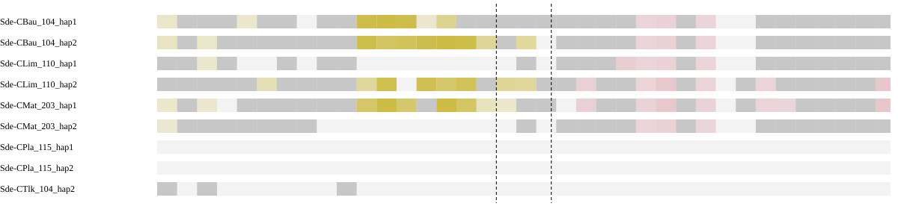

Different chromosomes means the assessed sides map to separate chromosomes in the peer, not that the peer has a fusion. Haplotypes are grouped by individual in the summary. Absence of an expected homologous match can be evidence when sequence availability and assay sensitivity are established. Failure of a qualifying alignment filter alone does not establish biological absence; the coverage and limitation columns show what was measured.

### Local sequence and contact support

| Assay | Measurement |
| --- | --- |
| Qualified immediate HiFi spanning molecules | 0 |
| Qualified HiFi flank molecules left/right | 0 / 19 |
| HiFi informative | False |
| Graph context | screened_primary_contig_paths |

Zero spanning reads must be interpreted with flank coverage, ambiguity and interval width. Graph connectivity alone does not establish a correct join.

| HiFi offset kb | Left molecules | Right molecules | Spanning molecules | Median depth left/right | Flanks observable |
| --- | --- | --- | --- | --- | --- |
| 100 | 0 | 8 | 0 | 0.0 / 15.0 | False |
| 250 | 2 | 23 | 0 | 2.0 / 41.0 | False |
| 500 | 12 | 40 | 0 | 23.0 / 49.0 | True |

Observable distant flanks show reads are available on each side; no spanning reads across a long interval do not by themselves test the exact seam.

| Library | Offset kb | Cross pairs | Within left/right | Sequence/gap controls | Informative |
| --- | --- | --- | --- | --- | --- |
| Ex2 | 100 | Unavailable | 3 / 7656 | 0 / 0 | False |
| Ex3 | 100 | Unavailable | Unavailable / 5443 | 0 / 0 | False |
| Ex2 | 250 | 3 | 233 / 6612 | 0 / 0 | False |
| Ex3 | 250 | Unavailable | 63 / 4292 | 0 / 0 | False |
| Ex2 | 500 | 15 | 3696 / 7900 | 2 / 0 | False |
| Ex3 | 500 | 1 | 1989 / 5181 | 1 / 0 | False |

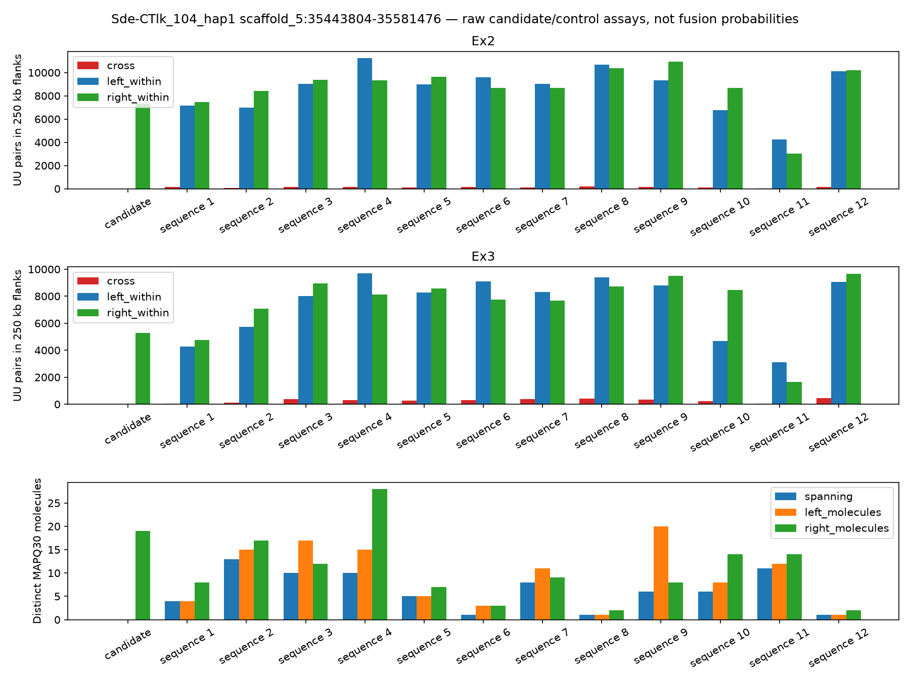

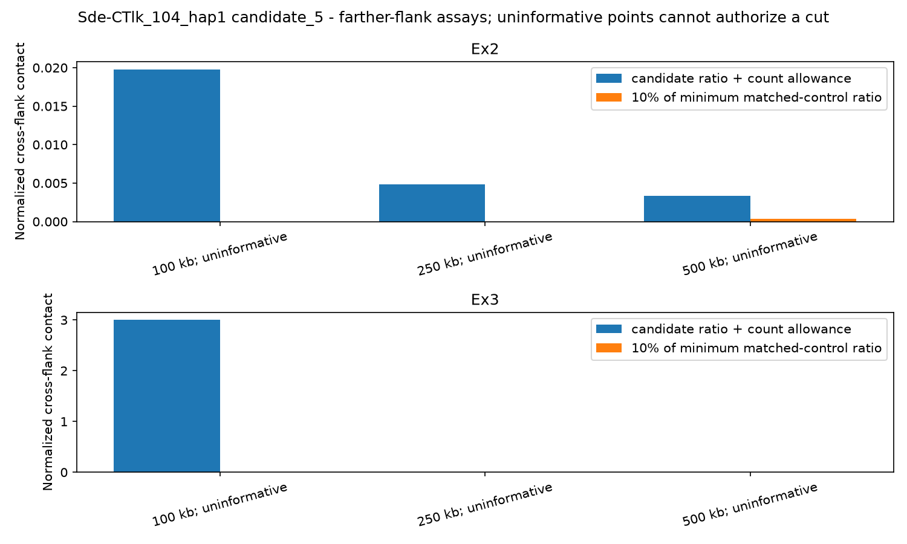

[IGV session: original coordinates](sequence-context/Sde-CTlk_104_hap1.sequence_context/candidate_5.igv.xml)

Scaffolding Hi-C is corroboration, not independent validation. Small control populations and poor observability limit conclusions from weak support.

**Decision needed:** review supporting, opposing and missing evidence before selecting an exact cut. Leave retained or unresolved rows at NO and record reviewer and rationale.

<details><summary>Full candidate measurements</summary>

```json
{
  "assessment_sha256": "1fd4707ae4958ce31f7e95b5732e01d70686755c6a62a414b080fac24e4fd96a",
  "coordinate_stage": "pre_finishing",
  "packet_interval_id": "candidate_5",
  "verified_gap": false,
  "assessment_scaffold_length": 74765583,
  "hifi_spanning_molecules": 0,
  "local_path_support": "unresolved",
  "continuity_grid": {
    "step_bp": 1000,
    "anchor_bp": 1000,
    "minimum_molecules": 0,
    "supported_fraction": 0.5467625899280576,
    "probes": [
      {
        "cut_bp": 35443804,
        "molecules": 0
      },
      {
        "cut_bp": 35444804,
        "molecules": 0
      },
      {
        "cut_bp": 35445804,
        "molecules": 0
      },
      {
        "cut_bp": 35446804,
        "molecules": 0
      },
      {
        "cut_bp": 35447804,
        "molecules": 0
      },
      {
        "cut_bp": 35448804,
        "molecules": 0
      },
      {
        "cut_bp": 35449804,
        "molecules": 0
      },
      {
        "cut_bp": 35450804,
        "molecules": 0
      },
      {
        "cut_bp": 35451804,
        "molecules": 0
      },
      {
        "cut_bp": 35452804,
        "molecules": 0
      },
      {
        "cut_bp": 35453804,
        "molecules": 0
      },
      {
        "cut_bp": 35454804,
        "molecules": 0
      },
      {
        "cut_bp": 35455804,
        "molecules": 0
      },
      {
        "cut_bp": 35456804,
        "molecules": 0
      },
      {
        "cut_bp": 35457804,
        "molecules": 0
      },
      {
        "cut_bp": 35458804,
        "molecules": 0
      },
      {
        "cut_bp": 35459804,
        "molecules": 0
      },
      {
        "cut_bp": 35460804,
        "molecules": 0
      },
      {
        "cut_bp": 35461804,
        "molecules": 0
      },
      {
        "cut_bp": 35462804,
        "molecules": 0
      },
      {
        "cut_bp": 35463804,
        "molecules": 0
      },
      {
        "cut_bp": 35464804,
        "molecules": 0
      },
      {
        "cut_bp": 35465804,
        "molecules": 0
      },
      {
        "cut_bp": 35466804,
        "molecules": 0
      },
      {
        "cut_bp": 35467804,
        "molecules": 0
      },
      {
        "cut_bp": 35468804,
        "molecules": 0
      },
      {
        "cut_bp": 35469804,
        "molecules": 0
      },
      {
        "cut_bp": 35470804,
        "molecules": 0
      },
      {
        "cut_bp": 35471804,
        "molecules": 0
      },
      {
        "cut_bp": 35472804,
        "molecules": 0
      },
      {
        "cut_bp": 35473804,
        "molecules": 0
      },
      {
        "cut_bp": 35474804,
        "molecules": 0
      },
      {
        "cut_bp": 35475804,
        "molecules": 0
      },
      {
        "cut_bp": 35476804,
        "molecules": 0
      },
      {
        "cut_bp": 35477804,
        "molecules": 0
      },
      {
        "cut_bp": 35478804,
        "molecules": 0
      },
      {
        "cut_bp": 35479804,
        "molecules": 0
      },
      {
        "cut_bp": 35480804,
        "molecules": 0
      },
      {
        "cut_bp": 35481804,
        "molecules": 0
      },
      {
        "cut_bp": 35482804,
        "molecules": 0
      },
      {
        "cut_bp": 35483804,
        "molecules": 0
      },
      {
        "cut_bp": 35484804,
        "molecules": 0
      },
      {
        "cut_bp": 35485804,
        "molecules": 0
      },
      {
        "cut_bp": 35486804,
        "molecules": 0
      },
      {
        "cut_bp": 35487804,
        "molecules": 0
      },
      {
        "cut_bp": 35488804,
        "molecules": 0
      },
      {
        "cut_bp": 35489804,
        "molecules": 0
      },
      {
        "cut_bp": 35490804,
        "molecules": 0
      },
      {
        "cut_bp": 35491804,
        "molecules": 1
      },
      {
        "cut_bp": 35492804,
        "molecules": 1
      },
      {
        "cut_bp": 35493804,
        "molecules": 1
      },
      {
        "cut_bp": 35494804,
        "molecules": 1
      },
      {
        "cut_bp": 35495804,
        "molecules": 2
      },
      {
        "cut_bp": 35496804,
        "molecules": 1
      },
      {
        "cut_bp": 35497804,
        "molecules": 0
      },
      {
        "cut_bp": 35498804,
        "molecules": 1
      },
      {
        "cut_bp": 35499804,
        "molecules": 2
      },
      {
        "cut_bp": 35500804,
        "molecules": 2
      },
      {
        "cut_bp": 35501804,
        "molecules": 1
      },
      {
        "cut_bp": 35502804,
        "molecules": 2
      },
      {
        "cut_bp": 35503804,
        "molecules": 6
      },
      {
        "cut_bp": 35504804,
        "molecules": 5
      },
      {
        "cut_bp": 35505804,
        "molecules": 4
      },
      {
        "cut_bp": 35506804,
        "molecules": 5
      },
      {
        "cut_bp": 35507804,
        "molecules": 4
      },
      {
        "cut_bp": 35508804,
        "molecules": 5
      },
      {
        "cut_bp": 35509804,
        "molecules": 7
      },
      {
        "cut_bp": 35510804,
        "molecules": 4
      },
      {
        "cut_bp": 35511804,
        "molecules": 3
      },
      {
        "cut_bp": 35512804,
        "molecules": 6
      },
      {
        "cut_bp": 35513804,
        "molecules": 3
      },
      {
        "cut_bp": 35514804,
        "molecules": 7
      },
      {
        "cut_bp": 35515804,
        "molecules": 5
      },
      {
        "cut_bp": 35516804,
        "molecules": 7
      },
      {
        "cut_bp": 35517804,
        "molecules": 6
      },
      {
        "cut_bp": 35518804,
        "molecules": 5
      },
      {
        "cut_bp": 35519804,
        "molecules": 3
      },
      {
        "cut_bp": 35520804,
        "molecules": 3
      },
      {
        "cut_bp": 35521804,
        "molecules": 3
      },
      {
        "cut_bp": 35522804,
        "molecules": 0
      },
      {
        "cut_bp": 35523804,
        "molecules": 1
      },
      {
        "cut_bp": 35524804,
        "molecules": 3
      },
      {
        "cut_bp": 35525804,
        "molecules": 3
      },
      {
        "cut_bp": 35526804,
        "molecules": 3
      },
      {
        "cut_bp": 35527804,
        "molecules": 3
      },
      {
        "cut_bp": 35528804,
        "molecules": 2
      },
      {
        "cut_bp": 35529804,
        "molecules": 4
      },
      {
        "cut_bp": 35530804,
        "molecules": 4
      },
      {
        "cut_bp": 35531804,
        "molecules": 5
      },
      {
        "cut_bp": 35532804,
        "molecules": 5
      },
      {
        "cut_bp": 35533804,
        "molecules": 5
      },
      {
        "cut_bp": 35534804,
        "molecules": 13
      },
      {
        "cut_bp": 35535804,
        "molecules": 16
      },
      {
        "cut_bp": 35536804,
        "molecules": 18
      },
      {
        "cut_bp": 35537804,
        "molecules": 7
      },
      {
        "cut_bp": 35538804,
        "molecules": 8
      },
      {
        "cut_bp": 35539804,
        "molecules": 9
      },
      {
        "cut_bp": 35540804,
        "molecules": 6
      },
      {
        "cut_bp": 35541804,
        "molecules": 5
      },
      {
        "cut_bp": 35542804,
        "molecules": 5
      },
      {
        "cut_bp": 35543804,
        "molecules": 7
      },
      {
        "cut_bp": 35544804,
        "molecules": 7
      },
      {
        "cut_bp": 35545804,
        "molecules": 7
      },
      {
        "cut_bp": 35546804,
        "molecules": 5
      },
      {
        "cut_bp": 35547804,
        "molecules": 4
      },
      {
        "cut_bp": 35548804,
        "molecules": 7
      },
      {
        "cut_bp": 35549804,
        "molecules": 4
      },
      {
        "cut_bp": 35550804,
        "molecules": 4
      },
      {
        "cut_bp": 35551804,
        "molecules": 8
      },
      {
        "cut_bp": 35552804,
        "molecules": 7
      },
      {
        "cut_bp": 35553804,
        "molecules": 4
      },
      {
        "cut_bp": 35554804,
        "molecules": 6
      },
      {
        "cut_bp": 35555804,
        "molecules": 8
      },
      {
        "cut_bp": 35556804,
        "molecules": 3
      },
      {
        "cut_bp": 35557804,
        "molecules": 3
      },
      {
        "cut_bp": 35558804,
        "molecules": 4
      },
      {
        "cut_bp": 35559804,
        "molecules": 5
      },
      {
        "cut_bp": 35560804,
        "molecules": 1
      },
      {
        "cut_bp": 35561804,
        "molecules": 1
      },
      {
        "cut_bp": 35562804,
        "molecules": 3
      },
      {
        "cut_bp": 35563804,
        "molecules": 3
      },
      {
        "cut_bp": 35564804,
        "molecules": 3
      },
      {
        "cut_bp": 35565804,
        "molecules": 1
      },
      {
        "cut_bp": 35566804,
        "molecules": 0
      },
      {
        "cut_bp": 35567804,
        "molecules": 3
      },
      {
        "cut_bp": 35568804,
        "molecules": 3
      },
      {
        "cut_bp": 35569804,
        "molecules": 4
      },
      {
        "cut_bp": 35570804,
        "molecules": 1
      },
      {
        "cut_bp": 35571804,
        "molecules": 2
      },
      {
        "cut_bp": 35572804,
        "molecules": 5
      },
      {
        "cut_bp": 35573804,
        "molecules": 7
      },
      {
        "cut_bp": 35574804,
        "molecules": 7
      },
      {
        "cut_bp": 35575804,
        "molecules": 8
      },
      {
        "cut_bp": 35576804,
        "molecules": 6
      },
      {
        "cut_bp": 35577804,
        "molecules": 10
      },
      {
        "cut_bp": 35578804,
        "molecules": 10
      },
      {
        "cut_bp": 35579804,
        "molecules": 10
      },
      {
        "cut_bp": 35580804,
        "molecules": 10
      },
      {
        "cut_bp": 35581476,
        "molecules": 11
      }
    ]
  },
  "graph_status": "screened_primary_contig_paths",
  "graph_contradiction": null,
  "native_continuity": true,
  "direct_native_link": false,
  "native_left": "h1tg000153l",
  "native_right": "h1tg000153l",
  "native_graph_sha256": "9b5ccab05303dc95c5d525f6ae565d219b4417d92b8046f0ecc6e5fb203ce355",
  "interpretation": "Primary path continuity alone is not read support or biological fusion confirmation; unmeasured unitig paths remain a limitation.",
  "chromosome_blocks": {
    "localized": false,
    "independent_individuals": [],
    "chromosome_pair": null,
    "contradictory_pairs": false,
    "peer_assays": [
      {
        "peer": "Sde-CBau_104_hap1",
        "sample": "Sde-CBau_104",
        "auto_evidence": true,
        "chromosome_pair": null,
        "qualified": false,
        "unique_gap_localization": false,
        "trials": [
          {
            "offset_bp": 100000,
            "left_chrom": "chr4",
            "right_chrom": null,
            "left_target": "scaffold_10",
            "right_target": null,
            "usable": false,
            "left_edge": 35343804,
            "right_edge": 35681476
          },
          {
            "offset_bp": 250000,
            "left_chrom": "chr4",
            "right_chrom": null,
            "left_target": "scaffold_10",
            "right_target": null,
            "usable": false,
            "left_edge": 35193804,
            "right_edge": 35831476
          },
          {
            "offset_bp": 500000,
            "left_chrom": null,
            "right_chrom": null,
            "left_target": null,
            "right_target": null,
            "usable": false,
            "left_edge": 34943804,
            "right_edge": 36081476
          }
        ]
      },
      {
        "peer": "Sde-CBau_104_hap2",
        "sample": "Sde-CBau_104",
        "auto_evidence": true,
        "chromosome_pair": null,
        "qualified": false,
        "unique_gap_localization": false,
        "trials": [
          {
            "offset_bp": 100000,
            "left_chrom": null,
            "right_chrom": null,
            "left_target": null,
            "right_target": null,
            "usable": false,
            "left_edge": 35343804,
            "right_edge": 35681476
          },
          {
            "offset_bp": 250000,
            "left_chrom": null,
            "right_chrom": null,
            "left_target": null,
            "right_target": null,
            "usable": false,
            "left_edge": 35193804,
            "right_edge": 35831476
          },
          {
            "offset_bp": 500000,
            "left_chrom": null,
            "right_chrom": null,
            "left_target": null,
            "right_target": null,
            "usable": false,
            "left_edge": 34943804,
            "right_edge": 36081476
          }
        ]
      },
      {
        "peer": "Sde-CLim_110_hap1",
        "sample": "Sde-CLim_110",
        "auto_evidence": true,
        "chromosome_pair": null,
        "qualified": false,
        "unique_gap_localization": false,
        "trials": [
          {
            "offset_bp": 100000,
            "left_chrom": null,
            "right_chrom": null,
            "left_target": null,
            "right_target": null,
            "usable": false,
            "left_edge": 35343804,
            "right_edge": 35681476
          },
          {
            "offset_bp": 250000,
            "left_chrom": null,
            "right_chrom": null,
            "left_target": null,
            "right_target": null,
            "usable": false,
            "left_edge": 35193804,
            "right_edge": 35831476
          },
          {
            "offset_bp": 500000,
            "left_chrom": null,
            "right_chrom": null,
            "left_target": null,
            "right_target": null,
            "usable": false,
            "left_edge": 34943804,
            "right_edge": 36081476
          }
        ]
      },
      {
        "peer": "Sde-CLim_110_hap2",
        "sample": "Sde-CLim_110",
        "auto_evidence": true,
        "chromosome_pair": null,
        "qualified": false,
        "unique_gap_localization": false,
        "trials": [
          {
            "offset_bp": 100000,
            "left_chrom": null,
            "right_chrom": null,
            "left_target": null,
            "right_target": null,
            "usable": false,
            "left_edge": 35343804,
            "right_edge": 35681476
          },
          {
            "offset_bp": 250000,
            "left_chrom": "chr4",
            "right_chrom": null,
            "left_target": "scaffold_7",
            "right_target": null,
            "usable": false,
            "left_edge": 35193804,
            "right_edge": 35831476
          },
          {
            "offset_bp": 500000,
            "left_chrom": null,
            "right_chrom": null,
            "left_target": null,
            "right_target": null,
            "usable": false,
            "left_edge": 34943804,
            "right_edge": 36081476
          }
        ]
      },
      {
        "peer": "Sde-CMat_203_hap1",
        "sample": "Sde-CMat_203",
        "auto_evidence": true,
        "chromosome_pair": null,
        "qualified": false,
        "unique_gap_localization": false,
        "trials": [
          {
            "offset_bp": 100000,
            "left_chrom": "chr4",
            "right_chrom": null,
            "left_target": "scaffold_4",
            "right_target": null,
            "usable": false,
            "left_edge": 35343804,
            "right_edge": 35681476
          },
          {
            "offset_bp": 250000,
            "left_chrom": "chr4",
            "right_chrom": null,
            "left_target": "scaffold_4",
            "right_target": null,
            "usable": false,
            "left_edge": 35193804,
            "right_edge": 35831476
          },
          {
            "offset_bp": 500000,
            "left_chrom": null,
            "right_chrom": null,
            "left_target": null,
            "right_target": null,
            "usable": false,
            "left_edge": 34943804,
            "right_edge": 36081476
          }
        ]
      },
      {
        "peer": "Sde-CMat_203_hap2",
        "sample": "Sde-CMat_203",
        "auto_evidence": true,
        "chromosome_pair": null,
        "qualified": false,
        "unique_gap_localization": false,
        "trials": [
          {
            "offset_bp": 100000,
            "left_chrom": null,
            "right_chrom": null,
            "left_target": null,
            "right_target": null,
            "usable": false,
            "left_edge": 35343804,
            "right_edge": 35681476
          },
          {
            "offset_bp": 250000,
            "left_chrom": null,
            "right_chrom": null,
            "left_target": null,
            "right_target": null,
            "usable": false,
            "left_edge": 35193804,
            "right_edge": 35831476
          },
          {
            "offset_bp": 500000,
            "left_chrom": null,
            "right_chrom": null,
            "left_target": null,
            "right_target": null,
            "usable": false,
            "left_edge": 34943804,
            "right_edge": 36081476
          }
        ]
      },
      {
        "peer": "Sde-CPla_115_hap1",
        "sample": "Sde-CPla_115",
        "auto_evidence": false,
        "chromosome_pair": null,
        "qualified": false,
        "unique_gap_localization": false,
        "trials": [
          {
            "offset_bp": 100000,
            "left_chrom": null,
            "right_chrom": null,
            "left_target": null,
            "right_target": null,
            "usable": false,
            "left_edge": 35343804,
            "right_edge": 35681476
          },
          {
            "offset_bp": 250000,
            "left_chrom": null,
            "right_chrom": null,
            "left_target": null,
            "right_target": null,
            "usable": false,
            "left_edge": 35193804,
            "right_edge": 35831476
          },
          {
            "offset_bp": 500000,
            "left_chrom": null,
            "right_chrom": null,
            "left_target": null,
            "right_target": null,
            "usable": false,
            "left_edge": 34943804,
            "right_edge": 36081476
          }
        ]
      },
      {
        "peer": "Sde-CPla_115_hap2",
        "sample": "Sde-CPla_115",
        "auto_evidence": false,
        "chromosome_pair": null,
        "qualified": false,
        "unique_gap_localization": false,
        "trials": [
          {
            "offset_bp": 100000,
            "left_chrom": null,
            "right_chrom": null,
            "left_target": null,
            "right_target": null,
            "usable": false,
            "left_edge": 35343804,
            "right_edge": 35681476
          },
          {
            "offset_bp": 250000,
            "left_chrom": null,
            "right_chrom": null,
            "left_target": null,
            "right_target": null,
            "usable": false,
            "left_edge": 35193804,
            "right_edge": 35831476
          },
          {
            "offset_bp": 500000,
            "left_chrom": null,
            "right_chrom": null,
            "left_target": null,
            "right_target": null,
            "usable": false,
            "left_edge": 34943804,
            "right_edge": 36081476
          }
        ]
      },
      {
        "peer": "Sde-CTlk_104_hap2",
        "sample": "Sde-CTlk_104",
        "auto_evidence": true,
        "chromosome_pair": null,
        "qualified": false,
        "unique_gap_localization": false,
        "trials": [
          {
            "offset_bp": 100000,
            "left_chrom": null,
            "right_chrom": null,
            "left_target": "scaffold_7",
            "right_target": null,
            "usable": false,
            "left_edge": 35343804,
            "right_edge": 35681476
          },
          {
            "offset_bp": 250000,
            "left_chrom": null,
            "right_chrom": null,
            "left_target": null,
            "right_target": null,
            "usable": false,
            "left_edge": 35193804,
            "right_edge": 35831476
          },
          {
            "offset_bp": 500000,
            "left_chrom": null,
            "right_chrom": null,
            "left_target": null,
            "right_target": null,
            "usable": false,
            "left_edge": 34943804,
            "right_edge": 36081476
          }
        ]
      }
    ]
  },
  "farther_contact_evidence": {
    "supported_offsets": [],
    "pass_all": false,
    "contradictory_informative_trial": false,
    "trials": [
      {
        "offset_bp": 100000,
        "library": "Ex2",
        "informative": false,
        "control_populations": {
          "continuous_control": 0,
          "gap_control": 0
        },
        "matched_control_ids": [],
        "minimum_control_ratio": 0,
        "upper_count_allowance_ratio": 0.019795189561622396,
        "support_loss": false,
        "raw_counts": {
          "right_ends": 43047,
          "left_ends": 33,
          "left_within": 3,
          "right_within": 7656
        }
      },
      {
        "offset_bp": 100000,
        "library": "Ex3",
        "informative": false,
        "control_populations": {
          "continuous_control": 0,
          "gap_control": 0
        },
        "matched_control_ids": [],
        "minimum_control_ratio": 0,
        "upper_count_allowance_ratio": 3.0,
        "support_loss": false,
        "raw_counts": {
          "right_ends": 19967,
          "left_ends": 3,
          "right_within": 5443
        }
      },
      {
        "offset_bp": 250000,
        "library": "Ex2",
        "informative": false,
        "control_populations": {
          "continuous_control": 0,
          "gap_control": 0
        },
        "matched_control_ids": [],
        "minimum_control_ratio": 0,
        "upper_count_allowance_ratio": 0.0048340024637724445,
        "support_loss": false,
        "raw_counts": {
          "right_ends": 38611,
          "left_ends": 2143,
          "left_within": 233,
          "cross": 3,
          "right_within": 6612
        }
      },
      {
        "offset_bp": 250000,
        "library": "Ex3",
        "informative": false,
        "control_populations": {
          "continuous_control": 0,
          "gap_control": 0
        },
        "matched_control_ids": [],
        "minimum_control_ratio": 0,
        "upper_count_allowance_ratio": 0.005769273441529422,
        "support_loss": false,
        "raw_counts": {
          "right_ends": 15785,
          "left_ends": 479,
          "left_within": 63,
          "right_within": 4292
        }
      },
      {
        "offset_bp": 500000,
        "library": "Ex2",
        "informative": false,
        "control_populations": {
          "continuous_control": 2,
          "gap_control": 0
        },
        "matched_control_ids": [
          "continuous_642b756dc182a79fc778",
          "continuous_1125875e5d7ed21b7842"
        ],
        "minimum_control_ratio": 0.003645108814976434,
        "upper_count_allowance_ratio": 0.0033311407112685274,
        "support_loss": false,
        "raw_counts": {
          "left_ends": 20669,
          "right_ends": 45610,
          "left_within": 3696,
          "cross": 15,
          "right_within": 7900
        }
      },
      {
        "offset_bp": 500000,
        "library": "Ex3",
        "informative": false,
        "control_populations": {
          "continuous_control": 1,
          "gap_control": 0
        },
        "matched_control_ids": [
          "continuous_1125875e5d7ed21b7842"
        ],
        "minimum_control_ratio": 0.005448525272190559,
        "upper_count_allowance_ratio": 0.00124605095858239,
        "support_loss": false,
        "raw_counts": {
          "right_ends": 21008,
          "left_ends": 7995,
          "left_within": 1989,
          "cross": 1,
          "right_within": 5181
        }
      }
    ]
  },
  "farther_hifi": {
    "100000": {
      "informative": false,
      "raw": {
        "left_molecules": 0,
        "right_molecules": 8,
        "spanning": 0,
        "left_median_depth": 0.0,
        "right_median_depth": 15.0,
        "left_covered_fraction": 0.0,
        "right_covered_fraction": 1.0
      }
    },
    "250000": {
      "informative": false,
      "raw": {
        "left_molecules": 2,
        "right_molecules": 23,
        "spanning": 0,
        "left_median_depth": 2.0,
        "right_median_depth": 41.0,
        "left_covered_fraction": 0.0,
        "right_covered_fraction": 1.0
      }
    },
    "500000": {
      "informative": true,
      "raw": {
        "left_molecules": 12,
        "right_molecules": 40,
        "spanning": 0,
        "left_median_depth": 23.0,
        "right_median_depth": 49.0,
        "left_covered_fraction": 1.0,
        "right_covered_fraction": 1.0
      }
    }
  },
  "haplotype_block_conflict": false,
  "repeat_obscured_localization": false,
  "control_qualification": [
    {
      "id": "continuous_642b756dc182a79fc778",
      "population": "continuous_control",
      "qualified": false,
      "reasons": [
        "uninformative_hifi_flanks"
      ]
    },
    {
      "id": "continuous_2be5e5a345f99fa5d10d",
      "population": "continuous_control",
      "qualified": true,
      "reasons": []
    },
    {
      "id": "continuous_4e34d77baa53b821fbdc",
      "population": "continuous_control",
      "qualified": true,
      "reasons": []
    },
    {
      "id": "continuous_86fcf181556c7a874d48",
      "population": "continuous_control",
      "qualified": true,
      "reasons": []
    },
    {
      "id": "continuous_65ba78ec9e7df58ffd6b",
      "population": "continuous_control",
      "qualified": false,
      "reasons": [
        "uninformative_hifi_flanks"
      ]
    },
    {
      "id": "continuous_b78fce3e9fbd1aa25f2e",
      "population": "continuous_control",
      "qualified": false,
      "reasons": [
        "uninformative_hifi_flanks",
        "fewer_than_two_hifi_bridges"
      ]
    },
    {
      "id": "continuous_837ab7bae6c37c77e2a2",
      "population": "continuous_control",
      "qualified": false,
      "reasons": [
        "uninformative_hifi_flanks"
      ]
    },
    {
      "id": "continuous_93100c94682c58558aea",
      "population": "continuous_control",
      "qualified": false,
      "reasons": [
        "uninformative_hifi_flanks",
        "fewer_than_two_hifi_bridges"
      ]
    },
    {
      "id": "continuous_d31cf0d33699e4e24375",
      "population": "continuous_control",
      "qualified": false,
      "reasons": [
        "uninformative_hifi_flanks"
      ]
    },
    {
      "id": "continuous_b9666e8095793c1dbca4",
      "population": "continuous_control",
      "qualified": false,
      "reasons": [
        "uninformative_hifi_flanks"
      ]
    },
    {
      "id": "continuous_1125875e5d7ed21b7842",
      "population": "continuous_control",
      "qualified": true,
      "reasons": []
    },
    {
      "id": "continuous_2bf91dd454ce96992515",
      "population": "continuous_control",
      "qualified": false,
      "reasons": [
        "uninformative_hifi_flanks",
        "fewer_than_two_hifi_bridges"
      ]
    }
  ],
  "hifi_informative": false,
  "matched_controls_pass": false,
  "hic_informative": false,
  "hic_support_loss": false,
  "libraries": [
    {
      "library": "Ex2",
      "matched_controls": 0,
      "control_populations": {
        "continuous_control": 0,
        "gap_control": 0
      },
      "informative": false,
      "ratio": 0.0,
      "upper_count_allowance_ratio": 0.017526187135109582,
      "minimum_control_ratio": 0,
      "support_loss": false,
      "raw_counts": {
        "right_ends": 41233,
        "left_ends": 40,
        "left_within": 4,
        "right_within": 7325
      }
    },
    {
      "library": "Ex3",
      "matched_controls": 0,
      "control_populations": {
        "continuous_control": 0,
        "gap_control": 0
      },
      "informative": false,
      "ratio": 0.0,
      "upper_count_allowance_ratio": 3.0,
      "minimum_control_ratio": 0,
      "support_loss": false,
      "raw_counts": {
        "right_ends": 19531,
        "left_ends": 7,
        "right_within": 5278
      }
    }
  ],
  "independent_discordant_individuals": 0,
  "alternative_placements_checked": true,
  "control_ids": [
    "continuous_642b756dc182a79fc778",
    "continuous_2be5e5a345f99fa5d10d",
    "continuous_4e34d77baa53b821fbdc",
    "continuous_86fcf181556c7a874d48",
    "continuous_65ba78ec9e7df58ffd6b",
    "continuous_b78fce3e9fbd1aa25f2e",
    "continuous_837ab7bae6c37c77e2a2",
    "continuous_93100c94682c58558aea",
    "continuous_d31cf0d33699e4e24375",
    "continuous_b9666e8095793c1dbca4",
    "continuous_1125875e5d7ed21b7842",
    "continuous_2bf91dd454ce96992515"
  ],
  "hifi_raw": {
    "left_molecules": 0,
    "right_molecules": 19,
    "spanning": 0,
    "left_median_depth": 0.0,
    "right_median_depth": 27.0,
    "left_covered_fraction": 0.0,
    "right_covered_fraction": 1.0
  },
  "alternative_placement_scope": "Assessment BAM MAPQ and competing peer anchors; bounded emitted alternatives, no proof of haplotype-specific uniqueness",
  "chromosome_tracks": [
    {
      "peer": "Sde-CBau_104_hap1",
      "sample": "Sde-CBau_104",
      "auto_evidence": true,
      "relationship": "uninformative",
      "bins": [
        {
          "lo": 0,
          "hi": 50000,
          "aligned_bp": 12147,
          "ambiguous_bp": 0,
          "dominance": 1.0,
          "chrom": "chr4",
          "counts": {
            "chr4": 12147,
            "chr9": 0,
            "chr12": 0,
            "chr14": 0
          }
        },
        {
          "lo": 50000,
          "hi": 100000,
          "aligned_bp": 6240,
          "ambiguous_bp": 0,
          "dominance": 1.0,
          "chrom": null,
          "counts": {
            "chr4": 6240,
            "chr9": 0,
            "chr12": 0,
            "chr14": 0
          }
        },
        {
          "lo": 100000,
          "hi": 150000,
          "aligned_bp": 8331,
          "ambiguous_bp": 0,
          "dominance": 1.0,
          "chrom": null,
          "counts": {
            "chr4": 8331,
            "chr9": 0,
            "chr12": 0,
            "chr14": 0
          }
        },
        {
          "lo": 150000,
          "hi": 200000,
          "aligned_bp": 372,
          "ambiguous_bp": 0,
          "dominance": 1.0,
          "chrom": null,
          "counts": {
            "chr4": 372,
            "chr9": 0,
            "chr12": 0,
            "chr14": 0
          }
        },
        {
          "lo": 200000,
          "hi": 250000,
          "aligned_bp": 10893,
          "ambiguous_bp": 0,
          "dominance": 1.0,
          "chrom": "chr4",
          "counts": {
            "chr4": 10893,
            "chr9": 0,
            "chr12": 0,
            "chr14": 0
          }
        },
        {
          "lo": 250000,
          "hi": 300000,
          "aligned_bp": 8210,
          "ambiguous_bp": 0,
          "dominance": 1.0,
          "chrom": null,
          "counts": {
            "chr4": 8210,
            "chr9": 0,
            "chr12": 0,
            "chr14": 0
          }
        },
        {
          "lo": 300000,
          "hi": 350000,
          "aligned_bp": 813,
          "ambiguous_bp": 0,
          "dominance": 1.0,
          "chrom": null,
          "counts": {
            "chr4": 813,
            "chr9": 0,
            "chr12": 0,
            "chr14": 0
          }
        },
        {
          "lo": 350000,
          "hi": 400000,
          "aligned_bp": 0,
          "ambiguous_bp": 0,
          "dominance": 0.0,
          "chrom": null,
          "counts": {
            "chr4": 0,
            "chr9": 0,
            "chr12": 0,
            "chr14": 0
          }
        },
        {
          "lo": 400000,
          "hi": 450000,
          "aligned_bp": 8343,
          "ambiguous_bp": 0,
          "dominance": 1.0,
          "chrom": null,
          "counts": {
            "chr4": 8343,
            "chr9": 0,
            "chr12": 0,
            "chr14": 0
          }
        },
        {
          "lo": 450000,
          "hi": 500000,
          "aligned_bp": 14,
          "ambiguous_bp": 1032,
          "dominance": 1.0,
          "chrom": null,
          "counts": {
            "chr4": 14,
            "chr9": 0,
            "chr12": 0,
            "chr14": 0
          }
        },
        {
          "lo": 500000,
          "hi": 550000,
          "aligned_bp": 48337,
          "ambiguous_bp": 721,
          "dominance": 1.0,
          "chrom": "chr4",
          "counts": {
            "chr4": 48337,
            "chr9": 0,
            "chr12": 0,
            "chr14": 0
          }
        },
        {
          "lo": 550000,
          "hi": 600000,
          "aligned_bp": 49994,
          "ambiguous_bp": 0,
          "dominance": 1.0,
          "chrom": "chr4",
          "counts": {
            "chr4": 49994,
            "chr9": 0,
            "chr12": 0,
            "chr14": 0
          }
        },
        {
          "lo": 600000,
          "hi": 650000,
          "aligned_bp": 47477,
          "ambiguous_bp": 0,
          "dominance": 1.0,
          "chrom": "chr4",
          "counts": {
            "chr4": 47477,
            "chr9": 0,
            "chr12": 0,
            "chr14": 0
          }
        },
        {
          "lo": 650000,
          "hi": 700000,
          "aligned_bp": 10636,
          "ambiguous_bp": 39322,
          "dominance": 1.0,
          "chrom": "chr4",
          "counts": {
            "chr4": 10636,
            "chr9": 0,
            "chr12": 0,
            "chr14": 0
          }
        },
        {
          "lo": 700000,
          "hi": 750000,
          "aligned_bp": 28300,
          "ambiguous_bp": 21696,
          "dominance": 1.0,
          "chrom": "chr4",
          "counts": {
            "chr4": 28300,
            "chr9": 0,
            "chr12": 0,
            "chr14": 0
          }
        },
        {
          "lo": 750000,
          "hi": 800000,
          "aligned_bp": 0,
          "ambiguous_bp": 49954,
          "dominance": 0.0,
          "chrom": null,
          "counts": {
            "chr4": 0,
            "chr9": 0,
            "chr12": 0,
            "chr14": 0
          }
        },
        {
          "lo": 800000,
          "hi": 850000,
          "aligned_bp": 0,
          "ambiguous_bp": 49880,
          "dominance": 0.0,
          "chrom": null,
          "counts": {
            "chr4": 0,
            "chr9": 0,
            "chr12": 0,
            "chr14": 0
          }
        },
        {
          "lo": 850000,
          "hi": 900000,
          "aligned_bp": 0,
          "ambiguous_bp": 49837,
          "dominance": 0.0,
          "chrom": null,
          "counts": {
            "chr4": 0,
            "chr9": 0,
            "chr12": 0,
            "chr14": 0
          }
        },
        {
          "lo": 900000,
          "hi": 950000,
          "aligned_bp": 2413,
          "ambiguous_bp": 24180,
          "dominance": 1.0,
          "chrom": null,
          "counts": {
            "chr4": 0,
            "chr9": 2413,
            "chr12": 0,
            "chr14": 0
          }
        },
        {
          "lo": 950000,
          "hi": 1000000,
          "aligned_bp": 149,
          "ambiguous_bp": 532,
          "dominance": 1.0,
          "chrom": null,
          "counts": {
            "chr4": 0,
            "chr9": 0,
            "chr12": 149,
            "chr14": 0
          }
        },
        {
          "lo": 1000000,
          "hi": 1050000,
          "aligned_bp": 1813,
          "ambiguous_bp": 0,
          "dominance": 1.0,
          "chrom": null,
          "counts": {
            "chr4": 0,
            "chr9": 0,
            "chr12": 0,
            "chr14": 1813
          }
        },
        {
          "lo": 1050000,
          "hi": 1100000,
          "aligned_bp": 8706,
          "ambiguous_bp": 0,
          "dominance": 1.0,
          "chrom": null,
          "counts": {
            "chr4": 0,
            "chr9": 0,
            "chr12": 0,
            "chr14": 8706
          }
        },
        {
          "lo": 1100000,
          "hi": 1150000,
          "aligned_bp": 1353,
          "ambiguous_bp": 0,
          "dominance": 1.0,
          "chrom": null,
          "counts": {
            "chr4": 0,
            "chr9": 0,
            "chr12": 0,
            "chr14": 1353
          }
        },
        {
          "lo": 1150000,
          "hi": 1200000,
          "aligned_bp": 9460,
          "ambiguous_bp": 0,
          "dominance": 1.0,
          "chrom": null,
          "counts": {
            "chr4": 0,
            "chr9": 0,
            "chr12": 0,
            "chr14": 9460
          }
        },
        {
          "lo": 1200000,
          "hi": 1250000,
          "aligned_bp": 10869,
          "ambiguous_bp": 0,
          "dominance": 1.0,
          "chrom": "chr14",
          "counts": {
            "chr4": 0,
            "chr9": 0,
            "chr12": 0,
            "chr14": 10869
          }
        },
        {
          "lo": 1250000,
          "hi": 1300000,
          "aligned_bp": 11870,
          "ambiguous_bp": 0,
          "dominance": 1.0,
          "chrom": "chr14",
          "counts": {
            "chr4": 0,
            "chr9": 0,
            "chr12": 0,
            "chr14": 11870
          }
        },
        {
          "lo": 1300000,
          "hi": 1350000,
          "aligned_bp": 8520,
          "ambiguous_bp": 0,
          "dominance": 1.0,
          "chrom": null,
          "counts": {
            "chr4": 0,
            "chr9": 0,
            "chr12": 0,
            "chr14": 8520
          }
        },
        {
          "lo": 1350000,
          "hi": 1400000,
          "aligned_bp": 10536,
          "ambiguous_bp": 0,
          "dominance": 1.0,
          "chrom": "chr14",
          "counts": {
            "chr4": 0,
            "chr9": 0,
            "chr12": 0,
            "chr14": 10536
          }
        },
        {
          "lo": 1400000,
          "hi": 1450000,
          "aligned_bp": 0,
          "ambiguous_bp": 0,
          "dominance": 0.0,
          "chrom": null,
          "counts": {
            "chr4": 0,
            "chr9": 0,
            "chr12": 0,
            "chr14": 0
          }
        },
        {
          "lo": 1450000,
          "hi": 1500000,
          "aligned_bp": 0,
          "ambiguous_bp": 0,
          "dominance": 0.0,
          "chrom": null,
          "counts": {
            "chr4": 0,
            "chr9": 0,
            "chr12": 0,
            "chr14": 0
          }
        },
        {
          "lo": 1500000,
          "hi": 1550000,
          "aligned_bp": 9231,
          "ambiguous_bp": 0,
          "dominance": 1.0,
          "chrom": null,
          "counts": {
            "chr4": 0,
            "chr9": 0,
            "chr12": 0,
            "chr14": 9231
          }
        },
        {
          "lo": 1550000,
          "hi": 1600000,
          "aligned_bp": 7262,
          "ambiguous_bp": 8,
          "dominance": 1.0,
          "chrom": null,
          "counts": {
            "chr4": 0,
            "chr9": 0,
            "chr12": 0,
            "chr14": 7262
          }
        },
        {
          "lo": 1600000,
          "hi": 1650000,
          "aligned_bp": 4441,
          "ambiguous_bp": 0,
          "dominance": 1.0,
          "chrom": null,
          "counts": {
            "chr4": 0,
            "chr9": 0,
            "chr12": 0,
            "chr14": 4441
          }
        },
        {
          "lo": 1650000,
          "hi": 1700000,
          "aligned_bp": 9193,
          "ambiguous_bp": 0,
          "dominance": 1.0,
          "chrom": null,
          "counts": {
            "chr4": 0,
            "chr9": 0,
            "chr12": 0,
            "chr14": 9193
          }
        },
        {
          "lo": 1700000,
          "hi": 1750000,
          "aligned_bp": 1866,
          "ambiguous_bp": 0,
          "dominance": 1.0,
          "chrom": null,
          "counts": {
            "chr4": 0,
            "chr9": 0,
            "chr12": 0,
            "chr14": 1866
          }
        },
        {
          "lo": 1750000,
          "hi": 1800000,
          "aligned_bp": 1310,
          "ambiguous_bp": 0,
          "dominance": 1.0,
          "chrom": null,
          "counts": {
            "chr4": 0,
            "chr9": 0,
            "chr12": 0,
            "chr14": 1310
          }
        },
        {
          "lo": 1800000,
          "hi": 1837672,
          "aligned_bp": 1033,
          "ambiguous_bp": 0,
          "dominance": 1.0,
          "chrom": null,
          "counts": {
            "chr4": 0,
            "chr9": 0,
            "chr12": 0,
            "chr14": 1033
          }
        }
      ],
      "left": {
        "chrom": "chr4",
        "aligned_bp": 240107,
        "coverage": 0.2824788235294118,
        "dominance": 1.0,
        "informative_bins": 7,
        "qualified": false
      },
      "right": {
        "chrom": "chr14",
        "aligned_bp": 97463,
        "coverage": 0.11466235294117647,
        "dominance": 1.0,
        "informative_bins": 3,
        "qualified": false
      }
    },
    {
      "peer": "Sde-CBau_104_hap2",
      "sample": "Sde-CBau_104",
      "auto_evidence": true,
      "relationship": "uninformative",
      "bins": [
        {
          "lo": 0,
          "hi": 50000,
          "aligned_bp": 13939,
          "ambiguous_bp": 0,
          "dominance": 1.0,
          "chrom": "chr4",
          "counts": {
            "chr4": 13939,
            "chr9": 0,
            "chr14": 0
          }
        },
        {
          "lo": 50000,
          "hi": 100000,
          "aligned_bp": 6510,
          "ambiguous_bp": 0,
          "dominance": 1.0,
          "chrom": null,
          "counts": {
            "chr4": 6510,
            "chr9": 0,
            "chr14": 0
          }
        },
        {
          "lo": 100000,
          "hi": 150000,
          "aligned_bp": 11850,
          "ambiguous_bp": 0,
          "dominance": 1.0,
          "chrom": "chr4",
          "counts": {
            "chr4": 11850,
            "chr9": 0,
            "chr14": 0
          }
        },
        {
          "lo": 150000,
          "hi": 200000,
          "aligned_bp": 245,
          "ambiguous_bp": 0,
          "dominance": 1.0,
          "chrom": null,
          "counts": {
            "chr4": 245,
            "chr9": 0,
            "chr14": 0
          }
        },
        {
          "lo": 200000,
          "hi": 250000,
          "aligned_bp": 7497,
          "ambiguous_bp": 0,
          "dominance": 1.0,
          "chrom": null,
          "counts": {
            "chr4": 7497,
            "chr9": 0,
            "chr14": 0
          }
        },
        {
          "lo": 250000,
          "hi": 300000,
          "aligned_bp": 8064,
          "ambiguous_bp": 0,
          "dominance": 1.0,
          "chrom": null,
          "counts": {
            "chr4": 8064,
            "chr9": 0,
            "chr14": 0
          }
        },
        {
          "lo": 300000,
          "hi": 350000,
          "aligned_bp": 3475,
          "ambiguous_bp": 0,
          "dominance": 1.0,
          "chrom": null,
          "counts": {
            "chr4": 3475,
            "chr9": 0,
            "chr14": 0
          }
        },
        {
          "lo": 350000,
          "hi": 400000,
          "aligned_bp": 2577,
          "ambiguous_bp": 0,
          "dominance": 1.0,
          "chrom": null,
          "counts": {
            "chr4": 2577,
            "chr9": 0,
            "chr14": 0
          }
        },
        {
          "lo": 400000,
          "hi": 450000,
          "aligned_bp": 4473,
          "ambiguous_bp": 0,
          "dominance": 1.0,
          "chrom": null,
          "counts": {
            "chr4": 4473,
            "chr9": 0,
            "chr14": 0
          }
        },
        {
          "lo": 450000,
          "hi": 500000,
          "aligned_bp": 620,
          "ambiguous_bp": 0,
          "dominance": 1.0,
          "chrom": null,
          "counts": {
            "chr4": 620,
            "chr9": 0,
            "chr14": 0
          }
        },
        {
          "lo": 500000,
          "hi": 550000,
          "aligned_bp": 47932,
          "ambiguous_bp": 0,
          "dominance": 1.0,
          "chrom": "chr4",
          "counts": {
            "chr4": 47932,
            "chr9": 0,
            "chr14": 0
          }
        },
        {
          "lo": 550000,
          "hi": 600000,
          "aligned_bp": 41636,
          "ambiguous_bp": 0,
          "dominance": 1.0,
          "chrom": "chr4",
          "counts": {
            "chr4": 41636,
            "chr9": 0,
            "chr14": 0
          }
        },
        {
          "lo": 600000,
          "hi": 650000,
          "aligned_bp": 43880,
          "ambiguous_bp": 0,
          "dominance": 1.0,
          "chrom": "chr4",
          "counts": {
            "chr4": 43880,
            "chr9": 0,
            "chr14": 0
          }
        },
        {
          "lo": 650000,
          "hi": 700000,
          "aligned_bp": 47332,
          "ambiguous_bp": 0,
          "dominance": 1.0,
          "chrom": "chr4",
          "counts": {
            "chr4": 47332,
            "chr9": 0,
            "chr14": 0
          }
        },
        {
          "lo": 700000,
          "hi": 750000,
          "aligned_bp": 49769,
          "ambiguous_bp": 0,
          "dominance": 1.0,
          "chrom": "chr4",
          "counts": {
            "chr4": 49769,
            "chr9": 0,
            "chr14": 0
          }
        },
        {
          "lo": 750000,
          "hi": 800000,
          "aligned_bp": 48654,
          "ambiguous_bp": 0,
          "dominance": 1.0,
          "chrom": "chr4",
          "counts": {
            "chr4": 48654,
            "chr9": 0,
            "chr14": 0
          }
        },
        {
          "lo": 800000,
          "hi": 850000,
          "aligned_bp": 26084,
          "ambiguous_bp": 23387,
          "dominance": 1.0,
          "chrom": "chr4",
          "counts": {
            "chr4": 26084,
            "chr9": 0,
            "chr14": 0
          }
        },
        {
          "lo": 850000,
          "hi": 900000,
          "aligned_bp": 878,
          "ambiguous_bp": 49119,
          "dominance": 1.0,
          "chrom": null,
          "counts": {
            "chr4": 878,
            "chr9": 0,
            "chr14": 0
          }
        },
        {
          "lo": 900000,
          "hi": 950000,
          "aligned_bp": 24654,
          "ambiguous_bp": 1943,
          "dominance": 0.9021659771233876,
          "chrom": "chr4",
          "counts": {
            "chr4": 22242,
            "chr9": 2412,
            "chr14": 0
          }
        },
        {
          "lo": 950000,
          "hi": 1000000,
          "aligned_bp": 0,
          "ambiguous_bp": 0,
          "dominance": 0.0,
          "chrom": null,
          "counts": {
            "chr4": 0,
            "chr9": 0,
            "chr14": 0
          }
        },
        {
          "lo": 1000000,
          "hi": 1050000,
          "aligned_bp": 1813,
          "ambiguous_bp": 0,
          "dominance": 1.0,
          "chrom": null,
          "counts": {
            "chr4": 0,
            "chr9": 0,
            "chr14": 1813
          }
        },
        {
          "lo": 1050000,
          "hi": 1100000,
          "aligned_bp": 8711,
          "ambiguous_bp": 0,
          "dominance": 1.0,
          "chrom": null,
          "counts": {
            "chr4": 0,
            "chr9": 0,
            "chr14": 8711
          }
        },
        {
          "lo": 1100000,
          "hi": 1150000,
          "aligned_bp": 1353,
          "ambiguous_bp": 0,
          "dominance": 1.0,
          "chrom": null,
          "counts": {
            "chr4": 0,
            "chr9": 0,
            "chr14": 1353
          }
        },
        {
          "lo": 1150000,
          "hi": 1200000,
          "aligned_bp": 9164,
          "ambiguous_bp": 0,
          "dominance": 1.0,
          "chrom": null,
          "counts": {
            "chr4": 0,
            "chr9": 0,
            "chr14": 9164
          }
        },
        {
          "lo": 1200000,
          "hi": 1250000,
          "aligned_bp": 10867,
          "ambiguous_bp": 0,
          "dominance": 1.0,
          "chrom": "chr14",
          "counts": {
            "chr4": 0,
            "chr9": 0,
            "chr14": 10867
          }
        },
        {
          "lo": 1250000,
          "hi": 1300000,
          "aligned_bp": 11872,
          "ambiguous_bp": 0,
          "dominance": 1.0,
          "chrom": "chr14",
          "counts": {
            "chr4": 0,
            "chr9": 0,
            "chr14": 11872
          }
        },
        {
          "lo": 1300000,
          "hi": 1350000,
          "aligned_bp": 8520,
          "ambiguous_bp": 0,
          "dominance": 1.0,
          "chrom": null,
          "counts": {
            "chr4": 0,
            "chr9": 0,
            "chr14": 8520
          }
        },
        {
          "lo": 1350000,
          "hi": 1400000,
          "aligned_bp": 10979,
          "ambiguous_bp": 0,
          "dominance": 1.0,
          "chrom": "chr14",
          "counts": {
            "chr4": 0,
            "chr9": 0,
            "chr14": 10979
          }
        },
        {
          "lo": 1400000,
          "hi": 1450000,
          "aligned_bp": 0,
          "ambiguous_bp": 0,
          "dominance": 0.0,
          "chrom": null,
          "counts": {
            "chr4": 0,
            "chr9": 0,
            "chr14": 0
          }
        },
        {
          "lo": 1450000,
          "hi": 1500000,
          "aligned_bp": 0,
          "ambiguous_bp": 0,
          "dominance": 0.0,
          "chrom": null,
          "counts": {
            "chr4": 0,
            "chr9": 0,
            "chr14": 0
          }
        },
        {
          "lo": 1500000,
          "hi": 1550000,
          "aligned_bp": 9233,
          "ambiguous_bp": 0,
          "dominance": 1.0,
          "chrom": null,
          "counts": {
            "chr4": 0,
            "chr9": 0,
            "chr14": 9233
          }
        },
        {
          "lo": 1550000,
          "hi": 1600000,
          "aligned_bp": 7260,
          "ambiguous_bp": 8,
          "dominance": 1.0,
          "chrom": null,
          "counts": {
            "chr4": 0,
            "chr9": 0,
            "chr14": 7260
          }
        },
        {
          "lo": 1600000,
          "hi": 1650000,
          "aligned_bp": 4441,
          "ambiguous_bp": 0,
          "dominance": 1.0,
          "chrom": null,
          "counts": {
            "chr4": 0,
            "chr9": 0,
            "chr14": 4441
          }
        },
        {
          "lo": 1650000,
          "hi": 1700000,
          "aligned_bp": 8795,
          "ambiguous_bp": 0,
          "dominance": 1.0,
          "chrom": null,
          "counts": {
            "chr4": 0,
            "chr9": 0,
            "chr14": 8795
          }
        },
        {
          "lo": 1700000,
          "hi": 1750000,
          "aligned_bp": 1866,
          "ambiguous_bp": 0,
          "dominance": 1.0,
          "chrom": null,
          "counts": {
            "chr4": 0,
            "chr9": 0,
            "chr14": 1866
          }
        },
        {
          "lo": 1750000,
          "hi": 1800000,
          "aligned_bp": 1310,
          "ambiguous_bp": 0,
          "dominance": 1.0,
          "chrom": null,
          "counts": {
            "chr4": 0,
            "chr9": 0,
            "chr14": 1310
          }
        },
        {
          "lo": 1800000,
          "hi": 1837672,
          "aligned_bp": 1033,
          "ambiguous_bp": 0,
          "dominance": 1.0,
          "chrom": null,
          "counts": {
            "chr4": 0,
            "chr9": 0,
            "chr14": 1033
          }
        }
      ],
      "left": {
        "chrom": "chr4",
        "aligned_bp": 364537,
        "coverage": 0.42886705882352943,
        "dominance": 1.0,
        "informative_bins": 9,
        "qualified": false
      },
      "right": {
        "chrom": "chr14",
        "aligned_bp": 97217,
        "coverage": 0.1143729411764706,
        "dominance": 1.0,
        "informative_bins": 3,
        "qualified": false
      }
    },
    {
      "peer": "Sde-CLim_110_hap1",
      "sample": "Sde-CLim_110",
      "auto_evidence": true,
      "relationship": "uninformative",
      "bins": [
        {
          "lo": 0,
          "hi": 50000,
          "aligned_bp": 9453,
          "ambiguous_bp": 0,
          "dominance": 1.0,
          "chrom": null,
          "counts": {
            "chr4": 9453,
            "chr8": 0,
            "chr1": 0,
            "chr12": 0,
            "chr11": 0,
            "chr9": 0,
            "chr13": 0,
            "chr2": 0,
            "chr14": 0
          }
        },
        {
          "lo": 50000,
          "hi": 100000,
          "aligned_bp": 1410,
          "ambiguous_bp": 0,
          "dominance": 1.0,
          "chrom": null,
          "counts": {
            "chr4": 1410,
            "chr8": 0,
            "chr1": 0,
            "chr12": 0,
            "chr11": 0,
            "chr9": 0,
            "chr13": 0,
            "chr2": 0,
            "chr14": 0
          }
        },
        {
          "lo": 100000,
          "hi": 150000,
          "aligned_bp": 10911,
          "ambiguous_bp": 4840,
          "dominance": 0.9998166987443864,
          "chrom": "chr4",
          "counts": {
            "chr4": 10909,
            "chr8": 2,
            "chr1": 0,
            "chr12": 0,
            "chr11": 0,
            "chr9": 0,
            "chr13": 0,
            "chr2": 0,
            "chr14": 0
          }
        },
        {
          "lo": 150000,
          "hi": 200000,
          "aligned_bp": 4710,
          "ambiguous_bp": 0,
          "dominance": 1.0,
          "chrom": null,
          "counts": {
            "chr4": 4710,
            "chr8": 0,
            "chr1": 0,
            "chr12": 0,
            "chr11": 0,
            "chr9": 0,
            "chr13": 0,
            "chr2": 0,
            "chr14": 0
          }
        },
        {
          "lo": 200000,
          "hi": 250000,
          "aligned_bp": 0,
          "ambiguous_bp": 0,
          "dominance": 0.0,
          "chrom": null,
          "counts": {
            "chr4": 0,
            "chr8": 0,
            "chr1": 0,
            "chr12": 0,
            "chr11": 0,
            "chr9": 0,
            "chr13": 0,
            "chr2": 0,
            "chr14": 0
          }
        },
        {
          "lo": 250000,
          "hi": 300000,
          "aligned_bp": 0,
          "ambiguous_bp": 0,
          "dominance": 0.0,
          "chrom": null,
          "counts": {
            "chr4": 0,
            "chr8": 0,
            "chr1": 0,
            "chr12": 0,
            "chr11": 0,
            "chr9": 0,
            "chr13": 0,
            "chr2": 0,
            "chr14": 0
          }
        },
        {
          "lo": 300000,
          "hi": 350000,
          "aligned_bp": 1511,
          "ambiguous_bp": 0,
          "dominance": 1.0,
          "chrom": null,
          "counts": {
            "chr4": 0,
            "chr8": 0,
            "chr1": 1511,
            "chr12": 0,
            "chr11": 0,
            "chr9": 0,
            "chr13": 0,
            "chr2": 0,
            "chr14": 0
          }
        },
        {
          "lo": 350000,
          "hi": 400000,
          "aligned_bp": 0,
          "ambiguous_bp": 0,
          "dominance": 0.0,
          "chrom": null,
          "counts": {
            "chr4": 0,
            "chr8": 0,
            "chr1": 0,
            "chr12": 0,
            "chr11": 0,
            "chr9": 0,
            "chr13": 0,
            "chr2": 0,
            "chr14": 0
          }
        },
        {
          "lo": 400000,
          "hi": 450000,
          "aligned_bp": 1527,
          "ambiguous_bp": 8886,
          "dominance": 0.9823182711198428,
          "chrom": null,
          "counts": {
            "chr4": 0,
            "chr8": 0,
            "chr1": 0,
            "chr12": 27,
            "chr11": 1500,
            "chr9": 0,
            "chr13": 0,
            "chr2": 0,
            "chr14": 0
          }
        },
        {
          "lo": 450000,
          "hi": 500000,
          "aligned_bp": 4751,
          "ambiguous_bp": 610,
          "dominance": 0.8669753736055568,
          "chrom": null,
          "counts": {
            "chr4": 0,
            "chr8": 0,
            "chr1": 0,
            "chr12": 0,
            "chr11": 0,
            "chr9": 4119,
            "chr13": 632,
            "chr2": 0,
            "chr14": 0
          }
        },
        {
          "lo": 500000,
          "hi": 550000,
          "aligned_bp": 0,
          "ambiguous_bp": 0,
          "dominance": 0.0,
          "chrom": null,
          "counts": {
            "chr4": 0,
            "chr8": 0,
            "chr1": 0,
            "chr12": 0,
            "chr11": 0,
            "chr9": 0,
            "chr13": 0,
            "chr2": 0,
            "chr14": 0
          }
        },
        {
          "lo": 550000,
          "hi": 600000,
          "aligned_bp": 0,
          "ambiguous_bp": 0,
          "dominance": 0.0,
          "chrom": null,
          "counts": {
            "chr4": 0,
            "chr8": 0,
            "chr1": 0,
            "chr12": 0,
            "chr11": 0,
            "chr9": 0,
            "chr13": 0,
            "chr2": 0,
            "chr14": 0
          }
        },
        {
          "lo": 600000,
          "hi": 650000,
          "aligned_bp": 0,
          "ambiguous_bp": 0,
          "dominance": 0.0,
          "chrom": null,
          "counts": {
            "chr4": 0,
            "chr8": 0,
            "chr1": 0,
            "chr12": 0,
            "chr11": 0,
            "chr9": 0,
            "chr13": 0,
            "chr2": 0,
            "chr14": 0
          }
        },
        {
          "lo": 650000,
          "hi": 700000,
          "aligned_bp": 0,
          "ambiguous_bp": 0,
          "dominance": 0.0,
          "chrom": null,
          "counts": {
            "chr4": 0,
            "chr8": 0,
            "chr1": 0,
            "chr12": 0,
            "chr11": 0,
            "chr9": 0,
            "chr13": 0,
            "chr2": 0,
            "chr14": 0
          }
        },
        {
          "lo": 700000,
          "hi": 750000,
          "aligned_bp": 0,
          "ambiguous_bp": 0,
          "dominance": 0.0,
          "chrom": null,
          "counts": {
            "chr4": 0,
            "chr8": 0,
            "chr1": 0,
            "chr12": 0,
            "chr11": 0,
            "chr9": 0,
            "chr13": 0,
            "chr2": 0,
            "chr14": 0
          }
        },
        {
          "lo": 750000,
          "hi": 800000,
          "aligned_bp": 0,
          "ambiguous_bp": 0,
          "dominance": 0.0,
          "chrom": null,
          "counts": {
            "chr4": 0,
            "chr8": 0,
            "chr1": 0,
            "chr12": 0,
            "chr11": 0,
            "chr9": 0,
            "chr13": 0,
            "chr2": 0,
            "chr14": 0
          }
        },
        {
          "lo": 800000,
          "hi": 850000,
          "aligned_bp": 0,
          "ambiguous_bp": 0,
          "dominance": 0.0,
          "chrom": null,
          "counts": {
            "chr4": 0,
            "chr8": 0,
            "chr1": 0,
            "chr12": 0,
            "chr11": 0,
            "chr9": 0,
            "chr13": 0,
            "chr2": 0,
            "chr14": 0
          }
        },
        {
          "lo": 850000,
          "hi": 900000,
          "aligned_bp": 0,
          "ambiguous_bp": 0,
          "dominance": 0.0,
          "chrom": null,
          "counts": {
            "chr4": 0,
            "chr8": 0,
            "chr1": 0,
            "chr12": 0,
            "chr11": 0,
            "chr9": 0,
            "chr13": 0,
            "chr2": 0,
            "chr14": 0
          }
        },
        {
          "lo": 900000,
          "hi": 950000,
          "aligned_bp": 3705,
          "ambiguous_bp": 0,
          "dominance": 0.6512820512820513,
          "chrom": null,
          "counts": {
            "chr4": 0,
            "chr8": 0,
            "chr1": 0,
            "chr12": 0,
            "chr11": 0,
            "chr9": 2413,
            "chr13": 0,
            "chr2": 1292,
            "chr14": 0
          }
        },
        {
          "lo": 950000,
          "hi": 1000000,
          "aligned_bp": 0,
          "ambiguous_bp": 0,
          "dominance": 0.0,
          "chrom": null,
          "counts": {
            "chr4": 0,
            "chr8": 0,
            "chr1": 0,
            "chr12": 0,
            "chr11": 0,
            "chr9": 0,
            "chr13": 0,
            "chr2": 0,
            "chr14": 0
          }
        },
        {
          "lo": 1000000,
          "hi": 1050000,
          "aligned_bp": 1813,
          "ambiguous_bp": 0,
          "dominance": 1.0,
          "chrom": null,
          "counts": {
            "chr4": 0,
            "chr8": 0,
            "chr1": 0,
            "chr12": 0,
            "chr11": 0,
            "chr9": 0,
            "chr13": 0,
            "chr2": 0,
            "chr14": 1813
          }
        },
        {
          "lo": 1050000,
          "hi": 1100000,
          "aligned_bp": 8711,
          "ambiguous_bp": 0,
          "dominance": 1.0,
          "chrom": null,
          "counts": {
            "chr4": 0,
            "chr8": 0,
            "chr1": 0,
            "chr12": 0,
            "chr11": 0,
            "chr9": 0,
            "chr13": 0,
            "chr2": 0,
            "chr14": 8711
          }
        },
        {
          "lo": 1100000,
          "hi": 1150000,
          "aligned_bp": 1353,
          "ambiguous_bp": 0,
          "dominance": 1.0,
          "chrom": null,
          "counts": {
            "chr4": 0,
            "chr8": 0,
            "chr1": 0,
            "chr12": 0,
            "chr11": 0,
            "chr9": 0,
            "chr13": 0,
            "chr2": 0,
            "chr14": 1353
          }
        },
        {
          "lo": 1150000,
          "hi": 1200000,
          "aligned_bp": 13475,
          "ambiguous_bp": 0,
          "dominance": 1.0,
          "chrom": "chr14",
          "counts": {
            "chr4": 0,
            "chr8": 0,
            "chr1": 0,
            "chr12": 0,
            "chr11": 0,
            "chr9": 0,
            "chr13": 0,
            "chr2": 0,
            "chr14": 13475
          }
        },
        {
          "lo": 1200000,
          "hi": 1250000,
          "aligned_bp": 10869,
          "ambiguous_bp": 0,
          "dominance": 1.0,
          "chrom": "chr14",
          "counts": {
            "chr4": 0,
            "chr8": 0,
            "chr1": 0,
            "chr12": 0,
            "chr11": 0,
            "chr9": 0,
            "chr13": 0,
            "chr2": 0,
            "chr14": 10869
          }
        },
        {
          "lo": 1250000,
          "hi": 1300000,
          "aligned_bp": 11890,
          "ambiguous_bp": 0,
          "dominance": 1.0,
          "chrom": "chr14",
          "counts": {
            "chr4": 0,
            "chr8": 0,
            "chr1": 0,
            "chr12": 0,
            "chr11": 0,
            "chr9": 0,
            "chr13": 0,
            "chr2": 0,
            "chr14": 11890
          }
        },
        {
          "lo": 1300000,
          "hi": 1350000,
          "aligned_bp": 8515,
          "ambiguous_bp": 0,
          "dominance": 1.0,
          "chrom": null,
          "counts": {
            "chr4": 0,
            "chr8": 0,
            "chr1": 0,
            "chr12": 0,
            "chr11": 0,
            "chr9": 0,
            "chr13": 0,
            "chr2": 0,
            "chr14": 8515
          }
        },
        {
          "lo": 1350000,
          "hi": 1400000,
          "aligned_bp": 10537,
          "ambiguous_bp": 0,
          "dominance": 1.0,
          "chrom": "chr14",
          "counts": {
            "chr4": 0,
            "chr8": 0,
            "chr1": 0,
            "chr12": 0,
            "chr11": 0,
            "chr9": 0,
            "chr13": 0,
            "chr2": 0,
            "chr14": 10537
          }
        },
        {
          "lo": 1400000,
          "hi": 1450000,
          "aligned_bp": 0,
          "ambiguous_bp": 0,
          "dominance": 0.0,
          "chrom": null,
          "counts": {
            "chr4": 0,
            "chr8": 0,
            "chr1": 0,
            "chr12": 0,
            "chr11": 0,
            "chr9": 0,
            "chr13": 0,
            "chr2": 0,
            "chr14": 0
          }
        },
        {
          "lo": 1450000,
          "hi": 1500000,
          "aligned_bp": 0,
          "ambiguous_bp": 0,
          "dominance": 0.0,
          "chrom": null,
          "counts": {
            "chr4": 0,
            "chr8": 0,
            "chr1": 0,
            "chr12": 0,
            "chr11": 0,
            "chr9": 0,
            "chr13": 0,
            "chr2": 0,
            "chr14": 0
          }
        },
        {
          "lo": 1500000,
          "hi": 1550000,
          "aligned_bp": 9233,
          "ambiguous_bp": 0,
          "dominance": 1.0,
          "chrom": null,
          "counts": {
            "chr4": 0,
            "chr8": 0,
            "chr1": 0,
            "chr12": 0,
            "chr11": 0,
            "chr9": 0,
            "chr13": 0,
            "chr2": 0,
            "chr14": 9233
          }
        },
        {
          "lo": 1550000,
          "hi": 1600000,
          "aligned_bp": 7262,
          "ambiguous_bp": 8,
          "dominance": 1.0,
          "chrom": null,
          "counts": {
            "chr4": 0,
            "chr8": 0,
            "chr1": 0,
            "chr12": 0,
            "chr11": 0,
            "chr9": 0,
            "chr13": 0,
            "chr2": 0,
            "chr14": 7262
          }
        },
        {
          "lo": 1600000,
          "hi": 1650000,
          "aligned_bp": 4441,
          "ambiguous_bp": 0,
          "dominance": 1.0,
          "chrom": null,
          "counts": {
            "chr4": 0,
            "chr8": 0,
            "chr1": 0,
            "chr12": 0,
            "chr11": 0,
            "chr9": 0,
            "chr13": 0,
            "chr2": 0,
            "chr14": 4441
          }
        },
        {
          "lo": 1650000,
          "hi": 1700000,
          "aligned_bp": 9253,
          "ambiguous_bp": 0,
          "dominance": 1.0,
          "chrom": null,
          "counts": {
            "chr4": 0,
            "chr8": 0,
            "chr1": 0,
            "chr12": 0,
            "chr11": 0,
            "chr9": 0,
            "chr13": 0,
            "chr2": 0,
            "chr14": 9253
          }
        },
        {
          "lo": 1700000,
          "hi": 1750000,
          "aligned_bp": 1866,
          "ambiguous_bp": 0,
          "dominance": 1.0,
          "chrom": null,
          "counts": {
            "chr4": 0,
            "chr8": 0,
            "chr1": 0,
            "chr12": 0,
            "chr11": 0,
            "chr9": 0,
            "chr13": 0,
            "chr2": 0,
            "chr14": 1866
          }
        },
        {
          "lo": 1750000,
          "hi": 1800000,
          "aligned_bp": 1310,
          "ambiguous_bp": 0,
          "dominance": 1.0,
          "chrom": null,
          "counts": {
            "chr4": 0,
            "chr8": 0,
            "chr1": 0,
            "chr12": 0,
            "chr11": 0,
            "chr9": 0,
            "chr13": 0,
            "chr2": 0,
            "chr14": 1310
          }
        },
        {
          "lo": 1800000,
          "hi": 1837672,
          "aligned_bp": 1033,
          "ambiguous_bp": 0,
          "dominance": 1.0,
          "chrom": null,
          "counts": {
            "chr4": 0,
            "chr8": 0,
            "chr1": 0,
            "chr12": 0,
            "chr11": 0,
            "chr9": 0,
            "chr13": 0,
            "chr2": 0,
            "chr14": 1033
          }
        }
      ],
      "left": {
        "chrom": "chr4",
        "aligned_bp": 34273,
        "coverage": 0.040321176470588235,
        "dominance": 0.7726782014997228,
        "informative_bins": 1,
        "qualified": false
      },
      "right": {
        "chrom": "chr14",
        "aligned_bp": 101561,
        "coverage": 0.11948352941176471,
        "dominance": 1.0,
        "informative_bins": 4,
        "qualified": false
      }
    },
    {
      "peer": "Sde-CLim_110_hap2",
      "sample": "Sde-CLim_110",
      "auto_evidence": true,
      "relationship": "different_chromosomes",
      "bins": [
        {
          "lo": 0,
          "hi": 50000,
          "aligned_bp": 8274,
          "ambiguous_bp": 0,
          "dominance": 1.0,
          "chrom": null,
          "counts": {
            "chr4": 8274,
            "chr2": 0,
            "chr7": 0,
            "chr5": 0,
            "chr14": 0,
            "chr15": 0,
            "chr8": 0
          }
        },
        {
          "lo": 50000,
          "hi": 100000,
          "aligned_bp": 6939,
          "ambiguous_bp": 0,
          "dominance": 1.0,
          "chrom": null,
          "counts": {
            "chr4": 6939,
            "chr2": 0,
            "chr7": 0,
            "chr5": 0,
            "chr14": 0,
            "chr15": 0,
            "chr8": 0
          }
        },
        {
          "lo": 100000,
          "hi": 150000,
          "aligned_bp": 5049,
          "ambiguous_bp": 0,
          "dominance": 1.0,
          "chrom": null,
          "counts": {
            "chr4": 5049,
            "chr2": 0,
            "chr7": 0,
            "chr5": 0,
            "chr14": 0,
            "chr15": 0,
            "chr8": 0
          }
        },
        {
          "lo": 150000,
          "hi": 200000,
          "aligned_bp": 616,
          "ambiguous_bp": 0,
          "dominance": 1.0,
          "chrom": null,
          "counts": {
            "chr4": 616,
            "chr2": 0,
            "chr7": 0,
            "chr5": 0,
            "chr14": 0,
            "chr15": 0,
            "chr8": 0
          }
        },
        {
          "lo": 200000,
          "hi": 250000,
          "aligned_bp": 5693,
          "ambiguous_bp": 0,
          "dominance": 1.0,
          "chrom": null,
          "counts": {
            "chr4": 5693,
            "chr2": 0,
            "chr7": 0,
            "chr5": 0,
            "chr14": 0,
            "chr15": 0,
            "chr8": 0
          }
        },
        {
          "lo": 250000,
          "hi": 300000,
          "aligned_bp": 17316,
          "ambiguous_bp": 0,
          "dominance": 1.0,
          "chrom": "chr4",
          "counts": {
            "chr4": 17316,
            "chr2": 0,
            "chr7": 0,
            "chr5": 0,
            "chr14": 0,
            "chr15": 0,
            "chr8": 0
          }
        },
        {
          "lo": 300000,
          "hi": 350000,
          "aligned_bp": 4023,
          "ambiguous_bp": 0,
          "dominance": 1.0,
          "chrom": null,
          "counts": {
            "chr4": 4023,
            "chr2": 0,
            "chr7": 0,
            "chr5": 0,
            "chr14": 0,
            "chr15": 0,
            "chr8": 0
          }
        },
        {
          "lo": 350000,
          "hi": 400000,
          "aligned_bp": 837,
          "ambiguous_bp": 7545,
          "dominance": 1.0,
          "chrom": null,
          "counts": {
            "chr4": 837,
            "chr2": 0,
            "chr7": 0,
            "chr5": 0,
            "chr14": 0,
            "chr15": 0,
            "chr8": 0
          }
        },
        {
          "lo": 400000,
          "hi": 450000,
          "aligned_bp": 48,
          "ambiguous_bp": 7410,
          "dominance": 1.0,
          "chrom": null,
          "counts": {
            "chr4": 48,
            "chr2": 0,
            "chr7": 0,
            "chr5": 0,
            "chr14": 0,
            "chr15": 0,
            "chr8": 0
          }
        },
        {
          "lo": 450000,
          "hi": 500000,
          "aligned_bp": 4723,
          "ambiguous_bp": 751,
          "dominance": 0.9822146940503917,
          "chrom": null,
          "counts": {
            "chr4": 4639,
            "chr2": 84,
            "chr7": 0,
            "chr5": 0,
            "chr14": 0,
            "chr15": 0,
            "chr8": 0
          }
        },
        {
          "lo": 500000,
          "hi": 550000,
          "aligned_bp": 25158,
          "ambiguous_bp": 0,
          "dominance": 1.0,
          "chrom": "chr4",
          "counts": {
            "chr4": 25158,
            "chr2": 0,
            "chr7": 0,
            "chr5": 0,
            "chr14": 0,
            "chr15": 0,
            "chr8": 0
          }
        },
        {
          "lo": 550000,
          "hi": 600000,
          "aligned_bp": 46496,
          "ambiguous_bp": 0,
          "dominance": 1.0,
          "chrom": "chr4",
          "counts": {
            "chr4": 46496,
            "chr2": 0,
            "chr7": 0,
            "chr5": 0,
            "chr14": 0,
            "chr15": 0,
            "chr8": 0
          }
        },
        {
          "lo": 600000,
          "hi": 650000,
          "aligned_bp": 0,
          "ambiguous_bp": 0,
          "dominance": 0.0,
          "chrom": null,
          "counts": {
            "chr4": 0,
            "chr2": 0,
            "chr7": 0,
            "chr5": 0,
            "chr14": 0,
            "chr15": 0,
            "chr8": 0
          }
        },
        {
          "lo": 650000,
          "hi": 700000,
          "aligned_bp": 45373,
          "ambiguous_bp": 0,
          "dominance": 1.0,
          "chrom": "chr4",
          "counts": {
            "chr4": 45373,
            "chr2": 0,
            "chr7": 0,
            "chr5": 0,
            "chr14": 0,
            "chr15": 0,
            "chr8": 0
          }
        },
        {
          "lo": 700000,
          "hi": 750000,
          "aligned_bp": 38610,
          "ambiguous_bp": 0,
          "dominance": 1.0,
          "chrom": "chr4",
          "counts": {
            "chr4": 38610,
            "chr2": 0,
            "chr7": 0,
            "chr5": 0,
            "chr14": 0,
            "chr15": 0,
            "chr8": 0
          }
        },
        {
          "lo": 750000,
          "hi": 800000,
          "aligned_bp": 43395,
          "ambiguous_bp": 6053,
          "dominance": 1.0,
          "chrom": "chr4",
          "counts": {
            "chr4": 43395,
            "chr2": 0,
            "chr7": 0,
            "chr5": 0,
            "chr14": 0,
            "chr15": 0,
            "chr8": 0
          }
        },
        {
          "lo": 800000,
          "hi": 850000,
          "aligned_bp": 1237,
          "ambiguous_bp": 47336,
          "dominance": 1.0,
          "chrom": null,
          "counts": {
            "chr4": 1237,
            "chr2": 0,
            "chr7": 0,
            "chr5": 0,
            "chr14": 0,
            "chr15": 0,
            "chr8": 0
          }
        },
        {
          "lo": 850000,
          "hi": 900000,
          "aligned_bp": 26553,
          "ambiguous_bp": 0,
          "dominance": 1.0,
          "chrom": "chr4",
          "counts": {
            "chr4": 26553,
            "chr2": 0,
            "chr7": 0,
            "chr5": 0,
            "chr14": 0,
            "chr15": 0,
            "chr8": 0
          }
        },
        {
          "lo": 900000,
          "hi": 950000,
          "aligned_bp": 24903,
          "ambiguous_bp": 0,
          "dominance": 0.9481187005581657,
          "chrom": "chr4",
          "counts": {
            "chr4": 23611,
            "chr2": 0,
            "chr7": 1292,
            "chr5": 0,
            "chr14": 0,
            "chr15": 0,
            "chr8": 0
          }
        },
        {
          "lo": 950000,
          "hi": 1000000,
          "aligned_bp": 1,
          "ambiguous_bp": 4104,
          "dominance": 1.0,
          "chrom": null,
          "counts": {
            "chr4": 0,
            "chr2": 0,
            "chr7": 0,
            "chr5": 1,
            "chr14": 0,
            "chr15": 0,
            "chr8": 0
          }
        },
        {
          "lo": 1000000,
          "hi": 1050000,
          "aligned_bp": 4385,
          "ambiguous_bp": 0,
          "dominance": 1.0,
          "chrom": null,
          "counts": {
            "chr4": 0,
            "chr2": 0,
            "chr7": 0,
            "chr5": 0,
            "chr14": 4385,
            "chr15": 0,
            "chr8": 0
          }
        },
        {
          "lo": 1050000,
          "hi": 1100000,
          "aligned_bp": 12568,
          "ambiguous_bp": 0,
          "dominance": 1.0,
          "chrom": "chr14",
          "counts": {
            "chr4": 0,
            "chr2": 0,
            "chr7": 0,
            "chr5": 0,
            "chr14": 12568,
            "chr15": 0,
            "chr8": 0
          }
        },
        {
          "lo": 1100000,
          "hi": 1150000,
          "aligned_bp": 2414,
          "ambiguous_bp": 0,
          "dominance": 1.0,
          "chrom": null,
          "counts": {
            "chr4": 0,
            "chr2": 0,
            "chr7": 0,
            "chr5": 0,
            "chr14": 2414,
            "chr15": 0,
            "chr8": 0
          }
        },
        {
          "lo": 1150000,
          "hi": 1200000,
          "aligned_bp": 2464,
          "ambiguous_bp": 0,
          "dominance": 1.0,
          "chrom": null,
          "counts": {
            "chr4": 0,
            "chr2": 0,
            "chr7": 0,
            "chr5": 0,
            "chr14": 2464,
            "chr15": 0,
            "chr8": 0
          }
        },
        {
          "lo": 1200000,
          "hi": 1250000,
          "aligned_bp": 11149,
          "ambiguous_bp": 0,
          "dominance": 1.0,
          "chrom": "chr14",
          "counts": {
            "chr4": 0,
            "chr2": 0,
            "chr7": 0,
            "chr5": 0,
            "chr14": 11149,
            "chr15": 0,
            "chr8": 0
          }
        },
        {
          "lo": 1250000,
          "hi": 1300000,
          "aligned_bp": 15466,
          "ambiguous_bp": 0,
          "dominance": 1.0,
          "chrom": "chr14",
          "counts": {
            "chr4": 0,
            "chr2": 0,
            "chr7": 0,
            "chr5": 0,
            "chr14": 15466,
            "chr15": 0,
            "chr8": 0
          }
        },
        {
          "lo": 1300000,
          "hi": 1350000,
          "aligned_bp": 5730,
          "ambiguous_bp": 8,
          "dominance": 1.0,
          "chrom": null,
          "counts": {
            "chr4": 0,
            "chr2": 0,
            "chr7": 0,
            "chr5": 0,
            "chr14": 5730,
            "chr15": 0,
            "chr8": 0
          }
        },
        {
          "lo": 1350000,
          "hi": 1400000,
          "aligned_bp": 10879,
          "ambiguous_bp": 0,
          "dominance": 1.0,
          "chrom": "chr14",
          "counts": {
            "chr4": 0,
            "chr2": 0,
            "chr7": 0,
            "chr5": 0,
            "chr14": 10879,
            "chr15": 0,
            "chr8": 0
          }
        },
        {
          "lo": 1400000,
          "hi": 1450000,
          "aligned_bp": 0,
          "ambiguous_bp": 0,
          "dominance": 0.0,
          "chrom": null,
          "counts": {
            "chr4": 0,
            "chr2": 0,
            "chr7": 0,
            "chr5": 0,
            "chr14": 0,
            "chr15": 0,
            "chr8": 0
          }
        },
        {
          "lo": 1450000,
          "hi": 1500000,
          "aligned_bp": 7233,
          "ambiguous_bp": 2,
          "dominance": 1.0,
          "chrom": null,
          "counts": {
            "chr4": 0,
            "chr2": 0,
            "chr7": 0,
            "chr5": 0,
            "chr14": 7233,
            "chr15": 0,
            "chr8": 0
          }
        },
        {
          "lo": 1500000,
          "hi": 1550000,
          "aligned_bp": 10774,
          "ambiguous_bp": 0,
          "dominance": 1.0,
          "chrom": "chr14",
          "counts": {
            "chr4": 0,
            "chr2": 0,
            "chr7": 0,
            "chr5": 0,
            "chr14": 10774,
            "chr15": 0,
            "chr8": 0
          }
        },
        {
          "lo": 1550000,
          "hi": 1600000,
          "aligned_bp": 9758,
          "ambiguous_bp": 0,
          "dominance": 1.0,
          "chrom": null,
          "counts": {
            "chr4": 0,
            "chr2": 0,
            "chr7": 0,
            "chr5": 0,
            "chr14": 9758,
            "chr15": 0,
            "chr8": 0
          }
        },
        {
          "lo": 1600000,
          "hi": 1650000,
          "aligned_bp": 4356,
          "ambiguous_bp": 0,
          "dominance": 1.0,
          "chrom": null,
          "counts": {
            "chr4": 0,
            "chr2": 0,
            "chr7": 0,
            "chr5": 0,
            "chr14": 4356,
            "chr15": 0,
            "chr8": 0
          }
        },
        {
          "lo": 1650000,
          "hi": 1700000,
          "aligned_bp": 7717,
          "ambiguous_bp": 0,
          "dominance": 1.0,
          "chrom": null,
          "counts": {
            "chr4": 0,
            "chr2": 0,
            "chr7": 0,
            "chr5": 0,
            "chr14": 7717,
            "chr15": 0,
            "chr8": 0
          }
        },
        {
          "lo": 1700000,
          "hi": 1750000,
          "aligned_bp": 8304,
          "ambiguous_bp": 48,
          "dominance": 0.529383429672447,
          "chrom": null,
          "counts": {
            "chr4": 0,
            "chr2": 0,
            "chr7": 0,
            "chr5": 0,
            "chr14": 3908,
            "chr15": 4396,
            "chr8": 0
          }
        },
        {
          "lo": 1750000,
          "hi": 1800000,
          "aligned_bp": 10783,
          "ambiguous_bp": 0,
          "dominance": 0.717425577297598,
          "chrom": null,
          "counts": {
            "chr4": 0,
            "chr2": 0,
            "chr7": 0,
            "chr5": 0,
            "chr14": 7736,
            "chr15": 0,
            "chr8": 3047
          }
        },
        {
          "lo": 1800000,
          "hi": 1837672,
          "aligned_bp": 12125,
          "ambiguous_bp": 0,
          "dominance": 1.0,
          "chrom": "chr14",
          "counts": {
            "chr4": 0,
            "chr2": 0,
            "chr7": 0,
            "chr5": 0,
            "chr14": 12125,
            "chr15": 0,
            "chr8": 0
          }
        }
      ],
      "left": {
        "chrom": "chr4",
        "aligned_bp": 253787,
        "coverage": 0.2985729411764706,
        "dominance": 0.9996690137792716,
        "informative_bins": 6,
        "qualified": true
      },
      "right": {
        "chrom": "chr14",
        "aligned_bp": 136105,
        "coverage": 0.1601235294117647,
        "dominance": 0.9453142794166268,
        "informative_bins": 6,
        "qualified": true
      }
    },
    {
      "peer": "Sde-CMat_203_hap1",
      "sample": "Sde-CMat_203",
      "auto_evidence": true,
      "relationship": "different_chromosomes",
      "bins": [
        {
          "lo": 0,
          "hi": 50000,
          "aligned_bp": 11635,
          "ambiguous_bp": 0,
          "dominance": 1.0,
          "chrom": "chr4",
          "counts": {
            "chr4": 11635,
            "chr11": 0,
            "chr13": 0,
            "chr7": 0,
            "chr9": 0,
            "chr14": 0
          }
        },
        {
          "lo": 50000,
          "hi": 100000,
          "aligned_bp": 5249,
          "ambiguous_bp": 0,
          "dominance": 1.0,
          "chrom": null,
          "counts": {
            "chr4": 5249,
            "chr11": 0,
            "chr13": 0,
            "chr7": 0,
            "chr9": 0,
            "chr14": 0
          }
        },
        {
          "lo": 100000,
          "hi": 150000,
          "aligned_bp": 10735,
          "ambiguous_bp": 0,
          "dominance": 1.0,
          "chrom": "chr4",
          "counts": {
            "chr4": 10735,
            "chr11": 0,
            "chr13": 0,
            "chr7": 0,
            "chr9": 0,
            "chr14": 0
          }
        },
        {
          "lo": 150000,
          "hi": 200000,
          "aligned_bp": 0,
          "ambiguous_bp": 0,
          "dominance": 0.0,
          "chrom": null,
          "counts": {
            "chr4": 0,
            "chr11": 0,
            "chr13": 0,
            "chr7": 0,
            "chr9": 0,
            "chr14": 0
          }
        },
        {
          "lo": 200000,
          "hi": 250000,
          "aligned_bp": 3740,
          "ambiguous_bp": 0,
          "dominance": 1.0,
          "chrom": null,
          "counts": {
            "chr4": 3740,
            "chr11": 0,
            "chr13": 0,
            "chr7": 0,
            "chr9": 0,
            "chr14": 0
          }
        },
        {
          "lo": 250000,
          "hi": 300000,
          "aligned_bp": 8423,
          "ambiguous_bp": 0,
          "dominance": 1.0,
          "chrom": null,
          "counts": {
            "chr4": 8423,
            "chr11": 0,
            "chr13": 0,
            "chr7": 0,
            "chr9": 0,
            "chr14": 0
          }
        },
        {
          "lo": 300000,
          "hi": 350000,
          "aligned_bp": 2665,
          "ambiguous_bp": 0,
          "dominance": 1.0,
          "chrom": null,
          "counts": {
            "chr4": 2665,
            "chr11": 0,
            "chr13": 0,
            "chr7": 0,
            "chr9": 0,
            "chr14": 0
          }
        },
        {
          "lo": 350000,
          "hi": 400000,
          "aligned_bp": 4162,
          "ambiguous_bp": 0,
          "dominance": 1.0,
          "chrom": null,
          "counts": {
            "chr4": 4162,
            "chr11": 0,
            "chr13": 0,
            "chr7": 0,
            "chr9": 0,
            "chr14": 0
          }
        },
        {
          "lo": 400000,
          "hi": 450000,
          "aligned_bp": 7815,
          "ambiguous_bp": 1928,
          "dominance": 1.0,
          "chrom": null,
          "counts": {
            "chr4": 7815,
            "chr11": 0,
            "chr13": 0,
            "chr7": 0,
            "chr9": 0,
            "chr14": 0
          }
        },
        {
          "lo": 450000,
          "hi": 500000,
          "aligned_bp": 6279,
          "ambiguous_bp": 10763,
          "dominance": 0.6314699792960663,
          "chrom": null,
          "counts": {
            "chr4": 3965,
            "chr11": 1072,
            "chr13": 1242,
            "chr7": 0,
            "chr9": 0,
            "chr14": 0
          }
        },
        {
          "lo": 500000,
          "hi": 550000,
          "aligned_bp": 39613,
          "ambiguous_bp": 0,
          "dominance": 1.0,
          "chrom": "chr4",
          "counts": {
            "chr4": 39613,
            "chr11": 0,
            "chr13": 0,
            "chr7": 0,
            "chr9": 0,
            "chr14": 0
          }
        },
        {
          "lo": 550000,
          "hi": 600000,
          "aligned_bp": 49958,
          "ambiguous_bp": 0,
          "dominance": 1.0,
          "chrom": "chr4",
          "counts": {
            "chr4": 49958,
            "chr11": 0,
            "chr13": 0,
            "chr7": 0,
            "chr9": 0,
            "chr14": 0
          }
        },
        {
          "lo": 600000,
          "hi": 650000,
          "aligned_bp": 38488,
          "ambiguous_bp": 0,
          "dominance": 1.0,
          "chrom": "chr4",
          "counts": {
            "chr4": 38488,
            "chr11": 0,
            "chr13": 0,
            "chr7": 0,
            "chr9": 0,
            "chr14": 0
          }
        },
        {
          "lo": 650000,
          "hi": 700000,
          "aligned_bp": 3819,
          "ambiguous_bp": 0,
          "dominance": 1.0,
          "chrom": null,
          "counts": {
            "chr4": 3819,
            "chr11": 0,
            "chr13": 0,
            "chr7": 0,
            "chr9": 0,
            "chr14": 0
          }
        },
        {
          "lo": 700000,
          "hi": 750000,
          "aligned_bp": 49958,
          "ambiguous_bp": 0,
          "dominance": 1.0,
          "chrom": "chr4",
          "counts": {
            "chr4": 49958,
            "chr11": 0,
            "chr13": 0,
            "chr7": 0,
            "chr9": 0,
            "chr14": 0
          }
        },
        {
          "lo": 750000,
          "hi": 800000,
          "aligned_bp": 40524,
          "ambiguous_bp": 0,
          "dominance": 1.0,
          "chrom": "chr4",
          "counts": {
            "chr4": 40524,
            "chr11": 0,
            "chr13": 0,
            "chr7": 0,
            "chr9": 0,
            "chr14": 0
          }
        },
        {
          "lo": 800000,
          "hi": 850000,
          "aligned_bp": 14385,
          "ambiguous_bp": 1089,
          "dominance": 1.0,
          "chrom": "chr4",
          "counts": {
            "chr4": 14385,
            "chr11": 0,
            "chr13": 0,
            "chr7": 0,
            "chr9": 0,
            "chr14": 0
          }
        },
        {
          "lo": 850000,
          "hi": 900000,
          "aligned_bp": 10848,
          "ambiguous_bp": 8952,
          "dominance": 1.0,
          "chrom": "chr4",
          "counts": {
            "chr4": 10848,
            "chr11": 0,
            "chr13": 0,
            "chr7": 0,
            "chr9": 0,
            "chr14": 0
          }
        },
        {
          "lo": 900000,
          "hi": 950000,
          "aligned_bp": 10939,
          "ambiguous_bp": 14462,
          "dominance": 0.6616692567876405,
          "chrom": null,
          "counts": {
            "chr4": 7238,
            "chr11": 0,
            "chr13": 0,
            "chr7": 1288,
            "chr9": 2413,
            "chr14": 0
          }
        },
        {
          "lo": 950000,
          "hi": 1000000,
          "aligned_bp": 5,
          "ambiguous_bp": 1157,
          "dominance": 1.0,
          "chrom": null,
          "counts": {
            "chr4": 0,
            "chr11": 0,
            "chr13": 0,
            "chr7": 0,
            "chr9": 5,
            "chr14": 0
          }
        },
        {
          "lo": 1000000,
          "hi": 1050000,
          "aligned_bp": 0,
          "ambiguous_bp": 0,
          "dominance": 0.0,
          "chrom": null,
          "counts": {
            "chr4": 0,
            "chr11": 0,
            "chr13": 0,
            "chr7": 0,
            "chr9": 0,
            "chr14": 0
          }
        },
        {
          "lo": 1050000,
          "hi": 1100000,
          "aligned_bp": 12601,
          "ambiguous_bp": 0,
          "dominance": 1.0,
          "chrom": "chr14",
          "counts": {
            "chr4": 0,
            "chr11": 0,
            "chr13": 0,
            "chr7": 0,
            "chr9": 0,
            "chr14": 12601
          }
        },
        {
          "lo": 1100000,
          "hi": 1150000,
          "aligned_bp": 4184,
          "ambiguous_bp": 0,
          "dominance": 1.0,
          "chrom": null,
          "counts": {
            "chr4": 0,
            "chr11": 0,
            "chr13": 0,
            "chr7": 0,
            "chr9": 0,
            "chr14": 4184
          }
        },
        {
          "lo": 1150000,
          "hi": 1200000,
          "aligned_bp": 2464,
          "ambiguous_bp": 0,
          "dominance": 1.0,
          "chrom": null,
          "counts": {
            "chr4": 0,
            "chr11": 0,
            "chr13": 0,
            "chr7": 0,
            "chr9": 0,
            "chr14": 2464
          }
        },
        {
          "lo": 1200000,
          "hi": 1250000,
          "aligned_bp": 11647,
          "ambiguous_bp": 0,
          "dominance": 1.0,
          "chrom": "chr14",
          "counts": {
            "chr4": 0,
            "chr11": 0,
            "chr13": 0,
            "chr7": 0,
            "chr9": 0,
            "chr14": 11647
          }
        },
        {
          "lo": 1250000,
          "hi": 1300000,
          "aligned_bp": 15528,
          "ambiguous_bp": 0,
          "dominance": 1.0,
          "chrom": "chr14",
          "counts": {
            "chr4": 0,
            "chr11": 0,
            "chr13": 0,
            "chr7": 0,
            "chr9": 0,
            "chr14": 15528
          }
        },
        {
          "lo": 1300000,
          "hi": 1350000,
          "aligned_bp": 5730,
          "ambiguous_bp": 8,
          "dominance": 1.0,
          "chrom": null,
          "counts": {
            "chr4": 0,
            "chr11": 0,
            "chr13": 0,
            "chr7": 0,
            "chr9": 0,
            "chr14": 5730
          }
        },
        {
          "lo": 1350000,
          "hi": 1400000,
          "aligned_bp": 11556,
          "ambiguous_bp": 0,
          "dominance": 1.0,
          "chrom": "chr14",
          "counts": {
            "chr4": 0,
            "chr11": 0,
            "chr13": 0,
            "chr7": 0,
            "chr9": 0,
            "chr14": 11556
          }
        },
        {
          "lo": 1400000,
          "hi": 1450000,
          "aligned_bp": 0,
          "ambiguous_bp": 0,
          "dominance": 0.0,
          "chrom": null,
          "counts": {
            "chr4": 0,
            "chr11": 0,
            "chr13": 0,
            "chr7": 0,
            "chr9": 0,
            "chr14": 0
          }
        },
        {
          "lo": 1450000,
          "hi": 1500000,
          "aligned_bp": 7233,
          "ambiguous_bp": 2,
          "dominance": 1.0,
          "chrom": null,
          "counts": {
            "chr4": 0,
            "chr11": 0,
            "chr13": 0,
            "chr7": 0,
            "chr9": 0,
            "chr14": 7233
          }
        },
        {
          "lo": 1500000,
          "hi": 1550000,
          "aligned_bp": 10774,
          "ambiguous_bp": 0,
          "dominance": 1.0,
          "chrom": "chr14",
          "counts": {
            "chr4": 0,
            "chr11": 0,
            "chr13": 0,
            "chr7": 0,
            "chr9": 0,
            "chr14": 10774
          }
        },
        {
          "lo": 1550000,
          "hi": 1600000,
          "aligned_bp": 10592,
          "ambiguous_bp": 0,
          "dominance": 1.0,
          "chrom": "chr14",
          "counts": {
            "chr4": 0,
            "chr11": 0,
            "chr13": 0,
            "chr7": 0,
            "chr9": 0,
            "chr14": 10592
          }
        },
        {
          "lo": 1600000,
          "hi": 1650000,
          "aligned_bp": 4356,
          "ambiguous_bp": 0,
          "dominance": 1.0,
          "chrom": null,
          "counts": {
            "chr4": 0,
            "chr11": 0,
            "chr13": 0,
            "chr7": 0,
            "chr9": 0,
            "chr14": 4356
          }
        },
        {
          "lo": 1650000,
          "hi": 1700000,
          "aligned_bp": 3216,
          "ambiguous_bp": 0,
          "dominance": 1.0,
          "chrom": null,
          "counts": {
            "chr4": 0,
            "chr11": 0,
            "chr13": 0,
            "chr7": 0,
            "chr9": 0,
            "chr14": 3216
          }
        },
        {
          "lo": 1700000,
          "hi": 1750000,
          "aligned_bp": 1229,
          "ambiguous_bp": 0,
          "dominance": 1.0,
          "chrom": null,
          "counts": {
            "chr4": 0,
            "chr11": 0,
            "chr13": 0,
            "chr7": 0,
            "chr9": 0,
            "chr14": 1229
          }
        },
        {
          "lo": 1750000,
          "hi": 1800000,
          "aligned_bp": 6264,
          "ambiguous_bp": 0,
          "dominance": 1.0,
          "chrom": null,
          "counts": {
            "chr4": 0,
            "chr11": 0,
            "chr13": 0,
            "chr7": 0,
            "chr9": 0,
            "chr14": 6264
          }
        },
        {
          "lo": 1800000,
          "hi": 1837672,
          "aligned_bp": 12126,
          "ambiguous_bp": 0,
          "dominance": 1.0,
          "chrom": "chr14",
          "counts": {
            "chr4": 0,
            "chr11": 0,
            "chr13": 0,
            "chr7": 0,
            "chr9": 0,
            "chr14": 12126
          }
        }
      ],
      "left": {
        "chrom": "chr4",
        "aligned_bp": 297448,
        "coverage": 0.34993882352941175,
        "dominance": 0.9922204889594147,
        "informative_bins": 8,
        "qualified": true
      },
      "right": {
        "chrom": "chr14",
        "aligned_bp": 119500,
        "coverage": 0.14058823529411765,
        "dominance": 1.0,
        "informative_bins": 7,
        "qualified": true
      }
    },
    {
      "peer": "Sde-CMat_203_hap2",
      "sample": "Sde-CMat_203",
      "auto_evidence": true,
      "relationship": "uninformative",
      "bins": [
        {
          "lo": 0,
          "hi": 50000,
          "aligned_bp": 10119,
          "ambiguous_bp": 0,
          "dominance": 1.0,
          "chrom": "chr4",
          "counts": {
            "chr4": 10119,
            "chr14": 0
          }
        },
        {
          "lo": 50000,
          "hi": 100000,
          "aligned_bp": 5664,
          "ambiguous_bp": 0,
          "dominance": 1.0,
          "chrom": null,
          "counts": {
            "chr4": 5664,
            "chr14": 0
          }
        },
        {
          "lo": 100000,
          "hi": 150000,
          "aligned_bp": 8349,
          "ambiguous_bp": 0,
          "dominance": 1.0,
          "chrom": null,
          "counts": {
            "chr4": 8349,
            "chr14": 0
          }
        },
        {
          "lo": 150000,
          "hi": 200000,
          "aligned_bp": 900,
          "ambiguous_bp": 0,
          "dominance": 1.0,
          "chrom": null,
          "counts": {
            "chr4": 900,
            "chr14": 0
          }
        },
        {
          "lo": 200000,
          "hi": 250000,
          "aligned_bp": 7124,
          "ambiguous_bp": 5,
          "dominance": 1.0,
          "chrom": null,
          "counts": {
            "chr4": 7124,
            "chr14": 0
          }
        },
        {
          "lo": 250000,
          "hi": 300000,
          "aligned_bp": 6348,
          "ambiguous_bp": 0,
          "dominance": 1.0,
          "chrom": null,
          "counts": {
            "chr4": 6348,
            "chr14": 0
          }
        },
        {
          "lo": 300000,
          "hi": 350000,
          "aligned_bp": 2665,
          "ambiguous_bp": 0,
          "dominance": 1.0,
          "chrom": null,
          "counts": {
            "chr4": 2665,
            "chr14": 0
          }
        },
        {
          "lo": 350000,
          "hi": 400000,
          "aligned_bp": 2864,
          "ambiguous_bp": 0,
          "dominance": 1.0,
          "chrom": null,
          "counts": {
            "chr4": 2864,
            "chr14": 0
          }
        },
        {
          "lo": 400000,
          "hi": 450000,
          "aligned_bp": 0,
          "ambiguous_bp": 0,
          "dominance": 0.0,
          "chrom": null,
          "counts": {
            "chr4": 0,
            "chr14": 0
          }
        },
        {
          "lo": 450000,
          "hi": 500000,
          "aligned_bp": 0,
          "ambiguous_bp": 0,
          "dominance": 0.0,
          "chrom": null,
          "counts": {
            "chr4": 0,
            "chr14": 0
          }
        },
        {
          "lo": 500000,
          "hi": 550000,
          "aligned_bp": 0,
          "ambiguous_bp": 0,
          "dominance": 0.0,
          "chrom": null,
          "counts": {
            "chr4": 0,
            "chr14": 0
          }
        },
        {
          "lo": 550000,
          "hi": 600000,
          "aligned_bp": 0,
          "ambiguous_bp": 0,
          "dominance": 0.0,
          "chrom": null,
          "counts": {
            "chr4": 0,
            "chr14": 0
          }
        },
        {
          "lo": 600000,
          "hi": 650000,
          "aligned_bp": 0,
          "ambiguous_bp": 0,
          "dominance": 0.0,
          "chrom": null,
          "counts": {
            "chr4": 0,
            "chr14": 0
          }
        },
        {
          "lo": 650000,
          "hi": 700000,
          "aligned_bp": 0,
          "ambiguous_bp": 0,
          "dominance": 0.0,
          "chrom": null,
          "counts": {
            "chr4": 0,
            "chr14": 0
          }
        },
        {
          "lo": 700000,
          "hi": 750000,
          "aligned_bp": 0,
          "ambiguous_bp": 0,
          "dominance": 0.0,
          "chrom": null,
          "counts": {
            "chr4": 0,
            "chr14": 0
          }
        },
        {
          "lo": 750000,
          "hi": 800000,
          "aligned_bp": 0,
          "ambiguous_bp": 0,
          "dominance": 0.0,
          "chrom": null,
          "counts": {
            "chr4": 0,
            "chr14": 0
          }
        },
        {
          "lo": 800000,
          "hi": 850000,
          "aligned_bp": 0,
          "ambiguous_bp": 0,
          "dominance": 0.0,
          "chrom": null,
          "counts": {
            "chr4": 0,
            "chr14": 0
          }
        },
        {
          "lo": 850000,
          "hi": 900000,
          "aligned_bp": 0,
          "ambiguous_bp": 0,
          "dominance": 0.0,
          "chrom": null,
          "counts": {
            "chr4": 0,
            "chr14": 0
          }
        },
        {
          "lo": 900000,
          "hi": 950000,
          "aligned_bp": 1082,
          "ambiguous_bp": 2402,
          "dominance": 1.0,
          "chrom": null,
          "counts": {
            "chr4": 1082,
            "chr14": 0
          }
        },
        {
          "lo": 950000,
          "hi": 1000000,
          "aligned_bp": 0,
          "ambiguous_bp": 0,
          "dominance": 0.0,
          "chrom": null,
          "counts": {
            "chr4": 0,
            "chr14": 0
          }
        },
        {
          "lo": 1000000,
          "hi": 1050000,
          "aligned_bp": 1813,
          "ambiguous_bp": 0,
          "dominance": 1.0,
          "chrom": null,
          "counts": {
            "chr4": 0,
            "chr14": 1813
          }
        },
        {
          "lo": 1050000,
          "hi": 1100000,
          "aligned_bp": 8711,
          "ambiguous_bp": 0,
          "dominance": 1.0,
          "chrom": null,
          "counts": {
            "chr4": 0,
            "chr14": 8711
          }
        },
        {
          "lo": 1100000,
          "hi": 1150000,
          "aligned_bp": 1353,
          "ambiguous_bp": 0,
          "dominance": 1.0,
          "chrom": null,
          "counts": {
            "chr4": 0,
            "chr14": 1353
          }
        },
        {
          "lo": 1150000,
          "hi": 1200000,
          "aligned_bp": 9460,
          "ambiguous_bp": 0,
          "dominance": 1.0,
          "chrom": null,
          "counts": {
            "chr4": 0,
            "chr14": 9460
          }
        },
        {
          "lo": 1200000,
          "hi": 1250000,
          "aligned_bp": 10869,
          "ambiguous_bp": 0,
          "dominance": 1.0,
          "chrom": "chr14",
          "counts": {
            "chr4": 0,
            "chr14": 10869
          }
        },
        {
          "lo": 1250000,
          "hi": 1300000,
          "aligned_bp": 11871,
          "ambiguous_bp": 0,
          "dominance": 1.0,
          "chrom": "chr14",
          "counts": {
            "chr4": 0,
            "chr14": 11871
          }
        },
        {
          "lo": 1300000,
          "hi": 1350000,
          "aligned_bp": 8520,
          "ambiguous_bp": 0,
          "dominance": 1.0,
          "chrom": null,
          "counts": {
            "chr4": 0,
            "chr14": 8520
          }
        },
        {
          "lo": 1350000,
          "hi": 1400000,
          "aligned_bp": 10536,
          "ambiguous_bp": 0,
          "dominance": 1.0,
          "chrom": "chr14",
          "counts": {
            "chr4": 0,
            "chr14": 10536
          }
        },
        {
          "lo": 1400000,
          "hi": 1450000,
          "aligned_bp": 0,
          "ambiguous_bp": 0,
          "dominance": 0.0,
          "chrom": null,
          "counts": {
            "chr4": 0,
            "chr14": 0
          }
        },
        {
          "lo": 1450000,
          "hi": 1500000,
          "aligned_bp": 0,
          "ambiguous_bp": 0,
          "dominance": 0.0,
          "chrom": null,
          "counts": {
            "chr4": 0,
            "chr14": 0
          }
        },
        {
          "lo": 1500000,
          "hi": 1550000,
          "aligned_bp": 9229,
          "ambiguous_bp": 0,
          "dominance": 1.0,
          "chrom": null,
          "counts": {
            "chr4": 0,
            "chr14": 9229
          }
        },
        {
          "lo": 1550000,
          "hi": 1600000,
          "aligned_bp": 7262,
          "ambiguous_bp": 8,
          "dominance": 1.0,
          "chrom": null,
          "counts": {
            "chr4": 0,
            "chr14": 7262
          }
        },
        {
          "lo": 1600000,
          "hi": 1650000,
          "aligned_bp": 4441,
          "ambiguous_bp": 0,
          "dominance": 1.0,
          "chrom": null,
          "counts": {
            "chr4": 0,
            "chr14": 4441
          }
        },
        {
          "lo": 1650000,
          "hi": 1700000,
          "aligned_bp": 9251,
          "ambiguous_bp": 0,
          "dominance": 1.0,
          "chrom": null,
          "counts": {
            "chr4": 0,
            "chr14": 9251
          }
        },
        {
          "lo": 1700000,
          "hi": 1750000,
          "aligned_bp": 1866,
          "ambiguous_bp": 0,
          "dominance": 1.0,
          "chrom": null,
          "counts": {
            "chr4": 0,
            "chr14": 1866
          }
        },
        {
          "lo": 1750000,
          "hi": 1800000,
          "aligned_bp": 1310,
          "ambiguous_bp": 0,
          "dominance": 1.0,
          "chrom": null,
          "counts": {
            "chr4": 0,
            "chr14": 1310
          }
        },
        {
          "lo": 1800000,
          "hi": 1837672,
          "aligned_bp": 3212,
          "ambiguous_bp": 0,
          "dominance": 1.0,
          "chrom": null,
          "counts": {
            "chr4": 0,
            "chr14": 3212
          }
        }
      ],
      "left": {
        "chrom": "chr4",
        "aligned_bp": 44033,
        "coverage": 0.05180352941176471,
        "dominance": 1.0,
        "informative_bins": 1,
        "qualified": false
      },
      "right": {
        "chrom": "chr14",
        "aligned_bp": 99704,
        "coverage": 0.11729882352941176,
        "dominance": 1.0,
        "informative_bins": 3,
        "qualified": false
      }
    },
    {
      "peer": "Sde-CPla_115_hap1",
      "sample": "Sde-CPla_115",
      "auto_evidence": false,
      "relationship": "uninformative",
      "bins": [
        {
          "lo": 0,
          "hi": 50000,
          "aligned_bp": 0,
          "ambiguous_bp": 0,
          "dominance": 0.0,
          "chrom": null,
          "counts": {}
        },
        {
          "lo": 50000,
          "hi": 100000,
          "aligned_bp": 0,
          "ambiguous_bp": 0,
          "dominance": 0.0,
          "chrom": null,
          "counts": {}
        },
        {
          "lo": 100000,
          "hi": 150000,
          "aligned_bp": 0,
          "ambiguous_bp": 0,
          "dominance": 0.0,
          "chrom": null,
          "counts": {}
        },
        {
          "lo": 150000,
          "hi": 200000,
          "aligned_bp": 0,
          "ambiguous_bp": 0,
          "dominance": 0.0,
          "chrom": null,
          "counts": {}
        },
        {
          "lo": 200000,
          "hi": 250000,
          "aligned_bp": 0,
          "ambiguous_bp": 0,
          "dominance": 0.0,
          "chrom": null,
          "counts": {}
        },
        {
          "lo": 250000,
          "hi": 300000,
          "aligned_bp": 0,
          "ambiguous_bp": 0,
          "dominance": 0.0,
          "chrom": null,
          "counts": {}
        },
        {
          "lo": 300000,
          "hi": 350000,
          "aligned_bp": 0,
          "ambiguous_bp": 0,
          "dominance": 0.0,
          "chrom": null,
          "counts": {}
        },
        {
          "lo": 350000,
          "hi": 400000,
          "aligned_bp": 0,
          "ambiguous_bp": 0,
          "dominance": 0.0,
          "chrom": null,
          "counts": {}
        },
        {
          "lo": 400000,
          "hi": 450000,
          "aligned_bp": 0,
          "ambiguous_bp": 0,
          "dominance": 0.0,
          "chrom": null,
          "counts": {}
        },
        {
          "lo": 450000,
          "hi": 500000,
          "aligned_bp": 0,
          "ambiguous_bp": 0,
          "dominance": 0.0,
          "chrom": null,
          "counts": {}
        },
        {
          "lo": 500000,
          "hi": 550000,
          "aligned_bp": 0,
          "ambiguous_bp": 0,
          "dominance": 0.0,
          "chrom": null,
          "counts": {}
        },
        {
          "lo": 550000,
          "hi": 600000,
          "aligned_bp": 0,
          "ambiguous_bp": 0,
          "dominance": 0.0,
          "chrom": null,
          "counts": {}
        },
        {
          "lo": 600000,
          "hi": 650000,
          "aligned_bp": 0,
          "ambiguous_bp": 0,
          "dominance": 0.0,
          "chrom": null,
          "counts": {}
        },
        {
          "lo": 650000,
          "hi": 700000,
          "aligned_bp": 0,
          "ambiguous_bp": 0,
          "dominance": 0.0,
          "chrom": null,
          "counts": {}
        },
        {
          "lo": 700000,
          "hi": 750000,
          "aligned_bp": 0,
          "ambiguous_bp": 0,
          "dominance": 0.0,
          "chrom": null,
          "counts": {}
        },
        {
          "lo": 750000,
          "hi": 800000,
          "aligned_bp": 0,
          "ambiguous_bp": 0,
          "dominance": 0.0,
          "chrom": null,
          "counts": {}
        },
        {
          "lo": 800000,
          "hi": 850000,
          "aligned_bp": 0,
          "ambiguous_bp": 0,
          "dominance": 0.0,
          "chrom": null,
          "counts": {}
        },
        {
          "lo": 850000,
          "hi": 900000,
          "aligned_bp": 0,
          "ambiguous_bp": 0,
          "dominance": 0.0,
          "chrom": null,
          "counts": {}
        },
        {
          "lo": 900000,
          "hi": 950000,
          "aligned_bp": 0,
          "ambiguous_bp": 0,
          "dominance": 0.0,
          "chrom": null,
          "counts": {}
        },
        {
          "lo": 950000,
          "hi": 1000000,
          "aligned_bp": 0,
          "ambiguous_bp": 0,
          "dominance": 0.0,
          "chrom": null,
          "counts": {}
        },
        {
          "lo": 1000000,
          "hi": 1050000,
          "aligned_bp": 0,
          "ambiguous_bp": 0,
          "dominance": 0.0,
          "chrom": null,
          "counts": {}
        },
        {
          "lo": 1050000,
          "hi": 1100000,
          "aligned_bp": 0,
          "ambiguous_bp": 0,
          "dominance": 0.0,
          "chrom": null,
          "counts": {}
        },
        {
          "lo": 1100000,
          "hi": 1150000,
          "aligned_bp": 0,
          "ambiguous_bp": 0,
          "dominance": 0.0,
          "chrom": null,
          "counts": {}
        },
        {
          "lo": 1150000,
          "hi": 1200000,
          "aligned_bp": 0,
          "ambiguous_bp": 0,
          "dominance": 0.0,
          "chrom": null,
          "counts": {}
        },
        {
          "lo": 1200000,
          "hi": 1250000,
          "aligned_bp": 0,
          "ambiguous_bp": 0,
          "dominance": 0.0,
          "chrom": null,
          "counts": {}
        },
        {
          "lo": 1250000,
          "hi": 1300000,
          "aligned_bp": 0,
          "ambiguous_bp": 0,
          "dominance": 0.0,
          "chrom": null,
          "counts": {}
        },
        {
          "lo": 1300000,
          "hi": 1350000,
          "aligned_bp": 0,
          "ambiguous_bp": 0,
          "dominance": 0.0,
          "chrom": null,
          "counts": {}
        },
        {
          "lo": 1350000,
          "hi": 1400000,
          "aligned_bp": 0,
          "ambiguous_bp": 0,
          "dominance": 0.0,
          "chrom": null,
          "counts": {}
        },
        {
          "lo": 1400000,
          "hi": 1450000,
          "aligned_bp": 0,
          "ambiguous_bp": 0,
          "dominance": 0.0,
          "chrom": null,
          "counts": {}
        },
        {
          "lo": 1450000,
          "hi": 1500000,
          "aligned_bp": 0,
          "ambiguous_bp": 0,
          "dominance": 0.0,
          "chrom": null,
          "counts": {}
        },
        {
          "lo": 1500000,
          "hi": 1550000,
          "aligned_bp": 0,
          "ambiguous_bp": 0,
          "dominance": 0.0,
          "chrom": null,
          "counts": {}
        },
        {
          "lo": 1550000,
          "hi": 1600000,
          "aligned_bp": 0,
          "ambiguous_bp": 0,
          "dominance": 0.0,
          "chrom": null,
          "counts": {}
        },
        {
          "lo": 1600000,
          "hi": 1650000,
          "aligned_bp": 0,
          "ambiguous_bp": 0,
          "dominance": 0.0,
          "chrom": null,
          "counts": {}
        },
        {
          "lo": 1650000,
          "hi": 1700000,
          "aligned_bp": 0,
          "ambiguous_bp": 0,
          "dominance": 0.0,
          "chrom": null,
          "counts": {}
        },
        {
          "lo": 1700000,
          "hi": 1750000,
          "aligned_bp": 0,
          "ambiguous_bp": 0,
          "dominance": 0.0,
          "chrom": null,
          "counts": {}
        },
        {
          "lo": 1750000,
          "hi": 1800000,
          "aligned_bp": 0,
          "ambiguous_bp": 0,
          "dominance": 0.0,
          "chrom": null,
          "counts": {}
        },
        {
          "lo": 1800000,
          "hi": 1837672,
          "aligned_bp": 0,
          "ambiguous_bp": 0,
          "dominance": 0.0,
          "chrom": null,
          "counts": {}
        }
      ],
      "left": {
        "chrom": null,
        "aligned_bp": 0,
        "coverage": 0.0,
        "dominance": 0.0,
        "informative_bins": 0,
        "qualified": false
      },
      "right": {
        "chrom": null,
        "aligned_bp": 0,
        "coverage": 0.0,
        "dominance": 0.0,
        "informative_bins": 0,
        "qualified": false
      }
    },
    {
      "peer": "Sde-CPla_115_hap2",
      "sample": "Sde-CPla_115",
      "auto_evidence": false,
      "relationship": "uninformative",
      "bins": [
        {
          "lo": 0,
          "hi": 50000,
          "aligned_bp": 0,
          "ambiguous_bp": 0,
          "dominance": 0.0,
          "chrom": null,
          "counts": {}
        },
        {
          "lo": 50000,
          "hi": 100000,
          "aligned_bp": 0,
          "ambiguous_bp": 0,
          "dominance": 0.0,
          "chrom": null,
          "counts": {}
        },
        {
          "lo": 100000,
          "hi": 150000,
          "aligned_bp": 0,
          "ambiguous_bp": 0,
          "dominance": 0.0,
          "chrom": null,
          "counts": {}
        },
        {
          "lo": 150000,
          "hi": 200000,
          "aligned_bp": 0,
          "ambiguous_bp": 0,
          "dominance": 0.0,
          "chrom": null,
          "counts": {}
        },
        {
          "lo": 200000,
          "hi": 250000,
          "aligned_bp": 0,
          "ambiguous_bp": 0,
          "dominance": 0.0,
          "chrom": null,
          "counts": {}
        },
        {
          "lo": 250000,
          "hi": 300000,
          "aligned_bp": 0,
          "ambiguous_bp": 0,
          "dominance": 0.0,
          "chrom": null,
          "counts": {}
        },
        {
          "lo": 300000,
          "hi": 350000,
          "aligned_bp": 0,
          "ambiguous_bp": 0,
          "dominance": 0.0,
          "chrom": null,
          "counts": {}
        },
        {
          "lo": 350000,
          "hi": 400000,
          "aligned_bp": 0,
          "ambiguous_bp": 0,
          "dominance": 0.0,
          "chrom": null,
          "counts": {}
        },
        {
          "lo": 400000,
          "hi": 450000,
          "aligned_bp": 0,
          "ambiguous_bp": 0,
          "dominance": 0.0,
          "chrom": null,
          "counts": {}
        },
        {
          "lo": 450000,
          "hi": 500000,
          "aligned_bp": 0,
          "ambiguous_bp": 0,
          "dominance": 0.0,
          "chrom": null,
          "counts": {}
        },
        {
          "lo": 500000,
          "hi": 550000,
          "aligned_bp": 0,
          "ambiguous_bp": 0,
          "dominance": 0.0,
          "chrom": null,
          "counts": {}
        },
        {
          "lo": 550000,
          "hi": 600000,
          "aligned_bp": 0,
          "ambiguous_bp": 0,
          "dominance": 0.0,
          "chrom": null,
          "counts": {}
        },
        {
          "lo": 600000,
          "hi": 650000,
          "aligned_bp": 0,
          "ambiguous_bp": 0,
          "dominance": 0.0,
          "chrom": null,
          "counts": {}
        },
        {
          "lo": 650000,
          "hi": 700000,
          "aligned_bp": 0,
          "ambiguous_bp": 0,
          "dominance": 0.0,
          "chrom": null,
          "counts": {}
        },
        {
          "lo": 700000,
          "hi": 750000,
          "aligned_bp": 0,
          "ambiguous_bp": 0,
          "dominance": 0.0,
          "chrom": null,
          "counts": {}
        },
        {
          "lo": 750000,
          "hi": 800000,
          "aligned_bp": 0,
          "ambiguous_bp": 0,
          "dominance": 0.0,
          "chrom": null,
          "counts": {}
        },
        {
          "lo": 800000,
          "hi": 850000,
          "aligned_bp": 0,
          "ambiguous_bp": 0,
          "dominance": 0.0,
          "chrom": null,
          "counts": {}
        },
        {
          "lo": 850000,
          "hi": 900000,
          "aligned_bp": 0,
          "ambiguous_bp": 0,
          "dominance": 0.0,
          "chrom": null,
          "counts": {}
        },
        {
          "lo": 900000,
          "hi": 950000,
          "aligned_bp": 0,
          "ambiguous_bp": 0,
          "dominance": 0.0,
          "chrom": null,
          "counts": {}
        },
        {
          "lo": 950000,
          "hi": 1000000,
          "aligned_bp": 0,
          "ambiguous_bp": 0,
          "dominance": 0.0,
          "chrom": null,
          "counts": {}
        },
        {
          "lo": 1000000,
          "hi": 1050000,
          "aligned_bp": 0,
          "ambiguous_bp": 0,
          "dominance": 0.0,
          "chrom": null,
          "counts": {}
        },
        {
          "lo": 1050000,
          "hi": 1100000,
          "aligned_bp": 0,
          "ambiguous_bp": 0,
          "dominance": 0.0,
          "chrom": null,
          "counts": {}
        },
        {
          "lo": 1100000,
          "hi": 1150000,
          "aligned_bp": 0,
          "ambiguous_bp": 0,
          "dominance": 0.0,
          "chrom": null,
          "counts": {}
        },
        {
          "lo": 1150000,
          "hi": 1200000,
          "aligned_bp": 0,
          "ambiguous_bp": 0,
          "dominance": 0.0,
          "chrom": null,
          "counts": {}
        },
        {
          "lo": 1200000,
          "hi": 1250000,
          "aligned_bp": 0,
          "ambiguous_bp": 0,
          "dominance": 0.0,
          "chrom": null,
          "counts": {}
        },
        {
          "lo": 1250000,
          "hi": 1300000,
          "aligned_bp": 0,
          "ambiguous_bp": 0,
          "dominance": 0.0,
          "chrom": null,
          "counts": {}
        },
        {
          "lo": 1300000,
          "hi": 1350000,
          "aligned_bp": 0,
          "ambiguous_bp": 0,
          "dominance": 0.0,
          "chrom": null,
          "counts": {}
        },
        {
          "lo": 1350000,
          "hi": 1400000,
          "aligned_bp": 0,
          "ambiguous_bp": 0,
          "dominance": 0.0,
          "chrom": null,
          "counts": {}
        },
        {
          "lo": 1400000,
          "hi": 1450000,
          "aligned_bp": 0,
          "ambiguous_bp": 0,
          "dominance": 0.0,
          "chrom": null,
          "counts": {}
        },
        {
          "lo": 1450000,
          "hi": 1500000,
          "aligned_bp": 0,
          "ambiguous_bp": 0,
          "dominance": 0.0,
          "chrom": null,
          "counts": {}
        },
        {
          "lo": 1500000,
          "hi": 1550000,
          "aligned_bp": 0,
          "ambiguous_bp": 0,
          "dominance": 0.0,
          "chrom": null,
          "counts": {}
        },
        {
          "lo": 1550000,
          "hi": 1600000,
          "aligned_bp": 0,
          "ambiguous_bp": 0,
          "dominance": 0.0,
          "chrom": null,
          "counts": {}
        },
        {
          "lo": 1600000,
          "hi": 1650000,
          "aligned_bp": 0,
          "ambiguous_bp": 0,
          "dominance": 0.0,
          "chrom": null,
          "counts": {}
        },
        {
          "lo": 1650000,
          "hi": 1700000,
          "aligned_bp": 0,
          "ambiguous_bp": 0,
          "dominance": 0.0,
          "chrom": null,
          "counts": {}
        },
        {
          "lo": 1700000,
          "hi": 1750000,
          "aligned_bp": 0,
          "ambiguous_bp": 0,
          "dominance": 0.0,
          "chrom": null,
          "counts": {}
        },
        {
          "lo": 1750000,
          "hi": 1800000,
          "aligned_bp": 0,
          "ambiguous_bp": 0,
          "dominance": 0.0,
          "chrom": null,
          "counts": {}
        },
        {
          "lo": 1800000,
          "hi": 1837672,
          "aligned_bp": 0,
          "ambiguous_bp": 0,
          "dominance": 0.0,
          "chrom": null,
          "counts": {}
        }
      ],
      "left": {
        "chrom": null,
        "aligned_bp": 0,
        "coverage": 0.0,
        "dominance": 0.0,
        "informative_bins": 0,
        "qualified": false
      },
      "right": {
        "chrom": null,
        "aligned_bp": 0,
        "coverage": 0.0,
        "dominance": 0.0,
        "informative_bins": 0,
        "qualified": false
      }
    },
    {
      "peer": "Sde-CTlk_104_hap2",
      "sample": "Sde-CTlk_104",
      "auto_evidence": true,
      "relationship": "uninformative",
      "bins": [
        {
          "lo": 0,
          "hi": 50000,
          "aligned_bp": 707,
          "ambiguous_bp": 367,
          "dominance": 1.0,
          "chrom": null,
          "counts": {
            "chr9": 707,
            "chr5": 0,
            "chr4": 0
          }
        },
        {
          "lo": 50000,
          "hi": 100000,
          "aligned_bp": 0,
          "ambiguous_bp": 0,
          "dominance": 0.0,
          "chrom": null,
          "counts": {
            "chr9": 0,
            "chr5": 0,
            "chr4": 0
          }
        },
        {
          "lo": 100000,
          "hi": 150000,
          "aligned_bp": 4,
          "ambiguous_bp": 690,
          "dominance": 1.0,
          "chrom": null,
          "counts": {
            "chr9": 0,
            "chr5": 4,
            "chr4": 0
          }
        },
        {
          "lo": 150000,
          "hi": 200000,
          "aligned_bp": 0,
          "ambiguous_bp": 0,
          "dominance": 0.0,
          "chrom": null,
          "counts": {
            "chr9": 0,
            "chr5": 0,
            "chr4": 0
          }
        },
        {
          "lo": 200000,
          "hi": 250000,
          "aligned_bp": 0,
          "ambiguous_bp": 0,
          "dominance": 0.0,
          "chrom": null,
          "counts": {
            "chr9": 0,
            "chr5": 0,
            "chr4": 0
          }
        },
        {
          "lo": 250000,
          "hi": 300000,
          "aligned_bp": 0,
          "ambiguous_bp": 0,
          "dominance": 0.0,
          "chrom": null,
          "counts": {
            "chr9": 0,
            "chr5": 0,
            "chr4": 0
          }
        },
        {
          "lo": 300000,
          "hi": 350000,
          "aligned_bp": 0,
          "ambiguous_bp": 0,
          "dominance": 0.0,
          "chrom": null,
          "counts": {
            "chr9": 0,
            "chr5": 0,
            "chr4": 0
          }
        },
        {
          "lo": 350000,
          "hi": 400000,
          "aligned_bp": 0,
          "ambiguous_bp": 0,
          "dominance": 0.0,
          "chrom": null,
          "counts": {
            "chr9": 0,
            "chr5": 0,
            "chr4": 0
          }
        },
        {
          "lo": 400000,
          "hi": 450000,
          "aligned_bp": 0,
          "ambiguous_bp": 0,
          "dominance": 0.0,
          "chrom": null,
          "counts": {
            "chr9": 0,
            "chr5": 0,
            "chr4": 0
          }
        },
        {
          "lo": 450000,
          "hi": 500000,
          "aligned_bp": 20,
          "ambiguous_bp": 681,
          "dominance": 1.0,
          "chrom": null,
          "counts": {
            "chr9": 0,
            "chr5": 0,
            "chr4": 20
          }
        },
        {
          "lo": 500000,
          "hi": 550000,
          "aligned_bp": 0,
          "ambiguous_bp": 0,
          "dominance": 0.0,
          "chrom": null,
          "counts": {
            "chr9": 0,
            "chr5": 0,
            "chr4": 0
          }
        },
        {
          "lo": 550000,
          "hi": 600000,
          "aligned_bp": 0,
          "ambiguous_bp": 0,
          "dominance": 0.0,
          "chrom": null,
          "counts": {
            "chr9": 0,
            "chr5": 0,
            "chr4": 0
          }
        },
        {
          "lo": 600000,
          "hi": 650000,
          "aligned_bp": 0,
          "ambiguous_bp": 0,
          "dominance": 0.0,
          "chrom": null,
          "counts": {
            "chr9": 0,
            "chr5": 0,
            "chr4": 0
          }
        },
        {
          "lo": 650000,
          "hi": 700000,
          "aligned_bp": 0,
          "ambiguous_bp": 0,
          "dominance": 0.0,
          "chrom": null,
          "counts": {
            "chr9": 0,
            "chr5": 0,
            "chr4": 0
          }
        },
        {
          "lo": 700000,
          "hi": 750000,
          "aligned_bp": 0,
          "ambiguous_bp": 0,
          "dominance": 0.0,
          "chrom": null,
          "counts": {
            "chr9": 0,
            "chr5": 0,
            "chr4": 0
          }
        },
        {
          "lo": 750000,
          "hi": 800000,
          "aligned_bp": 0,
          "ambiguous_bp": 0,
          "dominance": 0.0,
          "chrom": null,
          "counts": {
            "chr9": 0,
            "chr5": 0,
            "chr4": 0
          }
        },
        {
          "lo": 800000,
          "hi": 850000,
          "aligned_bp": 0,
          "ambiguous_bp": 0,
          "dominance": 0.0,
          "chrom": null,
          "counts": {
            "chr9": 0,
            "chr5": 0,
            "chr4": 0
          }
        },
        {
          "lo": 850000,
          "hi": 900000,
          "aligned_bp": 0,
          "ambiguous_bp": 0,
          "dominance": 0.0,
          "chrom": null,
          "counts": {
            "chr9": 0,
            "chr5": 0,
            "chr4": 0
          }
        },
        {
          "lo": 900000,
          "hi": 950000,
          "aligned_bp": 0,
          "ambiguous_bp": 0,
          "dominance": 0.0,
          "chrom": null,
          "counts": {
            "chr9": 0,
            "chr5": 0,
            "chr4": 0
          }
        },
        {
          "lo": 950000,
          "hi": 1000000,
          "aligned_bp": 0,
          "ambiguous_bp": 0,
          "dominance": 0.0,
          "chrom": null,
          "counts": {
            "chr9": 0,
            "chr5": 0,
            "chr4": 0
          }
        },
        {
          "lo": 1000000,
          "hi": 1050000,
          "aligned_bp": 0,
          "ambiguous_bp": 0,
          "dominance": 0.0,
          "chrom": null,
          "counts": {
            "chr9": 0,
            "chr5": 0,
            "chr4": 0
          }
        },
        {
          "lo": 1050000,
          "hi": 1100000,
          "aligned_bp": 0,
          "ambiguous_bp": 0,
          "dominance": 0.0,
          "chrom": null,
          "counts": {
            "chr9": 0,
            "chr5": 0,
            "chr4": 0
          }
        },
        {
          "lo": 1100000,
          "hi": 1150000,
          "aligned_bp": 0,
          "ambiguous_bp": 0,
          "dominance": 0.0,
          "chrom": null,
          "counts": {
            "chr9": 0,
            "chr5": 0,
            "chr4": 0
          }
        },
        {
          "lo": 1150000,
          "hi": 1200000,
          "aligned_bp": 0,
          "ambiguous_bp": 0,
          "dominance": 0.0,
          "chrom": null,
          "counts": {
            "chr9": 0,
            "chr5": 0,
            "chr4": 0
          }
        },
        {
          "lo": 1200000,
          "hi": 1250000,
          "aligned_bp": 0,
          "ambiguous_bp": 0,
          "dominance": 0.0,
          "chrom": null,
          "counts": {
            "chr9": 0,
            "chr5": 0,
            "chr4": 0
          }
        },
        {
          "lo": 1250000,
          "hi": 1300000,
          "aligned_bp": 0,
          "ambiguous_bp": 0,
          "dominance": 0.0,
          "chrom": null,
          "counts": {
            "chr9": 0,
            "chr5": 0,
            "chr4": 0
          }
        },
        {
          "lo": 1300000,
          "hi": 1350000,
          "aligned_bp": 0,
          "ambiguous_bp": 0,
          "dominance": 0.0,
          "chrom": null,
          "counts": {
            "chr9": 0,
            "chr5": 0,
            "chr4": 0
          }
        },
        {
          "lo": 1350000,
          "hi": 1400000,
          "aligned_bp": 0,
          "ambiguous_bp": 0,
          "dominance": 0.0,
          "chrom": null,
          "counts": {
            "chr9": 0,
            "chr5": 0,
            "chr4": 0
          }
        },
        {
          "lo": 1400000,
          "hi": 1450000,
          "aligned_bp": 0,
          "ambiguous_bp": 0,
          "dominance": 0.0,
          "chrom": null,
          "counts": {
            "chr9": 0,
            "chr5": 0,
            "chr4": 0
          }
        },
        {
          "lo": 1450000,
          "hi": 1500000,
          "aligned_bp": 0,
          "ambiguous_bp": 0,
          "dominance": 0.0,
          "chrom": null,
          "counts": {
            "chr9": 0,
            "chr5": 0,
            "chr4": 0
          }
        },
        {
          "lo": 1500000,
          "hi": 1550000,
          "aligned_bp": 0,
          "ambiguous_bp": 0,
          "dominance": 0.0,
          "chrom": null,
          "counts": {
            "chr9": 0,
            "chr5": 0,
            "chr4": 0
          }
        },
        {
          "lo": 1550000,
          "hi": 1600000,
          "aligned_bp": 0,
          "ambiguous_bp": 0,
          "dominance": 0.0,
          "chrom": null,
          "counts": {
            "chr9": 0,
            "chr5": 0,
            "chr4": 0
          }
        },
        {
          "lo": 1600000,
          "hi": 1650000,
          "aligned_bp": 0,
          "ambiguous_bp": 0,
          "dominance": 0.0,
          "chrom": null,
          "counts": {
            "chr9": 0,
            "chr5": 0,
            "chr4": 0
          }
        },
        {
          "lo": 1650000,
          "hi": 1700000,
          "aligned_bp": 0,
          "ambiguous_bp": 0,
          "dominance": 0.0,
          "chrom": null,
          "counts": {
            "chr9": 0,
            "chr5": 0,
            "chr4": 0
          }
        },
        {
          "lo": 1700000,
          "hi": 1750000,
          "aligned_bp": 0,
          "ambiguous_bp": 0,
          "dominance": 0.0,
          "chrom": null,
          "counts": {
            "chr9": 0,
            "chr5": 0,
            "chr4": 0
          }
        },
        {
          "lo": 1750000,
          "hi": 1800000,
          "aligned_bp": 0,
          "ambiguous_bp": 0,
          "dominance": 0.0,
          "chrom": null,
          "counts": {
            "chr9": 0,
            "chr5": 0,
            "chr4": 0
          }
        },
        {
          "lo": 1800000,
          "hi": 1837672,
          "aligned_bp": 0,
          "ambiguous_bp": 0,
          "dominance": 0.0,
          "chrom": null,
          "counts": {
            "chr9": 0,
            "chr5": 0,
            "chr4": 0
          }
        }
      ],
      "left": {
        "chrom": "chr9",
        "aligned_bp": 731,
        "coverage": 0.00086,
        "dominance": 0.9671682626538988,
        "informative_bins": 0,
        "qualified": false
      },
      "right": {
        "chrom": "chr9",
        "aligned_bp": 0,
        "coverage": 0.0,
        "dominance": 0.0,
        "informative_bins": 0,
        "qualified": false
      }
    }
  ]
}
```

</details>

## Source identity and measurements

**Assessment SHA-256:** `1fd4707ae4958ce31f7e95b5732e01d70686755c6a62a414b080fac24e4fd96a`.

[Raw measurements](measurements.json) · [Source provenance](sequence-context/Sde-CTlk_104_hap1.sequence_context/provenance.json)

Track summaries use MAPQ ≥30, record identity ≥90%, ambiguity masking and coverage/dominance requirements. These exploratory measurements do not grant cutting permission.
