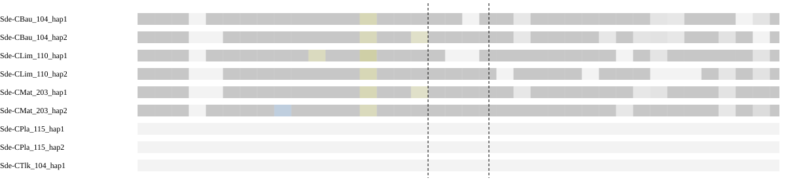
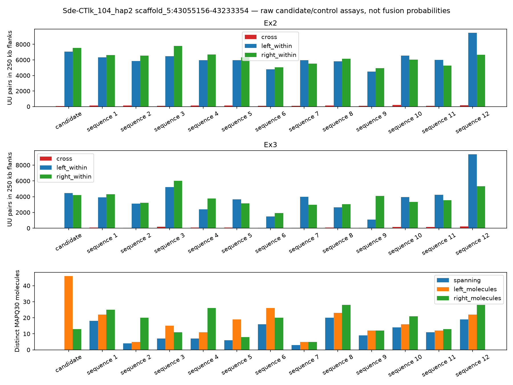
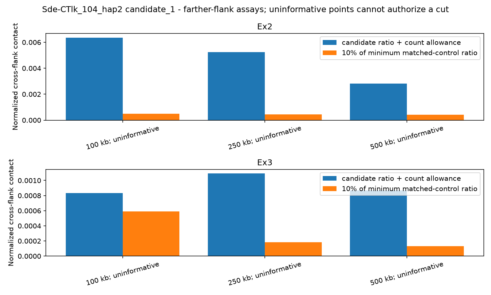
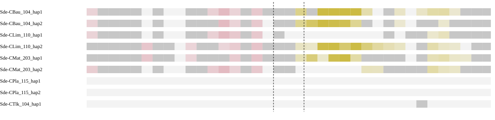
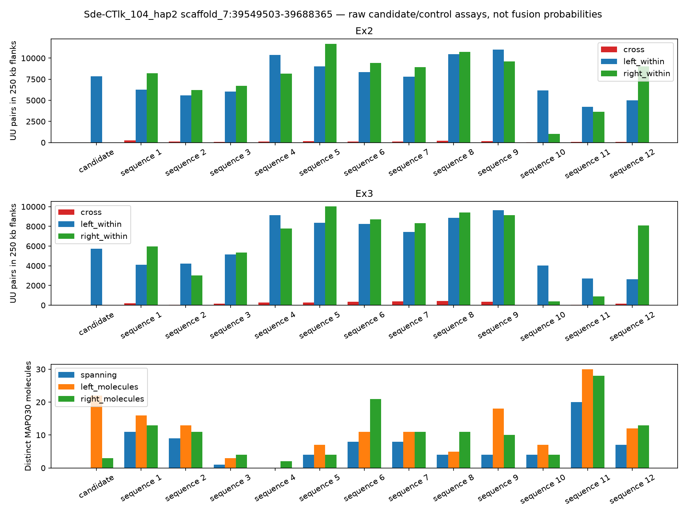
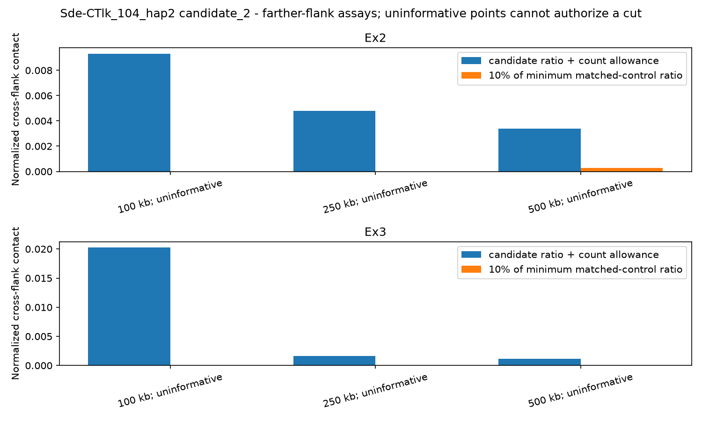

# Sde-CTlk_104_hap2 — chimera evidence

[Cohort report](../README.md) · [Cut instructions](../cut-interface.md)

## Assessment summary

2 candidate boundaries. All selections start at NO. Evidence generation applies no cuts.

Locations use the original pre-finishing FASTA. A proposed gap cut is a verified position for review, not approval to break.

## Candidate boundaries

IDs are scoped to this assembly; use assembly plus ID when referring to a decision. Review priorities organize measured evidence and do not approve cuts.

| Candidate | Scaffold | Chromosomes left → right | Region to review, bp | Exact cut, bp | Review priority | Evidence for cutting | Evidence against cutting |
| --- | --- | --- | --- | --- | --- | --- | --- |
| [C01](#candidate-c01) | scaffold_5 | Unresolved from qualified local alignments | 43055156–43233354 | Not assigned | Insufficient evidence to propose a break | No informative independent chromosome evidence supporting a break | No opposing chromosome evidence observed |
| [C02](#candidate-c02) | scaffold_7 | chr14 → chr4 | 39549503–39688365 | Not assigned | Investigate chromosome transition; exact cut not localized | Separate chromosomes: Sde-CBau_104: chr14 → chr4; Sde-CLim_110: chr14 → chr4; Sde-CMat_203: chr14 → chr4 | No opposing chromosome evidence observed |

## Candidate C01

**Scaffold:** scaffold_5. **Region to review:** 43055156–43233354 bp. **Exact cut:** Not assigned. **Selected:** NO.

**Why this location is a range:** Chromosome-transition interval is measured, but no unique failed seam or verified gap has been established inside it.

**Gap interval:** Unavailable–Unavailable. **Proposed action:** UNRESOLVED.

**Chromosomes left → right:** Unresolved from qualified local alignments.

**Review priority:** Insufficient evidence to propose a break.

**For cutting:** No informative independent chromosome evidence supporting a break.

**Against cutting:** No opposing chromosome evidence observed.

**Limits on the decision:** No informative two-sided chromosome assignment: Sde-CBau_104, Sde-CLim_110, Sde-CMat_203; Hi-C assay not calibrated/informative for a cut decision.

### Across-assembly chromosome evidence

| Peer assembly | Individual | Role | Left chromosome | Right chromosome | Aligned kb left/right | Assigned coverage left/right | Relationship | Measurement adequacy / limitation |
| --- | --- | --- | --- | --- | --- | --- | --- | --- |
| Sde-CBau_104_hap1 | Sde-CBau_104 | Independent comparison eligible | chr12 | chr7 | 86.6 / 106.9 | 10.2% / 12.6% | uninformative | left: assignment to chr12 has insufficient qualifying bases, dominance or informative bins; right: assignment to chr7 has insufficient qualifying bases, dominance or informative bins |
| Sde-CBau_104_hap2 | Sde-CBau_104 | Independent comparison eligible | chr12 | chr7 | 97.6 / 117.1 | 11.5% / 13.8% | uninformative | left: assignment to chr12 has insufficient qualifying bases, dominance or informative bins; right: assignment to chr7 has insufficient qualifying bases, dominance or informative bins |
| Sde-CLim_110_hap1 | Sde-CLim_110 | Independent comparison eligible | chr12 | chr7 | 102.4 / 96.7 | 12.0% / 11.4% | uninformative | left: assignment to chr12 has insufficient qualifying bases, dominance or informative bins; right: assignment to chr7 has insufficient qualifying bases, dominance or informative bins |
| Sde-CLim_110_hap2 | Sde-CLim_110 | Independent comparison eligible | chr12 | chr7 | 88.7 / 107.5 | 10.4% / 12.6% | uninformative | left: assignment to chr12 has insufficient qualifying bases, dominance or informative bins; right: assignment to chr7 has insufficient qualifying bases, dominance or informative bins |
| Sde-CMat_203_hap1 | Sde-CMat_203 | Independent comparison eligible | chr12 | chr7 | 81.3 / 119.5 | 9.6% / 14.1% | uninformative | left: assignment to chr12 has insufficient qualifying bases, dominance or informative bins; right: assignment to chr7 has insufficient qualifying bases, dominance or informative bins |
| Sde-CMat_203_hap2 | Sde-CMat_203 | Independent comparison eligible | chr12 | chr7 | 106.6 / 127.5 | 12.5% / 15.0% | uninformative | left: assignment to chr12 has insufficient qualifying bases, dominance or informative bins; right: assignment to chr7 has insufficient qualifying bases, dominance or informative bins |
| Sde-CPla_115_hap1 | Sde-CPla_115 | Context only | Unresolved | Unresolved | 0.0 / 0.0 | 0.0% / 0.0% | uninformative | left: no qualifying aligned bases after filtering; raw matches may exist; right: no qualifying aligned bases after filtering; raw matches may exist |
| Sde-CPla_115_hap2 | Sde-CPla_115 | Context only | Unresolved | Unresolved | 0.0 / 0.0 | 0.0% / 0.0% | uninformative | left: no qualifying aligned bases after filtering; raw matches may exist; right: no qualifying aligned bases after filtering; raw matches may exist |
| Sde-CTlk_104_hap1 | Sde-CTlk_104 | Same individual | Unresolved | Unresolved | 0.0 / 0.0 | 0.0% / 0.0% | uninformative | left: no qualifying aligned bases after filtering; raw matches may exist; right: no qualifying aligned bases after filtering; raw matches may exist |



Different chromosomes means the assessed sides map to separate chromosomes in the peer, not that the peer has a fusion. Haplotypes are grouped by individual in the summary. Absence of an expected homologous match can be evidence when sequence availability and assay sensitivity are established. Failure of a qualifying alignment filter alone does not establish biological absence; the coverage and limitation columns show what was measured.

### Local sequence and contact support

| Assay | Measurement |
| --- | --- |
| Qualified immediate HiFi spanning molecules | 0 |
| Qualified HiFi flank molecules left/right | 46 / 13 |
| HiFi informative | True |
| Graph context | screened_primary_contig_paths |

Zero spanning reads must be interpreted with flank coverage, ambiguity and interval width. Graph connectivity alone does not establish a correct join.

| HiFi offset kb | Left molecules | Right molecules | Spanning molecules | Median depth left/right | Flanks observable |
| --- | --- | --- | --- | --- | --- |
| 100 | 23 | 15 | 0 | 34.0 / 18.0 | True |
| 250 | 25 | 6 | 0 | 37.0 / 7.0 | False |
| 500 | 13 | 0 | 0 | 23.0 / 5.0 | False |

Observable distant flanks show reads are available on each side; no spanning reads across a long interval do not by themselves test the exact seam.

| Library | Offset kb | Cross pairs | Within left/right | Sequence/gap controls | Informative |
| --- | --- | --- | --- | --- | --- |
| Ex2 | 100 | 36 | 6090 / 6169 | 9 / 0 | False |
| Ex3 | 100 | Unavailable | 3791 / 3426 | 6 / 0 | False |
| Ex2 | 250 | 27 | 5747 / 5719 | 9 / 0 | False |
| Ex3 | 250 | 1 | 3541 / 3792 | 7 / 0 | False |
| Ex2 | 500 | 14 | 6924 / 5299 | 7 / 0 | False |
| Ex3 | 500 | Unavailable | 3470 / 3451 | 5 / 0 | False |





[IGV session: original coordinates](sequence-context/Sde-CTlk_104_hap2.sequence_context/candidate_1.igv.xml)

Scaffolding Hi-C is corroboration, not independent validation. Small control populations and poor observability limit conclusions from weak support.

**Decision needed:** review supporting, opposing and missing evidence before selecting an exact cut. Leave retained or unresolved rows at NO and record reviewer and rationale.

<details><summary>Full candidate measurements</summary>

```json
{
  "assessment_sha256": "121ce840edf743fb0a1c9bcc39ef210c241a585bd9e2f6dac3758176bc12ff19",
  "coordinate_stage": "pre_finishing",
  "packet_interval_id": "candidate_1",
  "verified_gap": false,
  "assessment_scaffold_length": 83430767,
  "hifi_spanning_molecules": 0,
  "local_path_support": "unresolved",
  "continuity_grid": {
    "step_bp": 1000,
    "anchor_bp": 1000,
    "minimum_molecules": 0,
    "supported_fraction": 0.9722222222222222,
    "probes": [
      {
        "cut_bp": 43055156,
        "molecules": 5
      },
      {
        "cut_bp": 43056156,
        "molecules": 4
      },
      {
        "cut_bp": 43057156,
        "molecules": 8
      },
      {
        "cut_bp": 43058156,
        "molecules": 10
      },
      {
        "cut_bp": 43059156,
        "molecules": 11
      },
      {
        "cut_bp": 43060156,
        "molecules": 10
      },
      {
        "cut_bp": 43061156,
        "molecules": 7
      },
      {
        "cut_bp": 43062156,
        "molecules": 5
      },
      {
        "cut_bp": 43063156,
        "molecules": 5
      },
      {
        "cut_bp": 43064156,
        "molecules": 11
      },
      {
        "cut_bp": 43065156,
        "molecules": 11
      },
      {
        "cut_bp": 43066156,
        "molecules": 10
      },
      {
        "cut_bp": 43067156,
        "molecules": 13
      },
      {
        "cut_bp": 43068156,
        "molecules": 6
      },
      {
        "cut_bp": 43069156,
        "molecules": 5
      },
      {
        "cut_bp": 43070156,
        "molecules": 9
      },
      {
        "cut_bp": 43071156,
        "molecules": 9
      },
      {
        "cut_bp": 43072156,
        "molecules": 4
      },
      {
        "cut_bp": 43073156,
        "molecules": 3
      },
      {
        "cut_bp": 43074156,
        "molecules": 9
      },
      {
        "cut_bp": 43075156,
        "molecules": 8
      },
      {
        "cut_bp": 43076156,
        "molecules": 4
      },
      {
        "cut_bp": 43077156,
        "molecules": 4
      },
      {
        "cut_bp": 43078156,
        "molecules": 3
      },
      {
        "cut_bp": 43079156,
        "molecules": 4
      },
      {
        "cut_bp": 43080156,
        "molecules": 3
      },
      {
        "cut_bp": 43081156,
        "molecules": 2
      },
      {
        "cut_bp": 43082156,
        "molecules": 2
      },
      {
        "cut_bp": 43083156,
        "molecules": 2
      },
      {
        "cut_bp": 43084156,
        "molecules": 4
      },
      {
        "cut_bp": 43085156,
        "molecules": 4
      },
      {
        "cut_bp": 43086156,
        "molecules": 4
      },
      {
        "cut_bp": 43087156,
        "molecules": 6
      },
      {
        "cut_bp": 43088156,
        "molecules": 6
      },
      {
        "cut_bp": 43089156,
        "molecules": 5
      },
      {
        "cut_bp": 43090156,
        "molecules": 5
      },
      {
        "cut_bp": 43091156,
        "molecules": 7
      },
      {
        "cut_bp": 43092156,
        "molecules": 8
      },
      {
        "cut_bp": 43093156,
        "molecules": 7
      },
      {
        "cut_bp": 43094156,
        "molecules": 7
      },
      {
        "cut_bp": 43095156,
        "molecules": 15
      },
      {
        "cut_bp": 43096156,
        "molecules": 8
      },
      {
        "cut_bp": 43097156,
        "molecules": 9
      },
      {
        "cut_bp": 43098156,
        "molecules": 16
      },
      {
        "cut_bp": 43099156,
        "molecules": 5
      },
      {
        "cut_bp": 43100156,
        "molecules": 2
      },
      {
        "cut_bp": 43101156,
        "molecules": 2
      },
      {
        "cut_bp": 43102156,
        "molecules": 3
      },
      {
        "cut_bp": 43103156,
        "molecules": 9
      },
      {
        "cut_bp": 43104156,
        "molecules": 2
      },
      {
        "cut_bp": 43105156,
        "molecules": 1
      },
      {
        "cut_bp": 43106156,
        "molecules": 3
      },
      {
        "cut_bp": 43107156,
        "molecules": 3
      },
      {
        "cut_bp": 43108156,
        "molecules": 3
      },
      {
        "cut_bp": 43109156,
        "molecules": 5
      },
      {
        "cut_bp": 43110156,
        "molecules": 8
      },
      {
        "cut_bp": 43111156,
        "molecules": 5
      },
      {
        "cut_bp": 43112156,
        "molecules": 7
      },
      {
        "cut_bp": 43113156,
        "molecules": 7
      },
      {
        "cut_bp": 43114156,
        "molecules": 9
      },
      {
        "cut_bp": 43115156,
        "molecules": 5
      },
      {
        "cut_bp": 43116156,
        "molecules": 5
      },
      {
        "cut_bp": 43117156,
        "molecules": 4
      },
      {
        "cut_bp": 43118156,
        "molecules": 6
      },
      {
        "cut_bp": 43119156,
        "molecules": 1
      },
      {
        "cut_bp": 43120156,
        "molecules": 3
      },
      {
        "cut_bp": 43121156,
        "molecules": 3
      },
      {
        "cut_bp": 43122156,
        "molecules": 2
      },
      {
        "cut_bp": 43123156,
        "molecules": 2
      },
      {
        "cut_bp": 43124156,
        "molecules": 7
      },
      {
        "cut_bp": 43125156,
        "molecules": 6
      },
      {
        "cut_bp": 43126156,
        "molecules": 4
      },
      {
        "cut_bp": 43127156,
        "molecules": 2
      },
      {
        "cut_bp": 43128156,
        "molecules": 6
      },
      {
        "cut_bp": 43129156,
        "molecules": 3
      },
      {
        "cut_bp": 43130156,
        "molecules": 3
      },
      {
        "cut_bp": 43131156,
        "molecules": 5
      },
      {
        "cut_bp": 43132156,
        "molecules": 5
      },
      {
        "cut_bp": 43133156,
        "molecules": 6
      },
      {
        "cut_bp": 43134156,
        "molecules": 6
      },
      {
        "cut_bp": 43135156,
        "molecules": 4
      },
      {
        "cut_bp": 43136156,
        "molecules": 5
      },
      {
        "cut_bp": 43137156,
        "molecules": 8
      },
      {
        "cut_bp": 43138156,
        "molecules": 3
      },
      {
        "cut_bp": 43139156,
        "molecules": 4
      },
      {
        "cut_bp": 43140156,
        "molecules": 6
      },
      {
        "cut_bp": 43141156,
        "molecules": 3
      },
      {
        "cut_bp": 43142156,
        "molecules": 3
      },
      {
        "cut_bp": 43143156,
        "molecules": 8
      },
      {
        "cut_bp": 43144156,
        "molecules": 8
      },
      {
        "cut_bp": 43145156,
        "molecules": 5
      },
      {
        "cut_bp": 43146156,
        "molecules": 5
      },
      {
        "cut_bp": 43147156,
        "molecules": 5
      },
      {
        "cut_bp": 43148156,
        "molecules": 5
      },
      {
        "cut_bp": 43149156,
        "molecules": 4
      },
      {
        "cut_bp": 43150156,
        "molecules": 9
      },
      {
        "cut_bp": 43151156,
        "molecules": 9
      },
      {
        "cut_bp": 43152156,
        "molecules": 7
      },
      {
        "cut_bp": 43153156,
        "molecules": 6
      },
      {
        "cut_bp": 43154156,
        "molecules": 9
      },
      {
        "cut_bp": 43155156,
        "molecules": 9
      },
      {
        "cut_bp": 43156156,
        "molecules": 11
      },
      {
        "cut_bp": 43157156,
        "molecules": 7
      },
      {
        "cut_bp": 43158156,
        "molecules": 9
      },
      {
        "cut_bp": 43159156,
        "molecules": 9
      },
      {
        "cut_bp": 43160156,
        "molecules": 9
      },
      {
        "cut_bp": 43161156,
        "molecules": 10
      },
      {
        "cut_bp": 43162156,
        "molecules": 7
      },
      {
        "cut_bp": 43163156,
        "molecules": 5
      },
      {
        "cut_bp": 43164156,
        "molecules": 3
      },
      {
        "cut_bp": 43165156,
        "molecules": 2
      },
      {
        "cut_bp": 43166156,
        "molecules": 2
      },
      {
        "cut_bp": 43167156,
        "molecules": 2
      },
      {
        "cut_bp": 43168156,
        "molecules": 3
      },
      {
        "cut_bp": 43169156,
        "molecules": 3
      },
      {
        "cut_bp": 43170156,
        "molecules": 4
      },
      {
        "cut_bp": 43171156,
        "molecules": 4
      },
      {
        "cut_bp": 43172156,
        "molecules": 5
      },
      {
        "cut_bp": 43173156,
        "molecules": 4
      },
      {
        "cut_bp": 43174156,
        "molecules": 5
      },
      {
        "cut_bp": 43175156,
        "molecules": 4
      },
      {
        "cut_bp": 43176156,
        "molecules": 2
      },
      {
        "cut_bp": 43177156,
        "molecules": 6
      },
      {
        "cut_bp": 43178156,
        "molecules": 10
      },
      {
        "cut_bp": 43179156,
        "molecules": 8
      },
      {
        "cut_bp": 43180156,
        "molecules": 4
      },
      {
        "cut_bp": 43181156,
        "molecules": 4
      },
      {
        "cut_bp": 43182156,
        "molecules": 8
      },
      {
        "cut_bp": 43183156,
        "molecules": 8
      },
      {
        "cut_bp": 43184156,
        "molecules": 12
      },
      {
        "cut_bp": 43185156,
        "molecules": 5
      },
      {
        "cut_bp": 43186156,
        "molecules": 6
      },
      {
        "cut_bp": 43187156,
        "molecules": 12
      },
      {
        "cut_bp": 43188156,
        "molecules": 9
      },
      {
        "cut_bp": 43189156,
        "molecules": 6
      },
      {
        "cut_bp": 43190156,
        "molecules": 5
      },
      {
        "cut_bp": 43191156,
        "molecules": 4
      },
      {
        "cut_bp": 43192156,
        "molecules": 2
      },
      {
        "cut_bp": 43193156,
        "molecules": 4
      },
      {
        "cut_bp": 43194156,
        "molecules": 5
      },
      {
        "cut_bp": 43195156,
        "molecules": 4
      },
      {
        "cut_bp": 43196156,
        "molecules": 3
      },
      {
        "cut_bp": 43197156,
        "molecules": 3
      },
      {
        "cut_bp": 43198156,
        "molecules": 7
      },
      {
        "cut_bp": 43199156,
        "molecules": 6
      },
      {
        "cut_bp": 43200156,
        "molecules": 3
      },
      {
        "cut_bp": 43201156,
        "molecules": 4
      },
      {
        "cut_bp": 43202156,
        "molecules": 3
      },
      {
        "cut_bp": 43203156,
        "molecules": 3
      },
      {
        "cut_bp": 43204156,
        "molecules": 2
      },
      {
        "cut_bp": 43205156,
        "molecules": 7
      },
      {
        "cut_bp": 43206156,
        "molecules": 5
      },
      {
        "cut_bp": 43207156,
        "molecules": 6
      },
      {
        "cut_bp": 43208156,
        "molecules": 2
      },
      {
        "cut_bp": 43209156,
        "molecules": 1
      },
      {
        "cut_bp": 43210156,
        "molecules": 3
      },
      {
        "cut_bp": 43211156,
        "molecules": 0
      },
      {
        "cut_bp": 43212156,
        "molecules": 1
      },
      {
        "cut_bp": 43213156,
        "molecules": 7
      },
      {
        "cut_bp": 43214156,
        "molecules": 8
      },
      {
        "cut_bp": 43215156,
        "molecules": 6
      },
      {
        "cut_bp": 43216156,
        "molecules": 4
      },
      {
        "cut_bp": 43217156,
        "molecules": 6
      },
      {
        "cut_bp": 43218156,
        "molecules": 6
      },
      {
        "cut_bp": 43219156,
        "molecules": 6
      },
      {
        "cut_bp": 43220156,
        "molecules": 7
      },
      {
        "cut_bp": 43221156,
        "molecules": 7
      },
      {
        "cut_bp": 43222156,
        "molecules": 5
      },
      {
        "cut_bp": 43223156,
        "molecules": 5
      },
      {
        "cut_bp": 43224156,
        "molecules": 7
      },
      {
        "cut_bp": 43225156,
        "molecules": 7
      },
      {
        "cut_bp": 43226156,
        "molecules": 8
      },
      {
        "cut_bp": 43227156,
        "molecules": 5
      },
      {
        "cut_bp": 43228156,
        "molecules": 4
      },
      {
        "cut_bp": 43229156,
        "molecules": 5
      },
      {
        "cut_bp": 43230156,
        "molecules": 6
      },
      {
        "cut_bp": 43231156,
        "molecules": 5
      },
      {
        "cut_bp": 43232156,
        "molecules": 5
      },
      {
        "cut_bp": 43233156,
        "molecules": 7
      },
      {
        "cut_bp": 43233354,
        "molecules": 7
      }
    ]
  },
  "graph_status": "screened_primary_contig_paths",
  "graph_contradiction": null,
  "native_continuity": true,
  "direct_native_link": false,
  "native_left": "h2tg000028l",
  "native_right": "h2tg000028l",
  "native_graph_sha256": "42b07a5e4428a2089d7b227f2fb1d3d4bc51ad978e01bde2b90c19d04307d3cc",
  "interpretation": "Primary path continuity alone is not read support or biological fusion confirmation; unmeasured unitig paths remain a limitation.",
  "chromosome_blocks": {
    "localized": false,
    "independent_individuals": [],
    "chromosome_pair": null,
    "contradictory_pairs": false,
    "peer_assays": [
      {
        "peer": "Sde-CBau_104_hap1",
        "sample": "Sde-CBau_104",
        "auto_evidence": true,
        "chromosome_pair": null,
        "qualified": false,
        "unique_gap_localization": false,
        "trials": [
          {
            "offset_bp": 100000,
            "left_chrom": null,
            "right_chrom": null,
            "left_target": null,
            "right_target": null,
            "usable": false,
            "left_edge": 42955156,
            "right_edge": 43333354
          },
          {
            "offset_bp": 250000,
            "left_chrom": null,
            "right_chrom": null,
            "left_target": null,
            "right_target": null,
            "usable": false,
            "left_edge": 42805156,
            "right_edge": 43483354
          },
          {
            "offset_bp": 500000,
            "left_chrom": null,
            "right_chrom": null,
            "left_target": null,
            "right_target": null,
            "usable": false,
            "left_edge": 42555156,
            "right_edge": 43733354
          }
        ]
      },
      {
        "peer": "Sde-CBau_104_hap2",
        "sample": "Sde-CBau_104",
        "auto_evidence": true,
        "chromosome_pair": null,
        "qualified": false,
        "unique_gap_localization": false,
        "trials": [
          {
            "offset_bp": 100000,
            "left_chrom": null,
            "right_chrom": null,
            "left_target": null,
            "right_target": null,
            "usable": false,
            "left_edge": 42955156,
            "right_edge": 43333354
          },
          {
            "offset_bp": 250000,
            "left_chrom": null,
            "right_chrom": null,
            "left_target": null,
            "right_target": null,
            "usable": false,
            "left_edge": 42805156,
            "right_edge": 43483354
          },
          {
            "offset_bp": 500000,
            "left_chrom": null,
            "right_chrom": null,
            "left_target": null,
            "right_target": null,
            "usable": false,
            "left_edge": 42555156,
            "right_edge": 43733354
          }
        ]
      },
      {
        "peer": "Sde-CLim_110_hap1",
        "sample": "Sde-CLim_110",
        "auto_evidence": true,
        "chromosome_pair": null,
        "qualified": false,
        "unique_gap_localization": false,
        "trials": [
          {
            "offset_bp": 100000,
            "left_chrom": null,
            "right_chrom": null,
            "left_target": null,
            "right_target": null,
            "usable": false,
            "left_edge": 42955156,
            "right_edge": 43333354
          },
          {
            "offset_bp": 250000,
            "left_chrom": null,
            "right_chrom": null,
            "left_target": null,
            "right_target": null,
            "usable": false,
            "left_edge": 42805156,
            "right_edge": 43483354
          },
          {
            "offset_bp": 500000,
            "left_chrom": null,
            "right_chrom": null,
            "left_target": null,
            "right_target": null,
            "usable": false,
            "left_edge": 42555156,
            "right_edge": 43733354
          }
        ]
      },
      {
        "peer": "Sde-CLim_110_hap2",
        "sample": "Sde-CLim_110",
        "auto_evidence": true,
        "chromosome_pair": null,
        "qualified": false,
        "unique_gap_localization": false,
        "trials": [
          {
            "offset_bp": 100000,
            "left_chrom": null,
            "right_chrom": null,
            "left_target": null,
            "right_target": null,
            "usable": false,
            "left_edge": 42955156,
            "right_edge": 43333354
          },
          {
            "offset_bp": 250000,
            "left_chrom": null,
            "right_chrom": null,
            "left_target": null,
            "right_target": null,
            "usable": false,
            "left_edge": 42805156,
            "right_edge": 43483354
          },
          {
            "offset_bp": 500000,
            "left_chrom": null,
            "right_chrom": null,
            "left_target": null,
            "right_target": null,
            "usable": false,
            "left_edge": 42555156,
            "right_edge": 43733354
          }
        ]
      },
      {
        "peer": "Sde-CMat_203_hap1",
        "sample": "Sde-CMat_203",
        "auto_evidence": true,
        "chromosome_pair": null,
        "qualified": false,
        "unique_gap_localization": false,
        "trials": [
          {
            "offset_bp": 100000,
            "left_chrom": null,
            "right_chrom": null,
            "left_target": null,
            "right_target": null,
            "usable": false,
            "left_edge": 42955156,
            "right_edge": 43333354
          },
          {
            "offset_bp": 250000,
            "left_chrom": null,
            "right_chrom": null,
            "left_target": null,
            "right_target": null,
            "usable": false,
            "left_edge": 42805156,
            "right_edge": 43483354
          },
          {
            "offset_bp": 500000,
            "left_chrom": null,
            "right_chrom": null,
            "left_target": null,
            "right_target": null,
            "usable": false,
            "left_edge": 42555156,
            "right_edge": 43733354
          }
        ]
      },
      {
        "peer": "Sde-CMat_203_hap2",
        "sample": "Sde-CMat_203",
        "auto_evidence": true,
        "chromosome_pair": null,
        "qualified": false,
        "unique_gap_localization": false,
        "trials": [
          {
            "offset_bp": 100000,
            "left_chrom": null,
            "right_chrom": null,
            "left_target": null,
            "right_target": null,
            "usable": false,
            "left_edge": 42955156,
            "right_edge": 43333354
          },
          {
            "offset_bp": 250000,
            "left_chrom": null,
            "right_chrom": null,
            "left_target": null,
            "right_target": null,
            "usable": false,
            "left_edge": 42805156,
            "right_edge": 43483354
          },
          {
            "offset_bp": 500000,
            "left_chrom": null,
            "right_chrom": null,
            "left_target": null,
            "right_target": null,
            "usable": false,
            "left_edge": 42555156,
            "right_edge": 43733354
          }
        ]
      },
      {
        "peer": "Sde-CPla_115_hap1",
        "sample": "Sde-CPla_115",
        "auto_evidence": false,
        "chromosome_pair": null,
        "qualified": false,
        "unique_gap_localization": false,
        "trials": [
          {
            "offset_bp": 100000,
            "left_chrom": null,
            "right_chrom": null,
            "left_target": null,
            "right_target": null,
            "usable": false,
            "left_edge": 42955156,
            "right_edge": 43333354
          },
          {
            "offset_bp": 250000,
            "left_chrom": null,
            "right_chrom": null,
            "left_target": null,
            "right_target": null,
            "usable": false,
            "left_edge": 42805156,
            "right_edge": 43483354
          },
          {
            "offset_bp": 500000,
            "left_chrom": null,
            "right_chrom": null,
            "left_target": null,
            "right_target": null,
            "usable": false,
            "left_edge": 42555156,
            "right_edge": 43733354
          }
        ]
      },
      {
        "peer": "Sde-CPla_115_hap2",
        "sample": "Sde-CPla_115",
        "auto_evidence": false,
        "chromosome_pair": null,
        "qualified": false,
        "unique_gap_localization": false,
        "trials": [
          {
            "offset_bp": 100000,
            "left_chrom": null,
            "right_chrom": null,
            "left_target": null,
            "right_target": null,
            "usable": false,
            "left_edge": 42955156,
            "right_edge": 43333354
          },
          {
            "offset_bp": 250000,
            "left_chrom": null,
            "right_chrom": null,
            "left_target": null,
            "right_target": null,
            "usable": false,
            "left_edge": 42805156,
            "right_edge": 43483354
          },
          {
            "offset_bp": 500000,
            "left_chrom": null,
            "right_chrom": null,
            "left_target": null,
            "right_target": null,
            "usable": false,
            "left_edge": 42555156,
            "right_edge": 43733354
          }
        ]
      },
      {
        "peer": "Sde-CTlk_104_hap1",
        "sample": "Sde-CTlk_104",
        "auto_evidence": true,
        "chromosome_pair": null,
        "qualified": false,
        "unique_gap_localization": false,
        "trials": [
          {
            "offset_bp": 100000,
            "left_chrom": null,
            "right_chrom": null,
            "left_target": null,
            "right_target": null,
            "usable": false,
            "left_edge": 42955156,
            "right_edge": 43333354
          },
          {
            "offset_bp": 250000,
            "left_chrom": null,
            "right_chrom": null,
            "left_target": null,
            "right_target": null,
            "usable": false,
            "left_edge": 42805156,
            "right_edge": 43483354
          },
          {
            "offset_bp": 500000,
            "left_chrom": null,
            "right_chrom": null,
            "left_target": null,
            "right_target": null,
            "usable": false,
            "left_edge": 42555156,
            "right_edge": 43733354
          }
        ]
      }
    ]
  },
  "farther_contact_evidence": {
    "supported_offsets": [],
    "pass_all": false,
    "contradictory_informative_trial": false,
    "trials": [
      {
        "offset_bp": 100000,
        "library": "Ex2",
        "informative": false,
        "control_populations": {
          "continuous_control": 9,
          "gap_control": 0
        },
        "matched_control_ids": [
          "continuous_b3ad6c4ac0225667772a",
          "continuous_d2018e0e887ce229d84f",
          "continuous_d31cf0d33699e4e24375",
          "continuous_837ab7bae6c37c77e2a2",
          "continuous_7143e7f4eab159fe0898",
          "continuous_b78fce3e9fbd1aa25f2e",
          "continuous_65ba78ec9e7df58ffd6b",
          "continuous_86fcf181556c7a874d48",
          "continuous_c5a6b135f80d2d1b9320"
        ],
        "minimum_control_ratio": 0.004882814221977546,
        "upper_count_allowance_ratio": 0.006362804441954467,
        "support_loss": false,
        "raw_counts": {
          "left_ends": 36708,
          "right_ends": 35152,
          "left_within": 6090,
          "cross": 36,
          "right_within": 6169
        }
      },
      {
        "offset_bp": 100000,
        "library": "Ex3",
        "informative": false,
        "control_populations": {
          "continuous_control": 6,
          "gap_control": 0
        },
        "matched_control_ids": [
          "continuous_b3ad6c4ac0225667772a",
          "continuous_d31cf0d33699e4e24375",
          "continuous_837ab7bae6c37c77e2a2",
          "continuous_7143e7f4eab159fe0898",
          "continuous_65ba78ec9e7df58ffd6b",
          "continuous_86fcf181556c7a874d48"
        ],
        "minimum_control_ratio": 0.005925476076140531,
        "upper_count_allowance_ratio": 0.0008324356731937155,
        "support_loss": false,
        "raw_counts": {
          "left_ends": 14746,
          "right_ends": 14324,
          "left_within": 3791,
          "right_within": 3426
        }
      },
      {
        "offset_bp": 250000,
        "library": "Ex2",
        "informative": false,
        "control_populations": {
          "continuous_control": 9,
          "gap_control": 0
        },
        "matched_control_ids": [
          "continuous_b3ad6c4ac0225667772a",
          "continuous_874b7a0ed021a004df85",
          "continuous_d31cf0d33699e4e24375",
          "continuous_93100c94682c58558aea",
          "continuous_837ab7bae6c37c77e2a2",
          "continuous_b78fce3e9fbd1aa25f2e",
          "continuous_65ba78ec9e7df58ffd6b",
          "continuous_86fcf181556c7a874d48",
          "continuous_c5a6b135f80d2d1b9320"
        ],
        "minimum_control_ratio": 0.004387460887695159,
        "upper_count_allowance_ratio": 0.005232877978552063,
        "support_loss": false,
        "raw_counts": {
          "right_ends": 32698,
          "left_ends": 35216,
          "left_within": 5747,
          "cross": 27,
          "right_within": 5719
        }
      },
      {
        "offset_bp": 250000,
        "library": "Ex3",
        "informative": false,
        "control_populations": {
          "continuous_control": 7,
          "gap_control": 0
        },
        "matched_control_ids": [
          "continuous_b3ad6c4ac0225667772a",
          "continuous_874b7a0ed021a004df85",
          "continuous_d31cf0d33699e4e24375",
          "continuous_93100c94682c58558aea",
          "continuous_837ab7bae6c37c77e2a2",
          "continuous_b78fce3e9fbd1aa25f2e",
          "continuous_86fcf181556c7a874d48"
        ],
        "minimum_control_ratio": 0.0018378627115783433,
        "upper_count_allowance_ratio": 0.0010915983325894489,
        "support_loss": false,
        "raw_counts": {
          "left_ends": 13998,
          "right_ends": 15497,
          "left_within": 3541,
          "cross": 1,
          "right_within": 3792
        }
      },
      {
        "offset_bp": 500000,
        "library": "Ex2",
        "informative": false,
        "control_populations": {
          "continuous_control": 7,
          "gap_control": 0
        },
        "matched_control_ids": [
          "continuous_874b7a0ed021a004df85",
          "continuous_d31cf0d33699e4e24375",
          "continuous_93100c94682c58558aea",
          "continuous_7143e7f4eab159fe0898",
          "continuous_45793210820b7e7f7271",
          "continuous_65ba78ec9e7df58ffd6b",
          "continuous_86fcf181556c7a874d48"
        ],
        "minimum_control_ratio": 0.0040956662267960684,
        "upper_count_allowance_ratio": 0.002806554189109386,
        "support_loss": false,
        "raw_counts": {
          "right_ends": 30104,
          "left_ends": 41244,
          "left_within": 6924,
          "cross": 14,
          "right_within": 5299
        }
      },
      {
        "offset_bp": 500000,
        "library": "Ex3",
        "informative": false,
        "control_populations": {
          "continuous_control": 5,
          "gap_control": 0
        },
        "matched_control_ids": [
          "continuous_874b7a0ed021a004df85",
          "continuous_d31cf0d33699e4e24375",
          "continuous_7143e7f4eab159fe0898",
          "continuous_45793210820b7e7f7271",
          "continuous_65ba78ec9e7df58ffd6b"
        ],
        "minimum_control_ratio": 0.0013253897455902614,
        "upper_count_allowance_ratio": 0.0008669300115037398,
        "support_loss": false,
        "raw_counts": {
          "left_ends": 13452,
          "right_ends": 13671,
          "left_within": 3470,
          "right_within": 3451
        }
      }
    ]
  },
  "farther_hifi": {
    "100000": {
      "informative": true,
      "raw": {
        "left_molecules": 23,
        "right_molecules": 15,
        "spanning": 0,
        "left_median_depth": 34.0,
        "right_median_depth": 18.0,
        "left_covered_fraction": 1.0,
        "right_covered_fraction": 1.0
      }
    },
    "250000": {
      "informative": false,
      "raw": {
        "left_molecules": 25,
        "right_molecules": 6,
        "spanning": 0,
        "left_median_depth": 37.0,
        "right_median_depth": 7.0,
        "left_covered_fraction": 1.0,
        "right_covered_fraction": 1.0
      }
    },
    "500000": {
      "informative": false,
      "raw": {
        "left_molecules": 13,
        "right_molecules": 0,
        "spanning": 0,
        "left_median_depth": 23.0,
        "right_median_depth": 5.0,
        "left_covered_fraction": 1.0,
        "right_covered_fraction": 0.952
      }
    }
  },
  "haplotype_block_conflict": false,
  "repeat_obscured_localization": false,
  "control_qualification": [
    {
      "id": "continuous_b3ad6c4ac0225667772a",
      "population": "continuous_control",
      "qualified": true,
      "reasons": []
    },
    {
      "id": "continuous_874b7a0ed021a004df85",
      "population": "continuous_control",
      "qualified": false,
      "reasons": [
        "uninformative_hifi_flanks"
      ]
    },
    {
      "id": "continuous_d2018e0e887ce229d84f",
      "population": "continuous_control",
      "qualified": true,
      "reasons": []
    },
    {
      "id": "continuous_d31cf0d33699e4e24375",
      "population": "continuous_control",
      "qualified": true,
      "reasons": []
    },
    {
      "id": "continuous_93100c94682c58558aea",
      "population": "continuous_control",
      "qualified": false,
      "reasons": [
        "uninformative_hifi_flanks"
      ]
    },
    {
      "id": "continuous_837ab7bae6c37c77e2a2",
      "population": "continuous_control",
      "qualified": true,
      "reasons": []
    },
    {
      "id": "continuous_7143e7f4eab159fe0898",
      "population": "continuous_control",
      "qualified": false,
      "reasons": [
        "uninformative_hifi_flanks"
      ]
    },
    {
      "id": "continuous_b78fce3e9fbd1aa25f2e",
      "population": "continuous_control",
      "qualified": true,
      "reasons": []
    },
    {
      "id": "continuous_45793210820b7e7f7271",
      "population": "continuous_control",
      "qualified": true,
      "reasons": []
    },
    {
      "id": "continuous_65ba78ec9e7df58ffd6b",
      "population": "continuous_control",
      "qualified": true,
      "reasons": []
    },
    {
      "id": "continuous_86fcf181556c7a874d48",
      "population": "continuous_control",
      "qualified": true,
      "reasons": []
    },
    {
      "id": "continuous_c5a6b135f80d2d1b9320",
      "population": "continuous_control",
      "qualified": true,
      "reasons": []
    }
  ],
  "hifi_informative": true,
  "matched_controls_pass": false,
  "hic_informative": false,
  "hic_support_loss": false,
  "libraries": [
    {
      "library": "Ex2",
      "matched_controls": 9,
      "control_populations": {
        "continuous_control": 9,
        "gap_control": 0
      },
      "informative": false,
      "ratio": 0.006984029734431563,
      "upper_count_allowance_ratio": 0.007394855012927538,
      "minimum_control_ratio": 0.013068961370028656,
      "support_loss": false,
      "raw_counts": {
        "left_ends": 41407,
        "right_ends": 42136,
        "left_within": 7061,
        "cross": 51,
        "right_within": 7552
      }
    },
    {
      "library": "Ex3",
      "matched_controls": 6,
      "control_populations": {
        "continuous_control": 6,
        "gap_control": 0
      },
      "informative": false,
      "ratio": 0.0,
      "upper_count_allowance_ratio": 0.000694060523441305,
      "minimum_control_ratio": 0.019271278758741562,
      "support_loss": false,
      "raw_counts": {
        "left_ends": 16940,
        "right_ends": 17365,
        "left_within": 4442,
        "right_within": 4206
      }
    }
  ],
  "independent_discordant_individuals": 0,
  "alternative_placements_checked": true,
  "control_ids": [
    "continuous_b3ad6c4ac0225667772a",
    "continuous_874b7a0ed021a004df85",
    "continuous_d2018e0e887ce229d84f",
    "continuous_d31cf0d33699e4e24375",
    "continuous_93100c94682c58558aea",
    "continuous_837ab7bae6c37c77e2a2",
    "continuous_7143e7f4eab159fe0898",
    "continuous_b78fce3e9fbd1aa25f2e",
    "continuous_45793210820b7e7f7271",
    "continuous_65ba78ec9e7df58ffd6b",
    "continuous_86fcf181556c7a874d48",
    "continuous_c5a6b135f80d2d1b9320"
  ],
  "hifi_raw": {
    "left_molecules": 46,
    "right_molecules": 13,
    "spanning": 0,
    "left_median_depth": 54.0,
    "right_median_depth": 16.0,
    "left_covered_fraction": 1.0,
    "right_covered_fraction": 1.0
  },
  "alternative_placement_scope": "Assessment BAM MAPQ and competing peer anchors; bounded emitted alternatives, no proof of haplotype-specific uniqueness",
  "chromosome_tracks": [
    {
      "peer": "Sde-CBau_104_hap1",
      "sample": "Sde-CBau_104",
      "auto_evidence": true,
      "relationship": "uninformative",
      "bins": [
        {
          "lo": 0,
          "hi": 50000,
          "aligned_bp": 2585,
          "ambiguous_bp": 1870,
          "dominance": 0.9945841392649903,
          "chrom": null,
          "counts": {
            "chr12": 2571,
            "chr13": 14,
            "chr10": 0,
            "chr7": 0,
            "chr6": 0
          }
        },
        {
          "lo": 50000,
          "hi": 100000,
          "aligned_bp": 1476,
          "ambiguous_bp": 0,
          "dominance": 1.0,
          "chrom": null,
          "counts": {
            "chr12": 1476,
            "chr13": 0,
            "chr10": 0,
            "chr7": 0,
            "chr6": 0
          }
        },
        {
          "lo": 100000,
          "hi": 150000,
          "aligned_bp": 3003,
          "ambiguous_bp": 0,
          "dominance": 1.0,
          "chrom": null,
          "counts": {
            "chr12": 3003,
            "chr13": 0,
            "chr10": 0,
            "chr7": 0,
            "chr6": 0
          }
        },
        {
          "lo": 150000,
          "hi": 200000,
          "aligned_bp": 0,
          "ambiguous_bp": 0,
          "dominance": 0.0,
          "chrom": null,
          "counts": {
            "chr12": 0,
            "chr13": 0,
            "chr10": 0,
            "chr7": 0,
            "chr6": 0
          }
        },
        {
          "lo": 200000,
          "hi": 250000,
          "aligned_bp": 1494,
          "ambiguous_bp": 0,
          "dominance": 1.0,
          "chrom": null,
          "counts": {
            "chr12": 1494,
            "chr13": 0,
            "chr10": 0,
            "chr7": 0,
            "chr6": 0
          }
        },
        {
          "lo": 250000,
          "hi": 300000,
          "aligned_bp": 1664,
          "ambiguous_bp": 0,
          "dominance": 1.0,
          "chrom": null,
          "counts": {
            "chr12": 1664,
            "chr13": 0,
            "chr10": 0,
            "chr7": 0,
            "chr6": 0
          }
        },
        {
          "lo": 300000,
          "hi": 350000,
          "aligned_bp": 3178,
          "ambiguous_bp": 0,
          "dominance": 1.0,
          "chrom": null,
          "counts": {
            "chr12": 3178,
            "chr13": 0,
            "chr10": 0,
            "chr7": 0,
            "chr6": 0
          }
        },
        {
          "lo": 350000,
          "hi": 400000,
          "aligned_bp": 9384,
          "ambiguous_bp": 0,
          "dominance": 1.0,
          "chrom": null,
          "counts": {
            "chr12": 9384,
            "chr13": 0,
            "chr10": 0,
            "chr7": 0,
            "chr6": 0
          }
        },
        {
          "lo": 400000,
          "hi": 450000,
          "aligned_bp": 1276,
          "ambiguous_bp": 0,
          "dominance": 1.0,
          "chrom": null,
          "counts": {
            "chr12": 1276,
            "chr13": 0,
            "chr10": 0,
            "chr7": 0,
            "chr6": 0
          }
        },
        {
          "lo": 450000,
          "hi": 500000,
          "aligned_bp": 9791,
          "ambiguous_bp": 0,
          "dominance": 1.0,
          "chrom": null,
          "counts": {
            "chr12": 9791,
            "chr13": 0,
            "chr10": 0,
            "chr7": 0,
            "chr6": 0
          }
        },
        {
          "lo": 500000,
          "hi": 550000,
          "aligned_bp": 9050,
          "ambiguous_bp": 0,
          "dominance": 1.0,
          "chrom": null,
          "counts": {
            "chr12": 9050,
            "chr13": 0,
            "chr10": 0,
            "chr7": 0,
            "chr6": 0
          }
        },
        {
          "lo": 550000,
          "hi": 600000,
          "aligned_bp": 3014,
          "ambiguous_bp": 0,
          "dominance": 1.0,
          "chrom": null,
          "counts": {
            "chr12": 3014,
            "chr13": 0,
            "chr10": 0,
            "chr7": 0,
            "chr6": 0
          }
        },
        {
          "lo": 600000,
          "hi": 650000,
          "aligned_bp": 6580,
          "ambiguous_bp": 0,
          "dominance": 1.0,
          "chrom": null,
          "counts": {
            "chr12": 6580,
            "chr13": 0,
            "chr10": 0,
            "chr7": 0,
            "chr6": 0
          }
        },
        {
          "lo": 650000,
          "hi": 700000,
          "aligned_bp": 16076,
          "ambiguous_bp": 0,
          "dominance": 1.0,
          "chrom": "chr12",
          "counts": {
            "chr12": 16076,
            "chr13": 0,
            "chr10": 0,
            "chr7": 0,
            "chr6": 0
          }
        },
        {
          "lo": 700000,
          "hi": 750000,
          "aligned_bp": 4082,
          "ambiguous_bp": 0,
          "dominance": 1.0,
          "chrom": null,
          "counts": {
            "chr12": 4082,
            "chr13": 0,
            "chr10": 0,
            "chr7": 0,
            "chr6": 0
          }
        },
        {
          "lo": 750000,
          "hi": 800000,
          "aligned_bp": 1213,
          "ambiguous_bp": 0,
          "dominance": 1.0,
          "chrom": null,
          "counts": {
            "chr12": 1213,
            "chr13": 0,
            "chr10": 0,
            "chr7": 0,
            "chr6": 0
          }
        },
        {
          "lo": 800000,
          "hi": 850000,
          "aligned_bp": 12783,
          "ambiguous_bp": 0,
          "dominance": 0.7506062739575999,
          "chrom": null,
          "counts": {
            "chr12": 9595,
            "chr13": 0,
            "chr10": 3188,
            "chr7": 0,
            "chr6": 0
          }
        },
        {
          "lo": 850000,
          "hi": 900000,
          "aligned_bp": 12818,
          "ambiguous_bp": 0,
          "dominance": 0.6579809642689968,
          "chrom": null,
          "counts": {
            "chr12": 8434,
            "chr13": 0,
            "chr10": 0,
            "chr7": 4384,
            "chr6": 0
          }
        },
        {
          "lo": 900000,
          "hi": 950000,
          "aligned_bp": 6470,
          "ambiguous_bp": 4,
          "dominance": 0.9230293663060278,
          "chrom": null,
          "counts": {
            "chr12": 498,
            "chr13": 0,
            "chr10": 0,
            "chr7": 0,
            "chr6": 5972
          }
        },
        {
          "lo": 950000,
          "hi": 1000000,
          "aligned_bp": 0,
          "ambiguous_bp": 0,
          "dominance": 0.0,
          "chrom": null,
          "counts": {
            "chr12": 0,
            "chr13": 0,
            "chr10": 0,
            "chr7": 0,
            "chr6": 0
          }
        },
        {
          "lo": 1000000,
          "hi": 1050000,
          "aligned_bp": 2577,
          "ambiguous_bp": 0,
          "dominance": 1.0,
          "chrom": null,
          "counts": {
            "chr12": 0,
            "chr13": 0,
            "chr10": 0,
            "chr7": 2577,
            "chr6": 0
          }
        },
        {
          "lo": 1050000,
          "hi": 1100000,
          "aligned_bp": 1498,
          "ambiguous_bp": 0,
          "dominance": 1.0,
          "chrom": null,
          "counts": {
            "chr12": 0,
            "chr13": 0,
            "chr10": 0,
            "chr7": 1498,
            "chr6": 0
          }
        },
        {
          "lo": 1100000,
          "hi": 1150000,
          "aligned_bp": 11594,
          "ambiguous_bp": 0,
          "dominance": 1.0,
          "chrom": "chr7",
          "counts": {
            "chr12": 0,
            "chr13": 0,
            "chr10": 0,
            "chr7": 11594,
            "chr6": 0
          }
        },
        {
          "lo": 1150000,
          "hi": 1200000,
          "aligned_bp": 4129,
          "ambiguous_bp": 0,
          "dominance": 1.0,
          "chrom": null,
          "counts": {
            "chr12": 0,
            "chr13": 0,
            "chr10": 0,
            "chr7": 4129,
            "chr6": 0
          }
        },
        {
          "lo": 1200000,
          "hi": 1250000,
          "aligned_bp": 3493,
          "ambiguous_bp": 0,
          "dominance": 1.0,
          "chrom": null,
          "counts": {
            "chr12": 0,
            "chr13": 0,
            "chr10": 0,
            "chr7": 3493,
            "chr6": 0
          }
        },
        {
          "lo": 1250000,
          "hi": 1300000,
          "aligned_bp": 5104,
          "ambiguous_bp": 0,
          "dominance": 1.0,
          "chrom": null,
          "counts": {
            "chr12": 0,
            "chr13": 0,
            "chr10": 0,
            "chr7": 5104,
            "chr6": 0
          }
        },
        {
          "lo": 1300000,
          "hi": 1350000,
          "aligned_bp": 2245,
          "ambiguous_bp": 0,
          "dominance": 1.0,
          "chrom": null,
          "counts": {
            "chr12": 0,
            "chr13": 0,
            "chr10": 0,
            "chr7": 2245,
            "chr6": 0
          }
        },
        {
          "lo": 1350000,
          "hi": 1400000,
          "aligned_bp": 8501,
          "ambiguous_bp": 0,
          "dominance": 1.0,
          "chrom": null,
          "counts": {
            "chr12": 0,
            "chr13": 0,
            "chr10": 0,
            "chr7": 8501,
            "chr6": 0
          }
        },
        {
          "lo": 1400000,
          "hi": 1450000,
          "aligned_bp": 3286,
          "ambiguous_bp": 0,
          "dominance": 1.0,
          "chrom": null,
          "counts": {
            "chr12": 0,
            "chr13": 0,
            "chr10": 0,
            "chr7": 3286,
            "chr6": 0
          }
        },
        {
          "lo": 1450000,
          "hi": 1500000,
          "aligned_bp": 3627,
          "ambiguous_bp": 0,
          "dominance": 1.0,
          "chrom": null,
          "counts": {
            "chr12": 0,
            "chr13": 0,
            "chr10": 0,
            "chr7": 3627,
            "chr6": 0
          }
        },
        {
          "lo": 1500000,
          "hi": 1550000,
          "aligned_bp": 13587,
          "ambiguous_bp": 0,
          "dominance": 1.0,
          "chrom": "chr7",
          "counts": {
            "chr12": 0,
            "chr13": 0,
            "chr10": 0,
            "chr7": 13587,
            "chr6": 0
          }
        },
        {
          "lo": 1550000,
          "hi": 1600000,
          "aligned_bp": 11153,
          "ambiguous_bp": 0,
          "dominance": 1.0,
          "chrom": "chr7",
          "counts": {
            "chr12": 0,
            "chr13": 0,
            "chr10": 0,
            "chr7": 11153,
            "chr6": 0
          }
        },
        {
          "lo": 1600000,
          "hi": 1650000,
          "aligned_bp": 6535,
          "ambiguous_bp": 0,
          "dominance": 1.0,
          "chrom": null,
          "counts": {
            "chr12": 0,
            "chr13": 0,
            "chr10": 0,
            "chr7": 6535,
            "chr6": 0
          }
        },
        {
          "lo": 1650000,
          "hi": 1700000,
          "aligned_bp": 2223,
          "ambiguous_bp": 0,
          "dominance": 1.0,
          "chrom": null,
          "counts": {
            "chr12": 0,
            "chr13": 0,
            "chr10": 0,
            "chr7": 2223,
            "chr6": 0
          }
        },
        {
          "lo": 1700000,
          "hi": 1750000,
          "aligned_bp": 9466,
          "ambiguous_bp": 37,
          "dominance": 1.0,
          "chrom": null,
          "counts": {
            "chr12": 0,
            "chr13": 0,
            "chr10": 0,
            "chr7": 9466,
            "chr6": 0
          }
        },
        {
          "lo": 1750000,
          "hi": 1800000,
          "aligned_bp": 0,
          "ambiguous_bp": 0,
          "dominance": 0.0,
          "chrom": null,
          "counts": {
            "chr12": 0,
            "chr13": 0,
            "chr10": 0,
            "chr7": 0,
            "chr6": 0
          }
        },
        {
          "lo": 1800000,
          "hi": 1850000,
          "aligned_bp": 15017,
          "ambiguous_bp": 0,
          "dominance": 1.0,
          "chrom": "chr7",
          "counts": {
            "chr12": 0,
            "chr13": 0,
            "chr10": 0,
            "chr7": 15017,
            "chr6": 0
          }
        },
        {
          "lo": 1850000,
          "hi": 1878198,
          "aligned_bp": 3416,
          "ambiguous_bp": 0,
          "dominance": 1.0,
          "chrom": null,
          "counts": {
            "chr12": 0,
            "chr13": 0,
            "chr10": 0,
            "chr7": 3416,
            "chr6": 0
          }
        }
      ],
      "left": {
        "chrom": "chr12",
        "aligned_bp": 86649,
        "coverage": 0.10194,
        "dominance": 0.9630463132869392,
        "informative_bins": 1,
        "qualified": false
      },
      "right": {
        "chrom": "chr7",
        "aligned_bp": 106918,
        "coverage": 0.12578588235294116,
        "dominance": 1.0,
        "informative_bins": 4,
        "qualified": false
      }
    },
    {
      "peer": "Sde-CBau_104_hap2",
      "sample": "Sde-CBau_104",
      "auto_evidence": true,
      "relationship": "uninformative",
      "bins": [
        {
          "lo": 0,
          "hi": 50000,
          "aligned_bp": 2927,
          "ambiguous_bp": 1542,
          "dominance": 0.8831568158524086,
          "chrom": null,
          "counts": {
            "chr12": 2585,
            "chr13": 342,
            "chr3": 0,
            "chr7": 0,
            "chr8": 0,
            "chr2": 0,
            "chr10": 0,
            "chr11": 0
          }
        },
        {
          "lo": 50000,
          "hi": 100000,
          "aligned_bp": 1476,
          "ambiguous_bp": 0,
          "dominance": 1.0,
          "chrom": null,
          "counts": {
            "chr12": 1476,
            "chr13": 0,
            "chr3": 0,
            "chr7": 0,
            "chr8": 0,
            "chr2": 0,
            "chr10": 0,
            "chr11": 0
          }
        },
        {
          "lo": 100000,
          "hi": 150000,
          "aligned_bp": 3003,
          "ambiguous_bp": 0,
          "dominance": 1.0,
          "chrom": null,
          "counts": {
            "chr12": 3003,
            "chr13": 0,
            "chr3": 0,
            "chr7": 0,
            "chr8": 0,
            "chr2": 0,
            "chr10": 0,
            "chr11": 0
          }
        },
        {
          "lo": 150000,
          "hi": 200000,
          "aligned_bp": 0,
          "ambiguous_bp": 0,
          "dominance": 0.0,
          "chrom": null,
          "counts": {
            "chr12": 0,
            "chr13": 0,
            "chr3": 0,
            "chr7": 0,
            "chr8": 0,
            "chr2": 0,
            "chr10": 0,
            "chr11": 0
          }
        },
        {
          "lo": 200000,
          "hi": 250000,
          "aligned_bp": 0,
          "ambiguous_bp": 0,
          "dominance": 0.0,
          "chrom": null,
          "counts": {
            "chr12": 0,
            "chr13": 0,
            "chr3": 0,
            "chr7": 0,
            "chr8": 0,
            "chr2": 0,
            "chr10": 0,
            "chr11": 0
          }
        },
        {
          "lo": 250000,
          "hi": 300000,
          "aligned_bp": 1664,
          "ambiguous_bp": 0,
          "dominance": 1.0,
          "chrom": null,
          "counts": {
            "chr12": 1664,
            "chr13": 0,
            "chr3": 0,
            "chr7": 0,
            "chr8": 0,
            "chr2": 0,
            "chr10": 0,
            "chr11": 0
          }
        },
        {
          "lo": 300000,
          "hi": 350000,
          "aligned_bp": 3178,
          "ambiguous_bp": 0,
          "dominance": 1.0,
          "chrom": null,
          "counts": {
            "chr12": 3178,
            "chr13": 0,
            "chr3": 0,
            "chr7": 0,
            "chr8": 0,
            "chr2": 0,
            "chr10": 0,
            "chr11": 0
          }
        },
        {
          "lo": 350000,
          "hi": 400000,
          "aligned_bp": 8612,
          "ambiguous_bp": 0,
          "dominance": 1.0,
          "chrom": null,
          "counts": {
            "chr12": 8612,
            "chr13": 0,
            "chr3": 0,
            "chr7": 0,
            "chr8": 0,
            "chr2": 0,
            "chr10": 0,
            "chr11": 0
          }
        },
        {
          "lo": 400000,
          "hi": 450000,
          "aligned_bp": 15391,
          "ambiguous_bp": 0,
          "dominance": 0.8966278994217399,
          "chrom": null,
          "counts": {
            "chr12": 1591,
            "chr13": 0,
            "chr3": 13800,
            "chr7": 0,
            "chr8": 0,
            "chr2": 0,
            "chr10": 0,
            "chr11": 0
          }
        },
        {
          "lo": 450000,
          "hi": 500000,
          "aligned_bp": 9788,
          "ambiguous_bp": 0,
          "dominance": 1.0,
          "chrom": null,
          "counts": {
            "chr12": 9788,
            "chr13": 0,
            "chr3": 0,
            "chr7": 0,
            "chr8": 0,
            "chr2": 0,
            "chr10": 0,
            "chr11": 0
          }
        },
        {
          "lo": 500000,
          "hi": 550000,
          "aligned_bp": 9036,
          "ambiguous_bp": 0,
          "dominance": 1.0,
          "chrom": null,
          "counts": {
            "chr12": 9036,
            "chr13": 0,
            "chr3": 0,
            "chr7": 0,
            "chr8": 0,
            "chr2": 0,
            "chr10": 0,
            "chr11": 0
          }
        },
        {
          "lo": 550000,
          "hi": 600000,
          "aligned_bp": 3011,
          "ambiguous_bp": 0,
          "dominance": 1.0,
          "chrom": null,
          "counts": {
            "chr12": 3011,
            "chr13": 0,
            "chr3": 0,
            "chr7": 0,
            "chr8": 0,
            "chr2": 0,
            "chr10": 0,
            "chr11": 0
          }
        },
        {
          "lo": 600000,
          "hi": 650000,
          "aligned_bp": 6576,
          "ambiguous_bp": 0,
          "dominance": 1.0,
          "chrom": null,
          "counts": {
            "chr12": 6576,
            "chr13": 0,
            "chr3": 0,
            "chr7": 0,
            "chr8": 0,
            "chr2": 0,
            "chr10": 0,
            "chr11": 0
          }
        },
        {
          "lo": 650000,
          "hi": 700000,
          "aligned_bp": 14554,
          "ambiguous_bp": 0,
          "dominance": 1.0,
          "chrom": "chr12",
          "counts": {
            "chr12": 14554,
            "chr13": 0,
            "chr3": 0,
            "chr7": 0,
            "chr8": 0,
            "chr2": 0,
            "chr10": 0,
            "chr11": 0
          }
        },
        {
          "lo": 700000,
          "hi": 750000,
          "aligned_bp": 4082,
          "ambiguous_bp": 0,
          "dominance": 1.0,
          "chrom": null,
          "counts": {
            "chr12": 4082,
            "chr13": 0,
            "chr3": 0,
            "chr7": 0,
            "chr8": 0,
            "chr2": 0,
            "chr10": 0,
            "chr11": 0
          }
        },
        {
          "lo": 750000,
          "hi": 800000,
          "aligned_bp": 3024,
          "ambiguous_bp": 0,
          "dominance": 1.0,
          "chrom": null,
          "counts": {
            "chr12": 3024,
            "chr13": 0,
            "chr3": 0,
            "chr7": 0,
            "chr8": 0,
            "chr2": 0,
            "chr10": 0,
            "chr11": 0
          }
        },
        {
          "lo": 800000,
          "hi": 850000,
          "aligned_bp": 11236,
          "ambiguous_bp": 0,
          "dominance": 1.0,
          "chrom": "chr12",
          "counts": {
            "chr12": 11236,
            "chr13": 0,
            "chr3": 0,
            "chr7": 0,
            "chr8": 0,
            "chr2": 0,
            "chr10": 0,
            "chr11": 0
          }
        },
        {
          "lo": 850000,
          "hi": 900000,
          "aligned_bp": 13945,
          "ambiguous_bp": 0,
          "dominance": 0.6048045894585873,
          "chrom": null,
          "counts": {
            "chr12": 8434,
            "chr13": 0,
            "chr3": 0,
            "chr7": 4613,
            "chr8": 898,
            "chr2": 0,
            "chr10": 0,
            "chr11": 0
          }
        },
        {
          "lo": 900000,
          "hi": 950000,
          "aligned_bp": 8481,
          "ambiguous_bp": 2094,
          "dominance": 0.7912981959674567,
          "chrom": null,
          "counts": {
            "chr12": 0,
            "chr13": 6711,
            "chr3": 0,
            "chr7": 0,
            "chr8": 0,
            "chr2": 5,
            "chr10": 1765,
            "chr11": 0
          }
        },
        {
          "lo": 950000,
          "hi": 1000000,
          "aligned_bp": 2250,
          "ambiguous_bp": 307,
          "dominance": 1.0,
          "chrom": null,
          "counts": {
            "chr12": 0,
            "chr13": 0,
            "chr3": 0,
            "chr7": 0,
            "chr8": 0,
            "chr2": 0,
            "chr10": 2250,
            "chr11": 0
          }
        },
        {
          "lo": 1000000,
          "hi": 1050000,
          "aligned_bp": 3133,
          "ambiguous_bp": 0,
          "dominance": 0.7443345036706033,
          "chrom": null,
          "counts": {
            "chr12": 0,
            "chr13": 0,
            "chr3": 0,
            "chr7": 2332,
            "chr8": 0,
            "chr2": 0,
            "chr10": 0,
            "chr11": 801
          }
        },
        {
          "lo": 1050000,
          "hi": 1100000,
          "aligned_bp": 1323,
          "ambiguous_bp": 0,
          "dominance": 1.0,
          "chrom": null,
          "counts": {
            "chr12": 0,
            "chr13": 0,
            "chr3": 0,
            "chr7": 1323,
            "chr8": 0,
            "chr2": 0,
            "chr10": 0,
            "chr11": 0
          }
        },
        {
          "lo": 1100000,
          "hi": 1150000,
          "aligned_bp": 10033,
          "ambiguous_bp": 0,
          "dominance": 1.0,
          "chrom": "chr7",
          "counts": {
            "chr12": 0,
            "chr13": 0,
            "chr3": 0,
            "chr7": 10033,
            "chr8": 0,
            "chr2": 0,
            "chr10": 0,
            "chr11": 0
          }
        },
        {
          "lo": 1150000,
          "hi": 1200000,
          "aligned_bp": 6534,
          "ambiguous_bp": 0,
          "dominance": 1.0,
          "chrom": null,
          "counts": {
            "chr12": 0,
            "chr13": 0,
            "chr3": 0,
            "chr7": 6534,
            "chr8": 0,
            "chr2": 0,
            "chr10": 0,
            "chr11": 0
          }
        },
        {
          "lo": 1200000,
          "hi": 1250000,
          "aligned_bp": 5734,
          "ambiguous_bp": 0,
          "dominance": 1.0,
          "chrom": null,
          "counts": {
            "chr12": 0,
            "chr13": 0,
            "chr3": 0,
            "chr7": 5734,
            "chr8": 0,
            "chr2": 0,
            "chr10": 0,
            "chr11": 0
          }
        },
        {
          "lo": 1250000,
          "hi": 1300000,
          "aligned_bp": 6016,
          "ambiguous_bp": 0,
          "dominance": 1.0,
          "chrom": null,
          "counts": {
            "chr12": 0,
            "chr13": 0,
            "chr3": 0,
            "chr7": 6016,
            "chr8": 0,
            "chr2": 0,
            "chr10": 0,
            "chr11": 0
          }
        },
        {
          "lo": 1300000,
          "hi": 1350000,
          "aligned_bp": 3420,
          "ambiguous_bp": 0,
          "dominance": 1.0,
          "chrom": null,
          "counts": {
            "chr12": 0,
            "chr13": 0,
            "chr3": 0,
            "chr7": 3420,
            "chr8": 0,
            "chr2": 0,
            "chr10": 0,
            "chr11": 0
          }
        },
        {
          "lo": 1350000,
          "hi": 1400000,
          "aligned_bp": 11225,
          "ambiguous_bp": 0,
          "dominance": 1.0,
          "chrom": "chr7",
          "counts": {
            "chr12": 0,
            "chr13": 0,
            "chr3": 0,
            "chr7": 11225,
            "chr8": 0,
            "chr2": 0,
            "chr10": 0,
            "chr11": 0
          }
        },
        {
          "lo": 1400000,
          "hi": 1450000,
          "aligned_bp": 4023,
          "ambiguous_bp": 0,
          "dominance": 1.0,
          "chrom": null,
          "counts": {
            "chr12": 0,
            "chr13": 0,
            "chr3": 0,
            "chr7": 4023,
            "chr8": 0,
            "chr2": 0,
            "chr10": 0,
            "chr11": 0
          }
        },
        {
          "lo": 1450000,
          "hi": 1500000,
          "aligned_bp": 12885,
          "ambiguous_bp": 0,
          "dominance": 1.0,
          "chrom": "chr7",
          "counts": {
            "chr12": 0,
            "chr13": 0,
            "chr3": 0,
            "chr7": 12885,
            "chr8": 0,
            "chr2": 0,
            "chr10": 0,
            "chr11": 0
          }
        },
        {
          "lo": 1500000,
          "hi": 1550000,
          "aligned_bp": 15427,
          "ambiguous_bp": 0,
          "dominance": 1.0,
          "chrom": "chr7",
          "counts": {
            "chr12": 0,
            "chr13": 0,
            "chr3": 0,
            "chr7": 15427,
            "chr8": 0,
            "chr2": 0,
            "chr10": 0,
            "chr11": 0
          }
        },
        {
          "lo": 1550000,
          "hi": 1600000,
          "aligned_bp": 10138,
          "ambiguous_bp": 0,
          "dominance": 1.0,
          "chrom": "chr7",
          "counts": {
            "chr12": 0,
            "chr13": 0,
            "chr3": 0,
            "chr7": 10138,
            "chr8": 0,
            "chr2": 0,
            "chr10": 0,
            "chr11": 0
          }
        },
        {
          "lo": 1600000,
          "hi": 1650000,
          "aligned_bp": 1696,
          "ambiguous_bp": 0,
          "dominance": 1.0,
          "chrom": null,
          "counts": {
            "chr12": 0,
            "chr13": 0,
            "chr3": 0,
            "chr7": 1696,
            "chr8": 0,
            "chr2": 0,
            "chr10": 0,
            "chr11": 0
          }
        },
        {
          "lo": 1650000,
          "hi": 1700000,
          "aligned_bp": 6868,
          "ambiguous_bp": 0,
          "dominance": 1.0,
          "chrom": null,
          "counts": {
            "chr12": 0,
            "chr13": 0,
            "chr3": 0,
            "chr7": 6868,
            "chr8": 0,
            "chr2": 0,
            "chr10": 0,
            "chr11": 0
          }
        },
        {
          "lo": 1700000,
          "hi": 1750000,
          "aligned_bp": 15394,
          "ambiguous_bp": 0,
          "dominance": 1.0,
          "chrom": "chr7",
          "counts": {
            "chr12": 0,
            "chr13": 0,
            "chr3": 0,
            "chr7": 15394,
            "chr8": 0,
            "chr2": 0,
            "chr10": 0,
            "chr11": 0
          }
        },
        {
          "lo": 1750000,
          "hi": 1800000,
          "aligned_bp": 3315,
          "ambiguous_bp": 0,
          "dominance": 1.0,
          "chrom": null,
          "counts": {
            "chr12": 0,
            "chr13": 0,
            "chr3": 0,
            "chr7": 3315,
            "chr8": 0,
            "chr2": 0,
            "chr10": 0,
            "chr11": 0
          }
        },
        {
          "lo": 1800000,
          "hi": 1850000,
          "aligned_bp": 0,
          "ambiguous_bp": 0,
          "dominance": 0.0,
          "chrom": null,
          "counts": {
            "chr12": 0,
            "chr13": 0,
            "chr3": 0,
            "chr7": 0,
            "chr8": 0,
            "chr2": 0,
            "chr10": 0,
            "chr11": 0
          }
        },
        {
          "lo": 1850000,
          "hi": 1878198,
          "aligned_bp": 1856,
          "ambiguous_bp": 0,
          "dominance": 1.0,
          "chrom": null,
          "counts": {
            "chr12": 0,
            "chr13": 0,
            "chr3": 0,
            "chr7": 1856,
            "chr8": 0,
            "chr2": 0,
            "chr10": 0,
            "chr11": 0
          }
        }
      ],
      "left": {
        "chrom": "chr12",
        "aligned_bp": 97558,
        "coverage": 0.11477411764705882,
        "dominance": 0.8550400787224011,
        "informative_bins": 2,
        "qualified": false
      },
      "right": {
        "chrom": "chr7",
        "aligned_bp": 117070,
        "coverage": 0.13772941176470588,
        "dominance": 1.0,
        "informative_bins": 6,
        "qualified": false
      }
    },
    {
      "peer": "Sde-CLim_110_hap1",
      "sample": "Sde-CLim_110",
      "auto_evidence": true,
      "relationship": "uninformative",
      "bins": [
        {
          "lo": 0,
          "hi": 50000,
          "aligned_bp": 8123,
          "ambiguous_bp": 0,
          "dominance": 0.7678197710205589,
          "chrom": null,
          "counts": {
            "chr12": 6237,
            "chr13": 1886,
            "chr10": 0,
            "chr8": 0,
            "chr5": 0,
            "chr4": 0,
            "chr7": 0,
            "chr11": 0
          }
        },
        {
          "lo": 50000,
          "hi": 100000,
          "aligned_bp": 7207,
          "ambiguous_bp": 0,
          "dominance": 1.0,
          "chrom": null,
          "counts": {
            "chr12": 7207,
            "chr13": 0,
            "chr10": 0,
            "chr8": 0,
            "chr5": 0,
            "chr4": 0,
            "chr7": 0,
            "chr11": 0
          }
        },
        {
          "lo": 100000,
          "hi": 150000,
          "aligned_bp": 4009,
          "ambiguous_bp": 0,
          "dominance": 1.0,
          "chrom": null,
          "counts": {
            "chr12": 4009,
            "chr13": 0,
            "chr10": 0,
            "chr8": 0,
            "chr5": 0,
            "chr4": 0,
            "chr7": 0,
            "chr11": 0
          }
        },
        {
          "lo": 150000,
          "hi": 200000,
          "aligned_bp": 0,
          "ambiguous_bp": 0,
          "dominance": 0.0,
          "chrom": null,
          "counts": {
            "chr12": 0,
            "chr13": 0,
            "chr10": 0,
            "chr8": 0,
            "chr5": 0,
            "chr4": 0,
            "chr7": 0,
            "chr11": 0
          }
        },
        {
          "lo": 200000,
          "hi": 250000,
          "aligned_bp": 6595,
          "ambiguous_bp": 0,
          "dominance": 1.0,
          "chrom": null,
          "counts": {
            "chr12": 6595,
            "chr13": 0,
            "chr10": 0,
            "chr8": 0,
            "chr5": 0,
            "chr4": 0,
            "chr7": 0,
            "chr11": 0
          }
        },
        {
          "lo": 250000,
          "hi": 300000,
          "aligned_bp": 7543,
          "ambiguous_bp": 0,
          "dominance": 1.0,
          "chrom": null,
          "counts": {
            "chr12": 7543,
            "chr13": 0,
            "chr10": 0,
            "chr8": 0,
            "chr5": 0,
            "chr4": 0,
            "chr7": 0,
            "chr11": 0
          }
        },
        {
          "lo": 300000,
          "hi": 350000,
          "aligned_bp": 4026,
          "ambiguous_bp": 0,
          "dominance": 1.0,
          "chrom": null,
          "counts": {
            "chr12": 4026,
            "chr13": 0,
            "chr10": 0,
            "chr8": 0,
            "chr5": 0,
            "chr4": 0,
            "chr7": 0,
            "chr11": 0
          }
        },
        {
          "lo": 350000,
          "hi": 400000,
          "aligned_bp": 3135,
          "ambiguous_bp": 0,
          "dominance": 1.0,
          "chrom": null,
          "counts": {
            "chr12": 3135,
            "chr13": 0,
            "chr10": 0,
            "chr8": 0,
            "chr5": 0,
            "chr4": 0,
            "chr7": 0,
            "chr11": 0
          }
        },
        {
          "lo": 400000,
          "hi": 450000,
          "aligned_bp": 1176,
          "ambiguous_bp": 0,
          "dominance": 1.0,
          "chrom": null,
          "counts": {
            "chr12": 1176,
            "chr13": 0,
            "chr10": 0,
            "chr8": 0,
            "chr5": 0,
            "chr4": 0,
            "chr7": 0,
            "chr11": 0
          }
        },
        {
          "lo": 450000,
          "hi": 500000,
          "aligned_bp": 1777,
          "ambiguous_bp": 0,
          "dominance": 1.0,
          "chrom": null,
          "counts": {
            "chr12": 1777,
            "chr13": 0,
            "chr10": 0,
            "chr8": 0,
            "chr5": 0,
            "chr4": 0,
            "chr7": 0,
            "chr11": 0
          }
        },
        {
          "lo": 500000,
          "hi": 550000,
          "aligned_bp": 13324,
          "ambiguous_bp": 0,
          "dominance": 1.0,
          "chrom": "chr12",
          "counts": {
            "chr12": 13324,
            "chr13": 0,
            "chr10": 0,
            "chr8": 0,
            "chr5": 0,
            "chr4": 0,
            "chr7": 0,
            "chr11": 0
          }
        },
        {
          "lo": 550000,
          "hi": 600000,
          "aligned_bp": 4737,
          "ambiguous_bp": 0,
          "dominance": 1.0,
          "chrom": null,
          "counts": {
            "chr12": 4737,
            "chr13": 0,
            "chr10": 0,
            "chr8": 0,
            "chr5": 0,
            "chr4": 0,
            "chr7": 0,
            "chr11": 0
          }
        },
        {
          "lo": 600000,
          "hi": 650000,
          "aligned_bp": 1971,
          "ambiguous_bp": 0,
          "dominance": 1.0,
          "chrom": null,
          "counts": {
            "chr12": 1971,
            "chr13": 0,
            "chr10": 0,
            "chr8": 0,
            "chr5": 0,
            "chr4": 0,
            "chr7": 0,
            "chr11": 0
          }
        },
        {
          "lo": 650000,
          "hi": 700000,
          "aligned_bp": 20183,
          "ambiguous_bp": 0,
          "dominance": 1.0,
          "chrom": "chr12",
          "counts": {
            "chr12": 20183,
            "chr13": 0,
            "chr10": 0,
            "chr8": 0,
            "chr5": 0,
            "chr4": 0,
            "chr7": 0,
            "chr11": 0
          }
        },
        {
          "lo": 700000,
          "hi": 750000,
          "aligned_bp": 6290,
          "ambiguous_bp": 0,
          "dominance": 1.0,
          "chrom": null,
          "counts": {
            "chr12": 6290,
            "chr13": 0,
            "chr10": 0,
            "chr8": 0,
            "chr5": 0,
            "chr4": 0,
            "chr7": 0,
            "chr11": 0
          }
        },
        {
          "lo": 750000,
          "hi": 800000,
          "aligned_bp": 2104,
          "ambiguous_bp": 0,
          "dominance": 1.0,
          "chrom": null,
          "counts": {
            "chr12": 2104,
            "chr13": 0,
            "chr10": 0,
            "chr8": 0,
            "chr5": 0,
            "chr4": 0,
            "chr7": 0,
            "chr11": 0
          }
        },
        {
          "lo": 800000,
          "hi": 850000,
          "aligned_bp": 10180,
          "ambiguous_bp": 0,
          "dominance": 0.6634577603143419,
          "chrom": null,
          "counts": {
            "chr12": 6754,
            "chr13": 0,
            "chr10": 3426,
            "chr8": 0,
            "chr5": 0,
            "chr4": 0,
            "chr7": 0,
            "chr11": 0
          }
        },
        {
          "lo": 850000,
          "hi": 900000,
          "aligned_bp": 11808,
          "ambiguous_bp": 193,
          "dominance": 0.6944444444444444,
          "chrom": null,
          "counts": {
            "chr12": 8200,
            "chr13": 0,
            "chr10": 0,
            "chr8": 597,
            "chr5": 3011,
            "chr4": 0,
            "chr7": 0,
            "chr11": 0
          }
        },
        {
          "lo": 900000,
          "hi": 950000,
          "aligned_bp": 0,
          "ambiguous_bp": 0,
          "dominance": 0.0,
          "chrom": null,
          "counts": {
            "chr12": 0,
            "chr13": 0,
            "chr10": 0,
            "chr8": 0,
            "chr5": 0,
            "chr4": 0,
            "chr7": 0,
            "chr11": 0
          }
        },
        {
          "lo": 950000,
          "hi": 1000000,
          "aligned_bp": 0,
          "ambiguous_bp": 0,
          "dominance": 0.0,
          "chrom": null,
          "counts": {
            "chr12": 0,
            "chr13": 0,
            "chr10": 0,
            "chr8": 0,
            "chr5": 0,
            "chr4": 0,
            "chr7": 0,
            "chr11": 0
          }
        },
        {
          "lo": 1000000,
          "hi": 1050000,
          "aligned_bp": 5529,
          "ambiguous_bp": 0,
          "dominance": 1.0,
          "chrom": null,
          "counts": {
            "chr12": 0,
            "chr13": 0,
            "chr10": 0,
            "chr8": 5529,
            "chr5": 0,
            "chr4": 0,
            "chr7": 0,
            "chr11": 0
          }
        },
        {
          "lo": 1050000,
          "hi": 1100000,
          "aligned_bp": 2177,
          "ambiguous_bp": 0,
          "dominance": 0.7657326596233348,
          "chrom": null,
          "counts": {
            "chr12": 0,
            "chr13": 0,
            "chr10": 0,
            "chr8": 399,
            "chr5": 0,
            "chr4": 1667,
            "chr7": 111,
            "chr11": 0
          }
        },
        {
          "lo": 1100000,
          "hi": 1150000,
          "aligned_bp": 9686,
          "ambiguous_bp": 0,
          "dominance": 1.0,
          "chrom": null,
          "counts": {
            "chr12": 0,
            "chr13": 0,
            "chr10": 0,
            "chr8": 0,
            "chr5": 0,
            "chr4": 0,
            "chr7": 9686,
            "chr11": 0
          }
        },
        {
          "lo": 1150000,
          "hi": 1200000,
          "aligned_bp": 5231,
          "ambiguous_bp": 0,
          "dominance": 1.0,
          "chrom": null,
          "counts": {
            "chr12": 0,
            "chr13": 0,
            "chr10": 0,
            "chr8": 0,
            "chr5": 0,
            "chr4": 0,
            "chr7": 5231,
            "chr11": 0
          }
        },
        {
          "lo": 1200000,
          "hi": 1250000,
          "aligned_bp": 1466,
          "ambiguous_bp": 0,
          "dominance": 1.0,
          "chrom": null,
          "counts": {
            "chr12": 0,
            "chr13": 0,
            "chr10": 0,
            "chr8": 0,
            "chr5": 0,
            "chr4": 0,
            "chr7": 1466,
            "chr11": 0
          }
        },
        {
          "lo": 1250000,
          "hi": 1300000,
          "aligned_bp": 5214,
          "ambiguous_bp": 0,
          "dominance": 0.6440352896049099,
          "chrom": null,
          "counts": {
            "chr12": 0,
            "chr13": 0,
            "chr10": 0,
            "chr8": 0,
            "chr5": 0,
            "chr4": 0,
            "chr7": 3358,
            "chr11": 1856
          }
        },
        {
          "lo": 1300000,
          "hi": 1350000,
          "aligned_bp": 6783,
          "ambiguous_bp": 0,
          "dominance": 1.0,
          "chrom": null,
          "counts": {
            "chr12": 0,
            "chr13": 0,
            "chr10": 6783,
            "chr8": 0,
            "chr5": 0,
            "chr4": 0,
            "chr7": 0,
            "chr11": 0
          }
        },
        {
          "lo": 1350000,
          "hi": 1400000,
          "aligned_bp": 7387,
          "ambiguous_bp": 0,
          "dominance": 1.0,
          "chrom": null,
          "counts": {
            "chr12": 0,
            "chr13": 0,
            "chr10": 0,
            "chr8": 7387,
            "chr5": 0,
            "chr4": 0,
            "chr7": 0,
            "chr11": 0
          }
        },
        {
          "lo": 1400000,
          "hi": 1450000,
          "aligned_bp": 0,
          "ambiguous_bp": 0,
          "dominance": 0.0,
          "chrom": null,
          "counts": {
            "chr12": 0,
            "chr13": 0,
            "chr10": 0,
            "chr8": 0,
            "chr5": 0,
            "chr4": 0,
            "chr7": 0,
            "chr11": 0
          }
        },
        {
          "lo": 1450000,
          "hi": 1500000,
          "aligned_bp": 4744,
          "ambiguous_bp": 0,
          "dominance": 0.9378161888701517,
          "chrom": null,
          "counts": {
            "chr12": 0,
            "chr13": 0,
            "chr10": 0,
            "chr8": 0,
            "chr5": 0,
            "chr4": 0,
            "chr7": 295,
            "chr11": 4449
          }
        },
        {
          "lo": 1500000,
          "hi": 1550000,
          "aligned_bp": 13031,
          "ambiguous_bp": 0,
          "dominance": 1.0,
          "chrom": "chr7",
          "counts": {
            "chr12": 0,
            "chr13": 0,
            "chr10": 0,
            "chr8": 0,
            "chr5": 0,
            "chr4": 0,
            "chr7": 13031,
            "chr11": 0
          }
        },
        {
          "lo": 1550000,
          "hi": 1600000,
          "aligned_bp": 3621,
          "ambiguous_bp": 0,
          "dominance": 1.0,
          "chrom": null,
          "counts": {
            "chr12": 0,
            "chr13": 0,
            "chr10": 0,
            "chr8": 0,
            "chr5": 0,
            "chr4": 0,
            "chr7": 3621,
            "chr11": 0
          }
        },
        {
          "lo": 1600000,
          "hi": 1650000,
          "aligned_bp": 2282,
          "ambiguous_bp": 0,
          "dominance": 1.0,
          "chrom": null,
          "counts": {
            "chr12": 0,
            "chr13": 0,
            "chr10": 0,
            "chr8": 0,
            "chr5": 0,
            "chr4": 0,
            "chr7": 2282,
            "chr11": 0
          }
        },
        {
          "lo": 1650000,
          "hi": 1700000,
          "aligned_bp": 7658,
          "ambiguous_bp": 0,
          "dominance": 1.0,
          "chrom": null,
          "counts": {
            "chr12": 0,
            "chr13": 0,
            "chr10": 0,
            "chr8": 0,
            "chr5": 0,
            "chr4": 0,
            "chr7": 7658,
            "chr11": 0
          }
        },
        {
          "lo": 1700000,
          "hi": 1750000,
          "aligned_bp": 2737,
          "ambiguous_bp": 0,
          "dominance": 1.0,
          "chrom": null,
          "counts": {
            "chr12": 0,
            "chr13": 0,
            "chr10": 0,
            "chr8": 0,
            "chr5": 0,
            "chr4": 0,
            "chr7": 2737,
            "chr11": 0
          }
        },
        {
          "lo": 1750000,
          "hi": 1800000,
          "aligned_bp": 3735,
          "ambiguous_bp": 0,
          "dominance": 1.0,
          "chrom": null,
          "counts": {
            "chr12": 0,
            "chr13": 0,
            "chr10": 0,
            "chr8": 0,
            "chr5": 0,
            "chr4": 0,
            "chr7": 3735,
            "chr11": 0
          }
        },
        {
          "lo": 1800000,
          "hi": 1850000,
          "aligned_bp": 14828,
          "ambiguous_bp": 0,
          "dominance": 1.0,
          "chrom": "chr7",
          "counts": {
            "chr12": 0,
            "chr13": 0,
            "chr10": 0,
            "chr8": 0,
            "chr5": 0,
            "chr4": 0,
            "chr7": 14828,
            "chr11": 0
          }
        },
        {
          "lo": 1850000,
          "hi": 1878198,
          "aligned_bp": 553,
          "ambiguous_bp": 0,
          "dominance": 1.0,
          "chrom": null,
          "counts": {
            "chr12": 0,
            "chr13": 0,
            "chr10": 0,
            "chr8": 0,
            "chr5": 0,
            "chr4": 0,
            "chr7": 553,
            "chr11": 0
          }
        }
      ],
      "left": {
        "chrom": "chr12",
        "aligned_bp": 102380,
        "coverage": 0.12044705882352941,
        "dominance": 0.9481148661848017,
        "informative_bins": 2,
        "qualified": false
      },
      "right": {
        "chrom": "chr7",
        "aligned_bp": 96662,
        "coverage": 0.11372,
        "dominance": 0.7096066706668598,
        "informative_bins": 2,
        "qualified": false
      }
    },
    {
      "peer": "Sde-CLim_110_hap2",
      "sample": "Sde-CLim_110",
      "auto_evidence": true,
      "relationship": "uninformative",
      "bins": [
        {
          "lo": 0,
          "hi": 50000,
          "aligned_bp": 4578,
          "ambiguous_bp": 10918,
          "dominance": 0.5646570554827436,
          "chrom": null,
          "counts": {
            "chr12": 2585,
            "chr13": 1993,
            "chr10": 0,
            "chr4": 0,
            "chr8": 0,
            "chr2": 0,
            "chr1": 0,
            "chr7": 0,
            "chr3": 0
          }
        },
        {
          "lo": 50000,
          "hi": 100000,
          "aligned_bp": 1476,
          "ambiguous_bp": 0,
          "dominance": 1.0,
          "chrom": null,
          "counts": {
            "chr12": 1476,
            "chr13": 0,
            "chr10": 0,
            "chr4": 0,
            "chr8": 0,
            "chr2": 0,
            "chr1": 0,
            "chr7": 0,
            "chr3": 0
          }
        },
        {
          "lo": 100000,
          "hi": 150000,
          "aligned_bp": 3003,
          "ambiguous_bp": 0,
          "dominance": 1.0,
          "chrom": null,
          "counts": {
            "chr12": 3003,
            "chr13": 0,
            "chr10": 0,
            "chr4": 0,
            "chr8": 0,
            "chr2": 0,
            "chr1": 0,
            "chr7": 0,
            "chr3": 0
          }
        },
        {
          "lo": 150000,
          "hi": 200000,
          "aligned_bp": 0,
          "ambiguous_bp": 0,
          "dominance": 0.0,
          "chrom": null,
          "counts": {
            "chr12": 0,
            "chr13": 0,
            "chr10": 0,
            "chr4": 0,
            "chr8": 0,
            "chr2": 0,
            "chr1": 0,
            "chr7": 0,
            "chr3": 0
          }
        },
        {
          "lo": 200000,
          "hi": 250000,
          "aligned_bp": 0,
          "ambiguous_bp": 0,
          "dominance": 0.0,
          "chrom": null,
          "counts": {
            "chr12": 0,
            "chr13": 0,
            "chr10": 0,
            "chr4": 0,
            "chr8": 0,
            "chr2": 0,
            "chr1": 0,
            "chr7": 0,
            "chr3": 0
          }
        },
        {
          "lo": 250000,
          "hi": 300000,
          "aligned_bp": 5007,
          "ambiguous_bp": 2,
          "dominance": 1.0,
          "chrom": null,
          "counts": {
            "chr12": 5007,
            "chr13": 0,
            "chr10": 0,
            "chr4": 0,
            "chr8": 0,
            "chr2": 0,
            "chr1": 0,
            "chr7": 0,
            "chr3": 0
          }
        },
        {
          "lo": 300000,
          "hi": 350000,
          "aligned_bp": 3178,
          "ambiguous_bp": 0,
          "dominance": 1.0,
          "chrom": null,
          "counts": {
            "chr12": 3178,
            "chr13": 0,
            "chr10": 0,
            "chr4": 0,
            "chr8": 0,
            "chr2": 0,
            "chr1": 0,
            "chr7": 0,
            "chr3": 0
          }
        },
        {
          "lo": 350000,
          "hi": 400000,
          "aligned_bp": 8138,
          "ambiguous_bp": 0,
          "dominance": 1.0,
          "chrom": null,
          "counts": {
            "chr12": 8138,
            "chr13": 0,
            "chr10": 0,
            "chr4": 0,
            "chr8": 0,
            "chr2": 0,
            "chr1": 0,
            "chr7": 0,
            "chr3": 0
          }
        },
        {
          "lo": 400000,
          "hi": 450000,
          "aligned_bp": 1591,
          "ambiguous_bp": 0,
          "dominance": 1.0,
          "chrom": null,
          "counts": {
            "chr12": 1591,
            "chr13": 0,
            "chr10": 0,
            "chr4": 0,
            "chr8": 0,
            "chr2": 0,
            "chr1": 0,
            "chr7": 0,
            "chr3": 0
          }
        },
        {
          "lo": 450000,
          "hi": 500000,
          "aligned_bp": 9791,
          "ambiguous_bp": 0,
          "dominance": 1.0,
          "chrom": null,
          "counts": {
            "chr12": 9791,
            "chr13": 0,
            "chr10": 0,
            "chr4": 0,
            "chr8": 0,
            "chr2": 0,
            "chr1": 0,
            "chr7": 0,
            "chr3": 0
          }
        },
        {
          "lo": 500000,
          "hi": 550000,
          "aligned_bp": 9860,
          "ambiguous_bp": 0,
          "dominance": 1.0,
          "chrom": null,
          "counts": {
            "chr12": 9860,
            "chr13": 0,
            "chr10": 0,
            "chr4": 0,
            "chr8": 0,
            "chr2": 0,
            "chr1": 0,
            "chr7": 0,
            "chr3": 0
          }
        },
        {
          "lo": 550000,
          "hi": 600000,
          "aligned_bp": 3010,
          "ambiguous_bp": 0,
          "dominance": 1.0,
          "chrom": null,
          "counts": {
            "chr12": 3010,
            "chr13": 0,
            "chr10": 0,
            "chr4": 0,
            "chr8": 0,
            "chr2": 0,
            "chr1": 0,
            "chr7": 0,
            "chr3": 0
          }
        },
        {
          "lo": 600000,
          "hi": 650000,
          "aligned_bp": 4863,
          "ambiguous_bp": 0,
          "dominance": 1.0,
          "chrom": null,
          "counts": {
            "chr12": 4863,
            "chr13": 0,
            "chr10": 0,
            "chr4": 0,
            "chr8": 0,
            "chr2": 0,
            "chr1": 0,
            "chr7": 0,
            "chr3": 0
          }
        },
        {
          "lo": 650000,
          "hi": 700000,
          "aligned_bp": 16087,
          "ambiguous_bp": 0,
          "dominance": 1.0,
          "chrom": "chr12",
          "counts": {
            "chr12": 16087,
            "chr13": 0,
            "chr10": 0,
            "chr4": 0,
            "chr8": 0,
            "chr2": 0,
            "chr1": 0,
            "chr7": 0,
            "chr3": 0
          }
        },
        {
          "lo": 700000,
          "hi": 750000,
          "aligned_bp": 4082,
          "ambiguous_bp": 0,
          "dominance": 1.0,
          "chrom": null,
          "counts": {
            "chr12": 4082,
            "chr13": 0,
            "chr10": 0,
            "chr4": 0,
            "chr8": 0,
            "chr2": 0,
            "chr1": 0,
            "chr7": 0,
            "chr3": 0
          }
        },
        {
          "lo": 750000,
          "hi": 800000,
          "aligned_bp": 1213,
          "ambiguous_bp": 0,
          "dominance": 1.0,
          "chrom": null,
          "counts": {
            "chr12": 1213,
            "chr13": 0,
            "chr10": 0,
            "chr4": 0,
            "chr8": 0,
            "chr2": 0,
            "chr1": 0,
            "chr7": 0,
            "chr3": 0
          }
        },
        {
          "lo": 800000,
          "hi": 850000,
          "aligned_bp": 12783,
          "ambiguous_bp": 0,
          "dominance": 0.7506062739575999,
          "chrom": null,
          "counts": {
            "chr12": 9595,
            "chr13": 0,
            "chr10": 3188,
            "chr4": 0,
            "chr8": 0,
            "chr2": 0,
            "chr1": 0,
            "chr7": 0,
            "chr3": 0
          }
        },
        {
          "lo": 850000,
          "hi": 900000,
          "aligned_bp": 11697,
          "ambiguous_bp": 2151,
          "dominance": 0.7210395827990083,
          "chrom": null,
          "counts": {
            "chr12": 8434,
            "chr13": 0,
            "chr10": 0,
            "chr4": 3255,
            "chr8": 8,
            "chr2": 0,
            "chr1": 0,
            "chr7": 0,
            "chr3": 0
          }
        },
        {
          "lo": 900000,
          "hi": 950000,
          "aligned_bp": 5984,
          "ambiguous_bp": 1,
          "dominance": 1.0,
          "chrom": null,
          "counts": {
            "chr12": 0,
            "chr13": 5984,
            "chr10": 0,
            "chr4": 0,
            "chr8": 0,
            "chr2": 0,
            "chr1": 0,
            "chr7": 0,
            "chr3": 0
          }
        },
        {
          "lo": 950000,
          "hi": 1000000,
          "aligned_bp": 4993,
          "ambiguous_bp": 7365,
          "dominance": 1.0,
          "chrom": null,
          "counts": {
            "chr12": 0,
            "chr13": 0,
            "chr10": 0,
            "chr4": 0,
            "chr8": 0,
            "chr2": 4993,
            "chr1": 0,
            "chr7": 0,
            "chr3": 0
          }
        },
        {
          "lo": 1000000,
          "hi": 1050000,
          "aligned_bp": 7058,
          "ambiguous_bp": 0,
          "dominance": 0.7371776707282516,
          "chrom": null,
          "counts": {
            "chr12": 0,
            "chr13": 1855,
            "chr10": 0,
            "chr4": 0,
            "chr8": 0,
            "chr2": 0,
            "chr1": 5203,
            "chr7": 0,
            "chr3": 0
          }
        },
        {
          "lo": 1050000,
          "hi": 1100000,
          "aligned_bp": 0,
          "ambiguous_bp": 0,
          "dominance": 0.0,
          "chrom": null,
          "counts": {
            "chr12": 0,
            "chr13": 0,
            "chr10": 0,
            "chr4": 0,
            "chr8": 0,
            "chr2": 0,
            "chr1": 0,
            "chr7": 0,
            "chr3": 0
          }
        },
        {
          "lo": 1100000,
          "hi": 1150000,
          "aligned_bp": 14624,
          "ambiguous_bp": 733,
          "dominance": 0.8048413566739606,
          "chrom": null,
          "counts": {
            "chr12": 0,
            "chr13": 0,
            "chr10": 0,
            "chr4": 0,
            "chr8": 2854,
            "chr2": 0,
            "chr1": 0,
            "chr7": 11770,
            "chr3": 0
          }
        },
        {
          "lo": 1150000,
          "hi": 1200000,
          "aligned_bp": 9112,
          "ambiguous_bp": 0,
          "dominance": 1.0,
          "chrom": null,
          "counts": {
            "chr12": 0,
            "chr13": 0,
            "chr10": 0,
            "chr4": 0,
            "chr8": 0,
            "chr2": 0,
            "chr1": 0,
            "chr7": 9112,
            "chr3": 0
          }
        },
        {
          "lo": 1200000,
          "hi": 1250000,
          "aligned_bp": 3730,
          "ambiguous_bp": 0,
          "dominance": 1.0,
          "chrom": null,
          "counts": {
            "chr12": 0,
            "chr13": 0,
            "chr10": 0,
            "chr4": 0,
            "chr8": 0,
            "chr2": 0,
            "chr1": 0,
            "chr7": 3730,
            "chr3": 0
          }
        },
        {
          "lo": 1250000,
          "hi": 1300000,
          "aligned_bp": 9336,
          "ambiguous_bp": 0,
          "dominance": 1.0,
          "chrom": null,
          "counts": {
            "chr12": 0,
            "chr13": 0,
            "chr10": 0,
            "chr4": 0,
            "chr8": 0,
            "chr2": 0,
            "chr1": 0,
            "chr7": 9336,
            "chr3": 0
          }
        },
        {
          "lo": 1300000,
          "hi": 1350000,
          "aligned_bp": 0,
          "ambiguous_bp": 0,
          "dominance": 0.0,
          "chrom": null,
          "counts": {
            "chr12": 0,
            "chr13": 0,
            "chr10": 0,
            "chr4": 0,
            "chr8": 0,
            "chr2": 0,
            "chr1": 0,
            "chr7": 0,
            "chr3": 0
          }
        },
        {
          "lo": 1350000,
          "hi": 1400000,
          "aligned_bp": 9538,
          "ambiguous_bp": 0,
          "dominance": 1.0,
          "chrom": null,
          "counts": {
            "chr12": 0,
            "chr13": 0,
            "chr10": 0,
            "chr4": 0,
            "chr8": 0,
            "chr2": 0,
            "chr1": 0,
            "chr7": 9538,
            "chr3": 0
          }
        },
        {
          "lo": 1400000,
          "hi": 1450000,
          "aligned_bp": 8751,
          "ambiguous_bp": 0,
          "dominance": 1.0,
          "chrom": null,
          "counts": {
            "chr12": 0,
            "chr13": 0,
            "chr10": 0,
            "chr4": 0,
            "chr8": 0,
            "chr2": 0,
            "chr1": 0,
            "chr7": 8751,
            "chr3": 0
          }
        },
        {
          "lo": 1450000,
          "hi": 1500000,
          "aligned_bp": 16865,
          "ambiguous_bp": 0,
          "dominance": 0.7423065520308331,
          "chrom": null,
          "counts": {
            "chr12": 0,
            "chr13": 0,
            "chr10": 0,
            "chr4": 0,
            "chr8": 0,
            "chr2": 0,
            "chr1": 0,
            "chr7": 12519,
            "chr3": 4346
          }
        },
        {
          "lo": 1500000,
          "hi": 1550000,
          "aligned_bp": 0,
          "ambiguous_bp": 0,
          "dominance": 0.0,
          "chrom": null,
          "counts": {
            "chr12": 0,
            "chr13": 0,
            "chr10": 0,
            "chr4": 0,
            "chr8": 0,
            "chr2": 0,
            "chr1": 0,
            "chr7": 0,
            "chr3": 0
          }
        },
        {
          "lo": 1550000,
          "hi": 1600000,
          "aligned_bp": 0,
          "ambiguous_bp": 0,
          "dominance": 0.0,
          "chrom": null,
          "counts": {
            "chr12": 0,
            "chr13": 0,
            "chr10": 0,
            "chr4": 0,
            "chr8": 0,
            "chr2": 0,
            "chr1": 0,
            "chr7": 0,
            "chr3": 0
          }
        },
        {
          "lo": 1600000,
          "hi": 1650000,
          "aligned_bp": 0,
          "ambiguous_bp": 0,
          "dominance": 0.0,
          "chrom": null,
          "counts": {
            "chr12": 0,
            "chr13": 0,
            "chr10": 0,
            "chr4": 0,
            "chr8": 0,
            "chr2": 0,
            "chr1": 0,
            "chr7": 0,
            "chr3": 0
          }
        },
        {
          "lo": 1650000,
          "hi": 1700000,
          "aligned_bp": 246,
          "ambiguous_bp": 0,
          "dominance": 1.0,
          "chrom": null,
          "counts": {
            "chr12": 0,
            "chr13": 0,
            "chr10": 0,
            "chr4": 0,
            "chr8": 0,
            "chr2": 0,
            "chr1": 0,
            "chr7": 246,
            "chr3": 0
          }
        },
        {
          "lo": 1700000,
          "hi": 1750000,
          "aligned_bp": 12277,
          "ambiguous_bp": 0,
          "dominance": 1.0,
          "chrom": "chr7",
          "counts": {
            "chr12": 0,
            "chr13": 0,
            "chr10": 0,
            "chr4": 0,
            "chr8": 0,
            "chr2": 0,
            "chr1": 0,
            "chr7": 12277,
            "chr3": 0
          }
        },
        {
          "lo": 1750000,
          "hi": 1800000,
          "aligned_bp": 489,
          "ambiguous_bp": 0,
          "dominance": 1.0,
          "chrom": null,
          "counts": {
            "chr12": 0,
            "chr13": 0,
            "chr10": 0,
            "chr4": 0,
            "chr8": 0,
            "chr2": 0,
            "chr1": 0,
            "chr7": 489,
            "chr3": 0
          }
        },
        {
          "lo": 1800000,
          "hi": 1850000,
          "aligned_bp": 15738,
          "ambiguous_bp": 0,
          "dominance": 1.0,
          "chrom": "chr7",
          "counts": {
            "chr12": 0,
            "chr13": 0,
            "chr10": 0,
            "chr4": 0,
            "chr8": 0,
            "chr2": 0,
            "chr1": 0,
            "chr7": 15738,
            "chr3": 0
          }
        },
        {
          "lo": 1850000,
          "hi": 1878198,
          "aligned_bp": 1548,
          "ambiguous_bp": 0,
          "dominance": 1.0,
          "chrom": null,
          "counts": {
            "chr12": 0,
            "chr13": 0,
            "chr10": 0,
            "chr4": 0,
            "chr8": 0,
            "chr2": 0,
            "chr1": 0,
            "chr7": 1548,
            "chr3": 0
          }
        }
      ],
      "left": {
        "chrom": "chr12",
        "aligned_bp": 88660,
        "coverage": 0.10430588235294118,
        "dominance": 0.9415632754342432,
        "informative_bins": 1,
        "qualified": false
      },
      "right": {
        "chrom": "chr7",
        "aligned_bp": 107457,
        "coverage": 0.12642,
        "dominance": 0.8845770866486129,
        "informative_bins": 2,
        "qualified": false
      }
    },
    {
      "peer": "Sde-CMat_203_hap1",
      "sample": "Sde-CMat_203",
      "auto_evidence": true,
      "relationship": "uninformative",
      "bins": [
        {
          "lo": 0,
          "hi": 50000,
          "aligned_bp": 1775,
          "ambiguous_bp": 1882,
          "dominance": 0.9988732394366198,
          "chrom": null,
          "counts": {
            "chr12": 1773,
            "chr13": 2,
            "chr5": 0,
            "chr7": 0,
            "chr10": 0
          }
        },
        {
          "lo": 50000,
          "hi": 100000,
          "aligned_bp": 1476,
          "ambiguous_bp": 0,
          "dominance": 1.0,
          "chrom": null,
          "counts": {
            "chr12": 1476,
            "chr13": 0,
            "chr5": 0,
            "chr7": 0,
            "chr10": 0
          }
        },
        {
          "lo": 100000,
          "hi": 150000,
          "aligned_bp": 3003,
          "ambiguous_bp": 0,
          "dominance": 1.0,
          "chrom": null,
          "counts": {
            "chr12": 3003,
            "chr13": 0,
            "chr5": 0,
            "chr7": 0,
            "chr10": 0
          }
        },
        {
          "lo": 150000,
          "hi": 200000,
          "aligned_bp": 0,
          "ambiguous_bp": 0,
          "dominance": 0.0,
          "chrom": null,
          "counts": {
            "chr12": 0,
            "chr13": 0,
            "chr5": 0,
            "chr7": 0,
            "chr10": 0
          }
        },
        {
          "lo": 200000,
          "hi": 250000,
          "aligned_bp": 0,
          "ambiguous_bp": 0,
          "dominance": 0.0,
          "chrom": null,
          "counts": {
            "chr12": 0,
            "chr13": 0,
            "chr5": 0,
            "chr7": 0,
            "chr10": 0
          }
        },
        {
          "lo": 250000,
          "hi": 300000,
          "aligned_bp": 1664,
          "ambiguous_bp": 0,
          "dominance": 1.0,
          "chrom": null,
          "counts": {
            "chr12": 1664,
            "chr13": 0,
            "chr5": 0,
            "chr7": 0,
            "chr10": 0
          }
        },
        {
          "lo": 300000,
          "hi": 350000,
          "aligned_bp": 3178,
          "ambiguous_bp": 0,
          "dominance": 1.0,
          "chrom": null,
          "counts": {
            "chr12": 3178,
            "chr13": 0,
            "chr5": 0,
            "chr7": 0,
            "chr10": 0
          }
        },
        {
          "lo": 350000,
          "hi": 400000,
          "aligned_bp": 8612,
          "ambiguous_bp": 0,
          "dominance": 1.0,
          "chrom": null,
          "counts": {
            "chr12": 8612,
            "chr13": 0,
            "chr5": 0,
            "chr7": 0,
            "chr10": 0
          }
        },
        {
          "lo": 400000,
          "hi": 450000,
          "aligned_bp": 1591,
          "ambiguous_bp": 0,
          "dominance": 1.0,
          "chrom": null,
          "counts": {
            "chr12": 1591,
            "chr13": 0,
            "chr5": 0,
            "chr7": 0,
            "chr10": 0
          }
        },
        {
          "lo": 450000,
          "hi": 500000,
          "aligned_bp": 9788,
          "ambiguous_bp": 0,
          "dominance": 1.0,
          "chrom": null,
          "counts": {
            "chr12": 9788,
            "chr13": 0,
            "chr5": 0,
            "chr7": 0,
            "chr10": 0
          }
        },
        {
          "lo": 500000,
          "hi": 550000,
          "aligned_bp": 8383,
          "ambiguous_bp": 0,
          "dominance": 1.0,
          "chrom": null,
          "counts": {
            "chr12": 8383,
            "chr13": 0,
            "chr5": 0,
            "chr7": 0,
            "chr10": 0
          }
        },
        {
          "lo": 550000,
          "hi": 600000,
          "aligned_bp": 3014,
          "ambiguous_bp": 0,
          "dominance": 1.0,
          "chrom": null,
          "counts": {
            "chr12": 3014,
            "chr13": 0,
            "chr5": 0,
            "chr7": 0,
            "chr10": 0
          }
        },
        {
          "lo": 600000,
          "hi": 650000,
          "aligned_bp": 6496,
          "ambiguous_bp": 0,
          "dominance": 1.0,
          "chrom": null,
          "counts": {
            "chr12": 6496,
            "chr13": 0,
            "chr5": 0,
            "chr7": 0,
            "chr10": 0
          }
        },
        {
          "lo": 650000,
          "hi": 700000,
          "aligned_bp": 16082,
          "ambiguous_bp": 0,
          "dominance": 1.0,
          "chrom": "chr12",
          "counts": {
            "chr12": 16082,
            "chr13": 0,
            "chr5": 0,
            "chr7": 0,
            "chr10": 0
          }
        },
        {
          "lo": 700000,
          "hi": 750000,
          "aligned_bp": 4082,
          "ambiguous_bp": 0,
          "dominance": 1.0,
          "chrom": null,
          "counts": {
            "chr12": 4082,
            "chr13": 0,
            "chr5": 0,
            "chr7": 0,
            "chr10": 0
          }
        },
        {
          "lo": 750000,
          "hi": 800000,
          "aligned_bp": 936,
          "ambiguous_bp": 0,
          "dominance": 1.0,
          "chrom": null,
          "counts": {
            "chr12": 936,
            "chr13": 0,
            "chr5": 0,
            "chr7": 0,
            "chr10": 0
          }
        },
        {
          "lo": 800000,
          "hi": 850000,
          "aligned_bp": 11235,
          "ambiguous_bp": 0,
          "dominance": 1.0,
          "chrom": "chr12",
          "counts": {
            "chr12": 11235,
            "chr13": 0,
            "chr5": 0,
            "chr7": 0,
            "chr10": 0
          }
        },
        {
          "lo": 850000,
          "hi": 900000,
          "aligned_bp": 15470,
          "ambiguous_bp": 0,
          "dominance": 0.5428571428571428,
          "chrom": null,
          "counts": {
            "chr12": 8398,
            "chr13": 0,
            "chr5": 3011,
            "chr7": 4061,
            "chr10": 0
          }
        },
        {
          "lo": 900000,
          "hi": 950000,
          "aligned_bp": 12079,
          "ambiguous_bp": 1768,
          "dominance": 0.49540524877887243,
          "chrom": null,
          "counts": {
            "chr12": 2276,
            "chr13": 5984,
            "chr5": 2104,
            "chr7": 0,
            "chr10": 1715
          }
        },
        {
          "lo": 950000,
          "hi": 1000000,
          "aligned_bp": 0,
          "ambiguous_bp": 255,
          "dominance": 0.0,
          "chrom": null,
          "counts": {
            "chr12": 0,
            "chr13": 0,
            "chr5": 0,
            "chr7": 0,
            "chr10": 0
          }
        },
        {
          "lo": 1000000,
          "hi": 1050000,
          "aligned_bp": 6557,
          "ambiguous_bp": 0,
          "dominance": 0.5804483757816075,
          "chrom": null,
          "counts": {
            "chr12": 0,
            "chr13": 1855,
            "chr5": 0,
            "chr7": 3806,
            "chr10": 896
          }
        },
        {
          "lo": 1050000,
          "hi": 1100000,
          "aligned_bp": 6293,
          "ambiguous_bp": 0,
          "dominance": 1.0,
          "chrom": null,
          "counts": {
            "chr12": 0,
            "chr13": 0,
            "chr5": 0,
            "chr7": 6293,
            "chr10": 0
          }
        },
        {
          "lo": 1100000,
          "hi": 1150000,
          "aligned_bp": 11423,
          "ambiguous_bp": 0,
          "dominance": 1.0,
          "chrom": "chr7",
          "counts": {
            "chr12": 0,
            "chr13": 0,
            "chr5": 0,
            "chr7": 11423,
            "chr10": 0
          }
        },
        {
          "lo": 1150000,
          "hi": 1200000,
          "aligned_bp": 8861,
          "ambiguous_bp": 0,
          "dominance": 1.0,
          "chrom": null,
          "counts": {
            "chr12": 0,
            "chr13": 0,
            "chr5": 0,
            "chr7": 8861,
            "chr10": 0
          }
        },
        {
          "lo": 1200000,
          "hi": 1250000,
          "aligned_bp": 2838,
          "ambiguous_bp": 0,
          "dominance": 1.0,
          "chrom": null,
          "counts": {
            "chr12": 0,
            "chr13": 0,
            "chr5": 0,
            "chr7": 2838,
            "chr10": 0
          }
        },
        {
          "lo": 1250000,
          "hi": 1300000,
          "aligned_bp": 9474,
          "ambiguous_bp": 0,
          "dominance": 1.0,
          "chrom": null,
          "counts": {
            "chr12": 0,
            "chr13": 0,
            "chr5": 0,
            "chr7": 9474,
            "chr10": 0
          }
        },
        {
          "lo": 1300000,
          "hi": 1350000,
          "aligned_bp": 3848,
          "ambiguous_bp": 0,
          "dominance": 1.0,
          "chrom": null,
          "counts": {
            "chr12": 0,
            "chr13": 0,
            "chr5": 0,
            "chr7": 3848,
            "chr10": 0
          }
        },
        {
          "lo": 1350000,
          "hi": 1400000,
          "aligned_bp": 8750,
          "ambiguous_bp": 0,
          "dominance": 1.0,
          "chrom": null,
          "counts": {
            "chr12": 0,
            "chr13": 0,
            "chr5": 0,
            "chr7": 8750,
            "chr10": 0
          }
        },
        {
          "lo": 1400000,
          "hi": 1450000,
          "aligned_bp": 5686,
          "ambiguous_bp": 0,
          "dominance": 1.0,
          "chrom": null,
          "counts": {
            "chr12": 0,
            "chr13": 0,
            "chr5": 0,
            "chr7": 5686,
            "chr10": 0
          }
        },
        {
          "lo": 1450000,
          "hi": 1500000,
          "aligned_bp": 10756,
          "ambiguous_bp": 0,
          "dominance": 1.0,
          "chrom": "chr7",
          "counts": {
            "chr12": 0,
            "chr13": 0,
            "chr5": 0,
            "chr7": 10756,
            "chr10": 0
          }
        },
        {
          "lo": 1500000,
          "hi": 1550000,
          "aligned_bp": 14052,
          "ambiguous_bp": 0,
          "dominance": 1.0,
          "chrom": "chr7",
          "counts": {
            "chr12": 0,
            "chr13": 0,
            "chr5": 0,
            "chr7": 14052,
            "chr10": 0
          }
        },
        {
          "lo": 1550000,
          "hi": 1600000,
          "aligned_bp": 1101,
          "ambiguous_bp": 0,
          "dominance": 1.0,
          "chrom": null,
          "counts": {
            "chr12": 0,
            "chr13": 0,
            "chr5": 0,
            "chr7": 1101,
            "chr10": 0
          }
        },
        {
          "lo": 1600000,
          "hi": 1650000,
          "aligned_bp": 2291,
          "ambiguous_bp": 0,
          "dominance": 1.0,
          "chrom": null,
          "counts": {
            "chr12": 0,
            "chr13": 0,
            "chr5": 0,
            "chr7": 2291,
            "chr10": 0
          }
        },
        {
          "lo": 1650000,
          "hi": 1700000,
          "aligned_bp": 3292,
          "ambiguous_bp": 0,
          "dominance": 1.0,
          "chrom": null,
          "counts": {
            "chr12": 0,
            "chr13": 0,
            "chr5": 0,
            "chr7": 3292,
            "chr10": 0
          }
        },
        {
          "lo": 1700000,
          "hi": 1750000,
          "aligned_bp": 14104,
          "ambiguous_bp": 0,
          "dominance": 1.0,
          "chrom": "chr7",
          "counts": {
            "chr12": 0,
            "chr13": 0,
            "chr5": 0,
            "chr7": 14104,
            "chr10": 0
          }
        },
        {
          "lo": 1750000,
          "hi": 1800000,
          "aligned_bp": 446,
          "ambiguous_bp": 0,
          "dominance": 1.0,
          "chrom": null,
          "counts": {
            "chr12": 0,
            "chr13": 0,
            "chr5": 0,
            "chr7": 446,
            "chr10": 0
          }
        },
        {
          "lo": 1800000,
          "hi": 1850000,
          "aligned_bp": 7557,
          "ambiguous_bp": 0,
          "dominance": 1.0,
          "chrom": null,
          "counts": {
            "chr12": 0,
            "chr13": 0,
            "chr5": 0,
            "chr7": 7557,
            "chr10": 0
          }
        },
        {
          "lo": 1850000,
          "hi": 1878198,
          "aligned_bp": 5342,
          "ambiguous_bp": 0,
          "dominance": 1.0,
          "chrom": null,
          "counts": {
            "chr12": 0,
            "chr13": 0,
            "chr5": 0,
            "chr7": 5342,
            "chr10": 0
          }
        }
      ],
      "left": {
        "chrom": "chr12",
        "aligned_bp": 81315,
        "coverage": 0.09566470588235294,
        "dominance": 0.9999754042919511,
        "informative_bins": 2,
        "qualified": false
      },
      "right": {
        "chrom": "chr7",
        "aligned_bp": 119516,
        "coverage": 0.14060705882352942,
        "dominance": 1.0,
        "informative_bins": 4,
        "qualified": false
      }
    },
    {
      "peer": "Sde-CMat_203_hap2",
      "sample": "Sde-CMat_203",
      "auto_evidence": true,
      "relationship": "uninformative",
      "bins": [
        {
          "lo": 0,
          "hi": 50000,
          "aligned_bp": 6218,
          "ambiguous_bp": 1870,
          "dominance": 0.997748472177549,
          "chrom": null,
          "counts": {
            "chr12": 6204,
            "chr13": 14,
            "chr1": 0,
            "chr10": 0,
            "chr5": 0,
            "chr7": 0,
            "chr15": 0,
            "chr9": 0
          }
        },
        {
          "lo": 50000,
          "hi": 100000,
          "aligned_bp": 7133,
          "ambiguous_bp": 0,
          "dominance": 1.0,
          "chrom": null,
          "counts": {
            "chr12": 7133,
            "chr13": 0,
            "chr1": 0,
            "chr10": 0,
            "chr5": 0,
            "chr7": 0,
            "chr15": 0,
            "chr9": 0
          }
        },
        {
          "lo": 100000,
          "hi": 150000,
          "aligned_bp": 4009,
          "ambiguous_bp": 0,
          "dominance": 1.0,
          "chrom": null,
          "counts": {
            "chr12": 4009,
            "chr13": 0,
            "chr1": 0,
            "chr10": 0,
            "chr5": 0,
            "chr7": 0,
            "chr15": 0,
            "chr9": 0
          }
        },
        {
          "lo": 150000,
          "hi": 200000,
          "aligned_bp": 0,
          "ambiguous_bp": 0,
          "dominance": 0.0,
          "chrom": null,
          "counts": {
            "chr12": 0,
            "chr13": 0,
            "chr1": 0,
            "chr10": 0,
            "chr5": 0,
            "chr7": 0,
            "chr15": 0,
            "chr9": 0
          }
        },
        {
          "lo": 200000,
          "hi": 250000,
          "aligned_bp": 6595,
          "ambiguous_bp": 0,
          "dominance": 1.0,
          "chrom": null,
          "counts": {
            "chr12": 6595,
            "chr13": 0,
            "chr1": 0,
            "chr10": 0,
            "chr5": 0,
            "chr7": 0,
            "chr15": 0,
            "chr9": 0
          }
        },
        {
          "lo": 250000,
          "hi": 300000,
          "aligned_bp": 7538,
          "ambiguous_bp": 0,
          "dominance": 1.0,
          "chrom": null,
          "counts": {
            "chr12": 7538,
            "chr13": 0,
            "chr1": 0,
            "chr10": 0,
            "chr5": 0,
            "chr7": 0,
            "chr15": 0,
            "chr9": 0
          }
        },
        {
          "lo": 300000,
          "hi": 350000,
          "aligned_bp": 3451,
          "ambiguous_bp": 0,
          "dominance": 1.0,
          "chrom": null,
          "counts": {
            "chr12": 3451,
            "chr13": 0,
            "chr1": 0,
            "chr10": 0,
            "chr5": 0,
            "chr7": 0,
            "chr15": 0,
            "chr9": 0
          }
        },
        {
          "lo": 350000,
          "hi": 400000,
          "aligned_bp": 6025,
          "ambiguous_bp": 0,
          "dominance": 1.0,
          "chrom": null,
          "counts": {
            "chr12": 6025,
            "chr13": 0,
            "chr1": 0,
            "chr10": 0,
            "chr5": 0,
            "chr7": 0,
            "chr15": 0,
            "chr9": 0
          }
        },
        {
          "lo": 400000,
          "hi": 450000,
          "aligned_bp": 14991,
          "ambiguous_bp": 0,
          "dominance": 0.9215529317590554,
          "chrom": "chr1",
          "counts": {
            "chr12": 1176,
            "chr13": 0,
            "chr1": 13815,
            "chr10": 0,
            "chr5": 0,
            "chr7": 0,
            "chr15": 0,
            "chr9": 0
          }
        },
        {
          "lo": 450000,
          "hi": 500000,
          "aligned_bp": 1777,
          "ambiguous_bp": 0,
          "dominance": 1.0,
          "chrom": null,
          "counts": {
            "chr12": 1777,
            "chr13": 0,
            "chr1": 0,
            "chr10": 0,
            "chr5": 0,
            "chr7": 0,
            "chr15": 0,
            "chr9": 0
          }
        },
        {
          "lo": 500000,
          "hi": 550000,
          "aligned_bp": 6421,
          "ambiguous_bp": 0,
          "dominance": 1.0,
          "chrom": null,
          "counts": {
            "chr12": 6421,
            "chr13": 0,
            "chr1": 0,
            "chr10": 0,
            "chr5": 0,
            "chr7": 0,
            "chr15": 0,
            "chr9": 0
          }
        },
        {
          "lo": 550000,
          "hi": 600000,
          "aligned_bp": 4737,
          "ambiguous_bp": 0,
          "dominance": 1.0,
          "chrom": null,
          "counts": {
            "chr12": 4737,
            "chr13": 0,
            "chr1": 0,
            "chr10": 0,
            "chr5": 0,
            "chr7": 0,
            "chr15": 0,
            "chr9": 0
          }
        },
        {
          "lo": 600000,
          "hi": 650000,
          "aligned_bp": 1971,
          "ambiguous_bp": 0,
          "dominance": 1.0,
          "chrom": null,
          "counts": {
            "chr12": 1971,
            "chr13": 0,
            "chr1": 0,
            "chr10": 0,
            "chr5": 0,
            "chr7": 0,
            "chr15": 0,
            "chr9": 0
          }
        },
        {
          "lo": 650000,
          "hi": 700000,
          "aligned_bp": 14204,
          "ambiguous_bp": 0,
          "dominance": 1.0,
          "chrom": "chr12",
          "counts": {
            "chr12": 14204,
            "chr13": 0,
            "chr1": 0,
            "chr10": 0,
            "chr5": 0,
            "chr7": 0,
            "chr15": 0,
            "chr9": 0
          }
        },
        {
          "lo": 700000,
          "hi": 750000,
          "aligned_bp": 8451,
          "ambiguous_bp": 0,
          "dominance": 1.0,
          "chrom": null,
          "counts": {
            "chr12": 8451,
            "chr13": 0,
            "chr1": 0,
            "chr10": 0,
            "chr5": 0,
            "chr7": 0,
            "chr15": 0,
            "chr9": 0
          }
        },
        {
          "lo": 750000,
          "hi": 800000,
          "aligned_bp": 2104,
          "ambiguous_bp": 0,
          "dominance": 1.0,
          "chrom": null,
          "counts": {
            "chr12": 2104,
            "chr13": 0,
            "chr1": 0,
            "chr10": 0,
            "chr5": 0,
            "chr7": 0,
            "chr15": 0,
            "chr9": 0
          }
        },
        {
          "lo": 800000,
          "hi": 850000,
          "aligned_bp": 11006,
          "ambiguous_bp": 0,
          "dominance": 0.6887152462293294,
          "chrom": null,
          "counts": {
            "chr12": 7580,
            "chr13": 0,
            "chr1": 0,
            "chr10": 3426,
            "chr5": 0,
            "chr7": 0,
            "chr15": 0,
            "chr9": 0
          }
        },
        {
          "lo": 850000,
          "hi": 900000,
          "aligned_bp": 27111,
          "ambiguous_bp": 0,
          "dominance": 0.5793589317989009,
          "chrom": null,
          "counts": {
            "chr12": 8393,
            "chr13": 0,
            "chr1": 0,
            "chr10": 0,
            "chr5": 3011,
            "chr7": 15707,
            "chr15": 0,
            "chr9": 0
          }
        },
        {
          "lo": 900000,
          "hi": 950000,
          "aligned_bp": 7716,
          "ambiguous_bp": 1,
          "dominance": 0.7756609642301711,
          "chrom": null,
          "counts": {
            "chr12": 0,
            "chr13": 5985,
            "chr1": 0,
            "chr10": 0,
            "chr5": 0,
            "chr7": 0,
            "chr15": 1731,
            "chr9": 0
          }
        },
        {
          "lo": 950000,
          "hi": 1000000,
          "aligned_bp": 5161,
          "ambiguous_bp": 0,
          "dominance": 1.0,
          "chrom": null,
          "counts": {
            "chr12": 0,
            "chr13": 0,
            "chr1": 0,
            "chr10": 0,
            "chr5": 0,
            "chr7": 0,
            "chr15": 0,
            "chr9": 5161
          }
        },
        {
          "lo": 1000000,
          "hi": 1050000,
          "aligned_bp": 5493,
          "ambiguous_bp": 0,
          "dominance": 0.692335699981795,
          "chrom": null,
          "counts": {
            "chr12": 3803,
            "chr13": 0,
            "chr1": 0,
            "chr10": 0,
            "chr5": 0,
            "chr7": 1690,
            "chr15": 0,
            "chr9": 0
          }
        },
        {
          "lo": 1050000,
          "hi": 1100000,
          "aligned_bp": 2925,
          "ambiguous_bp": 0,
          "dominance": 1.0,
          "chrom": null,
          "counts": {
            "chr12": 0,
            "chr13": 0,
            "chr1": 0,
            "chr10": 0,
            "chr5": 0,
            "chr7": 2925,
            "chr15": 0,
            "chr9": 0
          }
        },
        {
          "lo": 1100000,
          "hi": 1150000,
          "aligned_bp": 8419,
          "ambiguous_bp": 0,
          "dominance": 1.0,
          "chrom": null,
          "counts": {
            "chr12": 0,
            "chr13": 0,
            "chr1": 0,
            "chr10": 0,
            "chr5": 0,
            "chr7": 8419,
            "chr15": 0,
            "chr9": 0
          }
        },
        {
          "lo": 1150000,
          "hi": 1200000,
          "aligned_bp": 5959,
          "ambiguous_bp": 0,
          "dominance": 1.0,
          "chrom": null,
          "counts": {
            "chr12": 0,
            "chr13": 0,
            "chr1": 0,
            "chr10": 0,
            "chr5": 0,
            "chr7": 5959,
            "chr15": 0,
            "chr9": 0
          }
        },
        {
          "lo": 1200000,
          "hi": 1250000,
          "aligned_bp": 4927,
          "ambiguous_bp": 0,
          "dominance": 1.0,
          "chrom": null,
          "counts": {
            "chr12": 0,
            "chr13": 0,
            "chr1": 0,
            "chr10": 0,
            "chr5": 0,
            "chr7": 4927,
            "chr15": 0,
            "chr9": 0
          }
        },
        {
          "lo": 1250000,
          "hi": 1300000,
          "aligned_bp": 4584,
          "ambiguous_bp": 0,
          "dominance": 1.0,
          "chrom": null,
          "counts": {
            "chr12": 0,
            "chr13": 0,
            "chr1": 0,
            "chr10": 0,
            "chr5": 0,
            "chr7": 4584,
            "chr15": 0,
            "chr9": 0
          }
        },
        {
          "lo": 1300000,
          "hi": 1350000,
          "aligned_bp": 3621,
          "ambiguous_bp": 0,
          "dominance": 1.0,
          "chrom": null,
          "counts": {
            "chr12": 0,
            "chr13": 0,
            "chr1": 0,
            "chr10": 0,
            "chr5": 0,
            "chr7": 3621,
            "chr15": 0,
            "chr9": 0
          }
        },
        {
          "lo": 1350000,
          "hi": 1400000,
          "aligned_bp": 8441,
          "ambiguous_bp": 0,
          "dominance": 1.0,
          "chrom": null,
          "counts": {
            "chr12": 0,
            "chr13": 0,
            "chr1": 0,
            "chr10": 0,
            "chr5": 0,
            "chr7": 8441,
            "chr15": 0,
            "chr9": 0
          }
        },
        {
          "lo": 1400000,
          "hi": 1450000,
          "aligned_bp": 10813,
          "ambiguous_bp": 0,
          "dominance": 1.0,
          "chrom": "chr7",
          "counts": {
            "chr12": 0,
            "chr13": 0,
            "chr1": 0,
            "chr10": 0,
            "chr5": 0,
            "chr7": 10813,
            "chr15": 0,
            "chr9": 0
          }
        },
        {
          "lo": 1450000,
          "hi": 1500000,
          "aligned_bp": 5383,
          "ambiguous_bp": 0,
          "dominance": 1.0,
          "chrom": null,
          "counts": {
            "chr12": 0,
            "chr13": 0,
            "chr1": 0,
            "chr10": 0,
            "chr5": 0,
            "chr7": 5383,
            "chr15": 0,
            "chr9": 0
          }
        },
        {
          "lo": 1500000,
          "hi": 1550000,
          "aligned_bp": 6990,
          "ambiguous_bp": 0,
          "dominance": 1.0,
          "chrom": null,
          "counts": {
            "chr12": 0,
            "chr13": 0,
            "chr1": 0,
            "chr10": 0,
            "chr5": 0,
            "chr7": 6990,
            "chr15": 0,
            "chr9": 0
          }
        },
        {
          "lo": 1550000,
          "hi": 1600000,
          "aligned_bp": 9976,
          "ambiguous_bp": 0,
          "dominance": 1.0,
          "chrom": null,
          "counts": {
            "chr12": 0,
            "chr13": 0,
            "chr1": 0,
            "chr10": 0,
            "chr5": 0,
            "chr7": 9976,
            "chr15": 0,
            "chr9": 0
          }
        },
        {
          "lo": 1600000,
          "hi": 1650000,
          "aligned_bp": 6713,
          "ambiguous_bp": 0,
          "dominance": 1.0,
          "chrom": null,
          "counts": {
            "chr12": 0,
            "chr13": 0,
            "chr1": 0,
            "chr10": 0,
            "chr5": 0,
            "chr7": 6713,
            "chr15": 0,
            "chr9": 0
          }
        },
        {
          "lo": 1650000,
          "hi": 1700000,
          "aligned_bp": 6986,
          "ambiguous_bp": 0,
          "dominance": 1.0,
          "chrom": null,
          "counts": {
            "chr12": 0,
            "chr13": 0,
            "chr1": 0,
            "chr10": 0,
            "chr5": 0,
            "chr7": 6986,
            "chr15": 0,
            "chr9": 0
          }
        },
        {
          "lo": 1700000,
          "hi": 1750000,
          "aligned_bp": 10850,
          "ambiguous_bp": 0,
          "dominance": 1.0,
          "chrom": "chr7",
          "counts": {
            "chr12": 0,
            "chr13": 0,
            "chr1": 0,
            "chr10": 0,
            "chr5": 0,
            "chr7": 10850,
            "chr15": 0,
            "chr9": 0
          }
        },
        {
          "lo": 1750000,
          "hi": 1800000,
          "aligned_bp": 1463,
          "ambiguous_bp": 0,
          "dominance": 1.0,
          "chrom": null,
          "counts": {
            "chr12": 0,
            "chr13": 0,
            "chr1": 0,
            "chr10": 0,
            "chr5": 0,
            "chr7": 1463,
            "chr15": 0,
            "chr9": 0
          }
        },
        {
          "lo": 1800000,
          "hi": 1850000,
          "aligned_bp": 20549,
          "ambiguous_bp": 0,
          "dominance": 1.0,
          "chrom": "chr7",
          "counts": {
            "chr12": 0,
            "chr13": 0,
            "chr1": 0,
            "chr10": 0,
            "chr5": 0,
            "chr7": 20549,
            "chr15": 0,
            "chr9": 0
          }
        },
        {
          "lo": 1850000,
          "hi": 1878198,
          "aligned_bp": 8407,
          "ambiguous_bp": 0,
          "dominance": 1.0,
          "chrom": null,
          "counts": {
            "chr12": 0,
            "chr13": 0,
            "chr1": 0,
            "chr10": 0,
            "chr5": 0,
            "chr7": 8407,
            "chr15": 0,
            "chr9": 0
          }
        }
      ],
      "left": {
        "chrom": "chr12",
        "aligned_bp": 106631,
        "coverage": 0.12544823529411764,
        "dominance": 0.8381802665266198,
        "informative_bins": 1,
        "qualified": false
      },
      "right": {
        "chrom": "chr7",
        "aligned_bp": 127549,
        "coverage": 0.15005764705882352,
        "dominance": 1.0,
        "informative_bins": 3,
        "qualified": false
      }
    },
    {
      "peer": "Sde-CPla_115_hap1",
      "sample": "Sde-CPla_115",
      "auto_evidence": false,
      "relationship": "uninformative",
      "bins": [
        {
          "lo": 0,
          "hi": 50000,
          "aligned_bp": 0,
          "ambiguous_bp": 0,
          "dominance": 0.0,
          "chrom": null,
          "counts": {}
        },
        {
          "lo": 50000,
          "hi": 100000,
          "aligned_bp": 0,
          "ambiguous_bp": 0,
          "dominance": 0.0,
          "chrom": null,
          "counts": {}
        },
        {
          "lo": 100000,
          "hi": 150000,
          "aligned_bp": 0,
          "ambiguous_bp": 0,
          "dominance": 0.0,
          "chrom": null,
          "counts": {}
        },
        {
          "lo": 150000,
          "hi": 200000,
          "aligned_bp": 0,
          "ambiguous_bp": 0,
          "dominance": 0.0,
          "chrom": null,
          "counts": {}
        },
        {
          "lo": 200000,
          "hi": 250000,
          "aligned_bp": 0,
          "ambiguous_bp": 0,
          "dominance": 0.0,
          "chrom": null,
          "counts": {}
        },
        {
          "lo": 250000,
          "hi": 300000,
          "aligned_bp": 0,
          "ambiguous_bp": 0,
          "dominance": 0.0,
          "chrom": null,
          "counts": {}
        },
        {
          "lo": 300000,
          "hi": 350000,
          "aligned_bp": 0,
          "ambiguous_bp": 0,
          "dominance": 0.0,
          "chrom": null,
          "counts": {}
        },
        {
          "lo": 350000,
          "hi": 400000,
          "aligned_bp": 0,
          "ambiguous_bp": 0,
          "dominance": 0.0,
          "chrom": null,
          "counts": {}
        },
        {
          "lo": 400000,
          "hi": 450000,
          "aligned_bp": 0,
          "ambiguous_bp": 0,
          "dominance": 0.0,
          "chrom": null,
          "counts": {}
        },
        {
          "lo": 450000,
          "hi": 500000,
          "aligned_bp": 0,
          "ambiguous_bp": 0,
          "dominance": 0.0,
          "chrom": null,
          "counts": {}
        },
        {
          "lo": 500000,
          "hi": 550000,
          "aligned_bp": 0,
          "ambiguous_bp": 0,
          "dominance": 0.0,
          "chrom": null,
          "counts": {}
        },
        {
          "lo": 550000,
          "hi": 600000,
          "aligned_bp": 0,
          "ambiguous_bp": 0,
          "dominance": 0.0,
          "chrom": null,
          "counts": {}
        },
        {
          "lo": 600000,
          "hi": 650000,
          "aligned_bp": 0,
          "ambiguous_bp": 0,
          "dominance": 0.0,
          "chrom": null,
          "counts": {}
        },
        {
          "lo": 650000,
          "hi": 700000,
          "aligned_bp": 0,
          "ambiguous_bp": 0,
          "dominance": 0.0,
          "chrom": null,
          "counts": {}
        },
        {
          "lo": 700000,
          "hi": 750000,
          "aligned_bp": 0,
          "ambiguous_bp": 0,
          "dominance": 0.0,
          "chrom": null,
          "counts": {}
        },
        {
          "lo": 750000,
          "hi": 800000,
          "aligned_bp": 0,
          "ambiguous_bp": 0,
          "dominance": 0.0,
          "chrom": null,
          "counts": {}
        },
        {
          "lo": 800000,
          "hi": 850000,
          "aligned_bp": 0,
          "ambiguous_bp": 0,
          "dominance": 0.0,
          "chrom": null,
          "counts": {}
        },
        {
          "lo": 850000,
          "hi": 900000,
          "aligned_bp": 0,
          "ambiguous_bp": 0,
          "dominance": 0.0,
          "chrom": null,
          "counts": {}
        },
        {
          "lo": 900000,
          "hi": 950000,
          "aligned_bp": 0,
          "ambiguous_bp": 0,
          "dominance": 0.0,
          "chrom": null,
          "counts": {}
        },
        {
          "lo": 950000,
          "hi": 1000000,
          "aligned_bp": 0,
          "ambiguous_bp": 0,
          "dominance": 0.0,
          "chrom": null,
          "counts": {}
        },
        {
          "lo": 1000000,
          "hi": 1050000,
          "aligned_bp": 0,
          "ambiguous_bp": 0,
          "dominance": 0.0,
          "chrom": null,
          "counts": {}
        },
        {
          "lo": 1050000,
          "hi": 1100000,
          "aligned_bp": 0,
          "ambiguous_bp": 0,
          "dominance": 0.0,
          "chrom": null,
          "counts": {}
        },
        {
          "lo": 1100000,
          "hi": 1150000,
          "aligned_bp": 0,
          "ambiguous_bp": 0,
          "dominance": 0.0,
          "chrom": null,
          "counts": {}
        },
        {
          "lo": 1150000,
          "hi": 1200000,
          "aligned_bp": 0,
          "ambiguous_bp": 0,
          "dominance": 0.0,
          "chrom": null,
          "counts": {}
        },
        {
          "lo": 1200000,
          "hi": 1250000,
          "aligned_bp": 0,
          "ambiguous_bp": 0,
          "dominance": 0.0,
          "chrom": null,
          "counts": {}
        },
        {
          "lo": 1250000,
          "hi": 1300000,
          "aligned_bp": 0,
          "ambiguous_bp": 0,
          "dominance": 0.0,
          "chrom": null,
          "counts": {}
        },
        {
          "lo": 1300000,
          "hi": 1350000,
          "aligned_bp": 0,
          "ambiguous_bp": 0,
          "dominance": 0.0,
          "chrom": null,
          "counts": {}
        },
        {
          "lo": 1350000,
          "hi": 1400000,
          "aligned_bp": 0,
          "ambiguous_bp": 0,
          "dominance": 0.0,
          "chrom": null,
          "counts": {}
        },
        {
          "lo": 1400000,
          "hi": 1450000,
          "aligned_bp": 0,
          "ambiguous_bp": 0,
          "dominance": 0.0,
          "chrom": null,
          "counts": {}
        },
        {
          "lo": 1450000,
          "hi": 1500000,
          "aligned_bp": 0,
          "ambiguous_bp": 0,
          "dominance": 0.0,
          "chrom": null,
          "counts": {}
        },
        {
          "lo": 1500000,
          "hi": 1550000,
          "aligned_bp": 0,
          "ambiguous_bp": 0,
          "dominance": 0.0,
          "chrom": null,
          "counts": {}
        },
        {
          "lo": 1550000,
          "hi": 1600000,
          "aligned_bp": 0,
          "ambiguous_bp": 0,
          "dominance": 0.0,
          "chrom": null,
          "counts": {}
        },
        {
          "lo": 1600000,
          "hi": 1650000,
          "aligned_bp": 0,
          "ambiguous_bp": 0,
          "dominance": 0.0,
          "chrom": null,
          "counts": {}
        },
        {
          "lo": 1650000,
          "hi": 1700000,
          "aligned_bp": 0,
          "ambiguous_bp": 0,
          "dominance": 0.0,
          "chrom": null,
          "counts": {}
        },
        {
          "lo": 1700000,
          "hi": 1750000,
          "aligned_bp": 0,
          "ambiguous_bp": 0,
          "dominance": 0.0,
          "chrom": null,
          "counts": {}
        },
        {
          "lo": 1750000,
          "hi": 1800000,
          "aligned_bp": 0,
          "ambiguous_bp": 0,
          "dominance": 0.0,
          "chrom": null,
          "counts": {}
        },
        {
          "lo": 1800000,
          "hi": 1850000,
          "aligned_bp": 0,
          "ambiguous_bp": 0,
          "dominance": 0.0,
          "chrom": null,
          "counts": {}
        },
        {
          "lo": 1850000,
          "hi": 1878198,
          "aligned_bp": 0,
          "ambiguous_bp": 0,
          "dominance": 0.0,
          "chrom": null,
          "counts": {}
        }
      ],
      "left": {
        "chrom": null,
        "aligned_bp": 0,
        "coverage": 0.0,
        "dominance": 0.0,
        "informative_bins": 0,
        "qualified": false
      },
      "right": {
        "chrom": null,
        "aligned_bp": 0,
        "coverage": 0.0,
        "dominance": 0.0,
        "informative_bins": 0,
        "qualified": false
      }
    },
    {
      "peer": "Sde-CPla_115_hap2",
      "sample": "Sde-CPla_115",
      "auto_evidence": false,
      "relationship": "uninformative",
      "bins": [
        {
          "lo": 0,
          "hi": 50000,
          "aligned_bp": 0,
          "ambiguous_bp": 0,
          "dominance": 0.0,
          "chrom": null,
          "counts": {}
        },
        {
          "lo": 50000,
          "hi": 100000,
          "aligned_bp": 0,
          "ambiguous_bp": 0,
          "dominance": 0.0,
          "chrom": null,
          "counts": {}
        },
        {
          "lo": 100000,
          "hi": 150000,
          "aligned_bp": 0,
          "ambiguous_bp": 0,
          "dominance": 0.0,
          "chrom": null,
          "counts": {}
        },
        {
          "lo": 150000,
          "hi": 200000,
          "aligned_bp": 0,
          "ambiguous_bp": 0,
          "dominance": 0.0,
          "chrom": null,
          "counts": {}
        },
        {
          "lo": 200000,
          "hi": 250000,
          "aligned_bp": 0,
          "ambiguous_bp": 0,
          "dominance": 0.0,
          "chrom": null,
          "counts": {}
        },
        {
          "lo": 250000,
          "hi": 300000,
          "aligned_bp": 0,
          "ambiguous_bp": 0,
          "dominance": 0.0,
          "chrom": null,
          "counts": {}
        },
        {
          "lo": 300000,
          "hi": 350000,
          "aligned_bp": 0,
          "ambiguous_bp": 0,
          "dominance": 0.0,
          "chrom": null,
          "counts": {}
        },
        {
          "lo": 350000,
          "hi": 400000,
          "aligned_bp": 0,
          "ambiguous_bp": 0,
          "dominance": 0.0,
          "chrom": null,
          "counts": {}
        },
        {
          "lo": 400000,
          "hi": 450000,
          "aligned_bp": 0,
          "ambiguous_bp": 0,
          "dominance": 0.0,
          "chrom": null,
          "counts": {}
        },
        {
          "lo": 450000,
          "hi": 500000,
          "aligned_bp": 0,
          "ambiguous_bp": 0,
          "dominance": 0.0,
          "chrom": null,
          "counts": {}
        },
        {
          "lo": 500000,
          "hi": 550000,
          "aligned_bp": 0,
          "ambiguous_bp": 0,
          "dominance": 0.0,
          "chrom": null,
          "counts": {}
        },
        {
          "lo": 550000,
          "hi": 600000,
          "aligned_bp": 0,
          "ambiguous_bp": 0,
          "dominance": 0.0,
          "chrom": null,
          "counts": {}
        },
        {
          "lo": 600000,
          "hi": 650000,
          "aligned_bp": 0,
          "ambiguous_bp": 0,
          "dominance": 0.0,
          "chrom": null,
          "counts": {}
        },
        {
          "lo": 650000,
          "hi": 700000,
          "aligned_bp": 0,
          "ambiguous_bp": 0,
          "dominance": 0.0,
          "chrom": null,
          "counts": {}
        },
        {
          "lo": 700000,
          "hi": 750000,
          "aligned_bp": 0,
          "ambiguous_bp": 0,
          "dominance": 0.0,
          "chrom": null,
          "counts": {}
        },
        {
          "lo": 750000,
          "hi": 800000,
          "aligned_bp": 0,
          "ambiguous_bp": 0,
          "dominance": 0.0,
          "chrom": null,
          "counts": {}
        },
        {
          "lo": 800000,
          "hi": 850000,
          "aligned_bp": 0,
          "ambiguous_bp": 0,
          "dominance": 0.0,
          "chrom": null,
          "counts": {}
        },
        {
          "lo": 850000,
          "hi": 900000,
          "aligned_bp": 0,
          "ambiguous_bp": 0,
          "dominance": 0.0,
          "chrom": null,
          "counts": {}
        },
        {
          "lo": 900000,
          "hi": 950000,
          "aligned_bp": 0,
          "ambiguous_bp": 0,
          "dominance": 0.0,
          "chrom": null,
          "counts": {}
        },
        {
          "lo": 950000,
          "hi": 1000000,
          "aligned_bp": 0,
          "ambiguous_bp": 0,
          "dominance": 0.0,
          "chrom": null,
          "counts": {}
        },
        {
          "lo": 1000000,
          "hi": 1050000,
          "aligned_bp": 0,
          "ambiguous_bp": 0,
          "dominance": 0.0,
          "chrom": null,
          "counts": {}
        },
        {
          "lo": 1050000,
          "hi": 1100000,
          "aligned_bp": 0,
          "ambiguous_bp": 0,
          "dominance": 0.0,
          "chrom": null,
          "counts": {}
        },
        {
          "lo": 1100000,
          "hi": 1150000,
          "aligned_bp": 0,
          "ambiguous_bp": 0,
          "dominance": 0.0,
          "chrom": null,
          "counts": {}
        },
        {
          "lo": 1150000,
          "hi": 1200000,
          "aligned_bp": 0,
          "ambiguous_bp": 0,
          "dominance": 0.0,
          "chrom": null,
          "counts": {}
        },
        {
          "lo": 1200000,
          "hi": 1250000,
          "aligned_bp": 0,
          "ambiguous_bp": 0,
          "dominance": 0.0,
          "chrom": null,
          "counts": {}
        },
        {
          "lo": 1250000,
          "hi": 1300000,
          "aligned_bp": 0,
          "ambiguous_bp": 0,
          "dominance": 0.0,
          "chrom": null,
          "counts": {}
        },
        {
          "lo": 1300000,
          "hi": 1350000,
          "aligned_bp": 0,
          "ambiguous_bp": 0,
          "dominance": 0.0,
          "chrom": null,
          "counts": {}
        },
        {
          "lo": 1350000,
          "hi": 1400000,
          "aligned_bp": 0,
          "ambiguous_bp": 0,
          "dominance": 0.0,
          "chrom": null,
          "counts": {}
        },
        {
          "lo": 1400000,
          "hi": 1450000,
          "aligned_bp": 0,
          "ambiguous_bp": 0,
          "dominance": 0.0,
          "chrom": null,
          "counts": {}
        },
        {
          "lo": 1450000,
          "hi": 1500000,
          "aligned_bp": 0,
          "ambiguous_bp": 0,
          "dominance": 0.0,
          "chrom": null,
          "counts": {}
        },
        {
          "lo": 1500000,
          "hi": 1550000,
          "aligned_bp": 0,
          "ambiguous_bp": 0,
          "dominance": 0.0,
          "chrom": null,
          "counts": {}
        },
        {
          "lo": 1550000,
          "hi": 1600000,
          "aligned_bp": 0,
          "ambiguous_bp": 0,
          "dominance": 0.0,
          "chrom": null,
          "counts": {}
        },
        {
          "lo": 1600000,
          "hi": 1650000,
          "aligned_bp": 0,
          "ambiguous_bp": 0,
          "dominance": 0.0,
          "chrom": null,
          "counts": {}
        },
        {
          "lo": 1650000,
          "hi": 1700000,
          "aligned_bp": 0,
          "ambiguous_bp": 0,
          "dominance": 0.0,
          "chrom": null,
          "counts": {}
        },
        {
          "lo": 1700000,
          "hi": 1750000,
          "aligned_bp": 0,
          "ambiguous_bp": 0,
          "dominance": 0.0,
          "chrom": null,
          "counts": {}
        },
        {
          "lo": 1750000,
          "hi": 1800000,
          "aligned_bp": 0,
          "ambiguous_bp": 0,
          "dominance": 0.0,
          "chrom": null,
          "counts": {}
        },
        {
          "lo": 1800000,
          "hi": 1850000,
          "aligned_bp": 0,
          "ambiguous_bp": 0,
          "dominance": 0.0,
          "chrom": null,
          "counts": {}
        },
        {
          "lo": 1850000,
          "hi": 1878198,
          "aligned_bp": 0,
          "ambiguous_bp": 0,
          "dominance": 0.0,
          "chrom": null,
          "counts": {}
        }
      ],
      "left": {
        "chrom": null,
        "aligned_bp": 0,
        "coverage": 0.0,
        "dominance": 0.0,
        "informative_bins": 0,
        "qualified": false
      },
      "right": {
        "chrom": null,
        "aligned_bp": 0,
        "coverage": 0.0,
        "dominance": 0.0,
        "informative_bins": 0,
        "qualified": false
      }
    },
    {
      "peer": "Sde-CTlk_104_hap1",
      "sample": "Sde-CTlk_104",
      "auto_evidence": true,
      "relationship": "uninformative",
      "bins": [
        {
          "lo": 0,
          "hi": 50000,
          "aligned_bp": 0,
          "ambiguous_bp": 0,
          "dominance": 0.0,
          "chrom": null,
          "counts": {}
        },
        {
          "lo": 50000,
          "hi": 100000,
          "aligned_bp": 0,
          "ambiguous_bp": 0,
          "dominance": 0.0,
          "chrom": null,
          "counts": {}
        },
        {
          "lo": 100000,
          "hi": 150000,
          "aligned_bp": 0,
          "ambiguous_bp": 0,
          "dominance": 0.0,
          "chrom": null,
          "counts": {}
        },
        {
          "lo": 150000,
          "hi": 200000,
          "aligned_bp": 0,
          "ambiguous_bp": 0,
          "dominance": 0.0,
          "chrom": null,
          "counts": {}
        },
        {
          "lo": 200000,
          "hi": 250000,
          "aligned_bp": 0,
          "ambiguous_bp": 0,
          "dominance": 0.0,
          "chrom": null,
          "counts": {}
        },
        {
          "lo": 250000,
          "hi": 300000,
          "aligned_bp": 0,
          "ambiguous_bp": 0,
          "dominance": 0.0,
          "chrom": null,
          "counts": {}
        },
        {
          "lo": 300000,
          "hi": 350000,
          "aligned_bp": 0,
          "ambiguous_bp": 0,
          "dominance": 0.0,
          "chrom": null,
          "counts": {}
        },
        {
          "lo": 350000,
          "hi": 400000,
          "aligned_bp": 0,
          "ambiguous_bp": 0,
          "dominance": 0.0,
          "chrom": null,
          "counts": {}
        },
        {
          "lo": 400000,
          "hi": 450000,
          "aligned_bp": 0,
          "ambiguous_bp": 0,
          "dominance": 0.0,
          "chrom": null,
          "counts": {}
        },
        {
          "lo": 450000,
          "hi": 500000,
          "aligned_bp": 0,
          "ambiguous_bp": 0,
          "dominance": 0.0,
          "chrom": null,
          "counts": {}
        },
        {
          "lo": 500000,
          "hi": 550000,
          "aligned_bp": 0,
          "ambiguous_bp": 0,
          "dominance": 0.0,
          "chrom": null,
          "counts": {}
        },
        {
          "lo": 550000,
          "hi": 600000,
          "aligned_bp": 0,
          "ambiguous_bp": 0,
          "dominance": 0.0,
          "chrom": null,
          "counts": {}
        },
        {
          "lo": 600000,
          "hi": 650000,
          "aligned_bp": 0,
          "ambiguous_bp": 0,
          "dominance": 0.0,
          "chrom": null,
          "counts": {}
        },
        {
          "lo": 650000,
          "hi": 700000,
          "aligned_bp": 0,
          "ambiguous_bp": 0,
          "dominance": 0.0,
          "chrom": null,
          "counts": {}
        },
        {
          "lo": 700000,
          "hi": 750000,
          "aligned_bp": 0,
          "ambiguous_bp": 0,
          "dominance": 0.0,
          "chrom": null,
          "counts": {}
        },
        {
          "lo": 750000,
          "hi": 800000,
          "aligned_bp": 0,
          "ambiguous_bp": 0,
          "dominance": 0.0,
          "chrom": null,
          "counts": {}
        },
        {
          "lo": 800000,
          "hi": 850000,
          "aligned_bp": 0,
          "ambiguous_bp": 0,
          "dominance": 0.0,
          "chrom": null,
          "counts": {}
        },
        {
          "lo": 850000,
          "hi": 900000,
          "aligned_bp": 0,
          "ambiguous_bp": 0,
          "dominance": 0.0,
          "chrom": null,
          "counts": {}
        },
        {
          "lo": 900000,
          "hi": 950000,
          "aligned_bp": 0,
          "ambiguous_bp": 0,
          "dominance": 0.0,
          "chrom": null,
          "counts": {}
        },
        {
          "lo": 950000,
          "hi": 1000000,
          "aligned_bp": 0,
          "ambiguous_bp": 0,
          "dominance": 0.0,
          "chrom": null,
          "counts": {}
        },
        {
          "lo": 1000000,
          "hi": 1050000,
          "aligned_bp": 0,
          "ambiguous_bp": 0,
          "dominance": 0.0,
          "chrom": null,
          "counts": {}
        },
        {
          "lo": 1050000,
          "hi": 1100000,
          "aligned_bp": 0,
          "ambiguous_bp": 0,
          "dominance": 0.0,
          "chrom": null,
          "counts": {}
        },
        {
          "lo": 1100000,
          "hi": 1150000,
          "aligned_bp": 0,
          "ambiguous_bp": 0,
          "dominance": 0.0,
          "chrom": null,
          "counts": {}
        },
        {
          "lo": 1150000,
          "hi": 1200000,
          "aligned_bp": 0,
          "ambiguous_bp": 0,
          "dominance": 0.0,
          "chrom": null,
          "counts": {}
        },
        {
          "lo": 1200000,
          "hi": 1250000,
          "aligned_bp": 0,
          "ambiguous_bp": 0,
          "dominance": 0.0,
          "chrom": null,
          "counts": {}
        },
        {
          "lo": 1250000,
          "hi": 1300000,
          "aligned_bp": 0,
          "ambiguous_bp": 0,
          "dominance": 0.0,
          "chrom": null,
          "counts": {}
        },
        {
          "lo": 1300000,
          "hi": 1350000,
          "aligned_bp": 0,
          "ambiguous_bp": 0,
          "dominance": 0.0,
          "chrom": null,
          "counts": {}
        },
        {
          "lo": 1350000,
          "hi": 1400000,
          "aligned_bp": 0,
          "ambiguous_bp": 0,
          "dominance": 0.0,
          "chrom": null,
          "counts": {}
        },
        {
          "lo": 1400000,
          "hi": 1450000,
          "aligned_bp": 0,
          "ambiguous_bp": 0,
          "dominance": 0.0,
          "chrom": null,
          "counts": {}
        },
        {
          "lo": 1450000,
          "hi": 1500000,
          "aligned_bp": 0,
          "ambiguous_bp": 0,
          "dominance": 0.0,
          "chrom": null,
          "counts": {}
        },
        {
          "lo": 1500000,
          "hi": 1550000,
          "aligned_bp": 0,
          "ambiguous_bp": 0,
          "dominance": 0.0,
          "chrom": null,
          "counts": {}
        },
        {
          "lo": 1550000,
          "hi": 1600000,
          "aligned_bp": 0,
          "ambiguous_bp": 0,
          "dominance": 0.0,
          "chrom": null,
          "counts": {}
        },
        {
          "lo": 1600000,
          "hi": 1650000,
          "aligned_bp": 0,
          "ambiguous_bp": 0,
          "dominance": 0.0,
          "chrom": null,
          "counts": {}
        },
        {
          "lo": 1650000,
          "hi": 1700000,
          "aligned_bp": 0,
          "ambiguous_bp": 0,
          "dominance": 0.0,
          "chrom": null,
          "counts": {}
        },
        {
          "lo": 1700000,
          "hi": 1750000,
          "aligned_bp": 0,
          "ambiguous_bp": 0,
          "dominance": 0.0,
          "chrom": null,
          "counts": {}
        },
        {
          "lo": 1750000,
          "hi": 1800000,
          "aligned_bp": 0,
          "ambiguous_bp": 0,
          "dominance": 0.0,
          "chrom": null,
          "counts": {}
        },
        {
          "lo": 1800000,
          "hi": 1850000,
          "aligned_bp": 0,
          "ambiguous_bp": 0,
          "dominance": 0.0,
          "chrom": null,
          "counts": {}
        },
        {
          "lo": 1850000,
          "hi": 1878198,
          "aligned_bp": 0,
          "ambiguous_bp": 0,
          "dominance": 0.0,
          "chrom": null,
          "counts": {}
        }
      ],
      "left": {
        "chrom": null,
        "aligned_bp": 0,
        "coverage": 0.0,
        "dominance": 0.0,
        "informative_bins": 0,
        "qualified": false
      },
      "right": {
        "chrom": null,
        "aligned_bp": 0,
        "coverage": 0.0,
        "dominance": 0.0,
        "informative_bins": 0,
        "qualified": false
      }
    }
  ]
}
```

</details>

## Candidate C02

**Scaffold:** scaffold_7. **Region to review:** 39549503–39688365 bp. **Exact cut:** Not assigned. **Selected:** NO.

**Why this location is a range:** Chromosome-transition interval is measured, but no unique failed seam or verified gap has been established inside it.

**Gap interval:** Unavailable–Unavailable. **Proposed action:** UNRESOLVED.

**Chromosomes left → right:** chr14 → chr4.

**Review priority:** Investigate chromosome transition; exact cut not localized.

**For cutting:** Separate chromosomes: Sde-CBau_104: chr14 → chr4; Sde-CLim_110: chr14 → chr4; Sde-CMat_203: chr14 → chr4.

**Against cutting:** No opposing chromosome evidence observed.

**Limits on the decision:** Immediate HiFi assay not informative; zero spanning reads is inconclusive; Hi-C assay not calibrated/informative for a cut decision.

### Across-assembly chromosome evidence

| Peer assembly | Individual | Role | Left chromosome | Right chromosome | Aligned kb left/right | Assigned coverage left/right | Relationship | Measurement adequacy / limitation |
| --- | --- | --- | --- | --- | --- | --- | --- | --- |
| Sde-CBau_104_hap1 | Sde-CBau_104 | Independent comparison eligible | chr14 | chr4 | 111.4 / 377.7 | 13.1% / 44.4% | different_chromosomes | Both sides meet chromosome-assignment requirements |
| Sde-CBau_104_hap2 | Sde-CBau_104 | Independent comparison eligible | chr14 | chr4 | 106.0 / 284.7 | 12.5% / 33.5% | different_chromosomes | Both sides meet chromosome-assignment requirements |
| Sde-CLim_110_hap1 | Sde-CLim_110 | Independent comparison eligible | chr14 | chr4 | 113.7 / 61.5 | 13.4% / 7.2% | uninformative | left: assignment to chr14 has insufficient qualifying bases, dominance or informative bins; right: assignment to chr4 has insufficient qualifying bases, dominance or informative bins |
| Sde-CLim_110_hap2 | Sde-CLim_110 | Independent comparison eligible | chr14 | chr4 | 125.6 / 338.8 | 14.8% / 39.9% | different_chromosomes | Both sides meet chromosome-assignment requirements |
| Sde-CMat_203_hap1 | Sde-CMat_203 | Independent comparison eligible | chr14 | chr4 | 106.2 / 261.3 | 12.5% / 30.7% | different_chromosomes | Both sides meet chromosome-assignment requirements |
| Sde-CMat_203_hap2 | Sde-CMat_203 | Independent comparison eligible | chr14 | chr4 | 112.7 / 113.2 | 13.3% / 13.3% | different_chromosomes | Both sides meet chromosome-assignment requirements |
| Sde-CPla_115_hap1 | Sde-CPla_115 | Context only | Unresolved | Unresolved | 0.0 / 0.0 | 0.0% / 0.0% | uninformative | left: no qualifying aligned bases after filtering; raw matches may exist; right: no qualifying aligned bases after filtering; raw matches may exist |
| Sde-CPla_115_hap2 | Sde-CPla_115 | Context only | Unresolved | Unresolved | 0.0 / 0.0 | 0.0% / 0.0% | uninformative | left: no qualifying aligned bases after filtering; raw matches may exist; right: no qualifying aligned bases after filtering; raw matches may exist |
| Sde-CTlk_104_hap1 | Sde-CTlk_104 | Same individual | chr2 | chr2 | 0.0 / 0.8 | 0.0% / 0.1% | uninformative | left: no qualifying aligned bases after filtering; raw matches may exist; right: assignment to chr2 has insufficient qualifying bases, dominance or informative bins |



Different chromosomes means the assessed sides map to separate chromosomes in the peer, not that the peer has a fusion. Haplotypes are grouped by individual in the summary. Absence of an expected homologous match can be evidence when sequence availability and assay sensitivity are established. Failure of a qualifying alignment filter alone does not establish biological absence; the coverage and limitation columns show what was measured.

### Local sequence and contact support

| Assay | Measurement |
| --- | --- |
| Qualified immediate HiFi spanning molecules | 0 |
| Qualified HiFi flank molecules left/right | 22 / 3 |
| HiFi informative | False |
| Graph context | screened_primary_contig_paths |

Zero spanning reads must be interpreted with flank coverage, ambiguity and interval width. Graph connectivity alone does not establish a correct join.

| HiFi offset kb | Left molecules | Right molecules | Spanning molecules | Median depth left/right | Flanks observable |
| --- | --- | --- | --- | --- | --- |
| 100 | 8 | 0 | 0 | 32.0 / 0.0 | False |
| 250 | 14 | 11 | 0 | 20.0 / 14.0 | True |
| 500 | 33 | 2 | 0 | 50.0 / 8.0 | False |

Observable distant flanks show reads are available on each side; no spanning reads across a long interval do not by themselves test the exact seam.

| Library | Offset kb | Cross pairs | Within left/right | Sequence/gap controls | Informative |
| --- | --- | --- | --- | --- | --- |
| Ex2 | 100 | 1 | 7670 / 24 | 0 / 0 | False |
| Ex3 | 100 | Unavailable | 5495 / 4 | 0 / 0 | False |
| Ex2 | 250 | 16 | 6215 / 2542 | 0 / 0 | False |
| Ex3 | 250 | 1 | 4168 / 1387 | 0 / 0 | False |
| Ex2 | 500 | 20 | 6351 / 7337 | 1 / 0 | False |
| Ex3 | 500 | 2 | 3638 / 5109 | 0 / 0 | False |





[IGV session: original coordinates](sequence-context/Sde-CTlk_104_hap2.sequence_context/candidate_2.igv.xml)

Scaffolding Hi-C is corroboration, not independent validation. Small control populations and poor observability limit conclusions from weak support.

**Decision needed:** review supporting, opposing and missing evidence before selecting an exact cut. Leave retained or unresolved rows at NO and record reviewer and rationale.

<details><summary>Full candidate measurements</summary>

```json
{
  "assessment_sha256": "121ce840edf743fb0a1c9bcc39ef210c241a585bd9e2f6dac3758176bc12ff19",
  "coordinate_stage": "pre_finishing",
  "packet_interval_id": "candidate_2",
  "verified_gap": false,
  "assessment_scaffold_length": 82879935,
  "hifi_spanning_molecules": 0,
  "local_path_support": "unresolved",
  "continuity_grid": {
    "step_bp": 1000,
    "anchor_bp": 1000,
    "minimum_molecules": 0,
    "supported_fraction": 0.7785714285714286,
    "probes": [
      {
        "cut_bp": 39549503,
        "molecules": 11
      },
      {
        "cut_bp": 39550503,
        "molecules": 9
      },
      {
        "cut_bp": 39551503,
        "molecules": 9
      },
      {
        "cut_bp": 39552503,
        "molecules": 7
      },
      {
        "cut_bp": 39553503,
        "molecules": 8
      },
      {
        "cut_bp": 39554503,
        "molecules": 9
      },
      {
        "cut_bp": 39555503,
        "molecules": 3
      },
      {
        "cut_bp": 39556503,
        "molecules": 2
      },
      {
        "cut_bp": 39557503,
        "molecules": 3
      },
      {
        "cut_bp": 39558503,
        "molecules": 1
      },
      {
        "cut_bp": 39559503,
        "molecules": 1
      },
      {
        "cut_bp": 39560503,
        "molecules": 2
      },
      {
        "cut_bp": 39561503,
        "molecules": 0
      },
      {
        "cut_bp": 39562503,
        "molecules": 1
      },
      {
        "cut_bp": 39563503,
        "molecules": 1
      },
      {
        "cut_bp": 39564503,
        "molecules": 2
      },
      {
        "cut_bp": 39565503,
        "molecules": 3
      },
      {
        "cut_bp": 39566503,
        "molecules": 3
      },
      {
        "cut_bp": 39567503,
        "molecules": 4
      },
      {
        "cut_bp": 39568503,
        "molecules": 4
      },
      {
        "cut_bp": 39569503,
        "molecules": 4
      },
      {
        "cut_bp": 39570503,
        "molecules": 7
      },
      {
        "cut_bp": 39571503,
        "molecules": 11
      },
      {
        "cut_bp": 39572503,
        "molecules": 9
      },
      {
        "cut_bp": 39573503,
        "molecules": 8
      },
      {
        "cut_bp": 39574503,
        "molecules": 8
      },
      {
        "cut_bp": 39575503,
        "molecules": 6
      },
      {
        "cut_bp": 39576503,
        "molecules": 6
      },
      {
        "cut_bp": 39577503,
        "molecules": 8
      },
      {
        "cut_bp": 39578503,
        "molecules": 5
      },
      {
        "cut_bp": 39579503,
        "molecules": 8
      },
      {
        "cut_bp": 39580503,
        "molecules": 6
      },
      {
        "cut_bp": 39581503,
        "molecules": 5
      },
      {
        "cut_bp": 39582503,
        "molecules": 5
      },
      {
        "cut_bp": 39583503,
        "molecules": 8
      },
      {
        "cut_bp": 39584503,
        "molecules": 8
      },
      {
        "cut_bp": 39585503,
        "molecules": 8
      },
      {
        "cut_bp": 39586503,
        "molecules": 8
      },
      {
        "cut_bp": 39587503,
        "molecules": 8
      },
      {
        "cut_bp": 39588503,
        "molecules": 4
      },
      {
        "cut_bp": 39589503,
        "molecules": 4
      },
      {
        "cut_bp": 39590503,
        "molecules": 8
      },
      {
        "cut_bp": 39591503,
        "molecules": 6
      },
      {
        "cut_bp": 39592503,
        "molecules": 6
      },
      {
        "cut_bp": 39593503,
        "molecules": 4
      },
      {
        "cut_bp": 39594503,
        "molecules": 5
      },
      {
        "cut_bp": 39595503,
        "molecules": 6
      },
      {
        "cut_bp": 39596503,
        "molecules": 5
      },
      {
        "cut_bp": 39597503,
        "molecules": 7
      },
      {
        "cut_bp": 39598503,
        "molecules": 4
      },
      {
        "cut_bp": 39599503,
        "molecules": 3
      },
      {
        "cut_bp": 39600503,
        "molecules": 4
      },
      {
        "cut_bp": 39601503,
        "molecules": 5
      },
      {
        "cut_bp": 39602503,
        "molecules": 4
      },
      {
        "cut_bp": 39603503,
        "molecules": 5
      },
      {
        "cut_bp": 39604503,
        "molecules": 5
      },
      {
        "cut_bp": 39605503,
        "molecules": 3
      },
      {
        "cut_bp": 39606503,
        "molecules": 3
      },
      {
        "cut_bp": 39607503,
        "molecules": 3
      },
      {
        "cut_bp": 39608503,
        "molecules": 3
      },
      {
        "cut_bp": 39609503,
        "molecules": 2
      },
      {
        "cut_bp": 39610503,
        "molecules": 3
      },
      {
        "cut_bp": 39611503,
        "molecules": 2
      },
      {
        "cut_bp": 39612503,
        "molecules": 1
      },
      {
        "cut_bp": 39613503,
        "molecules": 1
      },
      {
        "cut_bp": 39614503,
        "molecules": 2
      },
      {
        "cut_bp": 39615503,
        "molecules": 2
      },
      {
        "cut_bp": 39616503,
        "molecules": 2
      },
      {
        "cut_bp": 39617503,
        "molecules": 2
      },
      {
        "cut_bp": 39618503,
        "molecules": 0
      },
      {
        "cut_bp": 39619503,
        "molecules": 1
      },
      {
        "cut_bp": 39620503,
        "molecules": 1
      },
      {
        "cut_bp": 39621503,
        "molecules": 1
      },
      {
        "cut_bp": 39622503,
        "molecules": 0
      },
      {
        "cut_bp": 39623503,
        "molecules": 1
      },
      {
        "cut_bp": 39624503,
        "molecules": 1
      },
      {
        "cut_bp": 39625503,
        "molecules": 3
      },
      {
        "cut_bp": 39626503,
        "molecules": 3
      },
      {
        "cut_bp": 39627503,
        "molecules": 3
      },
      {
        "cut_bp": 39628503,
        "molecules": 2
      },
      {
        "cut_bp": 39629503,
        "molecules": 2
      },
      {
        "cut_bp": 39630503,
        "molecules": 2
      },
      {
        "cut_bp": 39631503,
        "molecules": 1
      },
      {
        "cut_bp": 39632503,
        "molecules": 0
      },
      {
        "cut_bp": 39633503,
        "molecules": 0
      },
      {
        "cut_bp": 39634503,
        "molecules": 1
      },
      {
        "cut_bp": 39635503,
        "molecules": 2
      },
      {
        "cut_bp": 39636503,
        "molecules": 0
      },
      {
        "cut_bp": 39637503,
        "molecules": 0
      },
      {
        "cut_bp": 39638503,
        "molecules": 0
      },
      {
        "cut_bp": 39639503,
        "molecules": 0
      },
      {
        "cut_bp": 39640503,
        "molecules": 1
      },
      {
        "cut_bp": 39641503,
        "molecules": 4
      },
      {
        "cut_bp": 39642503,
        "molecules": 3
      },
      {
        "cut_bp": 39643503,
        "molecules": 1
      },
      {
        "cut_bp": 39644503,
        "molecules": 1
      },
      {
        "cut_bp": 39645503,
        "molecules": 2
      },
      {
        "cut_bp": 39646503,
        "molecules": 4
      },
      {
        "cut_bp": 39647503,
        "molecules": 7
      },
      {
        "cut_bp": 39648503,
        "molecules": 7
      },
      {
        "cut_bp": 39649503,
        "molecules": 5
      },
      {
        "cut_bp": 39650503,
        "molecules": 5
      },
      {
        "cut_bp": 39651503,
        "molecules": 6
      },
      {
        "cut_bp": 39652503,
        "molecules": 6
      },
      {
        "cut_bp": 39653503,
        "molecules": 6
      },
      {
        "cut_bp": 39654503,
        "molecules": 7
      },
      {
        "cut_bp": 39655503,
        "molecules": 5
      },
      {
        "cut_bp": 39656503,
        "molecules": 4
      },
      {
        "cut_bp": 39657503,
        "molecules": 5
      },
      {
        "cut_bp": 39658503,
        "molecules": 2
      },
      {
        "cut_bp": 39659503,
        "molecules": 4
      },
      {
        "cut_bp": 39660503,
        "molecules": 3
      },
      {
        "cut_bp": 39661503,
        "molecules": 4
      },
      {
        "cut_bp": 39662503,
        "molecules": 5
      },
      {
        "cut_bp": 39663503,
        "molecules": 3
      },
      {
        "cut_bp": 39664503,
        "molecules": 5
      },
      {
        "cut_bp": 39665503,
        "molecules": 6
      },
      {
        "cut_bp": 39666503,
        "molecules": 4
      },
      {
        "cut_bp": 39667503,
        "molecules": 3
      },
      {
        "cut_bp": 39668503,
        "molecules": 4
      },
      {
        "cut_bp": 39669503,
        "molecules": 4
      },
      {
        "cut_bp": 39670503,
        "molecules": 5
      },
      {
        "cut_bp": 39671503,
        "molecules": 5
      },
      {
        "cut_bp": 39672503,
        "molecules": 5
      },
      {
        "cut_bp": 39673503,
        "molecules": 6
      },
      {
        "cut_bp": 39674503,
        "molecules": 3
      },
      {
        "cut_bp": 39675503,
        "molecules": 2
      },
      {
        "cut_bp": 39676503,
        "molecules": 3
      },
      {
        "cut_bp": 39677503,
        "molecules": 5
      },
      {
        "cut_bp": 39678503,
        "molecules": 5
      },
      {
        "cut_bp": 39679503,
        "molecules": 3
      },
      {
        "cut_bp": 39680503,
        "molecules": 0
      },
      {
        "cut_bp": 39681503,
        "molecules": 0
      },
      {
        "cut_bp": 39682503,
        "molecules": 2
      },
      {
        "cut_bp": 39683503,
        "molecules": 3
      },
      {
        "cut_bp": 39684503,
        "molecules": 1
      },
      {
        "cut_bp": 39685503,
        "molecules": 0
      },
      {
        "cut_bp": 39686503,
        "molecules": 1
      },
      {
        "cut_bp": 39687503,
        "molecules": 2
      },
      {
        "cut_bp": 39688365,
        "molecules": 1
      }
    ]
  },
  "graph_status": "screened_primary_contig_paths",
  "graph_contradiction": null,
  "native_continuity": true,
  "direct_native_link": false,
  "native_left": "h2tg000298l",
  "native_right": "h2tg000298l",
  "native_graph_sha256": "42b07a5e4428a2089d7b227f2fb1d3d4bc51ad978e01bde2b90c19d04307d3cc",
  "interpretation": "Primary path continuity alone is not read support or biological fusion confirmation; unmeasured unitig paths remain a limitation.",
  "chromosome_blocks": {
    "localized": false,
    "independent_individuals": [],
    "chromosome_pair": null,
    "contradictory_pairs": false,
    "peer_assays": [
      {
        "peer": "Sde-CBau_104_hap1",
        "sample": "Sde-CBau_104",
        "auto_evidence": true,
        "chromosome_pair": null,
        "qualified": false,
        "unique_gap_localization": false,
        "trials": [
          {
            "offset_bp": 100000,
            "left_chrom": null,
            "right_chrom": "chr4",
            "left_target": null,
            "right_target": "scaffold_10",
            "usable": false,
            "left_edge": 39449503,
            "right_edge": 39788365
          },
          {
            "offset_bp": 250000,
            "left_chrom": null,
            "right_chrom": null,
            "left_target": null,
            "right_target": null,
            "usable": false,
            "left_edge": 39299503,
            "right_edge": 39938365
          },
          {
            "offset_bp": 500000,
            "left_chrom": null,
            "right_chrom": null,
            "left_target": null,
            "right_target": null,
            "usable": false,
            "left_edge": 39049503,
            "right_edge": 40188365
          }
        ]
      },
      {
        "peer": "Sde-CBau_104_hap2",
        "sample": "Sde-CBau_104",
        "auto_evidence": true,
        "chromosome_pair": null,
        "qualified": false,
        "unique_gap_localization": false,
        "trials": [
          {
            "offset_bp": 100000,
            "left_chrom": null,
            "right_chrom": null,
            "left_target": null,
            "right_target": null,
            "usable": false,
            "left_edge": 39449503,
            "right_edge": 39788365
          },
          {
            "offset_bp": 250000,
            "left_chrom": null,
            "right_chrom": null,
            "left_target": null,
            "right_target": null,
            "usable": false,
            "left_edge": 39299503,
            "right_edge": 39938365
          },
          {
            "offset_bp": 500000,
            "left_chrom": null,
            "right_chrom": null,
            "left_target": null,
            "right_target": null,
            "usable": false,
            "left_edge": 39049503,
            "right_edge": 40188365
          }
        ]
      },
      {
        "peer": "Sde-CLim_110_hap1",
        "sample": "Sde-CLim_110",
        "auto_evidence": true,
        "chromosome_pair": null,
        "qualified": false,
        "unique_gap_localization": false,
        "trials": [
          {
            "offset_bp": 100000,
            "left_chrom": null,
            "right_chrom": null,
            "left_target": null,
            "right_target": null,
            "usable": false,
            "left_edge": 39449503,
            "right_edge": 39788365
          },
          {
            "offset_bp": 250000,
            "left_chrom": null,
            "right_chrom": null,
            "left_target": null,
            "right_target": null,
            "usable": false,
            "left_edge": 39299503,
            "right_edge": 39938365
          },
          {
            "offset_bp": 500000,
            "left_chrom": null,
            "right_chrom": null,
            "left_target": null,
            "right_target": null,
            "usable": false,
            "left_edge": 39049503,
            "right_edge": 40188365
          }
        ]
      },
      {
        "peer": "Sde-CLim_110_hap2",
        "sample": "Sde-CLim_110",
        "auto_evidence": true,
        "chromosome_pair": null,
        "qualified": false,
        "unique_gap_localization": false,
        "trials": [
          {
            "offset_bp": 100000,
            "left_chrom": null,
            "right_chrom": "chr4",
            "left_target": null,
            "right_target": "scaffold_7",
            "usable": false,
            "left_edge": 39449503,
            "right_edge": 39788365
          },
          {
            "offset_bp": 250000,
            "left_chrom": null,
            "right_chrom": null,
            "left_target": null,
            "right_target": null,
            "usable": false,
            "left_edge": 39299503,
            "right_edge": 39938365
          },
          {
            "offset_bp": 500000,
            "left_chrom": null,
            "right_chrom": null,
            "left_target": null,
            "right_target": null,
            "usable": false,
            "left_edge": 39049503,
            "right_edge": 40188365
          }
        ]
      },
      {
        "peer": "Sde-CMat_203_hap1",
        "sample": "Sde-CMat_203",
        "auto_evidence": true,
        "chromosome_pair": null,
        "qualified": false,
        "unique_gap_localization": false,
        "trials": [
          {
            "offset_bp": 100000,
            "left_chrom": null,
            "right_chrom": "chr4",
            "left_target": null,
            "right_target": "scaffold_4",
            "usable": false,
            "left_edge": 39449503,
            "right_edge": 39788365
          },
          {
            "offset_bp": 250000,
            "left_chrom": null,
            "right_chrom": null,
            "left_target": null,
            "right_target": null,
            "usable": false,
            "left_edge": 39299503,
            "right_edge": 39938365
          },
          {
            "offset_bp": 500000,
            "left_chrom": null,
            "right_chrom": null,
            "left_target": null,
            "right_target": null,
            "usable": false,
            "left_edge": 39049503,
            "right_edge": 40188365
          }
        ]
      },
      {
        "peer": "Sde-CMat_203_hap2",
        "sample": "Sde-CMat_203",
        "auto_evidence": true,
        "chromosome_pair": null,
        "qualified": false,
        "unique_gap_localization": false,
        "trials": [
          {
            "offset_bp": 100000,
            "left_chrom": null,
            "right_chrom": null,
            "left_target": null,
            "right_target": null,
            "usable": false,
            "left_edge": 39449503,
            "right_edge": 39788365
          },
          {
            "offset_bp": 250000,
            "left_chrom": null,
            "right_chrom": null,
            "left_target": null,
            "right_target": null,
            "usable": false,
            "left_edge": 39299503,
            "right_edge": 39938365
          },
          {
            "offset_bp": 500000,
            "left_chrom": null,
            "right_chrom": null,
            "left_target": null,
            "right_target": null,
            "usable": false,
            "left_edge": 39049503,
            "right_edge": 40188365
          }
        ]
      },
      {
        "peer": "Sde-CPla_115_hap1",
        "sample": "Sde-CPla_115",
        "auto_evidence": false,
        "chromosome_pair": null,
        "qualified": false,
        "unique_gap_localization": false,
        "trials": [
          {
            "offset_bp": 100000,
            "left_chrom": null,
            "right_chrom": null,
            "left_target": null,
            "right_target": null,
            "usable": false,
            "left_edge": 39449503,
            "right_edge": 39788365
          },
          {
            "offset_bp": 250000,
            "left_chrom": null,
            "right_chrom": null,
            "left_target": null,
            "right_target": null,
            "usable": false,
            "left_edge": 39299503,
            "right_edge": 39938365
          },
          {
            "offset_bp": 500000,
            "left_chrom": null,
            "right_chrom": null,
            "left_target": null,
            "right_target": null,
            "usable": false,
            "left_edge": 39049503,
            "right_edge": 40188365
          }
        ]
      },
      {
        "peer": "Sde-CPla_115_hap2",
        "sample": "Sde-CPla_115",
        "auto_evidence": false,
        "chromosome_pair": null,
        "qualified": false,
        "unique_gap_localization": false,
        "trials": [
          {
            "offset_bp": 100000,
            "left_chrom": null,
            "right_chrom": null,
            "left_target": null,
            "right_target": null,
            "usable": false,
            "left_edge": 39449503,
            "right_edge": 39788365
          },
          {
            "offset_bp": 250000,
            "left_chrom": null,
            "right_chrom": null,
            "left_target": null,
            "right_target": null,
            "usable": false,
            "left_edge": 39299503,
            "right_edge": 39938365
          },
          {
            "offset_bp": 500000,
            "left_chrom": null,
            "right_chrom": null,
            "left_target": null,
            "right_target": null,
            "usable": false,
            "left_edge": 39049503,
            "right_edge": 40188365
          }
        ]
      },
      {
        "peer": "Sde-CTlk_104_hap1",
        "sample": "Sde-CTlk_104",
        "auto_evidence": true,
        "chromosome_pair": null,
        "qualified": false,
        "unique_gap_localization": false,
        "trials": [
          {
            "offset_bp": 100000,
            "left_chrom": null,
            "right_chrom": null,
            "left_target": null,
            "right_target": "scaffold_5",
            "usable": false,
            "left_edge": 39449503,
            "right_edge": 39788365
          },
          {
            "offset_bp": 250000,
            "left_chrom": null,
            "right_chrom": null,
            "left_target": null,
            "right_target": null,
            "usable": false,
            "left_edge": 39299503,
            "right_edge": 39938365
          },
          {
            "offset_bp": 500000,
            "left_chrom": null,
            "right_chrom": null,
            "left_target": null,
            "right_target": null,
            "usable": false,
            "left_edge": 39049503,
            "right_edge": 40188365
          }
        ]
      }
    ]
  },
  "farther_contact_evidence": {
    "supported_offsets": [],
    "pass_all": false,
    "contradictory_informative_trial": false,
    "trials": [
      {
        "offset_bp": 100000,
        "library": "Ex2",
        "informative": false,
        "control_populations": {
          "continuous_control": 0,
          "gap_control": 0
        },
        "matched_control_ids": [],
        "minimum_control_ratio": 0,
        "upper_count_allowance_ratio": 0.009323021558836362,
        "support_loss": false,
        "raw_counts": {
          "left_ends": 44020,
          "right_ends": 307,
          "left_within": 7670,
          "cross": 1,
          "right_within": 24
        }
      },
      {
        "offset_bp": 100000,
        "library": "Ex3",
        "informative": false,
        "control_populations": {
          "continuous_control": 0,
          "gap_control": 0
        },
        "matched_control_ids": [],
        "minimum_control_ratio": 0,
        "upper_count_allowance_ratio": 0.020235195781525106,
        "support_loss": false,
        "raw_counts": {
          "left_ends": 20462,
          "right_ends": 16,
          "left_within": 5495,
          "right_within": 4
        }
      },
      {
        "offset_bp": 250000,
        "library": "Ex2",
        "informative": false,
        "control_populations": {
          "continuous_control": 0,
          "gap_control": 0
        },
        "matched_control_ids": [],
        "minimum_control_ratio": 0,
        "upper_count_allowance_ratio": 0.004780191126375908,
        "support_loss": false,
        "raw_counts": {
          "left_ends": 37537,
          "right_ends": 14969,
          "left_within": 6215,
          "cross": 16,
          "right_within": 2542
        }
      },
      {
        "offset_bp": 250000,
        "library": "Ex3",
        "informative": false,
        "control_populations": {
          "continuous_control": 0,
          "gap_control": 0
        },
        "matched_control_ids": [],
        "minimum_control_ratio": 0,
        "upper_count_allowance_ratio": 0.0016636344524170801,
        "support_loss": false,
        "raw_counts": {
          "right_ends": 5919,
          "left_ends": 15693,
          "left_within": 4168,
          "cross": 1,
          "right_within": 1387
        }
      },
      {
        "offset_bp": 500000,
        "library": "Ex2",
        "informative": false,
        "control_populations": {
          "continuous_control": 1,
          "gap_control": 0
        },
        "matched_control_ids": [
          "continuous_615332ed9ebe11b9df69"
        ],
        "minimum_control_ratio": 0.002723388132789256,
        "upper_count_allowance_ratio": 0.003369360809667864,
        "support_loss": false,
        "raw_counts": {
          "right_ends": 40299,
          "left_ends": 38111,
          "left_within": 6351,
          "cross": 20,
          "right_within": 7337
        }
      },
      {
        "offset_bp": 500000,
        "library": "Ex3",
        "informative": false,
        "control_populations": {
          "continuous_control": 0,
          "gap_control": 0
        },
        "matched_control_ids": [],
        "minimum_control_ratio": 0,
        "upper_count_allowance_ratio": 0.001159766889054356,
        "support_loss": false,
        "raw_counts": {
          "left_ends": 14367,
          "right_ends": 20127,
          "left_within": 3638,
          "cross": 2,
          "right_within": 5109
        }
      }
    ]
  },
  "farther_hifi": {
    "100000": {
      "informative": false,
      "raw": {
        "left_molecules": 8,
        "right_molecules": 0,
        "spanning": 0,
        "left_median_depth": 32.0,
        "right_median_depth": 0.0,
        "left_covered_fraction": 1.0,
        "right_covered_fraction": 0.0
      }
    },
    "250000": {
      "informative": true,
      "raw": {
        "left_molecules": 14,
        "right_molecules": 11,
        "spanning": 0,
        "left_median_depth": 20.0,
        "right_median_depth": 14.0,
        "left_covered_fraction": 1.0,
        "right_covered_fraction": 1.0
      }
    },
    "500000": {
      "informative": false,
      "raw": {
        "left_molecules": 33,
        "right_molecules": 2,
        "spanning": 0,
        "left_median_depth": 50.0,
        "right_median_depth": 8.0,
        "left_covered_fraction": 1.0,
        "right_covered_fraction": 1.0
      }
    }
  },
  "haplotype_block_conflict": false,
  "repeat_obscured_localization": false,
  "control_qualification": [
    {
      "id": "continuous_f933ddbea163f2bb2a9c",
      "population": "continuous_control",
      "qualified": true,
      "reasons": []
    },
    {
      "id": "continuous_03227022d6c301269259",
      "population": "continuous_control",
      "qualified": true,
      "reasons": []
    },
    {
      "id": "continuous_02ceab8f20ff28bdd7c0",
      "population": "continuous_control",
      "qualified": false,
      "reasons": [
        "uninformative_hifi_flanks",
        "fewer_than_two_hifi_bridges"
      ]
    },
    {
      "id": "continuous_cc12566f663ca843b764",
      "population": "continuous_control",
      "qualified": false,
      "reasons": [
        "uninformative_hifi_flanks",
        "fewer_than_two_hifi_bridges"
      ]
    },
    {
      "id": "continuous_8eb04177d9ffc4376739",
      "population": "continuous_control",
      "qualified": false,
      "reasons": [
        "uninformative_hifi_flanks"
      ]
    },
    {
      "id": "continuous_5cb595ed765f2ff3b18c",
      "population": "continuous_control",
      "qualified": true,
      "reasons": []
    },
    {
      "id": "continuous_f0af4a3761a4e416bc82",
      "population": "continuous_control",
      "qualified": true,
      "reasons": []
    },
    {
      "id": "continuous_615332ed9ebe11b9df69",
      "population": "continuous_control",
      "qualified": false,
      "reasons": [
        "uninformative_hifi_flanks"
      ]
    },
    {
      "id": "continuous_063bf387a5dadc42b66f",
      "population": "continuous_control",
      "qualified": true,
      "reasons": []
    },
    {
      "id": "continuous_b6d756238d326dfc4b25",
      "population": "continuous_control",
      "qualified": false,
      "reasons": [
        "uninformative_hifi_flanks"
      ]
    },
    {
      "id": "continuous_d1957037fe1b1f8eda6c",
      "population": "continuous_control",
      "qualified": true,
      "reasons": []
    },
    {
      "id": "continuous_76c94c7411eebb2c3b81",
      "population": "continuous_control",
      "qualified": true,
      "reasons": []
    }
  ],
  "hifi_informative": false,
  "matched_controls_pass": false,
  "hic_informative": false,
  "hic_support_loss": false,
  "libraries": [
    {
      "library": "Ex2",
      "matched_controls": 0,
      "control_populations": {
        "continuous_control": 0,
        "gap_control": 0
      },
      "informative": false,
      "ratio": 0.0,
      "upper_count_allowance_ratio": 0.033819056094007,
      "minimum_control_ratio": 0,
      "support_loss": false,
      "raw_counts": {
        "left_ends": 45321,
        "right_ends": 27,
        "left_within": 7869,
        "right_within": 1
      }
    },
    {
      "library": "Ex3",
      "matched_controls": 0,
      "control_populations": {
        "continuous_control": 0,
        "gap_control": 0
      },
      "informative": false,
      "ratio": 0.0,
      "upper_count_allowance_ratio": 3.0,
      "minimum_control_ratio": 0,
      "support_loss": false,
      "raw_counts": {
        "left_ends": 21421,
        "right_ends": 1,
        "left_within": 5744
      }
    }
  ],
  "independent_discordant_individuals": 0,
  "alternative_placements_checked": true,
  "control_ids": [
    "continuous_f933ddbea163f2bb2a9c",
    "continuous_03227022d6c301269259",
    "continuous_02ceab8f20ff28bdd7c0",
    "continuous_cc12566f663ca843b764",
    "continuous_8eb04177d9ffc4376739",
    "continuous_5cb595ed765f2ff3b18c",
    "continuous_f0af4a3761a4e416bc82",
    "continuous_615332ed9ebe11b9df69",
    "continuous_063bf387a5dadc42b66f",
    "continuous_b6d756238d326dfc4b25",
    "continuous_d1957037fe1b1f8eda6c",
    "continuous_76c94c7411eebb2c3b81"
  ],
  "hifi_raw": {
    "left_molecules": 22,
    "right_molecules": 3,
    "spanning": 0,
    "left_median_depth": 32.0,
    "right_median_depth": 6.0,
    "left_covered_fraction": 1.0,
    "right_covered_fraction": 1.0
  },
  "alternative_placement_scope": "Assessment BAM MAPQ and competing peer anchors; bounded emitted alternatives, no proof of haplotype-specific uniqueness",
  "chromosome_tracks": [
    {
      "peer": "Sde-CBau_104_hap1",
      "sample": "Sde-CBau_104",
      "auto_evidence": true,
      "relationship": "different_chromosomes",
      "bins": [
        {
          "lo": 0,
          "hi": 50000,
          "aligned_bp": 11569,
          "ambiguous_bp": 0,
          "dominance": 1.0,
          "chrom": "chr14",
          "counts": {
            "chr14": 11569,
            "chr3": 0,
            "chr9": 0,
            "chr4": 0,
            "chr13": 0,
            "chr1": 0
          }
        },
        {
          "lo": 50000,
          "hi": 100000,
          "aligned_bp": 534,
          "ambiguous_bp": 0,
          "dominance": 1.0,
          "chrom": null,
          "counts": {
            "chr14": 534,
            "chr3": 0,
            "chr9": 0,
            "chr4": 0,
            "chr13": 0,
            "chr1": 0
          }
        },
        {
          "lo": 100000,
          "hi": 150000,
          "aligned_bp": 7471,
          "ambiguous_bp": 0,
          "dominance": 1.0,
          "chrom": null,
          "counts": {
            "chr14": 7471,
            "chr3": 0,
            "chr9": 0,
            "chr4": 0,
            "chr13": 0,
            "chr1": 0
          }
        },
        {
          "lo": 150000,
          "hi": 200000,
          "aligned_bp": 6792,
          "ambiguous_bp": 0,
          "dominance": 1.0,
          "chrom": null,
          "counts": {
            "chr14": 6792,
            "chr3": 0,
            "chr9": 0,
            "chr4": 0,
            "chr13": 0,
            "chr1": 0
          }
        },
        {
          "lo": 200000,
          "hi": 250000,
          "aligned_bp": 4441,
          "ambiguous_bp": 0,
          "dominance": 1.0,
          "chrom": null,
          "counts": {
            "chr14": 4441,
            "chr3": 0,
            "chr9": 0,
            "chr4": 0,
            "chr13": 0,
            "chr1": 0
          }
        },
        {
          "lo": 250000,
          "hi": 300000,
          "aligned_bp": 0,
          "ambiguous_bp": 0,
          "dominance": 0.0,
          "chrom": null,
          "counts": {
            "chr14": 0,
            "chr3": 0,
            "chr9": 0,
            "chr4": 0,
            "chr13": 0,
            "chr1": 0
          }
        },
        {
          "lo": 300000,
          "hi": 350000,
          "aligned_bp": 6874,
          "ambiguous_bp": 0,
          "dominance": 1.0,
          "chrom": null,
          "counts": {
            "chr14": 6874,
            "chr3": 0,
            "chr9": 0,
            "chr4": 0,
            "chr13": 0,
            "chr1": 0
          }
        },
        {
          "lo": 350000,
          "hi": 400000,
          "aligned_bp": 0,
          "ambiguous_bp": 0,
          "dominance": 0.0,
          "chrom": null,
          "counts": {
            "chr14": 0,
            "chr3": 0,
            "chr9": 0,
            "chr4": 0,
            "chr13": 0,
            "chr1": 0
          }
        },
        {
          "lo": 400000,
          "hi": 450000,
          "aligned_bp": 0,
          "ambiguous_bp": 0,
          "dominance": 0.0,
          "chrom": null,
          "counts": {
            "chr14": 0,
            "chr3": 0,
            "chr9": 0,
            "chr4": 0,
            "chr13": 0,
            "chr1": 0
          }
        },
        {
          "lo": 450000,
          "hi": 500000,
          "aligned_bp": 6902,
          "ambiguous_bp": 0,
          "dominance": 1.0,
          "chrom": null,
          "counts": {
            "chr14": 6902,
            "chr3": 0,
            "chr9": 0,
            "chr4": 0,
            "chr13": 0,
            "chr1": 0
          }
        },
        {
          "lo": 500000,
          "hi": 550000,
          "aligned_bp": 1275,
          "ambiguous_bp": 0,
          "dominance": 1.0,
          "chrom": null,
          "counts": {
            "chr14": 1275,
            "chr3": 0,
            "chr9": 0,
            "chr4": 0,
            "chr13": 0,
            "chr1": 0
          }
        },
        {
          "lo": 550000,
          "hi": 600000,
          "aligned_bp": 12557,
          "ambiguous_bp": 0,
          "dominance": 1.0,
          "chrom": "chr14",
          "counts": {
            "chr14": 12557,
            "chr3": 0,
            "chr9": 0,
            "chr4": 0,
            "chr13": 0,
            "chr1": 0
          }
        },
        {
          "lo": 600000,
          "hi": 650000,
          "aligned_bp": 20319,
          "ambiguous_bp": 0,
          "dominance": 1.0,
          "chrom": "chr14",
          "counts": {
            "chr14": 20319,
            "chr3": 0,
            "chr9": 0,
            "chr4": 0,
            "chr13": 0,
            "chr1": 0
          }
        },
        {
          "lo": 650000,
          "hi": 700000,
          "aligned_bp": 11686,
          "ambiguous_bp": 0,
          "dominance": 1.0,
          "chrom": "chr14",
          "counts": {
            "chr14": 11686,
            "chr3": 0,
            "chr9": 0,
            "chr4": 0,
            "chr13": 0,
            "chr1": 0
          }
        },
        {
          "lo": 700000,
          "hi": 750000,
          "aligned_bp": 3783,
          "ambiguous_bp": 0,
          "dominance": 1.0,
          "chrom": null,
          "counts": {
            "chr14": 3783,
            "chr3": 0,
            "chr9": 0,
            "chr4": 0,
            "chr13": 0,
            "chr1": 0
          }
        },
        {
          "lo": 750000,
          "hi": 800000,
          "aligned_bp": 15518,
          "ambiguous_bp": 0,
          "dominance": 1.0,
          "chrom": "chr14",
          "counts": {
            "chr14": 15518,
            "chr3": 0,
            "chr9": 0,
            "chr4": 0,
            "chr13": 0,
            "chr1": 0
          }
        },
        {
          "lo": 800000,
          "hi": 850000,
          "aligned_bp": 1666,
          "ambiguous_bp": 0,
          "dominance": 1.0,
          "chrom": null,
          "counts": {
            "chr14": 0,
            "chr3": 1666,
            "chr9": 0,
            "chr4": 0,
            "chr13": 0,
            "chr1": 0
          }
        },
        {
          "lo": 850000,
          "hi": 900000,
          "aligned_bp": 568,
          "ambiguous_bp": 2779,
          "dominance": 1.0,
          "chrom": null,
          "counts": {
            "chr14": 568,
            "chr3": 0,
            "chr9": 0,
            "chr4": 0,
            "chr13": 0,
            "chr1": 0
          }
        },
        {
          "lo": 900000,
          "hi": 950000,
          "aligned_bp": 2293,
          "ambiguous_bp": 0,
          "dominance": 1.0,
          "chrom": null,
          "counts": {
            "chr14": 0,
            "chr3": 0,
            "chr9": 2293,
            "chr4": 0,
            "chr13": 0,
            "chr1": 0
          }
        },
        {
          "lo": 950000,
          "hi": 1000000,
          "aligned_bp": 29877,
          "ambiguous_bp": 8308,
          "dominance": 0.9804531914181477,
          "chrom": "chr4",
          "counts": {
            "chr14": 0,
            "chr3": 0,
            "chr9": 0,
            "chr4": 29293,
            "chr13": 584,
            "chr1": 0
          }
        },
        {
          "lo": 1000000,
          "hi": 1050000,
          "aligned_bp": 49678,
          "ambiguous_bp": 0,
          "dominance": 0.8195176939490317,
          "chrom": null,
          "counts": {
            "chr14": 0,
            "chr3": 0,
            "chr9": 0,
            "chr4": 40712,
            "chr13": 8966,
            "chr1": 0
          }
        },
        {
          "lo": 1050000,
          "hi": 1100000,
          "aligned_bp": 49867,
          "ambiguous_bp": 0,
          "dominance": 1.0,
          "chrom": "chr4",
          "counts": {
            "chr14": 0,
            "chr3": 0,
            "chr9": 0,
            "chr4": 49867,
            "chr13": 0,
            "chr1": 0
          }
        },
        {
          "lo": 1100000,
          "hi": 1150000,
          "aligned_bp": 49898,
          "ambiguous_bp": 0,
          "dominance": 1.0,
          "chrom": "chr4",
          "counts": {
            "chr14": 0,
            "chr3": 0,
            "chr9": 0,
            "chr4": 49898,
            "chr13": 0,
            "chr1": 0
          }
        },
        {
          "lo": 1150000,
          "hi": 1200000,
          "aligned_bp": 49970,
          "ambiguous_bp": 0,
          "dominance": 1.0,
          "chrom": "chr4",
          "counts": {
            "chr14": 0,
            "chr3": 0,
            "chr9": 0,
            "chr4": 49970,
            "chr13": 0,
            "chr1": 0
          }
        },
        {
          "lo": 1200000,
          "hi": 1250000,
          "aligned_bp": 49935,
          "ambiguous_bp": 0,
          "dominance": 1.0,
          "chrom": "chr4",
          "counts": {
            "chr14": 0,
            "chr3": 0,
            "chr9": 0,
            "chr4": 49935,
            "chr13": 0,
            "chr1": 0
          }
        },
        {
          "lo": 1250000,
          "hi": 1300000,
          "aligned_bp": 19967,
          "ambiguous_bp": 0,
          "dominance": 1.0,
          "chrom": "chr4",
          "counts": {
            "chr14": 0,
            "chr3": 0,
            "chr9": 0,
            "chr4": 19967,
            "chr13": 0,
            "chr1": 0
          }
        },
        {
          "lo": 1300000,
          "hi": 1350000,
          "aligned_bp": 0,
          "ambiguous_bp": 0,
          "dominance": 0.0,
          "chrom": null,
          "counts": {
            "chr14": 0,
            "chr3": 0,
            "chr9": 0,
            "chr4": 0,
            "chr13": 0,
            "chr1": 0
          }
        },
        {
          "lo": 1350000,
          "hi": 1400000,
          "aligned_bp": 9678,
          "ambiguous_bp": 0,
          "dominance": 1.0,
          "chrom": null,
          "counts": {
            "chr14": 0,
            "chr3": 0,
            "chr9": 0,
            "chr4": 9678,
            "chr13": 0,
            "chr1": 0
          }
        },
        {
          "lo": 1400000,
          "hi": 1450000,
          "aligned_bp": 13117,
          "ambiguous_bp": 0,
          "dominance": 1.0,
          "chrom": "chr4",
          "counts": {
            "chr14": 0,
            "chr3": 0,
            "chr9": 0,
            "chr4": 13117,
            "chr13": 0,
            "chr1": 0
          }
        },
        {
          "lo": 1450000,
          "hi": 1500000,
          "aligned_bp": 0,
          "ambiguous_bp": 0,
          "dominance": 0.0,
          "chrom": null,
          "counts": {
            "chr14": 0,
            "chr3": 0,
            "chr9": 0,
            "chr4": 0,
            "chr13": 0,
            "chr1": 0
          }
        },
        {
          "lo": 1500000,
          "hi": 1550000,
          "aligned_bp": 12830,
          "ambiguous_bp": 0,
          "dominance": 1.0,
          "chrom": "chr4",
          "counts": {
            "chr14": 0,
            "chr3": 0,
            "chr9": 0,
            "chr4": 12830,
            "chr13": 0,
            "chr1": 0
          }
        },
        {
          "lo": 1550000,
          "hi": 1600000,
          "aligned_bp": 21510,
          "ambiguous_bp": 0,
          "dominance": 1.0,
          "chrom": "chr4",
          "counts": {
            "chr14": 0,
            "chr3": 0,
            "chr9": 0,
            "chr4": 21510,
            "chr13": 0,
            "chr1": 0
          }
        },
        {
          "lo": 1600000,
          "hi": 1650000,
          "aligned_bp": 22176,
          "ambiguous_bp": 0,
          "dominance": 0.9603625541125541,
          "chrom": "chr4",
          "counts": {
            "chr14": 0,
            "chr3": 0,
            "chr9": 0,
            "chr4": 21297,
            "chr13": 0,
            "chr1": 879
          }
        },
        {
          "lo": 1650000,
          "hi": 1700000,
          "aligned_bp": 10143,
          "ambiguous_bp": 0,
          "dominance": 1.0,
          "chrom": "chr4",
          "counts": {
            "chr14": 0,
            "chr3": 0,
            "chr9": 0,
            "chr4": 10143,
            "chr13": 0,
            "chr1": 0
          }
        },
        {
          "lo": 1700000,
          "hi": 1750000,
          "aligned_bp": 1352,
          "ambiguous_bp": 0,
          "dominance": 1.0,
          "chrom": null,
          "counts": {
            "chr14": 0,
            "chr3": 0,
            "chr9": 0,
            "chr4": 1352,
            "chr13": 0,
            "chr1": 0
          }
        },
        {
          "lo": 1750000,
          "hi": 1800000,
          "aligned_bp": 445,
          "ambiguous_bp": 0,
          "dominance": 1.0,
          "chrom": null,
          "counts": {
            "chr14": 0,
            "chr3": 0,
            "chr9": 0,
            "chr4": 0,
            "chr13": 0,
            "chr1": 445
          }
        },
        {
          "lo": 1800000,
          "hi": 1838862,
          "aligned_bp": 5991,
          "ambiguous_bp": 0,
          "dominance": 0.5817058921715907,
          "chrom": null,
          "counts": {
            "chr14": 0,
            "chr3": 0,
            "chr9": 0,
            "chr4": 3485,
            "chr13": 0,
            "chr1": 2506
          }
        }
      ],
      "left": {
        "chrom": "chr14",
        "aligned_bp": 111387,
        "coverage": 0.1310435294117647,
        "dominance": 0.9850431378886225,
        "informative_bins": 5,
        "qualified": true
      },
      "right": {
        "chrom": "chr4",
        "aligned_bp": 377695,
        "coverage": 0.44434705882352943,
        "dominance": 0.9661208117661075,
        "informative_bins": 10,
        "qualified": true
      }
    },
    {
      "peer": "Sde-CBau_104_hap2",
      "sample": "Sde-CBau_104",
      "auto_evidence": true,
      "relationship": "different_chromosomes",
      "bins": [
        {
          "lo": 0,
          "hi": 50000,
          "aligned_bp": 11567,
          "ambiguous_bp": 0,
          "dominance": 1.0,
          "chrom": "chr14",
          "counts": {
            "chr14": 11567,
            "chr6": 0,
            "chr9": 0,
            "chr4": 0
          }
        },
        {
          "lo": 50000,
          "hi": 100000,
          "aligned_bp": 534,
          "ambiguous_bp": 0,
          "dominance": 1.0,
          "chrom": null,
          "counts": {
            "chr14": 534,
            "chr6": 0,
            "chr9": 0,
            "chr4": 0
          }
        },
        {
          "lo": 100000,
          "hi": 150000,
          "aligned_bp": 8513,
          "ambiguous_bp": 0,
          "dominance": 1.0,
          "chrom": null,
          "counts": {
            "chr14": 8513,
            "chr6": 0,
            "chr9": 0,
            "chr4": 0
          }
        },
        {
          "lo": 150000,
          "hi": 200000,
          "aligned_bp": 6440,
          "ambiguous_bp": 0,
          "dominance": 1.0,
          "chrom": null,
          "counts": {
            "chr14": 6440,
            "chr6": 0,
            "chr9": 0,
            "chr4": 0
          }
        },
        {
          "lo": 200000,
          "hi": 250000,
          "aligned_bp": 4441,
          "ambiguous_bp": 0,
          "dominance": 1.0,
          "chrom": null,
          "counts": {
            "chr14": 4441,
            "chr6": 0,
            "chr9": 0,
            "chr4": 0
          }
        },
        {
          "lo": 250000,
          "hi": 300000,
          "aligned_bp": 0,
          "ambiguous_bp": 0,
          "dominance": 0.0,
          "chrom": null,
          "counts": {
            "chr14": 0,
            "chr6": 0,
            "chr9": 0,
            "chr4": 0
          }
        },
        {
          "lo": 300000,
          "hi": 350000,
          "aligned_bp": 6874,
          "ambiguous_bp": 0,
          "dominance": 1.0,
          "chrom": null,
          "counts": {
            "chr14": 6874,
            "chr6": 0,
            "chr9": 0,
            "chr4": 0
          }
        },
        {
          "lo": 350000,
          "hi": 400000,
          "aligned_bp": 0,
          "ambiguous_bp": 0,
          "dominance": 0.0,
          "chrom": null,
          "counts": {
            "chr14": 0,
            "chr6": 0,
            "chr9": 0,
            "chr4": 0
          }
        },
        {
          "lo": 400000,
          "hi": 450000,
          "aligned_bp": 0,
          "ambiguous_bp": 0,
          "dominance": 0.0,
          "chrom": null,
          "counts": {
            "chr14": 0,
            "chr6": 0,
            "chr9": 0,
            "chr4": 0
          }
        },
        {
          "lo": 450000,
          "hi": 500000,
          "aligned_bp": 6900,
          "ambiguous_bp": 0,
          "dominance": 1.0,
          "chrom": null,
          "counts": {
            "chr14": 6900,
            "chr6": 0,
            "chr9": 0,
            "chr4": 0
          }
        },
        {
          "lo": 500000,
          "hi": 550000,
          "aligned_bp": 1275,
          "ambiguous_bp": 0,
          "dominance": 1.0,
          "chrom": null,
          "counts": {
            "chr14": 1275,
            "chr6": 0,
            "chr9": 0,
            "chr4": 0
          }
        },
        {
          "lo": 550000,
          "hi": 600000,
          "aligned_bp": 8508,
          "ambiguous_bp": 0,
          "dominance": 1.0,
          "chrom": null,
          "counts": {
            "chr14": 8508,
            "chr6": 0,
            "chr9": 0,
            "chr4": 0
          }
        },
        {
          "lo": 600000,
          "hi": 650000,
          "aligned_bp": 20344,
          "ambiguous_bp": 0,
          "dominance": 1.0,
          "chrom": "chr14",
          "counts": {
            "chr14": 20344,
            "chr6": 0,
            "chr9": 0,
            "chr4": 0
          }
        },
        {
          "lo": 650000,
          "hi": 700000,
          "aligned_bp": 11331,
          "ambiguous_bp": 0,
          "dominance": 1.0,
          "chrom": "chr14",
          "counts": {
            "chr14": 11331,
            "chr6": 0,
            "chr9": 0,
            "chr4": 0
          }
        },
        {
          "lo": 700000,
          "hi": 750000,
          "aligned_bp": 3783,
          "ambiguous_bp": 0,
          "dominance": 1.0,
          "chrom": null,
          "counts": {
            "chr14": 3783,
            "chr6": 0,
            "chr9": 0,
            "chr4": 0
          }
        },
        {
          "lo": 750000,
          "hi": 800000,
          "aligned_bp": 15523,
          "ambiguous_bp": 0,
          "dominance": 1.0,
          "chrom": "chr14",
          "counts": {
            "chr14": 15523,
            "chr6": 0,
            "chr9": 0,
            "chr4": 0
          }
        },
        {
          "lo": 800000,
          "hi": 850000,
          "aligned_bp": 0,
          "ambiguous_bp": 0,
          "dominance": 0.0,
          "chrom": null,
          "counts": {
            "chr14": 0,
            "chr6": 0,
            "chr9": 0,
            "chr4": 0
          }
        },
        {
          "lo": 850000,
          "hi": 900000,
          "aligned_bp": 567,
          "ambiguous_bp": 3,
          "dominance": 1.0,
          "chrom": null,
          "counts": {
            "chr14": 567,
            "chr6": 0,
            "chr9": 0,
            "chr4": 0
          }
        },
        {
          "lo": 900000,
          "hi": 950000,
          "aligned_bp": 3409,
          "ambiguous_bp": 0,
          "dominance": 0.6723379290114403,
          "chrom": null,
          "counts": {
            "chr14": 0,
            "chr6": 1117,
            "chr9": 2292,
            "chr4": 0
          }
        },
        {
          "lo": 950000,
          "hi": 1000000,
          "aligned_bp": 27848,
          "ambiguous_bp": 7092,
          "dominance": 1.0,
          "chrom": "chr4",
          "counts": {
            "chr14": 0,
            "chr6": 0,
            "chr9": 0,
            "chr4": 27848
          }
        },
        {
          "lo": 1000000,
          "hi": 1050000,
          "aligned_bp": 40488,
          "ambiguous_bp": 0,
          "dominance": 1.0,
          "chrom": "chr4",
          "counts": {
            "chr14": 0,
            "chr6": 0,
            "chr9": 0,
            "chr4": 40488
          }
        },
        {
          "lo": 1050000,
          "hi": 1100000,
          "aligned_bp": 49993,
          "ambiguous_bp": 0,
          "dominance": 1.0,
          "chrom": "chr4",
          "counts": {
            "chr14": 0,
            "chr6": 0,
            "chr9": 0,
            "chr4": 49993
          }
        },
        {
          "lo": 1100000,
          "hi": 1150000,
          "aligned_bp": 47453,
          "ambiguous_bp": 0,
          "dominance": 1.0,
          "chrom": "chr4",
          "counts": {
            "chr14": 0,
            "chr6": 0,
            "chr9": 0,
            "chr4": 47453
          }
        },
        {
          "lo": 1150000,
          "hi": 1200000,
          "aligned_bp": 46104,
          "ambiguous_bp": 0,
          "dominance": 1.0,
          "chrom": "chr4",
          "counts": {
            "chr14": 0,
            "chr6": 0,
            "chr9": 0,
            "chr4": 46104
          }
        },
        {
          "lo": 1200000,
          "hi": 1250000,
          "aligned_bp": 27259,
          "ambiguous_bp": 0,
          "dominance": 1.0,
          "chrom": "chr4",
          "counts": {
            "chr14": 0,
            "chr6": 0,
            "chr9": 0,
            "chr4": 27259
          }
        },
        {
          "lo": 1250000,
          "hi": 1300000,
          "aligned_bp": 1881,
          "ambiguous_bp": 0,
          "dominance": 1.0,
          "chrom": null,
          "counts": {
            "chr14": 0,
            "chr6": 0,
            "chr9": 0,
            "chr4": 1881
          }
        },
        {
          "lo": 1300000,
          "hi": 1350000,
          "aligned_bp": 0,
          "ambiguous_bp": 0,
          "dominance": 0.0,
          "chrom": null,
          "counts": {
            "chr14": 0,
            "chr6": 0,
            "chr9": 0,
            "chr4": 0
          }
        },
        {
          "lo": 1350000,
          "hi": 1400000,
          "aligned_bp": 7363,
          "ambiguous_bp": 0,
          "dominance": 1.0,
          "chrom": null,
          "counts": {
            "chr14": 0,
            "chr6": 0,
            "chr9": 0,
            "chr4": 7363
          }
        },
        {
          "lo": 1400000,
          "hi": 1450000,
          "aligned_bp": 10213,
          "ambiguous_bp": 0,
          "dominance": 1.0,
          "chrom": "chr4",
          "counts": {
            "chr14": 0,
            "chr6": 0,
            "chr9": 0,
            "chr4": 10213
          }
        },
        {
          "lo": 1450000,
          "hi": 1500000,
          "aligned_bp": 0,
          "ambiguous_bp": 0,
          "dominance": 0.0,
          "chrom": null,
          "counts": {
            "chr14": 0,
            "chr6": 0,
            "chr9": 0,
            "chr4": 0
          }
        },
        {
          "lo": 1500000,
          "hi": 1550000,
          "aligned_bp": 4470,
          "ambiguous_bp": 0,
          "dominance": 1.0,
          "chrom": null,
          "counts": {
            "chr14": 0,
            "chr6": 0,
            "chr9": 0,
            "chr4": 4470
          }
        },
        {
          "lo": 1550000,
          "hi": 1600000,
          "aligned_bp": 8942,
          "ambiguous_bp": 0,
          "dominance": 1.0,
          "chrom": null,
          "counts": {
            "chr14": 0,
            "chr6": 0,
            "chr9": 0,
            "chr4": 8942
          }
        },
        {
          "lo": 1600000,
          "hi": 1650000,
          "aligned_bp": 10399,
          "ambiguous_bp": 0,
          "dominance": 1.0,
          "chrom": "chr4",
          "counts": {
            "chr14": 0,
            "chr6": 0,
            "chr9": 0,
            "chr4": 10399
          }
        },
        {
          "lo": 1650000,
          "hi": 1700000,
          "aligned_bp": 8135,
          "ambiguous_bp": 0,
          "dominance": 1.0,
          "chrom": null,
          "counts": {
            "chr14": 0,
            "chr6": 0,
            "chr9": 0,
            "chr4": 8135
          }
        },
        {
          "lo": 1700000,
          "hi": 1750000,
          "aligned_bp": 4509,
          "ambiguous_bp": 0,
          "dominance": 1.0,
          "chrom": null,
          "counts": {
            "chr14": 0,
            "chr6": 0,
            "chr9": 0,
            "chr4": 4509
          }
        },
        {
          "lo": 1750000,
          "hi": 1800000,
          "aligned_bp": 5657,
          "ambiguous_bp": 0,
          "dominance": 1.0,
          "chrom": null,
          "counts": {
            "chr14": 0,
            "chr6": 0,
            "chr9": 0,
            "chr4": 5657
          }
        },
        {
          "lo": 1800000,
          "hi": 1838862,
          "aligned_bp": 717,
          "ambiguous_bp": 0,
          "dominance": 1.0,
          "chrom": null,
          "counts": {
            "chr14": 0,
            "chr6": 0,
            "chr9": 0,
            "chr4": 717
          }
        }
      ],
      "left": {
        "chrom": "chr14",
        "aligned_bp": 106033,
        "coverage": 0.12474470588235294,
        "dominance": 1.0,
        "informative_bins": 4,
        "qualified": true
      },
      "right": {
        "chrom": "chr4",
        "aligned_bp": 284708,
        "coverage": 0.3349505882352941,
        "dominance": 1.0,
        "informative_bins": 7,
        "qualified": true
      }
    },
    {
      "peer": "Sde-CLim_110_hap1",
      "sample": "Sde-CLim_110",
      "auto_evidence": true,
      "relationship": "uninformative",
      "bins": [
        {
          "lo": 0,
          "hi": 50000,
          "aligned_bp": 11569,
          "ambiguous_bp": 0,
          "dominance": 1.0,
          "chrom": "chr14",
          "counts": {
            "chr14": 11569,
            "chr9": 0,
            "chr11": 0,
            "chr4": 0,
            "chr10": 0,
            "chr15": 0,
            "chr5": 0,
            "chr12": 0
          }
        },
        {
          "lo": 50000,
          "hi": 100000,
          "aligned_bp": 534,
          "ambiguous_bp": 0,
          "dominance": 1.0,
          "chrom": null,
          "counts": {
            "chr14": 534,
            "chr9": 0,
            "chr11": 0,
            "chr4": 0,
            "chr10": 0,
            "chr15": 0,
            "chr5": 0,
            "chr12": 0
          }
        },
        {
          "lo": 100000,
          "hi": 150000,
          "aligned_bp": 7471,
          "ambiguous_bp": 0,
          "dominance": 1.0,
          "chrom": null,
          "counts": {
            "chr14": 7471,
            "chr9": 0,
            "chr11": 0,
            "chr4": 0,
            "chr10": 0,
            "chr15": 0,
            "chr5": 0,
            "chr12": 0
          }
        },
        {
          "lo": 150000,
          "hi": 200000,
          "aligned_bp": 6852,
          "ambiguous_bp": 0,
          "dominance": 1.0,
          "chrom": null,
          "counts": {
            "chr14": 6852,
            "chr9": 0,
            "chr11": 0,
            "chr4": 0,
            "chr10": 0,
            "chr15": 0,
            "chr5": 0,
            "chr12": 0
          }
        },
        {
          "lo": 200000,
          "hi": 250000,
          "aligned_bp": 4441,
          "ambiguous_bp": 0,
          "dominance": 1.0,
          "chrom": null,
          "counts": {
            "chr14": 4441,
            "chr9": 0,
            "chr11": 0,
            "chr4": 0,
            "chr10": 0,
            "chr15": 0,
            "chr5": 0,
            "chr12": 0
          }
        },
        {
          "lo": 250000,
          "hi": 300000,
          "aligned_bp": 0,
          "ambiguous_bp": 0,
          "dominance": 0.0,
          "chrom": null,
          "counts": {
            "chr14": 0,
            "chr9": 0,
            "chr11": 0,
            "chr4": 0,
            "chr10": 0,
            "chr15": 0,
            "chr5": 0,
            "chr12": 0
          }
        },
        {
          "lo": 300000,
          "hi": 350000,
          "aligned_bp": 6874,
          "ambiguous_bp": 0,
          "dominance": 1.0,
          "chrom": null,
          "counts": {
            "chr14": 6874,
            "chr9": 0,
            "chr11": 0,
            "chr4": 0,
            "chr10": 0,
            "chr15": 0,
            "chr5": 0,
            "chr12": 0
          }
        },
        {
          "lo": 350000,
          "hi": 400000,
          "aligned_bp": 0,
          "ambiguous_bp": 0,
          "dominance": 0.0,
          "chrom": null,
          "counts": {
            "chr14": 0,
            "chr9": 0,
            "chr11": 0,
            "chr4": 0,
            "chr10": 0,
            "chr15": 0,
            "chr5": 0,
            "chr12": 0
          }
        },
        {
          "lo": 400000,
          "hi": 450000,
          "aligned_bp": 0,
          "ambiguous_bp": 0,
          "dominance": 0.0,
          "chrom": null,
          "counts": {
            "chr14": 0,
            "chr9": 0,
            "chr11": 0,
            "chr4": 0,
            "chr10": 0,
            "chr15": 0,
            "chr5": 0,
            "chr12": 0
          }
        },
        {
          "lo": 450000,
          "hi": 500000,
          "aligned_bp": 6903,
          "ambiguous_bp": 0,
          "dominance": 1.0,
          "chrom": null,
          "counts": {
            "chr14": 6903,
            "chr9": 0,
            "chr11": 0,
            "chr4": 0,
            "chr10": 0,
            "chr15": 0,
            "chr5": 0,
            "chr12": 0
          }
        },
        {
          "lo": 500000,
          "hi": 550000,
          "aligned_bp": 1275,
          "ambiguous_bp": 0,
          "dominance": 1.0,
          "chrom": null,
          "counts": {
            "chr14": 1275,
            "chr9": 0,
            "chr11": 0,
            "chr4": 0,
            "chr10": 0,
            "chr15": 0,
            "chr5": 0,
            "chr12": 0
          }
        },
        {
          "lo": 550000,
          "hi": 600000,
          "aligned_bp": 12553,
          "ambiguous_bp": 0,
          "dominance": 1.0,
          "chrom": "chr14",
          "counts": {
            "chr14": 12553,
            "chr9": 0,
            "chr11": 0,
            "chr4": 0,
            "chr10": 0,
            "chr15": 0,
            "chr5": 0,
            "chr12": 0
          }
        },
        {
          "lo": 600000,
          "hi": 650000,
          "aligned_bp": 20340,
          "ambiguous_bp": 0,
          "dominance": 1.0,
          "chrom": "chr14",
          "counts": {
            "chr14": 20340,
            "chr9": 0,
            "chr11": 0,
            "chr4": 0,
            "chr10": 0,
            "chr15": 0,
            "chr5": 0,
            "chr12": 0
          }
        },
        {
          "lo": 650000,
          "hi": 700000,
          "aligned_bp": 15579,
          "ambiguous_bp": 0,
          "dominance": 1.0,
          "chrom": "chr14",
          "counts": {
            "chr14": 15579,
            "chr9": 0,
            "chr11": 0,
            "chr4": 0,
            "chr10": 0,
            "chr15": 0,
            "chr5": 0,
            "chr12": 0
          }
        },
        {
          "lo": 700000,
          "hi": 750000,
          "aligned_bp": 3783,
          "ambiguous_bp": 0,
          "dominance": 1.0,
          "chrom": null,
          "counts": {
            "chr14": 3783,
            "chr9": 0,
            "chr11": 0,
            "chr4": 0,
            "chr10": 0,
            "chr15": 0,
            "chr5": 0,
            "chr12": 0
          }
        },
        {
          "lo": 750000,
          "hi": 800000,
          "aligned_bp": 15523,
          "ambiguous_bp": 0,
          "dominance": 1.0,
          "chrom": "chr14",
          "counts": {
            "chr14": 15523,
            "chr9": 0,
            "chr11": 0,
            "chr4": 0,
            "chr10": 0,
            "chr15": 0,
            "chr5": 0,
            "chr12": 0
          }
        },
        {
          "lo": 800000,
          "hi": 850000,
          "aligned_bp": 0,
          "ambiguous_bp": 0,
          "dominance": 0.0,
          "chrom": null,
          "counts": {
            "chr14": 0,
            "chr9": 0,
            "chr11": 0,
            "chr4": 0,
            "chr10": 0,
            "chr15": 0,
            "chr5": 0,
            "chr12": 0
          }
        },
        {
          "lo": 850000,
          "hi": 900000,
          "aligned_bp": 1811,
          "ambiguous_bp": 7035,
          "dominance": 0.9944781888459415,
          "chrom": null,
          "counts": {
            "chr14": 0,
            "chr9": 10,
            "chr11": 1801,
            "chr4": 0,
            "chr10": 0,
            "chr15": 0,
            "chr5": 0,
            "chr12": 0
          }
        },
        {
          "lo": 900000,
          "hi": 950000,
          "aligned_bp": 0,
          "ambiguous_bp": 0,
          "dominance": 0.0,
          "chrom": null,
          "counts": {
            "chr14": 0,
            "chr9": 0,
            "chr11": 0,
            "chr4": 0,
            "chr10": 0,
            "chr15": 0,
            "chr5": 0,
            "chr12": 0
          }
        },
        {
          "lo": 950000,
          "hi": 1000000,
          "aligned_bp": 0,
          "ambiguous_bp": 0,
          "dominance": 0.0,
          "chrom": null,
          "counts": {
            "chr14": 0,
            "chr9": 0,
            "chr11": 0,
            "chr4": 0,
            "chr10": 0,
            "chr15": 0,
            "chr5": 0,
            "chr12": 0
          }
        },
        {
          "lo": 1000000,
          "hi": 1050000,
          "aligned_bp": 0,
          "ambiguous_bp": 0,
          "dominance": 0.0,
          "chrom": null,
          "counts": {
            "chr14": 0,
            "chr9": 0,
            "chr11": 0,
            "chr4": 0,
            "chr10": 0,
            "chr15": 0,
            "chr5": 0,
            "chr12": 0
          }
        },
        {
          "lo": 1050000,
          "hi": 1100000,
          "aligned_bp": 0,
          "ambiguous_bp": 0,
          "dominance": 0.0,
          "chrom": null,
          "counts": {
            "chr14": 0,
            "chr9": 0,
            "chr11": 0,
            "chr4": 0,
            "chr10": 0,
            "chr15": 0,
            "chr5": 0,
            "chr12": 0
          }
        },
        {
          "lo": 1100000,
          "hi": 1150000,
          "aligned_bp": 0,
          "ambiguous_bp": 0,
          "dominance": 0.0,
          "chrom": null,
          "counts": {
            "chr14": 0,
            "chr9": 0,
            "chr11": 0,
            "chr4": 0,
            "chr10": 0,
            "chr15": 0,
            "chr5": 0,
            "chr12": 0
          }
        },
        {
          "lo": 1150000,
          "hi": 1200000,
          "aligned_bp": 0,
          "ambiguous_bp": 0,
          "dominance": 0.0,
          "chrom": null,
          "counts": {
            "chr14": 0,
            "chr9": 0,
            "chr11": 0,
            "chr4": 0,
            "chr10": 0,
            "chr15": 0,
            "chr5": 0,
            "chr12": 0
          }
        },
        {
          "lo": 1200000,
          "hi": 1250000,
          "aligned_bp": 0,
          "ambiguous_bp": 0,
          "dominance": 0.0,
          "chrom": null,
          "counts": {
            "chr14": 0,
            "chr9": 0,
            "chr11": 0,
            "chr4": 0,
            "chr10": 0,
            "chr15": 0,
            "chr5": 0,
            "chr12": 0
          }
        },
        {
          "lo": 1250000,
          "hi": 1300000,
          "aligned_bp": 0,
          "ambiguous_bp": 0,
          "dominance": 0.0,
          "chrom": null,
          "counts": {
            "chr14": 0,
            "chr9": 0,
            "chr11": 0,
            "chr4": 0,
            "chr10": 0,
            "chr15": 0,
            "chr5": 0,
            "chr12": 0
          }
        },
        {
          "lo": 1300000,
          "hi": 1350000,
          "aligned_bp": 0,
          "ambiguous_bp": 0,
          "dominance": 0.0,
          "chrom": null,
          "counts": {
            "chr14": 0,
            "chr9": 0,
            "chr11": 0,
            "chr4": 0,
            "chr10": 0,
            "chr15": 0,
            "chr5": 0,
            "chr12": 0
          }
        },
        {
          "lo": 1350000,
          "hi": 1400000,
          "aligned_bp": 1027,
          "ambiguous_bp": 1,
          "dominance": 1.0,
          "chrom": null,
          "counts": {
            "chr14": 1027,
            "chr9": 0,
            "chr11": 0,
            "chr4": 0,
            "chr10": 0,
            "chr15": 0,
            "chr5": 0,
            "chr12": 0
          }
        },
        {
          "lo": 1400000,
          "hi": 1450000,
          "aligned_bp": 0,
          "ambiguous_bp": 0,
          "dominance": 0.0,
          "chrom": null,
          "counts": {
            "chr14": 0,
            "chr9": 0,
            "chr11": 0,
            "chr4": 0,
            "chr10": 0,
            "chr15": 0,
            "chr5": 0,
            "chr12": 0
          }
        },
        {
          "lo": 1450000,
          "hi": 1500000,
          "aligned_bp": 4710,
          "ambiguous_bp": 0,
          "dominance": 1.0,
          "chrom": null,
          "counts": {
            "chr14": 0,
            "chr9": 0,
            "chr11": 0,
            "chr4": 4710,
            "chr10": 0,
            "chr15": 0,
            "chr5": 0,
            "chr12": 0
          }
        },
        {
          "lo": 1500000,
          "hi": 1550000,
          "aligned_bp": 3749,
          "ambiguous_bp": 0,
          "dominance": 1.0,
          "chrom": null,
          "counts": {
            "chr14": 0,
            "chr9": 0,
            "chr11": 0,
            "chr4": 3749,
            "chr10": 0,
            "chr15": 0,
            "chr5": 0,
            "chr12": 0
          }
        },
        {
          "lo": 1550000,
          "hi": 1600000,
          "aligned_bp": 10776,
          "ambiguous_bp": 0,
          "dominance": 1.0,
          "chrom": "chr4",
          "counts": {
            "chr14": 0,
            "chr9": 0,
            "chr11": 0,
            "chr4": 10776,
            "chr10": 0,
            "chr15": 0,
            "chr5": 0,
            "chr12": 0
          }
        },
        {
          "lo": 1600000,
          "hi": 1650000,
          "aligned_bp": 16240,
          "ambiguous_bp": 0,
          "dominance": 1.0,
          "chrom": "chr4",
          "counts": {
            "chr14": 0,
            "chr9": 0,
            "chr11": 0,
            "chr4": 16240,
            "chr10": 0,
            "chr15": 0,
            "chr5": 0,
            "chr12": 0
          }
        },
        {
          "lo": 1650000,
          "hi": 1700000,
          "aligned_bp": 14206,
          "ambiguous_bp": 0,
          "dominance": 0.8890609601576799,
          "chrom": null,
          "counts": {
            "chr14": 0,
            "chr9": 0,
            "chr11": 0,
            "chr4": 12630,
            "chr10": 1576,
            "chr15": 0,
            "chr5": 0,
            "chr12": 0
          }
        },
        {
          "lo": 1700000,
          "hi": 1750000,
          "aligned_bp": 3203,
          "ambiguous_bp": 0,
          "dominance": 0.5657196378395254,
          "chrom": null,
          "counts": {
            "chr14": 1391,
            "chr9": 0,
            "chr11": 0,
            "chr4": 0,
            "chr10": 0,
            "chr15": 1812,
            "chr5": 0,
            "chr12": 0
          }
        },
        {
          "lo": 1750000,
          "hi": 1800000,
          "aligned_bp": 5106,
          "ambiguous_bp": 0,
          "dominance": 0.9128476302389346,
          "chrom": null,
          "counts": {
            "chr14": 0,
            "chr9": 0,
            "chr11": 0,
            "chr4": 0,
            "chr10": 0,
            "chr15": 0,
            "chr5": 4661,
            "chr12": 445
          }
        },
        {
          "lo": 1800000,
          "hi": 1838862,
          "aligned_bp": 2491,
          "ambiguous_bp": 0,
          "dominance": 1.0,
          "chrom": null,
          "counts": {
            "chr14": 0,
            "chr9": 0,
            "chr11": 0,
            "chr4": 0,
            "chr10": 0,
            "chr15": 0,
            "chr5": 0,
            "chr12": 2491
          }
        }
      ],
      "left": {
        "chrom": "chr14",
        "aligned_bp": 113697,
        "coverage": 0.13376117647058824,
        "dominance": 1.0,
        "informative_bins": 5,
        "qualified": false
      },
      "right": {
        "chrom": "chr4",
        "aligned_bp": 61508,
        "coverage": 0.07236235294117647,
        "dominance": 0.782093386226182,
        "informative_bins": 2,
        "qualified": false
      }
    },
    {
      "peer": "Sde-CLim_110_hap2",
      "sample": "Sde-CLim_110",
      "auto_evidence": true,
      "relationship": "different_chromosomes",
      "bins": [
        {
          "lo": 0,
          "hi": 50000,
          "aligned_bp": 4026,
          "ambiguous_bp": 0,
          "dominance": 1.0,
          "chrom": null,
          "counts": {
            "chr14": 4026,
            "chr8": 0,
            "chr9": 0,
            "chr4": 0
          }
        },
        {
          "lo": 50000,
          "hi": 100000,
          "aligned_bp": 4978,
          "ambiguous_bp": 0,
          "dominance": 0.612093210124548,
          "chrom": null,
          "counts": {
            "chr14": 1931,
            "chr8": 3047,
            "chr9": 0,
            "chr4": 0
          }
        },
        {
          "lo": 100000,
          "hi": 150000,
          "aligned_bp": 12228,
          "ambiguous_bp": 47,
          "dominance": 0.6041871115472686,
          "chrom": null,
          "counts": {
            "chr14": 4481,
            "chr8": 7388,
            "chr9": 359,
            "chr4": 0
          }
        },
        {
          "lo": 150000,
          "hi": 200000,
          "aligned_bp": 7722,
          "ambiguous_bp": 0,
          "dominance": 1.0,
          "chrom": null,
          "counts": {
            "chr14": 7722,
            "chr8": 0,
            "chr9": 0,
            "chr4": 0
          }
        },
        {
          "lo": 200000,
          "hi": 250000,
          "aligned_bp": 4356,
          "ambiguous_bp": 0,
          "dominance": 1.0,
          "chrom": null,
          "counts": {
            "chr14": 4356,
            "chr8": 0,
            "chr9": 0,
            "chr4": 0
          }
        },
        {
          "lo": 250000,
          "hi": 300000,
          "aligned_bp": 15857,
          "ambiguous_bp": 0,
          "dominance": 1.0,
          "chrom": "chr14",
          "counts": {
            "chr14": 15857,
            "chr8": 0,
            "chr9": 0,
            "chr4": 0
          }
        },
        {
          "lo": 300000,
          "hi": 350000,
          "aligned_bp": 1729,
          "ambiguous_bp": 0,
          "dominance": 1.0,
          "chrom": null,
          "counts": {
            "chr14": 1729,
            "chr8": 0,
            "chr9": 0,
            "chr4": 0
          }
        },
        {
          "lo": 350000,
          "hi": 400000,
          "aligned_bp": 7233,
          "ambiguous_bp": 2,
          "dominance": 1.0,
          "chrom": null,
          "counts": {
            "chr14": 7233,
            "chr8": 0,
            "chr9": 0,
            "chr4": 0
          }
        },
        {
          "lo": 400000,
          "hi": 450000,
          "aligned_bp": 0,
          "ambiguous_bp": 0,
          "dominance": 0.0,
          "chrom": null,
          "counts": {
            "chr14": 0,
            "chr8": 0,
            "chr9": 0,
            "chr4": 0
          }
        },
        {
          "lo": 450000,
          "hi": 500000,
          "aligned_bp": 10810,
          "ambiguous_bp": 0,
          "dominance": 1.0,
          "chrom": "chr14",
          "counts": {
            "chr14": 10810,
            "chr8": 0,
            "chr9": 0,
            "chr4": 0
          }
        },
        {
          "lo": 500000,
          "hi": 550000,
          "aligned_bp": 3951,
          "ambiguous_bp": 0,
          "dominance": 1.0,
          "chrom": null,
          "counts": {
            "chr14": 3951,
            "chr8": 0,
            "chr9": 0,
            "chr4": 0
          }
        },
        {
          "lo": 550000,
          "hi": 600000,
          "aligned_bp": 1315,
          "ambiguous_bp": 0,
          "dominance": 1.0,
          "chrom": null,
          "counts": {
            "chr14": 1315,
            "chr8": 0,
            "chr9": 0,
            "chr4": 0
          }
        },
        {
          "lo": 600000,
          "hi": 650000,
          "aligned_bp": 10439,
          "ambiguous_bp": 0,
          "dominance": 1.0,
          "chrom": "chr14",
          "counts": {
            "chr14": 10439,
            "chr8": 0,
            "chr9": 0,
            "chr4": 0
          }
        },
        {
          "lo": 650000,
          "hi": 700000,
          "aligned_bp": 14141,
          "ambiguous_bp": 0,
          "dominance": 1.0,
          "chrom": "chr14",
          "counts": {
            "chr14": 14141,
            "chr8": 0,
            "chr9": 0,
            "chr4": 0
          }
        },
        {
          "lo": 700000,
          "hi": 750000,
          "aligned_bp": 5560,
          "ambiguous_bp": 0,
          "dominance": 1.0,
          "chrom": null,
          "counts": {
            "chr14": 5560,
            "chr8": 0,
            "chr9": 0,
            "chr4": 0
          }
        },
        {
          "lo": 750000,
          "hi": 800000,
          "aligned_bp": 16769,
          "ambiguous_bp": 0,
          "dominance": 1.0,
          "chrom": "chr14",
          "counts": {
            "chr14": 16769,
            "chr8": 0,
            "chr9": 0,
            "chr4": 0
          }
        },
        {
          "lo": 800000,
          "hi": 850000,
          "aligned_bp": 4439,
          "ambiguous_bp": 0,
          "dominance": 1.0,
          "chrom": null,
          "counts": {
            "chr14": 4439,
            "chr8": 0,
            "chr9": 0,
            "chr4": 0
          }
        },
        {
          "lo": 850000,
          "hi": 900000,
          "aligned_bp": 1068,
          "ambiguous_bp": 9299,
          "dominance": 0.5318352059925093,
          "chrom": null,
          "counts": {
            "chr14": 568,
            "chr8": 0,
            "chr9": 500,
            "chr4": 0
          }
        },
        {
          "lo": 900000,
          "hi": 950000,
          "aligned_bp": 306,
          "ambiguous_bp": 0,
          "dominance": 1.0,
          "chrom": null,
          "counts": {
            "chr14": 0,
            "chr8": 0,
            "chr9": 306,
            "chr4": 0
          }
        },
        {
          "lo": 950000,
          "hi": 1000000,
          "aligned_bp": 13997,
          "ambiguous_bp": 1103,
          "dominance": 1.0,
          "chrom": "chr4",
          "counts": {
            "chr14": 0,
            "chr8": 0,
            "chr9": 0,
            "chr4": 13997
          }
        },
        {
          "lo": 1000000,
          "hi": 1050000,
          "aligned_bp": 11781,
          "ambiguous_bp": 0,
          "dominance": 1.0,
          "chrom": "chr4",
          "counts": {
            "chr14": 0,
            "chr8": 0,
            "chr9": 0,
            "chr4": 11781
          }
        },
        {
          "lo": 1050000,
          "hi": 1100000,
          "aligned_bp": 48766,
          "ambiguous_bp": 0,
          "dominance": 1.0,
          "chrom": "chr4",
          "counts": {
            "chr14": 0,
            "chr8": 0,
            "chr9": 0,
            "chr4": 48766
          }
        },
        {
          "lo": 1100000,
          "hi": 1150000,
          "aligned_bp": 49506,
          "ambiguous_bp": 0,
          "dominance": 1.0,
          "chrom": "chr4",
          "counts": {
            "chr14": 0,
            "chr8": 0,
            "chr9": 0,
            "chr4": 49506
          }
        },
        {
          "lo": 1150000,
          "hi": 1200000,
          "aligned_bp": 37510,
          "ambiguous_bp": 0,
          "dominance": 1.0,
          "chrom": "chr4",
          "counts": {
            "chr14": 0,
            "chr8": 0,
            "chr9": 0,
            "chr4": 37510
          }
        },
        {
          "lo": 1200000,
          "hi": 1250000,
          "aligned_bp": 49633,
          "ambiguous_bp": 0,
          "dominance": 1.0,
          "chrom": "chr4",
          "counts": {
            "chr14": 0,
            "chr8": 0,
            "chr9": 0,
            "chr4": 49633
          }
        },
        {
          "lo": 1250000,
          "hi": 1300000,
          "aligned_bp": 34077,
          "ambiguous_bp": 0,
          "dominance": 1.0,
          "chrom": "chr4",
          "counts": {
            "chr14": 0,
            "chr8": 0,
            "chr9": 0,
            "chr4": 34077
          }
        },
        {
          "lo": 1300000,
          "hi": 1350000,
          "aligned_bp": 24171,
          "ambiguous_bp": 0,
          "dominance": 1.0,
          "chrom": "chr4",
          "counts": {
            "chr14": 0,
            "chr8": 0,
            "chr9": 0,
            "chr4": 24171
          }
        },
        {
          "lo": 1350000,
          "hi": 1400000,
          "aligned_bp": 18047,
          "ambiguous_bp": 0,
          "dominance": 1.0,
          "chrom": "chr4",
          "counts": {
            "chr14": 0,
            "chr8": 0,
            "chr9": 0,
            "chr4": 18047
          }
        },
        {
          "lo": 1400000,
          "hi": 1450000,
          "aligned_bp": 13259,
          "ambiguous_bp": 0,
          "dominance": 1.0,
          "chrom": "chr4",
          "counts": {
            "chr14": 0,
            "chr8": 0,
            "chr9": 0,
            "chr4": 13259
          }
        },
        {
          "lo": 1450000,
          "hi": 1500000,
          "aligned_bp": 0,
          "ambiguous_bp": 0,
          "dominance": 0.0,
          "chrom": null,
          "counts": {
            "chr14": 0,
            "chr8": 0,
            "chr9": 0,
            "chr4": 0
          }
        },
        {
          "lo": 1500000,
          "hi": 1550000,
          "aligned_bp": 3766,
          "ambiguous_bp": 0,
          "dominance": 1.0,
          "chrom": null,
          "counts": {
            "chr14": 0,
            "chr8": 0,
            "chr9": 0,
            "chr4": 3766
          }
        },
        {
          "lo": 1550000,
          "hi": 1600000,
          "aligned_bp": 20354,
          "ambiguous_bp": 0,
          "dominance": 1.0,
          "chrom": "chr4",
          "counts": {
            "chr14": 0,
            "chr8": 0,
            "chr9": 0,
            "chr4": 20354
          }
        },
        {
          "lo": 1600000,
          "hi": 1650000,
          "aligned_bp": 12669,
          "ambiguous_bp": 0,
          "dominance": 1.0,
          "chrom": "chr4",
          "counts": {
            "chr14": 0,
            "chr8": 0,
            "chr9": 0,
            "chr4": 12669
          }
        },
        {
          "lo": 1650000,
          "hi": 1700000,
          "aligned_bp": 10749,
          "ambiguous_bp": 0,
          "dominance": 1.0,
          "chrom": "chr4",
          "counts": {
            "chr14": 0,
            "chr8": 0,
            "chr9": 0,
            "chr4": 10749
          }
        },
        {
          "lo": 1700000,
          "hi": 1750000,
          "aligned_bp": 0,
          "ambiguous_bp": 0,
          "dominance": 0.0,
          "chrom": null,
          "counts": {
            "chr14": 0,
            "chr8": 0,
            "chr9": 0,
            "chr4": 0
          }
        },
        {
          "lo": 1750000,
          "hi": 1800000,
          "aligned_bp": 2242,
          "ambiguous_bp": 0,
          "dominance": 1.0,
          "chrom": null,
          "counts": {
            "chr14": 0,
            "chr8": 0,
            "chr9": 0,
            "chr4": 2242
          }
        },
        {
          "lo": 1800000,
          "hi": 1838862,
          "aligned_bp": 2290,
          "ambiguous_bp": 0,
          "dominance": 1.0,
          "chrom": null,
          "counts": {
            "chr14": 0,
            "chr8": 0,
            "chr9": 0,
            "chr4": 2290
          }
        }
      ],
      "left": {
        "chrom": "chr14",
        "aligned_bp": 125553,
        "coverage": 0.1477094117647059,
        "dominance": 0.9140283386299013,
        "informative_bins": 5,
        "qualified": true
      },
      "right": {
        "chrom": "chr4",
        "aligned_bp": 338820,
        "coverage": 0.39861176470588233,
        "dominance": 1.0,
        "informative_bins": 12,
        "qualified": true
      }
    },
    {
      "peer": "Sde-CMat_203_hap1",
      "sample": "Sde-CMat_203",
      "auto_evidence": true,
      "relationship": "different_chromosomes",
      "bins": [
        {
          "lo": 0,
          "hi": 50000,
          "aligned_bp": 4026,
          "ambiguous_bp": 0,
          "dominance": 1.0,
          "chrom": null,
          "counts": {
            "chr14": 4026,
            "chr3": 0,
            "chr1": 0,
            "chr9": 0,
            "chr4": 0,
            "chr13": 0
          }
        },
        {
          "lo": 50000,
          "hi": 100000,
          "aligned_bp": 454,
          "ambiguous_bp": 0,
          "dominance": 1.0,
          "chrom": null,
          "counts": {
            "chr14": 454,
            "chr3": 0,
            "chr1": 0,
            "chr9": 0,
            "chr4": 0,
            "chr13": 0
          }
        },
        {
          "lo": 100000,
          "hi": 150000,
          "aligned_bp": 5014,
          "ambiguous_bp": 0,
          "dominance": 1.0,
          "chrom": null,
          "counts": {
            "chr14": 5014,
            "chr3": 0,
            "chr1": 0,
            "chr9": 0,
            "chr4": 0,
            "chr13": 0
          }
        },
        {
          "lo": 150000,
          "hi": 200000,
          "aligned_bp": 3216,
          "ambiguous_bp": 0,
          "dominance": 1.0,
          "chrom": null,
          "counts": {
            "chr14": 3216,
            "chr3": 0,
            "chr1": 0,
            "chr9": 0,
            "chr4": 0,
            "chr13": 0
          }
        },
        {
          "lo": 200000,
          "hi": 250000,
          "aligned_bp": 4356,
          "ambiguous_bp": 0,
          "dominance": 1.0,
          "chrom": null,
          "counts": {
            "chr14": 4356,
            "chr3": 0,
            "chr1": 0,
            "chr9": 0,
            "chr4": 0,
            "chr13": 0
          }
        },
        {
          "lo": 250000,
          "hi": 300000,
          "aligned_bp": 15857,
          "ambiguous_bp": 0,
          "dominance": 1.0,
          "chrom": "chr14",
          "counts": {
            "chr14": 15857,
            "chr3": 0,
            "chr1": 0,
            "chr9": 0,
            "chr4": 0,
            "chr13": 0
          }
        },
        {
          "lo": 300000,
          "hi": 350000,
          "aligned_bp": 1729,
          "ambiguous_bp": 0,
          "dominance": 1.0,
          "chrom": null,
          "counts": {
            "chr14": 1729,
            "chr3": 0,
            "chr1": 0,
            "chr9": 0,
            "chr4": 0,
            "chr13": 0
          }
        },
        {
          "lo": 350000,
          "hi": 400000,
          "aligned_bp": 7233,
          "ambiguous_bp": 2,
          "dominance": 1.0,
          "chrom": null,
          "counts": {
            "chr14": 7233,
            "chr3": 0,
            "chr1": 0,
            "chr9": 0,
            "chr4": 0,
            "chr13": 0
          }
        },
        {
          "lo": 400000,
          "hi": 450000,
          "aligned_bp": 0,
          "ambiguous_bp": 0,
          "dominance": 0.0,
          "chrom": null,
          "counts": {
            "chr14": 0,
            "chr3": 0,
            "chr1": 0,
            "chr9": 0,
            "chr4": 0,
            "chr13": 0
          }
        },
        {
          "lo": 450000,
          "hi": 500000,
          "aligned_bp": 10965,
          "ambiguous_bp": 0,
          "dominance": 1.0,
          "chrom": "chr14",
          "counts": {
            "chr14": 10965,
            "chr3": 0,
            "chr1": 0,
            "chr9": 0,
            "chr4": 0,
            "chr13": 0
          }
        },
        {
          "lo": 500000,
          "hi": 550000,
          "aligned_bp": 3951,
          "ambiguous_bp": 0,
          "dominance": 1.0,
          "chrom": null,
          "counts": {
            "chr14": 3951,
            "chr3": 0,
            "chr1": 0,
            "chr9": 0,
            "chr4": 0,
            "chr13": 0
          }
        },
        {
          "lo": 550000,
          "hi": 600000,
          "aligned_bp": 1315,
          "ambiguous_bp": 0,
          "dominance": 1.0,
          "chrom": null,
          "counts": {
            "chr14": 1315,
            "chr3": 0,
            "chr1": 0,
            "chr9": 0,
            "chr4": 0,
            "chr13": 0
          }
        },
        {
          "lo": 600000,
          "hi": 650000,
          "aligned_bp": 6881,
          "ambiguous_bp": 0,
          "dominance": 1.0,
          "chrom": null,
          "counts": {
            "chr14": 6881,
            "chr3": 0,
            "chr1": 0,
            "chr9": 0,
            "chr4": 0,
            "chr13": 0
          }
        },
        {
          "lo": 650000,
          "hi": 700000,
          "aligned_bp": 14139,
          "ambiguous_bp": 0,
          "dominance": 1.0,
          "chrom": "chr14",
          "counts": {
            "chr14": 14139,
            "chr3": 0,
            "chr1": 0,
            "chr9": 0,
            "chr4": 0,
            "chr13": 0
          }
        },
        {
          "lo": 700000,
          "hi": 750000,
          "aligned_bp": 7677,
          "ambiguous_bp": 0,
          "dominance": 1.0,
          "chrom": null,
          "counts": {
            "chr14": 7677,
            "chr3": 0,
            "chr1": 0,
            "chr9": 0,
            "chr4": 0,
            "chr13": 0
          }
        },
        {
          "lo": 750000,
          "hi": 800000,
          "aligned_bp": 16789,
          "ambiguous_bp": 0,
          "dominance": 1.0,
          "chrom": "chr14",
          "counts": {
            "chr14": 16789,
            "chr3": 0,
            "chr1": 0,
            "chr9": 0,
            "chr4": 0,
            "chr13": 0
          }
        },
        {
          "lo": 800000,
          "hi": 850000,
          "aligned_bp": 2590,
          "ambiguous_bp": 0,
          "dominance": 0.6432432432432432,
          "chrom": null,
          "counts": {
            "chr14": 924,
            "chr3": 1666,
            "chr1": 0,
            "chr9": 0,
            "chr4": 0,
            "chr13": 0
          }
        },
        {
          "lo": 850000,
          "hi": 900000,
          "aligned_bp": 1184,
          "ambiguous_bp": 5110,
          "dominance": 1.0,
          "chrom": null,
          "counts": {
            "chr14": 0,
            "chr3": 0,
            "chr1": 1184,
            "chr9": 0,
            "chr4": 0,
            "chr13": 0
          }
        },
        {
          "lo": 900000,
          "hi": 950000,
          "aligned_bp": 2293,
          "ambiguous_bp": 0,
          "dominance": 1.0,
          "chrom": null,
          "counts": {
            "chr14": 0,
            "chr3": 0,
            "chr1": 0,
            "chr9": 2293,
            "chr4": 0,
            "chr13": 0
          }
        },
        {
          "lo": 950000,
          "hi": 1000000,
          "aligned_bp": 16288,
          "ambiguous_bp": 8876,
          "dominance": 0.9982195481335953,
          "chrom": "chr4",
          "counts": {
            "chr14": 0,
            "chr3": 0,
            "chr1": 0,
            "chr9": 0,
            "chr4": 16259,
            "chr13": 29
          }
        },
        {
          "lo": 1000000,
          "hi": 1050000,
          "aligned_bp": 34362,
          "ambiguous_bp": 0,
          "dominance": 1.0,
          "chrom": "chr4",
          "counts": {
            "chr14": 0,
            "chr3": 0,
            "chr1": 0,
            "chr9": 0,
            "chr4": 34362,
            "chr13": 0
          }
        },
        {
          "lo": 1050000,
          "hi": 1100000,
          "aligned_bp": 11448,
          "ambiguous_bp": 0,
          "dominance": 1.0,
          "chrom": "chr4",
          "counts": {
            "chr14": 0,
            "chr3": 0,
            "chr1": 0,
            "chr9": 0,
            "chr4": 11448,
            "chr13": 0
          }
        },
        {
          "lo": 1100000,
          "hi": 1150000,
          "aligned_bp": 46878,
          "ambiguous_bp": 0,
          "dominance": 1.0,
          "chrom": "chr4",
          "counts": {
            "chr14": 0,
            "chr3": 0,
            "chr1": 0,
            "chr9": 0,
            "chr4": 46878,
            "chr13": 0
          }
        },
        {
          "lo": 1150000,
          "hi": 1200000,
          "aligned_bp": 49958,
          "ambiguous_bp": 0,
          "dominance": 1.0,
          "chrom": "chr4",
          "counts": {
            "chr14": 0,
            "chr3": 0,
            "chr1": 0,
            "chr9": 0,
            "chr4": 49958,
            "chr13": 0
          }
        },
        {
          "lo": 1200000,
          "hi": 1250000,
          "aligned_bp": 21339,
          "ambiguous_bp": 0,
          "dominance": 1.0,
          "chrom": "chr4",
          "counts": {
            "chr14": 0,
            "chr3": 0,
            "chr1": 0,
            "chr9": 0,
            "chr4": 21339,
            "chr13": 0
          }
        },
        {
          "lo": 1250000,
          "hi": 1300000,
          "aligned_bp": 6666,
          "ambiguous_bp": 0,
          "dominance": 1.0,
          "chrom": null,
          "counts": {
            "chr14": 0,
            "chr3": 0,
            "chr1": 0,
            "chr9": 0,
            "chr4": 6666,
            "chr13": 0
          }
        },
        {
          "lo": 1300000,
          "hi": 1350000,
          "aligned_bp": 3032,
          "ambiguous_bp": 0,
          "dominance": 1.0,
          "chrom": null,
          "counts": {
            "chr14": 0,
            "chr3": 0,
            "chr1": 0,
            "chr9": 0,
            "chr4": 3032,
            "chr13": 0
          }
        },
        {
          "lo": 1350000,
          "hi": 1400000,
          "aligned_bp": 9501,
          "ambiguous_bp": 0,
          "dominance": 1.0,
          "chrom": null,
          "counts": {
            "chr14": 0,
            "chr3": 0,
            "chr1": 0,
            "chr9": 0,
            "chr4": 9501,
            "chr13": 0
          }
        },
        {
          "lo": 1400000,
          "hi": 1450000,
          "aligned_bp": 2107,
          "ambiguous_bp": 0,
          "dominance": 1.0,
          "chrom": null,
          "counts": {
            "chr14": 0,
            "chr3": 0,
            "chr1": 0,
            "chr9": 0,
            "chr4": 2107,
            "chr13": 0
          }
        },
        {
          "lo": 1450000,
          "hi": 1500000,
          "aligned_bp": 0,
          "ambiguous_bp": 0,
          "dominance": 0.0,
          "chrom": null,
          "counts": {
            "chr14": 0,
            "chr3": 0,
            "chr1": 0,
            "chr9": 0,
            "chr4": 0,
            "chr13": 0
          }
        },
        {
          "lo": 1500000,
          "hi": 1550000,
          "aligned_bp": 2373,
          "ambiguous_bp": 0,
          "dominance": 1.0,
          "chrom": null,
          "counts": {
            "chr14": 0,
            "chr3": 0,
            "chr1": 0,
            "chr9": 0,
            "chr4": 2373,
            "chr13": 0
          }
        },
        {
          "lo": 1550000,
          "hi": 1600000,
          "aligned_bp": 17438,
          "ambiguous_bp": 0,
          "dominance": 1.0,
          "chrom": "chr4",
          "counts": {
            "chr14": 0,
            "chr3": 0,
            "chr1": 0,
            "chr9": 0,
            "chr4": 17438,
            "chr13": 0
          }
        },
        {
          "lo": 1600000,
          "hi": 1650000,
          "aligned_bp": 20184,
          "ambiguous_bp": 0,
          "dominance": 1.0,
          "chrom": "chr4",
          "counts": {
            "chr14": 0,
            "chr3": 0,
            "chr1": 0,
            "chr9": 0,
            "chr4": 20184,
            "chr13": 0
          }
        },
        {
          "lo": 1650000,
          "hi": 1700000,
          "aligned_bp": 11969,
          "ambiguous_bp": 0,
          "dominance": 1.0,
          "chrom": "chr4",
          "counts": {
            "chr14": 0,
            "chr3": 0,
            "chr1": 0,
            "chr9": 0,
            "chr4": 11969,
            "chr13": 0
          }
        },
        {
          "lo": 1700000,
          "hi": 1750000,
          "aligned_bp": 10564,
          "ambiguous_bp": 0,
          "dominance": 1.0,
          "chrom": "chr4",
          "counts": {
            "chr14": 0,
            "chr3": 0,
            "chr1": 0,
            "chr9": 0,
            "chr4": 10564,
            "chr13": 0
          }
        },
        {
          "lo": 1750000,
          "hi": 1800000,
          "aligned_bp": 813,
          "ambiguous_bp": 0,
          "dominance": 1.0,
          "chrom": null,
          "counts": {
            "chr14": 0,
            "chr3": 0,
            "chr1": 0,
            "chr9": 0,
            "chr4": 813,
            "chr13": 0
          }
        },
        {
          "lo": 1800000,
          "hi": 1838862,
          "aligned_bp": 1574,
          "ambiguous_bp": 0,
          "dominance": 1.0,
          "chrom": null,
          "counts": {
            "chr14": 0,
            "chr3": 0,
            "chr1": 0,
            "chr9": 0,
            "chr4": 1574,
            "chr13": 0
          }
        }
      ],
      "left": {
        "chrom": "chr14",
        "aligned_bp": 106192,
        "coverage": 0.12493176470588235,
        "dominance": 0.9843114358897092,
        "informative_bins": 4,
        "qualified": true
      },
      "right": {
        "chrom": "chr4",
        "aligned_bp": 261335,
        "coverage": 0.3074529411764706,
        "dominance": 1.0,
        "informative_bins": 9,
        "qualified": true
      }
    },
    {
      "peer": "Sde-CMat_203_hap2",
      "sample": "Sde-CMat_203",
      "auto_evidence": true,
      "relationship": "different_chromosomes",
      "bins": [
        {
          "lo": 0,
          "hi": 50000,
          "aligned_bp": 13289,
          "ambiguous_bp": 0,
          "dominance": 1.0,
          "chrom": "chr14",
          "counts": {
            "chr14": 13289,
            "chr6": 0,
            "chr8": 0,
            "chr5": 0,
            "chr4": 0
          }
        },
        {
          "lo": 50000,
          "hi": 100000,
          "aligned_bp": 534,
          "ambiguous_bp": 0,
          "dominance": 1.0,
          "chrom": null,
          "counts": {
            "chr14": 534,
            "chr6": 0,
            "chr8": 0,
            "chr5": 0,
            "chr4": 0
          }
        },
        {
          "lo": 100000,
          "hi": 150000,
          "aligned_bp": 7471,
          "ambiguous_bp": 0,
          "dominance": 1.0,
          "chrom": null,
          "counts": {
            "chr14": 7471,
            "chr6": 0,
            "chr8": 0,
            "chr5": 0,
            "chr4": 0
          }
        },
        {
          "lo": 150000,
          "hi": 200000,
          "aligned_bp": 6850,
          "ambiguous_bp": 0,
          "dominance": 1.0,
          "chrom": null,
          "counts": {
            "chr14": 6850,
            "chr6": 0,
            "chr8": 0,
            "chr5": 0,
            "chr4": 0
          }
        },
        {
          "lo": 200000,
          "hi": 250000,
          "aligned_bp": 4441,
          "ambiguous_bp": 0,
          "dominance": 1.0,
          "chrom": null,
          "counts": {
            "chr14": 4441,
            "chr6": 0,
            "chr8": 0,
            "chr5": 0,
            "chr4": 0
          }
        },
        {
          "lo": 250000,
          "hi": 300000,
          "aligned_bp": 0,
          "ambiguous_bp": 0,
          "dominance": 0.0,
          "chrom": null,
          "counts": {
            "chr14": 0,
            "chr6": 0,
            "chr8": 0,
            "chr5": 0,
            "chr4": 0
          }
        },
        {
          "lo": 300000,
          "hi": 350000,
          "aligned_bp": 6870,
          "ambiguous_bp": 0,
          "dominance": 1.0,
          "chrom": null,
          "counts": {
            "chr14": 6870,
            "chr6": 0,
            "chr8": 0,
            "chr5": 0,
            "chr4": 0
          }
        },
        {
          "lo": 350000,
          "hi": 400000,
          "aligned_bp": 0,
          "ambiguous_bp": 0,
          "dominance": 0.0,
          "chrom": null,
          "counts": {
            "chr14": 0,
            "chr6": 0,
            "chr8": 0,
            "chr5": 0,
            "chr4": 0
          }
        },
        {
          "lo": 400000,
          "hi": 450000,
          "aligned_bp": 0,
          "ambiguous_bp": 0,
          "dominance": 0.0,
          "chrom": null,
          "counts": {
            "chr14": 0,
            "chr6": 0,
            "chr8": 0,
            "chr5": 0,
            "chr4": 0
          }
        },
        {
          "lo": 450000,
          "hi": 500000,
          "aligned_bp": 6902,
          "ambiguous_bp": 0,
          "dominance": 1.0,
          "chrom": null,
          "counts": {
            "chr14": 6902,
            "chr6": 0,
            "chr8": 0,
            "chr5": 0,
            "chr4": 0
          }
        },
        {
          "lo": 500000,
          "hi": 550000,
          "aligned_bp": 1275,
          "ambiguous_bp": 0,
          "dominance": 1.0,
          "chrom": null,
          "counts": {
            "chr14": 1275,
            "chr6": 0,
            "chr8": 0,
            "chr5": 0,
            "chr4": 0
          }
        },
        {
          "lo": 550000,
          "hi": 600000,
          "aligned_bp": 13780,
          "ambiguous_bp": 0,
          "dominance": 1.0,
          "chrom": "chr14",
          "counts": {
            "chr14": 13780,
            "chr6": 0,
            "chr8": 0,
            "chr5": 0,
            "chr4": 0
          }
        },
        {
          "lo": 600000,
          "hi": 650000,
          "aligned_bp": 20338,
          "ambiguous_bp": 0,
          "dominance": 1.0,
          "chrom": "chr14",
          "counts": {
            "chr14": 20338,
            "chr6": 0,
            "chr8": 0,
            "chr5": 0,
            "chr4": 0
          }
        },
        {
          "lo": 650000,
          "hi": 700000,
          "aligned_bp": 11686,
          "ambiguous_bp": 0,
          "dominance": 1.0,
          "chrom": "chr14",
          "counts": {
            "chr14": 11686,
            "chr6": 0,
            "chr8": 0,
            "chr5": 0,
            "chr4": 0
          }
        },
        {
          "lo": 700000,
          "hi": 750000,
          "aligned_bp": 3783,
          "ambiguous_bp": 0,
          "dominance": 1.0,
          "chrom": null,
          "counts": {
            "chr14": 3783,
            "chr6": 0,
            "chr8": 0,
            "chr5": 0,
            "chr4": 0
          }
        },
        {
          "lo": 750000,
          "hi": 800000,
          "aligned_bp": 15523,
          "ambiguous_bp": 0,
          "dominance": 1.0,
          "chrom": "chr14",
          "counts": {
            "chr14": 15523,
            "chr6": 0,
            "chr8": 0,
            "chr5": 0,
            "chr4": 0
          }
        },
        {
          "lo": 800000,
          "hi": 850000,
          "aligned_bp": 0,
          "ambiguous_bp": 0,
          "dominance": 0.0,
          "chrom": null,
          "counts": {
            "chr14": 0,
            "chr6": 0,
            "chr8": 0,
            "chr5": 0,
            "chr4": 0
          }
        },
        {
          "lo": 850000,
          "hi": 900000,
          "aligned_bp": 10158,
          "ambiguous_bp": 1541,
          "dominance": 0.7668832447332152,
          "chrom": null,
          "counts": {
            "chr14": 568,
            "chr6": 1800,
            "chr8": 7790,
            "chr5": 0,
            "chr4": 0
          }
        },
        {
          "lo": 900000,
          "hi": 950000,
          "aligned_bp": 1213,
          "ambiguous_bp": 0,
          "dominance": 1.0,
          "chrom": null,
          "counts": {
            "chr14": 0,
            "chr6": 0,
            "chr8": 0,
            "chr5": 1213,
            "chr4": 0
          }
        },
        {
          "lo": 950000,
          "hi": 1000000,
          "aligned_bp": 0,
          "ambiguous_bp": 0,
          "dominance": 0.0,
          "chrom": null,
          "counts": {
            "chr14": 0,
            "chr6": 0,
            "chr8": 0,
            "chr5": 0,
            "chr4": 0
          }
        },
        {
          "lo": 1000000,
          "hi": 1050000,
          "aligned_bp": 0,
          "ambiguous_bp": 0,
          "dominance": 0.0,
          "chrom": null,
          "counts": {
            "chr14": 0,
            "chr6": 0,
            "chr8": 0,
            "chr5": 0,
            "chr4": 0
          }
        },
        {
          "lo": 1050000,
          "hi": 1100000,
          "aligned_bp": 0,
          "ambiguous_bp": 0,
          "dominance": 0.0,
          "chrom": null,
          "counts": {
            "chr14": 0,
            "chr6": 0,
            "chr8": 0,
            "chr5": 0,
            "chr4": 0
          }
        },
        {
          "lo": 1100000,
          "hi": 1150000,
          "aligned_bp": 0,
          "ambiguous_bp": 0,
          "dominance": 0.0,
          "chrom": null,
          "counts": {
            "chr14": 0,
            "chr6": 0,
            "chr8": 0,
            "chr5": 0,
            "chr4": 0
          }
        },
        {
          "lo": 1150000,
          "hi": 1200000,
          "aligned_bp": 0,
          "ambiguous_bp": 0,
          "dominance": 0.0,
          "chrom": null,
          "counts": {
            "chr14": 0,
            "chr6": 0,
            "chr8": 0,
            "chr5": 0,
            "chr4": 0
          }
        },
        {
          "lo": 1200000,
          "hi": 1250000,
          "aligned_bp": 0,
          "ambiguous_bp": 0,
          "dominance": 0.0,
          "chrom": null,
          "counts": {
            "chr14": 0,
            "chr6": 0,
            "chr8": 0,
            "chr5": 0,
            "chr4": 0
          }
        },
        {
          "lo": 1250000,
          "hi": 1300000,
          "aligned_bp": 15538,
          "ambiguous_bp": 3678,
          "dominance": 1.0,
          "chrom": "chr4",
          "counts": {
            "chr14": 0,
            "chr6": 0,
            "chr8": 0,
            "chr5": 0,
            "chr4": 15538
          }
        },
        {
          "lo": 1300000,
          "hi": 1350000,
          "aligned_bp": 14444,
          "ambiguous_bp": 4103,
          "dominance": 1.0,
          "chrom": "chr4",
          "counts": {
            "chr14": 0,
            "chr6": 0,
            "chr8": 0,
            "chr5": 0,
            "chr4": 14444
          }
        },
        {
          "lo": 1350000,
          "hi": 1400000,
          "aligned_bp": 6483,
          "ambiguous_bp": 0,
          "dominance": 1.0,
          "chrom": null,
          "counts": {
            "chr14": 0,
            "chr6": 0,
            "chr8": 0,
            "chr5": 0,
            "chr4": 6483
          }
        },
        {
          "lo": 1400000,
          "hi": 1450000,
          "aligned_bp": 6981,
          "ambiguous_bp": 5,
          "dominance": 1.0,
          "chrom": null,
          "counts": {
            "chr14": 0,
            "chr6": 0,
            "chr8": 0,
            "chr5": 0,
            "chr4": 6981
          }
        },
        {
          "lo": 1450000,
          "hi": 1500000,
          "aligned_bp": 316,
          "ambiguous_bp": 0,
          "dominance": 1.0,
          "chrom": null,
          "counts": {
            "chr14": 0,
            "chr6": 0,
            "chr8": 0,
            "chr5": 0,
            "chr4": 316
          }
        },
        {
          "lo": 1500000,
          "hi": 1550000,
          "aligned_bp": 6403,
          "ambiguous_bp": 0,
          "dominance": 1.0,
          "chrom": null,
          "counts": {
            "chr14": 0,
            "chr6": 0,
            "chr8": 0,
            "chr5": 0,
            "chr4": 6403
          }
        },
        {
          "lo": 1550000,
          "hi": 1600000,
          "aligned_bp": 21787,
          "ambiguous_bp": 0,
          "dominance": 1.0,
          "chrom": "chr4",
          "counts": {
            "chr14": 0,
            "chr6": 0,
            "chr8": 0,
            "chr5": 0,
            "chr4": 21787
          }
        },
        {
          "lo": 1600000,
          "hi": 1650000,
          "aligned_bp": 14568,
          "ambiguous_bp": 0,
          "dominance": 1.0,
          "chrom": "chr4",
          "counts": {
            "chr14": 0,
            "chr6": 0,
            "chr8": 0,
            "chr5": 0,
            "chr4": 14568
          }
        },
        {
          "lo": 1650000,
          "hi": 1700000,
          "aligned_bp": 12345,
          "ambiguous_bp": 0,
          "dominance": 1.0,
          "chrom": "chr4",
          "counts": {
            "chr14": 0,
            "chr6": 0,
            "chr8": 0,
            "chr5": 0,
            "chr4": 12345
          }
        },
        {
          "lo": 1700000,
          "hi": 1750000,
          "aligned_bp": 8828,
          "ambiguous_bp": 0,
          "dominance": 1.0,
          "chrom": null,
          "counts": {
            "chr14": 0,
            "chr6": 0,
            "chr8": 0,
            "chr5": 0,
            "chr4": 8828
          }
        },
        {
          "lo": 1750000,
          "hi": 1800000,
          "aligned_bp": 1831,
          "ambiguous_bp": 0,
          "dominance": 1.0,
          "chrom": null,
          "counts": {
            "chr14": 0,
            "chr6": 0,
            "chr8": 0,
            "chr5": 0,
            "chr4": 1831
          }
        },
        {
          "lo": 1800000,
          "hi": 1838862,
          "aligned_bp": 3641,
          "ambiguous_bp": 0,
          "dominance": 1.0,
          "chrom": null,
          "counts": {
            "chr14": 0,
            "chr6": 0,
            "chr8": 0,
            "chr5": 0,
            "chr4": 3641
          }
        }
      ],
      "left": {
        "chrom": "chr14",
        "aligned_bp": 112742,
        "coverage": 0.13263764705882353,
        "dominance": 1.0,
        "informative_bins": 5,
        "qualified": true
      },
      "right": {
        "chrom": "chr4",
        "aligned_bp": 113165,
        "coverage": 0.13313529411764705,
        "dominance": 1.0,
        "informative_bins": 5,
        "qualified": true
      }
    },
    {
      "peer": "Sde-CPla_115_hap1",
      "sample": "Sde-CPla_115",
      "auto_evidence": false,
      "relationship": "uninformative",
      "bins": [
        {
          "lo": 0,
          "hi": 50000,
          "aligned_bp": 0,
          "ambiguous_bp": 0,
          "dominance": 0.0,
          "chrom": null,
          "counts": {}
        },
        {
          "lo": 50000,
          "hi": 100000,
          "aligned_bp": 0,
          "ambiguous_bp": 0,
          "dominance": 0.0,
          "chrom": null,
          "counts": {}
        },
        {
          "lo": 100000,
          "hi": 150000,
          "aligned_bp": 0,
          "ambiguous_bp": 0,
          "dominance": 0.0,
          "chrom": null,
          "counts": {}
        },
        {
          "lo": 150000,
          "hi": 200000,
          "aligned_bp": 0,
          "ambiguous_bp": 0,
          "dominance": 0.0,
          "chrom": null,
          "counts": {}
        },
        {
          "lo": 200000,
          "hi": 250000,
          "aligned_bp": 0,
          "ambiguous_bp": 0,
          "dominance": 0.0,
          "chrom": null,
          "counts": {}
        },
        {
          "lo": 250000,
          "hi": 300000,
          "aligned_bp": 0,
          "ambiguous_bp": 0,
          "dominance": 0.0,
          "chrom": null,
          "counts": {}
        },
        {
          "lo": 300000,
          "hi": 350000,
          "aligned_bp": 0,
          "ambiguous_bp": 0,
          "dominance": 0.0,
          "chrom": null,
          "counts": {}
        },
        {
          "lo": 350000,
          "hi": 400000,
          "aligned_bp": 0,
          "ambiguous_bp": 0,
          "dominance": 0.0,
          "chrom": null,
          "counts": {}
        },
        {
          "lo": 400000,
          "hi": 450000,
          "aligned_bp": 0,
          "ambiguous_bp": 0,
          "dominance": 0.0,
          "chrom": null,
          "counts": {}
        },
        {
          "lo": 450000,
          "hi": 500000,
          "aligned_bp": 0,
          "ambiguous_bp": 0,
          "dominance": 0.0,
          "chrom": null,
          "counts": {}
        },
        {
          "lo": 500000,
          "hi": 550000,
          "aligned_bp": 0,
          "ambiguous_bp": 0,
          "dominance": 0.0,
          "chrom": null,
          "counts": {}
        },
        {
          "lo": 550000,
          "hi": 600000,
          "aligned_bp": 0,
          "ambiguous_bp": 0,
          "dominance": 0.0,
          "chrom": null,
          "counts": {}
        },
        {
          "lo": 600000,
          "hi": 650000,
          "aligned_bp": 0,
          "ambiguous_bp": 0,
          "dominance": 0.0,
          "chrom": null,
          "counts": {}
        },
        {
          "lo": 650000,
          "hi": 700000,
          "aligned_bp": 0,
          "ambiguous_bp": 0,
          "dominance": 0.0,
          "chrom": null,
          "counts": {}
        },
        {
          "lo": 700000,
          "hi": 750000,
          "aligned_bp": 0,
          "ambiguous_bp": 0,
          "dominance": 0.0,
          "chrom": null,
          "counts": {}
        },
        {
          "lo": 750000,
          "hi": 800000,
          "aligned_bp": 0,
          "ambiguous_bp": 0,
          "dominance": 0.0,
          "chrom": null,
          "counts": {}
        },
        {
          "lo": 800000,
          "hi": 850000,
          "aligned_bp": 0,
          "ambiguous_bp": 0,
          "dominance": 0.0,
          "chrom": null,
          "counts": {}
        },
        {
          "lo": 850000,
          "hi": 900000,
          "aligned_bp": 0,
          "ambiguous_bp": 0,
          "dominance": 0.0,
          "chrom": null,
          "counts": {}
        },
        {
          "lo": 900000,
          "hi": 950000,
          "aligned_bp": 0,
          "ambiguous_bp": 0,
          "dominance": 0.0,
          "chrom": null,
          "counts": {}
        },
        {
          "lo": 950000,
          "hi": 1000000,
          "aligned_bp": 0,
          "ambiguous_bp": 0,
          "dominance": 0.0,
          "chrom": null,
          "counts": {}
        },
        {
          "lo": 1000000,
          "hi": 1050000,
          "aligned_bp": 0,
          "ambiguous_bp": 0,
          "dominance": 0.0,
          "chrom": null,
          "counts": {}
        },
        {
          "lo": 1050000,
          "hi": 1100000,
          "aligned_bp": 0,
          "ambiguous_bp": 0,
          "dominance": 0.0,
          "chrom": null,
          "counts": {}
        },
        {
          "lo": 1100000,
          "hi": 1150000,
          "aligned_bp": 0,
          "ambiguous_bp": 0,
          "dominance": 0.0,
          "chrom": null,
          "counts": {}
        },
        {
          "lo": 1150000,
          "hi": 1200000,
          "aligned_bp": 0,
          "ambiguous_bp": 0,
          "dominance": 0.0,
          "chrom": null,
          "counts": {}
        },
        {
          "lo": 1200000,
          "hi": 1250000,
          "aligned_bp": 0,
          "ambiguous_bp": 0,
          "dominance": 0.0,
          "chrom": null,
          "counts": {}
        },
        {
          "lo": 1250000,
          "hi": 1300000,
          "aligned_bp": 0,
          "ambiguous_bp": 0,
          "dominance": 0.0,
          "chrom": null,
          "counts": {}
        },
        {
          "lo": 1300000,
          "hi": 1350000,
          "aligned_bp": 0,
          "ambiguous_bp": 0,
          "dominance": 0.0,
          "chrom": null,
          "counts": {}
        },
        {
          "lo": 1350000,
          "hi": 1400000,
          "aligned_bp": 0,
          "ambiguous_bp": 0,
          "dominance": 0.0,
          "chrom": null,
          "counts": {}
        },
        {
          "lo": 1400000,
          "hi": 1450000,
          "aligned_bp": 0,
          "ambiguous_bp": 0,
          "dominance": 0.0,
          "chrom": null,
          "counts": {}
        },
        {
          "lo": 1450000,
          "hi": 1500000,
          "aligned_bp": 0,
          "ambiguous_bp": 0,
          "dominance": 0.0,
          "chrom": null,
          "counts": {}
        },
        {
          "lo": 1500000,
          "hi": 1550000,
          "aligned_bp": 0,
          "ambiguous_bp": 0,
          "dominance": 0.0,
          "chrom": null,
          "counts": {}
        },
        {
          "lo": 1550000,
          "hi": 1600000,
          "aligned_bp": 0,
          "ambiguous_bp": 0,
          "dominance": 0.0,
          "chrom": null,
          "counts": {}
        },
        {
          "lo": 1600000,
          "hi": 1650000,
          "aligned_bp": 0,
          "ambiguous_bp": 0,
          "dominance": 0.0,
          "chrom": null,
          "counts": {}
        },
        {
          "lo": 1650000,
          "hi": 1700000,
          "aligned_bp": 0,
          "ambiguous_bp": 0,
          "dominance": 0.0,
          "chrom": null,
          "counts": {}
        },
        {
          "lo": 1700000,
          "hi": 1750000,
          "aligned_bp": 0,
          "ambiguous_bp": 0,
          "dominance": 0.0,
          "chrom": null,
          "counts": {}
        },
        {
          "lo": 1750000,
          "hi": 1800000,
          "aligned_bp": 0,
          "ambiguous_bp": 0,
          "dominance": 0.0,
          "chrom": null,
          "counts": {}
        },
        {
          "lo": 1800000,
          "hi": 1838862,
          "aligned_bp": 0,
          "ambiguous_bp": 0,
          "dominance": 0.0,
          "chrom": null,
          "counts": {}
        }
      ],
      "left": {
        "chrom": null,
        "aligned_bp": 0,
        "coverage": 0.0,
        "dominance": 0.0,
        "informative_bins": 0,
        "qualified": false
      },
      "right": {
        "chrom": null,
        "aligned_bp": 0,
        "coverage": 0.0,
        "dominance": 0.0,
        "informative_bins": 0,
        "qualified": false
      }
    },
    {
      "peer": "Sde-CPla_115_hap2",
      "sample": "Sde-CPla_115",
      "auto_evidence": false,
      "relationship": "uninformative",
      "bins": [
        {
          "lo": 0,
          "hi": 50000,
          "aligned_bp": 0,
          "ambiguous_bp": 0,
          "dominance": 0.0,
          "chrom": null,
          "counts": {}
        },
        {
          "lo": 50000,
          "hi": 100000,
          "aligned_bp": 0,
          "ambiguous_bp": 0,
          "dominance": 0.0,
          "chrom": null,
          "counts": {}
        },
        {
          "lo": 100000,
          "hi": 150000,
          "aligned_bp": 0,
          "ambiguous_bp": 0,
          "dominance": 0.0,
          "chrom": null,
          "counts": {}
        },
        {
          "lo": 150000,
          "hi": 200000,
          "aligned_bp": 0,
          "ambiguous_bp": 0,
          "dominance": 0.0,
          "chrom": null,
          "counts": {}
        },
        {
          "lo": 200000,
          "hi": 250000,
          "aligned_bp": 0,
          "ambiguous_bp": 0,
          "dominance": 0.0,
          "chrom": null,
          "counts": {}
        },
        {
          "lo": 250000,
          "hi": 300000,
          "aligned_bp": 0,
          "ambiguous_bp": 0,
          "dominance": 0.0,
          "chrom": null,
          "counts": {}
        },
        {
          "lo": 300000,
          "hi": 350000,
          "aligned_bp": 0,
          "ambiguous_bp": 0,
          "dominance": 0.0,
          "chrom": null,
          "counts": {}
        },
        {
          "lo": 350000,
          "hi": 400000,
          "aligned_bp": 0,
          "ambiguous_bp": 0,
          "dominance": 0.0,
          "chrom": null,
          "counts": {}
        },
        {
          "lo": 400000,
          "hi": 450000,
          "aligned_bp": 0,
          "ambiguous_bp": 0,
          "dominance": 0.0,
          "chrom": null,
          "counts": {}
        },
        {
          "lo": 450000,
          "hi": 500000,
          "aligned_bp": 0,
          "ambiguous_bp": 0,
          "dominance": 0.0,
          "chrom": null,
          "counts": {}
        },
        {
          "lo": 500000,
          "hi": 550000,
          "aligned_bp": 0,
          "ambiguous_bp": 0,
          "dominance": 0.0,
          "chrom": null,
          "counts": {}
        },
        {
          "lo": 550000,
          "hi": 600000,
          "aligned_bp": 0,
          "ambiguous_bp": 0,
          "dominance": 0.0,
          "chrom": null,
          "counts": {}
        },
        {
          "lo": 600000,
          "hi": 650000,
          "aligned_bp": 0,
          "ambiguous_bp": 0,
          "dominance": 0.0,
          "chrom": null,
          "counts": {}
        },
        {
          "lo": 650000,
          "hi": 700000,
          "aligned_bp": 0,
          "ambiguous_bp": 0,
          "dominance": 0.0,
          "chrom": null,
          "counts": {}
        },
        {
          "lo": 700000,
          "hi": 750000,
          "aligned_bp": 0,
          "ambiguous_bp": 0,
          "dominance": 0.0,
          "chrom": null,
          "counts": {}
        },
        {
          "lo": 750000,
          "hi": 800000,
          "aligned_bp": 0,
          "ambiguous_bp": 0,
          "dominance": 0.0,
          "chrom": null,
          "counts": {}
        },
        {
          "lo": 800000,
          "hi": 850000,
          "aligned_bp": 0,
          "ambiguous_bp": 0,
          "dominance": 0.0,
          "chrom": null,
          "counts": {}
        },
        {
          "lo": 850000,
          "hi": 900000,
          "aligned_bp": 0,
          "ambiguous_bp": 0,
          "dominance": 0.0,
          "chrom": null,
          "counts": {}
        },
        {
          "lo": 900000,
          "hi": 950000,
          "aligned_bp": 0,
          "ambiguous_bp": 0,
          "dominance": 0.0,
          "chrom": null,
          "counts": {}
        },
        {
          "lo": 950000,
          "hi": 1000000,
          "aligned_bp": 0,
          "ambiguous_bp": 0,
          "dominance": 0.0,
          "chrom": null,
          "counts": {}
        },
        {
          "lo": 1000000,
          "hi": 1050000,
          "aligned_bp": 0,
          "ambiguous_bp": 0,
          "dominance": 0.0,
          "chrom": null,
          "counts": {}
        },
        {
          "lo": 1050000,
          "hi": 1100000,
          "aligned_bp": 0,
          "ambiguous_bp": 0,
          "dominance": 0.0,
          "chrom": null,
          "counts": {}
        },
        {
          "lo": 1100000,
          "hi": 1150000,
          "aligned_bp": 0,
          "ambiguous_bp": 0,
          "dominance": 0.0,
          "chrom": null,
          "counts": {}
        },
        {
          "lo": 1150000,
          "hi": 1200000,
          "aligned_bp": 0,
          "ambiguous_bp": 0,
          "dominance": 0.0,
          "chrom": null,
          "counts": {}
        },
        {
          "lo": 1200000,
          "hi": 1250000,
          "aligned_bp": 0,
          "ambiguous_bp": 0,
          "dominance": 0.0,
          "chrom": null,
          "counts": {}
        },
        {
          "lo": 1250000,
          "hi": 1300000,
          "aligned_bp": 0,
          "ambiguous_bp": 0,
          "dominance": 0.0,
          "chrom": null,
          "counts": {}
        },
        {
          "lo": 1300000,
          "hi": 1350000,
          "aligned_bp": 0,
          "ambiguous_bp": 0,
          "dominance": 0.0,
          "chrom": null,
          "counts": {}
        },
        {
          "lo": 1350000,
          "hi": 1400000,
          "aligned_bp": 0,
          "ambiguous_bp": 0,
          "dominance": 0.0,
          "chrom": null,
          "counts": {}
        },
        {
          "lo": 1400000,
          "hi": 1450000,
          "aligned_bp": 0,
          "ambiguous_bp": 0,
          "dominance": 0.0,
          "chrom": null,
          "counts": {}
        },
        {
          "lo": 1450000,
          "hi": 1500000,
          "aligned_bp": 0,
          "ambiguous_bp": 0,
          "dominance": 0.0,
          "chrom": null,
          "counts": {}
        },
        {
          "lo": 1500000,
          "hi": 1550000,
          "aligned_bp": 0,
          "ambiguous_bp": 0,
          "dominance": 0.0,
          "chrom": null,
          "counts": {}
        },
        {
          "lo": 1550000,
          "hi": 1600000,
          "aligned_bp": 0,
          "ambiguous_bp": 0,
          "dominance": 0.0,
          "chrom": null,
          "counts": {}
        },
        {
          "lo": 1600000,
          "hi": 1650000,
          "aligned_bp": 0,
          "ambiguous_bp": 0,
          "dominance": 0.0,
          "chrom": null,
          "counts": {}
        },
        {
          "lo": 1650000,
          "hi": 1700000,
          "aligned_bp": 0,
          "ambiguous_bp": 0,
          "dominance": 0.0,
          "chrom": null,
          "counts": {}
        },
        {
          "lo": 1700000,
          "hi": 1750000,
          "aligned_bp": 0,
          "ambiguous_bp": 0,
          "dominance": 0.0,
          "chrom": null,
          "counts": {}
        },
        {
          "lo": 1750000,
          "hi": 1800000,
          "aligned_bp": 0,
          "ambiguous_bp": 0,
          "dominance": 0.0,
          "chrom": null,
          "counts": {}
        },
        {
          "lo": 1800000,
          "hi": 1838862,
          "aligned_bp": 0,
          "ambiguous_bp": 0,
          "dominance": 0.0,
          "chrom": null,
          "counts": {}
        }
      ],
      "left": {
        "chrom": null,
        "aligned_bp": 0,
        "coverage": 0.0,
        "dominance": 0.0,
        "informative_bins": 0,
        "qualified": false
      },
      "right": {
        "chrom": null,
        "aligned_bp": 0,
        "coverage": 0.0,
        "dominance": 0.0,
        "informative_bins": 0,
        "qualified": false
      }
    },
    {
      "peer": "Sde-CTlk_104_hap1",
      "sample": "Sde-CTlk_104",
      "auto_evidence": true,
      "relationship": "uninformative",
      "bins": [
        {
          "lo": 0,
          "hi": 50000,
          "aligned_bp": 0,
          "ambiguous_bp": 0,
          "dominance": 0.0,
          "chrom": null,
          "counts": {
            "chr2": 0
          }
        },
        {
          "lo": 50000,
          "hi": 100000,
          "aligned_bp": 0,
          "ambiguous_bp": 0,
          "dominance": 0.0,
          "chrom": null,
          "counts": {
            "chr2": 0
          }
        },
        {
          "lo": 100000,
          "hi": 150000,
          "aligned_bp": 0,
          "ambiguous_bp": 0,
          "dominance": 0.0,
          "chrom": null,
          "counts": {
            "chr2": 0
          }
        },
        {
          "lo": 150000,
          "hi": 200000,
          "aligned_bp": 0,
          "ambiguous_bp": 0,
          "dominance": 0.0,
          "chrom": null,
          "counts": {
            "chr2": 0
          }
        },
        {
          "lo": 200000,
          "hi": 250000,
          "aligned_bp": 0,
          "ambiguous_bp": 0,
          "dominance": 0.0,
          "chrom": null,
          "counts": {
            "chr2": 0
          }
        },
        {
          "lo": 250000,
          "hi": 300000,
          "aligned_bp": 0,
          "ambiguous_bp": 0,
          "dominance": 0.0,
          "chrom": null,
          "counts": {
            "chr2": 0
          }
        },
        {
          "lo": 300000,
          "hi": 350000,
          "aligned_bp": 0,
          "ambiguous_bp": 0,
          "dominance": 0.0,
          "chrom": null,
          "counts": {
            "chr2": 0
          }
        },
        {
          "lo": 350000,
          "hi": 400000,
          "aligned_bp": 0,
          "ambiguous_bp": 0,
          "dominance": 0.0,
          "chrom": null,
          "counts": {
            "chr2": 0
          }
        },
        {
          "lo": 400000,
          "hi": 450000,
          "aligned_bp": 0,
          "ambiguous_bp": 0,
          "dominance": 0.0,
          "chrom": null,
          "counts": {
            "chr2": 0
          }
        },
        {
          "lo": 450000,
          "hi": 500000,
          "aligned_bp": 0,
          "ambiguous_bp": 0,
          "dominance": 0.0,
          "chrom": null,
          "counts": {
            "chr2": 0
          }
        },
        {
          "lo": 500000,
          "hi": 550000,
          "aligned_bp": 0,
          "ambiguous_bp": 0,
          "dominance": 0.0,
          "chrom": null,
          "counts": {
            "chr2": 0
          }
        },
        {
          "lo": 550000,
          "hi": 600000,
          "aligned_bp": 0,
          "ambiguous_bp": 0,
          "dominance": 0.0,
          "chrom": null,
          "counts": {
            "chr2": 0
          }
        },
        {
          "lo": 600000,
          "hi": 650000,
          "aligned_bp": 0,
          "ambiguous_bp": 0,
          "dominance": 0.0,
          "chrom": null,
          "counts": {
            "chr2": 0
          }
        },
        {
          "lo": 650000,
          "hi": 700000,
          "aligned_bp": 0,
          "ambiguous_bp": 0,
          "dominance": 0.0,
          "chrom": null,
          "counts": {
            "chr2": 0
          }
        },
        {
          "lo": 700000,
          "hi": 750000,
          "aligned_bp": 0,
          "ambiguous_bp": 0,
          "dominance": 0.0,
          "chrom": null,
          "counts": {
            "chr2": 0
          }
        },
        {
          "lo": 750000,
          "hi": 800000,
          "aligned_bp": 0,
          "ambiguous_bp": 0,
          "dominance": 0.0,
          "chrom": null,
          "counts": {
            "chr2": 0
          }
        },
        {
          "lo": 800000,
          "hi": 850000,
          "aligned_bp": 0,
          "ambiguous_bp": 0,
          "dominance": 0.0,
          "chrom": null,
          "counts": {
            "chr2": 0
          }
        },
        {
          "lo": 850000,
          "hi": 900000,
          "aligned_bp": 0,
          "ambiguous_bp": 0,
          "dominance": 0.0,
          "chrom": null,
          "counts": {
            "chr2": 0
          }
        },
        {
          "lo": 900000,
          "hi": 950000,
          "aligned_bp": 0,
          "ambiguous_bp": 0,
          "dominance": 0.0,
          "chrom": null,
          "counts": {
            "chr2": 0
          }
        },
        {
          "lo": 950000,
          "hi": 1000000,
          "aligned_bp": 0,
          "ambiguous_bp": 0,
          "dominance": 0.0,
          "chrom": null,
          "counts": {
            "chr2": 0
          }
        },
        {
          "lo": 1000000,
          "hi": 1050000,
          "aligned_bp": 0,
          "ambiguous_bp": 0,
          "dominance": 0.0,
          "chrom": null,
          "counts": {
            "chr2": 0
          }
        },
        {
          "lo": 1050000,
          "hi": 1100000,
          "aligned_bp": 0,
          "ambiguous_bp": 0,
          "dominance": 0.0,
          "chrom": null,
          "counts": {
            "chr2": 0
          }
        },
        {
          "lo": 1100000,
          "hi": 1150000,
          "aligned_bp": 0,
          "ambiguous_bp": 0,
          "dominance": 0.0,
          "chrom": null,
          "counts": {
            "chr2": 0
          }
        },
        {
          "lo": 1150000,
          "hi": 1200000,
          "aligned_bp": 0,
          "ambiguous_bp": 0,
          "dominance": 0.0,
          "chrom": null,
          "counts": {
            "chr2": 0
          }
        },
        {
          "lo": 1200000,
          "hi": 1250000,
          "aligned_bp": 0,
          "ambiguous_bp": 0,
          "dominance": 0.0,
          "chrom": null,
          "counts": {
            "chr2": 0
          }
        },
        {
          "lo": 1250000,
          "hi": 1300000,
          "aligned_bp": 0,
          "ambiguous_bp": 0,
          "dominance": 0.0,
          "chrom": null,
          "counts": {
            "chr2": 0
          }
        },
        {
          "lo": 1300000,
          "hi": 1350000,
          "aligned_bp": 0,
          "ambiguous_bp": 0,
          "dominance": 0.0,
          "chrom": null,
          "counts": {
            "chr2": 0
          }
        },
        {
          "lo": 1350000,
          "hi": 1400000,
          "aligned_bp": 0,
          "ambiguous_bp": 0,
          "dominance": 0.0,
          "chrom": null,
          "counts": {
            "chr2": 0
          }
        },
        {
          "lo": 1400000,
          "hi": 1450000,
          "aligned_bp": 0,
          "ambiguous_bp": 0,
          "dominance": 0.0,
          "chrom": null,
          "counts": {
            "chr2": 0
          }
        },
        {
          "lo": 1450000,
          "hi": 1500000,
          "aligned_bp": 0,
          "ambiguous_bp": 0,
          "dominance": 0.0,
          "chrom": null,
          "counts": {
            "chr2": 0
          }
        },
        {
          "lo": 1500000,
          "hi": 1550000,
          "aligned_bp": 790,
          "ambiguous_bp": 4370,
          "dominance": 1.0,
          "chrom": null,
          "counts": {
            "chr2": 790
          }
        },
        {
          "lo": 1550000,
          "hi": 1600000,
          "aligned_bp": 0,
          "ambiguous_bp": 0,
          "dominance": 0.0,
          "chrom": null,
          "counts": {
            "chr2": 0
          }
        },
        {
          "lo": 1600000,
          "hi": 1650000,
          "aligned_bp": 0,
          "ambiguous_bp": 0,
          "dominance": 0.0,
          "chrom": null,
          "counts": {
            "chr2": 0
          }
        },
        {
          "lo": 1650000,
          "hi": 1700000,
          "aligned_bp": 0,
          "ambiguous_bp": 0,
          "dominance": 0.0,
          "chrom": null,
          "counts": {
            "chr2": 0
          }
        },
        {
          "lo": 1700000,
          "hi": 1750000,
          "aligned_bp": 0,
          "ambiguous_bp": 0,
          "dominance": 0.0,
          "chrom": null,
          "counts": {
            "chr2": 0
          }
        },
        {
          "lo": 1750000,
          "hi": 1800000,
          "aligned_bp": 0,
          "ambiguous_bp": 0,
          "dominance": 0.0,
          "chrom": null,
          "counts": {
            "chr2": 0
          }
        },
        {
          "lo": 1800000,
          "hi": 1838862,
          "aligned_bp": 0,
          "ambiguous_bp": 0,
          "dominance": 0.0,
          "chrom": null,
          "counts": {
            "chr2": 0
          }
        }
      ],
      "left": {
        "chrom": "chr2",
        "aligned_bp": 0,
        "coverage": 0.0,
        "dominance": 0.0,
        "informative_bins": 0,
        "qualified": false
      },
      "right": {
        "chrom": "chr2",
        "aligned_bp": 790,
        "coverage": 0.0009294117647058824,
        "dominance": 1.0,
        "informative_bins": 0,
        "qualified": false
      }
    }
  ]
}
```

</details>

## Source identity and measurements

**Assessment SHA-256:** `121ce840edf743fb0a1c9bcc39ef210c241a585bd9e2f6dac3758176bc12ff19`.

[Raw measurements](measurements.json) · [Source provenance](sequence-context/Sde-CTlk_104_hap2.sequence_context/provenance.json)

Track summaries use MAPQ ≥30, record identity ≥90%, ambiguity masking and coverage/dominance requirements. These exploratory measurements do not grant cutting permission.
